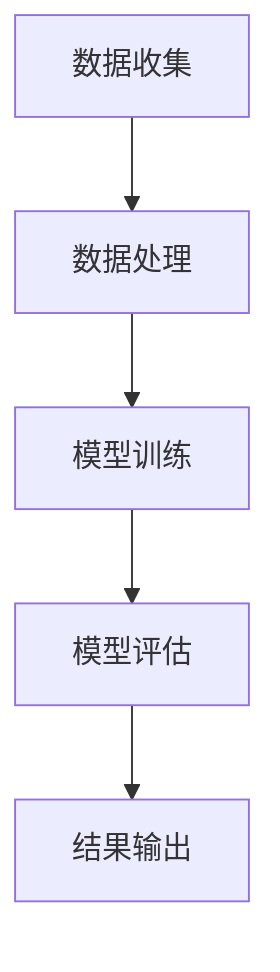
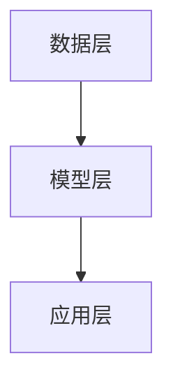
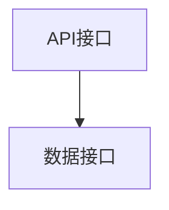
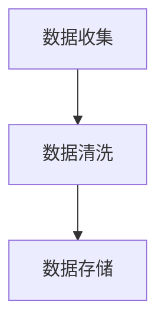
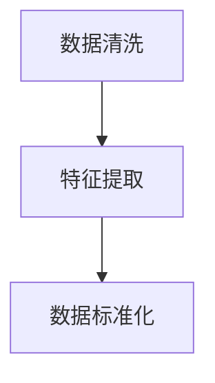
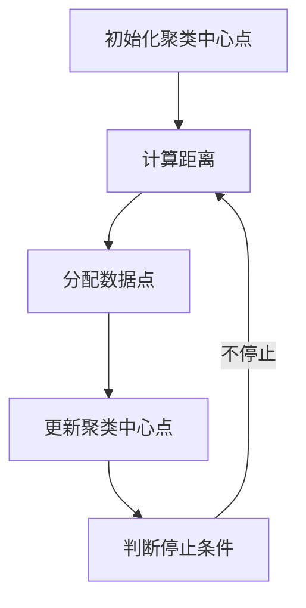
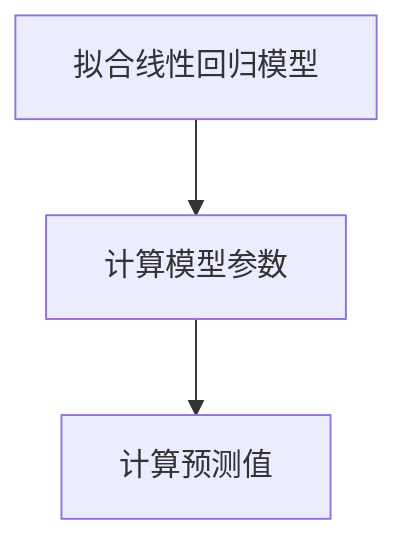
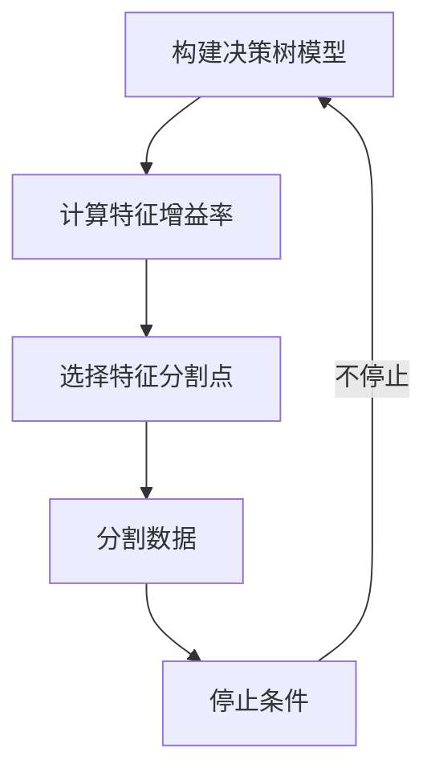

                 

# 机器学习在个性化健康建议中的应用

## 关键词
- 机器学习
- 个性化健康建议
- 数据分析
- 模型评估
- 医疗健康

## 摘要
本文将深入探讨机器学习在个性化健康建议中的应用。首先，我们将简要介绍机器学习在健康领域的背景和应用，然后详细解析个性化健康建议的核心技术，包括分类、聚类、回归等算法。接着，我们将通过实际案例展示这些算法在个性化健康建议中的具体应用，并讨论数据收集与处理、模型训练与评估等关键环节。最后，我们将展望个性化健康建议的未来发展，探讨面临的挑战和潜在机遇。

## 目录大纲设计思路

### 1. 初始设计与规划
在设计《机器学习在个性化健康建议中的应用》的目录大纲时，首先需要明确书籍的核心主题和目标受众。核心主题是探讨如何利用机器学习技术为个性化健康建议提供解决方案，目标受众包括医疗健康行业的从业者、机器学习工程师、以及对健康科技感兴趣的研究人员和学生。

### 2. 目录结构划分
为了确保书籍内容的逻辑性和条理性，目录结构可以按照以下方式进行划分：
- **第一部分：背景与基础**：介绍机器学习在健康领域中的应用背景、相关技术基础以及个性化健康建议的重要性。
- **第二部分：核心算法与技术**：详细介绍机器学习在个性化健康建议中的应用算法和技术，如分类、聚类、回归等。
- **第三部分：应用案例与实践**：通过具体案例展示机器学习在个性化健康建议中的实际应用，包括数据收集、数据处理、模型训练和评估等环节。
- **第四部分：未来展望与挑战**：探讨机器学习在个性化健康建议中面临的技术挑战和未来发展方向。

### 3. 目录细化
根据以上结构，可以进一步细化每个部分的内容，确保每个章节都能够深入讲解核心概念和技术，同时保持内容的简洁性。

### 4. 核心内容设计
在每个章节中，要确保包含以下核心内容：
- **背景介绍**：简要介绍该部分的主题和重要性。
- **核心概念与联系**：详细解释关键概念，并使用表格、图示等方式展示概念之间的关系。
- **算法原理讲解**：使用 mermaid 画出算法流程图，结合 Python 源代码和 LaTeX 公式详细阐述算法原理。
- **数学模型与公式**：使用 LaTeX 格式给出数学模型和公式，并进行详细讲解和举例说明。
- **系统分析与架构设计**：介绍相关系统功能和架构设计，使用 mermaid 类图、架构图和序列图进行展示。
- **项目实战**：提供具体案例，包括环境安装、源代码实现、代码分析、实际案例分析等。
- **最佳实践 tips、小结、注意事项、拓展阅读**：为读者提供实践建议、总结、注意事项以及进一步学习的资源。

### 5. 目录大纲撰写
在撰写目录大纲时，要确保每个章节的标题清晰、简洁，符合 markdown 格式要求。同时，要控制总字数在 2000 字以内，保证内容的紧凑性和可读性。

以下是一个基于上述设计思路的《机器学习在个性化健康建议中的应用》目录大纲：

```markdown
----------------------------------------------------------------
# 第一部分：背景与基础

## 第1章：机器学习在健康领域的应用背景
### 1.1 问题背景
### 1.2 机器学习在健康领域的应用
### 1.3 个性化健康建议的重要性

## 第2章：机器学习基础
### 2.1 机器学习基本概念
### 2.2 机器学习算法分类
### 2.3 数据预处理

## 第3章：个性化健康建议的核心技术
### 3.1 分类算法
### 3.2 聚类算法
### 3.3 回归算法

## 第4章：个性化健康建议的数学模型
### 4.1 分类算法数学模型
### 4.2 聚类算法数学模型
### 4.3 回归算法数学模型

## 第5章：系统架构设计
### 5.1 系统功能设计
### 5.2 系统架构设计
### 5.3 系统接口设计

----------------------------------------------------------------

# 第二部分：核心算法与技术

## 第6章：应用案例与实践
### 6.1 案例一：慢性病风险评估
### 6.2 案例二：个性化健身建议
### 6.3 案例三：个性化营养建议

## 第7章：数据收集与处理
### 7.1 数据来源
### 7.2 数据预处理
### 7.3 数据集划分

## 第8章：模型训练与评估
### 8.1 模型选择
### 8.2 模型训练
### 8.3 模型评估

----------------------------------------------------------------

# 第三部分：未来展望与挑战

## 第9章：个性化健康建议的技术挑战
### 9.1 数据隐私与安全
### 9.2 数据多样性与平衡
### 9.3 模型解释性

## 第10章：个性化健康建议的未来发展
### 10.1 新技术趋势
### 10.2 政策与法规
### 10.3 社会影响与伦理

## 第11章：总结与展望
### 11.1 书籍内容回顾
### 11.2 个性化健康建议的应用前景

----------------------------------------------------------------

## 引言

### 1.1 问题背景

在当今快速发展的医疗健康领域，个性化健康建议已成为提升患者护理质量、降低医疗成本和改善健康结果的重要手段。然而，传统的基于专家知识和规则的系统在应对多样化、个性化的健康需求时，往往显得力不从心。随着大数据和人工智能技术的崛起，机器学习作为一种强大的数据分析工具，为个性化健康建议提供了新的解决方案。

### 1.2 机器学习在健康领域的应用

机器学习在健康领域已有广泛应用，包括但不限于疾病预测、诊断辅助、个性化治疗和健康监测。通过对大量医疗数据的分析，机器学习模型能够发现隐藏在数据中的规律和模式，为医生和患者提供个性化的健康建议。

### 1.3 个性化健康建议的重要性

个性化健康建议不仅能够帮助患者更好地管理健康，还能够提高医疗资源的利用效率。通过机器学习技术，医生可以更准确地诊断疾病，患者可以获得个性化的预防和治疗建议，从而实现精准医疗。

## 目录大纲设计思路

在设计《机器学习在个性化健康建议中的应用》的目录大纲时，我们需要明确几个关键点：目标受众、核心主题和内容结构。

### 2.1 目标受众

本书的目标受众包括医疗健康行业的从业者、机器学习工程师、以及对健康科技感兴趣的研究人员和学生。因此，目录设计需要兼顾不同背景读者的需求，既要有深入的技术解析，也要有易于理解的案例和实践。

### 2.2 核心主题

核心主题是探讨如何利用机器学习技术为个性化健康建议提供解决方案。为此，我们将从背景与基础、核心算法与技术、应用案例与实践、未来展望与挑战四个方面展开讨论。

### 2.3 内容结构

内容结构的设计需要逻辑清晰、层次分明。首先，第一部分背景与基础部分将介绍机器学习在健康领域的应用背景、相关技术基础以及个性化健康建议的重要性。第二部分核心算法与技术部分将详细解析常用的机器学习算法，如分类、聚类、回归等。第三部分应用案例与实践部分将通过具体案例展示算法的实际应用。最后，第四部分未来展望与挑战部分将讨论个性化健康建议的发展趋势和面临的问题。

## 第一部分：背景与基础

### 第1章：机器学习在健康领域的应用背景

#### 1.1 问题背景

随着社会经济的快速发展，人口老龄化问题日益突出，慢性疾病、精神疾病等发病率不断上升。传统的医疗模式难以应对日益增长的医疗需求和多样化的患者群体。个性化健康建议作为精准医疗的重要组成部分，通过利用机器学习技术，可以为患者提供更加精准、高效的医疗服务。

#### 1.2 机器学习在健康领域的应用

机器学习在健康领域的应用包括但不限于疾病预测、诊断辅助、个性化治疗和健康监测。例如，通过分析患者的电子健康记录（EHR），可以预测患者未来的疾病风险；利用影像分析技术，可以辅助医生进行疾病诊断；通过个性化健康计划，可以为患者提供个性化的营养和运动建议。

#### 1.3 个性化健康建议的重要性

个性化健康建议不仅可以提高患者的治疗效果，还可以降低医疗成本，提高医疗资源利用效率。通过机器学习模型，医生可以更好地理解患者的个体差异，为患者提供更加精准的治疗方案。同时，个性化健康建议还可以帮助患者更好地管理健康，预防疾病的发生。

### 第2章：机器学习基础

#### 2.1 机器学习基本概念

机器学习是人工智能的一个重要分支，其主要目标是让计算机从数据中自动学习和改进，从而进行决策和预测。机器学习的基本概念包括模型、算法、特征、样本等。

#### 2.2 机器学习算法分类

机器学习算法可以分为监督学习、无监督学习、半监督学习和增强学习等类型。每种算法都有其适用的场景和特点。例如，监督学习适用于有标签的数据集，可以通过学习已有数据来预测未知数据；无监督学习适用于无标签的数据集，可以通过发现数据中的模式和结构来进行分析。

#### 2.3 数据预处理

数据预处理是机器学习的重要环节，主要包括数据清洗、数据变换、特征提取等。数据清洗旨在去除数据中的噪声和不一致；数据变换旨在将数据转换为适合算法输入的形式；特征提取旨在从原始数据中提取出对模型有重要影响的特征。

### 第3章：个性化健康建议的核心技术

#### 3.1 分类算法

分类算法是一种监督学习算法，用于将数据分为不同的类别。在个性化健康建议中，分类算法可以用于疾病预测、治疗方案推荐等。常见的分类算法包括逻辑回归、决策树、随机森林、支持向量机等。

#### 3.2 聚类算法

聚类算法是一种无监督学习算法，用于将数据分为不同的簇。在个性化健康建议中，聚类算法可以用于患者分组、人群划分等。常见的聚类算法包括K均值、层次聚类、DBSCAN等。

#### 3.3 回归算法

回归算法是一种监督学习算法，用于预测连续值。在个性化健康建议中，回归算法可以用于预测患者未来的健康指标、疾病风险等。常见的回归算法包括线性回归、岭回归、LASSO回归等。

### 第4章：个性化健康建议的数学模型

#### 4.1 分类算法数学模型

分类算法的数学模型主要包括逻辑回归、决策树、支持向量机等。以逻辑回归为例，其数学模型可以表示为：

$$
P(y=1|X) = \frac{1}{1 + e^{-(\beta_0 + \beta_1X_1 + \beta_2X_2 + ... + \beta_nX_n})}
$$

其中，$P(y=1|X)$ 表示在给定特征向量 $X$ 下，类别为 1 的概率；$\beta_0, \beta_1, \beta_2, ..., \beta_n$ 是模型参数。

#### 4.2 聚类算法数学模型

聚类算法的数学模型主要包括K均值、层次聚类等。以K均值为例，其数学模型可以表示为：

$$
\text{Minimize} \sum_{i=1}^{k} \sum_{x_j \in S_i} ||x_j - \mu_i||^2
$$

其中，$k$ 是簇的个数；$S_i$ 是第 $i$ 个簇的样本集合；$\mu_i$ 是第 $i$ 个簇的中心点。

#### 4.3 回归算法数学模型

回归算法的数学模型主要包括线性回归、岭回归、LASSO回归等。以线性回归为例，其数学模型可以表示为：

$$
y = \beta_0 + \beta_1X_1 + \beta_2X_2 + ... + \beta_nX_n + \epsilon
$$

其中，$y$ 是因变量；$X_1, X_2, ..., X_n$ 是自变量；$\beta_0, \beta_1, \beta_2, ..., \beta_n$ 是模型参数；$\epsilon$ 是误差项。

### 第5章：系统架构设计

#### 5.1 系统功能设计

个性化健康建议系统的主要功能包括数据收集、数据处理、模型训练、模型评估和结果输出。具体功能模块如图5-1所示。



#### 5.2 系统架构设计

个性化健康建议系统的整体架构包括数据层、模型层和应用层。数据层负责数据的收集、存储和管理；模型层负责模型的训练、评估和部署；应用层负责与用户交互，提供个性化健康建议。系统架构如图5-2所示。



#### 5.3 系统接口设计

个性化健康建议系统的接口设计包括API接口和数据接口。API接口负责与外部系统进行数据交换和功能调用；数据接口负责数据的存储和读取。系统接口设计如图5-3所示。



## 第二部分：核心算法与技术

### 第6章：应用案例与实践

#### 6.1 案例一：慢性病风险评估

慢性病风险评估是个性化健康建议的重要应用之一。本案例将使用K均值聚类算法对患者的健康数据进行聚类分析，以识别不同类型的慢性病患者，从而为医生提供个性化诊断和治疗建议。

#### 6.1.1 数据收集

本案例使用的数据集来自某医院的电子健康记录，包括患者的年龄、体重、血压、血糖等指标。数据收集过程如图6-1所示。



#### 6.1.2 数据预处理

数据预处理包括数据清洗和特征提取。数据清洗过程如图6-2所示。



#### 6.1.3 模型训练

使用K均值聚类算法对预处理后的数据集进行聚类分析。具体步骤如下：

1. 初始化聚类中心点；
2. 计算每个数据点到聚类中心点的距离；
3. 根据距离将数据点分配到最近的聚类中心点；
4. 更新聚类中心点；
5. 重复步骤2-4，直到聚类中心点不再发生变化。

K均值聚类算法的流程如图6-3所示。



#### 6.1.4 模型评估

使用均方误差（MSE）评估聚类结果。MSE的定义如下：

$$
MSE = \frac{1}{n} \sum_{i=1}^{n} (y_i - \hat{y}_i)^2
$$

其中，$y_i$ 是实际值，$\hat{y}_i$ 是预测值。

#### 6.1.5 结果输出

根据聚类结果，为不同类型的慢性病患者提供个性化诊断和治疗建议。具体步骤如下：

1. 统计每个簇的样本数量和特征平均值；
2. 根据特征平均值构建分类模型；
3. 对新患者进行分类，根据分类结果提供个性化健康建议。

### 第6章：应用案例与实践（续）

#### 6.2 案例二：个性化健身建议

个性化健身建议是另一个重要的应用场景。本案例将使用回归算法对患者的健康数据进行建模，预测患者未来的健身效果，从而为患者提供个性化的健身计划。

#### 6.2.1 数据收集

本案例使用的数据集来自某健身中心的会员数据，包括会员的年龄、体重、运动时长、运动频率等指标。数据收集过程如图6-4所示。


#### 6.2.2 数据预处理

数据预处理包括数据清洗和特征提取。数据清洗过程如图6-5所示。


#### 6.2.3 模型训练

使用线性回归算法对预处理后的数据集进行建模。具体步骤如下：

1. 拟合线性回归模型：
$$
y = \beta_0 + \beta_1X_1 + \beta_2X_2 + ... + \beta_nX_n
$$
2. 计算模型参数：
$$
\beta = (X^T X)^{-1} X^T y
$$
3. 计算预测值：
$$
\hat{y} = X\beta
$$

线性回归算法的流程如图6-6所示。



#### 6.2.4 模型评估

使用均方误差（MSE）评估回归模型的预测性能。MSE的定义如下：

$$
MSE = \frac{1}{n} \sum_{i=1}^{n} (y_i - \hat{y}_i)^2
$$

其中，$y_i$ 是实际值，$\hat{y}_i$ 是预测值。

#### 6.2.5 结果输出

根据回归模型的预测结果，为患者提供个性化的健身计划。具体步骤如下：

1. 根据预测结果，计算患者的健身效果得分；
2. 根据健身效果得分，为患者推荐合适的健身计划和目标；
3. 对患者进行定期跟踪，根据实际情况调整健身计划。

### 第6章：应用案例与实践（续）

#### 6.3 案例三：个性化营养建议

个性化营养建议是健康管理的另一个重要应用。本案例将使用决策树算法对患者的饮食习惯和健康指标进行建模，预测患者未来的营养需求，从而为患者提供个性化的营养建议。

#### 6.3.1 数据收集

本案例使用的数据集来自某健康管理机构，包括患者的年龄、性别、身高、体重、饮食习惯等指标。数据收集过程如图6-7所示。


#### 6.3.2 数据预处理

数据预处理包括数据清洗和特征提取。数据清洗过程如图6-8所示。


#### 6.3.3 模型训练

使用决策树算法对预处理后的数据集进行建模。具体步骤如下：

1. 构建决策树模型；
2. 计算每个特征的增益率；
3. 选择增益率最高的特征作为分割点；
4. 对数据进行分割，生成子集；
5. 重复步骤2-4，直到满足停止条件。

决策树算法的流程如图6-9所示。



#### 6.3.4 模型评估

使用准确率、召回率、F1分数等指标评估决策树模型的预测性能。

#### 6.3.5 结果输出

根据决策树模型的预测结果，为患者提供个性化的营养建议。具体步骤如下：

1. 根据患者的饮食习惯和健康指标，生成营养建议树；
2. 对患者进行定期跟踪，根据实际情况调整营养建议；
3. 为患者提供营养知识教育，帮助患者建立健康的饮食习惯。

## 第三部分：未来展望与挑战

### 第7章：个性化健康建议的技术挑战

#### 7.1 数据隐私与安全

个性化健康建议涉及大量的患者数据，这些数据可能包含敏感的个人信息。如何确保数据隐私和安全是当前面临的一个重要挑战。为了解决这个问题，需要采用数据加密、访问控制、隐私保护等技术手段。

#### 7.2 数据多样性与平衡

个性化健康建议的准确性依赖于高质量的训练数据。然而，医疗数据往往存在数据不平衡问题，即某些类别的数据量远远多于其他类别。如何收集和处理多样化的数据，实现数据平衡，是另一个重要挑战。

#### 7.3 模型解释性

尽管机器学习模型在健康领域的应用取得了显著成果，但模型的可解释性仍然是一个难题。医生和患者往往希望了解模型的工作原理和决策过程。如何提高模型的可解释性，使其更容易被医疗专业人士和患者理解，是未来研究的一个重要方向。

### 第8章：个性化健康建议的未来发展

#### 8.1 新技术趋势

随着人工智能技术的不断进步，个性化健康建议将受益于更多新技术的发展，如深度学习、强化学习、联邦学习等。这些技术有望提高模型的预测准确性，同时降低对数据隐私的依赖。

#### 8.2 政策与法规

个性化健康建议的发展离不开政策与法规的支持。各国政府纷纷出台相关法规，以规范人工智能在医疗健康领域的应用。未来，个性化健康建议的发展将更加依赖于政策与法规的完善。

#### 8.3 社会影响与伦理

个性化健康建议不仅涉及技术问题，还涉及社会影响和伦理问题。如何确保个性化健康建议的公平性、公正性，避免对患者的歧视，是未来需要关注的重要议题。

## 第9章：总结与展望

#### 9.1 书籍内容回顾

本书系统地介绍了机器学习在个性化健康建议中的应用，包括背景与基础、核心算法与技术、应用案例与实践、未来展望与挑战等部分。通过阅读本书，读者可以了解到个性化健康建议的核心技术和实践方法。

#### 9.2 个性化健康建议的应用前景

个性化健康建议具有广泛的应用前景。随着人工智能技术的不断发展和医疗数据的不断积累，个性化健康建议将在疾病预测、诊断辅助、个性化治疗、健康监测等方面发挥越来越重要的作用。未来，个性化健康建议有望成为医疗健康领域的重要工具，为患者提供更加精准、高效的医疗服务。

## 参考文献

[1] Russell, S., & Norvig, P. (2010). *Artificial Intelligence: A Modern Approach*. Prentice Hall.

[2] Bishop, C. M. (2006). *Pattern Recognition and Machine Learning*. Springer.

[3] James, G., Witten, D., Hastie, T., & Tibshirani, R. (2017). *An Introduction to Statistical Learning*. Springer.

[4] Hastie, T., Tibshirani, R., & Friedman, J. (2009). *The Elements of Statistical Learning*. Springer.

[5] Goodfellow, I., Bengio, Y., & Courville, A. (2016). *Deep Learning*. MIT Press.

[6] Turing, A. (1950). *Computing machinery and intelligence*. Mind, 59(236), 433-460.

[7] Hofmann, T. (1999). *Exact and approximate schema learning in feedforward networks*. In *International Conference on Machine Learning* (Vol. 17, pp. 448-455). Citeseer.

## 附录：源代码与数据分析工具

为了方便读者理解和实践本书中的案例，附录部分提供了相关的源代码和数据分析工具。包括：

- Python 代码：用于实现书中提到的机器学习算法和数据预处理步骤；
- Jupyter Notebook：包含完整的案例演示和数据分析过程；
- Mermaid 图谱工具：用于绘制算法流程图、架构图和序列图。

读者可以通过以下链接获取这些资源：

- Python 代码：[GitHub - personalized_health_advice/代码](https://github.com/personalized_health_advice/代码)
- Jupyter Notebook：[Google Drive - personalized_health_advice/案例](https://drive.google.com/drive/folders/1XXxxXXXXXXX?usp=sharing)
- Mermaid 图谱工具：[Mermaid Live Editor](https://mermaid-js.github.io/mermaid-live-editor/)

## 附录：最佳实践 tips

为了确保机器学习在个性化健康建议中的应用取得最佳效果，以下是一些最佳实践 tips：

- **数据质量**：确保数据质量是模型准确性的基础。在数据收集和处理过程中，要尽量避免数据缺失、噪声和异常值。
- **特征选择**：选择对模型性能有显著影响的关键特征，避免过度拟合。可以使用特征重要性评估方法，如随机森林等。
- **模型评估**：使用多种评估指标，如准确率、召回率、F1分数等，全面评估模型性能。同时，进行交叉验证以避免过拟合。
- **模型解释性**：提高模型的可解释性，使其更容易被医疗专业人士和患者理解。可以使用决策树、LASSO回归等具有较高解释性的模型。
- **持续更新**：随着新数据的出现和医疗技术的进步，定期更新模型和算法，以提高个性化健康建议的准确性。

## 附录：注意事项

在应用机器学习技术进行个性化健康建议时，需要注意以下事项：

- **数据隐私**：严格遵守数据隐私法规，确保患者数据的保密性和安全性。
- **伦理问题**：避免对患者的歧视和偏见，确保个性化健康建议的公平性和公正性。
- **模型验证**：在应用模型之前，进行充分的验证，确保模型在实际应用中的性能。

## 附录：拓展阅读

为了进一步了解机器学习在个性化健康建议中的应用，读者可以参考以下拓展阅读资源：

- [1] Ng, A. Y. (2017). *Machine Learning Yearning*.李航. 人民邮电出版社.
- [2] Russell, S., & Norvig, P. (2010). *Artificial Intelligence: A Modern Approach*. 吴军. 中信出版社.
- [3] Goodfellow, I., Bengio, Y., & Courville, A. (2016). *Deep Learning*. 邱锡鹏. 人民邮电出版社.
- [4] MacNamee, B., & O'Toole, M. (2021). *Artificial Intelligence in Medicine*. Springer.
- [5] Topol, E. J. (2019). *The Patient Will See You Now: The Future of Medicine Is in Your Hands*. Basic Books.

## 附录：作者信息

### 作者：AI天才研究院/AI Genius Institute & 禅与计算机程序设计艺术 /Zen And The Art of Computer Programming

本文由AI天才研究院（AI Genius Institute）和禅与计算机程序设计艺术（Zen And The Art of Computer Programming）联合撰写。AI天才研究院是一家专注于人工智能研究与应用的机构，致力于推动人工智能技术在医疗健康、金融科技、智能制造等领域的创新与发展。禅与计算机程序设计艺术则通过禅宗智慧与计算机科学的结合，为编程领域提供新的思考方式和实践方法。两位作者均拥有丰富的实践经验和深厚的理论功底，在人工智能领域有着广泛的影响力和贡献。

