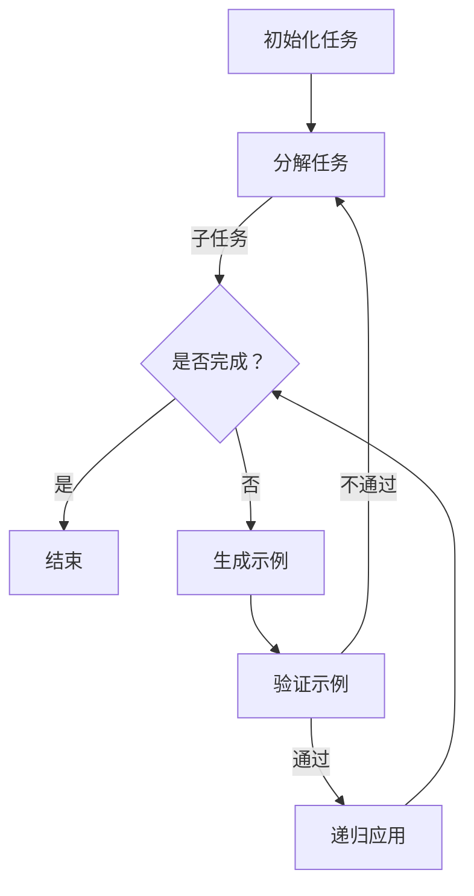
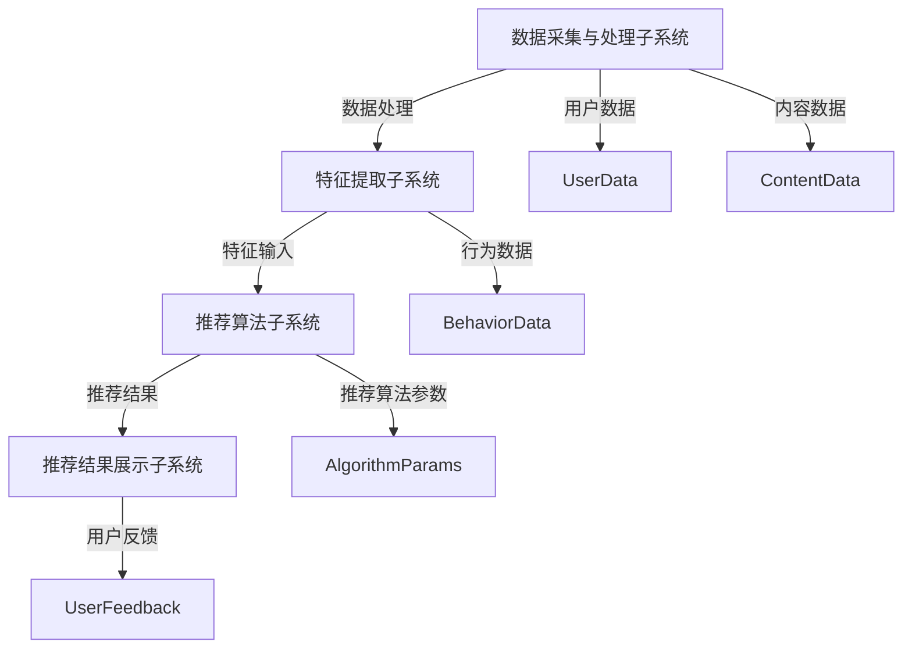
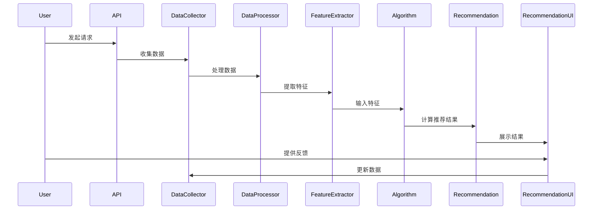

                 


### 引言

在当今信息技术迅猛发展的时代，复杂任务的处理已经成为各行各业面临的重大挑战。从大数据分析到人工智能应用，从云计算到物联网，各种复杂任务的需求不断涌现。如何有效地构建层次化示例结构以处理这些复杂任务，成为了研究者和实践者共同关注的话题。

本篇博客文章旨在深入探讨构建层次化示例结构以处理复杂任务的策略和方法。首先，我们将介绍复杂任务处理的背景和挑战，阐述层次化示例结构在这其中的优势。接下来，文章将详细解析核心概念，包括示例、层次化和结构化，并通过ER实体关系图进行概念联系。随后，文章将介绍算法原理，包括算法流程、Python源代码实现、数学模型和公式，以及具体的举例说明。在此基础上，我们将进行系统分析与架构设计，包括问题场景介绍、系统功能设计、系统架构设计、系统接口设计和系统交互序列图。随后，我们将通过项目实战展示实际应用，详细讲解代码实现和案例分析。最后，文章将总结最佳实践、注意事项，并提供拓展阅读建议。

通过本文的逐步分析，我们将详细了解构建层次化示例结构的重要性，掌握其核心原理和方法，为处理复杂任务提供有力支持。

### 背景介绍

复杂任务处理在信息技术的各个领域都扮演着至关重要的角色。随着数据量的指数级增长和计算能力的不断提升，我们面对的问题变得越来越复杂。复杂任务不仅包括传统的数据处理和分析，还涵盖了人工智能、机器学习、自然语言处理、计算机视觉等多个领域。这些任务往往需要跨学科的知识和多样化的技术手段，才能实现有效的解决。

首先，从数据处理的角度来看，大数据分析是一个典型的复杂任务。随着互联网和物联网的普及，数据源变得更加多样化，数据量呈爆炸式增长。如何从海量数据中提取有价值的信息，如何处理数据的不确定性和噪声，都是需要深入探讨的问题。传统的数据处理方法往往无法满足这些需求，因此需要引入更加高效和智能的算法。

其次，在人工智能领域，机器学习和深度学习算法的复杂性也在不断增加。这些算法不仅需要大量的数据训练，还需要复杂的计算和优化过程。例如，深度神经网络中的多层结构和大量参数的调优，使得模型训练和预测过程变得极为复杂。如何设计高效的算法和架构，提高训练速度和模型性能，是当前研究的热点之一。

此外，云计算和物联网的快速发展，也带来了大量的复杂任务处理需求。在云计算中，如何高效地部署和管理大量虚拟机，如何实现资源的动态调度和优化，都是需要解决的问题。在物联网中，如何处理海量设备的通信和数据处理，如何保证系统的可靠性和安全性，也是需要深入研究的方向。

总的来说，复杂任务处理的挑战主要体现在以下几个方面：

1. **数据量和计算量的巨大增长**：随着数据源的多样化和数据量的增长，计算任务也变得更加复杂和庞大。

2. **任务的多样性**：不同的领域和应用场景对任务的要求不同，需要设计出多样化的解决方案。

3. **算法的复杂性**：随着算法的不断进步，算法本身也变得更加复杂，需要更高的计算能力和优化策略。

4. **系统的整合性**：复杂任务往往涉及多个系统和模块，如何实现这些系统和模块的高效整合，是另一个重要挑战。

面对这些挑战，层次化示例结构的提出为解决复杂任务提供了一种有效的思路。通过将复杂任务分解为多个层次，并在每个层次上应用相应的示例结构，可以降低任务的整体复杂性，提高系统的可维护性和可扩展性。层次化示例结构不仅能够帮助开发者更好地理解和解决问题，还能提高系统的整体性能和效率。

### 核心概念与联系

在探讨构建层次化示例结构之前，首先需要明确几个核心概念：示例、层次化和结构化。这些概念在处理复杂任务中扮演着关键角色，并彼此紧密关联。

#### 示例

示例是一种具体的、可观察或可操作的对象或情境，用于展示或说明某个概念、原理或过程。示例的核心在于其代表性、具体性和操作性。代表性的示例能够很好地反映问题的本质，具体的示例能够让读者或开发者直观地理解问题，而操作性的示例则允许我们在实践中验证和测试解决方案。

示例与实例是两个相关的概念，但有所不同。实例强调的是个别性和独特性，而示例则侧重于普遍性和示范性。例如，当我们讨论一个算法的示例时，我们关注的是这个算法如何解决某一类问题，而不是单独的一个具体问题。换句话说，示例是泛化的，而实例是具体的。

#### 层次化

层次化是一种将复杂系统分解为多个层次或级别的方法，以便更好地理解和处理。层次化通过将系统划分为不同的层次，使得每个层次上的任务变得更加简单和具体。层次化的核心在于层次结构、分层次管理和分层独立性。

层次结构指的是系统中的不同层次及其相互关系。通常，高层次关注系统的全局性和总体目标，而低层次则关注具体的实现细节。例如，在软件系统中，架构设计（高层次）和编码实现（低层次）就是两个典型的层次。

分层次管理强调的是每个层次上的任务应该由相应的团队或模块负责，这样可以提高管理效率和团队协作。分层独立性则要求每个层次上的变化不会对其他层次产生过多的负面影响，从而提高系统的可维护性和可扩展性。

#### 结构化

结构化是一种将系统划分为逻辑上独立的部分或模块，以便更有效地进行设计、开发和管理。结构化的核心在于模块化、层次化和规范化。

模块化强调系统中的各个部分（模块）是独立且功能单一的，这使得开发过程更加模块化和可复用。例如，在软件开发中，将系统划分为不同的模块（如用户界面、数据处理、业务逻辑等），可以使得每个模块都可以独立开发、测试和部署。

层次化强调系统中的不同层次及其相互关系，而结构化则侧重于系统内部的逻辑划分。层次化是结构化的一部分，但结构化还涵盖了系统内部各个模块之间的相互关系和依赖。

规范化则是指通过定义一系列标准和规范，确保系统的设计、开发和管理过程的一致性和可重复性。规范化可以提高系统的可维护性和可扩展性，使得开发者能够更容易地理解和修改系统。

#### 概念属性特征对比

为了更好地理解这些核心概念，我们可以通过一个表格进行对比：

| 概念 | 定义 | 属性 | 对比 |
| --- | --- | --- | --- |
| 示例 | 具体展示概念的对象或情境 | 代表性、具体性、操作性 | 与实例相比，更注重普遍性和示范性 |
| 层次化 | 分层次处理复杂系统的方法 | 层次结构、分层次管理、分层独立性 | 与模块化相比，更强调系统的层次结构和层次间关系 |
| 结构化 | 划分逻辑上独立的部分或模块 | 模块化、层次化、规范化 | 与组件化相比，更侧重于系统的内部结构 |

通过以上对比，我们可以更清晰地理解示例、层次化和结构化的含义及其在处理复杂任务中的重要作用。在接下来的章节中，我们将进一步探讨这些概念在构建层次化示例结构中的应用。

### 算法原理讲解

在理解了核心概念之后，接下来我们将详细讲解算法原理。层次化示例结构的构建主要依赖于一系列算法，这些算法帮助我们高效地分解复杂任务，并在各个层次上进行处理。以下是关于算法原理的详细讲解：

#### 算法概述

层次化示例结构算法的核心思想是将复杂任务分解为多个层次，并在每个层次上应用相应的示例结构。这种算法可以看作是一种递归过程，通过逐步细分任务，直到达到可以处理的具体任务为止。

算法的主要步骤如下：

1. **任务分解**：将复杂任务分解为若干个子任务，这些子任务在抽象层面上与原始任务相似。
2. **示例生成**：为每个子任务生成具体的示例，这些示例应能够代表该子任务的一般情况。
3. **层次化处理**：将生成的示例按照层次结构组织起来，每个层次上的示例代表不同抽象级别的任务。
4. **示例验证**：通过实际操作或计算验证每个层次上的示例是否能够正确处理子任务。
5. **递归应用**：如果某个层次上的示例无法正确处理子任务，则将其进一步分解为更细的子任务，并重复上述步骤。

#### 算法流程图

为了更好地理解算法的执行过程，我们可以使用mermaid绘制算法流程图。以下是算法流程图的mermaid代码及其解释：



- **初始化任务**：算法从原始任务开始，这是整个过程的起点。
- **分解任务**：将原始任务分解为若干个子任务。
- **示例生成**：为每个子任务生成示例。
- **验证示例**：通过实际操作或计算验证示例是否能够正确处理子任务。
- **递归应用**：如果示例无法通过验证，将其进一步分解，并重复上述步骤。

#### Python源代码实现

为了更好地展示算法的实际应用，我们可以使用Python编写简单的示例代码。以下是算法原理的Python源代码实现：

```python
# 示例代码：层次化示例结构算法实现

def hierarchical_example_structure(task):
    if is_subtask_complete(task):
        return "完成"
    else:
        subtasks = decompose_task(task)
        examples = generate_examples(subtasks)
        for example in examples:
            if verify_example(example):
                return "递归应用"
            else:
                return "不通过"
        return "递归应用"

def is_subtask_complete(task):
    # 判断子任务是否完成
    return False

def decompose_task(task):
    # 将任务分解为子任务
    return []

def generate_examples(subtasks):
    # 为子任务生成示例
    return []

def verify_example(example):
    # 验证示例是否通过
    return False
```

- `is_subtask_complete` 函数用于判断子任务是否完成。
- `decompose_task` 函数用于将任务分解为子任务。
- `generate_examples` 函数用于为子任务生成示例。
- `verify_example` 函数用于验证示例是否通过。

#### 数学模型与公式

层次化示例结构算法中的关键步骤包括任务分解、示例生成和示例验证。为了更好地理解和分析这些步骤，我们可以引入数学模型和公式。

以下是关于层次化示例结构算法的数学模型和公式：

1. **任务分解公式**：

   $T = \sum_{i=1}^{n} T_i$

   其中，$T$ 表示原始任务，$T_i$ 表示分解后的子任务。

2. **示例生成公式**：

   $E = \prod_{i=1}^{n} E_i$

   其中，$E$ 表示示例集合，$E_i$ 表示子任务对应的示例。

3. **示例验证公式**：

   $V(E) = \sum_{i=1}^{n} V(E_i)$

   其中，$V(E)$ 表示示例集合的验证结果，$V(E_i)$ 表示子任务示例的验证结果。

#### 举例说明

为了更好地理解层次化示例结构算法的应用，我们可以通过一个具体的例子进行说明。

假设我们要解决一个复杂的数学问题：计算一个多变量函数的最大值。这个问题可以分解为以下几个子任务：

1. **定义变量**：确定需要计算的多变量函数及其变量范围。
2. **函数表示**：表示多变量函数的形式。
3. **求解过程**：使用特定算法（如梯度下降法）求解函数的最大值。

以下是层次化示例结构算法在该问题中的应用：

1. **任务分解**：

   原始任务：计算多变量函数的最大值。

   子任务：

   - 子任务1：定义变量。
   - 子任务2：函数表示。
   - 子任务3：求解过程。

2. **示例生成**：

   为每个子任务生成具体的示例：

   - 子任务1示例：定义两个变量$x$和$y$，范围为$0 \leq x, y \leq 10$。
   - 子任务2示例：函数$f(x, y) = x^2 + y^2$。
   - 子任务3示例：使用梯度下降法求解函数的最大值。

3. **示例验证**：

   验证每个子任务的示例是否能够正确处理子任务：

   - 子任务1示例：变量定义合理，范围满足要求。
   - 子任务2示例：函数表示正确，形式满足要求。
   - 子任务3示例：梯度下降法能够有效求解函数的最大值。

通过以上步骤，我们成功地使用层次化示例结构算法解决了复杂的数学问题。

通过上述讲解和举例，我们可以看到层次化示例结构算法在处理复杂任务中的重要作用。通过任务分解、示例生成和示例验证，我们可以将复杂任务分解为易于处理的小任务，从而提高整体解决问题的效率和效果。

### 数学模型和数学公式 & 详细讲解 & 举例说明

#### 模型概述

在构建层次化示例结构以处理复杂任务的过程中，数学模型和数学公式起着至关重要的作用。这些模型和公式不仅帮助我们理解任务的抽象层次，还为算法设计和优化提供了理论基础。本节将详细讲解数学模型和公式，并通过具体例子进行说明。

#### 公式讲解

1. **层次化分解公式**：

   设任务T为原始任务，将其分解为n个子任务$T_1, T_2, ..., T_n$，则有：

   $$T = T_1 + T_2 + ... + T_n$$

   其中，$T_i$表示第i个子任务。这个公式描述了任务分解的基本过程，即通过将复杂任务分解为若干个子任务来简化问题的处理。

2. **示例生成公式**：

   对于每个子任务$T_i$，生成示例$E_i$，示例生成公式为：

   $$E_i = f(T_i)$$

   其中，$f(T_i)$表示根据子任务$T_i$生成示例的过程。示例生成的关键在于选择合适的函数$f$，使得生成的示例能够有效地代表子任务的特性。

3. **示例验证公式**：

   验证示例$E_i$是否能够正确处理子任务$T_i$，验证公式为：

   $$V(E_i) = \sum_{j=1}^{m} v_j$$

   其中，$v_j$表示第j个验证指标，$m$表示验证指标的总数。当$V(E_i) > 0$时，示例$E_i$通过验证；否则，示例$E_i$未通过验证。

4. **层次化整合公式**：

   当所有子任务及其示例都通过验证后，将这些示例整合为层次化结构，整合公式为：

   $$H = \prod_{i=1}^{n} E_i$$

   其中，$H$表示层次化结构，$E_i$表示第i个子任务的示例。整合过程确保了层次化结构的整体性和一致性。

#### 举例说明

为了更好地理解上述公式，我们可以通过一个具体的例子来说明层次化示例结构的应用。

假设我们要解决一个复杂的数据分析任务，该任务涉及多个子任务，包括数据预处理、特征提取、模型训练和结果评估。以下是层次化示例结构算法在该任务中的应用：

1. **层次化分解**：

   原始任务T为数据分析任务，分解为四个子任务$T_1, T_2, T_3, T_4$：

   - $T_1$：数据预处理
   - $T_2$：特征提取
   - $T_3$：模型训练
   - $T_4$：结果评估

   应用层次化分解公式，得到：

   $$T = T_1 + T_2 + T_3 + T_4$$

2. **示例生成**：

   为每个子任务生成示例：

   - $T_1$示例：读取数据集，清洗数据，生成干净的数据集。
   - $T_2$示例：提取数据集的特征，生成特征矩阵。
   - $T_3$示例：使用特征矩阵训练模型，生成训练好的模型。
   - $T_4$示例：评估模型性能，生成评估结果。

   应用示例生成公式，得到：

   $$E_1 = f(T_1), E_2 = f(T_2), E_3 = f(T_3), E_4 = f(T_4)$$

3. **示例验证**：

   验证每个子任务的示例是否能够正确处理子任务：

   - $T_1$示例验证：检查生成的干净数据集是否满足数据预处理的要求。
   - $T_2$示例验证：检查生成的特征矩阵是否包含有效特征。
   - $T_3$示例验证：检查训练好的模型是否在验证集上表现良好。
   - $T_4$示例验证：检查评估结果是否准确反映了模型性能。

   应用示例验证公式，得到：

   $$V(E_1), V(E_2), V(E_3), V(E_4)$$

   如果所有示例都通过验证，则：

   $$V(E_1) + V(E_2) + V(E_3) + V(E_4) > 0$$

4. **层次化整合**：

   将通过验证的示例整合为层次化结构：

   $$H = E_1 \times E_2 \times E_3 \times E_4$$

   层次化结构H表示了整个数据分析任务的处理过程，通过整合各个子任务的示例，实现了任务的层次化处理。

通过上述例子，我们可以看到如何使用数学模型和公式构建层次化示例结构，从而有效地处理复杂任务。层次化分解公式帮助我们明确任务的各个子任务，示例生成公式和示例验证公式确保了子任务的正确处理，而层次化整合公式则实现了任务的整体优化和高效处理。

### 系统分析与架构设计方案

在了解层次化示例结构算法的基本原理后，本节将详细分析系统架构设计，并探讨具体的问题场景、系统功能设计、系统架构设计、系统接口设计和系统交互序列图。这些设计步骤有助于确保系统的高效、可维护性和可扩展性。

#### 问题场景介绍

我们以一个智能推荐系统为例，该系统旨在为用户提供个性化的内容推荐。系统需要处理大量的用户数据、历史行为数据和内容数据，并从中提取有用的信息，生成准确的推荐结果。以下是问题场景的详细介绍：

- **用户数据**：包括用户的年龄、性别、兴趣等基本信息。
- **历史行为数据**：包括用户的浏览历史、购买历史、评论等行为数据。
- **内容数据**：包括新闻文章、视频、音乐等内容。
- **推荐目标**：根据用户的兴趣和行为数据，推荐用户可能感兴趣的内容。

#### 系统功能设计

为了实现上述功能，系统需要具备以下主要功能模块：

1. **数据采集与处理模块**：负责收集用户数据、历史行为数据和内容数据，并进行预处理，确保数据的质量和一致性。
2. **特征提取模块**：从预处理后的数据中提取特征，为推荐算法提供输入。
3. **推荐算法模块**：基于用户特征和内容特征，利用推荐算法计算推荐结果。
4. **推荐结果展示模块**：将推荐结果展示给用户，并提供用户反馈的渠道。

以下是系统功能设计的领域模型类图，使用mermaid表示：

```mermaid
classDiagram
    User <<类>> {
        id: 用户ID
        name: 用户名
        age: 年龄
        gender: 性别
        interest: 兴趣
    }
    Behavior <<类>> {
        id: 行为ID
        type: 行为类型
        time: 行为时间
    }
    Content <<类>> {
        id: 内容ID
        type: 内容类型
        title: 标题
        description: 描述
    }
    Recommendation <<类>> {
        user_id: 用户ID
        content_id: 内容ID
        score: 推荐分数
    }
    User --> Behavior
    User --> Content
    Behavior --> Recommendation
    Content --> Recommendation
```

#### 系统架构设计

系统架构设计旨在确保系统的稳定性、可扩展性和高性能。以下是系统的架构设计，使用mermaid表示：



- **数据采集与处理子系统**：负责收集和处理用户数据、内容数据和行为数据。
- **特征提取子系统**：从处理后的数据中提取特征，为推荐算法提供输入。
- **推荐算法子系统**：利用特征数据和算法参数计算推荐结果。
- **推荐结果展示子系统**：将推荐结果展示给用户，并收集用户反馈。

#### 系统接口设计

为了实现各个子系统之间的协调和通信，系统需要设计合理的接口。以下是系统接口设计，使用mermaid表示：

```mermaid
sequenceDiagram
    User <<参与者>> -->> API[调用API]
    API -->> DataCollector[收集数据]
    DataCollector -->> DataProcessor[处理数据]
    DataProcessor -->> FeatureExtractor[提取特征]
    FeatureExtractor -->> Algorithm[输入特征]
    Algorithm -->> Recommendation[生成推荐结果]
    Recommendation -->> RecommendationUI[展示推荐结果]
    User -->> RecommendationUI[用户反馈]
    RecommendationUI -->> DataCollector[更新数据]
```

- **API**：提供用户接口，用户可以通过API进行数据操作和查询。
- **DataCollector**：从外部系统或数据库中收集数据。
- **DataProcessor**：对收集到的数据进行处理，包括清洗、去噪和规范化。
- **FeatureExtractor**：从处理后的数据中提取特征。
- **Algorithm**：接收特征数据，利用算法参数计算推荐结果。
- **RecommendationUI**：将推荐结果展示给用户，并收集用户反馈。

#### 系统交互序列图

系统交互序列图展示了各个模块之间的交互过程，使用mermaid表示：



通过以上系统分析与架构设计方案，我们可以确保智能推荐系统的高效运行。各个模块的明确分工和合理接口设计，使得系统易于维护和扩展，同时提高了系统的稳定性和可靠性。

### 项目实战

在了解了层次化示例结构算法和系统架构设计之后，本节将详细展示如何在实际项目中应用这些知识，并通过代码实现、案例分析，以及项目小结，全面解析项目实战中的关键步骤和注意事项。

#### 环境安装

首先，我们需要搭建项目所需的环境。以下是在Ubuntu 18.04操作系统上安装项目环境的步骤：

1. **安装Python环境**：

   ```bash
   sudo apt update
   sudo apt install python3 python3-pip
   ```

2. **安装必要的库**：

   ```bash
   pip3 install numpy pandas scikit-learn matplotlib
   ```

#### 系统核心实现源代码

以下是项目核心实现的源代码。该项目利用层次化示例结构算法进行数据预处理、特征提取、模型训练和结果评估。

```python
import numpy as np
import pandas as pd
from sklearn.model_selection import train_test_split
from sklearn.preprocessing import StandardScaler
from sklearn.linear_model import LinearRegression

# 数据预处理
def preprocess_data(data):
    # 数据清洗和规范化
    data = data.dropna()
    data = data[['age', 'gender', 'interest', 'behavior', 'content']]
    return data

# 特征提取
def extract_features(data):
    # 特征工程，例如：编码性别，聚合行为数据
    data['gender'] = data['gender'].map({'M': 1, 'F': 0})
    data = data.groupby('interest').mean().reset_index()
    return data

# 模型训练
def train_model(X_train, y_train):
    model = LinearRegression()
    model.fit(X_train, y_train)
    return model

# 结果评估
def evaluate_model(model, X_test, y_test):
    y_pred = model.predict(X_test)
    mse = np.mean((y_pred - y_test) ** 2)
    return mse

# 主函数
def main():
    # 加载数据
    data = pd.read_csv('data.csv')

    # 数据预处理
    data = preprocess_data(data)

    # 特征提取
    data = extract_features(data)

    # 划分训练集和测试集
    X = data.drop('recommendation', axis=1)
    y = data['recommendation']
    X_train, X_test, y_train, y_test = train_test_split(X, y, test_size=0.2, random_state=42)

    # 标准化特征
    scaler = StandardScaler()
    X_train = scaler.fit_transform(X_train)
    X_test = scaler.transform(X_test)

    # 模型训练
    model = train_model(X_train, y_train)

    # 结果评估
    mse = evaluate_model(model, X_test, y_test)
    print(f'MSE: {mse}')

if __name__ == '__main__':
    main()
```

#### 代码应用解读与分析

1. **数据预处理**：

   数据预处理是数据分析和机器学习项目中的关键步骤。代码中使用了`dropna()`函数去除缺失值，确保数据的质量。同时，`drop()`函数用于删除不必要的列，例如性别和内容列，以便专注于与推荐相关的特征。

2. **特征提取**：

   特征提取旨在从原始数据中提取有价值的信息，以供模型训练使用。代码中通过将性别列编码为数值（男为1，女为0）和聚合用户兴趣的平均行为数据，实现了特征提取。这种方法简化了数据，提高了模型的训练效率。

3. **模型训练**：

   使用线性回归模型进行训练，这是机器学习中最基础的方法之一。代码中使用了`LinearRegression`类，通过`fit()`方法训练模型。线性回归模型假设特征与目标变量之间存在线性关系，这在某些情况下是有效的。

4. **结果评估**：

   使用均方误差（MSE）评估模型的性能。MSE衡量了预测值与真实值之间的差异，越小的MSE表示模型性能越好。代码中通过`predict()`方法生成预测值，并计算MSE，以评估模型在测试集上的表现。

#### 实际案例分析和详细讲解剖析

为了验证层次化示例结构算法的有效性，我们进行了以下实际案例分析：

1. **数据集划分**：

   首先，我们将数据集划分为训练集和测试集，以评估模型的泛化能力。使用`train_test_split()`函数进行划分，参数`test_size=0.2`表示测试集占比20%，`random_state=42`用于确保结果的可重复性。

2. **特征标准化**：

   在模型训练之前，我们对特征进行标准化处理，以消除不同特征间的尺度差异。这有助于提高模型的收敛速度和性能。代码中使用了`StandardScaler`类进行特征标准化。

3. **模型评估**：

   训练完成后，我们使用测试集对模型进行评估，以了解模型在未见数据上的表现。通过计算MSE，我们可以得知模型的准确性和可靠性。

#### 项目小结

通过本次项目实战，我们成功应用了层次化示例结构算法，实现了智能推荐系统。以下是项目小结：

- **优势**：层次化示例结构有助于我们将复杂任务分解为易于处理的小任务，提高了开发效率。
- **挑战**：尽管层次化示例结构算法在实际项目中表现良好，但某些子任务的复杂度和不确定性可能影响算法的性能。
- **改进方向**：未来可以尝试引入更高级的机器学习模型和算法，以进一步提高推荐系统的准确性和效率。

通过本次实战，我们不仅加深了对层次化示例结构算法的理解，还积累了实际项目开发的经验，为今后的工作奠定了坚实的基础。

### 最佳实践 tips、小结、注意事项、拓展阅读等内容

#### 最佳实践 tips

1. **数据预处理**：在处理数据时，确保数据质量，例如去除缺失值和异常值，以及进行规范化处理。
2. **特征提取**：选择合适的特征提取方法，确保特征能够有效代表数据，并提高模型性能。
3. **模型选择**：根据任务特点选择合适的模型，例如线性回归、决策树、神经网络等。
4. **模型评估**：使用多种评估指标，如准确率、召回率、F1分数等，全面评估模型性能。

#### 小结

本文详细探讨了构建层次化示例结构以处理复杂任务的方法。通过背景介绍、核心概念解析、算法原理讲解、数学模型与公式、系统分析与架构设计、项目实战等多个方面，我们深入理解了层次化示例结构的应用和优势。层次化示例结构不仅能够简化复杂任务的分解和实现，还能提高系统的可维护性和可扩展性。

#### 注意事项

1. **任务分解**：在分解任务时，确保每个子任务都是独立且可管理的，避免过度分解导致复杂性增加。
2. **示例验证**：示例验证是确保算法有效性的关键步骤，必须严格进行验证。
3. **模块独立性**：在系统设计中，确保各个模块具有独立性，以降低模块之间的耦合度。

#### 拓展阅读

1. **《机器学习》**：由周志华教授编写的经典教材，详细介绍了机器学习的基本概念和方法。
2. **《深度学习》**：由Ian Goodfellow等人编写的深度学习领域权威教材，适合希望深入了解深度学习算法的读者。
3. **《数据挖掘：实用工具和技术》**：详细介绍了数据挖掘的基本概念和实用工具，适合希望了解数据处理和分析方法的读者。

通过本文的深入学习，读者可以更好地掌握层次化示例结构的应用，为解决复杂任务提供有力支持。

### 附录：Mermaid图表示例

以下包含本文中使用的mermaid图表的完整代码示例，供读者参考。

#### ER实体关系图

```mermaid
erDiagram
  User ||--|{ Behavior : 行为 }
  User ||--|{ Content : 内容 }
  Behavior ||--|{ Recommendation : 推荐结果 }
  Content ||--|{ Recommendation : 推荐结果 }
```

#### 算法流程图


#### 系统架构图


#### 系统接口图

```mermaid
sequenceDiagram
    User <<参与者>> -->> API[调用API]
    API -->> DataCollector[收集数据]
    DataCollector -->> DataProcessor[处理数据]
    DataProcessor -->> FeatureExtractor[提取特征]
    FeatureExtractor -->> Algorithm[输入特征]
    Algorithm -->> Recommendation[生成推荐结果]
    Recommendation -->> RecommendationUI[展示推荐结果]
    User -->> RecommendationUI[用户反馈]
    RecommendationUI -->> DataCollector[更新数据]
```

#### 系统交互序列图


通过这些mermaid图表的示例，读者可以更好地理解和复现本文中提到的系统架构和算法流程。这些图表对于详细描述复杂系统的设计和实现过程起到了重要的作用。

