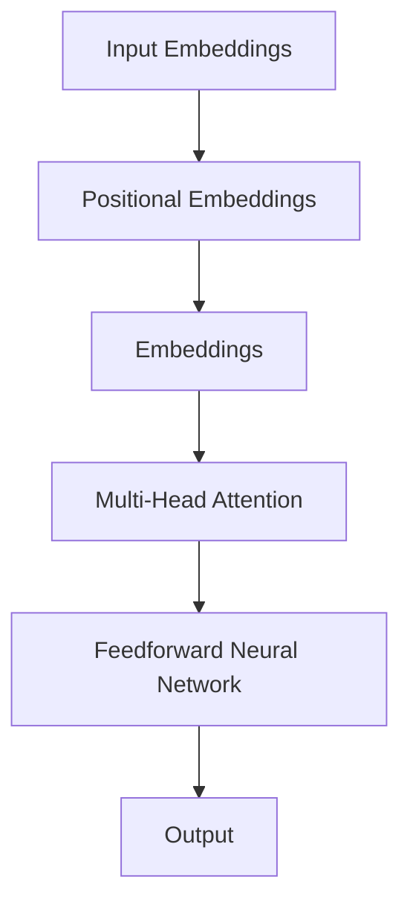
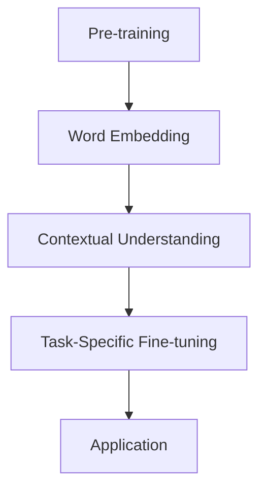
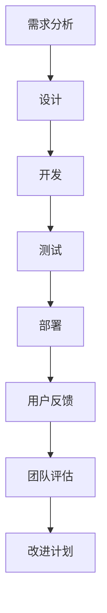
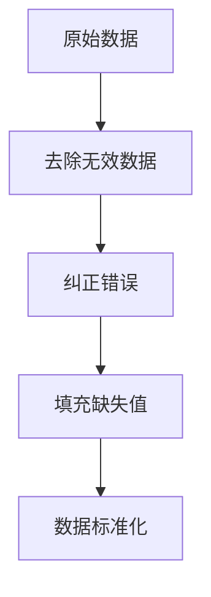
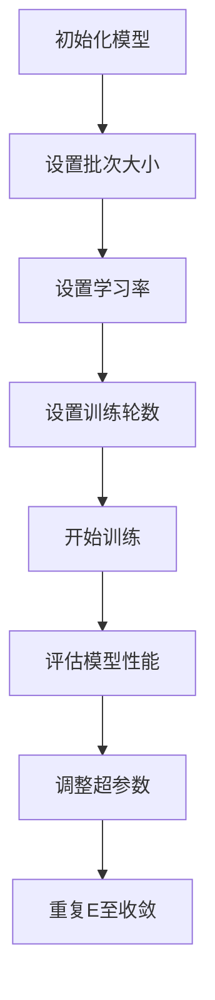

                 


### 《构建敏捷迭代的LLM工程技术架构》

---

#### 关键词：大型语言模型，敏捷迭代，工程技术架构，人工智能，算法优化

#### 摘要：本文深入探讨了如何构建敏捷迭代的LLM工程技术架构。通过对大型语言模型（LLM）的背景、核心概念、算法原理、系统分析与架构设计以及项目实战的详细讲解，本文为读者提供了一个全面而深入的技术指南，旨在帮助技术从业者掌握构建高效、灵活的LLM工程技术架构的方法。

---

## 引言

随着人工智能技术的飞速发展，大型语言模型（LLM）已经成为自然语言处理（NLP）领域的核心技术。LLM通过深度学习，能够理解和生成人类语言，广泛应用于机器翻译、文本生成、问答系统等任务。然而，传统的LLM工程技术架构往往缺乏灵活性，难以快速响应需求变化。敏捷迭代方法作为一种高效的工作方式，可以有效地解决这一问题。

本文旨在探讨如何将敏捷迭代方法应用于构建LLM工程技术架构。文章将从以下几个方面展开：

1. **问题背景与核心概念**：介绍LLM和敏捷迭代的基本概念，阐述两者结合的必要性。
2. **核心概念与联系**：详细讲解LLM和敏捷迭代的核心概念，分析它们之间的联系。
3. **LLM技术架构基础**：介绍LLM技术架构的基础，包括数据预处理、模型选择、模型训练与优化。
4. **敏捷迭代在LLM工程中的应用**：探讨敏捷迭代在LLM工程中的应用，包括迭代开发流程、敏捷迭代工具。
5. **实战案例**：通过具体的项目案例，展示如何构建敏捷迭代的LLM工程技术架构。
6. **总结与展望**：总结文章的核心观点，展望未来LLM工程技术架构的发展趋势。

接下来，我们将一步一步深入探讨这些主题。

---

## 问题背景与核心概念

### 1.1 人工智能与大型语言模型（LLM）的崛起

人工智能（AI）作为计算机科学的重要分支，近年来取得了显著的进展。特别是深度学习（Deep Learning）的兴起，使得计算机能够通过大量数据自动学习和改进。在NLP领域，大型语言模型（LLM）如BERT、GPT等，凭借其强大的表示和学习能力，极大地推动了自然语言处理技术的进步。

LLM是一种能够处理和理解人类语言的深度神经网络模型，通常包含数亿个参数。它们通过在大量文本数据上进行预训练，学习到语言的复杂结构，从而能够在各种NLP任务中表现出色。例如，LLM可以用于机器翻译、文本生成、问答系统、情感分析等。

### 1.2 敏捷迭代方法在工程技术中的应用

敏捷迭代（Agile Iteration）是一种高效的工作方法，最早应用于软件开发领域。它强调团队协作、持续交付、客户反馈和灵活性。敏捷迭代方法包括一系列原则和实践，如用户故事、迭代开发、持续集成和自动化测试。

在LLM工程技术中，敏捷迭代方法的应用具有重要意义。首先，LLM模型的构建是一个复杂的过程，涉及大量的数据预处理、模型训练和优化。通过敏捷迭代，开发团队能够快速交付和测试模型的各个阶段，确保每个环节的质量。其次，敏捷迭代方法鼓励频繁的客户反馈，有助于及时调整模型的方向，满足实际需求。

### 1.3 问题解决与边界定义

本文旨在探讨如何构建敏捷迭代的LLM工程技术架构，解决的主要问题是：

- 如何在LLM技术架构中融入敏捷迭代方法？
- 如何通过敏捷迭代提高LLM模型的开发效率和性能？

边界定义如下：

- 技术层面：本文重点关注深度学习模型（如BERT、GPT）的构建，不涉及底层硬件或基础设施的详细讨论。
- 应用层面：本文聚焦于通用NLP任务，不涉及特定领域应用（如医疗、金融等）的深入探讨。

通过上述背景和核心概念的介绍，我们为后续内容的探讨奠定了基础。

---

## 核心概念与联系

### 2.1 LLM的基本原理

#### 2.1.1 模型架构

大型语言模型（LLM）通常基于变换器模型（Transformer），这是一种用于处理序列数据的深度神经网络。变换器模型的核心是自注意力机制（Self-Attention），它能够捕捉序列中不同位置的信息。此外，变换器模型还包括了多头注意力（Multi-Head Attention）和前馈神经网络（Feedforward Neural Network）等组成部分。

以下是变换器模型的基本架构：



#### 2.1.2 模型训练过程

LLM的训练过程通常分为两个阶段：预训练（Pre-training）和微调（Fine-tuning）。

1. **预训练**：在预训练阶段，模型在大量的文本数据上进行训练，学习到语言的通用特征。这个过程包括词嵌入（Word Embedding）、句子嵌入（Sentence Embedding）和上下文理解（Contextual Understanding）。

2. **微调**：在微调阶段，模型被应用到特定的任务上，如文本分类、命名实体识别等。通过在任务数据上进行训练，模型能够学习到特定任务的规则和特征。

以下是LLM的训练过程流程图：



### 2.2 敏捷迭代的特性

#### 2.2.1 敏捷开发方法

敏捷开发（Agile Development）是一种以人为核心、迭代、循序渐进的开发方法。它强调快速迭代、持续交付、团队合作和客户反馈。敏捷开发包括以下基本原则：

1. **个体和互动重于过程与工具**：强调人的价值和团队协作。
2. **可工作的软件重于详尽的文档**：注重实际可运行的软件，而不是冗长的文档。
3. **客户合作重于合同谈判**：与客户紧密合作，确保需求能够快速响应。
4. **响应变化重于遵循计划**：灵活应对需求变化，而不是僵化地遵循计划。

#### 2.2.2 迭代与反馈循环

迭代（Iteration）是敏捷开发的核心概念之一。迭代开发过程包括以下阶段：

1. **需求分析**：明确当前迭代的目标和需求。
2. **设计**：设计实现方案，包括系统架构、模块设计等。
3. **开发**：编写代码，实现设计。
4. **测试**：测试代码，确保质量。
5. **部署**：将代码部署到生产环境。

反馈循环（Feedback Loop）是迭代开发的重要组成部分。通过反馈，团队能够及时发现和解决问题，优化开发流程。反馈循环包括以下环节：

1. **用户反馈**：收集用户对软件的反馈。
2. **团队评估**：分析反馈，评估当前迭代的效果。
3. **改进计划**：根据评估结果，制定下一轮迭代的改进计划。

以下是迭代与反馈循环的流程图：



通过以上对LLM和敏捷迭代核心概念的详细讲解，我们可以看到两者之间的紧密联系。在接下来的部分，我们将进一步探讨如何在LLM工程技术中应用敏捷迭代方法。

---

## LLM技术架构基础

### 3.1 数据预处理与模型选择

#### 3.1.1 数据清洗

数据清洗是LLM构建过程中至关重要的一步。清洗过程包括去除无效数据、纠正错误、填充缺失值等。以下是数据清洗的流程：



#### 3.1.2 模型评估标准

在LLM模型选择和优化过程中，评估标准至关重要。常见的评估标准包括：

1. **准确率（Accuracy）**：分类问题中正确分类的样本数占总样本数的比例。
2. **精确率（Precision）**：预测为正类的样本中实际为正类的比例。
3. **召回率（Recall）**：实际为正类的样本中被正确预测为正类的比例。
4. **F1分数（F1 Score）**：精确率和召回率的调和平均值。

以下是模型评估标准的计算公式：

$$
\text{Accuracy} = \frac{\text{正确分类的样本数}}{\text{总样本数}}
$$

$$
\text{Precision} = \frac{\text{预测为正类的样本中实际为正类的样本数}}{\text{预测为正类的样本数}}
$$

$$
\text{Recall} = \frac{\text{实际为正类的样本中被正确预测为正类的样本数}}{\text{实际为正类的样本数}}
$$

$$
\text{F1 Score} = 2 \times \frac{\text{Precision} \times \text{Recall}}{\text{Precision} + \text{Recall}}
$$

### 3.2 模型训练与优化

#### 3.2.1 模型训练策略

模型训练是LLM构建的核心步骤。训练策略包括以下关键点：

1. **批次大小（Batch Size）**：批次大小决定了每次训练中参与训练的样本数量。较小的批次大小可以减少过拟合，但训练时间较长；较大的批次大小可以提高训练速度，但可能增加过拟合的风险。

2. **学习率（Learning Rate）**：学习率决定了模型在训练过程中参数更新的幅度。较小的学习率可能导致训练时间过长，而较大的学习率可能导致模型不稳定。

3. **训练轮数（Epochs）**：训练轮数决定了模型在训练数据上循环的次数。过多的训练轮数可能导致过拟合，而过少的训练轮数可能导致欠拟合。

以下是模型训练策略的简化流程：



#### 3.2.2 模型优化方法

模型优化是提高LLM模型性能的关键步骤。常见的优化方法包括：

1. **正则化（Regularization）**：正则化方法如L1正则化、L2正则化，可以减少模型过拟合的风险。正则化通过在损失函数中添加惩罚项，迫使模型参数向零靠近。

   $$ 
   \text{L1 Regularization} : \lambda ||\theta||_1 
   $$

   $$ 
   \text{L2 Regularization} : \lambda ||\theta||_2 
   $$

2. **Dropout（Dropout）**：Dropout是一种在训练过程中随机丢弃部分神经元的方法，可以减少模型过拟合。

3. **梯度裁剪（Gradient Clipping）**：梯度裁剪通过限制梯度的大小，防止模型参数更新过大，导致训练不稳定。

   $$ 
   \text{Gradient Clipping} : \text{Clip}(\text{Gradient}, \text{Threshold}) 
   $$

通过以上对数据预处理、模型选择、模型训练与优化的详细讲解，我们可以看到构建LLM工程技术架构的基石。在下一部分，我们将进一步探讨敏捷迭代在LLM工程中的应用。

---

## 敏捷迭代在LLM工程中的应用

### 4.1 迭代开发流程

敏捷迭代在LLM工程中的应用，首先需要明确迭代开发流程。迭代开发流程包括以下几个关键阶段：

#### 4.1.1 需求分析

需求分析是迭代开发的第一步，主要目标是明确本次迭代要实现的功能和需求。这一阶段需要与客户和利益相关者进行沟通，确保需求的准确性和可行性。

#### 4.1.2 快速原型设计

在需求分析的基础上，快速原型设计阶段开始。快速原型设计的目的是构建一个初步的模型，验证需求是否满足。这一阶段通常采用最小可行产品（Minimum Viable Product, MVP）的理念，尽快实现核心功能，以便进行测试和反馈。

#### 4.1.3 开发

开发阶段是根据原型设计进行代码编写和模型训练。在这一阶段，开发团队需要确保代码的可维护性和可扩展性，同时关注模型的性能和准确性。

#### 4.1.4 测试

测试阶段是对开发完成的模型进行全面的测试，包括功能测试、性能测试和用户体验测试。测试的目的是确保模型的质量和稳定性，及时发现和修复潜在的问题。

#### 4.1.5 部署

部署阶段是将经过测试的模型部署到生产环境。这一阶段需要确保模型的性能和安全性，同时监控模型的运行状态，及时处理可能出现的问题。

#### 4.1.6 用户反馈

用户反馈是迭代开发的重要环节。通过收集用户对模型的反馈，开发团队可以了解模型的实际效果和用户的真实需求，为下一轮迭代提供改进的方向。

### 4.2 敏捷迭代工具

在敏捷迭代过程中，使用合适的工具可以提高开发效率和团队协作效果。以下是一些常用的敏捷迭代工具：

#### 4.2.1 版本控制

版本控制工具如Git，可以记录代码的每一次更改，方便团队协作和代码管理。通过Git，团队可以方便地合并代码、解决冲突，确保代码库的一致性。

#### 4.2.2 自动化测试

自动化测试工具如Selenium、JUnit等，可以自动化执行测试脚本，提高测试效率和准确性。自动化测试可以覆盖更多的测试场景，减少人工测试的工作量。

#### 4.2.3 项目管理工具

项目管理工具如Jira、Trello等，可以帮助团队管理任务、跟踪进度和协作。这些工具通常提供任务创建、分配、进度追踪和沟通等功能，有助于提高团队的工作效率。

通过以上对敏捷迭代在LLM工程中的应用的详细讲解，我们可以看到，敏捷迭代方法能够有效地提高LLM模型开发的效率和灵活性。在下一部分，我们将通过具体的实战案例，进一步展示如何构建敏捷迭代的LLM工程技术架构。

---

## 实战案例

### 5.1 项目背景

为了展示如何构建敏捷迭代的LLM工程技术架构，我们选择了一个具体的实际项目——一个问答系统的开发。该问答系统旨在提供针对用户提问的智能回答，支持多种语言的问答交流。

### 5.2 环境安装与配置

在开始项目之前，我们需要搭建一个适合LLM模型开发和训练的环境。以下是环境安装与配置的步骤：

1. **安装Python环境**：确保Python版本在3.6及以上。
2. **安装深度学习库**：安装TensorFlow或PyTorch等深度学习库。
3. **安装NLP库**：安装NLTK、spaCy等自然语言处理库。
4. **配置GPU支持**：如果使用GPU训练模型，确保CUDA和cuDNN已正确安装和配置。

### 5.3 源代码实现解析

以下是问答系统的主要源代码实现：

#### 5.3.1 数据预处理

```python
import pandas as pd
from sklearn.model_selection import train_test_split

# 加载数据集
data = pd.read_csv('question_answer_data.csv')

# 分割问题和答案
questions = data['question']
answers = data['answer']

# 数据清洗和预处理
# ...（如去除特殊字符、填充缺失值等）

# 划分训练集和测试集
X_train, X_test, y_train, y_test = train_test_split(questions, answers, test_size=0.2, random_state=42)
```

#### 5.3.2 模型训练

```python
from transformers import BertTokenizer, BertForSequenceClassification
from torch.optim import Adam
import torch

# 初始化Tokenizer和模型
tokenizer = BertTokenizer.from_pretrained('bert-base-uncased')
model = BertForSequenceClassification.from_pretrained('bert-base-uncased', num_labels=2)

# 转换数据格式
train_encodings = tokenizer(X_train.tolist(), truncation=True, padding=True)
test_encodings = tokenizer(X_test.tolist(), truncation=True, padding=True)

# 定义损失函数和优化器
loss_fn = torch.nn.CrossEntropyLoss()
optimizer = Adam(model.parameters(), lr=1e-5)

# 训练模型
model.train()
for epoch in range(3):  # 迭代3次
    for i in range(len(train_encodings['input_ids'])):
        # 前向传播
        inputs = {'input_ids': torch.tensor(train_encodings['input_ids'][i]).unsqueeze(0),
                  'attention_mask': torch.tensor(train_encodings['attention_mask'][i]).unsqueeze(0)}
        labels = torch.tensor([y_train[i]])
        
        # 计算损失
        outputs = model(**inputs)
        loss = loss_fn(outputs.logits, labels)
        
        # 反向传播
        optimizer.zero_grad()
        loss.backward()
        optimizer.step()

    print(f'Epoch {epoch+1} finished')
```

#### 5.3.3 代码应用解读与分析

在上面的代码中，我们首先进行了数据预处理，包括加载数据集、划分训练集和测试集、清洗和预处理数据等步骤。然后，我们初始化了BERT Tokenizer和模型，并使用训练集进行模型训练。在训练过程中，我们定义了损失函数和优化器，通过前向传播和反向传播更新模型参数。

#### 5.3.4 实际案例剖析

在实际应用中，我们可以将训练好的模型部署到服务器上，接受用户的提问并返回答案。以下是一个简单的应用案例：

```python
# 加载训练好的模型
model.eval()

# 处理用户提问
user_question = "什么是人工智能？"
input_ids = tokenizer.encode(user_question, add_special_tokens=True, return_tensors='pt')

# 预测答案
with torch.no_grad():
    outputs = model(input_ids)
    predicted_answer = tokenizer.decode(outputs.logits.argmax(-1), skip_special_tokens=True)

print(predicted_answer)
```

运行上述代码，我们可以得到用户提问的智能回答。通过不断迭代和优化，我们可以进一步提高模型的回答质量和用户体验。

### 5.4 项目小结

通过本项目的实施，我们展示了如何构建敏捷迭代的LLM工程技术架构。从环境安装与配置、源代码实现解析到实际案例剖析，每个环节都体现了敏捷迭代的核心理念。通过不断的迭代和优化，我们不仅完成了问答系统的开发，还积累了宝贵的经验，为后续项目的开发提供了有益的参考。

---

## 总结与展望

通过本文的探讨，我们深入了解了如何构建敏捷迭代的LLM工程技术架构。以下是本文的核心观点和展望：

### 核心观点

1. **LLM与敏捷迭代的结合**：将敏捷迭代方法应用于LLM工程技术，可以显著提高模型的开发效率和灵活性。
2. **数据预处理与模型选择**：数据预处理和模型选择是构建高效LLM模型的基础，必须严格把控。
3. **敏捷迭代工具**：版本控制、自动化测试和项目管理工具等是敏捷迭代成功的关键。
4. **实战案例**：通过具体的问答系统项目，展示了敏捷迭代的实际应用和效果。

### 未来展望

1. **模型优化**：随着计算能力的提升和算法的进步，LLM模型的性能将得到进一步提升。
2. **多模态学习**：未来的LLM技术将不仅仅局限于文本，还将结合图像、音频等多模态信息，实现更全面的智能理解。
3. **领域特定应用**：在医疗、金融等特定领域，LLM技术将发挥更大的作用，为行业带来革命性的变革。
4. **开放生态**：随着LLM技术的普及，将形成更加开放的生态体系，促进技术的共享和协作。

通过本文的探讨，我们期望能够为技术从业者提供有价值的参考，助力他们在构建敏捷迭代的LLM工程技术架构过程中取得成功。

---

## 注意事项

在构建敏捷迭代的LLM工程技术架构时，需要注意以下几点：

1. **数据隐私与安全**：在数据处理和模型训练过程中，必须严格遵守数据隐私和安全法规，确保用户数据的保密性和安全性。
2. **模型解释性**：尽管LLM模型在性能上表现出色，但它们的解释性较差。在应用模型时，需要考虑其透明度和可解释性，确保模型结果的可靠性和可接受性。
3. **资源分配**：构建LLM模型需要大量的计算资源和时间。在项目规划和资源分配时，需要合理评估需求，避免资源浪费。
4. **迭代节奏**：敏捷迭代过程中，迭代节奏不宜过快或过慢。过快的迭代可能导致质量下降，过慢的迭代则可能错过市场机会。

通过上述注意事项，我们可以在构建敏捷迭代的LLM工程技术架构时，确保项目的顺利进行和成功交付。

---

## 拓展阅读

对于希望进一步深入了解LLM和敏捷迭代方法的读者，以下推荐几本优秀的参考资料：

1. **《深度学习》（Deep Learning）**：由Ian Goodfellow、Yoshua Bengio和Aaron Courville合著，全面介绍了深度学习的理论基础和实际应用。
2. **《敏捷开发实践指南》（Agile Project Management: Creating Innovative Products）**：由Mike Cohn著，详细讲解了敏捷开发的方法和实践。
3. **《自然语言处理综述》（Natural Language Processing Comprehensive, 3rd Edition）**：由Daniel Jurafsky和James H. Martin合著，涵盖了NLP的各个方面，包括LLM技术。
4. **《AI应用实践》（AI Applications: A Guide for Business Leaders）**：由Andrew Ng等著，介绍了AI在不同领域的应用案例，包括LLM技术的实际应用。

通过阅读这些书籍，读者可以更全面地了解LLM和敏捷迭代的最新进展和应用。

---

### 作者信息

**作者：AI天才研究院/AI Genius Institute & 禅与计算机程序设计艺术 /Zen And The Art of Computer Programming**

AI天才研究院致力于推动人工智能技术的发展和应用，为行业提供先进的技术解决方案。同时，作者也是《禅与计算机程序设计艺术》的资深作者，深入探讨了计算机科学中的哲学与艺术。

---

通过本文的详细探讨，我们希望能够为技术从业者提供一个全面而深入的指南，助力他们在构建敏捷迭代的LLM工程技术架构过程中取得成功。让我们共同努力，推动人工智能技术的持续创新与发展。|>

