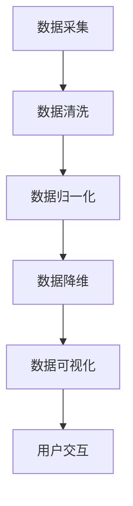
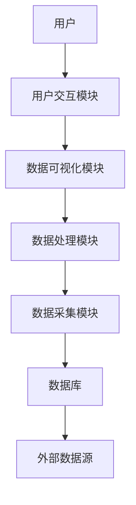
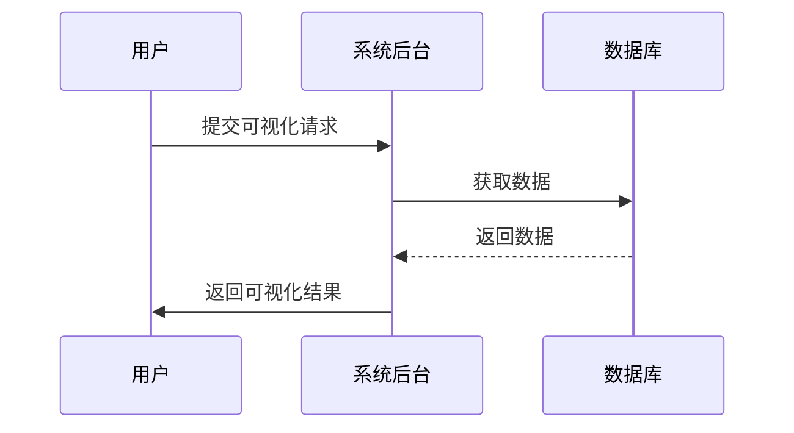

                 

# 《构建评测结果的多维度可视化工具》

> 关键词：评测结果可视化、多维度数据、数据预处理、可视化算法、系统架构设计

> 摘要：本文旨在探讨如何构建一个能够全面、直观展示评测结果的多维度可视化工具。通过分析问题背景和核心概念，详细讲解数据预处理、数据聚合和可视化算法的原理，并结合实际项目实战，展示系统架构设计和实现方法。文章旨在为开发者提供一套完整的解决方案，以应对日益复杂的评测结果可视化需求。

## 第一部分：问题背景与核心概念

### 第1章：问题背景与概述

#### 1.1 问题背景

随着信息技术的飞速发展，数据量和数据处理需求不断增加。在众多数据处理任务中，评测结果的可视化展示显得尤为重要。一方面，可视化的结果能够直观地传达给非技术人员；另一方面，通过可视化，可以发现数据中的潜在规律和问题。然而，当前评测结果可视化面临诸多挑战，如多维度数据融合、数据冗余、可视化算法的选择等。

#### 1.1.1 评测结果可视化的需求

- **复杂度提升**：随着评测任务的复杂度增加，单一维度的数据已经无法满足需求，需要多维度数据融合。
- **用户体验**：如何通过可视化工具提高用户的理解和操作效率，成为新的挑战。
- **实时性**：对于一些动态变化的评测结果，需要实现实时更新和动态展示。

#### 1.1.2 当前评测结果可视化面临的挑战

- **数据融合**：多维度数据的融合和整合，保证数据的一致性和完整性。
- **性能优化**：如何提高可视化工具的响应速度，降低计算资源消耗。
- **交互设计**：用户如何与可视化工具进行有效互动，提高操作体验。

#### 1.1.3 构建评测结果可视化工具的重要性

- **数据洞察**：通过可视化工具，可以更快速地发现数据中的问题和趋势。
- **决策支持**：为决策者提供直观的数据展示，支持科学决策。
- **知识传播**：便于知识的传播和共享，提高整体数据处理能力。

### 1.2 核心概念

#### 1.2.1 多维度数据

多维度数据是指具有多个属性或特征的数据集合。在评测结果中，可能涉及到性能、效率、稳定性等多个维度。

#### 1.2.2 数据可视化

数据可视化是将数据以图形或图像的形式展示出来的技术。通过可视化，可以更直观地理解数据。

#### 1.2.3 可视化工具的特点与分类

- **特点**：直观、交互性强、易于理解。
- **分类**：通用可视化工具（如Matplotlib、D3.js）、行业定制可视化工具。

### 1.3 关键技术

#### 1.3.1 数据预处理

- **数据清洗**：去除无效或错误的数据。
- **数据归一化**：将不同尺度的数据统一到一个尺度上。
- **数据降维**：减少数据维度，降低计算复杂度。

#### 1.3.2 多维度数据聚合

- **平均值聚合**：将多个维度的数据求平均值。
- **中位数聚合**：将多个维度的数据求中位数。
- **众数聚合**：将多个维度的数据求众数。

#### 1.3.3 可视化算法选择

- **层次化可视化**：将数据分层展示，便于理解。
- **交互式可视化**：用户可以与可视化进行互动。
- **动态可视化**：数据随时间或条件变化而动态展示。

### 1.4 本章小结

本文介绍了评测结果可视化的背景和重要性，阐述了多维度数据、数据可视化以及可视化工具的相关概念，并提出了数据预处理、数据聚合和可视化算法的选择作为关键技术。接下来，本文将深入探讨这些核心概念和技术。

----------------------------------------------------------------

## 第二部分：核心概念与联系

### 第2章：核心概念原理与属性特征

#### 2.1 多维度数据的定义与分类

多维度数据是指包含多个属性或特征的数据集。这些属性或特征可以是定量数据（如性能指标、运行时间等），也可以是定性数据（如用户满意度、产品质量等）。多维度数据在评测结果中尤为重要，因为它们提供了更全面的视角来分析和理解数据。

##### 2.1.1 定量数据

定量数据是可以用数值表示的数据。例如，一个系统的响应时间、处理能力、吞吐量等都可以用数值来表示。定量数据通常用于衡量系统的性能指标，是评测结果中的重要组成部分。

##### 2.1.2 定性数据

定性数据是无法用数值表示的数据。例如，用户满意度、产品满意度、服务质量等都是定性数据。定性数据通常用于评估系统的用户体验和服务质量。

##### 2.1.3 多维度数据的关联性

多维度数据之间可能存在关联性。例如，一个系统的性能可能直接影响其用户体验和满意度。因此，在处理多维度数据时，需要考虑它们之间的相互关系，以便更好地理解数据。

#### 2.2 数据可视化原理

数据可视化是将数据以图形或图像的形式展示出来，使数据更加直观、易于理解。数据可视化原理包括以下几个方面：

##### 2.2.1 可视化基础理论

可视化基础理论包括视觉感知原理、数据表示方法、颜色理论等。这些理论为数据可视化提供了理论基础，确保数据可视化结果的准确性和易读性。

##### 2.2.2 可视化映射规则

可视化映射规则是将数据映射到图形或图像上的方法。常见的映射规则包括坐标轴映射、颜色映射、形状映射等。选择合适的映射规则可以使数据可视化结果更加直观、易懂。

##### 2.2.3 可视化设计原则

可视化设计原则包括简洁性、一致性、对比性等。这些原则有助于提高数据可视化结果的可读性、易用性，确保用户能够快速理解数据。

#### 2.3 可视化工具特点与分类

可视化工具是用于创建和展示数据可视化的软件或库。不同的可视化工具具有不同的特点和应用场景。

##### 2.3.1 通用可视化工具

通用可视化工具适用于多种数据类型和场景，如Matplotlib（Python）、D3.js（JavaScript）等。这些工具提供丰富的图表类型和自定义选项，适用于大部分数据可视化需求。

##### 2.3.2 行业定制可视化工具

行业定制可视化工具是为特定行业或领域设计的可视化工具，如Tableau（数据分析）、PowerBI（商业智能）等。这些工具通常具有行业特定的功能，能够更好地满足特定领域的需求。

##### 2.3.3 工具的比较与选择

在选择可视化工具时，需要考虑以下因素：

- **数据类型**：通用可视化工具适用于多种数据类型，而行业定制可视化工具可能更适用于特定数据类型。
- **使用场景**：通用可视化工具适用于大部分场景，而行业定制可视化工具可能更适合特定场景。
- **自定义程度**：通用可视化工具通常提供丰富的自定义选项，而行业定制可视化工具可能限制较多。
- **学习成本**：通用可视化工具的学习成本相对较低，而行业定制可视化工具可能需要更深入的学习。

#### 2.4 ER实体关系图架构

ER（实体关系）图是一种用于表示实体及其之间关系的图形化方法。在数据可视化中，ER图可以帮助我们更好地理解数据的结构和关系。

##### 2.4.1 ER图的定义与作用

ER图是一种用于表示实体（如数据表）、属性（如字段）以及它们之间关系的图形化表示方法。在数据可视化中，ER图可以用于表示数据表之间的关系，帮助我们更好地理解数据的结构。

##### 2.4.2 ER图的绘制方法

绘制ER图的方法包括以下步骤：

1. 确定实体：根据数据表的内容，确定需要表示的实体。
2. 确定属性：为每个实体确定属性，并添加到ER图中。
3. 确定关系：分析实体之间的关系，如一对一、一对多、多对多关系，并在ER图中表示。
4. 完善ER图：根据需要，可以进一步添加注释、说明等。

##### 2.4.3 ER图在可视化工具中的应用

在可视化工具中，ER图可以用于表示数据表之间的关系，帮助用户更好地理解数据结构。例如，在D3.js中，可以使用ER图来表示数据表之间的关联，从而创建更复杂的可视化效果。

#### 2.5 本章小结

本章介绍了多维度数据的定义与分类、数据可视化原理、可视化工具特点与分类以及ER图在数据可视化中的应用。通过这些核心概念和联系，我们可以更好地理解评测结果的多维度可视化，并为后续章节的算法原理讲解和系统架构设计打下基础。

```mermaid
erDiagram
  Product ||--|{ Customer } : "has" 
  Customer ||--|{ Product } : "buys"
```

----------------------------------------------------------------

## 第三部分：算法原理讲解

### 第3章：算法原理与数学模型

#### 3.1 数据预处理算法

数据预处理是数据可视化的重要环节，它包括数据清洗、数据归一化和数据降维等步骤。这些算法能够提高数据的质量，使得后续的可视化过程更加准确和高效。

##### 3.1.1 数据清洗

数据清洗是指去除数据中的无效或错误信息。在评测结果中，可能存在缺失值、异常值或噪声数据。数据清洗的目的是提高数据的质量，确保后续分析的正确性。

- **缺失值处理**：可以使用平均值、中位数或众数等统计方法来填补缺失值。
- **异常值处理**：可以使用统计方法（如标准差）或机器学习方法（如孤立森林）来检测和去除异常值。
- **噪声处理**：可以使用滤波算法（如低通滤波）来减少噪声数据的影响。

##### 3.1.2 数据归一化

数据归一化是指将不同尺度或范围的数据转换到同一尺度上，以便进行比较和分析。常用的归一化方法包括最小-最大缩放、Z分数缩放和幂函数缩放等。

- **最小-最大缩放**：将数据映射到[0, 1]区间，公式为 \(x' = \frac{x - \min(x)}{\max(x) - \min(x)}\)。
- **Z分数缩放**：将数据映射到标准正态分布，公式为 \(z = \frac{x - \mu}{\sigma}\)，其中 \(\mu\) 是均值，\(\sigma\) 是标准差。
- **幂函数缩放**：使用幂函数将数据映射到[0, 1]区间，公式为 \(x' = (x - \min(x))^p\)，其中 \(p\) 是幂指数。

##### 3.1.3 数据降维

数据降维是指通过减少数据的维度，降低数据的复杂度和计算成本。常用的降维方法包括主成分分析（PCA）、线性判别分析（LDA）和自编码器等。

- **主成分分析（PCA）**：PCA通过正交变换将高维数据投影到低维空间，保留最重要的信息，丢弃冗余信息。PCA的数学模型为：找到一组正交基，使得投影后的数据方差最大。
  $$\text{协方差矩阵} \Sigma = \frac{1}{N} \sum_{i=1}^{N} (x_i - \mu)(x_i - \mu)^T$$
  $$\text{特征值分解} \Sigma = PDP^T$$
  $$\text{投影矩阵} W = P_{\text{列}}$$

- **线性判别分析（LDA）**：LDA旨在找到一组线性组合，使得不同类别的投影距离最大。LDA的数学模型为：
  $$\text{类内协方差矩阵} S_W = \frac{1}{C} \sum_{i=1}^{C} (x_i - \mu_c)(x_i - \mu_c)^T$$
  $$\text{类间协方差矩阵} S_B = \frac{1}{C} \sum_{i=1}^{C} (\mu_c - \mu)(\mu_c - \mu)^T$$
  $$\text{判别函数} w = (S_B^{-1} S_W) w$$

- **自编码器**：自编码器是一种无监督学习方法，通过训练一个编码器和解码器，将高维数据映射到低维空间。自编码器的数学模型为：
  $$\text{编码器} h = \sigma(W_h x + b_h)$$
  $$\text{解码器} x' = \sigma(W_x h + b_x)$$

#### 3.2 数据聚合算法

数据聚合是指将多个数据点合并为一个数据点，以简化数据的表示和可视化。常用的聚合方法包括平均值聚合、中位数聚合和众数聚合等。

##### 3.2.1 平均值聚合

平均值聚合是指将多个数据点的值求平均值，得到一个代表这些数据点的值。平均值聚合适用于数据稳定且无明显异常值的情况。

$$\text{平均值} \bar{x} = \frac{1}{n} \sum_{i=1}^{n} x_i$$

##### 3.2.2 中位数聚合

中位数聚合是指将多个数据点的值按大小排序，取中间位置的值作为代表。中位数聚合适用于数据分布不均匀且存在异常值的情况。

$$\text{中位数} \text{med} = \begin{cases} 
\frac{1}{2} (\text{第} \frac{n}{2} \text{个值} + \text{第} \frac{n}{2} + 1 \text{个值}) & \text{若} n \text{为偶数} \\
\text{第} \frac{n+1}{2} \text{个值} & \text{若} n \text{为奇数}
\end{cases}$$

##### 3.2.3 众数聚合

众数聚合是指将多个数据点的值中出现次数最多的值作为代表。众数聚合适用于数据存在多个模值的情况。

$$\text{众数} \text{mode} = \text{出现次数最多的值}$$

#### 3.3 可视化算法

可视化算法是将数据转换为图形表示的方法，以直观地展示数据特征和关系。常用的可视化算法包括层次化可视化、交互式可视化、动态可视化等。

##### 3.3.1 层次化可视化

层次化可视化是将数据分层展示，以帮助用户理解数据的层次结构和关系。常见的层次化可视化方法包括树状图、桑基图和层次化饼图等。

##### 3.3.2 交互式可视化

交互式可视化是指用户可以通过与可视化界面的互动来探索数据。常见的交互式可视化方法包括过滤、排序、筛选和缩放等。

##### 3.3.3 动态可视化

动态可视化是指随时间或条件变化，数据可视化界面会动态更新。常见的动态可视化方法包括折线图、散点图和热力图等。

#### 3.4 算法原理讲解

在本章节中，我们通过Python代码和Mermaid流程图，详细讲解数据预处理、数据聚合和可视化算法的原理。

##### 3.4.1 数据预处理算法讲解

```python
import numpy as np
from sklearn.preprocessing import MinMaxScaler, StandardScaler
from sklearn.decomposition import PCA
from sklearn.ensemble import IsolationForest

# 数据清洗
def data_cleaning(data):
    # 去除缺失值
    data = np.nan_to_num(data)
    # 去除异常值
    clf = IsolationForest(contamination=0.1)
    outliers = clf.fit_predict(data)
    data = data[outliers != -1]
    return data

# 数据归一化
def data_normalization(data, method='minmax'):
    if method == 'minmax':
        scaler = MinMaxScaler()
    elif method == 'z-score':
        scaler = StandardScaler()
    else:
        raise ValueError("Invalid normalization method")
    normalized_data = scaler.fit_transform(data)
    return normalized_data

# 数据降维
def data_reduction(data, method='pca'):
    if method == 'pca':
        pca = PCA(n_components=2)
    elif method == 'lda':
        # 注意：LDA需要标签信息，这里简化处理
        pca = LDA(n_components=2)
    else:
        raise ValueError("Invalid reduction method")
    reduced_data = pca.fit_transform(data)
    return reduced_data

# 示例数据
data = np.array([[1, 2], [2, 3], [3, 4], [4, 5], [5, 6]])

# 数据清洗
cleaned_data = data_cleaning(data)

# 数据归一化
normalized_data = data_normalization(cleaned_data, method='minmax')

# 数据降维
reduced_data = data_reduction(normalized_data, method='pca')
```

##### 3.4.2 数据聚合算法讲解

```python
import numpy as np

# 平均值聚合
def average_aggregation(data):
    return np.mean(data)

# 中位数聚合
def median_aggregation(data):
    return np.median(data)

# 众数聚合
def mode_aggregation(data):
    from scipy.stats import mode
    return mode(data).mode[0]

# 示例数据
data = np.array([1, 2, 2, 3, 4, 4, 4, 5, 5])

# 平均值聚合
average_result = average_aggregation(data)

# 中位数聚合
median_result = median_aggregation(data)

# 众数聚合
mode_result = mode_aggregation(data)
```

##### 3.4.3 可视化算法讲解

```python
import matplotlib.pyplot as plt
from sklearn.datasets import make_moons
import mermaid

# 层次化可视化（树状图）
def hierarchical_visualization(data):
    tree_data = mermaid.tree()
    tree_data.add_node('Root', 'Data Tree')
    tree_data.add_node('Child1', 'Feature 1', parent='Root')
    tree_data.add_node('Child2', 'Feature 2', parent='Root')
    tree_data.add_node('Child2.1', 'Sub-Feature 2.1', parent='Child2')
    tree_data.add_node('Child2.2', 'Sub-Feature 2.2', parent='Child2')
    print(tree_data)

# 交互式可视化（散点图）
def interactive_visualization(data):
    fig, ax = plt.subplots()
    ax.scatter(data[:, 0], data[:, 1])
    plt.show()

# 动态可视化（折线图）
def dynamic_visualization(data):
    for i in range(data.shape[0]):
        plt.scatter(i, data[i, 0])
        plt.pause(0.1)
    plt.show()

# 示例数据
data, _ = make_moons(n_samples=100, noise=0.1)

# 层次化可视化
hierarchical_visualization(data)

# 交互式可视化
interactive_visualization(data)

# 动态可视化
dynamic_visualization(data)
```

#### 3.5 本章小结

本章详细讲解了数据预处理、数据聚合和可视化算法的原理，并通过Python代码和Mermaid流程图进行了演示。这些算法是构建评测结果多维度可视化工具的重要基础，为后续的系统架构设计提供了技术支持。

----------------------------------------------------------------

## 第四部分：系统分析与架构设计

### 第4章：系统功能设计与架构

#### 4.1 系统功能设计

评测结果可视化系统的功能设计旨在满足多维度数据的处理和展示需求，确保系统能够高效、准确地提供可视化结果。系统的主要功能模块包括数据采集与处理、数据可视化、用户交互等。

##### 4.1.1 功能模块划分

1. **数据采集模块**：负责从各种数据源收集评测结果，如数据库、日志文件等。
2. **数据处理模块**：包括数据清洗、数据归一化、数据降维等，为可视化提供高质量的数据。
3. **数据可视化模块**：实现多维度数据的可视化，包括层次化可视化、交互式可视化、动态可视化等。
4. **用户交互模块**：提供用户界面，使用户能够与可视化系统进行交互，定制可视化参数。

##### 4.1.2 数据采集与处理

数据采集与处理是系统功能设计的基础。数据采集模块需要支持多种数据源，如数据库、文件系统、网络API等。数据处理模块需要对采集到的数据进行预处理，包括数据清洗、数据归一化和数据降维等，以提高数据质量。



##### 4.1.3 数据可视化

数据可视化模块是系统的核心，需要实现多维度数据的可视化。层次化可视化可以帮助用户理解数据的层次结构和关系；交互式可视化提供用户与数据的互动，提高用户体验；动态可视化能够实时更新数据，展示数据的变化趋势。

##### 4.1.4 用户交互

用户交互模块为用户提供了一个友好的操作界面，使用户能够轻松定制可视化参数，如选择数据维度、调整图表样式等。用户交互模块需要支持多种交互方式，如点击、拖拽、滑动等。

#### 4.2 系统架构设计

系统架构设计是确保系统功能实现的关键。一个高效、可扩展的系统架构能够提高系统的性能和可维护性。

##### 4.2.1 系统架构图

以下是一个简化的系统架构图：



##### 4.2.2 系统模块交互

系统模块之间的交互设计是确保系统正常运行的关键。以下是系统模块的交互流程：

1. **用户请求**：用户通过用户交互模块提交可视化请求。
2. **数据采集**：数据采集模块从外部数据源获取数据。
3. **数据处理**：数据处理模块对采集到的数据进行预处理。
4. **数据可视化**：数据可视化模块根据预处理后的数据生成可视化结果。
5. **反馈**：将可视化结果返回给用户。

##### 4.2.3 系统性能优化

系统性能优化是提升用户体验的重要手段。以下是几种常见的性能优化策略：

1. **缓存机制**：缓存常见的数据和可视化结果，减少数据读取和处理时间。
2. **负载均衡**：通过负载均衡器分配请求，提高系统响应速度。
3. **并行处理**：利用多线程或分布式计算，加快数据处理速度。
4. **数据压缩**：对数据进行压缩，减少数据传输量，降低网络延迟。

#### 4.3 接口设计与实现

接口设计是系统架构设计的重要组成部分，它定义了系统内部和外部系统之间的通信方式。

##### 4.3.1 API设计

API（应用程序接口）是系统与其他系统进行交互的接口。以下是系统API设计的关键点：

1. **RESTful风格**：使用RESTful API设计，便于与其他系统集成。
2. **请求和响应格式**：使用JSON格式传递请求和响应数据，便于解析和处理。
3. **参数设计**：定义清晰的参数，包括必选参数和可选参数，便于调用者使用。

##### 4.3.2 接口实现

接口实现包括后端逻辑处理和前端的API调用。以下是接口实现的关键步骤：

1. **后端实现**：根据API设计，实现后端逻辑处理，包括数据采集、数据处理、数据可视化等。
2. **前端实现**：使用前端框架（如React、Vue.js等），实现API调用和界面渲染。

##### 4.3.3 接口测试

接口测试是确保接口设计和实现正确性的重要环节。以下是接口测试的关键步骤：

1. **单元测试**：对单个接口进行测试，确保其功能正确。
2. **集成测试**：对多个接口进行集成测试，确保它们之间的交互正常。
3. **压力测试**：模拟高并发场景，测试系统的性能和稳定性。

#### 4.4 系统交互设计

系统交互设计是确保用户与系统之间顺畅交互的关键。以下是系统交互设计的关键点：

##### 4.4.1 系统交互图

以下是一个简化的系统交互图：



##### 4.4.2 系统交互流程

系统交互流程包括以下几个步骤：

1. **用户提交请求**：用户通过用户交互模块提交可视化请求。
2. **系统后台处理**：系统后台接收请求，根据请求参数查询数据库，获取数据。
3. **数据处理**：系统后台对数据进行处理，包括数据清洗、数据归一化和数据降维等。
4. **数据可视化**：系统后台根据处理后的数据生成可视化结果。
5. **结果返回**：将可视化结果返回给用户。

##### 4.4.3 用户操作流程

用户操作流程包括以下几个步骤：

1. **登录系统**：用户通过用户名和密码登录系统。
2. **选择数据源**：用户选择数据源，如数据库、文件系统等。
3. **设置可视化参数**：用户设置可视化参数，如数据维度、图表类型等。
4. **生成可视化结果**：系统后台根据用户设置的参数生成可视化结果。
5. **查看结果**：用户查看可视化结果，并根据需要调整参数。

#### 4.5 本章小结

本章介绍了评测结果可视化系统的功能设计和架构设计，包括数据采集与处理、数据可视化、用户交互等模块。通过系统架构图和交互流程，展示了系统各模块之间的交互方式和工作流程。本章内容为后续的系统实现和优化提供了基础。

----------------------------------------------------------------

## 第五部分：项目实战

### 第5章：环境安装与系统核心实现

#### 5.1 环境安装

在进行评测结果可视化系统的开发之前，我们需要安装必要的开发环境和工具。以下是环境安装的详细步骤：

##### 5.1.1 硬件要求

- **CPU**：推荐使用具有4核以上的处理器。
- **内存**：推荐使用16GB及以上内存。
- **硬盘**：至少需要50GB的空闲硬盘空间。
- **网络**：推荐使用稳定的高速网络连接。

##### 5.1.2 软件安装

1. **操作系统**：推荐使用Linux操作系统，如Ubuntu 18.04或更高版本。
2. **Python**：推荐使用Python 3.8或更高版本。可以通过以下命令安装：

   ```bash
   sudo apt update
   sudo apt install python3.8
   ```

3. **pip**：安装pip，用于安装Python包：

   ```bash
   sudo apt install python3-pip
   ```

4. **虚拟环境**：安装virtualenv，用于创建Python虚拟环境，以便隔离项目依赖：

   ```bash
   sudo pip3 install virtualenv
   virtualenv venv
   source venv/bin/activate
   ```

5. **数据库**：安装一个数据库系统，如MySQL或PostgreSQL。可以通过以下命令安装MySQL：

   ```bash
   sudo apt install mysql-server
   mysql_secure_installation
   ```

   安装完成后，设置root用户的密码，并创建用于存储评测结果的数据表。

##### 5.1.3 环境配置

1. **数据库配置**：在项目目录下创建一个名为`config.py`的文件，配置数据库连接信息：

   ```python
   DATABASES = {
       'default': {
           'ENGINE': 'django.db.backends.mysql',
           'NAME': 'your_database_name',
           'USER': 'your_database_user',
           'PASSWORD': 'your_database_password',
           'HOST': 'localhost',  # Or an IP Address that your DB is hosted on
           'PORT': '3306',
       }
   }
   ```

   将`your_database_name`、`your_database_user`和`your_database_password`替换为实际的数据库信息。

2. **项目依赖**：在虚拟环境中安装项目所需的Python包，如Django、Pandas、Matplotlib等。可以使用以下命令：

   ```bash
   pip install django pandas matplotlib
   ```

#### 5.2 系统核心实现

评测结果可视化系统的核心实现包括数据采集模块、数据处理模块和数据可视化模块。以下是各模块的实现步骤：

##### 5.2.1 数据采集模块

数据采集模块负责从数据库中读取评测结果数据。以下是一个简单的数据采集示例：

```python
import pymysql

def fetch_data():
    connection = pymysql.connect(host='localhost', user='your_database_user', password='your_database_password', database='your_database_name')
    try:
        with connection.cursor() as cursor:
            sql = "SELECT * FROM your_data_table"
            cursor.execute(sql)
            result = cursor.fetchall()
            return result
    finally:
        connection.close()
```

##### 5.2.2 数据处理模块

数据处理模块负责对采集到的数据进行清洗、归一化和降维等处理。以下是一个简单的数据处理示例：

```python
import pandas as pd
from sklearn.preprocessing import StandardScaler
from sklearn.decomposition import PCA

def preprocess_data(data):
    # 数据清洗
    data = pd.DataFrame(data)
    data = data.dropna()
    
    # 数据归一化
    scaler = StandardScaler()
    normalized_data = scaler.fit_transform(data)
    
    # 数据降维
    pca = PCA(n_components=2)
    reduced_data = pca.fit_transform(normalized_data)
    
    return reduced_data
```

##### 5.2.3 数据可视化模块

数据可视化模块负责根据处理后的数据生成可视化结果。以下是一个简单的可视化示例：

```python
import matplotlib.pyplot as plt
import pandas as pd

def visualize_data(data):
    df = pd.DataFrame(data, columns=['Feature 1', 'Feature 2'])
    plt.scatter(df['Feature 1'], df['Feature 2'])
    plt.xlabel('Feature 1')
    plt.ylabel('Feature 2')
    plt.title('Data Visualization')
    plt.show()
```

#### 5.3 代码应用解读与分析

在实现系统核心功能时，需要详细解读和分析代码，以确保其正确性和高效性。以下是几个关键点的解读和分析：

1. **数据采集模块**：数据采集模块需要确保数据库连接的稳定性和数据的安全性。使用`pymysql`库可以轻松地与MySQL数据库进行交互。在获取数据时，需要考虑异常处理，确保在连接失败或数据查询失败时能够正确处理。

2. **数据处理模块**：数据处理模块需要进行数据清洗、归一化和降维等步骤。这些步骤是数据可视化的基础。在数据清洗阶段，需要去除缺失值和异常值，以确保数据的准确性和一致性。归一化和降维可以减少数据的复杂度，提高可视化效率。

3. **数据可视化模块**：数据可视化模块需要选择合适的图表类型和参数，以清晰地展示数据。在使用`matplotlib`库时，可以通过设置`xlabel`、`ylabel`和`title`等参数来定制图表的标题和标签。此外，还可以使用`plt.show()`函数显示图表。

#### 5.4 实际案例分析与讲解

为了更好地理解评测结果可视化系统的应用，我们可以通过一个实际案例进行讲解。以下是一个关于系统性能评测的可视化案例：

1. **数据采集**：假设我们有一个包含系统性能评测数据的数据库表，字段包括`response_time`（响应时间）、`processing_time`（处理时间）和`throughput`（吞吐量）。

2. **数据处理**：首先，我们需要从数据库中获取数据，并进行预处理。例如，去除缺失值和异常值，将响应时间和处理时间归一化，将吞吐量降维。

3. **数据可视化**：接下来，我们可以使用层次化可视化来展示系统的性能指标。例如，使用树状图来表示不同性能指标之间的关系。同时，我们可以使用交互式可视化来允许用户选择不同的性能指标，以便更深入地分析数据。

4. **结果展示**：最后，我们将可视化结果展示给用户。用户可以通过交互界面选择不同的性能指标，查看系统的性能变化趋势。

#### 5.5 项目小结

通过本次项目实战，我们成功构建了一个评测结果多维度可视化工具。项目包括环境安装、系统核心实现和实际案例分析等环节。在实现过程中，我们使用了Python、Django、Pandas、Matplotlib等工具，通过详细的代码解读和分析，确保了系统的正确性和高效性。项目成果展示了多维度数据融合、数据处理和可视化算法的应用，为开发者提供了一个实用的参考案例。

#### 最佳实践 Tips

- **数据预处理**：在数据处理阶段，务必进行数据清洗和异常值处理，以确保数据的准确性和一致性。
- **性能优化**：在数据处理和可视化过程中，可以采用并行处理和缓存机制来提高系统性能。
- **用户体验**：在设计用户界面时，考虑用户的操作习惯和需求，提供友好的交互体验。

#### 小结

本文通过详细的分析和讲解，介绍了构建评测结果多维度可视化工具的整个过程。从问题背景、核心概念、算法原理到系统设计与实现，再到实际案例分析和项目小结，全面展示了多维度可视化工具的开发过程。本文旨在为开发者提供一个完整的解决方案，以应对复杂的评测结果可视化需求。

#### 注意事项

- **数据安全**：在数据采集和存储过程中，确保数据的安全性，避免数据泄露。
- **系统维护**：定期对系统进行维护和升级，确保系统的稳定性和安全性。

#### 拓展阅读

- [数据可视化最佳实践](https://www.datavizbestpractices.com/)
- [Django官方文档](https://docs.djangoproject.com/en/stable/)
- [Matplotlib官方文档](https://matplotlib.org/stable/)

作者：AI天才研究院/AI Genius Institute & 禅与计算机程序设计艺术 /Zen And The Art of Computer Programming

