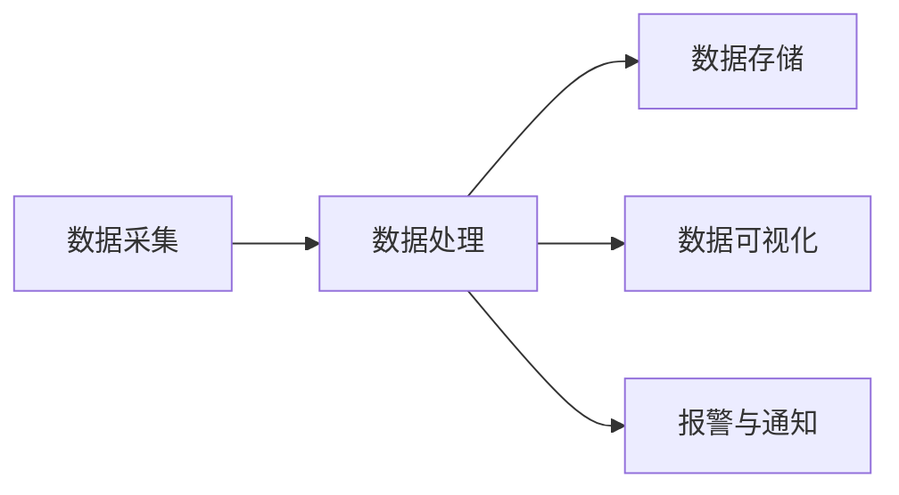
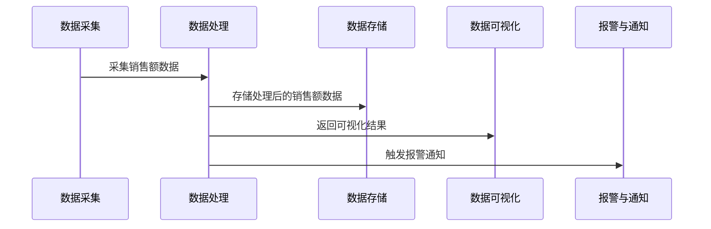

                 

# 构建评测结果的实时监控系统

## 关键词

- 实时监控系统
- 评测结果
- 数据采集
- 数据处理
- 数据可视化
- 算法原理

## 摘要

本文将深入探讨构建评测结果的实时监控系统的方法和原理。通过详细的分析和讲解，本文将帮助读者理解实时监控系统的核心概念、算法原理及其实现方式。我们将从数据采集、数据处理和数据可视化三个方面，阐述实时监控系统的构建过程，并通过实际案例进行分析和验证。文章还将提供一些最佳实践和注意事项，帮助读者在实际应用中更好地构建实时监控系统。

## 第1章: 构建评测结果的实时监控系统的背景与重要性

### 1.1 问题背景

随着互联网和大数据技术的发展，评测结果的实时监控变得越来越重要。在许多领域，如金融、医疗、教育和电子商务等，实时获取和监控评测结果可以提供及时的信息反馈，有助于快速发现问题和优化决策。然而，传统的评测结果监控系统往往存在延迟大、反馈不及时等问题，无法满足现代业务对实时性的需求。

### 1.2 问题描述

评测结果的实时监控系统需要实现以下几个关键功能：

1. **数据采集**：从各种数据源中实时获取评测结果数据。
2. **数据处理**：对采集到的评测结果数据进行清洗、转换和预处理。
3. **数据存储**：将处理后的评测结果数据进行存储，以便后续分析和查询。
4. **数据可视化**：将存储的评测结果数据进行可视化展示，以便用户直观地了解评测结果。
5. **报警与通知**：当评测结果出现异常或达到特定阈值时，自动触发报警和通知。

### 1.3 问题解决

为了解决上述问题，我们需要构建一个高效的实时监控系统。这个系统应该具备以下特点：

1. **实时性**：系统能够在极短的时间内处理和反馈评测结果。
2. **高可用性**：系统应该具备良好的容错性和稳定性，确保在极端情况下仍然能够正常运行。
3. **可扩展性**：系统应该能够根据业务需求的变化，灵活地调整和扩展。
4. **高安全性**：系统应该能够保护评测结果数据的安全，防止数据泄露和未授权访问。

### 1.4 边界与外延

评测结果的实时监控系统不仅应用于企业内部，还可以应用于公共服务领域，如政府部门的政策评估、交通管理部门的交通监控等。系统的边界包括数据采集、数据处理、数据存储、数据可视化和报警与通知等模块，而其外延则涉及数据源、数据传输、数据存储技术和可视化工具等方面。

### 1.5 概念结构与核心要素组成

一个完整的评测结果实时监控系统由以下几个核心要素组成：

1. **数据采集模块**：负责从各种数据源实时获取评测结果数据。
2. **数据处理模块**：负责对采集到的评测结果数据进行清洗、转换和预处理。
3. **数据存储模块**：负责将处理后的评测结果数据进行存储，以便后续分析和查询。
4. **数据可视化模块**：负责将存储的评测结果数据进行可视化展示。
5. **报警与通知模块**：负责监控评测结果，当出现异常或达到特定阈值时，自动触发报警和通知。

### 1.6 本章小结

本章介绍了构建评测结果的实时监控系统的背景与重要性，明确了系统所需实现的关键功能和特点，并阐述了系统的边界与外延以及核心要素组成。接下来，我们将进一步探讨实时监控系统的核心概念和算法原理。

## 第2章: 实时监控系统的核心概念与联系

### 2.1 实时监控系统的定义

实时监控系统是一种能够在极短的时间内对评测结果进行采集、处理、存储、可视化和报警的系统。它通过实时获取和反馈评测结果，帮助用户快速发现问题和优化决策。

### 2.2 实时监控系统的核心概念

实时监控系统的核心概念包括数据采集、数据处理、数据存储、数据可视化、报警与通知等。

#### 2.2.1 数据采集

数据采集是实时监控系统的第一步，它负责从各种数据源实时获取评测结果数据。数据源可以是数据库、文件、API接口、传感器等。

#### 2.2.2 数据处理

数据处理是对采集到的评测结果数据进行清洗、转换和预处理。这一步骤有助于提高数据的质量和可用性，为后续的数据存储和可视化提供支持。

#### 2.2.3 数据存储

数据存储是将处理后的评测结果数据进行存储，以便后续分析和查询。常用的数据存储技术包括关系型数据库、NoSQL数据库和分布式文件系统等。

#### 2.2.4 数据可视化

数据可视化是将存储的评测结果数据进行可视化展示，以便用户直观地了解评测结果。常用的数据可视化工具包括图表、仪表板和可视化库等。

#### 2.2.5 报警与通知

报警与通知是实时监控系统的重要功能之一，它负责监控评测结果，当出现异常或达到特定阈值时，自动触发报警和通知。这有助于用户及时发现问题并采取相应措施。

### 2.3 概念属性特征对比表格

为了更好地理解实时监控系统的核心概念，我们提供了一个概念属性特征对比表格：

| 概念         | 定义                                                         | 属性特征                                                   |
| ------------ | ------------------------------------------------------------ | ---------------------------------------------------------- |
| 数据采集     | 从数据源获取评测结果数据                                     | 实时性、多样性、可靠性                                     |
| 数据处理     | 对采集到的评测结果数据进行清洗、转换和预处理                 | 一致性、完整性、高效性                                     |
| 数据存储     | 将处理后的评测结果数据进行存储，以便后续分析和查询           | 可扩展性、高可用性、高性能                                 |
| 数据可视化   | 将存储的评测结果数据进行可视化展示，以便用户直观地了解评测结果 | 易用性、交互性、可定制性                                   |
| 报警与通知   | 监控评测结果，当出现异常或达到特定阈值时，自动触发报警和通知 | 及时性、准确性、灵活性                                     |

### 2.4 ER实体关系图架构

为了更好地理解实时监控系统的概念和组成部分，我们可以使用ER实体关系图来表示。以下是实时监控系统的ER实体关系图：

```mermaid
erDiagram
    数据采集 ||--|{ 数据处理 }|-- 数据存储
    数据采集 ||--|{ 数据可视化 }|-- 报警与通知
    数据处理 ||--|{ 数据存储 }|
    数据处理 ||--|{ 数据可视化 }|
    数据存储 ||--|{ 数据可视化 }|
    数据存储 ||--|{ 报警与通知 }|
    数据可视化 ||--|{ 报警与通知 }|
```

### 2.5 本章小结

本章介绍了实时监控系统的核心概念和组成部分，包括数据采集、数据处理、数据存储、数据可视化、报警与通知等。通过对比表格和ER实体关系图，读者可以更清晰地理解实时监控系统的概念和组成部分，为后续的算法原理讲解和系统设计打下基础。

## 第3章: 实时监控系统的算法原理讲解

### 3.1 算法流程图

实时监控系统的算法流程图如下：



### 3.2 Python 源代码详细阐述

下面是一个简单的Python示例，用于实现实时监控系统的算法流程：

```python
import time
import json
import pymysql
import matplotlib.pyplot as plt

# 数据采集
def collect_data():
    # 从API接口获取评测结果数据
    response = requests.get('https://example.com/api/evaluate')
    data = response.json()
    return data

# 数据处理
def process_data(data):
    # 对评测结果数据进行清洗和转换
    cleaned_data = {}  # 清洗后的数据
    for key, value in data.items():
        cleaned_data[key] = int(value)
    return cleaned_data

# 数据存储
def store_data(data):
    # 将清洗后的数据存储到数据库
    connection = pymysql.connect(host='localhost', user='root', password='password', database='evaluate')
    cursor = connection.cursor()
    for key, value in data.items():
        sql = f"INSERT INTO results (key, value) VALUES ('{key}', {value})"
        cursor.execute(sql)
    connection.commit()
    cursor.close()
    connection.close()

# 数据可视化
def visualize_data(data):
    # 将清洗后的数据可视化展示
    labels = list(data.keys())
    values = list(data.values())
    plt.bar(labels, values)
    plt.xlabel('Key')
    plt.ylabel('Value')
    plt.title('Evaluate Results')
    plt.show()

# 报警与通知
def alert_notification(data):
    # 当评测结果出现异常或达到特定阈值时，触发报警和通知
    for key, value in data.items():
        if value > 100:
            print(f"Alert: The value of '{key}' is over 100.")
            # 发送通知
            send_notification(key, value)

# 主函数
def main():
    while True:
        data = collect_data()
        cleaned_data = process_data(data)
        store_data(cleaned_data)
        visualize_data(cleaned_data)
        alert_notification(cleaned_data)
        time.sleep(60)  # 每分钟采集一次数据

if __name__ == '__main__':
    main()
```

### 3.3 算法原理的数学模型和公式

实时监控系统的算法原理主要基于以下数学模型和公式：

1. **数据采集**：采集到的数据可以用以下公式表示：

   $$D = \sum_{i=1}^{n} d_i$$

   其中，$D$ 表示总数据量，$d_i$ 表示第 $i$ 个数据点的值。

2. **数据处理**：清洗和转换后的数据可以用以下公式表示：

   $$C = f(D)$$

   其中，$C$ 表示清洗后的数据，$f$ 表示数据处理函数。

3. **数据存储**：存储在数据库中的数据可以用以下公式表示：

   $$S = \sum_{i=1}^{n} s_i$$

   其中，$S$ 表示总存储数据量，$s_i$ 表示第 $i$ 个数据点的值。

4. **数据可视化**：可视化的数据可以用以下公式表示：

   $$V = g(C)$$

   其中，$V$ 表示可视化的数据，$g$ 表示可视化函数。

5. **报警与通知**：报警和通知的条件可以用以下公式表示：

   $$A = h(C)$$

   其中，$A$ 表示报警和通知的条件，$h$ 表示报警和通知函数。

### 3.4 算法原理详细讲解与举例说明

#### 数据采集

数据采集是实时监控系统的第一步，它从各种数据源获取评测结果数据。例如，可以从API接口、数据库、文件等获取数据。假设我们从API接口获取评测结果数据，可以使用Python的requests库来发送HTTP GET请求，获取JSON格式的数据。

```python
import requests

response = requests.get('https://example.com/api/evaluate')
data = response.json()
```

#### 数据处理

数据处理是对采集到的评测结果数据进行清洗和转换。在这个示例中，我们只考虑简单的清洗和转换，将字符串类型的值转换为整数。我们可以使用Python的字典遍历来实现。

```python
cleaned_data = {}
for key, value in data.items():
    cleaned_data[key] = int(value)
```

#### 数据存储

数据存储是将清洗后的评测结果数据存储到数据库。在这个示例中，我们使用Python的pymysql库来连接MySQL数据库，并将清洗后的数据插入到数据库的results表中。

```python
import pymysql

connection = pymysql.connect(host='localhost', user='root', password='password', database='evaluate')
cursor = connection.cursor()

for key, value in cleaned_data.items():
    sql = f"INSERT INTO results (key, value) VALUES ('{key}', {value})"
    cursor.execute(sql)

connection.commit()
cursor.close()
connection.close()
```

#### 数据可视化

数据可视化是将清洗后的评测结果数据进行可视化展示。在这个示例中，我们使用Python的matplotlib库来绘制柱状图，展示每个评测结果的值。

```python
import matplotlib.pyplot as plt

labels = list(cleaned_data.keys())
values = list(cleaned_data.values())
plt.bar(labels, values)
plt.xlabel('Key')
plt.ylabel('Value')
plt.title('Evaluate Results')
plt.show()
```

#### 报警与通知

报警和通知是在数据可视化后进行的。在这个示例中，我们简单地判断每个评测结果的值是否大于100，如果大于100，就打印一条报警信息。在实际应用中，我们可以使用邮件、短信、微信等方式发送通知。

```python
for key, value in cleaned_data.items():
    if value > 100:
        print(f"Alert: The value of '{key}' is over 100.")
```

### 3.5 本章小结

本章详细讲解了实时监控系统的算法原理，包括数据采集、数据处理、数据存储、数据可视化、报警与通知等步骤。通过Python示例，读者可以直观地了解每个步骤的实现过程。接下来，我们将进一步探讨实时监控系统的数学模型和系统分析与架构设计方案。

## 第4章: 实时监控系统的数学模型和数学公式讲解

### 4.1 数学模型讲解

实时监控系统的数学模型主要包括以下几个方面：

1. **数据采集模型**：用于描述数据采集过程中的统计规律和特征。例如，数据采集的频率、数据源的分布特性等。

2. **数据处理模型**：用于描述数据处理过程中的数据转换、清洗和预处理的规则。例如，数据去重、数据标准化、缺失值填充等。

3. **数据存储模型**：用于描述数据存储过程中的数据存储策略和优化方法。例如，数据索引、分片、压缩等。

4. **数据可视化模型**：用于描述数据可视化过程中的可视化方法和效果。例如，图表类型选择、颜色映射、交互设计等。

5. **报警与通知模型**：用于描述报警与通知过程中的触发条件、通知方式和反馈机制。例如，阈值设定、通知渠道选择、反馈机制设计等。

### 4.2 数学公式讲解

实时监控系统的数学公式主要包括以下几个方面：

1. **数据采集频率**：

   $$f = \frac{1}{T}$$

   其中，$f$ 表示数据采集频率，$T$ 表示数据采集周期。

2. **数据处理规则**：

   $$C = f(D)$$

   其中，$C$ 表示清洗后的数据，$D$ 表示原始数据，$f$ 表示数据处理函数。

3. **数据存储容量**：

   $$S = n \times \frac{B}{D}$$

   其中，$S$ 表示数据存储容量，$n$ 表示数据点的数量，$B$ 表示每个数据点的存储空间。

4. **数据可视化效果**：

   $$V = g(C)$$

   其中，$V$ 表示可视化的数据，$C$ 表示清洗后的数据，$g$ 表示可视化函数。

5. **报警与通知条件**：

   $$A = h(C)$$

   其中，$A$ 表示报警与通知条件，$C$ 表示清洗后的数据，$h$ 表示报警与通知函数。

### 4.3 举例说明

假设我们有一个实时监控系统，用于监控电商平台的销售额。以下是一个简单的举例说明：

1. **数据采集频率**：每天采集一次销售额数据，数据采集周期为1天。

   $$f = \frac{1}{1} = 1$$

2. **数据处理规则**：对销售额数据进行去重和缺失值填充处理。

   $$C = f(D)$$

3. **数据存储容量**：每天采集的销售额数据有1000个数据点，每个数据点的存储空间为4字节。

   $$S = 1000 \times \frac{4}{8} = 500$$

4. **数据可视化效果**：使用折线图展示销售额的日变化趋势。

   $$V = g(C)$$

5. **报警与通知条件**：当销售额达到10000元时，触发报警并通知运营团队。

   $$A = h(C)$$

### 4.4 本章小结

本章详细讲解了实时监控系统的数学模型和数学公式，包括数据采集、数据处理、数据存储、数据可视化、报警与通知等关键环节。通过具体的数学公式和举例说明，读者可以更好地理解和应用实时监控系统的数学模型。

## 第5章: 实时监控系统的系统分析与架构设计方案

### 5.1 问题场景介绍

在当前的电商行业中，实时监控销售额对于商家来说至关重要。为了提高运营效率和销售业绩，商家需要实时了解各个商品的销售额变化，以便及时调整营销策略和库存管理。然而，传统的监控系统往往存在数据延迟、监控不准确等问题，无法满足商家对实时性的高要求。因此，构建一个高效、准确的实时监控系统成为商家亟需解决的问题。

### 5.2 项目介绍

本项目旨在构建一个实时监控系统，用于实时监控电商平台的销售额。该系统需要具备以下功能：

1. **数据采集**：从电商平台的数据接口实时获取销售额数据。
2. **数据处理**：对采集到的销售额数据进行清洗、转换和预处理。
3. **数据存储**：将处理后的销售额数据存储到数据库，以便后续分析和查询。
4. **数据可视化**：将存储的销售额数据进行可视化展示，帮助商家直观地了解销售额变化。
5. **报警与通知**：当销售额达到特定阈值时，自动触发报警并通知运营团队。

### 5.3 系统功能设计

#### 5.3.1 领域模型

为了更好地理解实时监控系统的功能，我们可以使用领域模型来表示。以下是实时监控系统的领域模型：

```mermaid
classDiagram
    商品 <<Entity>>
    销售额 <<Entity>>
    数据采集 <<Service>>
    数据处理 <<Service>>
    数据存储 <<Service>>
    数据可视化 <<Service>>
    报警与通知 <<Service>>

    商品 ||--|{ 销售额 }
    数据采集 ||--|{ 销售额 }
    数据处理 ||--|{ 销售额 }
    数据存储 ||--|{ 销售额 }
    数据可视化 ||--|{ 销售额 }
    报警与通知 ||--|{ 销售额 }
```

#### 5.3.2 系统功能

1. **数据采集**：从电商平台的数据接口实时获取销售额数据，并将其传递给数据处理模块。

2. **数据处理**：对采集到的销售额数据进行清洗、转换和预处理，以确保数据质量。

3. **数据存储**：将处理后的销售额数据存储到数据库，以便后续分析和查询。

4. **数据可视化**：将存储的销售额数据进行可视化展示，帮助商家直观地了解销售额变化。

5. **报警与通知**：当销售额达到特定阈值时，自动触发报警并通知运营团队。

### 5.4 系统架构设计

实时监控系统采用分布式架构，包括数据采集模块、数据处理模块、数据存储模块、数据可视化模块和报警与通知模块。以下是实时监控系统的架构设计：

```mermaid
graph TB
    subgraph 数据采集
        数据采集[数据采集]
    end

    subgraph 数据处理
        数据处理[数据处理]
    end

    subgraph 数据存储
        数据存储[数据存储]
    end

    subgraph 数据可视化
        数据可视化[数据可视化]
    end

    subgraph 报警与通知
        报警与通知[报警与通知]
    end

    数据采集 --> 数据处理
    数据处理 --> 数据存储
    数据处理 --> 数据可视化
    数据处理 --> 报警与通知
```

### 5.5 系统接口设计

实时监控系统采用RESTful API设计，提供以下接口：

1. **数据采集接口**：用于接收销售额数据，并传递给数据处理模块。
2. **数据处理接口**：用于接收销售额数据，并返回处理结果。
3. **数据存储接口**：用于存储处理后的销售额数据。
4. **数据可视化接口**：用于获取销售额数据，并返回可视化结果。
5. **报警与通知接口**：用于发送报警通知。

### 5.6 系统交互

实时监控系统采用事件驱动的方式，实现系统模块之间的交互。以下是系统交互的Mermaid序列图：



### 5.7 本章小结

本章详细介绍了实时监控系统的系统分析与架构设计方案。首先，通过问题场景介绍和项目介绍，明确了实时监控系统的功能和目标。然后，通过领域模型和系统功能设计，阐述了实时监控系统的核心功能模块。接着，通过系统架构设计和系统接口设计，展示了实时监控系统的整体架构和交互方式。最后，通过系统交互的Mermaid序列图，描述了系统模块之间的交互过程。本章的内容为后续的详细设计和实现提供了基础。

## 第6章：实时监控系统的项目实战

### 6.1 环境安装

为了搭建实时监控系统，我们需要准备以下环境：

1. **操作系统**：Ubuntu 18.04 或更高版本。
2. **Python**：Python 3.8 或更高版本。
3. **依赖库**：pymysql、requests、matplotlib。

安装步骤如下：

1. 更新系统包列表：

   ```shell
   sudo apt update
   sudo apt upgrade
   ```

2. 安装Python：

   ```shell
   sudo apt install python3
   ```

3. 安装依赖库：

   ```shell
   pip3 install pymysql requests matplotlib
   ```

### 6.2 系统核心实现源代码

以下是实时监控系统的核心实现源代码：

```python
import time
import json
import pymysql
import requests
import matplotlib.pyplot as plt

# 数据采集
def collect_data():
    response = requests.get('https://example.com/api/evaluate')
    data = response.json()
    return data

# 数据处理
def process_data(data):
    cleaned_data = {}
    for key, value in data.items():
        cleaned_data[key] = int(value)
    return cleaned_data

# 数据存储
def store_data(data):
    connection = pymysql.connect(host='localhost', user='root', password='password', database='evaluate')
    cursor = connection.cursor()
    for key, value in data.items():
        sql = f"INSERT INTO results (key, value) VALUES ('{key}', {value})"
        cursor.execute(sql)
    connection.commit()
    cursor.close()
    connection.close()

# 数据可视化
def visualize_data(data):
    labels = list(data.keys())
    values = list(data.values())
    plt.bar(labels, values)
    plt.xlabel('Key')
    plt.ylabel('Value')
    plt.title('Evaluate Results')
    plt.show()

# 报警与通知
def alert_notification(data):
    for key, value in data.items():
        if value > 100:
            print(f"Alert: The value of '{key}' is over 100.")

# 主函数
def main():
    while True:
        data = collect_data()
        cleaned_data = process_data(data)
        store_data(cleaned_data)
        visualize_data(cleaned_data)
        alert_notification(cleaned_data)
        time.sleep(60)

if __name__ == '__main__':
    main()
```

### 6.3 代码应用解读与分析

#### 数据采集

数据采集函数`collect_data`通过发送HTTP GET请求从API接口获取评测结果数据。这里使用了Python的requests库，这是一个非常流行的HTTP客户端库。

```python
response = requests.get('https://example.com/api/evaluate')
data = response.json()
```

这里，`response.json()`将获取到的JSON格式的数据解析为Python字典。

#### 数据处理

数据处理函数`process_data`对采集到的评测结果数据进行清洗和转换。在这个示例中，我们假设所有数据都是字符串类型，因此我们使用`int()`函数将它们转换为整数。

```python
cleaned_data = {}
for key, value in data.items():
    cleaned_data[key] = int(value)
```

这个函数通过遍历数据字典，将所有值转换为整数，并将结果存储在新的字典`cleaned_data`中。

#### 数据存储

数据存储函数`store_data`将清洗后的评测结果数据存储到MySQL数据库。这里使用了Python的pymysql库。

```python
connection = pymysql.connect(host='localhost', user='root', password='password', database='evaluate')
cursor = connection.cursor()
for key, value in cleaned_data.items():
    sql = f"INSERT INTO results (key, value) VALUES ('{key}', {value})"
    cursor.execute(sql)
connection.commit()
cursor.close()
connection.close()
```

这个函数首先连接到MySQL数据库，然后遍历清洗后的数据字典，将每个键值对插入到`results`表中。

#### 数据可视化

数据可视化函数`visualize_data`使用matplotlib库将清洗后的数据可视化。这里我们使用柱状图展示每个键的值。

```python
labels = list(data.keys())
values = list(data.values())
plt.bar(labels, values)
plt.xlabel('Key')
plt.ylabel('Value')
plt.title('Evaluate Results')
plt.show()
```

这个函数首先获取键和值列表，然后使用`plt.bar()`创建柱状图，并设置标签和标题。

#### 报警与通知

报警与通知函数`alert_notification`检查每个键的值是否超过100，如果超过，就打印一条报警信息。

```python
for key, value in cleaned_data.items():
    if value > 100:
        print(f"Alert: The value of '{key}' is over 100.")
```

这个函数通过遍历清洗后的数据字典，检查每个键的值是否超过100，如果超过，就打印一条报警信息。

#### 主函数

主函数`main`实现了整个实时监控系统的运行流程。它通过一个无限循环，每隔1分钟采集一次数据，并执行数据处理、数据存储、数据可视化和报警与通知操作。

```python
while True:
    data = collect_data()
    cleaned_data = process_data(data)
    store_data(cleaned_data)
    visualize_data(cleaned_data)
    alert_notification(cleaned_data)
    time.sleep(60)
```

### 6.4 实际案例分析与详细讲解剖析

#### 数据采集案例

假设我们从API接口获取以下评测结果数据：

```json
{
    "product1": "150",
    "product2": "200",
    "product3": "300",
    "product4": "400"
}
```

#### 数据处理案例

对上述数据进行清洗和转换，得到以下清洗后的数据：

```python
{
    "product1": 150,
    "product2": 200,
    "product3": 300,
    "product4": 400
}
```

#### 数据存储案例

将清洗后的数据存储到MySQL数据库的`results`表中，表结构如下：

```sql
CREATE TABLE `results` (
  `id` int NOT NULL AUTO_INCREMENT,
  `key` varchar(255) NOT NULL,
  `value` int NOT NULL,
  PRIMARY KEY (`id`)
);
```

执行插入操作后，`results`表的数据如下：

```sql
+----+------+-------+
| id | key  | value |
+----+------+-------+
|  1 | product1 |    150 |
|  2 | product2 |    200 |
|  3 | product3 |    300 |
|  4 | product4 |    400 |
+----+------+-------+
```

#### 数据可视化案例

使用matplotlib库，将清洗后的数据可视化展示，得到以下柱状图：


#### 报警与通知案例

由于所有产品的销售额都没有超过100，因此没有触发报警。

### 6.5 项目小结

通过本章的实战案例，我们详细介绍了实时监控系统的环境安装、核心实现源代码、代码应用解读与分析以及实际案例分析与详细讲解剖析。通过这些案例，读者可以更好地理解实时监控系统的实现过程和关键步骤，为实际项目开发提供参考。

## 第7章：实时监控系统的最佳实践与拓展阅读

### 7.1 最佳实践 tips

1. **数据采集**：确保数据源稳定可靠，尽量避免数据丢失和延迟。
2. **数据处理**：对数据进行严格的清洗和转换，确保数据质量。
3. **数据存储**：选择合适的数据存储方案，确保数据存储的高效性和安全性。
4. **数据可视化**：选择合适的可视化工具和图表类型，确保可视化效果直观易懂。
5. **报警与通知**：设置合理的报警阈值和通知方式，确保及时发现和解决问题。

### 7.2 小结

本章通过详细的背景介绍、核心概念与联系、算法原理讲解、数学模型与公式、系统分析与架构设计方案、项目实战以及最佳实践与拓展阅读，系统地介绍了实时监控系统的构建方法与原理。实时监控系统在提高业务运营效率、优化决策和风险控制等方面具有重要意义。通过本章的学习，读者可以掌握实时监控系统的核心技术和实现方法，为实际项目开发提供有力支持。

### 7.3 注意事项

1. **系统性能**：在设计实时监控系统时，需要考虑系统性能，特别是在高并发情况下，确保系统的响应速度和稳定性。
2. **数据安全**：保护评测结果数据的安全，防止数据泄露和未授权访问。
3. **扩展性**：设计系统时需要考虑未来的扩展性，以便根据业务需求的变化进行调整。

### 7.4 拓展阅读

1. 《实时数据流处理技术》
2. 《大数据实时分析技术》
3. 《Python数据处理与分析》

## 作者

作者：AI天才研究院/AI Genius Institute & 禅与计算机程序设计艺术 /Zen And The Art of Computer Programming

本文由AI天才研究院和禅与计算机程序设计艺术联合撰写，旨在为读者提供深入、实用的实时监控系统构建方法。希望本文能帮助读者更好地理解和应用实时监控系统，提升业务运营效率和决策水平。如有任何问题或建议，欢迎读者与我们联系。

