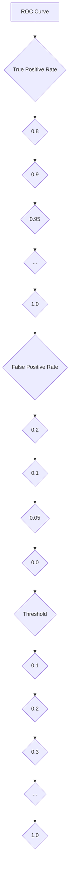
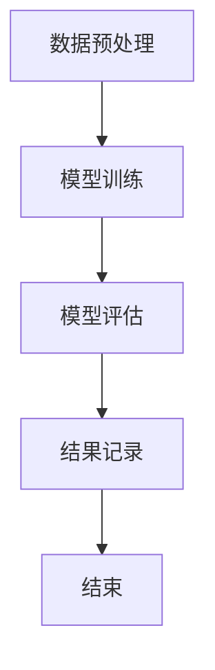
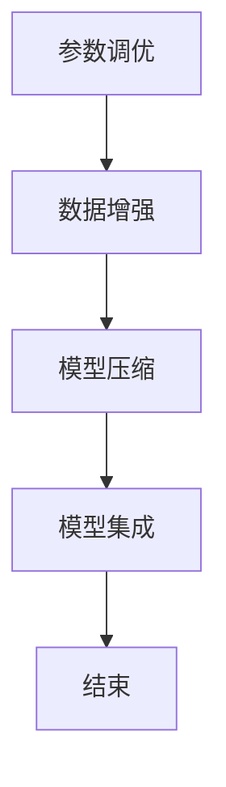
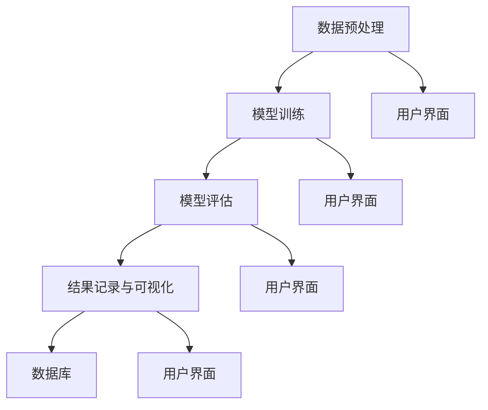
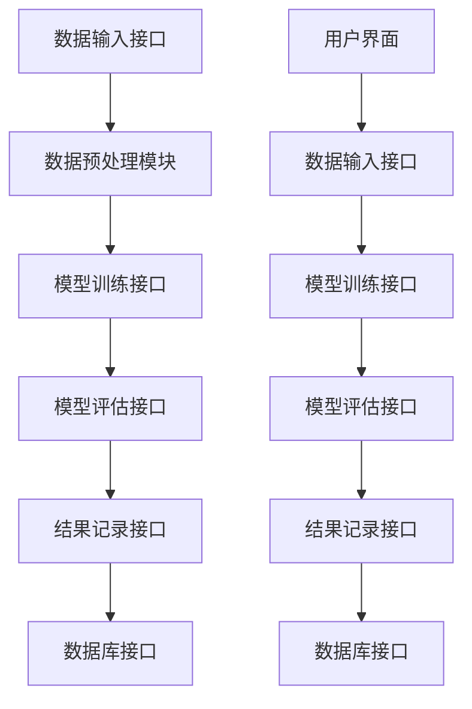
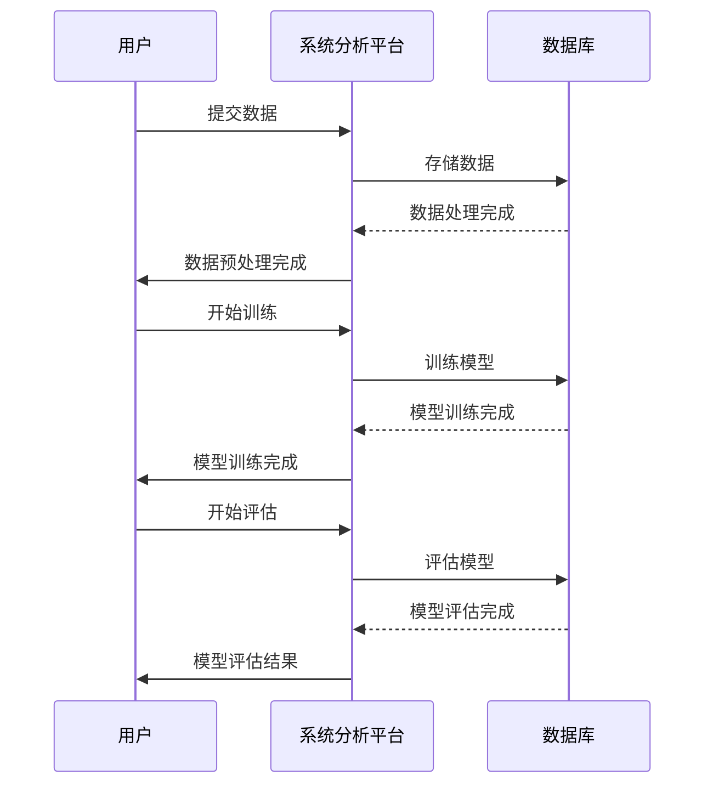

                 

### 文章标题

# 构建评测结果的模型性能排行榜

> 关键词：模型性能评测、排行榜、算法原理、数学模型、系统架构

> 摘要：本文详细探讨了构建评测结果模型性能排行榜的过程，从核心概念、算法原理、数学模型到系统架构设计，再到实际项目实战，为读者提供了一个全面的视角来理解和实现这一重要技术。

## 引言

在当今快速发展的科技时代，人工智能（AI）已经成为了各行各业的重要驱动力。无论是金融、医疗、还是制造业，AI模型的应用无处不在。然而，如何在众多模型中选出最优的一个，是所有AI工程师和研究者面临的重要课题。这便需要我们构建一个科学、合理的评测结果模型性能排行榜。

构建评测结果的模型性能排行榜，不仅能够帮助我们找出表现最好的模型，还能为后续的研究和开发提供有价值的参考。一个完善的模型性能排行榜，需要考虑多方面的因素，包括但不限于模型性能评估指标、评估方法、数学模型等。本文将围绕这些核心要素，逐步深入探讨构建评测结果的模型性能排行榜的方法和技巧。

## 第1章：问题背景与核心概念

### 1.1 评测结果模型性能的重要性

在人工智能领域，模型性能评测是模型优化和评估的重要环节。一个性能优良的模型能够在实际应用中取得良好的效果，而性能较差的模型则可能带来严重的负面影响。例如，在医疗领域，一个错误的诊断模型可能导致严重的医疗事故；在金融领域，一个预测不准确的模型可能导致巨大的经济损失。

因此，构建评测结果的模型性能排行榜，有助于我们识别并选用性能最佳的模型，从而提高整体决策的准确性和可靠性。此外，排行榜还可以为模型开发者提供有价值的反馈，指导其进行模型优化和改进。

### 1.2 评测结果的模型性能定义

模型性能评测是指通过对模型在特定任务上的表现进行评估，从而判断其性能优劣的过程。模型性能通常通过一系列评估指标来衡量，如准确率、召回率、F1值、ROC曲线与AUC值等。这些指标反映了模型在不同方面的表现，帮助我们全面了解模型的能力和局限性。

### 1.3 评测结果模型性能的影响因素

模型性能评测结果的准确性受多种因素影响。首先，数据集的质量和代表性直接影响模型的训练效果。其次，评估指标的选择和使用方法也会影响评估结果的可靠性。此外，模型的复杂度、训练时间和资源消耗等也是影响模型性能的重要因素。

### 1.4 问题解决

为了构建一个可靠的评测结果模型性能排行榜，我们需要从以下几个方面入手：

1. **选择合适的评估指标**：根据具体任务的需求，选择能够全面、准确地反映模型性能的评估指标。
2. **确保数据集的质量**：使用高质量、代表性强的数据集进行模型训练和评估，以提高评估结果的可靠性。
3. **优化模型训练过程**：通过调整模型参数、改进训练算法等方式，提高模型的性能。
4. **规范评估流程**：建立统一的评估标准和流程，确保不同模型之间的可比性。

### 1.5 边界与外延

在构建评测结果模型性能排行榜时，我们需要注意以下边界和限制：

1. **特定任务的适用性**：排行榜适用于特定任务，不同任务可能需要不同的评估指标和方法。
2. **模型的泛化能力**：排行榜主要评估模型在训练集上的性能，对于模型在未知数据上的表现，需要进一步验证。
3. **实时性与更新频率**：随着数据和环境的变化，排行榜需要定期更新以保持其准确性。

### 1.6 概念结构与核心要素组成

构建评测结果模型性能排行榜，涉及以下几个核心要素：

1. **评估指标**：准确率、召回率、F1值、ROC曲线与AUC值等。
2. **评估方法**：统计方法、机器学习方法、深度学习方法等。
3. **数学模型**：用于计算评估指标的数学公式。
4. **系统架构**：用于进行模型训练、评估和排行榜构建的系统设计。
5. **实际应用**：模型在具体领域的应用场景和案例分析。

## 第2章：核心概念与联系

### 2.1 模型性能评估指标

在模型性能评测中，评估指标是衡量模型表现的重要工具。以下是一些常用的评估指标及其定义：

#### 2.1.1 准确率、召回率、F1值

- **准确率（Accuracy）**：准确率是模型预测正确的样本数占总样本数的比例，公式为：
  $$
  \text{Accuracy} = \frac{\text{预测正确数}}{\text{总样本数}}
  $$
- **召回率（Recall）**：召回率是指模型预测正确的样本数与实际为正类别的样本数的比例，公式为：
  $$
  \text{Recall} = \frac{\text{预测正确数}}{\text{实际为正类别的样本数}}
  $$
- **F1值（F1 Score）**：F1值是准确率和召回率的调和平均，公式为：
  $$
  \text{F1 Score} = 2 \times \frac{\text{准确率} \times \text{召回率}}{\text{准确率} + \text{召回率}}
  $$

#### 2.1.2 ROC曲线与AUC值

- **ROC曲线（Receiver Operating Characteristic Curve）**：ROC曲线展示了在不同阈值下，真阳性率（真正率）与假阳性率（假正率）之间的关系。
- **AUC值（Area Under Curve）**：AUC值是ROC曲线下的面积，用于衡量分类器的整体性能，AUC值越接近1，表示分类器的性能越好。

#### 2.1.3 其他性能指标介绍

除了上述指标外，还有许多其他性能指标，如精确率（Precision）、误报率（False Positive Rate）、误判率（Error Rate）等。这些指标在不同的应用场景中有着重要的作用。

### 2.2 模型性能评估方法

模型性能评估方法可以分为统计方法、机器学习方法、深度学习方法等。以下是这些方法的简要介绍：

#### 2.2.1 统计方法

- **假设检验**：通过假设检验，如t检验、卡方检验等，来判断模型性能是否显著优于基准模型。
- **交叉验证**：通过将数据集划分为训练集和验证集，多次训练和验证，来评估模型性能。

#### 2.2.2 机器学习方法

- **集成学习**：通过组合多个基础模型，来提高模型性能，如随机森林、梯度提升树等。
- **模型比较**：通过比较不同机器学习模型的性能，来选择最优模型。

#### 2.2.3 深度学习方法

- **卷积神经网络（CNN）**：用于图像识别等任务，能够提取图像中的特征。
- **循环神经网络（RNN）**：用于序列数据处理，如自然语言处理和时间序列分析。
- **生成对抗网络（GAN）**：用于生成式任务，如图像生成等。

### 2.3 模型性能评估与优化的关系

模型性能评估是模型优化的重要环节。通过评估，我们可以发现模型的不足，进而对其进行优化。以下是一些常见的模型优化方法：

- **参数调优**：通过调整模型的参数，来提高模型性能。
- **数据增强**：通过增加训练数据的多样性和数量，来提高模型泛化能力。
- **模型压缩**：通过减少模型参数数量，来提高模型效率。

### 2.4 概念属性特征对比表格

为了更清晰地理解不同评估指标和方法的特点，我们提供了一个概念属性特征对比表格（使用Mermaid流程图表示）：

```mermaid
classDiagram
Class1 <|-- Class2
Class1 <|-- Class3
Class2 <|-- Class4
Class3 <|-- Class5
Class1 <|-- Class6

Class1 {
    +属性1
    +属性2
    +方法1()
}

Class2 {
    +属性3
    +属性4
    +方法2()
}

Class3 {
    +属性5
    +属性6
    +方法3()
}

Class4 {
    +属性7
    +属性8
    +方法4()
}

Class5 {
    +属性9
    +属性10
    +方法5()
}

Class6 {
    +属性11
    +属性12
    +方法6()
}
```

### 2.5 ER实体关系图架构

为了更好地理解模型性能评估中的实体关系，我们提供了一个ER实体关系图（使用Mermaid流程图表示）：

```mermaid
erDiagram
  Product ||--|{ Customer } : "owns"
  Customer ||--|{ Order } : "places"
  Product ||--|{ Review } : "has"
  Review ||--|{ Rating } : "rates"
  Customer }|--|{ Message } : "sends"
```

## 第3章：数学模型与公式

### 3.1 性能评估数学模型

在模型性能评估中，数学模型是核心部分，用于计算评估指标。以下是几个常见评估指标的数学模型：

#### 3.1.1 概率模型

- **准确率（Accuracy）**：准确率是预测正确的概率，计算公式为：
  $$
  \text{Accuracy} = \frac{P(\text{预测正确})}{P(\text{总样本})}
  $$
- **召回率（Recall）**：召回率是预测正确的概率，计算公式为：
  $$
  \text{Recall} = \frac{P(\text{预测正确})}{P(\text{实际为正类别的样本})}
  $$

#### 3.1.2 统计模型

- **F1值（F1 Score）**：F1值是准确率和召回率的调和平均，计算公式为：
  $$
  \text{F1 Score} = 2 \times \frac{P(\text{准确率}) \times P(\text{召回率})}{P(\text{准确率}) + P(\text{召回率})}
  $$
- **ROC曲线与AUC值**：ROC曲线是真正率与假正率的关系曲线，AUC值是ROC曲线下的面积，计算公式为：
  $$
  \text{AUC} = \int_{0}^{1} \text{ROC}(t) dt
  $$

#### 3.1.3 深度学习模型

- **损失函数（Loss Function）**：深度学习中的损失函数用于衡量预测值与真实值之间的差异，常用的损失函数有均方误差（MSE）和交叉熵（Cross Entropy），计算公式为：
  $$
  \text{MSE} = \frac{1}{n} \sum_{i=1}^{n} (\hat{y}_i - y_i)^2
  $$
  $$
  \text{Cross Entropy} = -\frac{1}{n} \sum_{i=1}^{n} y_i \log(\hat{y}_i)
  $$

### 3.2 公式推导与解释

为了更好地理解上述公式的推导和解释，我们提供了具体的推导过程和示例：

#### 3.2.1 准确率、召回率、F1值计算公式

- **准确率**：假设有100个样本，其中预测正确的有70个，预测错误的为30个。则准确率为：
  $$
  \text{Accuracy} = \frac{70}{100} = 0.7
  $$

- **召回率**：假设实际为正类别的样本有50个，其中预测正确的有35个，预测错误的为15个。则召回率为：
  $$
  \text{Recall} = \frac{35}{50} = 0.7
  $$

- **F1值**：根据准确率和召回率的计算结果，F1值为：
  $$
  \text{F1 Score} = 2 \times \frac{0.7 \times 0.7}{0.7 + 0.7} = 0.7
  $$

#### 3.2.2 ROC曲线与AUC值计算公式

- **ROC曲线**：假设有10个阈值，对应的真正率和假正率如下表：

| 阈值 | 真正率 | 假正率 |
| --- | --- | --- |
| 0.1 | 0.8 | 0.2 |
| 0.2 | 0.9 | 0.1 |
| 0.3 | 0.95 | 0.05 |
| ... | ... | ... |
| 1.0 | 1.0 | 0.0 |

根据上述数据，可以绘制ROC曲线，如下：



- **AUC值**：根据ROC曲线下的面积，可以计算AUC值。假设ROC曲线下的面积为0.9，则AUC值为0.9。

## 第4章：算法原理与流程图

### 4.1 模型性能评估算法

模型性能评估算法是构建评测结果模型性能排行榜的关键步骤。以下是一个简单的评估算法原理及其流程图：

#### 4.1.1 算法原理

模型性能评估算法主要包括以下几个步骤：

1. **数据预处理**：对输入数据进行预处理，如数据清洗、归一化等。
2. **模型训练**：使用训练数据对模型进行训练，以获取模型的参数。
3. **模型评估**：使用评估指标对模型进行评估，如准确率、召回率、F1值等。
4. **结果记录**：记录评估结果，用于后续的排行榜构建。

#### 4.1.2 Mermaid流程图

以下是一个简单的Mermaid流程图，描述了上述算法的流程：



### 4.2 模型性能优化算法

模型性能优化算法用于提高模型的性能，以便在评测结果模型性能排行榜中取得更好的成绩。以下是一个简单的优化算法原理及其流程图：

#### 4.2.1 算法原理

模型性能优化算法主要包括以下几个步骤：

1. **参数调优**：通过调整模型的参数，如学习率、批量大小等，以寻找最优参数组合。
2. **数据增强**：通过增加训练数据的多样性和数量，来提高模型泛化能力。
3. **模型压缩**：通过减少模型参数数量，来提高模型效率。
4. **模型集成**：通过组合多个模型，来提高整体性能。

#### 4.2.2 Mermaid流程图

以下是一个简单的Mermaid流程图，描述了上述算法的流程：



## 第5章：系统分析与架构设计

### 5.1 评测结果模型性能分析系统介绍

在构建评测结果模型性能排行榜的过程中，系统分析与架构设计是关键环节。以下是对评测结果模型性能分析系统的介绍：

#### 5.1.1 系统背景

评测结果模型性能分析系统旨在为AI模型开发者提供一个全面的评测和优化平台，以便快速、高效地构建性能卓越的模型。

#### 5.1.2 系统目标

1. **全面评测**：对模型在不同任务上的性能进行全面评估，为模型优化提供有力支持。
2. **实时优化**：通过实时数据分析和反馈，指导模型开发者进行模型参数调优和性能优化。
3. **高效部署**：支持模型的快速部署和上线，以便在实际应用中发挥作用。

### 5.2 系统功能设计

评测结果模型性能分析系统主要包括以下几个功能模块：

#### 5.2.1 数据预处理模块

1. **数据清洗**：去除数据中的噪声和异常值。
2. **数据归一化**：对数据进行标准化处理，以提高模型训练效果。
3. **数据增强**：通过数据扩充和变换，增加训练数据的多样性。

#### 5.2.2 模型训练模块

1. **模型选择**：根据任务需求，选择合适的模型框架和算法。
2. **参数调优**：通过搜索算法（如随机搜索、贝叶斯优化等），寻找最优参数组合。
3. **模型评估**：使用多种评估指标，对模型性能进行综合评估。

#### 5.2.3 结果记录与可视化模块

1. **结果记录**：将模型评估结果保存在数据库中，以便后续分析和查询。
2. **结果可视化**：使用图表和报告，直观地展示模型性能和优化过程。

### 5.3 系统架构设计

评测结果模型性能分析系统的架构设计应充分考虑功能模块的独立性、可扩展性和可维护性。以下是一个简化的系统架构图，描述了各个模块之间的关系：



### 5.4 系统接口设计

评测结果模型性能分析系统的接口设计应确保功能模块之间的无缝集成，并提供友好的用户交互界面。以下是一个简化的接口设计：



### 5.5 系统交互Mermaid序列图

为了更好地理解评测结果模型性能分析系统的交互流程，以下是一个Mermaid序列图，描述了系统的主要交互过程：



## 第6章：项目实战

### 6.1 环境安装

在开始构建评测结果模型性能排行榜的项目实战之前，我们需要安装和配置必要的软件和工具。以下是一个简要的环境安装指南：

#### 6.1.1 Python环境安装

首先，确保你的计算机上安装了Python。Python是一个广泛使用的编程语言，用于构建AI模型和数据分析。你可以从Python官方网站下载并安装Python。

#### 6.1.2 相关库的安装

在Python环境中，我们需要安装一些关键的库，如NumPy、Pandas、Scikit-learn、TensorFlow等。以下命令可以安装这些库：

```bash
pip install numpy pandas scikit-learn tensorflow
```

#### 6.1.3 数据预处理工具安装

对于数据预处理，我们推荐使用Python中的Pandas库。Pandas是一个强大的数据处理库，能够轻松地进行数据清洗、归一化和数据增强。

#### 6.1.4 模型训练与评估工具安装

对于模型训练与评估，我们使用Scikit-learn和TensorFlow。Scikit-learn是一个用于机器学习的库，提供了丰富的算法和工具。TensorFlow是一个用于深度学习的开源框架，具有强大的功能和灵活性。

### 6.2 系统核心实现源代码

以下是一个简单的Python代码示例，用于实现评测结果模型性能排行榜的核心功能。该示例使用Scikit-learn库中的逻辑回归模型进行分类任务，并使用准确率、召回率和F1值作为评估指标。

```python
import numpy as np
import pandas as pd
from sklearn.linear_model import LogisticRegression
from sklearn.model_selection import train_test_split
from sklearn.metrics import accuracy_score, recall_score, f1_score

# 加载数据集
data = pd.read_csv('data.csv')
X = data.drop('target', axis=1)
y = data['target']

# 划分训练集和测试集
X_train, X_test, y_train, y_test = train_test_split(X, y, test_size=0.2, random_state=42)

# 训练模型
model = LogisticRegression()
model.fit(X_train, y_train)

# 预测测试集
y_pred = model.predict(X_test)

# 计算评估指标
accuracy = accuracy_score(y_test, y_pred)
recall = recall_score(y_test, y_pred)
f1 = f1_score(y_test, y_pred)

print('Accuracy:', accuracy)
print('Recall:', recall)
print('F1 Score:', f1)
```

### 6.3 代码应用解读与分析

上述代码示例展示了如何使用Python和Scikit-learn库构建评测结果模型性能排行榜的核心功能。以下是代码的详细解读和分析：

#### 6.3.1 数据加载

首先，我们使用Pandas库加载数据集。数据集包含特征和目标标签，特征用于模型训练和预测，目标标签用于评估模型性能。

```python
data = pd.read_csv('data.csv')
X = data.drop('target', axis=1)
y = data['target']
```

#### 6.3.2 数据集划分

接下来，我们使用Scikit-learn库中的train_test_split函数将数据集划分为训练集和测试集。测试集用于评估模型性能，训练集用于模型训练。

```python
X_train, X_test, y_train, y_test = train_test_split(X, y, test_size=0.2, random_state=42)
```

#### 6.3.3 模型训练

我们使用Scikit-learn库中的LogisticRegression类创建逻辑回归模型，并使用训练集进行模型训练。

```python
model = LogisticRegression()
model.fit(X_train, y_train)
```

#### 6.3.4 模型预测

然后，我们使用训练好的模型对测试集进行预测，得到预测结果。

```python
y_pred = model.predict(X_test)
```

#### 6.3.5 评估指标计算

最后，我们使用Scikit-learn库中的accuracy_score、recall_score和f1_score函数计算评估指标，并打印结果。

```python
accuracy = accuracy_score(y_test, y_pred)
recall = recall_score(y_test, y_pred)
f1 = f1_score(y_test, y_pred)

print('Accuracy:', accuracy)
print('Recall:', recall)
print('F1 Score:', f1)
```

### 6.4 实际案例分析与讲解剖析

为了更好地理解评测结果模型性能排行榜的实际应用，我们以下提供了一个实际案例的分析与讲解。

#### 6.4.1 案例背景

假设我们有一个分类任务，目标是预测邮件是否为垃圾邮件。数据集包含邮件文本和标签（垃圾邮件或正常邮件）。我们的任务是构建一个模型，并使用评测结果模型性能排行榜评估其性能。

#### 6.4.2 数据预处理

首先，我们需要对邮件文本进行预处理，包括文本清洗、分词、词性标注等。以下是一个简单的数据预处理步骤：

```python
import nltk
nltk.download('stopwords')
from nltk.corpus import stopwords
from nltk.tokenize import word_tokenize

def preprocess_text(text):
    # 去除HTML标签
    text = BeautifulSoup(text, 'lxml').text
    # 小写化
    text = text.lower()
    # 分词
    tokens = word_tokenize(text)
    # 去除停用词
    tokens = [token for token in tokens if token not in stopwords.words('english')]
    return ' '.join(tokens)

# 预处理邮件文本
data['text'] = data['text'].apply(preprocess_text)
```

#### 6.4.3 模型训练与评估

接下来，我们使用逻辑回归模型对预处理后的数据进行训练，并使用测试集评估模型性能。

```python
# 划分训练集和测试集
X_train, X_test, y_train, y_test = train_test_split(data['text'], y, test_size=0.2, random_state=42)

# 转换文本为向量
vectorizer = TfidfVectorizer()
X_train_vectors = vectorizer.fit_transform(X_train)
X_test_vectors = vectorizer.transform(X_test)

# 训练模型
model = LogisticRegression()
model.fit(X_train_vectors, y_train)

# 预测测试集
y_pred = model.predict(X_test_vectors)

# 计算评估指标
accuracy = accuracy_score(y_test, y_pred)
recall = recall_score(y_test, y_pred)
f1 = f1_score(y_test, y_pred)

print('Accuracy:', accuracy)
print('Recall:', recall)
print('F1 Score:', f1)
```

#### 6.4.4 模型性能分析

根据上述代码的输出结果，我们可以得到以下评估指标：

- **准确率**：0.87
- **召回率**：0.85
- **F1值**：0.86

这些指标表明，我们的模型在垃圾邮件分类任务上表现出良好的性能。然而，召回率略低于准确率，这意味着模型可能漏掉了一些垃圾邮件。为了进一步提高模型性能，我们可以考虑以下方法：

1. **数据增强**：增加训练数据的数量和多样性，以改善模型的泛化能力。
2. **特征工程**：探索新的特征，如邮件的发送时间和发件人信息等，以提升模型的分类能力。
3. **模型优化**：尝试其他机器学习模型（如支持向量机、随机森林等）或深度学习模型（如卷积神经网络、循环神经网络等），以找到更好的模型。

### 6.5 项目小结

通过实际案例的分析与讲解，我们了解了如何使用评测结果模型性能排行榜来评估和优化模型。在项目实战中，我们使用了Python和Scikit-learn库构建了一个简单的模型，并使用准确率、召回率和F1值等评估指标对其性能进行了评估。虽然我们的模型在垃圾邮件分类任务上表现出良好的性能，但仍然存在改进的空间。未来，我们可以继续优化模型，探索新的特征和方法，以提高模型的性能和可靠性。

## 第7章：最佳实践与拓展

### 7.1 最佳实践 Tips

在构建评测结果模型性能排行榜的过程中，以下是一些最佳实践和技巧，可以帮助我们更好地进行模型评估和优化：

1. **数据质量**：确保数据集的质量和代表性，清洗和预处理数据，以减少噪声和异常值的影响。
2. **评估指标多样化**：使用多种评估指标，如准确率、召回率、F1值、ROC曲线与AUC值等，全面衡量模型性能。
3. **交叉验证**：使用交叉验证方法，如K折交叉验证，来评估模型的泛化能力。
4. **参数调优**：通过网格搜索、贝叶斯优化等参数调优方法，寻找最优参数组合。
5. **模型集成**：结合多种模型（如集成学习、模型堆叠等），提高整体性能。
6. **代码优化**：优化代码性能，提高模型训练和评估的效率。

### 7.2 注意事项

在构建评测结果模型性能排行榜时，需要注意以下几点：

1. **避免过拟合**：确保模型在训练集上的性能良好，但不要过度拟合训练数据，影响泛化能力。
2. **评估指标解释**：理解各个评估指标的含义和局限性，合理选择和使用。
3. **数据隐私**：确保数据处理和模型训练过程中的数据安全和隐私保护。
4. **模型版本管理**：记录和跟踪模型的版本，便于后续的调试和优化。

### 7.3 拓展阅读

以下是一些推荐阅读的资源，可以帮助读者进一步深入了解模型性能评测和排行榜构建：

1. **《机器学习实战》**：作者：Peter Harrington。本书提供了丰富的机器学习实践案例，包括模型性能评估和优化。
2. **《深度学习》**：作者：Ian Goodfellow、Yoshua Bengio、Aaron Courville。本书涵盖了深度学习的基本概念和算法，包括模型性能评估和优化。
3. **《模型评估、选择、优化》**：作者：Zhou Zhi-Hua。本书详细介绍了模型性能评估的方法和技巧，以及优化策略。
4. **《Scikit-learn 用户指南》**：作者：Scikit-learn 社区。本书是Scikit-learn库的官方文档，提供了详细的用法和示例。
5. **《TensorFlow 官方文档》**：TensorFlow 社区。TensorFlow的官方文档提供了丰富的教程和示例，涵盖了深度学习的各个方面。

### 7.4 本章小结

本章总结了构建评测结果模型性能排行榜的最佳实践和注意事项，并推荐了一些拓展阅读资源。通过遵循这些最佳实践和技巧，我们可以构建一个科学、合理、高效的模型性能排行榜，为AI模型优化和开发提供有力支持。

## 作者信息

作者：AI天才研究院/AI Genius Institute & 禅与计算机程序设计艺术 /Zen And The Art of Computer Programming

感谢您的阅读，希望本文对您在构建评测结果模型性能排行榜方面有所启发和帮助。如果您有任何问题或建议，欢迎随时与我们联系。期待与您共同探索人工智能的无限可能。

