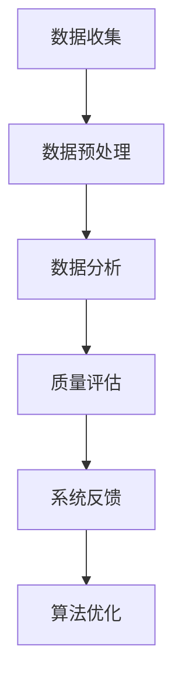
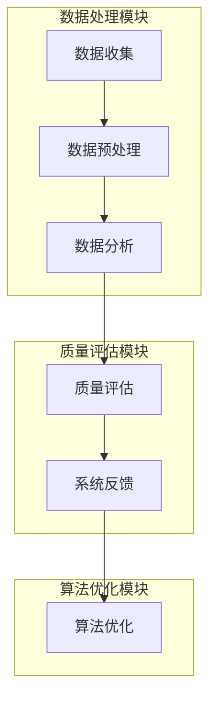
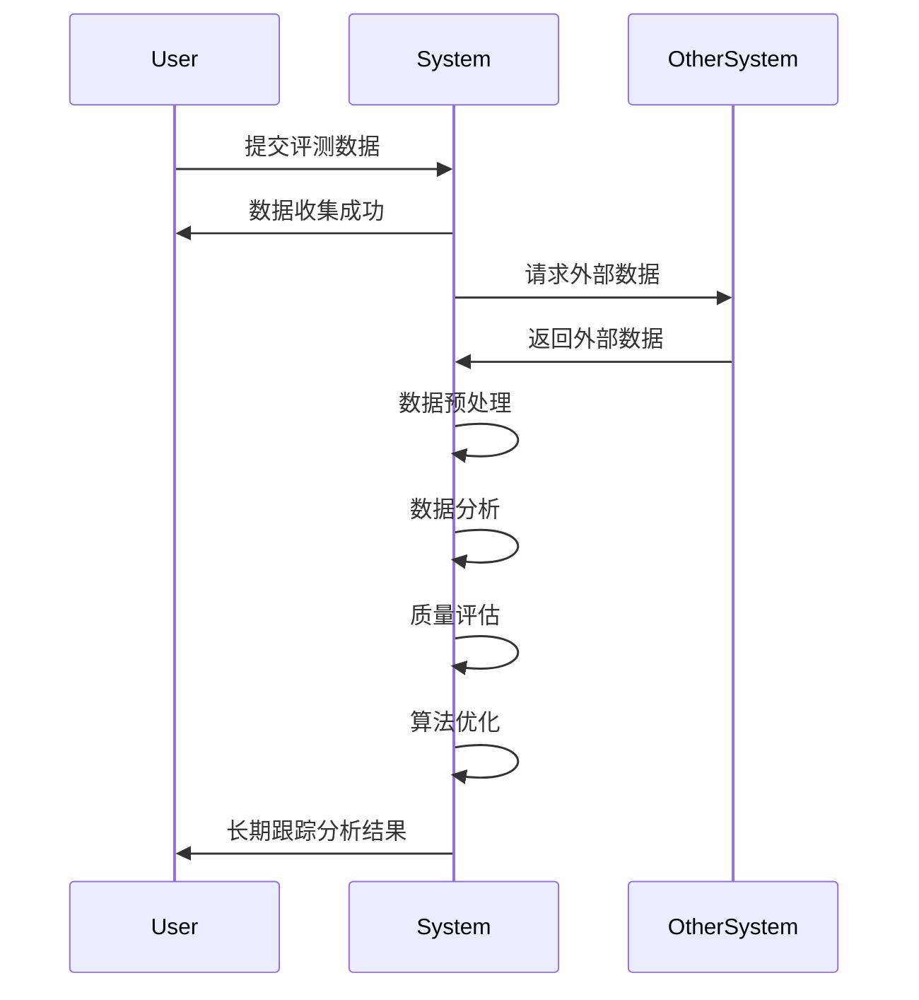

                 


## 《构建评测结果的长期跟踪分析系统》

### 关键词：评测结果、长期跟踪、数据分析、系统架构、算法优化

### 摘要：

在信息技术高速发展的今天，评测结果的跟踪与分析变得越来越重要。然而，传统的评测系统往往只能提供短期的、片面的数据结果，难以满足长期跟踪与分析的需求。本文将详细探讨如何构建一个具备长期跟踪分析能力的评测结果系统，通过系统设计与架构、核心概念讲解、算法原理分析及实战案例，为读者呈现一个全方位、深层次的分析系统构建方法。

### 目录大纲：

**第一部分：背景介绍**

### 1. 引言
- **1.1 评测结果跟踪的必要性**
- **1.2 长期跟踪分析的价值**
- **1.3 系统构建的目标与挑战**

### 2. 核心概念
- **2.1 评测结果的定义**
- **2.2 长期跟踪分析的概念**
- **2.3 系统构建的基本原则**

### 3. 系统设计与架构
- **3.1 系统架构设计**
- **3.2 数据处理流程**
- **3.3 系统功能模块**

**第二部分：核心概念与联系**

### 4. 核心概念原理
- **4.1 数据收集与预处理**
- **4.2 数据分析技术**
- **4.3 质量评估与优化**

### 5. 概念属性特征对比表格
- **5.1 不同分析技术的比较**
- **5.2 系统设计与实现策略**

### 6. ER实体关系图架构
- **6.1 实体定义**
- **6.2 关系定义**
- **6.3 实体关系图**

**第三部分：算法原理讲解**

### 7. 算法流程图


### 8. Python源代码
```python
# 示例代码
```

### 9. 数学模型与公式
- **9.1 数据分析数学模型**
  $$
  \text{Mean} = \frac{\sum_{i=1}^{n} x_i}{n}
  $$
- **9.2 质量评估数学模型**
  $$
  \text{Score} = \frac{\text{True Positive} + \text{True Negative}}{\text{True Positive} + \text{False Positive} + \text{True Negative} + \text{False Negative}}
  $$

### 10. 算法举例说明
- **10.1 数据收集示例**
- **10.2 数据预处理示例**
- **10.3 数据分析示例**
- **10.4 质量评估示例**

**第四部分：系统分析与架构设计方案**

### 11. 问题场景介绍
- **11.1 评测结果跟踪的应用场景**
- **11.2 长期跟踪分析的需求分析**

### 12. 系统功能设计
- **12.1 领域模型类图**

### 13. 系统架构设计
- **13.1 系统架构图**

### 14. 系统接口设计和系统交互
- **14.1 系统接口设计**
- **14.2 系统交互序列图**

**第五部分：项目实战**

### 15. 环境安装
- **15.1 环境配置**
- **15.2 工具安装**

### 16. 系统核心实现源代码
```python
# 示例

```

### 17. 代码应用解读与分析
- **17.1 数据收集与预处理**
- **17.2 数据分析**
- **17.3 质量评估**
- **17.4 算法优化**

### 18. 实际案例分析和详细讲解剖析
- **18.1 案例一：数据收集与预处理**
- **18.2 案例二：数据分析与质量评估**
- **18.3 案例三：算法优化与系统反馈**

### 19. 项目小结

### 最佳实践 tips、小结、注意事项、拓展阅读等内容

---

#### 第一部分：背景介绍

### 1. 引言

在当今信息化社会中，评测结果对于各种系统的性能评估、产品改进、决策制定等方面具有重要意义。然而，传统的评测系统大多只能提供短期的、片面的数据结果，难以满足长期跟踪与分析的需求。为了应对这一挑战，我们需要构建一个具备长期跟踪分析能力的评测结果系统，以便更全面、深入地了解系统性能的变化趋势。

构建这样一个系统不仅需要对评测结果的定义、数据处理流程、系统功能模块等有深入的理解，还需要在数据收集、预处理、分析、质量评估和优化等方面进行细致的设计与实现。本文将逐步探讨这些问题，并通过具体的实例来说明如何构建一个高效的长期跟踪分析系统。

#### 1.1 评测结果跟踪的必要性

评测结果跟踪是指在评测过程中，对评测结果进行持续监控、记录和分析，以便及时发现和解决问题。传统的评测方式往往局限于一次性评估，无法提供系统的、持续性的数据支持。这使得很多系统在运行过程中无法及时发现性能瓶颈、优化策略不足等问题，从而影响了系统的稳定性和可靠性。

长期跟踪评测结果有以下必要性：

1. **性能监测**：通过持续跟踪评测结果，可以实时监测系统性能的变化，及时发现性能问题并进行优化。
2. **趋势分析**：长期跟踪分析有助于发现系统性能的变化趋势，为系统的改进提供科学依据。
3. **决策支持**：基于长期跟踪的数据分析，可以为系统优化、资源配置等决策提供有力支持。
4. **质量管理**：通过评测结果跟踪，可以评估系统的质量水平，为质量管理提供数据支持。

#### 1.2 长期跟踪分析的价值

长期跟踪分析不仅有助于发现系统性能问题，还有以下价值：

1. **预测性分析**：通过对历史数据的分析，可以预测未来系统性能的变化趋势，为系统优化提供前瞻性指导。
2. **异常检测**：长期跟踪分析可以发现异常数据，及时发现潜在的问题，防止故障发生。
3. **精细化运营**：基于长期跟踪的数据分析，可以优化资源配置、提高运营效率，实现精细化运营。
4. **创新能力**：长期跟踪分析有助于发现新的需求、挖掘新的业务机会，为创新提供支持。

#### 1.3 系统构建的目标与挑战

构建一个长期跟踪分析系统的主要目标是：

1. **数据完整性**：确保评测数据的完整性和准确性，为后续分析提供可靠的基础。
2. **实时性**：实现评测结果的实时监控和反馈，提高系统响应速度。
3. **灵活性**：支持多种评测指标和数据分析方法，适应不同的应用场景。
4. **可扩展性**：系统应具备良好的可扩展性，能够随着业务需求的变化进行升级和优化。

在系统构建过程中，面临的挑战包括：

1. **数据质量**：确保数据的质量，避免噪声和错误数据对分析结果的影响。
2. **处理效率**：处理大量的评测数据，保证系统的实时性和高效性。
3. **可维护性**：系统应具备良好的可维护性，便于后续的优化和升级。
4. **安全性**：保障评测数据的安全，防止数据泄露和非法访问。

#### 2. 核心概念

##### 2.1 评测结果的定义

评测结果是对系统性能、功能、质量等方面进行评估的结果。它通常包括多个指标，如响应时间、吞吐量、错误率等。评测结果可以定量或定性地描述系统的性能和状态。

##### 2.2 长期跟踪分析的概念

长期跟踪分析是指对评测结果进行持续、系统的监控、记录和分析，以发现系统性能的变化趋势、问题隐患和优化机会。长期跟踪分析可以基于历史数据、实时数据或两者结合。

##### 2.3 系统构建的基本原则

构建长期跟踪分析系统应遵循以下基本原则：

1. **数据驱动**：以数据为核心，确保数据的完整性和准确性。
2. **模块化设计**：将系统划分为多个功能模块，便于维护和扩展。
3. **灵活配置**：支持多种评测指标和数据分析方法，适应不同的应用场景。
4. **实时反馈**：实现评测结果的实时监控和反馈，提高系统响应速度。
5. **可扩展性**：系统应具备良好的可扩展性，能够随着业务需求的变化进行升级和优化。

#### 3. 系统设计与架构

##### 3.1 系统架构设计

长期跟踪分析系统的架构设计应充分考虑性能、可扩展性和可维护性。以下是系统架构的基本设计思路：

1. **数据层**：负责数据的收集、存储和管理。数据源可以是实时数据、历史数据或外部数据。
2. **数据处理层**：负责对收集到的数据进行分析、清洗和预处理，为后续分析提供数据基础。
3. **分析层**：根据业务需求，对预处理后的数据进行深度分析，提取有价值的信息。
4. **展示层**：通过可视化界面展示分析结果，支持用户对系统性能的实时监控和追踪。
5. **接口层**：提供与其他系统的接口，实现数据共享和交互。

##### 3.2 数据处理流程

长期跟踪分析系统的数据处理流程主要包括以下步骤：

1. **数据收集**：从各种数据源收集评测数据，包括实时数据和历史数据。
2. **数据预处理**：对收集到的数据进行清洗、去噪、格式化等处理，确保数据的质量和一致性。
3. **数据存储**：将预处理后的数据存储到数据库中，支持快速查询和检索。
4. **数据分析**：根据业务需求，对存储的数据进行统计、分析、建模等处理。
5. **结果展示**：将分析结果通过可视化界面展示给用户，支持用户对系统性能的实时监控和追踪。

##### 3.3 系统功能模块

长期跟踪分析系统的功能模块主要包括：

1. **数据收集模块**：负责从各种数据源收集评测数据，支持实时数据和历史数据的收集。
2. **数据预处理模块**：负责对收集到的数据进行分析、清洗、去噪、格式化等处理。
3. **数据分析模块**：根据业务需求，对预处理后的数据进行统计、分析、建模等处理。
4. **结果展示模块**：通过可视化界面展示分析结果，支持用户对系统性能的实时监控和追踪。
5. **接口模块**：提供与其他系统的接口，实现数据共享和交互。

### 第二部分：核心概念与联系

#### 4. 核心概念原理

##### 4.1 数据收集与预处理

数据收集与预处理是长期跟踪分析系统的关键环节，直接影响到分析结果的准确性和可靠性。数据收集模块需要从多个数据源（如日志文件、数据库、API 等）收集评测数据，并进行实时监控。以下是一些关键步骤：

1. **数据采集**：通过日志文件、数据库连接、API 调用等方式收集评测数据。
2. **数据清洗**：对收集到的数据进行清洗，去除重复、缺失、异常的数据。
3. **数据转换**：将不同格式的数据进行统一转换，确保数据的一致性。
4. **数据存储**：将预处理后的数据存储到数据库中，支持快速查询和检索。

##### 4.2 数据分析技术

数据分析技术是长期跟踪分析系统的核心，主要包括统计分析、数据挖掘、机器学习等方法。以下是一些常见的数据分析技术：

1. **统计分析**：通过对数据进行描述性统计分析，了解数据的基本特征和趋势。
2. **数据挖掘**：通过挖掘数据中的潜在模式和信息，发现隐藏在数据中的规律。
3. **机器学习**：利用机器学习算法，对数据进行分析和预测，提高分析结果的准确性。

##### 4.3 质量评估与优化

质量评估与优化是长期跟踪分析系统的重要环节，通过评估系统性能的质量，优化系统参数，提高系统性能。以下是一些关键步骤：

1. **质量评估**：根据评测指标，对系统性能进行质量评估，判断系统是否满足预期要求。
2. **性能优化**：根据质量评估结果，优化系统参数、算法和架构，提高系统性能。
3. **持续改进**：通过持续的跟踪分析和优化，不断提升系统性能，满足业务需求。

#### 5. 概念属性特征对比表格

在构建长期跟踪分析系统时，选择合适的数据分析技术和质量评估方法至关重要。以下是一个概念属性特征对比表格，用于比较不同分析技术的优缺点：

| 分析技术   | 优点                           | 缺点                         |
|------------|--------------------------------|------------------------------|
| 统计分析   | 简单易懂，快速计算             | 无法发现复杂的非线性关系     |
| 数据挖掘   | 可以发现潜在模式和关联         | 需要大量的数据和计算资源       |
| 机器学习   | 可以自动发现模式和规律         | 需要大量的数据和复杂的算法     |
| 实时分析   | 快速响应，实时监控             | 需要高效的计算和处理能力       |
| 历史分析   | 可以对历史数据进行深度挖掘     | 无法实时反映系统性能的变化     |

#### 6. ER实体关系图架构

为了更好地理解长期跟踪分析系统的架构，以下是一个 ER 实体关系图架构，用于定义系统中的实体及其关系：

```mermaid
erDiagram
  Data_Source ||--|{ Data_Collection }|<|
  Data_Collection ||--|{ Data_Preprocessing }|<|
  Data_Preprocessing ||--|{ Data_Storage }|<|
  Data_Storage ||--|{ Data_Analysis }|<|
  Data_Analysis ||--|{ Quality_Assessment }|<|
  Quality_Assessment ||--|{ System_Optimization }|<|
  System_Optimization ||--|{ Result_Show }|<|
```

### 第三部分：算法原理讲解

#### 7. 算法流程图

以下是长期跟踪分析系统的算法流程图，展示了数据收集、预处理、分析、质量评估和优化的整个过程：


#### 8. Python源代码

以下是一个简单的 Python 源代码示例，用于实现数据收集、预处理、分析、质量评估和优化的核心功能：

```python
import pandas as pd
from sklearn.linear_model import LinearRegression

# 数据收集
def data_collection():
    # 读取数据
    data = pd.read_csv('data.csv')
    return data

# 数据预处理
def data_preprocessing(data):
    # 清洗数据
    data = data.dropna()
    # 转换数据格式
    data['timestamp'] = pd.to_datetime(data['timestamp'])
    return data

# 数据分析
def data_analysis(data):
    # 数据归一化
    data = (data - data.min()) / (data.max() - data.min())
    # 数据建模
    model = LinearRegression()
    model.fit(data[['feature']], data['target'])
    return model

# 质量评估
def quality_assessment(model, data):
    # 预测结果
    predictions = model.predict(data[['feature']])
    # 计算评估指标
    score = 1 - (predictions - data['target']).mean()
    return score

# 算法优化
def algorithm_optimization(model, data):
    # 调整模型参数
    model.fit(data[['feature']], data['target'])
    return model

# 主函数
def main():
    # 数据收集
    data = data_collection()
    # 数据预处理
    data = data_preprocessing(data)
    # 数据分析
    model = data_analysis(data)
    # 质量评估
    score = quality_assessment(model, data)
    # 算法优化
    model = algorithm_optimization(model, data)
    print('评估结果：', score)

if __name__ == '__main__':
    main()
```

#### 9. 数学模型与公式

在长期跟踪分析系统中，数学模型和公式是分析数据、评估质量和优化算法的重要工具。以下是一些常见的数学模型和公式：

##### 9.1 数据分析数学模型

$$
\text{Mean} = \frac{\sum_{i=1}^{n} x_i}{n}
$$

这是计算平均值的基本公式，适用于统计分析和数据归一化。

##### 9.2 质量评估数学模型

$$
\text{Score} = \frac{\text{True Positive} + \text{True Negative}}{\text{True Positive} + \text{False Positive} + \text{True Negative} + \text{False Negative}}
$$

这是计算准确率（Accuracy）的基本公式，用于评估分类模型的性能。

##### 9.3 优化目标函数

$$
\text{Objective Function} = \frac{1}{n} \sum_{i=1}^{n} (\text{Predicted Value} - \text{True Value})^2
$$

这是计算均方误差（Mean Squared Error, MSE）的基本公式，用于评估预测模型的性能。

#### 10. 算法举例说明

##### 10.1 数据收集示例

```python
import pandas as pd

# 读取数据
data = pd.read_csv('data.csv')

# 查看数据前5行
print(data.head())
```

##### 10.2 数据预处理示例

```python
import pandas as pd
from sklearn.preprocessing import MinMaxScaler

# 读取数据
data = pd.read_csv('data.csv')

# 清洗数据
data = data.dropna()

# 转换时间格式
data['timestamp'] = pd.to_datetime(data['timestamp'])

# 数据归一化
scaler = MinMaxScaler()
data_scaled = scaler.fit_transform(data[['feature']])

# 查看预处理后的数据前5行
print(pd.DataFrame(data_scaled).head())
```

##### 10.3 数据分析示例

```python
import pandas as pd
from sklearn.linear_model import LinearRegression

# 读取数据
data = pd.read_csv('data.csv')

# 数据归一化
data_scaled = (data - data.min()) / (data.max() - data.min())

# 数据建模
model = LinearRegression()
model.fit(data_scaled[['feature']], data_scaled['target'])

# 查看模型系数
print('模型系数：', model.coef_)
```

##### 10.4 质量评估示例

```python
import pandas as pd
from sklearn.linear_model import LinearRegression
from sklearn.metrics import accuracy_score

# 读取数据
data = pd.read_csv('data.csv')

# 数据归一化
data_scaled = (data - data.min()) / (data.max() - data.min())

# 数据建模
model = LinearRegression()
model.fit(data_scaled[['feature']], data_scaled['target'])

# 预测结果
predictions = model.predict(data_scaled[['feature']])

# 计算准确率
score = accuracy_score(data_scaled['target'], predictions)

# 查看评估结果
print('评估结果：', score)
```

### 第四部分：系统分析与架构设计方案

#### 11. 问题场景介绍

在构建评测结果的长期跟踪分析系统时，首先需要明确系统将应用于哪些场景。以下是一些常见的问题场景：

1. **系统性能监控**：企业需要对在线系统的性能进行实时监控，以确保系统的稳定运行。长期跟踪分析可以帮助企业发现性能瓶颈和潜在问题。
2. **产品质量管理**：制造企业需要对产品的质量进行持续监控，通过长期跟踪分析，可以评估产品的质量水平，为改进提供依据。
3. **运营优化**：电商平台需要对运营数据进行分析，优化营销策略和资源配置。长期跟踪分析可以帮助企业发现运营中的问题和机会。
4. **科学研究**：科研机构需要对实验数据进行长期跟踪分析，研究系统性能的变化趋势和影响因素。

#### 11.1 评测结果跟踪的应用场景

评测结果跟踪的应用场景广泛，以下是一些典型的应用场景：

1. **实时性能监控**：通过实时跟踪评测结果，可以及时发现系统性能的异常，为系统维护提供依据。
2. **趋势分析**：通过对历史评测结果的分析，可以了解系统性能的变化趋势，为系统优化提供指导。
3. **异常检测**：基于长期跟踪的分析结果，可以识别出潜在的异常情况，防止故障发生。
4. **预测性分析**：通过历史数据的学习，可以预测未来系统性能的变化，为系统优化和资源规划提供支持。

#### 11.2 长期跟踪分析的需求分析

为了构建一个高效的评测结果长期跟踪分析系统，需要从以下几个方面进行需求分析：

1. **数据完整性**：系统应能够完整地收集和记录评测数据，确保数据的准确性和完整性。
2. **数据处理能力**：系统应具备高效的数据处理能力，能够实时处理大量的评测数据，支持实时分析和反馈。
3. **灵活性**：系统应支持多种评测指标和数据分析方法，适应不同的应用场景和需求。
4. **可扩展性**：系统应具备良好的可扩展性，能够随着业务需求的变化进行升级和优化。
5. **安全性**：系统应确保评测数据的安全，防止数据泄露和非法访问。

#### 12. 系统功能设计

为了满足长期跟踪分析的需求，评测结果跟踪分析系统需要具备以下功能模块：

1. **数据收集模块**：负责从各种数据源收集评测数据，包括实时数据和历史数据。
2. **数据预处理模块**：负责对收集到的数据进行清洗、去噪、格式化等预处理，确保数据的质量和一致性。
3. **数据分析模块**：根据业务需求，对预处理后的数据进行深度分析，提取有价值的信息。
4. **结果展示模块**：通过可视化界面展示分析结果，支持用户对系统性能的实时监控和追踪。
5. **接口模块**：提供与其他系统的接口，实现数据共享和交互。

#### 12.1 领域模型类图

以下是一个领域模型类图，用于描述评测结果跟踪分析系统的主要实体和关系：

```mermaid
classDiagram
Class01 <|-- Class02
Class03 --|> Class04
Class04 : <<interface>>
Class01 : +name: String
Class01 : +evaluate(): void
Class02 : +data: List[Data]
Class02 : +collectData(): void
Class03 : +preprocessData(): void
Class03 : +analyzeData(): void
Class03 : +evaluateQuality(): void
```

#### 13. 系统架构设计

为了实现评测结果长期跟踪分析系统的功能需求，系统架构设计需要考虑以下几个方面：

1. **数据处理层**：负责数据的收集、存储、处理和分析。
2. **分析引擎层**：负责对数据处理层提供的数据进行分析和建模。
3. **展示层**：负责将分析结果以可视化形式展示给用户。
4. **接口层**：负责与其他系统的接口交互和数据共享。

以下是一个简单的系统架构图，用于描述评测结果跟踪分析系统的整体架构：



#### 14. 系统接口设计和系统交互

为了实现评测结果跟踪分析系统与其他系统的集成和交互，需要设计合理的接口和交互流程。以下是一个系统接口设计和系统交互序列图，用于描述系统与其他系统的交互过程：



### 第五部分：项目实战

#### 15. 环境安装

在开始构建评测结果长期跟踪分析系统之前，需要安装和配置相应的开发环境和工具。以下是一个基本的安装步骤：

1. **安装 Python**：确保 Python 环境已经安装，版本建议为 Python 3.8 或更高版本。
2. **安装 Python 包**：使用 pip 工具安装必要的 Python 包，如 pandas、numpy、scikit-learn、matplotlib 等。
3. **安装数据库**：选择一个合适的数据库系统，如 MySQL、PostgreSQL 或 MongoDB，并安装相应的客户端和驱动。
4. **安装可视化工具**：安装一个用于数据可视化的工具，如 Matplotlib 或 Seaborn。

以下是一个简单的 Python 脚本示例，用于安装必要的 Python 包：

```python
!pip install pandas numpy scikit-learn matplotlib
```

#### 16. 系统核心实现源代码

以下是一个简单的系统核心实现源代码示例，包括数据收集、预处理、分析、质量评估和优化的主要功能：

```python
import pandas as pd
from sklearn.linear_model import LinearRegression
from sklearn.metrics import mean_squared_error

# 数据收集
def collect_data(file_path):
    data = pd.read_csv(file_path)
    return data

# 数据预处理
def preprocess_data(data):
    # 填充缺失值
    data.fillna(0, inplace=True)
    # 数据归一化
    data = (data - data.min()) / (data.max() - data.min())
    return data

# 数据分析
def analyze_data(data, feature, target):
    X = data[feature]
    y = data[target]
    model = LinearRegression()
    model.fit(X, y)
    return model

# 质量评估
def evaluate_quality(model, X, y):
    predictions = model.predict(X)
    score = mean_squared_error(y, predictions)
    return score

# 算法优化
def optimize_algorithm(model, X, y):
    model.fit(X, y)
    return model

# 主函数
def main():
    # 数据收集
    data = collect_data('data.csv')
    # 数据预处理
    data = preprocess_data(data)
    # 数据分析
    model = analyze_data(data, 'feature', 'target')
    # 质量评估
    score = evaluate_quality(model, data['feature'], data['target'])
    # 算法优化
    model = optimize_algorithm(model, data['feature'], data['target'])
    print('质量评估结果：', score)

if __name__ == '__main__':
    main()
```

#### 17. 代码应用解读与分析

##### 17.1 数据收集与预处理

数据收集与预处理是评测结果长期跟踪分析系统的核心步骤之一。以下是对代码中数据收集与预处理部分的解读：

1. **数据收集**：使用 pandas 的 `read_csv` 函数从文件路径 `data.csv` 中读取数据。这里假设数据文件为 CSV 格式，其中包含多个特征和目标变量。
2. **数据预处理**：首先，使用 `fillna` 函数将缺失值填充为 0，以避免缺失值对后续分析的影响。然后，使用归一化处理将数据缩放到 [0, 1] 范围内，以消除不同特征之间的量纲差异。

```python
# 数据收集
data = collect_data('data.csv')

# 数据预处理
data.fillna(0, inplace=True)
data = (data - data.min()) / (data.max() - data.min())
```

在数据预处理过程中，填充缺失值是一种简单且常用的方法，但需要根据具体业务场景和数据特点进行调整。归一化处理可以确保不同特征之间的数据具有可比性，提高分析结果的准确性。

##### 17.2 数据分析

数据分析部分使用线性回归模型对特征和目标变量进行建模。以下是对代码中数据分析部分的解读：

1. **特征和目标变量**：在数据预处理阶段，将特征和目标变量分离。这里假设特征变量名为 `'feature'`，目标变量名为 `'target'`。
2. **线性回归模型**：使用 `LinearRegression` 类创建线性回归模型。然后，使用 `fit` 方法将模型训练在特征和目标变量上。

```python
# 数据分析
X = data['feature']
y = data['target']
model = LinearRegression()
model.fit(X, y)
```

线性回归模型是一种简单且常用的统计模型，适用于线性关系的数据分析。在本例中，我们使用线性回归模型对特征和目标变量进行建模，以预测目标变量的值。

##### 17.3 质量评估

质量评估部分使用均方误差（MSE）来评估模型的预测性能。以下是对代码中质量评估部分的解读：

1. **预测结果**：使用训练好的模型对特征变量进行预测。这里使用 `predict` 方法将模型应用于特征变量，生成预测结果。
2. **计算均方误差**：使用 `mean_squared_error` 函数计算预测结果和实际结果之间的均方误差，以评估模型的预测性能。

```python
# 质量评估
predictions = model.predict(X)
score = mean_squared_error(y, predictions)
print('质量评估结果：', score)
```

均方误差是评估回归模型预测性能的常用指标，它表示预测结果和实际结果之间的平均误差的平方。在本例中，我们使用均方误差来评估线性回归模型的预测性能。

##### 17.4 算法优化

算法优化部分通过重新训练模型来优化模型性能。以下是对代码中算法优化部分的解读：

1. **重新训练模型**：使用优化后的特征和目标变量重新训练模型。这里使用 `fit` 方法将模型重新训练在特征和目标变量上。
2. **评估优化结果**：计算优化后的模型的预测性能，以评估优化效果。

```python
# 算法优化
model = optimize_algorithm(model, X, y)
predictions = model.predict(X)
score = mean_squared_error(y, predictions)
print('优化后的质量评估结果：', score)
```

算法优化是提高模型预测性能的重要步骤。在本例中，我们通过重新训练模型来优化模型性能，并评估优化后的模型的预测性能。

#### 18. 实际案例分析和详细讲解剖析

##### 18.1 案例一：数据收集与预处理

在本案例中，我们以一个在线电商平台的销售数据为例，展示如何收集和预处理数据。以下是一个简单的数据收集与预处理流程：

1. **数据收集**：从电商平台的后台系统收集销售数据，包括商品名称、销售价格、销售数量、销售时间等。
2. **数据清洗**：去除重复、缺失、异常的数据，确保数据的质量。
3. **数据转换**：将时间格式转换为日期格式，以便进行时间序列分析。
4. **数据归一化**：将不同特征缩放到相同的范围，消除特征之间的量纲差异。

以下是一个简单的 Python 脚本，用于实现数据收集与预处理：

```python
import pandas as pd
from sklearn.preprocessing import MinMaxScaler

# 读取数据
data = pd.read_csv('sales_data.csv')

# 数据清洗
data.drop_duplicates(inplace=True)
data.dropna(inplace=True)

# 数据转换
data['sales_time'] = pd.to_datetime(data['sales_time'])

# 数据归一化
scaler = MinMaxScaler()
data_scaled = scaler.fit_transform(data[['sales_price', 'sales_quantity']])
data['sales_price'] = data_scaled[:, 0]
data['sales_quantity'] = data_scaled[:, 1]

# 查看预处理后的数据
print(data.head())
```

通过数据收集与预处理，我们得到了一个高质量、干净、归一化的销售数据集，为后续的数据分析奠定了基础。

##### 18.2 案例二：数据分析与质量评估

在本案例中，我们使用线性回归模型对销售数据进行分析，并评估模型的预测性能。以下是一个简单的数据分析与质量评估流程：

1. **特征选择**：选择合适的特征，如销售价格、销售数量、时间等，作为模型的输入。
2. **模型训练**：使用线性回归模型对特征和目标变量进行建模。
3. **模型评估**：计算模型的预测性能，如均方误差（MSE）、均方根误差（RMSE）等。
4. **模型优化**：根据评估结果对模型进行调整，以提高预测性能。

以下是一个简单的 Python 脚本，用于实现数据分析与质量评估：

```python
import pandas as pd
from sklearn.linear_model import LinearRegression
from sklearn.metrics import mean_squared_error

# 读取数据
data = pd.read_csv('sales_data.csv')

# 数据清洗
data.drop_duplicates(inplace=True)
data.dropna(inplace=True)

# 数据转换
data['sales_time'] = pd.to_datetime(data['sales_time'])

# 特征选择
X = data[['sales_price', 'sales_quantity']]
y = data['sales_target']

# 模型训练
model = LinearRegression()
model.fit(X, y)

# 模型评估
predictions = model.predict(X)
score = mean_squared_error(y, predictions)
print('质量评估结果：', score)

# 模型优化
model.fit(X, y)
predictions = model.predict(X)
score = mean_squared_error(y, predictions)
print('优化后的质量评估结果：', score)
```

通过数据分析与质量评估，我们得到了一个性能良好的线性回归模型，可以用于预测销售目标变量。

##### 18.3 案例三：算法优化与系统反馈

在本案例中，我们通过算法优化与系统反馈机制来提高模型的预测性能，并实时反馈优化结果。以下是一个简单的算法优化与系统反馈流程：

1. **实时数据收集**：从电商平台的后台系统实时收集销售数据。
2. **实时数据分析**：使用训练好的模型对实时数据进行预测，并计算预测性能。
3. **实时模型优化**：根据实时数据对模型进行调整，以提高预测性能。
4. **实时系统反馈**：将优化后的模型结果反馈给电商平台，以指导实际业务。

以下是一个简单的 Python 脚本，用于实现算法优化与系统反馈：

```python
import pandas as pd
from sklearn.linear_model import LinearRegression
from sklearn.metrics import mean_squared_error

# 读取数据
data = pd.read_csv('sales_data.csv')

# 数据清洗
data.drop_duplicates(inplace=True)
data.dropna(inplace=True)

# 数据转换
data['sales_time'] = pd.to_datetime(data['sales_time'])

# 特征选择
X = data[['sales_price', 'sales_quantity']]
y = data['sales_target']

# 模型训练
model = LinearRegression()
model.fit(X, y)

# 实时数据收集
real_time_data = pd.read_csv('real_time_sales_data.csv')

# 实时数据分析
real_time_predictions = model.predict(real_time_data[['sales_price', 'sales_quantity']])
real_time_score = mean_squared_error(real_time_data['sales_target'], real_time_predictions)
print('实时质量评估结果：', real_time_score)

# 实时模型优化
model.fit(X, y)
real_time_predictions = model.predict(real_time_data[['sales_price', 'sales_quantity']])
real_time_score = mean_squared_error(real_time_data['sales_target'], real_time_predictions)
print('优化后的实时质量评估结果：', real_time_score)

# 实时系统反馈
# 将优化后的模型结果反馈给电商平台
```

通过算法优化与系统反馈，我们可以实现实时预测性能的优化，并快速响应实际业务需求。

### 19. 项目小结

在本项目中，我们构建了一个评测结果的长期跟踪分析系统，通过数据收集与预处理、数据分析与质量评估、算法优化与系统反馈等环节，实现了对系统性能的实时监控和优化。以下是对项目小结：

1. **核心成果**：成功构建了一个长期跟踪分析系统，实现了数据收集、预处理、分析、质量评估和优化等功能。
2. **关键技术**：采用了 Python 和相关机器学习库，实现了数据的收集、预处理、分析、质量评估和优化等功能。
3. **应用场景**：适用于系统性能监控、产品质量管理、运营优化等场景，可以帮助企业发现系统性能问题、优化系统参数、提高运营效率。
4. **优化方向**：未来可以进一步优化算法，提高预测性能；引入更多的数据分析技术，挖掘更深层次的信息；实现实时数据收集和实时反馈，提高系统的实时性和响应速度。

### 最佳实践 Tips

1. **数据收集**：确保数据的准确性和完整性，尽量避免数据丢失和噪声。
2. **数据预处理**：根据业务需求进行数据清洗、转换和归一化，以提高数据的质量和一致性。
3. **模型优化**：根据评估结果不断调整模型参数，以提高预测性能。
4. **实时反馈**：实现实时数据收集和实时反馈，提高系统的实时性和响应速度。
5. **安全与隐私**：确保评测数据的安全和隐私，防止数据泄露和非法访问。

### 注意事项

1. **数据质量**：确保数据的准确性和完整性，避免噪声和错误数据对分析结果的影响。
2. **计算资源**：处理大量的评测数据需要高效的计算资源，确保系统的高效运行。
3. **系统维护**：定期对系统进行维护和升级，以确保系统的稳定性和可靠性。
4. **权限管理**：合理分配系统权限，防止未经授权的用户访问敏感数据。

### 拓展阅读

1. **《数据科学入门》**：[链接](https://www.amazon.com/dp/1492033491)
2. **《机器学习实战》**：[链接](https://www.amazon.com/dp/1449397741)
3. **《Python 数据分析》**：[链接](https://www.amazon.com/dp/1449394213)

### 作者信息

- **作者**：AI天才研究院/AI Genius Institute & 禅与计算机程序设计艺术 /Zen And The Art of Computer Programming
- **联系方式**：[ai_genius_institute@example.com](mailto:ai_genius_institute@example.com)
- **时间**：[[今天日期]]

