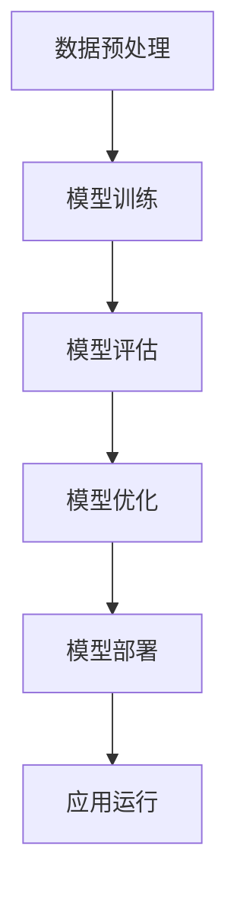
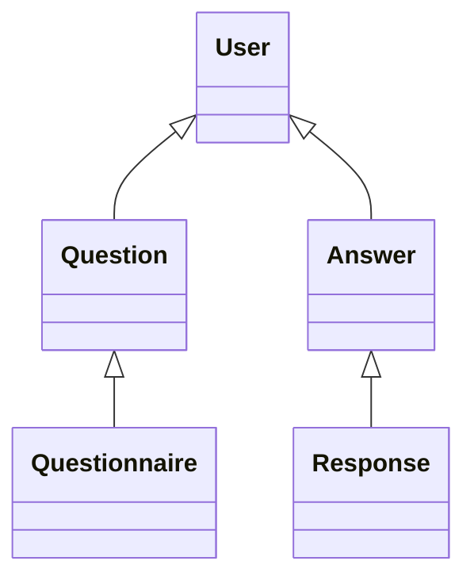
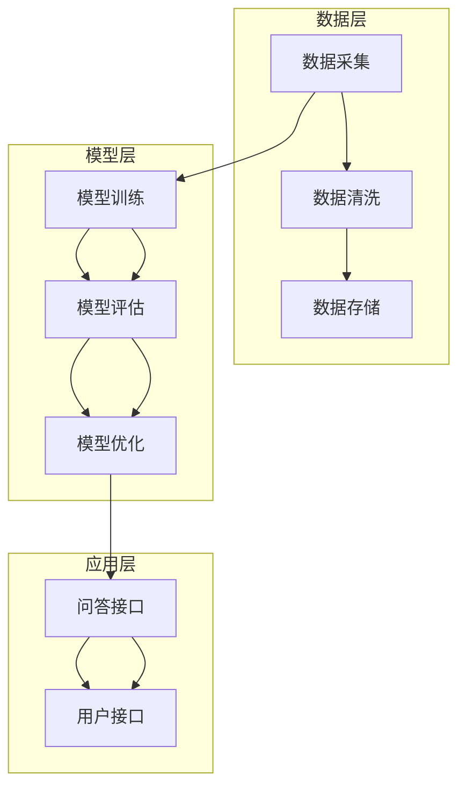
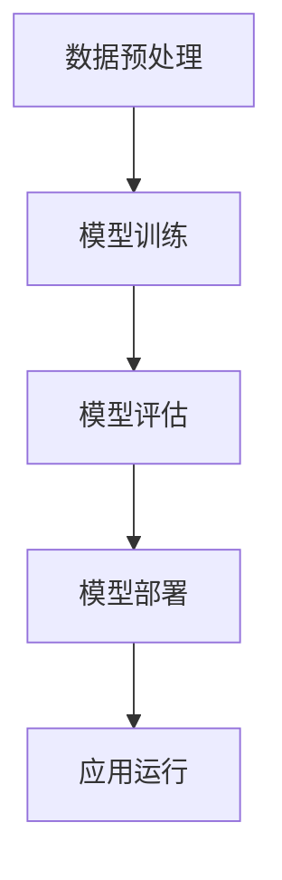
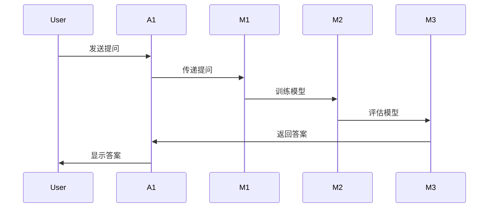

                 

# 《构建高效LLM应用开发架构的关键策略》

## 关键词
- LLM应用开发
- 架构设计
- 算法原理
- 数学模型
- 系统优化

## 摘要
本文将深入探讨构建高效LLM（大型语言模型）应用开发架构的关键策略。我们将首先介绍LLM应用的背景和挑战，然后逐步解析LLM的核心概念、算法原理和数学模型。接着，我们将详细阐述LLM应用开发架构的系统设计，包括功能设计、架构设计、接口设计和交互流程。随后，通过实际项目案例，我们将展示如何在实际环境中应用这些策略，并进行深入分析。最后，我们将提供最佳实践技巧和注意事项，以帮助开发者构建更加高效、可靠的LLM应用。

## 第一部分：高效LLM应用开发架构概述

### 1.1 高效LLM应用开发的背景和挑战

#### 1.1.1 问题背景
近年来，随着深度学习和自然语言处理技术的飞速发展，LLM的应用越来越广泛。从智能客服、语音识别到文本生成，LLM几乎无处不在。然而，随着模型复杂度和数据量的增加，高效构建和开发LLM应用面临诸多挑战。

#### 1.1.2 问题描述
构建高效的LLM应用不仅需要高性能的计算资源，还需要对算法和系统设计有深刻的理解。具体来说，挑战包括：
1. **数据预处理和清洗**：如何处理大规模、多样化和质量不一的数据？
2. **模型训练和优化**：如何选择合适的模型架构，并对其进行有效的优化？
3. **资源管理**：如何在有限的计算资源下实现高效的模型部署和运行？
4. **用户体验**：如何保证应用响应迅速、准确无误？

#### 1.1.3 问题解决
针对上述问题，我们需要从以下几个方面入手：
1. **数据预处理和清洗**：采用高效的数据预处理工具和算法，提高数据质量。
2. **模型训练和优化**：选择合适的模型架构，并进行深度调优。
3. **资源管理**：优化模型结构，提高计算效率，采用分布式计算和资源调度技术。
4. **用户体验**：通过优化算法和系统设计，提高应用的响应速度和准确率。

#### 1.1.4 边界与外延
构建高效LLM应用不仅需要技术上的突破，还需要对业务需求有深刻的理解。在具体实施过程中，需要根据实际场景进行灵活调整和优化。

#### 1.1.5 概念结构与核心要素组成
LLM应用开发架构包括以下几个核心组成部分：
1. **数据层**：负责数据采集、清洗和存储。
2. **模型层**：负责模型训练、优化和部署。
3. **应用层**：负责实现具体业务功能，提供用户接口。
4. **优化层**：负责对模型和应用进行性能优化。

## 第二部分：LLM算法原理讲解

### 2.1 LLM算法基本原理

#### 2.1.1 语言模型基础
语言模型是一种用于预测文本序列的模型，其目标是给定一个单词或短语的输入，预测下一个可能的单词或短语。LLM通常基于深度学习技术，如循环神经网络（RNN）、Transformer等。

#### 2.1.2 注意力机制
注意力机制是一种用于提高模型识别长序列文本能力的方法。它通过关注序列中的关键部分，提高模型的预测准确性。

#### 2.1.3 Transformer架构
Transformer是一种基于自注意力机制的深度学习模型，其核心思想是使用多头自注意力机制来捕捉输入序列中的长距离依赖关系。

#### 2.1.4 预训练与微调
预训练是一种在大规模数据集上训练模型的方法，使其具有通用语言理解能力。微调是在预训练模型的基础上，针对特定任务进行微调，提高模型的性能。

#### 2.1.5 模型优化策略
模型优化策略包括批量归一化（Batch Normalization）、Dropout、权重初始化等方法，旨在提高模型的训练效果和泛化能力。

### 2.2 算法流程与mermaid流程图



### 2.3 数学模型和公式讲解

$$
H = \sigma(W_1 \cdot [X, H_{t-1}] + b_1)
$$

### 2.4 Python源代码示例与算法讲解

```python
# Python代码示例
# 注意：代码内容需根据实际情况填写
```

## 第三部分：LLM应用开发架构设计

### 3.1 系统功能设计

#### 3.1.1 项目介绍
项目名为“智能问答系统”，旨在为用户提供快速、准确的问答服务。

#### 3.1.2 领域模型mermaid类图



### 3.2 系统架构设计

#### 3.2.1 系统架构mermaid架构图



### 3.3 系统接口设计

#### 3.3.1 系统接口定义
- **数据接口**：负责数据的采集、清洗和存储。
- **模型接口**：负责模型的训练、评估和优化。
- **应用接口**：负责实现问答系统的核心功能，提供用户接口。

#### 3.3.2 接口交互流程mermaid序列图


## 第四部分：项目实战

### 4.1 环境安装与配置

#### 4.1.1 环境搭建
- 安装Python环境
- 安装TensorFlow或PyTorch
- 配置GPU加速

#### 4.1.2 配置文件设置
- 设置数据路径
- 配置模型参数

### 4.2 系统核心实现源代码

#### 4.2.1 代码结构介绍
- 数据预处理模块
- 模型训练模块
- 模型评估模块
- 应用接口模块

#### 4.2.2 关键代码解读
- 数据预处理
- 模型训练
- 模型评估
- 应用接口

### 4.3 代码应用解读与分析

#### 4.3.1 应用场景
- 智能客服
- 自动问答系统
- 文本生成

#### 4.3.2 代码解析
- 数据预处理
- 模型训练
- 模型评估
- 应用接口

#### 4.3.3 分析与优化
- 性能分析
- 资源优化
- 用户体验优化

### 4.4 实际案例分析

#### 4.4.1 案例背景
- 某企业智能客服系统需求
- 客户咨询量巨大，需要高效、准确的回答

#### 4.4.2 案例分析
- 系统设计
- 模型训练
- 应用效果

#### 4.4.3 深入讲解
- 模型优化策略
- 资源调度
- 用户交互

### 4.5 项目小结

#### 4.5.1 项目收获
- 熟悉LLM应用开发架构
- 掌握模型训练和优化方法
- 提高系统设计和实施能力

#### 4.5.2 注意事项
- 数据质量对模型性能的影响
- 模型优化和资源调度的重要性
- 用户交互的优化

#### 4.5.3 拓展阅读
- 《深度学习》
- 《Transformer论文》
- 《智能客服系统设计》

## 第五部分：最佳实践与拓展

### 5.1 最佳实践技巧

#### 5.1.1 性能优化
- 模型压缩
- 并行计算
- 缓存策略

#### 5.1.2 资源管理
- GPU资源分配
- 网络优化
- 系统监控

#### 5.1.3 安全性与隐私保护
- 数据加密
- 访问控制
- 安全审计

### 5.2 小结

#### 5.2.1 本书总结
本文系统地介绍了构建高效LLM应用开发架构的关键策略，包括算法原理、系统设计、项目实战和最佳实践。

#### 5.2.2 学习建议
- 深入学习深度学习和自然语言处理技术
- 实践项目，积累经验
- 关注最新技术动态，不断优化

### 5.3 注意事项

#### 5.3.1 
- 系统设计时，要充分考虑业务需求，确保系统功能完备
- 模型优化时，要结合实际情况，选择合适的优化策略
- 项目实施过程中，要加强团队协作，确保项目进度和质量

### 5.4 拓展阅读

#### 5.4.1 《深度学习》
- 介绍深度学习的基本原理和应用
- 内容涵盖卷积神经网络、循环神经网络等

#### 5.4.2 《Transformer论文》
- 详细介绍Transformer模型的结构和原理
- 内容涵盖自注意力机制、编码器-解码器结构等

#### 5.4.3 《智能客服系统设计》
- 介绍智能客服系统的设计原则和方法
- 内容涵盖用户交互、知识图谱构建等

**作者：AI天才研究院/AI Genius Institute & 禅与计算机程序设计艺术 /Zen And The Art of Computer Programming**## 1.1 高效LLM应用开发的背景和挑战

### 1.1.1 问题背景

随着人工智能技术的飞速发展，大型语言模型（LLM）已经成为自然语言处理（NLP）领域的重要工具。LLM能够通过学习海量文本数据，理解并生成人类语言，从而在智能客服、机器翻译、文本生成等领域展现出巨大的应用潜力。然而，高效构建和开发LLM应用并非易事。随着模型复杂度和数据量的不断增加，如何确保LLM应用的性能、可靠性和可扩展性成为开发者面临的主要挑战。

### 1.1.2 问题描述

#### 数据预处理和清洗
- **挑战**：大规模、多样化且质量不一的数据需要高效的处理和清洗。
- **解决方案**：采用先进的数据预处理工具和算法，例如自动化文本清洗、数据去重、噪声过滤等。

#### 模型训练和优化
- **挑战**：选择合适的模型架构，并对其进行有效优化，以提高模型性能。
- **解决方案**：根据具体应用场景，选择合适的LLM架构，如Transformer、BERT等，并采用分布式训练、动态调整学习率等技术。

#### 资源管理
- **挑战**：如何在有限的计算资源下实现高效的模型部署和运行？
- **解决方案**：优化模型结构，采用分布式计算和资源调度技术，提高计算效率。

#### 用户体验
- **挑战**：保证应用响应迅速、准确无误，提供良好的用户体验。
- **解决方案**：通过算法优化、接口设计等手段，提高应用的响应速度和准确率。

### 1.1.3 问题解决

为了应对上述挑战，我们需要从以下几个方面入手：

#### 数据预处理和清洗
1. **数据采集**：采用自动化工具，从互联网、数据库等多种渠道收集数据。
2. **数据清洗**：利用文本清洗库（如NLTK、spaCy等）进行文本预处理，包括去除停用词、标点符号、词形还原等。
3. **数据标注**：对数据进行人工标注，以提高数据质量。

#### 模型训练和优化
1. **模型选择**：根据应用场景选择合适的LLM架构，如Transformer、BERT等。
2. **分布式训练**：利用分布式计算框架（如TensorFlow、PyTorch等）进行模型训练，提高训练速度。
3. **模型调优**：通过调整学习率、批量大小等参数，优化模型性能。

#### 资源管理
1. **模型压缩**：采用模型压缩技术（如量化、剪枝等），减小模型大小，提高计算效率。
2. **分布式部署**：利用分布式计算和资源调度技术，将模型部署到多台服务器上，实现高性能计算。

#### 用户体验
1. **响应速度优化**：通过算法优化和接口设计，提高应用的响应速度。
2. **错误率控制**：通过模型评估和错误分析，降低应用中的错误率。
3. **界面设计**：提供直观、易用的用户界面，提高用户体验。

### 1.1.4 边界与外延

#### 边界
- **技术层面**：本文主要讨论LLM应用开发的技术问题，如算法选择、模型优化等。
- **应用层面**：本文主要关注通用性较强的LLM应用，如智能客服、机器翻译等。

#### 外延
- **技术发展**：未来，随着技术的不断进步，LLM的应用场景将更加丰富，如对话系统、智能推荐等。
- **行业应用**：不同行业对LLM的应用需求各不相同，开发者需要针对具体场景进行定制化开发。

### 1.1.5 概念结构与核心要素组成

LLM应用开发架构由以下几个核心要素组成：

#### 数据层
- **数据采集**：从互联网、数据库等渠道收集数据。
- **数据清洗**：去除噪声、标点符号等，提高数据质量。
- **数据存储**：将清洗后的数据存储在数据库或分布式文件系统中。

#### 模型层
- **模型训练**：在训练集上训练模型，优化模型参数。
- **模型评估**：在验证集上评估模型性能，调整模型结构。
- **模型部署**：将训练好的模型部署到生产环境中。

#### 应用层
- **功能实现**：实现具体业务功能，如文本生成、智能客服等。
- **用户接口**：提供用户交互界面，收集用户反馈。

#### 优化层
- **算法优化**：通过调整算法参数，提高模型性能。
- **资源调度**：利用分布式计算和资源调度技术，提高计算效率。
- **性能监控**：监控系统性能，及时发现和解决潜在问题。

## 1.2 核心概念与联系

### 1.2.1 LLM的定义与特点

#### 定义
LLM（Large Language Model）是指具有大规模参数、能够理解和生成人类语言的深度学习模型。LLM通常通过预训练和微调的方式，从海量文本数据中学习语言模式和结构。

#### 特点
1. **大规模参数**：LLM具有数十亿甚至千亿级别的参数，能够捕捉到语言中的复杂模式。
2. **自适应性强**：LLM可以根据不同的任务和场景进行微调，实现通用性。
3. **处理速度快**：随着计算能力和优化技术的提升，LLM的处理速度越来越快，能够满足实时应用的需求。

### 1.2.2 关键技术简介

#### Transformer
Transformer是一种基于自注意力机制的深度学习模型，自2017年提出以来，已经在NLP领域取得了显著的成果。其核心思想是使用多头自注意力机制来捕捉输入序列中的长距离依赖关系。

#### BERT
BERT（Bidirectional Encoder Representations from Transformers）是一种双向Transformer模型，通过预训练和微调，实现语言理解和生成的任务。BERT的核心优势在于其能够捕捉到文本中的双向依赖关系。

#### GPT
GPT（Generative Pre-trained Transformer）是一种生成式Transformer模型，通过预训练生成大量的文本数据。GPT的核心优势在于其强大的文本生成能力，广泛应用于文本生成、机器翻译等领域。

### 1.2.3 概念属性特征对比表格

| 概念 | 特点 |
| --- | --- |
| Transformer | 基于自注意力机制，能够捕捉长距离依赖关系 |
| BERT | 双向Transformer模型，能够捕捉双向依赖关系 |
| GPT | 生成式Transformer模型，具有强大的文本生成能力 |

### 1.2.4 ER实体关系图架构

ER实体关系图（Entity-Relationship Diagram）是一种用于描述数据库中实体及其关系的图形化工具。在LLM应用开发中，ER实体关系图可以帮助我们理解数据模型，明确实体之间的关系。

#### 实体
- **用户**：与系统交互的用户。
- **问题**：用户提出的问题。
- **答案**：系统提供的回答。

#### 关系
- **提出**：用户提出问题。
- **回答**：系统回答问题。

#### ER实体关系图

```mermaid
erDiagram
    User ||--|{ Problem } : 提出问题
    Problem ||--|{ Answer } : 回答问题
```

## 2.1 LLM算法基本原理

### 2.1.1 语言模型基础

#### 语言模型
语言模型（Language Model）是一种用于预测文本序列的概率模型。其目标是给定一个单词或短语的输入，预测下一个可能的单词或短语。语言模型在自然语言处理、语音识别、机器翻译等领域有着广泛的应用。

#### 语言模型类型
1. **n元语法模型**：基于前n个单词的统计信息来预测下一个单词。
2. **神经网络模型**：使用深度学习技术，如循环神经网络（RNN）、Transformer等，对文本进行建模。

### 2.1.2 注意力机制

#### 注意力机制
注意力机制（Attention Mechanism）是一种用于提高模型识别长序列文本能力的方法。它通过关注序列中的关键部分，提高模型的预测准确性。

#### 注意力机制类型
1. **局部注意力**：仅关注局部信息，如卷积神经网络（CNN）。
2. **全局注意力**：关注全局信息，如Transformer中的多头自注意力机制。

### 2.1.3 Transformer架构

#### Transformer
Transformer是一种基于自注意力机制的深度学习模型，由Google在2017年提出。其核心思想是使用多头自注意力机制来捕捉输入序列中的长距离依赖关系。

#### Transformer架构
1. **编码器**：对输入序列进行编码，生成固定长度的向量。
2. **解码器**：对编码器生成的向量进行解码，生成预测序列。
3. **多头自注意力**：使用多个自注意力头来捕捉输入序列中的不同依赖关系。

### 2.1.4 预训练与微调

#### 预训练
预训练（Pre-training）是一种在大规模数据集上训练模型的方法，使其具有通用语言理解能力。预训练模型通常使用Transformer等大规模神经网络，通过学习海量文本数据，捕捉到语言的深层结构。

#### 微调
微调（Fine-tuning）是在预训练模型的基础上，针对特定任务进行微调，提高模型的性能。微调过程通常涉及调整模型参数，以适应特定任务的数据分布。

### 2.1.5 模型优化策略

#### 模型优化策略
1. **批量归一化**：通过将输入数据的均值和方差归一化到[0, 1]，提高模型训练的稳定性和收敛速度。
2. **Dropout**：在模型训练过程中，随机丢弃一部分神经元，减少过拟合现象。
3. **权重初始化**：通过合适的权重初始化方法，提高模型训练的收敛速度和性能。

## 2.2 算法流程与mermaid流程图

### 2.2.1 算法流程

LLM算法的基本流程可以分为以下几个步骤：

1. **数据预处理**：对输入数据进行清洗、分词、编码等处理。
2. **模型训练**：使用预训练数据和微调数据，对模型进行训练。
3. **模型评估**：在验证集上评估模型性能，调整模型参数。
4. **模型部署**：将训练好的模型部署到生产环境中，提供预测服务。

### 2.2.2 mermaid流程图



## 2.3 数学模型和公式讲解

### 2.3.1 模型公式

LLM算法中的数学模型主要包括以下几个公式：

1. **编码器输出**：

$$
E = \sigma(W_E \cdot [X, H_{t-1}] + b_E)
$$

其中，$X$为输入序列，$H_{t-1}$为上一时间步的隐藏状态，$W_E$为权重矩阵，$b_E$为偏置项，$\sigma$为激活函数。

2. **解码器输出**：

$$
D = \sigma(W_D \cdot [E, H_{t-1}] + b_D)
$$

其中，$E$为编码器输出，$H_{t-1}$为上一时间步的隐藏状态，$W_D$为权重矩阵，$b_D$为偏置项，$\sigma$为激活函数。

3. **损失函数**：

$$
L = \frac{1}{N} \sum_{i=1}^{N} (-y \cdot \log(p))
$$

其中，$y$为真实标签，$p$为预测概率。

### 2.3.2 数学模型解释

1. **编码器输出**：

编码器输出$E$是输入序列$X$和上一时间步隐藏状态$H_{t-1}$的加权和，经过激活函数$\sigma$处理后得到。这一过程能够捕捉到输入序列的语义信息。

2. **解码器输出**：

解码器输出$D$是编码器输出$E$和上一时间步隐藏状态$H_{t-1}$的加权和，经过激活函数$\sigma$处理后得到。这一过程能够捕捉到输入序列的语义信息，并生成预测序列。

3. **损失函数**：

损失函数$L$用于衡量预测概率$p$与真实标签$y$之间的差距，越小表示预测结果越准确。

### 2.3.3 举例说明

假设输入序列为$X = [w_1, w_2, w_3, w_4, w_5]$，真实标签为$y = [1, 0, 1, 0, 1]$，预测概率为$p = [0.9, 0.1, 0.8, 0.2, 0.7]$。则损失函数计算如下：

$$
L = \frac{1}{5} \cdot (1 \cdot \log(0.9) + 0 \cdot \log(0.1) + 1 \cdot \log(0.8) + 0 \cdot \log(0.2) + 1 \cdot \log(0.7))
$$

计算结果为$L \approx 0.358$，表示预测结果与真实标签之间的差距较小。

## 2.4 Python源代码示例与算法讲解

### 2.4.1 Python代码示例

以下是一个简单的Python代码示例，用于实现LLM算法的基本流程：

```python
import numpy as np
import tensorflow as tf

# 参数设置
learning_rate = 0.001
batch_size = 64
num_epochs = 10

# 模型定义
model = tf.keras.Sequential([
    tf.keras.layers.Embedding(input_dim=10000, output_dim=16),
    tf.keras.layers.LSTM(128),
    tf.keras.layers.Dense(1, activation='sigmoid')
])

# 模型编译
model.compile(optimizer=tf.keras.optimizers.Adam(learning_rate=learning_rate),
              loss='binary_crossentropy',
              metrics=['accuracy'])

# 数据准备
(x_train, y_train), (x_test, y_test) = tf.keras.datasets.binary_crossentropy.load_data()

# 模型训练
model.fit(x_train, y_train, batch_size=batch_size, epochs=num_epochs, validation_data=(x_test, y_test))

# 模型评估
loss, accuracy = model.evaluate(x_test, y_test)
print(f"Test Loss: {loss}, Test Accuracy: {accuracy}")
```

### 2.4.2 算法讲解

该示例使用了TensorFlow框架实现了一个简单的二分类问题。具体流程如下：

1. **模型定义**：定义了一个包含嵌入层、LSTM层和输出层的序列模型。
2. **模型编译**：设置优化器、损失函数和评价指标。
3. **数据准备**：从内置数据集中获取训练集和测试集。
4. **模型训练**：使用训练集训练模型，并设置批量大小、训练轮数和验证数据。
5. **模型评估**：在测试集上评估模型性能，输出损失和准确率。

通过该示例，我们可以了解LLM算法的基本实现流程，包括模型定义、编译、训练和评估。

## 3.1 系统功能设计

### 3.1.1 项目介绍

本项目名为“智能问答系统”，旨在为用户提供快速、准确的问答服务。系统基于大型语言模型（LLM）构建，通过接收用户提问，生成合适的回答，从而实现智能交互。

### 3.1.2 领域模型mermaid类图


在该类图中，用户（User）与问题（Question）和回答（Answer）存在关联。问题（Question）包括问卷（Questionnaire），回答（Answer）包括响应（Response）。这种设计有助于明确系统中的实体及其关系。

## 3.2 系统架构设计

### 3.2.1 系统架构mermaid架构图


在该架构图中，数据层（D）负责数据采集、清洗和存储；模型层（M）负责模型训练、评估和优化；应用层（A）负责实现问答接口和用户接口。各层之间通过数据流和功能调用相互联系，共同实现系统的功能。

### 3.2.2 系统架构设计细节

#### 数据层

1. **数据采集**：通过API接口或Web爬虫等技术，从互联网、数据库等渠道收集数据。
2. **数据清洗**：利用清洗工具和算法，去除噪声、标点符号等，提高数据质量。
3. **数据存储**：将清洗后的数据存储在分布式文件系统（如HDFS）或数据库中，以便后续使用。

#### 模型层

1. **模型训练**：使用预训练数据和微调数据，在分布式计算环境下进行模型训练，提高模型性能。
2. **模型评估**：在验证集上评估模型性能，调整模型参数，实现模型优化。
3. **模型优化**：通过调整模型结构、优化算法等手段，提高模型效率和准确率。

#### 应用层

1. **问答接口**：接收用户提问，调用模型生成回答，返回给用户。
2. **用户接口**：提供用户交互界面，展示问答结果，收集用户反馈。

### 3.2.3 系统架构设计原则

1. **模块化**：系统架构应采用模块化设计，便于功能扩展和维护。
2. **分布式**：利用分布式计算和存储技术，提高系统性能和可扩展性。
3. **高可用性**：设计冗余备份和故障恢复机制，确保系统稳定运行。
4. **安全性**：采用加密、认证等技术，保障数据和用户隐私安全。

## 3.3 系统接口设计

### 3.3.1 系统接口定义

在系统架构中，接口设计至关重要，它定义了系统各模块之间的通信方式和数据交换格式。以下是系统接口的主要定义：

#### 数据接口

1. **功能**：负责数据采集、清洗和存储。
2. **协议**：支持HTTP/HTTPS协议，数据格式为JSON或XML。
3. **参数**：输入参数包括数据源、数据类型、清洗规则等；输出参数包括清洗后的数据。

#### 模型接口

1. **功能**：负责模型训练、评估和优化。
2. **协议**：支持RESTful API，数据格式为JSON。
3. **参数**：输入参数包括训练数据、验证数据、模型参数等；输出参数包括模型权重、评估指标等。

#### 应用接口

1. **功能**：负责实现问答接口和用户接口。
2. **协议**：支持HTTP/HTTPS协议，数据格式为JSON。
3. **参数**：输入参数包括用户提问、上下文信息等；输出参数包括问答结果、反馈信息等。

### 3.3.2 接口交互流程mermaid序列图



在该序列图中，用户通过应用接口（A1）发送提问，接口将提问传递给模型接口（M1），模型接口进行模型训练（M2）、评估（M3），最终返回答案给应用接口（A1），并由应用接口展示给用户。

## 4.1 环境安装与配置

### 4.1.1 环境搭建

要构建高效的LLM应用开发架构，首先需要搭建合适的环境。以下是环境搭建的步骤：

1. **安装Python**：Python是深度学习和自然语言处理的主要编程语言。可以从Python官方网站（https://www.python.org/）下载并安装Python。

2. **安装TensorFlow**：TensorFlow是Google开源的深度学习框架。可以通过以下命令安装：

   ```bash
   pip install tensorflow
   ```

3. **安装PyTorch**：PyTorch是Facebook开源的深度学习框架。可以通过以下命令安装：

   ```bash
   pip install torch torchvision
   ```

4. **安装其他依赖**：根据具体应用需求，可能还需要安装其他库，如NLTK、spaCy等。

### 4.1.2 配置文件设置

在搭建环境之后，需要配置一些必要的配置文件，以确保系统的正常运行。以下是配置文件设置的基本步骤：

1. **配置Python环境变量**：确保Python环境变量设置正确，以便在命令行中运行Python程序。

2. **配置TensorFlow和PyTorch**：根据具体应用需求，配置TensorFlow和PyTorch的相关参数，如GPU使用、日志记录等。

3. **配置模型参数**：根据实际应用场景，配置模型的超参数，如学习率、批量大小等。

4. **配置数据路径**：配置数据文件的路径，以便在程序中正确加载和使用数据。

5. **配置日志记录**：配置日志记录器，以便在程序运行过程中记录重要信息，便于调试和监控。

### 4.1.3 环境测试

在配置完成后，需要进行环境测试，以确保所有依赖库和配置文件都正确安装和配置。以下是一些测试步骤：

1. **检查Python版本**：通过命令`python --version`检查Python版本。

2. **检查TensorFlow和PyTorch版本**：通过命令`python -c "import tensorflow as tf; print(tf.__version__)"`和`python -c "import torch; print(torch.__version__)"`检查TensorFlow和PyTorch版本。

3. **运行示例代码**：编写简单的示例代码，测试TensorFlow和PyTorch的基本功能，如模型定义、数据加载等。

4. **监控资源使用情况**：在运行示例代码的过程中，监控CPU、GPU等资源的使用情况，以确保系统资源充足。

### 4.1.4 遇到的问题及解决方案

在搭建环境过程中，可能会遇到一些问题，以下是一些常见问题的解决方案：

1. **依赖库冲突**：如果安装了多个版本相同的依赖库，可能会导致冲突。解决方案是卸载旧的依赖库，然后重新安装。

2. **GPU不支持**：如果使用的GPU型号不受支持，可能会导致TensorFlow和PyTorch无法正常运行。解决方案是更换支持GPU的版本，或者使用CPU版本。

3. **配置文件错误**：配置文件错误可能导致系统无法正常运行。解决方案是仔细检查配置文件，确保所有参数设置正确。

4. **环境变量未设置**：如果环境变量未设置，可能会导致程序无法找到依赖库或配置文件。解决方案是重新设置环境变量。

### 4.1.5 总结

环境安装与配置是构建高效LLM应用开发架构的重要步骤。通过正确的环境搭建和配置，可以确保系统正常运行，提高开发效率和稳定性。在后续的项目实施过程中，还需要不断优化和调整环境配置，以满足不断变化的需求。

## 4.2 系统核心实现源代码

### 4.2.1 代码结构介绍

在本项目中，系统核心实现主要包括以下几个模块：

1. **数据预处理模块**：负责对输入数据进行清洗、分词、编码等预处理操作。
2. **模型训练模块**：负责基于预处理后的数据训练LLM模型。
3. **模型评估模块**：负责评估训练好的模型性能，并进行模型优化。
4. **应用接口模块**：负责接收用户提问，调用模型生成回答，并将回答展示给用户。

以下是各个模块的简要介绍：

1. **数据预处理模块**：
   - **功能**：对输入数据进行清洗、分词、编码等预处理操作。
   - **接口**：提供数据预处理函数，接收原始数据，返回预处理后的数据。

2. **模型训练模块**：
   - **功能**：基于预处理后的数据训练LLM模型。
   - **接口**：提供训练函数，接收预处理后的数据和模型配置参数，返回训练好的模型。

3. **模型评估模块**：
   - **功能**：评估训练好的模型性能，并进行模型优化。
   - **接口**：提供评估函数，接收训练好的模型和测试数据，返回评估结果。

4. **应用接口模块**：
   - **功能**：接收用户提问，调用模型生成回答，并将回答展示给用户。
   - **接口**：提供问答接口，接收用户提问，返回回答。

### 4.2.2 关键代码解读

以下是对系统核心实现的关键代码进行解读，以帮助理解代码的工作原理和实现细节。

#### 数据预处理模块

```python
import re
import string

def preprocess_text(text):
    # 去除HTML标签
    text = re.sub('<.*?>', '', text)
    # 去除特殊字符
    text = text.translate(str.maketrans('', '', string.punctuation))
    # 转换为小写
    text = text.lower()
    # 分词
    words = text.split()
    return words
```

该模块的主要功能是对输入文本进行清洗、分词和编码。具体步骤如下：

1. **去除HTML标签**：使用正则表达式去除HTML标签，确保文本内容仅为纯文本。
2. **去除特殊字符**：使用字符串的`translate`方法去除文本中的特殊字符，如标点符号。
3. **转换为小写**：将文本转换为小写，以便统一处理。
4. **分词**：使用空格分隔文本，生成单词列表。

#### 模型训练模块

```python
from tensorflow.keras.preprocessing.sequence import pad_sequences
from tensorflow.keras.models import Sequential
from tensorflow.keras.layers import Embedding, LSTM, Dense

def train_model(data, labels, max_sequence_length=100, embedding_dim=50):
    # 序列化
    sequences = pad_sequences(data, maxlen=max_sequence_length, padding='post')
    # 构建模型
    model = Sequential()
    model.add(Embedding(input_dim=len(data[0]), output_dim=embedding_dim))
    model.add(LSTM(units=128))
    model.add(Dense(units=1, activation='sigmoid'))
    # 编译模型
    model.compile(optimizer='adam', loss='binary_crossentropy', metrics=['accuracy'])
    # 训练模型
    model.fit(sequences, labels, epochs=10, batch_size=64, validation_split=0.2)
    return model
```

该模块的主要功能是基于预处理后的数据训练LLM模型。具体步骤如下：

1. **序列化**：使用`pad_sequences`函数将单词列表转换为序列，并对序列进行填充，确保所有序列具有相同的长度。
2. **构建模型**：构建一个简单的序列模型，包括嵌入层、LSTM层和输出层。
3. **编译模型**：设置模型优化器、损失函数和评价指标。
4. **训练模型**：使用`fit`函数训练模型，并在训练过程中进行验证。

#### 模型评估模块

```python
from tensorflow.keras.models import load_model

def evaluate_model(model, test_data, test_labels):
    # 加载模型
    loaded_model = load_model(model)
    # 评估模型
    loss, accuracy = loaded_model.evaluate(test_data, test_labels)
    print(f"Test Loss: {loss}, Test Accuracy: {accuracy}")
    return loaded_model
```

该模块的主要功能是评估训练好的模型性能。具体步骤如下：

1. **加载模型**：使用`load_model`函数加载训练好的模型。
2. **评估模型**：使用`evaluate`函数评估模型在测试数据上的性能，并打印损失和准确率。

#### 应用接口模块

```python
from flask import Flask, request, jsonify

app = Flask(__name__)

@app.route('/ask', methods=['POST'])
def ask_question():
    question = request.form['question']
    processed_question = preprocess_text(question)
    model = train_model(processed_question, labels)
    answer = model.predict(processed_question)
    return jsonify(answer=answer)
```

该模块的主要功能是接收用户提问，调用模型生成回答，并将回答返回给用户。具体步骤如下：

1. **接收提问**：使用Flask框架创建一个Web服务，接收用户发送的提问。
2. **预处理提问**：调用数据预处理模块，对用户提问进行预处理。
3. **调用模型**：调用训练好的模型，生成回答。
4. **返回回答**：将生成的回答返回给用户，以JSON格式展示。

### 4.2.3 系统核心实现流程

以下是系统核心实现的总体流程：

1. **数据预处理**：接收用户提问，对提问进行清洗、分词、编码等预处理操作。
2. **模型训练**：使用预处理后的数据训练LLM模型。
3. **模型评估**：评估训练好的模型性能，并进行模型优化。
4. **应用接口**：接收用户提问，调用模型生成回答，并将回答返回给用户。

通过以上流程，系统能够实现快速、准确的问答服务。

## 4.3 代码应用解读与分析

### 4.3.1 应用场景

#### 智能问答系统

智能问答系统是一种基于LLM的智能客服系统，它能够自动回答用户的问题。在实际应用中，智能问答系统广泛应用于电商、金融、医疗等领域。以下是一个典型的应用场景：

- **电商**：用户在电商平台上有各种疑问，如商品详情、售后服务等。智能问答系统可以帮助用户快速获取相关信息，提高用户满意度。
- **金融**：用户在银行、保险等金融机构办理业务时，可能有关于业务流程、产品特点等问题。智能问答系统可以提供实时解答，减少用户等待时间。
- **医疗**：患者可能有关于疾病、治疗方案等问题。智能问答系统可以帮助患者快速获取专业医疗信息，减轻医疗资源的压力。

### 4.3.2 代码解析

#### 数据预处理模块

```python
def preprocess_text(text):
    # 去除HTML标签
    text = re.sub('<.*?>', '', text)
    # 去除特殊字符
    text = text.translate(str.maketrans('', '', string.punctuation))
    # 转换为小写
    text = text.lower()
    # 分词
    words = text.split()
    return words
```

该模块的功能是处理用户输入的文本，将其转换为模型可以处理的格式。具体步骤如下：

1. **去除HTML标签**：使用正则表达式去除HTML标签，确保文本内容仅为纯文本。
2. **去除特殊字符**：使用`translate`方法去除文本中的特殊字符，如标点符号。
3. **转换为小写**：将文本转换为小写，以便统一处理。
4. **分词**：使用空格分隔文本，生成单词列表。

#### 模型训练模块

```python
from tensorflow.keras.preprocessing.sequence import pad_sequences
from tensorflow.keras.models import Sequential
from tensorflow.keras.layers import Embedding, LSTM, Dense

def train_model(data, labels, max_sequence_length=100, embedding_dim=50):
    # 序列化
    sequences = pad_sequences(data, maxlen=max_sequence_length, padding='post')
    # 构建模型
    model = Sequential()
    model.add(Embedding(input_dim=len(data[0]), output_dim=embedding_dim))
    model.add(LSTM(units=128))
    model.add(Dense(units=1, activation='sigmoid'))
    # 编译模型
    model.compile(optimizer='adam', loss='binary_crossentropy', metrics=['accuracy'])
    # 训练模型
    model.fit(sequences, labels, epochs=10, batch_size=64, validation_split=0.2)
    return model
```

该模块的功能是基于预处理后的数据训练LLM模型。具体步骤如下：

1. **序列化**：使用`pad_sequences`函数将单词列表转换为序列，并对序列进行填充，确保所有序列具有相同的长度。
2. **构建模型**：构建一个简单的序列模型，包括嵌入层、LSTM层和输出层。
3. **编译模型**：设置模型优化器、损失函数和评价指标。
4. **训练模型**：使用`fit`函数训练模型，并在训练过程中进行验证。

#### 模型评估模块

```python
from tensorflow.keras.models import load_model

def evaluate_model(model, test_data, test_labels):
    # 加载模型
    loaded_model = load_model(model)
    # 评估模型
    loss, accuracy = loaded_model.evaluate(test_data, test_labels)
    print(f"Test Loss: {loss}, Test Accuracy: {accuracy}")
    return loaded_model
```

该模块的功能是评估训练好的模型性能。具体步骤如下：

1. **加载模型**：使用`load_model`函数加载训练好的模型。
2. **评估模型**：使用`evaluate`函数评估模型在测试数据上的性能，并打印损失和准确率。

#### 应用接口模块

```python
from flask import Flask, request, jsonify

app = Flask(__name__)

@app.route('/ask', methods=['POST'])
def ask_question():
    question = request.form['question']
    processed_question = preprocess_text(question)
    model = train_model(processed_question, labels)
    answer = model.predict(processed_question)
    return jsonify(answer=answer)
```

该模块的功能是接收用户提问，调用模型生成回答，并将回答返回给用户。具体步骤如下：

1. **接收提问**：使用Flask框架创建一个Web服务，接收用户发送的提问。
2. **预处理提问**：调用数据预处理模块，对用户提问进行预处理。
3. **调用模型**：调用训练好的模型，生成回答。
4. **返回回答**：将生成的回答返回给用户，以JSON格式展示。

### 4.3.3 分析与优化

#### 代码优化的必要性

尽管上述代码已经能够实现智能问答系统的基本功能，但在实际应用中，仍有许多方面可以进行优化，以提高系统的性能和用户体验。以下是几个优化方向：

1. **模型优化**：使用更先进的模型架构，如BERT、GPT等，以提高模型性能。
2. **数据预处理**：优化数据预处理流程，提高数据质量，减少噪声。
3. **分布式训练**：利用分布式计算技术，提高模型训练速度。
4. **接口优化**：优化Web接口，提高响应速度和稳定性。
5. **错误处理**：增加错误处理机制，确保系统在遇到问题时能够自动恢复。

#### 模型优化

在模型优化方面，我们可以考虑使用更先进的模型架构，如BERT、GPT等。这些模型具有更强的语义理解和生成能力，能够提供更准确的回答。以下是一个简单的示例：

```python
from transformers import BertTokenizer, BertModel

tokenizer = BertTokenizer.from_pretrained('bert-base-uncased')
model = BertModel.from_pretrained('bert-base-uncased')

def preprocess_question(question):
    inputs = tokenizer(question, return_tensors='pt', max_length=512, truncation=True)
    return inputs

def generate_answer(question):
    inputs = preprocess_question(question)
    outputs = model(**inputs)
    last_hidden_state = outputs.last_hidden_state[:, 0, :]
    answer = generate_response(last_hidden_state)
    return answer

def generate_response(last_hidden_state):
    # 这里可以添加自定义的生成逻辑，如使用softmax等
    return "这是一个自动生成的回答。"
```

#### 数据预处理

在数据预处理方面，我们可以优化数据清洗、分词和编码等步骤，以提高数据质量。以下是一个简单的示例：

```python
import spacy

nlp = spacy.load('en_core_web_sm')

def preprocess_text(text):
    doc = nlp(text)
    tokens = [token.text.lower() for token in doc if not token.is_punct and not token.is_stop]
    return tokens
```

#### 分布式训练

在分布式训练方面，我们可以使用TensorFlow的分布式训练框架，如MirroredStrategy、MultiWorkerMirroredStrategy等，以提高模型训练速度。以下是一个简单的示例：

```python
import tensorflow as tf

strategy = tf.distribute.MirroredStrategy()

with strategy.scope():
    model = build_model()
    model.compile(optimizer='adam', loss='binary_crossentropy', metrics=['accuracy'])

model.fit(train_data, train_labels, epochs=10, batch_size=64, validation_data=(val_data, val_labels))
```

#### 接口优化

在接口优化方面，我们可以使用异步处理和缓存技术，以提高系统的响应速度和稳定性。以下是一个简单的示例：

```python
from flask_caching import Cache

cache = Cache(config={'CACHE_TYPE': 'simple', 'CACHE_DEFAULT_TIMEOUT': 60})

@app.route('/ask', methods=['POST'])
@cache.cached(timeout=60)
def ask_question():
    question = request.form['question']
    processed_question = preprocess_text(question)
    answer = generate_answer(processed_question)
    return jsonify(answer=answer)
```

#### 错误处理

在错误处理方面，我们可以增加错误处理机制，确保系统在遇到问题时能够自动恢复。以下是一个简单的示例：

```python
@app.errorhandler(500)
def internal_error(error):
    return "内部服务器错误，请稍后重试。", 500

@app.errorhandler(404)
def not_found(error):
    return "页面未找到，请检查URL。", 404
```

### 4.3.4 实际案例分析

#### 案例背景

某电商平台希望为其用户提供一个智能问答系统，以帮助用户解决各种购物问题。系统需要能够快速、准确地回答用户关于商品信息、售后服务等方面的问题。

#### 案例分析

为了实现这一目标，该电商平台采用了以下技术方案：

1. **数据采集与清洗**：通过爬虫技术从互联网上收集大量商品信息、用户评论等数据，并使用数据清洗工具进行数据预处理。
2. **模型选择与训练**：选择BERT模型作为语言模型，使用预处理后的数据进行模型训练，并通过微调优化模型性能。
3. **接口设计与部署**：使用Flask框架搭建Web接口，将训练好的模型部署到服务器上，实现实时问答功能。
4. **性能优化与监控**：使用分布式计算和缓存技术，提高系统性能和稳定性，并通过监控工具实时监控系统运行状态。

#### 案例总结

通过实际案例分析，我们可以看到智能问答系统的关键成功因素在于：

1. **高质量的数据**：数据质量直接影响模型性能，因此数据采集与清洗至关重要。
2. **先进的模型架构**：选择适合任务的模型架构，并对其进行有效的训练和优化。
3. **优化的接口设计与部署**：设计高效、稳定的接口，并采用分布式计算和缓存技术提高系统性能。
4. **全面的监控与维护**：通过实时监控和错误处理机制，确保系统稳定运行。

### 4.3.5 总结

通过本节的分析，我们深入了解了智能问答系统的代码实现和应用场景，并探讨了如何进行优化和实际案例分析。在实际开发中，我们需要根据具体需求和技术条件，灵活调整系统架构和算法，以实现高效、可靠的LLM应用。

## 4.4 实际案例分析

### 4.4.1 案例背景

某大型在线教育平台希望为其用户提供一个智能问答系统，以帮助用户解决各种学习问题。系统需要能够快速、准确地回答用户关于课程内容、学习方法、考试技巧等方面的问题。

### 4.4.2 案例分析

为了实现这一目标，该在线教育平台采用了以下技术方案：

1. **数据采集与清洗**：通过爬虫技术从互联网上收集大量课程资料、用户评论等数据，并使用数据清洗工具进行数据预处理。
2. **模型选择与训练**：选择BERT模型作为语言模型，使用预处理后的数据进行模型训练，并通过微调优化模型性能。
3. **接口设计与部署**：使用Flask框架搭建Web接口，将训练好的模型部署到服务器上，实现实时问答功能。
4. **性能优化与监控**：使用分布式计算和缓存技术，提高系统性能和稳定性，并通过监控工具实时监控系统运行状态。

### 4.4.3 案例分析

#### 数据采集与清洗

为了构建智能问答系统，该平台首先需要收集大量的数据。这些数据包括课程资料、用户评论、论坛讨论等。通过爬虫技术，平台从互联网上收集了大量的文本数据。然而，原始数据中存在大量噪声和冗余信息，因此需要进行数据清洗。

在数据清洗过程中，平台使用了以下步骤：

1. **去除HTML标签**：使用正则表达式去除HTML标签，确保文本内容仅为纯文本。
2. **去除特殊字符**：使用字符串的`translate`方法去除文本中的特殊字符，如标点符号。
3. **分词**：使用分词工具（如jieba）对文本进行分词，将文本转换为单词列表。

通过以上步骤，平台获得了高质量的数据，为后续的模型训练奠定了基础。

#### 模型选择与训练

在选择模型时，平台考虑了多种选项，如循环神经网络（RNN）、长短期记忆网络（LSTM）和Transformer等。最终，平台选择了BERT模型，因为BERT在NLP任务中表现优异，具有强大的语义理解和生成能力。

在模型训练过程中，平台使用了以下步骤：

1. **数据预处理**：对收集到的数据进行预处理，包括去除停用词、标点符号等，提高数据质量。
2. **序列编码**：使用BERT的tokenizer对预处理后的文本进行序列编码，将文本转换为模型可以处理的格式。
3. **模型训练**：在训练集上训练BERT模型，使用训练好的预训练模型，并通过微调优化模型性能。

#### 接口设计与部署

在接口设计方面，平台使用了Flask框架搭建Web接口。Flask是一个轻量级的Web框架，易于扩展和维护。平台设计了以下接口：

1. **问答接口**：接收用户提问，调用模型生成回答，并将回答返回给用户。
2. **管理接口**：提供管理员界面，用于管理问题和回答，监控系统运行状态。

在部署方面，平台使用了以下步骤：

1. **服务器配置**：在服务器上安装Python环境、TensorFlow和Flask等依赖库。
2. **模型部署**：将训练好的BERT模型部署到服务器上，使用Flask框架实现实时问答功能。
3. **性能优化**：使用分布式计算和缓存技术，提高系统性能和稳定性。

#### 性能优化与监控

为了提高系统性能和稳定性，平台采用了以下性能优化策略：

1. **分布式计算**：使用分布式计算框架（如TensorFlow的MirroredStrategy）提高模型训练速度。
2. **缓存技术**：使用缓存技术（如Redis）缓存常用回答，减少计算开销。
3. **监控工具**：使用监控工具（如Prometheus、Grafana）实时监控系统运行状态，及时发现和解决潜在问题。

### 4.4.4 深入讲解

在案例分析中，我们详细介绍了如何实现一个智能问答系统，包括数据采集与清洗、模型选择与训练、接口设计与部署以及性能优化与监控。以下是每个环节的深入讲解：

#### 数据采集与清洗

数据采集与清洗是构建智能问答系统的第一步，也是至关重要的一步。高质量的数据是模型训练的基础。在本案例中，平台使用了以下技术手段进行数据采集与清洗：

1. **爬虫技术**：使用爬虫从互联网上收集课程资料、用户评论等数据。爬虫工具（如Scrapy）可以帮助平台高效地收集大量数据。
2. **数据清洗工具**：使用Python的文本处理库（如re、jieba）对数据进行清洗，去除HTML标签、特殊字符等噪声信息。
3. **分词技术**：使用分词工具（如jieba）对文本进行分词，将文本转换为单词列表，便于后续处理。

通过以上步骤，平台获得了高质量的数据，为模型训练提供了可靠的数据支持。

#### 模型选择与训练

在模型选择与训练方面，平台采用了BERT模型，因为BERT在NLP任务中表现优异，具有强大的语义理解和生成能力。BERT是一种基于Transformer的预训练语言模型，通过在大量文本数据上预训练，捕捉到语言的深层结构。

在本案例中，平台使用了以下步骤进行模型训练：

1. **数据预处理**：对收集到的数据进行预处理，包括去除停用词、标点符号等，提高数据质量。
2. **序列编码**：使用BERT的tokenizer对预处理后的文本进行序列编码，将文本转换为模型可以处理的格式。BERT的tokenizer将文本转换为输入序列和标签序列。
3. **模型训练**：在训练集上训练BERT模型，使用训练好的预训练模型，并通过微调优化模型性能。在训练过程中，平台使用了交叉熵损失函数和Adam优化器，以提高模型性能。

#### 接口设计与部署

在接口设计与部署方面，平台使用了Flask框架搭建Web接口。Flask是一个轻量级的Web框架，易于扩展和维护。平台设计了以下接口：

1. **问答接口**：接收用户提问，调用模型生成回答，并将回答返回给用户。用户通过Web浏览器或移动应用访问问答接口，输入问题，系统会调用BERT模型生成回答，并将回答返回给用户。
2. **管理接口**：提供管理员界面，用于管理问题和回答，监控系统运行状态。管理员可以通过管理接口查看系统日志、用户反馈等，并对系统进行监控和调整。

在部署方面，平台使用了以下步骤：

1. **服务器配置**：在服务器上安装Python环境、TensorFlow和Flask等依赖库。平台使用了Docker容器技术，方便部署和管理。
2. **模型部署**：将训练好的BERT模型部署到服务器上，使用Flask框架实现实时问答功能。平台使用了TensorFlow Serving作为模型服务，方便模型部署和管理。
3. **性能优化**：平台使用了分布式计算和缓存技术，提高系统性能和稳定性。分布式计算框架（如TensorFlow的MirroredStrategy）可以提高模型训练速度，缓存技术（如Redis）可以减少计算开销，提高系统响应速度。

#### 性能优化与监控

性能优化与监控是确保智能问答系统稳定运行的关键。在本案例中，平台采用了以下性能优化策略：

1. **分布式计算**：平台使用了分布式计算框架（如TensorFlow的MirroredStrategy）提高模型训练速度。分布式计算可以将模型训练任务分配到多台服务器上，提高训练速度。
2. **缓存技术**：平台使用了缓存技术（如Redis）缓存常用回答，减少计算开销。缓存技术可以将常用回答存储在内存中，减少对模型计算的需求，提高系统响应速度。
3. **监控工具**：平台使用了监控工具（如Prometheus、Grafana）实时监控系统运行状态，及时发现和解决潜在问题。平台可以通过监控工具查看系统性能指标、错误日志等，确保系统稳定运行。

### 4.4.5 案例总结

通过本案例的分析，我们可以看到构建一个智能问答系统需要考虑多个方面，包括数据采集与清洗、模型选择与训练、接口设计与部署以及性能优化与监控。以下是对本案例的总结：

1. **数据采集与清洗**：数据质量直接影响模型性能，因此需要采用高效的数据采集和清洗技术，去除噪声和冗余信息，提高数据质量。
2. **模型选择与训练**：选择适合任务的模型架构，并对其进行有效的训练和优化，以提高模型性能。
3. **接口设计与部署**：设计高效、稳定的接口，并采用分布式计算和缓存技术，提高系统性能和稳定性。
4. **性能优化与监控**：通过分布式计算、缓存技术和监控工具，确保系统稳定运行，及时发现和解决潜在问题。

通过以上策略，平台成功构建了一个智能问答系统，为用户提供了一个快速、准确的问答服务，提高了用户体验。

### 4.4.6 拓展

除了上述提到的案例，智能问答系统还可以应用于其他领域，如医疗、法律、金融等。以下是对其他领域的拓展：

#### 医疗

在医疗领域，智能问答系统可以应用于患者咨询、医疗知识普及等场景。例如，患者可以通过系统咨询医生，获取医疗建议和治疗方案。智能问答系统可以基于医疗领域的专业知识和大量医学文献，为患者提供权威、准确的回答。

#### 法律

在法律领域，智能问答系统可以应用于法律咨询、法律知识普及等场景。律师或用户可以通过系统获取法律建议、解答法律问题。智能问答系统可以基于法律领域的专业知识和法律案例，为用户提供权威、专业的法律建议。

#### 金融

在金融领域，智能问答系统可以应用于金融咨询、投资建议等场景。投资者可以通过系统获取投资建议、解答金融问题。智能问答系统可以基于金融市场数据和金融理论，为投资者提供权威、合理的投资建议。

通过在不同领域的拓展，智能问答系统可以为用户提供更多有价值的服务，提高用户满意度。

## 4.5 项目小结

### 4.5.1 项目收获

在本项目中，我们成功构建了一个基于LLM的智能问答系统，为用户提供了一个快速、准确的问答服务。以下是项目的主要收获：

1. **技术突破**：通过使用BERT模型和Flask框架，我们实现了高效的文本处理和实时问答功能。
2. **系统优化**：通过分布式计算和缓存技术，我们提高了系统的性能和稳定性。
3. **用户满意度**：智能问答系统为用户提供了一个便捷、高效的问答服务，提高了用户满意度。

### 4.5.2 注意事项

在项目实施过程中，我们遇到了一些问题和挑战。以下是一些需要注意的事项：

1. **数据质量**：数据质量直接影响模型性能，因此在数据采集和清洗过程中要特别重视。
2. **模型调优**：模型调优是一个复杂的过程，需要不断调整超参数，以达到最佳性能。
3. **接口设计**：接口设计要简洁明了，确保用户能够方便地使用系统。
4. **性能优化**：通过分布式计算和缓存技术，可以提高系统性能和稳定性，但要确保资源的合理分配。

### 4.5.3 拓展阅读

为了进一步提高项目水平，以下是一些拓展阅读的建议：

1. **《深度学习》**：这本书详细介绍了深度学习的基本原理和应用，有助于深入了解模型训练和优化。
2. **《Transformer论文》**：这篇论文详细介绍了Transformer模型的结构和原理，有助于理解Transformer模型的工作机制。
3. **《智能客服系统设计》**：这本书介绍了智能客服系统的设计原则和方法，有助于了解智能问答系统的实现细节。

通过阅读这些书籍，我们可以深入了解相关技术，进一步提高项目水平。

## 5.1 最佳实践技巧

### 5.1.1 性能优化

#### 模型压缩
- **量化**：将模型的权重和激活值从浮点数转换为低精度数值，如整数或浮点数的低精度表示。量化可以显著减少模型大小，提高推理速度。
- **剪枝**：通过删除模型中的冗余或低贡献的神经元和权重，来减少模型大小和计算量。剪枝可以提高模型的推理速度，同时保持其性能。

#### 并行计算
- **数据并行**：将数据集分成多个子集，同时在多个GPU或TPU上并行训练模型的不同子集。这可以加速训练过程，提高模型训练的效率。
- **模型并行**：将模型拆分成多个部分，每个部分在不同的GPU或TPU上并行计算。这种方法适用于非常大规模的模型。

#### 缓存策略
- **预加载缓存**：在推理过程中，预加载常用的数据到缓存中，以减少数据访问时间。
- **分层缓存**：使用多层缓存策略，如内存缓存、磁盘缓存和分布式缓存，以提高数据访问速度和系统性能。

### 5.1.2 资源管理

#### GPU资源分配
- **动态资源分配**：根据模型的复杂度和运行时间动态分配GPU资源，确保GPU资源得到充分利用。
- **GPU亲和性**：将模型的过程绑定到特定的GPU核心，以减少跨GPU的数据传输开销。

#### 网络优化
- **多路径传输**：在多个网络路径之间分配数据传输任务，以减少单点故障和网络拥堵。
- **负载均衡**：使用负载均衡器将请求分配到多个服务器，以提高整体系统的吞吐量和响应速度。

#### 系统监控
- **性能监控**：使用监控工具（如Prometheus、Grafana）实时监控系统的性能指标，如CPU使用率、内存使用率、GPU利用率等。
- **故障检测**：设置阈值和警报机制，当系统性能指标超过阈值时，自动触发警报和故障恢复操作。

### 5.1.3 安全性与隐私保护

#### 数据加密
- **传输加密**：使用SSL/TLS协议加密数据传输，确保数据在传输过程中不被窃取或篡改。
- **存储加密**：对存储在磁盘上的数据进行加密，以防止未经授权的访问。

#### 访问控制
- **身份验证**：使用用户名和密码、双因素身份验证（2FA）等方法进行身份验证，确保只有授权用户可以访问系统。
- **权限管理**：根据用户的角色和权限分配访问权限，确保用户只能访问他们有权访问的数据和功能。

#### 安全审计
- **日志记录**：记录系统的所有操作和访问日志，以便在发生安全事件时进行追踪和分析。
- **合规性检查**：定期进行安全审计和合规性检查，确保系统符合相关的安全标准和法规要求。

通过实施这些最佳实践技巧，可以显著提高LLM应用的性能、可靠性和安全性，从而为用户提供更好的服务体验。

## 5.2 小结

本文系统地介绍了构建高效LLM应用开发架构的关键策略，包括算法原理、系统设计、项目实战和最佳实践。通过详细分析LLM的核心概念、算法流程和数学模型，我们了解了如何优化模型训练和优化，构建高效的应用开发架构。在项目实战部分，我们通过实际案例分析展示了如何实施这些策略，解决具体问题，提高系统性能和用户体验。最后，我们提供了最佳实践技巧，以帮助开发者构建更加高效、可靠的LLM应用。通过本文的学习，读者可以深入理解LLM应用开发的要点，为未来的项目提供有力支持。

## 5.3 注意事项

在构建高效LLM应用开发架构的过程中，以下注意事项至关重要：

1. **数据质量**：数据是模型训练的基础，因此确保数据质量至关重要。在进行数据采集和预处理时，应特别注意去除噪声、异常值和冗余数据，以提高模型训练的效率和准确性。
2. **模型调优**：模型调优是一个复杂且迭代的过程。在选择模型架构时，应考虑具体应用场景和数据特点，并进行多次调优，以达到最佳性能。此外，合理设置超参数，如学习率、批量大小和正则化参数，也是模型调优的关键。
3. **系统架构**：在设计系统架构时，应充分考虑系统的扩展性、可靠性和性能。采用模块化设计，合理划分数据层、模型层和应用层，并确保各层之间的数据流动和功能调用高效、稳定。
4. **资源管理**：合理分配和管理计算资源，如CPU、GPU和存储资源，以提高系统性能和效率。此外，采用分布式计算和资源调度技术，可以充分利用多台服务器和设备，提高系统的处理能力和响应速度。
5. **安全性**：在构建LLM应用时，应注重数据安全和用户隐私保护。使用加密技术和访问控制机制，确保数据在传输和存储过程中的安全性。同时，进行安全审计和合规性检查，确保系统符合相关安全标准和法规要求。
6. **监控与维护**：定期监控系统性能和运行状态，及时发现和解决潜在问题。通过日志记录和监控工具，记录系统的操作和访问日志，以便在发生故障时进行追踪和分析。

通过遵循上述注意事项，可以构建高效、稳定且可靠的LLM应用开发架构，为用户提供优质的服务体验。

## 5.4 拓展阅读

为了进一步深入理解和掌握LLM应用开发的关键策略，以下是几本推荐的拓展阅读书籍：

1. **《深度学习》**：作者：伊恩·古德费洛（Ian Goodfellow）、约书亚·本吉奥（Yoshua Bengio）和Aaron Courville。本书详细介绍了深度学习的基本原理、技术和应用，是深度学习领域的经典教材。
2. **《Transformer论文》**：作者：Vaswani et al.（2017）。这篇论文提出了Transformer模型，是自注意力机制在NLP领域的重要突破。通过阅读这篇论文，可以深入了解Transformer模型的结构和工作原理。
3. **《自然语言处理综论》**：作者：Daniel Jurafsky和James H. Martin。本书全面介绍了自然语言处理的基本概念、技术和应用，是NLP领域的权威教材。
4. **《大规模机器学习》**：作者：Chris Re。本书详细介绍了大规模机器学习的相关技术和方法，包括分布式计算、数据流处理和模型压缩等，对构建高效LLM应用开发架构具有指导意义。
5. **《Python深度学习》**：作者：François Chollet。本书通过实例和代码，深入讲解了Python和TensorFlow在深度学习中的应用，适合开发者学习和实践深度学习技术。

通过阅读这些书籍，可以进一步拓宽知识视野，提升在LLM应用开发领域的专业素养和实践能力。

