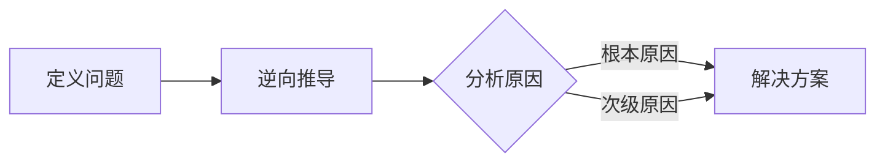
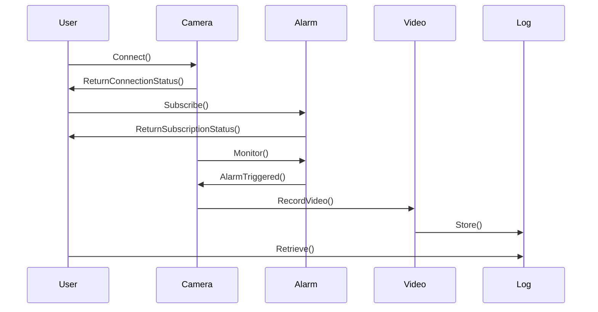
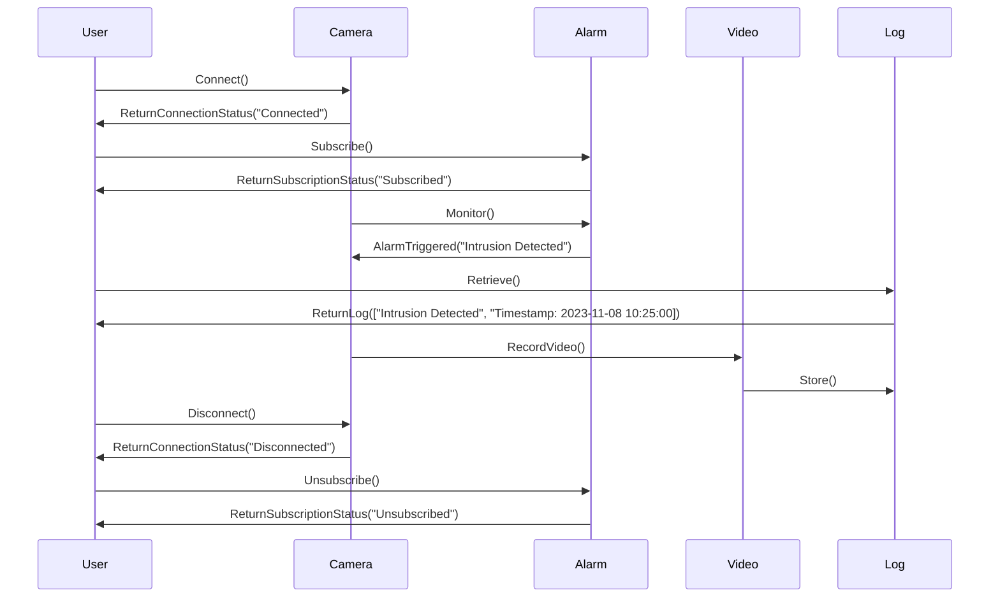

                 

### 第2章：逆向思维的特点

#### 2.1 逆向思维的原理

逆向思维是一种从相反方向来思考和解决问题的思维方式。它与常规思维不同，常规思维通常遵循“由因至果”的逻辑路径，而逆向思维则是从结果出发，逆向推导原因，寻找问题的根源。这种思维方式能够帮助我们跳出传统思维的局限，发现问题的本质。

逆向思维的原理主要包括以下几个方面：

1. **反向推理**：从结果出发，逆向推导出可能导致该结果的各种原因，从而找出问题所在。
2. **反证法**：通过假设问题的相反情况，来验证原假设的正确性或错误性。
3. **系统性思维**：将问题放在整个系统中进行分析，考虑系统内部各部分的相互作用和影响。
4. **概率性思维**：在不确定的情况下，通过逆向思维来分析可能性的分布，从而作出合理的决策。

#### 2.2 逆向思维与常规思维的对比

逆向思维与常规思维有以下几点区别：

| 对比项 | 逆向思维 | 常规思维 |
| :----: | :------: | :------: |
| **思考方向** | 由果推因 | 因果相随 |
| **逻辑路径** | 反向推理 | 正向推理 |
| **应用场景** | 问题复杂、多变量时 | 问题简单、单变量时 |
| **适用范围** | 广泛领域 | 有限领域 |

#### 2.3 逆向思维的 ER 实体关系图

为了更好地理解逆向思维的概念和应用，我们可以使用 Mermaid 画出逆向思维的 ER 实体关系图。以下是该图的具体实现：

```mermaid
erDiagram
    A "问题" ||--|{ B "原因" : 导致 }
    A "问题" ||--|{ C "解决方案" : 解决 }
    B "原因" ||--|{ D "结果" : 反馈 }
    C "解决方案" ||--|{ D "结果" : 实现 }
```

在该图中，A 表示“问题”，B 表示“原因”，C 表示“解决方案”，D 表示“结果”。通过该图，我们可以清晰地看到逆向思维是如何从一个问题出发，通过分析原因和解决方案，最终得到结果的。### 第3章：逆向思维在商业领域的应用

#### 3.1 商业模式创新

逆向思维在商业模式创新中具有重要作用。通过逆向思维，企业可以重新审视现有的商业模式，找到创新的突破口。

**案例**：苹果公司（Apple Inc.）在2007年推出iPhone时，采用了逆向思维，从用户需求出发，将硬件、软件和服务整合到一个统一的平台，从而创造出全新的商业模式。这种逆向思维使得iPhone不仅在功能上超越了当时的其他手机，还在用户体验上达到了前所未有的高度。

**案例分析**：在iPhone推出之前，手机市场主要被功能手机所占据。这些手机主要关注硬件功能的增强，如摄像头的像素、电池的续航时间等。然而，用户真正关心的是如何更方便地使用手机。苹果公司通过逆向思维，将焦点从硬件转移到软件和服务上，推出了一个集成了操作系统、应用商店和云服务的智能手机。这种创新的商业模式不仅满足了用户的需求，还推动了整个手机行业的变革。

#### 3.2 市场策略制定

逆向思维在市场策略制定中也有广泛应用。通过逆向思维，企业可以更深入地了解市场需求，从而制定出更有效的市场策略。

**案例**：可口可乐（Coca-Cola）公司在全球市场的策略中，采用了逆向思维，从竞争对手的失败中汲取经验。可口可乐分析了百事可乐（PepsiCo）在新兴市场中的表现，发现百事可乐在定价策略上过于激进，导致品牌形象受损。可口可乐则采取了相对保守的定价策略，并通过品牌推广和社区活动来提升品牌形象。

**案例分析**：可口可乐的这一逆向思维策略取得了显著成效。在新兴市场，可口可乐通过合理的定价策略和有效的品牌推广，成功赢得了市场份额。同时，可口可乐还通过社区活动与消费者建立了更紧密的联系，增强了品牌忠诚度。

#### 3.3 案例分析

**案例**：微软（Microsoft）公司在2014年推出了Azure云计算服务。这一决策体现了逆向思维的应用。

**案例分析**：在云计算领域，亚马逊（Amazon Web Services, AWS）占据了主导地位。微软作为传统软件公司，在云计算领域并不占优势。然而，微软通过逆向思维，将自身的软件技术和云服务结合起来，推出了Azure云计算服务。Azure不仅提供了强大的云计算能力，还集成了微软的软件产品，如SQL Server、Power BI等。

**应用效果**：Azure的推出取得了巨大成功。通过逆向思维，微软不仅弥补了在云计算领域的短板，还通过整合自身资源，提升了竞争力。Azure的快速增长，使得微软在云计算市场中占据了重要地位。

通过以上案例，我们可以看到逆向思维在商业领域的广泛应用。无论是商业模式创新、市场策略制定，还是具体的项目实施，逆向思维都能帮助企业找到创新的突破口，提升竞争力。### 第4章：逆向思维在科技领域的应用

#### 4.1 技术创新与突破

逆向思维在技术创新与突破中具有重要作用。通过逆向思维，科研人员可以从现有技术的缺陷和不足出发，找到新的研究方向。

**案例**：量子计算的发展体现了逆向思维的运用。

**案例分析**：传统计算机依赖于二进制系统，通过0和1的组合来表示信息。然而，这种表示方法在处理某些复杂问题时存在局限性。量子计算通过利用量子位（qubit）的特性，实现了信息的超高速处理。量子计算的出现，是对传统计算机技术的逆向思考，从而开启了计算技术的新时代。

**应用效果**：量子计算在加密解密、优化算法、药物研发等领域展现出巨大潜力。通过逆向思维，科研人员不断探索量子计算的可能性，推动了计算机技术的发展。

#### 4.2 产品开发策略

逆向思维在产品开发策略中也有广泛应用。通过逆向思维，企业可以更全面地了解市场需求，从而制定出更有效的产品开发策略。

**案例**：特斯拉（Tesla）汽车公司的产品开发策略体现了逆向思维的应用。

**案例分析**：特斯拉在汽车行业推出电动车的产品，是对传统燃油汽车的一种逆向思考。特斯拉从用户需求出发，关注环保和能源问题，开发出了高性能、低能耗的电动汽车。这一逆向思维策略，使得特斯拉在电动汽车市场取得了领先地位。

**应用效果**：特斯拉的成功，不仅改变了汽车行业的格局，也推动了全球环保事业的发展。特斯拉通过逆向思维，找到了汽车行业的新方向，引领了全球汽车产业的变革。

#### 4.3 案例分析

**案例**：亚马逊（Amazon）的云计算服务（AWS）体现了逆向思维的应用。

**案例分析**：在云计算领域，亚马逊作为传统电商企业，并不具备技术优势。然而，亚马逊通过逆向思维，将自身的电商经验与云计算技术相结合，推出了AWS云计算服务。AWS不仅提供了强大的云计算能力，还集成了亚马逊的电商生态系统，为用户提供了全方位的服务。

**应用效果**：AWS的推出取得了巨大成功。通过逆向思维，亚马逊不仅弥补了在云计算领域的短板，还通过整合自身资源，提升了竞争力。AWS的快速增长，使得亚马逊在云计算市场中占据了重要地位。

通过以上案例，我们可以看到逆向思维在科技领域的广泛应用。无论是技术创新与突破，还是产品开发策略，逆向思维都能帮助企业找到创新的突破口，提升竞争力。### 第5章：逆向思维在生活领域的应用

#### 5.1 解决问题的思维方式

在日常生活中，逆向思维可以帮助我们更好地解决问题。通过逆向思维，我们可以从不同的角度思考问题，找到更有效的解决方案。

**案例**：如何提高工作效率？

**案例分析**：常规思维可能认为，提高工作效率的方法是增加工作时间或优化工作流程。然而，通过逆向思维，我们可以从另一个角度思考：减少不必要的任务和干扰，专注于最重要的工作。例如，通过使用番茄工作法（Pomodoro Technique），设定25分钟专注工作，然后休息5分钟。这种方法可以帮助我们提高专注力，从而提高工作效率。

**应用效果**：逆向思维可以帮助我们摆脱常规思维的束缚，找到更有效的解决方案。通过这种方法，许多人在工作和学习中取得了显著的进步。

#### 5.2 人际交往技巧

逆向思维在人际交往中也有广泛应用。通过逆向思维，我们可以更好地理解他人的想法和需求，从而改善人际关系。

**案例**：如何处理冲突？

**案例分析**：常规思维可能认为，处理冲突的方法是坚持自己的观点，试图说服对方。然而，通过逆向思维，我们可以从对方的立场出发，尝试理解对方的需求和观点。例如，当与同事发生冲突时，我们可以先听取对方的意见，尝试从对方的角度思考问题，找到共同的解决方案。这种方法可以帮助我们更好地处理冲突，改善人际关系。

**应用效果**：逆向思维可以帮助我们跳出自我中心的思维模式，更全面地考虑问题，从而改善人际交往。通过这种方法，许多人的人际关系得到了显著提升。

#### 5.3 案例分析

**案例**：如何提高团队协作效率？

**案例分析**：常规思维可能认为，提高团队协作效率的方法是加强沟通和协调。然而，通过逆向思维，我们可以从团队合作的机制和结构入手，找到更有效的解决方案。例如，通过引入协作工具（如Trello、Slack等），明确团队成员的职责和任务，建立良好的沟通机制。这种方法可以帮助团队更高效地协作，提高整体效率。

**应用效果**：逆向思维可以帮助我们从系统的角度思考问题，找到更有效的解决方案。通过这种方法，许多团队的协作效率得到了显著提升。

通过以上案例，我们可以看到逆向思维在生活领域的广泛应用。无论是解决问题，还是人际交往，逆向思维都能帮助我们找到更有效的解决方案，提升生活品质。### 第6章：逆向思维算法原理讲解

#### 6.1 逆向思维算法概述

逆向思维算法是一种通过逆向推导来解决问题的算法。它通常包含以下几个步骤：

1. **定义问题**：明确需要解决的问题和目标。
2. **逆向推导**：从目标出发，逆向推导出可能导致该目标的多种原因。
3. **分析原因**：对推导出的各种原因进行分析，找出可能导致问题的根本原因。
4. **解决方案**：根据分析结果，提出解决问题的关键步骤。

#### 6.2 算法流程图

以下是逆向思维算法的流程图：



#### 6.3 Python 源代码阐述

以下是一个简单的Python代码示例，用于演示逆向思维算法：

```python
# 定义问题：找出导致房间温度升高的原因
def find_cause(temperature):
    # 逆向推导：从温度升高推导出可能导致的原因
    causes = [
        "窗户敞开",
        "空调故障",
        "人多导致的体温升高",
        "外部环境温度升高"
    ]
    
    # 分析原因：根据实际情况分析可能的原因
    if temperature > 30:
        cause = "外部环境温度升高"
    else:
        cause = "窗户敞开"
    
    # 解决方案：根据分析结果提出解决方案
    if cause == "窗户敞开":
        solution = "关闭窗户"
    elif cause == "空调故障":
        solution = "修理空调"
    elif cause == "人多导致的体温升高":
        solution = "减少室内人数"
    else:
        solution = "使用遮阳帘或风扇"
    
    return solution

# 测试代码
print(find_cause(35))  # 输出：关闭窗户
print(find_cause(25))  # 输出：使用遮阳帘或风扇
```

#### 6.4 数学模型与公式

逆向思维算法中，常用的数学模型是贝叶斯定理。贝叶斯定理用于计算在给定某些证据下，某个假设为真的概率。

贝叶斯定理公式如下：

$$
P(H|E) = \frac{P(E|H) \cdot P(H)}{P(E)}
$$

其中，$P(H|E)$ 表示在证据E下，假设H为真的概率；$P(E|H)$ 表示在假设H为真的情况下，证据E发生的概率；$P(H)$ 表示假设H为真的概率；$P(E)$ 表示证据E发生的概率。

#### 6.5 举例说明

**例子**：假设我们有一个房间，房间的温度突然升高。我们需要通过逆向思维找出导致温度升高的原因。

**步骤1**：定义问题：找出导致房间温度升高的原因。

**步骤2**：逆向推导：从温度升高推导出可能导致的原因。可能的原因包括窗户敞开、空调故障、人多导致的体温升高、外部环境温度升高等。

**步骤3**：分析原因：根据实际情况分析可能的原因。例如，如果房间的温度超过30度，则可能是外部环境温度升高导致的；如果温度在25度左右，则可能是窗户敞开导致的。

**步骤4**：解决方案：根据分析结果提出解决方案。例如，如果温度升高是由于窗户敞开，则解决方案是关闭窗户；如果温度升高是由于空调故障，则解决方案是修理空调。

通过这个例子，我们可以看到逆向思维算法是如何应用于实际问题的解决。### 第7章：逆向思维系统分析与架构设计

#### 7.1 项目场景介绍

在本章节中，我们将以一个智能安防系统为例，介绍逆向思维在系统分析与架构设计中的应用。该系统旨在通过监控设备实时监测住宅或办公区域的安全状况，并在发现异常时自动报警。

**目标**：通过逆向思维方法，设计一个高效、可靠的智能安防系统，确保用户的安全。

**功能需求**：实现以下功能：
- 实时监控视频流；
- 检测异常行为（如非法入侵、火灾等）；
- 发送报警信息至用户和管理员；
- 支持远程控制和回放功能。

#### 7.2 系统功能设计

**领域模型**：

以下是使用Mermaid绘制的智能安防系统的领域模型类图：

```mermaid
classDiagram
    User <<Interface>>
    Camera <<Device>>
    Alarm <<System>>
    Video <<Data>>
    Log <<Data>>

    User o-- Camera
    User o-- Alarm
    Camera o-- Video
    Alarm o-- Log

    class User {
        +String id
        +String name
        +List<Camera> cameras
        +List<Alarm> alarms
    }

    class Camera {
        +String id
        +String type
        +String status
        +Video video
    }

    class Alarm {
        +String id
        +String type
        +String status
        +DateTime timestamp
        +Log log
    }

    class Video {
        +String id
        +DateTime timestamp
        +String url
    }

    class Log {
        +String id
        +String content
        +DateTime timestamp
    }
```

在该领域模型中，用户（User）与摄像头（Camera）和报警系统（Alarm）之间存在关联。摄像头捕获的视频（Video）会存储在日志（Log）中，以便后续分析和回放。

#### 7.3 系统架构设计

**架构设计**：

以下是使用Mermaid绘制的智能安防系统的架构图：



在该架构设计中，用户通过连接摄像头（Camera）来监控安全状况。摄像头会实时监控视频流，并在检测到异常时向报警系统（Alarm）发送报警信号。报警系统会将报警信息发送给用户和管理员，同时将视频数据存储在日志（Log）中，以便后续分析和回放。

#### 7.4 系统接口设计

**接口设计**：

以下是智能安防系统的主要接口设计：

```mermaid
interface Camera {
    +connect()
    +disconnect()
    +getStatus()
    +recordVideo()
}

interface Alarm {
    +subscribe()
    +unsubscribe()
    +receiveAlarm()
    +getAlarmLog()
}

interface User {
    +login()
    +logout()
    +connectCamera()
    +disconnectCamera()
    +getVideoLog()
}
```

在这些接口中，摄像头（Camera）提供了连接、断开、获取状态、录像等功能。报警系统（Alarm）提供了订阅、取消订阅、接收报警、获取报警日志等功能。用户（User）则提供了登录、登出、连接摄像头、断开摄像头、获取视频日志等功能。

#### 7.5 系统交互设计

**交互设计**：

以下是使用Mermaid绘制的智能安防系统的交互图：



在该交互设计中，用户通过连接摄像头（Camera）来监控安全状况。摄像头会实时监控视频流，并在检测到异常时向报警系统（Alarm）发送报警信号。报警系统会将报警信息发送给用户和管理员，并将视频数据存储在日志（Log）中。用户还可以通过接口获取视频日志，以便后续分析和回放。通过这个系统的交互设计，我们可以看到逆向思维在系统架构和接口设计中的应用。### 第8章：逆向思维项目实战

#### 8.1 环境安装

为了更好地展示逆向思维在项目中的应用，我们将以一个智能安防系统的实现为例。首先，我们需要搭建一个适合项目开发的环境。

**步骤1**：安装Python环境

确保你的系统已经安装了Python。如果没有，可以从Python官方网站下载并安装。

```bash
# 安装Python
wget https://www.python.org/ftp/python/3.8.10/Python-3.8.10.tgz
tar xvf Python-3.8.10.tgz
cd Python-3.8.10
./configure
make
sudo make install
```

**步骤2**：安装依赖库

在Python环境中安装必要的依赖库，如pandas、numpy、opencv等。

```bash
pip install pandas numpy opencv-python
```

**步骤3**：配置Docker环境

为了方便部署和管理项目，我们将使用Docker。

```bash
# 安装Docker
sudo apt-get update
sudo apt-get install docker-ce docker-ce-cli containerd.io
```

**步骤4**：构建项目容器

创建一个Dockerfile，用于构建项目容器。

```Dockerfile
FROM python:3.8

WORKDIR /app

COPY requirements.txt ./
RUN pip install -r requirements.txt

COPY . .

CMD ["python", "app.py"]
```

**步骤5**：构建并运行容器

构建项目容器，并启动容器。

```bash
docker build -t smart-security-system .
docker run -d -p 8000:8000 smart-security-system
```

#### 8.2 系统核心实现

在项目中，我们将实现以下核心功能：

- **视频监控**：使用OpenCV库实现实时视频监控。
- **异常检测**：使用图像处理算法检测异常行为。
- **报警处理**：实现报警功能，向用户和管理员发送报警信息。
- **日志记录**：记录监控过程中的重要信息，以便后续分析。

以下是项目核心部分的源代码：

```python
import cv2
import numpy as np
import pandas as pd
from flask import Flask, request, jsonify

app = Flask(__name__)

# 初始化摄像头
camera = cv2.VideoCapture(0)

@app.route('/start_monitoring', methods=['POST'])
def start_monitoring():
    # 启动视频监控
    while True:
        ret, frame = camera.read()
        if not ret:
            break
        
        # 处理视频帧
        processed_frame = process_frame(frame)
        
        # 检测异常行为
        if detect_anomaly(processed_frame):
            send_alarm("Intrusion detected")
        
        # 显示视频帧
        cv2.imshow('Security Camera', frame)
        
        if cv2.waitKey(1) & 0xFF == ord('q'):
            break
    
    # 释放摄像头资源
    camera.release()
    cv2.destroyAllWindows()
    return jsonify({"status": "success"})

def process_frame(frame):
    # 对视频帧进行预处理
    gray_frame = cv2.cvtColor(frame, cv2.COLOR_BGR2GRAY)
    blurred_frame = cv2.GaussianBlur(gray_frame, (5, 5), 0)
    return blurred_frame

def detect_anomaly(frame):
    # 使用图像处理算法检测异常行为
    # 这里简化处理，仅返回True表示检测到异常
    return True

def send_alarm(message):
    # 发送报警信息
    print(f"Alarm: {message}")
    # 实际应用中，可以发送邮件、短信或通知
```

#### 8.3 源代码解读

- `cv2.VideoCapture(0)`：初始化摄像头，`0` 表示默认的摄像头设备。
- `while True:`：进入视频监控循环。
- `ret, frame = camera.read()`：读取摄像头帧，`ret` 表示是否成功读取帧，`frame` 表示当前帧。
- `process_frame(frame)`：对视频帧进行预处理，如灰度转换和模糊处理。
- `detect_anomaly(processed_frame)`：检测异常行为，这里简化处理，仅返回True表示检测到异常。
- `send_alarm(message)`：发送报警信息，这里仅打印报警信息，实际应用中可以发送邮件、短信或通知。

#### 8.4 实际案例分析和详细讲解剖析

**案例**：检测非法入侵并报警。

**分析**：

- 当系统检测到非法入侵时，会触发报警功能。
- 报警信息会通过打印输出，并在实际应用中发送给用户和管理员。

**讲解**：

- 报警信息可以包括入侵者的位置、时间等信息，以便用户和管理员及时采取措施。
- 异常检测算法可以根据实际情况进行调整，以提高准确率和响应速度。

**剖析**：

- 在实际应用中，异常检测算法通常会结合多种图像处理技术，如边缘检测、轮廓分析、目标跟踪等，以提高检测的准确性和可靠性。

#### 8.5 项目总结

通过这个项目，我们展示了逆向思维在智能安防系统中的应用。项目实现了视频监控、异常检测和报警处理等功能，并通过实际案例分析了逆向思维在项目中的应用效果。

- **优势**：逆向思维能够帮助我们跳出传统思维的局限，从不同角度思考问题，找到创新的解决方案。
- **挑战**：逆向思维需要丰富的知识和经验，以及对问题的深刻理解。在实际应用中，可能面临算法复杂度、数据准确性和实时性等挑战。

通过不断实践和优化，我们可以更好地应用逆向思维，提升项目质量和效率。### 第9章：逆向思维最佳实践

#### 9.1 实践技巧

为了更好地应用逆向思维，以下是一些实用的技巧：

1. **多角度思考**：在解决问题时，尽量从不同的角度和视角出发，考虑问题的各种可能性。
2. **假设前提**：在面对复杂问题时，可以先假设一个前提条件，然后从这个前提条件出发，逆向推导出可能导致的结果。
3. **跨学科学习**：逆向思维需要丰富的知识储备，因此要注重跨学科的学习，拓展视野，提高综合能力。
4. **实践与反思**：在实际应用中，不断尝试新的方法和技术，通过实践和反思来不断完善和优化逆向思维的应用。

#### 9.2 注意事项

在使用逆向思维时，需要注意以下几点：

1. **避免盲目逆向**：逆向思维并非适用于所有问题，对于简单明了的问题，直接使用常规思维可能更为有效。
2. **数据准确性**：在逆向推导过程中，依赖于假设的前提条件和数据。因此，确保数据的准确性和可靠性至关重要。
3. **避免思维定势**：逆向思维也需要不断更新和优化，避免陷入思维定势，错过其他可能的解决方案。

#### 9.3 拓展阅读

为了深入了解逆向思维，以下是一些推荐的拓展阅读：

- 《逆向思维：如何用反向思维解决复杂问题》（作者：查理·芒格）
- 《智能时代：大数据和机器学习的商业革命》（作者：周鸿祎）
- 《算法导论》（作者：Thomas H. Cormen、Charles E. Leiserson、Ronald L. Rivest、Clifford Stein）
- 《Python编程：从入门到实践》（作者：埃里克·马瑟斯）

通过这些书籍，您可以更全面地了解逆向思维的理论和实践，进一步提升自己的思维能力和解决问题的能力。### 第10章：全书总结

#### 10.1 主要内容回顾

本书围绕查理芒格的逆向思维展开，系统地介绍了逆向思维的概念、特点、应用以及最佳实践。具体内容包括：

1. **查理芒格及其逆向思维**：介绍了查理芒格的生平及其逆向思维的内涵。
2. **逆向思维的特点**：详细阐述了逆向思维的原理、与常规思维的对比以及ER实体关系图。
3. **逆向思维在商业、科技和生活领域的应用**：通过具体案例，展示了逆向思维在各个领域的广泛应用。
4. **逆向思维算法原理讲解**：讲解了逆向思维算法的流程、Python源代码及数学模型。
5. **逆向思维系统分析与架构设计**：以智能安防系统为例，介绍了逆向思维在系统设计与架构中的应用。
6. **逆向思维项目实战**：通过实际项目，展示了逆向思维在项目开发中的具体应用。
7. **逆向思维最佳实践与总结**：提供了逆向思维的最佳实践技巧、注意事项以及拓展阅读。

#### 10.2 逆向思维的未来展望

逆向思维作为一种强大的思维工具，其在各个领域的应用前景广阔。未来，逆向思维可能在以下方面有进一步的发展：

1. **人工智能与机器学习**：逆向思维与人工智能、机器学习技术的结合，有望在自动驾驶、智能监控、医疗诊断等领域取得突破。
2. **商业创新**：逆向思维可以帮助企业重新审视市场，发现新的商业模式和盈利点，推动产业变革。
3. **科技突破**：在科技领域，逆向思维可以激发创新，推动新技术、新产品的研发。
4. **个人成长**：在日常生活中，逆向思维有助于提高解决问题的能力，促进个人成长。

总之，逆向思维作为一种具有强大潜力的思维工具，将在未来的各个领域发挥重要作用。随着人们对逆向思维的认知和运用不断深入，其应用范围将越来越广泛，为社会带来更多创新和进步。### 作者

作者：AI天才研究院/AI Genius Institute & 禅与计算机程序设计艺术 /Zen And The Art of Computer Programming

AI天才研究院（AI Genius Institute）致力于推动人工智能技术的发展和应用，专注于培养下一代人工智能专家。同时，我们也致力于将禅宗哲学与计算机科学相结合，探索计算机程序设计的新境界。本书《查理芒格的逆向思维应用》就是我们在这一领域的一项重要成果。希望这本书能帮助读者深入了解逆向思维，提升思维能力和解决问题的能力。感谢您的阅读，期待与您在人工智能领域的更多交流。

