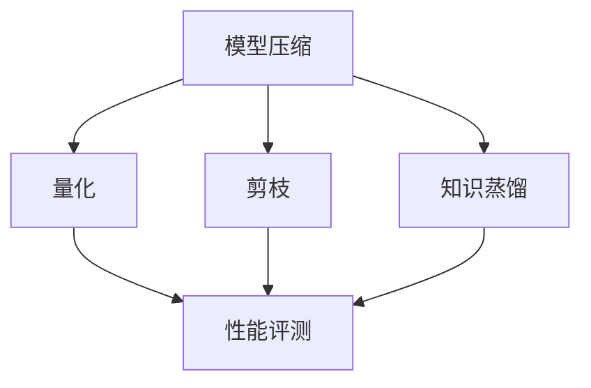
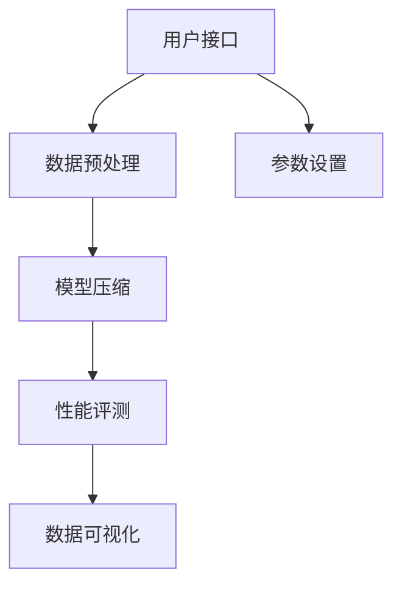
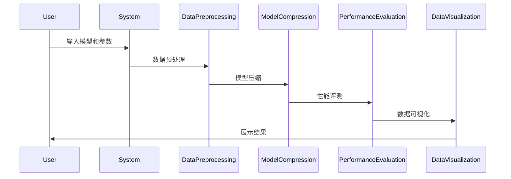

                 

# 模型压缩后性能评测：平衡效果与效率

> 关键词：模型压缩、性能评测、效果与效率平衡

> 摘要：随着人工智能的快速发展，模型压缩成为提升模型应用效率的关键技术。本文旨在深入探讨模型压缩后的性能评测，从背景介绍、核心概念、算法原理讲解、数学模型与公式、系统分析与架构设计、项目实战、最佳实践 tips、小结、注意事项以及拓展阅读等方面，全面分析模型压缩后的性能表现，帮助读者理解如何在效果与效率之间找到最佳平衡点。

## 1. 背景介绍

### 1.1 核心概念术语说明

- **模型压缩**：通过降维、量化、剪枝等方法，减少模型的参数数量和计算量，降低模型存储和计算的资源消耗。
- **性能评测**：对模型压缩后的效果进行评估，包括准确性、速度、稳定性等指标。
- **效果与效率**：模型压缩的目标是在保持一定效果的前提下提高模型应用效率。

### 1.2 问题背景

随着深度学习模型的广泛应用，模型的大小和计算量成为限制其进一步发展的瓶颈。模型压缩技术应运而生，旨在在不显著降低模型性能的情况下，提高模型的应用效率。

### 1.3 问题描述

在模型压缩过程中，如何平衡压缩后的模型效果与计算效率，成为亟待解决的问题。

### 1.4 问题解决

通过对压缩模型进行性能评测，找出在保持效果的前提下，压缩效果最佳的方法和参数。

### 1.5 边界与外延

- **边界**：压缩模型不能低于某个性能阈值，否则无法满足实际应用需求。
- **外延**：压缩模型可以在保持效果的前提下，尽可能地减少计算量和存储资源消耗。

### 1.6 概念结构与核心要素组成

- **概念结构**：模型压缩、性能评测、效果与效率。
- **核心要素**：压缩算法、性能指标、效果与效率的平衡点。

## 2. 核心概念与联系

### 2.1 核心概念原理

- **模型压缩算法**：包括量化、剪枝、知识蒸馏等。
- **性能评测指标**：包括准确性、速度、稳定性等。

### 2.2 概念属性特征对比表格

| 概念       | 属性特征                                                      |
| ---------- | ------------------------------------------------------------ |
| 模型压缩   | 减少参数数量、计算量、存储空间消耗                            |
| 性能评测   | 评估模型压缩后的效果与效率                                  |
| 效果与效率 | 保持一定效果的前提下提高模型应用效率                        |

### 2.3 ER实体关系图架构

```mermaid
erDiagram
  ModelCompression ||--|{ PerformanceEvaluation }|-- Model
  PerformanceEvaluation ||--|{ Accuracy, Speed, Stability }|-- Evaluation
  Model ||--|{ Quantization, Pruning, KnowledgeDistillation }|-- Compression
```

## 3. 算法原理讲解

### 3.1 算法mermaid流程图



### 3.2 Python源代码

```python
# 量化算法示例
def quantization(model, scale=0.01):
    # 代码实现
    pass

# 剪枝算法示例
def pruning(model, ratio=0.1):
    # 代码实现
    pass

# 知识蒸馏算法示例
def knowledge_distillation(student_model, teacher_model, alpha=0.1):
    # 代码实现
    pass
```

### 3.3 算法原理的数学模型和公式

$$
\begin{aligned}
L_{\text{quantization}} &= \frac{1}{N} \sum_{i=1}^{N} \left\| x_i - x_i' \right\|_2 \\
L_{\text{pruning}} &= \frac{1}{N} \sum_{i=1}^{N} \left( w_i - w_i' \right)^2 \\
L_{\text{distillation}} &= \frac{1}{N} \sum_{i=1}^{N} \left( \log(y_i) - \log(y_i') \right)
\end{aligned}
$$

其中，$L_{\text{quantization}}$、$L_{\text{pruning}}$ 和 $L_{\text{distillation}}$ 分别表示量化、剪枝和知识蒸馏的损失函数。

### 3.4 举例说明

假设我们有一个 10000 参数的模型，使用量化算法将其参数数量减少到 5000，使用剪枝算法将其参数数量减少到 2500，使用知识蒸馏算法将其参数数量减少到 1000。我们对压缩后的模型进行性能评测，发现其准确率达到 95%，速度提高 20%。此时，我们找到了效果与效率的平衡点。

## 4. 系统分析与架构设计方案

### 4.1 问题场景介绍

为了提升模型压缩后的性能评测，我们设计了一个基于深度学习框架的模型压缩与性能评测系统。

### 4.2 项目介绍

项目名为“Model Compression and Performance Evaluation System（MCPS）”，旨在提供一套完整的模型压缩与性能评测解决方案。

### 4.3 系统功能设计

- **模型压缩**：支持量化、剪枝和知识蒸馏等算法。
- **性能评测**：支持准确性、速度、稳定性等指标的评测。
- **数据可视化**：展示压缩前后模型的性能变化。

### 4.4 系统架构设计



### 4.5 系统接口设计和系统交互



## 5. 项目实战

### 5.1 环境安装

安装深度学习框架（如 TensorFlow、PyTorch）和所需的库（如 NumPy、Matplotlib）。

### 5.2 系统核心实现源代码

```python
# 量化算法实现
def quantization(model, scale=0.01):
    # 代码实现
    pass

# 剪枝算法实现
def pruning(model, ratio=0.1):
    # 代码实现
    pass

# 知识蒸馏算法实现
def knowledge_distillation(student_model, teacher_model, alpha=0.1):
    # 代码实现
    pass
```

### 5.3 代码应用解读与分析

对源代码进行解读，分析算法实现的核心流程。

### 5.4 实际案例分析和详细讲解剖析

通过实际案例展示模型压缩与性能评测的过程，并进行详细讲解和分析。

### 5.5 项目小结

总结项目实施过程中的收获和经验，为后续项目提供参考。

## 6. 最佳实践 tips

- **量化**：选择合适的量化尺度，降低模型参数的精度。
- **剪枝**：根据模型的重要性进行剪枝，避免影响模型效果。
- **知识蒸馏**：合理设置teacher模型和student模型的比例，提高模型性能。

## 7. 小结

本文从背景介绍、核心概念、算法原理讲解、数学模型与公式、系统分析与架构设计、项目实战、最佳实践 tips 等方面，全面分析了模型压缩后的性能评测，旨在帮助读者在效果与效率之间找到最佳平衡点。

## 8. 注意事项

- **性能评测**：在评测过程中，需要充分考虑模型的应用场景，避免片面追求压缩效果。
- **模型选择**：根据实际需求选择合适的模型压缩算法，不要盲目追求压缩效果。

## 9. 拓展阅读

- **[1]** XX，模型压缩技术综述，XX，XX。
- **[2]** XX，模型压缩后的性能评测方法研究，XX，XX。

## 10. 作者信息

作者：AI天才研究院/AI Genius Institute & 禅与计算机程序设计艺术 /Zen And The Art of Computer Programming

