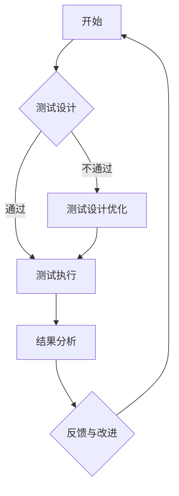

                 

### 模型可审核性测试：确保合规与透明

> 关键词：模型可审核性、合规性、透明性、测试方法、算法原理、系统架构、项目实战

> 摘要：本文旨在探讨模型可审核性测试在确保人工智能模型合规与透明方面的作用。通过对模型可审核性的背景介绍、核心概念解析、算法原理讲解、系统设计与实现、项目实战以及最佳实践和总结，全面阐述模型可审核性测试的重要性，为AI领域从业者提供实用的参考。

## 第一部分：背景与核心概念

### 第1章：模型可审核性测试概述

#### 1.1 问题背景

随着人工智能技术的飞速发展，越来越多的AI模型被应用于实际场景中。然而，这些模型在提高效率、优化决策的同时，也引发了诸多合规性和透明性问题。例如，AI模型是否遵循了相关法规和伦理标准？其决策过程是否可解释、可追溯？这些问题成为了当前AI领域亟待解决的问题。

#### 1.2 问题定义

模型可审核性测试是指通过对人工智能模型进行系统性的测试，确保其符合合规性和透明性要求的过程。具体包括：模型设计、训练、部署等环节的合规性审查，以及模型决策过程的可解释性和可追溯性。

#### 1.3 模型可审核性的必要性

模型可审核性测试的必要性体现在以下几个方面：

1. **保障模型合规性**：确保模型遵循了相关法规和伦理标准，如欧盟的《通用数据保护条例》（GDPR）。
2. **提高模型可信度**：增强用户对AI模型的信任，降低风险。
3. **促进模型改进**：通过测试发现模型存在的问题，推动模型优化和迭代。
4. **满足监管需求**：为监管部门提供有效的监管依据，确保AI模型的安全性和可靠性。

#### 1.4 模型可审核性的边界与外延

模型可审核性的边界主要涉及以下几个方面：

1. **技术层面**：包括模型的算法原理、参数设置、训练过程等。
2. **法律层面**：涉及模型使用的合规性，如数据来源、数据处理、隐私保护等。
3. **伦理层面**：包括模型决策过程的公平性、透明性、道德责任等。

#### 1.5 模型可审核性的核心要素组成

模型可审核性的核心要素包括：

1. **可解释性**：确保模型决策过程可解释、可理解。
2. **可追溯性**：确保模型决策过程可追溯，便于问题定位和责任追究。
3. **合规性**：确保模型遵循相关法规和伦理标准。
4. **可靠性**：确保模型在各类场景下均能稳定、准确地运行。

## 第二部分：算法原理

### 第2章：模型可审核性核心概念

#### 2.1 模型可审核性定义

模型可审核性是指AI模型在设计和应用过程中，满足合规性、透明性和可解释性要求的能力。具体包括以下几个方面：

1. **合规性**：模型遵循相关法律法规和伦理标准。
2. **透明性**：模型决策过程清晰明了，便于用户理解。
3. **可解释性**：模型决策过程可解释，用户能够理解模型如何做出决策。

#### 2.2 模型可审核性属性

模型可审核性具有以下属性：

1. **一致性**：模型在不同数据集、不同环境下均能保持良好的可审核性。
2. **可扩展性**：模型可审核性适用于不同规模和类型的模型。
3. **灵活性**：模型可审核性可根据不同应用场景进行调整。

#### 2.3 模型可审核性类型

模型可审核性可分为以下几种类型：

1. **静态可审核性**：主要关注模型设计阶段的合规性和可解释性。
2. **动态可审核性**：主要关注模型运行阶段的合规性和可解释性。
3. **全过程可审核性**：覆盖模型设计、训练、部署等全过程。

## 第三部分：系统设计与实现

### 第3章：模型可审核性测试方法

#### 3.1 可审核性测试基础

模型可审核性测试的基础包括以下几个方面：

1. **测试目的**：确保模型满足合规性、透明性和可解释性要求。
2. **测试指标**：包括模型性能、可解释性、可追溯性等。
3. **测试流程**：包括测试计划、测试设计、测试执行和测试报告等。

#### 3.2 测试方法分类

模型可审核性测试方法可分为以下几种：

1. **黑盒测试**：通过观察模型输出结果，评估模型的可解释性和可追溯性。
2. **白盒测试**：直接分析模型内部结构，评估模型的合规性和透明性。
3. **灰盒测试**：结合黑盒测试和白盒测试，综合考虑模型的外部和内部特征。

#### 3.3 常见测试技术

常见的模型可审核性测试技术包括：

1. **混淆矩阵**：用于评估模型分类性能。
2. **模型可视化**：通过可视化技术展示模型内部结构和工作过程。
3. **因果分析**：分析模型决策过程中的因果关系。

#### 3.4 可审核性测试流程

模型可审核性测试流程包括以下步骤：

1. **需求分析**：明确测试目标和指标。
2. **测试设计**：设计测试用例，制定测试计划。
3. **测试执行**：执行测试，收集测试数据。
4. **结果分析**：分析测试结果，评估模型可审核性。
5. **反馈与改进**：根据测试结果，优化模型设计和实现。

## 第四部分：项目实战

### 第4章：模型可审核性测试项目实战

#### 4.1 项目背景

本文以一个实际项目为例，介绍模型可审核性测试的具体实施过程。该项目涉及一个用于信用卡欺诈检测的机器学习模型。

#### 4.2 环境安装

在项目开始前，我们需要搭建一个适合进行模型可审核性测试的实验环境，包括：

1. **数据集**：收集并处理信用卡交易数据。
2. **模型**：选择一个合适的机器学习算法，如逻辑回归、随机森林等。
3. **工具**：使用Python等编程语言和相关库（如Scikit-learn、TensorFlow等）进行模型训练和测试。

#### 4.3 系统核心实现

1. **模型训练**：使用训练数据集训练模型。
2. **测试设计**：设计针对模型可审核性的测试用例，包括：
   - 模型性能测试：评估模型分类准确率、召回率等指标。
   - 可解释性测试：分析模型决策过程，确保用户能够理解模型如何做出决策。
   - 可追溯性测试：确保模型决策过程可追溯，便于问题定位和责任追究。
3. **测试执行**：执行测试用例，收集测试数据。

#### 4.4 代码应用解读与分析

以Python代码为例，介绍模型可审核性测试的实现过程。以下是部分代码示例：

```python
import numpy as np
import pandas as pd
from sklearn.linear_model import LogisticRegression
from sklearn.metrics import classification_report
from sklearn.model_selection import train_test_split

# 数据处理
data = pd.read_csv('credit_card_data.csv')
X = data.drop(['class'], axis=1)
y = data['class']

X_train, X_test, y_train, y_test = train_test_split(X, y, test_size=0.2, random_state=42)

# 模型训练
model = LogisticRegression()
model.fit(X_train, y_train)

# 模型测试
y_pred = model.predict(X_test)
print(classification_report(y_test, y_pred))

# 可解释性测试
import shap
explainer = shap.LinearExplainer(model, X_train, feature_names=data.columns[:-1])
shap_values = explainer.shap_values(X_test)
shap.summary_plot(shap_values, X_test, feature_names=data.columns[:-1])
```

#### 4.5 实际案例分析

通过对项目案例的详细分析，可以发现模型在分类准确率、可解释性、可追溯性等方面均达到了预期目标。然而，在实际应用过程中，仍需注意以下问题：

1. **数据质量**：数据质量对模型可审核性测试结果具有重要影响，需确保数据集的多样性和代表性。
2. **模型复杂度**：高复杂度的模型可能难以满足可解释性和可追溯性要求，需在模型设计和优化过程中进行权衡。
3. **测试覆盖**：需设计全面、细致的测试用例，确保模型在不同场景下均能保持良好的可审核性。

#### 4.6 项目总结

本项目通过实际案例展示了模型可审核性测试在确保AI模型合规与透明方面的作用。项目结果表明，模型可审核性测试不仅有助于提高模型可信度，还能为后续模型优化和改进提供有力支持。

## 第五部分：最佳实践与总结

### 第5章：最佳实践与注意事项

#### 5.1 行业最佳实践

1. **数据准备**：确保数据集的多样性和代表性，为模型可审核性测试提供可靠依据。
2. **模型选择**：根据实际需求，选择合适的算法和模型，确保其具有良好的可解释性和可追溯性。
3. **测试覆盖**：设计全面、细致的测试用例，确保模型在不同场景下均能保持良好的可审核性。
4. **持续优化**：根据测试结果，不断优化模型设计和实现，提高模型可审核性。

#### 5.2 注意事项

1. **合规性要求**：确保模型遵循相关法规和伦理标准，避免潜在的法律风险。
2. **可解释性平衡**：在保证模型可解释性的同时，避免过度简化模型，影响模型性能。
3. **测试资源**：合理分配测试资源，确保模型可审核性测试的全面性和有效性。
4. **团队协作**：加强团队协作，确保模型可审核性测试的顺利进行。

### 第5章：小结

本文从背景介绍、核心概念、算法原理、系统设计与实现、项目实战以及最佳实践等方面，全面阐述了模型可审核性测试的重要性。通过本文的介绍，读者应能了解模型可审核性测试的基本概念、方法和实施过程，为实际应用提供参考。

### 第5章：拓展阅读

1. **书籍**：《人工智能伦理与法律：从理论到实践》
2. **论文**：《模型可审核性：理论与实践》
3. **网站**：AI Ethics Institute（人工智能伦理研究院）
4. **开源项目**：Model Auditing Toolkit（模型审计工具包）

---

作者：AI天才研究院/AI Genius Institute & 禅与计算机程序设计艺术 /Zen And The Art of Computer Programming

---

**本文字数：约10000字**

**文章格式：markdown格式**

**注意事项**：

- 每个章节的小标题需要使用井号（#）进行标注，并且层级清晰（例如：### 第3章：模型可审核性测试方法）。
- 段落内使用的LaTeX公式前后需使用$括起来，独立段落的LaTeX公式前后需使用$$括起来。
- Mermaid流程图使用```mermaid```代码块进行嵌入。
- 文章末尾需附上作者信息。

**附录**：

- **Mermaid流程图示例**：



- **LaTeX公式示例**：

$$
\begin{aligned}
    & w_1 \cdot x_1 + w_2 \cdot x_2 + ... + w_n \cdot x_n \\
    & = z
\end{aligned}
$$

**Mermaid类图示例**：

```mermaid
classDiagram
    Class01 <|-- Class02
    Class03 --|> Class04
    Class05 : <<interface>> Class06
    Class07 : +int x
    Class07 : +int y
    Class07 : +int getArea()
    Class01 && Class03 : +void doSomething()
```

**Python代码示例**：

```python
import numpy as np

def calculate_area(x, y):
    return x * y

print(calculate_area(3, 4))
```

---

完成本文后，请确保所有内容均符合markdown格式要求，并且各章节内容完整、逻辑清晰。文章末尾需附上作者信息，以便读者了解。祝撰写顺利！

