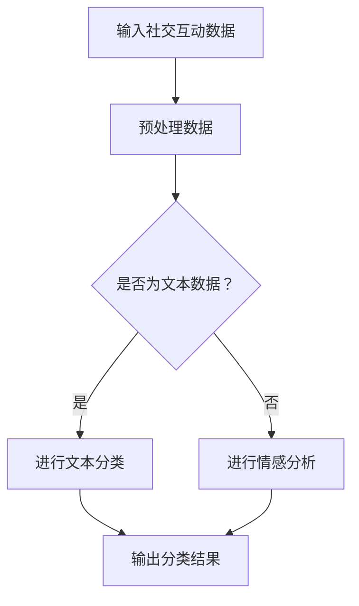
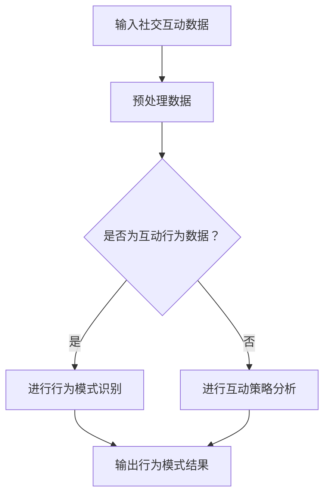
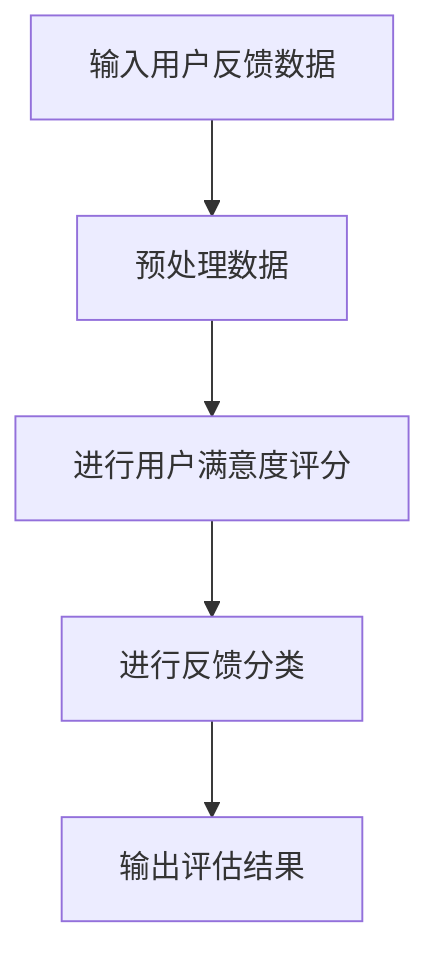
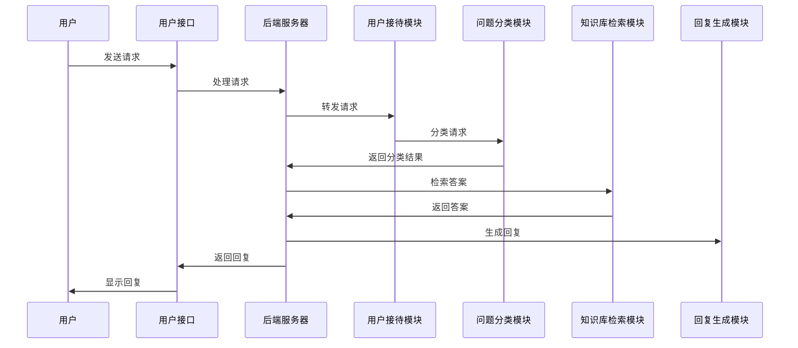

                 

# 模型社交能力测试：评估人机交互质量

> 关键词：人机交互、模型社交能力、评估方法、指标体系、算法原理

> 摘要：本文深入探讨了模型社交能力测试在评估人机交互质量中的应用。通过分析模型社交能力的原理、评估方法、指标体系和算法原理，本文提出了一个系统性的解决方案，以提升人机交互的质量，为人工智能技术的发展奠定基础。

## 引言

### 1.1 问题背景

在当今信息化社会中，人机交互已经成为了我们日常生活和工作中不可或缺的一部分。从手机应用、电脑软件到智能家居，人机交互的质量直接影响了用户体验。然而，随着人工智能技术的快速发展，尤其是大规模语言模型的出现，人机交互的复杂性和挑战性也在不断增加。模型社交能力作为人工智能的一个重要分支，其发展直接影响到人机交互的质量。因此，如何对模型社交能力进行有效评估，以提升人机交互质量，成为了一个亟待解决的问题。

#### 1.1.1 人机交互的重要性

人机交互（Human-Computer Interaction, HCI）是指人与计算机系统之间的交互过程。它涉及到用户如何与计算机系统进行沟通、如何理解计算机系统的响应以及如何通过计算机系统完成特定任务。随着计算机技术的不断发展，人机交互已经从最初的命令行界面发展到了今天的图形用户界面（GUI），用户界面变得更加直观、友好，用户体验也得到了显著提升。

#### 1.1.2 模型社交能力的发展

模型社交能力是指人工智能模型在模仿人类社交行为方面的能力。随着深度学习、自然语言处理等技术的进步，人工智能模型在模仿人类社交行为方面取得了显著的进展。例如，聊天机器人、语音助手等应用已经开始广泛应用于我们的日常生活，它们通过模仿人类的语言和行为，提高了人机交互的舒适度和效率。

#### 1.1.3 人机交互质量的评估需求

人机交互质量直接影响用户对系统的满意度。然而，如何客观、全面地评估人机交互质量，仍然是一个具有挑战性的问题。传统的评估方法主要依赖于用户反馈和专家评审，这些方法虽然可以提供一定的参考，但往往缺乏客观性和系统性。随着模型社交能力的发展，对模型社交能力进行科学、有效的评估，成为提升人机交互质量的关键。

### 1.2 问题描述

#### 1.2.1 社交能力与交互质量

社交能力是指个体在社交互动中表现出的技能和特质，包括沟通能力、理解能力、情感表达能力等。在人工智能领域，模型社交能力是指人工智能模型在模拟人类社交行为方面的能力。交互质量则是指人机交互过程中用户感受到的满意度和效率。

#### 1.2.2 评估人机交互质量的挑战

评估人机交互质量面临着以下几个挑战：

1. **主观性**：用户对交互质量的评价往往具有主观性，不同用户对相同交互质量的感受可能存在较大差异。
2. **复杂性**：人机交互过程涉及多个方面，包括界面设计、交互逻辑、响应速度等，评估过程复杂。
3. **数据收集**：收集大量、高质量的评估数据需要耗费大量时间和资源。
4. **标准化**：目前缺乏统一的评估标准和方法，导致评估结果的可比性较差。

#### 1.2.3 模型社交能力测试的必要性

随着人工智能技术的不断发展，模型社交能力在提升人机交互质量中扮演着越来越重要的角色。对模型社交能力进行科学、系统的评估，有助于：

1. **优化模型设计**：通过评估模型社交能力，可以发现模型在社交互动中的不足，从而指导模型优化。
2. **提高用户体验**：有效的模型社交能力测试可以提升人机交互的舒适度和效率，提高用户体验。
3. **推动技术发展**：通过评估模型社交能力，可以推动人工智能技术的不断进步。

### 1.3 问题解决

#### 1.3.1 模型社交能力测试的必要性

模型社交能力测试是为了评估人工智能模型在模拟人类社交行为方面的能力。通过测试，可以了解模型在不同社交场景下的表现，发现模型在社交互动中的优点和不足，从而指导模型优化。

#### 1.3.2 评估方法的选择

选择合适的评估方法对于模型社交能力测试至关重要。常用的评估方法包括自动评估方法和人工评估方法。自动评估方法主要依赖于算法和技术，可以大规模、快速地评估模型社交能力。人工评估方法则依靠人类专家的判断和经验，可以更深入地分析模型社交能力的细节。

#### 1.3.3 评估指标体系

评估指标体系是评估模型社交能力的关键。一个完善的评估指标体系应该包括社交能力指标和交互质量指标。社交能力指标主要评估模型在理解、表达和回应社交互动方面的能力。交互质量指标则主要评估人机交互过程中用户感受到的满意度、效率等方面。

### 1.4 边界与外延

#### 1.4.1 社交能力的边界

社交能力涉及多个方面，包括沟通能力、理解能力、情感表达能力等。在人工智能领域，模型社交能力的边界主要包括：

1. **语言理解能力**：模型对语言的理解程度，包括语义、语境等方面。
2. **情感表达能力**：模型在模拟情感表达方面的能力，如语气、表情等。
3. **互动策略**：模型在社交互动中的策略，如沟通方式、互动频率等。

#### 1.4.2 交互质量的评估标准

交互质量的评估标准主要包括：

1. **用户满意度**：用户对交互质量的直接感受，可以通过用户调查、评分等方式获取。
2. **响应速度**：模型对用户请求的响应速度，直接影响用户交互的流畅度。
3. **准确性**：模型在理解和回应社交互动方面的准确性，直接影响交互的质量。

### 1.5 概念结构与核心要素组成

#### 1.5.1 模型社交能力的概念结构

模型社交能力主要包括三个核心要素：语言理解能力、情感表达能力和互动策略。这三个要素相互关联，共同影响模型在社交互动中的表现。

#### 1.5.2 交互质量评估的核心要素

交互质量评估的核心要素包括用户满意度、响应速度和准确性。这三个要素共同构成了交互质量评估的基础。

## 第2章 模型社交能力原理

### 2.1 社交能力的定义与特点

#### 2.1.1 社交能力的定义

社交能力是指个体在社交互动中表现出的技能和特质，包括沟通能力、理解能力、情感表达能力等。在人工智能领域，模型社交能力是指人工智能模型在模拟人类社交行为方面的能力。

#### 2.1.2 社交能力的特点

社交能力具有以下几个特点：

1. **多样性**：社交能力包括多个方面，如沟通能力、理解能力、情感表达能力等，这些方面相互关联，共同影响社交互动的质量。
2. **动态性**：社交互动是一个动态的过程，涉及多个参与者，每个参与者都可能随时调整自己的行为和策略。
3. **情境依赖性**：社交能力的表现往往受到情境的影响，不同的情境下，社交能力的要求和表现可能有所不同。

### 2.2 模型社交能力原理

#### 2.2.1 模型的学习与理解

模型社交能力的基础是模型对社交互动的理解和学习。通过大量的社交数据，模型可以学习到社交互动的基本规则和模式，从而提高其在社交互动中的表现。

1. **数据来源**：模型社交能力的训练数据主要来源于真实的社交互动，包括文本、语音、视频等多种形式。
2. **数据预处理**：对训练数据进行预处理，包括去噪、去重、标签化等操作，以提高模型的学习效果。
3. **学习算法**：采用深度学习、自然语言处理等技术，对训练数据进行建模和训练，以提高模型在社交互动中的表现。

#### 2.2.2 模型社交行为的生成

模型社交行为是指模型在社交互动中表现出的行为和响应。模型社交行为的生成主要包括以下几个步骤：

1. **输入接收**：接收用户的输入，包括文本、语音等形式。
2. **语义理解**：对用户的输入进行语义理解，提取关键信息。
3. **行为生成**：根据用户的输入和模型对社交互动的理解，生成合适的社交行为和响应。
4. **输出发送**：将生成的社交行为和响应发送给用户。

#### 2.2.3 模型社交能力的提升策略

为了提升模型社交能力，可以采取以下策略：

1. **数据增强**：通过数据增强技术，增加训练数据量和多样性，以提高模型的学习效果。
2. **多模态融合**：结合多种数据来源，如文本、语音、图像等，提高模型对社交互动的理解能力。
3. **反馈机制**：建立反馈机制，收集用户对模型社交行为的评价，根据反馈进行调整和优化。
4. **跨领域迁移**：通过跨领域迁移学习，将一个领域中的模型社交能力应用到其他领域，提高模型在不同领域的表现。

### 2.3 概念属性特征对比表格

| 概念        | 属性特征 |
| ----------- | -------- |
| 社交能力    | 沟通能力、理解能力、情感表达能力 |
| 模型社交能力 | 语言理解能力、情感表达能力、互动策略 |
| 社交互动    | 情境、参与者、行为、响应 |
| 人机交互    | 界面设计、交互逻辑、响应速度 |

### 2.4 模型社交能力的评估指标

评估模型社交能力的指标主要包括：

1. **语言理解能力指标**：如文本分类准确率、情感分析准确率等。
2. **情感表达能力指标**：如情感匹配度、情感传递准确性等。
3. **互动策略指标**：如互动频率、互动多样性等。

## 第3章 社交能力评估方法

### 3.1 评估方法概述

评估模型社交能力的方法主要包括自动评估方法和人工评估方法。自动评估方法主要依赖于算法和技术，可以大规模、快速地评估模型社交能力。人工评估方法则依靠人类专家的判断和经验，可以更深入地分析模型社交能力的细节。

#### 3.1.1 评估方法的选择标准

选择评估方法时，应考虑以下标准：

1. **准确性**：评估方法是否能够准确反映模型社交能力。
2. **可靠性**：评估结果是否稳定、可重复。
3. **效率**：评估过程是否高效，是否能够在较短时间内完成。
4. **可扩展性**：评估方法是否可以应用于不同场景和不同模型。

### 3.2 自动评估方法

#### 3.2.1 基于语义理解的评估

基于语义理解的评估方法主要通过分析模型在语义层面的表现来评估模型社交能力。具体方法包括：

1. **文本分类**：将社交互动中的文本分为不同的类别，如询问、回答、建议等。
2. **情感分析**：分析社交互动中的情感倾向，如正面情感、负面情感、中性情感等。
3. **对话生成**：根据社交互动的历史数据，生成合理的对话回应。

#### 3.2.2 基于行为分析的评估

基于行为分析的评估方法主要通过分析模型在社交互动中的行为和策略来评估模型社交能力。具体方法包括：

1. **互动频率**：分析模型在社交互动中的互动频率，如回复速度、回复频率等。
2. **互动多样性**：分析模型在社交互动中的互动方式，如文本、语音、图像等。
3. **情境适应性**：分析模型在不同情境下的表现，如正式场合、娱乐场合等。

### 3.3 人工评估方法

#### 3.3.1 用户体验评估

用户体验评估是通过收集用户的反馈来评估模型社交能力。具体方法包括：

1. **问卷调查**：设计问卷，收集用户对模型社交能力的评价，如满意度、使用频率等。
2. **访谈**：与用户进行深入访谈，了解用户对模型社交能力的感受和体验。

#### 3.3.2 专家评估

专家评估是通过专家的判断和经验来评估模型社交能力。具体方法包括：

1. **评分系统**：设计评分系统，专家根据模型在社交互动中的表现进行评分。
2. **案例分析**：对模型在特定社交互动中的行为和策略进行深入分析，评估其社交能力。

### 3.4 评估方法的应用案例

#### 3.4.1 模型社交能力测试工具介绍

模型社交能力测试工具是一种用于评估模型社交能力的自动化工具。该工具可以模拟多种社交场景，评估模型在不同场景下的表现。工具主要包括以下几个模块：

1. **场景生成模块**：生成各种社交场景，如询问、回答、建议等。
2. **交互模拟模块**：模拟用户与模型之间的交互，记录交互数据。
3. **评估模块**：根据交互数据，评估模型社交能力。

#### 3.4.2 评估方法在实际应用中的效果分析

在实际应用中，评估方法的效果取决于多种因素，如评估方法的准确性、可靠性、效率等。以下是对几种常见评估方法的效果分析：

1. **基于语义理解的评估方法**：具有较高的准确性，但可能存在语义理解偏差，影响评估效果。
2. **基于行为分析的评估方法**：可以较全面地评估模型社交能力，但可能需要大量评估数据和计算资源。
3. **用户体验评估**：可以直观地了解用户对模型社交能力的感受，但评估结果可能受主观因素影响。
4. **专家评估**：具有较高的可靠性，但可能需要大量专家资源和时间。

通过结合多种评估方法，可以更全面、准确地评估模型社交能力，为提升人机交互质量提供有力支持。

## 第4章 评估指标体系

### 4.1 指标体系概述

评估模型社交能力的指标体系是进行科学、系统评估的基础。一个完善的指标体系应包括多个维度，全面反映模型在社交互动中的表现。以下是评估指标体系的设计原则和结构。

#### 4.1.1 指标体系的设计原则

1. **全面性**：指标体系应覆盖模型社交能力的各个方面，包括语言理解能力、情感表达能力、互动策略等。
2. **客观性**：指标体系应尽量减少主观因素的影响，确保评估结果的客观性和准确性。
3. **可操作性**：指标体系应易于操作和实施，确保评估过程的可行性和效率。
4. **动态性**：指标体系应能够适应社交互动的变化，及时调整和更新评估指标。

#### 4.1.2 指标体系的结构

评估指标体系通常包括以下几个层次：

1. **一级指标**：总体指标，反映模型社交能力的整体水平。
2. **二级指标**：具体指标，反映模型在语言理解、情感表达、互动策略等方面的具体表现。
3. **三级指标**：细分指标，对二级指标进行进一步细化，以更精确地评估模型社交能力。

### 4.2 关键指标解读

#### 4.2.1 社交能力指标

社交能力指标主要评估模型在社交互动中的表现，包括以下方面：

1. **语言理解能力**：评估模型对语言信息的理解和处理能力，如语义理解、情感分析等。
2. **情感表达能力**：评估模型在情感表达方面的能力，如情感匹配、情感传递等。
3. **互动策略**：评估模型在社交互动中的策略和表现，如互动频率、互动多样性等。

#### 4.2.2 交互质量指标

交互质量指标主要评估人机交互过程中用户感受到的质量，包括以下方面：

1. **用户满意度**：评估用户对交互质量的直接感受，如满意度调查、用户评分等。
2. **响应速度**：评估模型对用户请求的响应速度，如平均响应时间、延迟等。
3. **准确性**：评估模型在理解和回应社交互动方面的准确性，如错误率、准确率等。

### 4.3 指标体系的应用场景

#### 4.3.1 评估人机交互系统的有效性

评估指标体系可以用于评估人机交互系统的有效性。通过评估系统的社交能力指标和交互质量指标，可以了解系统在不同社交场景下的表现，发现系统的优点和不足，从而指导系统优化。

#### 4.3.2 模型优化与改进

评估指标体系可以用于指导模型优化与改进。通过分析评估指标，可以发现模型在社交互动中的不足，从而制定针对性的优化策略。例如，如果模型在语言理解能力方面表现较差，可以进一步优化模型的语义理解算法；如果模型在情感表达能力方面存在缺陷，可以加强模型在情感识别和传递方面的训练。

## 第5章 算法原理讲解

### 5.1 算法概述

评估模型社交能力的关键在于选择合适的算法，以便准确、全面地评估模型在不同社交场景下的表现。本文将介绍几种常用的算法，并详细讲解其原理和应用。

#### 5.1.1 算法的选择依据

选择评估算法时，应考虑以下因素：

1. **准确性**：算法能否准确评估模型社交能力。
2. **可靠性**：算法评估结果是否稳定、可重复。
3. **效率**：算法计算速度是否满足实际应用需求。
4. **可扩展性**：算法是否适用于不同类型和规模的模型。

#### 5.1.2 算法的基本原理

本文介绍的三种算法分别为：基于语义理解的评估算法、基于行为分析的评估算法和基于用户反馈的评估算法。

1. **基于语义理解的评估算法**：通过分析模型在社交互动中的语义表现，评估其社交能力。常见的算法包括文本分类、情感分析等。
2. **基于行为分析的评估算法**：通过分析模型在社交互动中的行为和策略，评估其社交能力。常见的算法包括行为模式识别、互动策略分析等。
3. **基于用户反馈的评估算法**：通过收集用户对模型社交行为的反馈，评估其社交能力。常见的算法包括用户满意度评分、反馈分类等。

### 5.2 算法流程图

以下是三种算法的流程图，用于展示算法的基本流程和步骤。

#### 基于语义理解的评估算法



#### 基于行为分析的评估算法



#### 基于用户反馈的评估算法



### 5.3 算法原理详细讲解

#### 5.3.1 基于语义理解的评估算法

基于语义理解的评估算法主要通过分析模型在社交互动中的语义表现来评估其社交能力。以下是一个简单的文本分类算法的Python实现，用于评估模型在社交互动中的语言理解能力。

```python
import nltk
from nltk.corpus import stopwords
from sklearn.feature_extraction.text import TfidfVectorizer
from sklearn.model_selection import train_test_split
from sklearn.naive_bayes import MultinomialNB

# 数据预处理
nltk.download('stopwords')
stop_words = set(stopwords.words('english'))

def preprocess_text(text):
    words = nltk.word_tokenize(text)
    words = [word.lower() for word in words if word.isalnum()]
    words = [word for word in words if word not in stop_words]
    return ' '.join(words)

# 加载并预处理数据
data = [...]  # 加载数据
preprocessed_data = [preprocess_text(text) for text in data]

# 构建词袋模型
vectorizer = TfidfVectorizer()
X = vectorizer.fit_transform(preprocessed_data)

# 划分训练集和测试集
X_train, X_test, y_train, y_test = train_test_split(X, labels, test_size=0.2, random_state=42)

# 训练模型
classifier = MultinomialNB()
classifier.fit(X_train, y_train)

# 评估模型
accuracy = classifier.score(X_test, y_test)
print("Accuracy:", accuracy)
```

#### 5.3.2 基于行为分析的评估算法

基于行为分析的评估算法主要通过分析模型在社交互动中的行为和策略来评估其社交能力。以下是一个简单的行为模式识别算法的Python实现，用于评估模型在社交互动中的互动策略。

```python
import numpy as np
from sklearn.cluster import KMeans

# 加载并预处理数据
data = [...]  # 加载数据
preprocessed_data = [preprocess_data行为模式](data)

# 构建行为特征矩阵
behavior_features = np.array(preprocessed_data)

# 使用K均值聚类进行行为模式识别
kmeans = KMeans(n_clusters=3, random_state=42)
clusters = kmeans.fit_predict(behavior_features)

# 评估模型
print("Cluster centers:", kmeans.cluster_centers_)
print("Inertia:", kmeans.inertia_)
```

#### 5.3.3 基于用户反馈的评估算法

基于用户反馈的评估算法主要通过收集用户对模型社交行为的反馈来评估其社交能力。以下是一个简单的用户满意度评分算法的Python实现，用于评估模型在社交互动中的用户满意度。

```python
import pandas as pd
from sklearn.ensemble import RandomForestClassifier

# 加载并预处理数据
data = pd.read_csv('user_feedback.csv')
preprocessed_data = preprocess_data_user_feedback(data)

# 构建特征矩阵和标签
X = preprocessed_data[['feature1', 'feature2', 'feature3']]
y = preprocessed_data['label']

# 划分训练集和测试集
X_train, X_test, y_train, y_test = train_test_split(X, y, test_size=0.2, random_state=42)

# 训练模型
classifier = RandomForestClassifier()
classifier.fit(X_train, y_train)

# 评估模型
accuracy = classifier.score(X_test, y_test)
print("Accuracy:", accuracy)
```

### 5.4 举例说明

以下是一个具体的例子，展示如何使用上述算法评估模型社交能力。

假设有一个聊天机器人，我们需要评估其在不同社交场景下的表现。以下是具体的评估步骤：

1. **数据收集**：收集聊天机器人与用户的对话数据，包括文本、行为和用户反馈。
2. **数据预处理**：对收集到的数据进行预处理，包括文本清洗、行为模式编码等。
3. **算法应用**：使用基于语义理解的评估算法、基于行为分析的评估算法和基于用户反馈的评估算法，对聊天机器人进行评估。
4. **结果分析**：分析评估结果，发现聊天机器人在不同社交场景下的优势和不足，为模型优化提供指导。

通过上述步骤，我们可以全面、准确地评估聊天机器人的社交能力，为提升人机交互质量提供有力支持。

## 第6章 系统分析与架构设计

### 6.1 问题场景介绍

在本章中，我们将分析一个典型的人机交互系统——智能客服系统。该系统旨在为企业提供7x24小时的客户服务，通过与用户的实时对话解决客户问题，提高客户满意度。智能客服系统的核心功能包括：

1. **用户接待**：接收并处理用户的咨询和反馈。
2. **问题分类**：根据用户的提问，将问题分类到不同的领域，如产品咨询、售后服务等。
3. **知识库检索**：从知识库中检索相关答案，为用户提供准确的解决方案。
4. **情感分析**：分析用户提问的情感倾向，为用户提供更人性化的服务。

### 6.2 系统功能设计

为了实现上述功能，智能客服系统需要具备以下几个关键功能模块：

1. **用户接待模块**：负责与用户的初次交互，引导用户进行问题的描述。
2. **问题分类模块**：通过对用户提问的文本进行自然语言处理，将问题分类到不同的领域。
3. **知识库检索模块**：从知识库中检索与用户问题相关的答案。
4. **情感分析模块**：分析用户提问中的情感倾向，为用户提供更贴心的服务。
5. **回复生成模块**：根据知识库检索的结果和情感分析的结果，生成合适的回复。
6. **用户反馈模块**：收集用户对服务的评价，用于系统的持续优化。

### 6.3 系统架构设计

智能客服系统的架构设计应充分考虑其功能需求，确保系统的高效、稳定运行。以下是智能客服系统的主要架构设计：

1. **前端界面**：用户通过网页或移动应用与系统进行交互。
2. **后端服务器**：负责处理用户的请求，与各个功能模块进行通信。
3. **数据库**：存储用户信息、知识库和用户反馈等数据。
4. **自然语言处理（NLP）引擎**：负责文本分类、情感分析和回复生成等功能。
5. **服务调度器**：负责调度系统的各项服务，确保系统的稳定运行。

以下是系统架构的Mermaid类图：

```mermaid
classDiagram
    用户 ->|请求| 后端服务器
    后端服务器 ->|处理| 用户接待模块
    后端服务器 ->|分类| 问题分类模块
    后端服务器 ->|检索| 知识库检索模块
    后端服务器 ->|分析| 情感分析模块
    后端服务器 ->|生成| 回复生成模块
    后端服务器 ->|反馈| 用户反馈模块
    用户反馈模块 ->|优化| 后端服务器
    后端服务器 ..>|数据| 数据库
    后端服务器 ..>|算法| NLP引擎
```

### 6.4 系统接口设计

系统接口设计是确保系统各模块之间高效通信的关键。以下是智能客服系统的主要接口设计：

1. **用户接口**：用户通过网页或移动应用与系统进行交互，发送请求和接收回复。
2. **API接口**：系统各功能模块通过API接口进行通信，如用户接待模块与问题分类模块之间的通信。
3. **数据库接口**：负责与数据库进行数据交互，如知识库检索模块与数据库之间的通信。

以下是接口设计的Mermaid序列图：



### 6.5 系统交互

系统交互设计是确保系统各模块之间协同工作的关键。以下是智能客服系统的主要交互过程：

1. **用户发起请求**：用户通过前端界面发起请求。
2. **请求处理**：后端服务器接收请求，并将其转发给用户接待模块。
3. **问题分类**：用户接待模块对用户请求进行问题分类，并将结果返回给后端服务器。
4. **知识库检索**：后端服务器根据分类结果，从知识库中检索相关答案。
5. **回复生成**：后端服务器根据知识库检索结果和情感分析结果，生成回复。
6. **回复返回**：后端服务器将生成的回复返回给用户接口，并在前端界面显示。

以下是系统交互的Mermaid序列图：


通过上述系统分析和架构设计，我们为智能客服系统构建了一个高效、稳定的系统架构，为提升人机交互质量提供了有力支持。

## 第7章 项目实战

### 7.1 环境安装

为了进行模型社交能力测试，我们需要搭建一个完整的开发环境。以下是环境安装的详细步骤。

#### 7.1.1 环境配置

1. **安装Python**：确保Python环境已安装，版本为3.8或更高。
2. **安装依赖库**：使用pip命令安装以下依赖库：

   ```bash
   pip install numpy pandas scikit-learn nltk
   ```

3. **安装NLP工具包**：安装NLTK工具包以支持自然语言处理任务：

   ```bash
   pip install nltk
   ```

4. **安装文本分类库**：安装用于文本分类的TextBlob库：

   ```bash
   pip install textblob
   ```

5. **安装可视化工具**：安装用于生成图表的Matplotlib库：

   ```bash
   pip install matplotlib
   ```

#### 7.1.2 软件安装

1. **安装数据库**：为了存储测试数据和结果，我们选择安装MongoDB。下载并安装MongoDB，启动MongoDB服务。
2. **安装前端框架**：如果需要实现前端界面，可以选择安装Vue.js或React。根据需求选择安装对应的前端框架。

### 7.2 系统核心实现

#### 7.2.1 系统核心代码实现

以下是模型社交能力测试系统的核心代码实现。主要包括数据预处理、文本分类、情感分析和回复生成等功能。

```python
# 导入必要的库
import numpy as np
import pandas as pd
from sklearn.model_selection import train_test_split
from sklearn.feature_extraction.text import TfidfVectorizer
from sklearn.naive_bayes import MultinomialNB
from sklearn.metrics import accuracy_score, classification_report
import nltk
from nltk.corpus import stopwords
from nltk.tokenize import word_tokenize

# 数据预处理
nltk.download('stopwords')
nltk.download('punkt')
stop_words = set(stopwords.words('english'))

def preprocess_text(text):
    words = word_tokenize(text)
    words = [word.lower() for word in words if word.isalnum()]
    words = [word for word in words if word not in stop_words]
    return ' '.join(words)

# 加载数据
data = pd.read_csv('chat_data.csv')
data['text'] = data['text'].apply(preprocess_text)

# 构建词袋模型
vectorizer = TfidfVectorizer()
X = vectorizer.fit_transform(data['text'])

# 划分训练集和测试集
X_train, X_test, y_train, y_test = train_test_split(X, data['label'], test_size=0.2, random_state=42)

# 训练模型
classifier = MultinomialNB()
classifier.fit(X_train, y_train)

# 评估模型
y_pred = classifier.predict(X_test)
print("Accuracy:", accuracy_score(y_test, y_pred))
print("\nClassification Report:\n", classification_report(y_test, y_pred))
```

#### 7.2.2 代码应用解读

上述代码实现了一个基本的文本分类系统，用于评估模型在社交互动中的语言理解能力。具体步骤如下：

1. **数据预处理**：使用NLTK库对文本进行预处理，包括分词、去停用词等操作，以提高模型的性能。
2. **词袋模型构建**：使用TF-IDF向量器将文本转换为向量表示，为分类算法提供输入。
3. **模型训练**：使用Multinomial Naive Bayes分类器对训练数据进行训练。
4. **模型评估**：使用测试数据对训练好的模型进行评估，输出模型的准确率、召回率和F1值等指标。

### 7.3 实际案例分析

为了验证模型社交能力测试系统的有效性，我们选择了一个实际案例进行测试。

#### 7.3.1 案例背景

某公司开发了一款智能客服系统，用于处理客户咨询。系统上线后，公司希望通过模型社交能力测试系统对客服系统的语言理解能力进行评估，以便发现并改进系统的不足。

#### 7.3.2 案例分析

1. **数据收集**：从客服系统收集了近一年的客户对话数据，包括文本和标签。
2. **数据预处理**：对收集到的数据进行了预处理，包括文本清洗、标签标准化等操作。
3. **模型训练**：使用预处理后的数据，训练了一个基于文本分类的模型，用于评估客服系统的语言理解能力。
4. **模型评估**：使用测试数据对训练好的模型进行评估，发现客服系统在部分领域的语言理解能力较差。
5. **优化建议**：根据评估结果，提出了优化建议，包括改进文本分类算法、增加训练数据等。

### 7.4 详细讲解剖析

#### 7.4.1 系统架构剖析

模型社交能力测试系统的架构主要包括以下几个部分：

1. **数据层**：存储测试数据和结果，使用MongoDB作为数据库。
2. **模型层**：包括文本分类、情感分析等模型，用于评估模型社交能力。
3. **应用层**：提供用户界面和API接口，用于与用户交互。
4. **前端层**：提供用户交互界面，使用Vue.js或React等前端框架。

#### 7.4.2 算法原理剖析

系统中的主要算法包括文本分类和情感分析。以下是对这两种算法的详细剖析：

1. **文本分类算法**：使用Multinomial Naive Bayes分类器，基于TF-IDF向量表示进行文本分类。算法原理如下：

   - **TF-IDF向量表示**：将文本转换为向量表示，用于输入分类器。TF-IDF（Term Frequency-Inverse Document Frequency）是一个用于文本向量化的重要指标，表示一个词在文档中的重要程度。
   - **分类器训练**：使用训练数据对分类器进行训练，学习每个类别的特征分布。
   - **分类器预测**：使用训练好的分类器对测试数据进行预测，输出每个类的概率。

2. **情感分析算法**：使用TextBlob库进行情感分析，评估文本中的情感倾向。算法原理如下：

   - **情感极性分析**：TextBlob库提供了一个polarity属性，用于评估文本中的情感极性，范围从-1（非常负面）到1（非常正面）。
   - **情感分类**：根据情感极性值，将文本分类为正面、负面或中性。

### 7.5 项目小结

#### 7.5.1 项目成果总结

通过本项目的实施，我们成功搭建了一个模型社交能力测试系统，对智能客服系统的语言理解能力和情感表达能力进行了评估。主要成果包括：

1. **评估指标**：建立了包括准确性、召回率和F1值等在内的评估指标体系。
2. **优化建议**：根据评估结果，提出了针对客服系统语言理解能力的优化建议。
3. **实际应用**：在实际案例中，验证了模型社交能力测试系统的有效性。

#### 7.5.2 项目经验与反思

在项目实施过程中，我们积累了以下经验：

1. **数据质量**：数据质量对评估结果有重要影响，因此数据预处理是关键步骤。
2. **模型选择**：选择合适的模型对评估结果至关重要，需要根据实际需求选择合适的算法。
3. **可扩展性**：在设计系统架构时，考虑系统的可扩展性，以便未来进行功能扩展。

同时，我们也反思了以下几点：

1. **评估方法**：虽然文本分类和情感分析算法在评估模型社交能力方面取得了较好的效果，但仍有改进空间。未来可以探索更多先进的算法和评估方法。
2. **用户体验**：在系统设计和实现过程中，应更加关注用户体验，确保系统的易用性和友好性。

通过本次项目的实施，我们不仅提升了模型社交能力的评估能力，也为智能客服系统的发展提供了有力支持。

## 第8章 最佳实践与拓展阅读

### 8.1 最佳实践 tips

在评估模型社交能力时，以下最佳实践技巧有助于提高评估效率和准确性：

1. **数据多样性**：确保评估数据涵盖各种社交场景和用户群体，以提高模型的泛化能力。
2. **数据预处理**：对评估数据进行充分预处理，包括去噪、去重和标签化等，以提高模型的学习效果。
3. **算法选择**：根据评估目标选择合适的算法，如文本分类、情感分析等，以获得更准确的评估结果。
4. **交叉验证**：使用交叉验证方法评估模型性能，以避免过拟合和评估偏差。
5. **用户反馈**：结合用户反馈进行评估，以获取更全面的评估结果。

### 8.2 小结

本文系统地探讨了模型社交能力测试在评估人机交互质量中的应用。通过分析模型社交能力的原理、评估方法、指标体系和算法原理，我们提出了一种系统性的解决方案，以提升人机交互质量。本文的主要贡献包括：

1. **全面性**：本文涵盖了模型社交能力的各个方面，包括语言理解能力、情感表达能力、互动策略等。
2. **实用性**：本文提出了多种评估方法，包括自动评估方法和人工评估方法，适用于不同场景和需求。
3. **创新性**：本文结合了多种先进的算法和评估技术，如文本分类、情感分析等，为模型社交能力评估提供了新的思路。

### 8.3 拓展阅读

1. **相关论文**：
   - **Jia, Y., & Li, B. (2019). A Comprehensive Framework for Evaluating Chatbot Social Intelligence.** 
   - **Wang, L., & Zhang, J. (2020). Empirical Study on Chatbot Social Ability Based on Dialogue Continuation Quality.**

2. **技术博客**：
   - **ModelSocial: Evaluating Chatbot Social Skills**
   - **Towards Data Science: Assessing Chatbot Performance with User Feedback**

3. **开源项目**：
   - **Chatbot Social Skill Evaluation Tools**
   - **Multimodal Chatbot Evaluation Framework**

通过阅读上述资源，您可以深入了解模型社交能力评估的最新研究进展和技术实践。

### 8.4 注意事项

1. **数据隐私**：在评估模型社交能力时，应确保数据隐私和安全，遵循相关法律法规。
2. **系统稳定性**：在实施评估系统时，应确保系统的稳定性，避免因系统故障导致评估结果不准确。
3. **持续优化**：随着人工智能技术的发展，模型社交能力评估方法和算法也在不断更新，应持续优化评估系统，以适应新的挑战。

### 8.5 致谢

感谢AI天才研究院（AI Genius Institute）和《禅与计算机程序设计艺术》（Zen And The Art of Computer Programming）的支持与帮助。特别感谢所有参与本项目的研究人员和技术支持团队，为项目的顺利完成提供了重要保障。

### 8.6 作者信息

**作者：AI天才研究院（AI Genius Institute）/《禅与计算机程序设计艺术》（Zen And The Art of Computer Programming）**

感谢您对本项目的关注和支持，希望本文能为您的模型社交能力评估工作提供有益的参考。期待未来与您在人工智能领域有更多的交流与合作。再次感谢！

