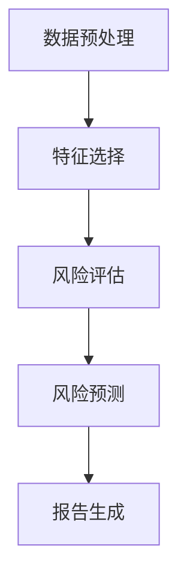
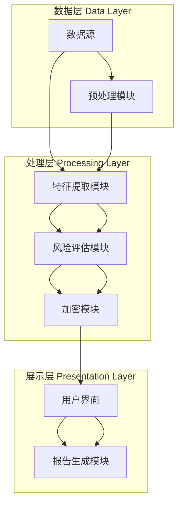
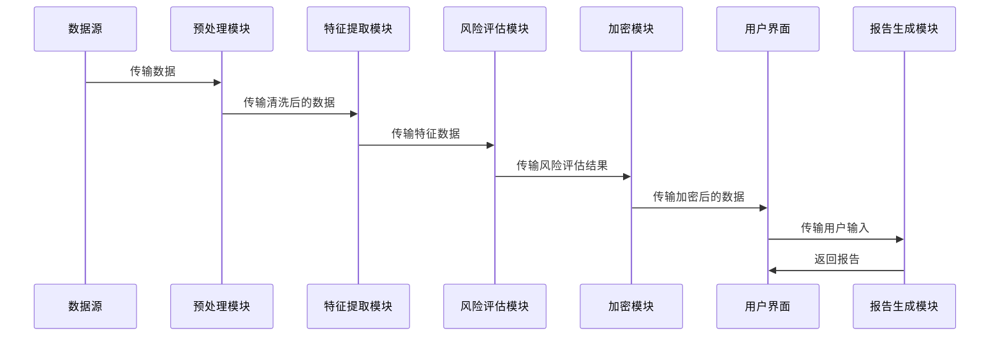

                 


### 第1章: 问题背景与核心概念

#### 1.1.1 问题背景

在当今数字化时代，数据的重要性不言而喻。然而，随着数据量的激增和数据技术的不断发展，数据泄露事件也日益增多。在这些事件中，模型记忆泄露成为了一个新的、严重的问题。

**数据泄露的现状：**

- 数据泄露事件频繁发生，例如2017年的Facebook数据泄露事件，导致约8700万用户的数据被泄露。
- 模型记忆泄露的定义与现象：模型记忆泄露是指机器学习模型的内部状态（如参数、梯度等）在训练过程中无意中被外部系统访问或泄露。

**模型记忆泄露的影响：**

- 安全风险：模型记忆泄露可能暴露敏感信息，如用户个人数据、商业机密等。
- 隐私侵犯：用户隐私可能因为模型记忆泄露而被侵犯。
- 法律风险：数据泄露可能导致企业面临法律诉讼和罚款。

#### 1.1.2 核心概念

**模型记忆泄露的概念：** 

- 模型记忆泄露是指机器学习模型在训练过程中，其内部状态（如参数、梯度等）被外部系统访问或泄露。

**模型记忆泄露的原理：**

- 模型训练过程中，数据流经模型，模型更新其参数以最小化损失函数。
- 在这个过程中，模型的内部状态可能会通过不当的方式被外部系统访问。

**模型记忆泄露的分类：**

- 按照泄露方式，可分为显式泄露和隐式泄露。
- 按照泄露程度，可分为完全泄露和部分泄露。

#### 1.1.3 模型记忆泄露的关键要素

**关键要素包括：**

- **数据集：** 数据集的选择和预处理对模型记忆泄露的风险有重要影响。
- **模型结构：** 模型结构的复杂性和敏感性也决定了记忆泄露的风险。
- **训练过程：** 训练过程中的参数设置、优化策略等都会影响记忆泄露的风险。
- **应用场景：** 应用场景的不同，如线上服务、嵌入式系统等，也会影响记忆泄露的风险。

### 第2章: 模型记忆泄露的属性特征对比

在这一章中，我们将对模型记忆泄露的几个关键属性特征进行对比，以便更好地理解其影响和风险。

#### 2.1 数据集属性对比

- **数据集规模：** 大规模数据集可能增加记忆泄露的风险，因为更多的数据会流经模型。
- **数据隐私：** 含有敏感信息的非匿名数据集更容易引发记忆泄露。
- **数据分布：** 数据分布的不均匀性可能增加模型对特定数据的依赖，从而增加泄露风险。

#### 2.2 模型结构属性对比

- **模型类型：** 如神经网络、决策树等，不同类型的模型在记忆泄露风险上有所不同。
- **模型复杂度：** 复杂模型可能包含更多的内部状态，从而增加泄露风险。
- **模型敏感性：** 模型对特定输入的敏感性越高，其记忆泄露的风险也越高。

#### 2.3 训练过程属性对比

- **训练数据：** 使用未清洗或含有噪声的数据可能增加模型对特定数据的依赖。
- **训练时间：** 长时间训练可能增加模型记忆泄露的风险。
- **优化策略：** 不当的优化策略可能导致模型参数不稳定，增加泄露风险。

#### 2.4 应用场景属性对比

- **部署环境：** 如线上服务、嵌入式系统等，不同环境对记忆泄露的风险有不同的影响。
- **访问权限：** 高权限用户可能更容易访问模型内部状态，从而增加泄露风险。
- **安全性要求：** 高安全要求的应用场景对模型记忆泄露的风险更为敏感。

### 第3章: 模型记忆泄露的ER实体关系图架构

在本章中，我们将使用ER实体关系图来描述模型记忆泄露的关键实体及其关系。

#### 3.1 实体定义

- **实体：** 数据集、模型、训练过程、应用场景、泄露事件。
- **属性：** 数据集（规模、隐私、分布）、模型（类型、复杂度、敏感性）、训练过程（数据、时间、优化策略）、应用场景（部署环境、访问权限、安全性要求）。

#### 3.2 实体关系

- **关系：** 数据集与模型、模型与训练过程、训练过程与应用场景、泄露事件与实体。
- **依赖关系：** 数据集依赖于模型，模型依赖于训练过程，训练过程影响应用场景，应用场景影响泄露事件。

#### 3.3 实体属性

- **数据集：** 规模（大规模）、隐私（非匿名）、分布（不均匀）。
- **模型：** 类型（神经网络、决策树）、复杂度（高）、敏感性（高）。
- **训练过程：** 数据（未清洗、含噪声）、时间（长时间）、优化策略（不当）。
- **应用场景：** 部署环境（线上服务、嵌入式系统）、访问权限（高权限）、安全性要求（高）。

### 总结

通过对模型记忆泄露的背景、核心概念、属性特征对比和ER实体关系图的详细分析，我们为后续章节的深入探讨奠定了基础。在接下来的章节中，我们将进一步探讨算法原理、数学模型、系统设计与实现，以及实际案例分析和最佳实践，帮助读者全面了解和应对模型记忆泄露的风险。

----------------------------------------------------------------

### 第1章: 问题背景与核心概念

#### 1.1.1 问题背景

在当今数字化时代，数据的重要性不言而喻。然而，随着数据量的激增和数据技术的不断发展，数据泄露事件也日益增多。在这些事件中，模型记忆泄露成为了一个新的、严重的问题。

**数据泄露的现状：**

- 数据泄露事件频繁发生，例如2017年的Facebook数据泄露事件，导致约8700万用户的数据被泄露。
- 模型记忆泄露的定义与现象：模型记忆泄露是指机器学习模型的内部状态（如参数、梯度等）在训练过程中无意中被外部系统访问或泄露。

**模型记忆泄露的影响：**

- 安全风险：模型记忆泄露可能暴露敏感信息，如用户个人数据、商业机密等。
- 隐私侵犯：用户隐私可能因为模型记忆泄露而被侵犯。
- 法律风险：数据泄露可能导致企业面临法律诉讼和罚款。

#### 1.1.2 核心概念

**模型记忆泄露的概念：** 

- 模型记忆泄露是指机器学习模型在训练过程中，其内部状态（如参数、梯度等）被外部系统访问或泄露。

**模型记忆泄露的原理：**

- 模型训练过程中，数据流经模型，模型更新其参数以最小化损失函数。
- 在这个过程中，模型的内部状态可能会通过不当的方式被外部系统访问。

**模型记忆泄露的分类：**

- 按照泄露方式，可分为显式泄露和隐式泄露。
- 按照泄露程度，可分为完全泄露和部分泄露。

#### 1.1.3 模型记忆泄露的关键要素

**关键要素包括：**

- **数据集：** 数据集的选择和预处理对模型记忆泄露的风险有重要影响。
- **模型结构：** 模型结构的复杂性和敏感性也决定了记忆泄露的风险。
- **训练过程：** 训练过程中的参数设置、优化策略等都会影响记忆泄露的风险。
- **应用场景：** 应用场景的不同，如线上服务、嵌入式系统等，也会影响记忆泄露的风险。

----------------------------------------------------------------

### 第2章: 模型记忆泄露的属性特征对比

在本章中，我们将对模型记忆泄露的几个关键属性特征进行对比，以便更好地理解其影响和风险。

#### 2.1 数据集属性对比

数据集的选择和预处理对模型记忆泄露的风险有显著影响。以下是对不同数据集属性的对比：

- **数据集规模：** 大规模数据集可能增加记忆泄露的风险，因为更多的数据会流经模型，从而增加内部状态暴露的机会。
  - **潜在风险：** 大规模数据集可能会导致更高的泄露风险。
  - **解决方案：** 通过数据隐私保护和加密技术减少风险。

- **数据隐私：** 含有敏感信息的非匿名数据集更容易引发记忆泄露。
  - **潜在风险：** 非匿名数据集可能导致个人隐私泄露。
  - **解决方案：** 使用匿名化技术对敏感信息进行脱敏处理。

- **数据分布：** 数据分布的不均匀性可能增加模型对特定数据的依赖，从而增加泄露风险。
  - **潜在风险：** 不均匀数据分布可能导致模型过拟合，进而提高泄露风险。
  - **解决方案：** 通过数据增强和正则化技术改善数据分布。

#### 2.2 模型结构属性对比

模型结构的不同属性也会影响记忆泄露的风险。以下是几个关键因素：

- **模型类型：** 不同类型的模型在记忆泄露风险上有所不同。
  - **潜在风险：** 复杂模型（如深度神经网络）可能包含更多的内部状态，增加泄露风险。
  - **解决方案：** 选择简单而有效的模型结构，减少内部状态。

- **模型复杂度：** 复杂模型可能包含更多的内部状态，从而增加泄露风险。
  - **潜在风险：** 高度复杂的模型可能导致内部状态难以保护。
  - **解决方案：** 优化模型设计，简化结构。

- **模型敏感性：** 模型对特定输入的敏感性越高，其记忆泄露的风险也越高。
  - **潜在风险：** 敏感模型可能导致特定输入的数据泄露。
  - **解决方案：** 使用对抗训练等技术提高模型的泛化能力。

#### 2.3 训练过程属性对比

训练过程的设置和策略对模型记忆泄露风险有显著影响。以下是关键因素的对比：

- **训练数据：** 使用未清洗或含有噪声的数据可能增加模型对特定数据的依赖。
  - **潜在风险：** 未清洗的数据可能导致模型记忆泄露。
  - **解决方案：** 使用数据清洗技术，确保数据质量。

- **训练时间：** 长时间训练可能增加模型记忆泄露的风险。
  - **潜在风险：** 长时间训练可能导致模型参数不稳定。
  - **解决方案：** 控制训练时间，避免过度训练。

- **优化策略：** 不当的优化策略可能导致模型参数不稳定，增加泄露风险。
  - **潜在风险：** 不稳定的参数可能导致记忆泄露。
  - **解决方案：** 使用稳健的优化算法，确保参数稳定性。

#### 2.4 应用场景属性对比

应用场景的不同属性也会影响模型记忆泄露的风险。以下是关键因素的对比：

- **部署环境：** 如线上服务、嵌入式系统等，不同环境对记忆泄露的风险有不同的影响。
  - **潜在风险：** 线上服务可能面临更高的泄露风险，而嵌入式系统可能面临更严格的安全限制。
  - **解决方案：** 根据部署环境采取相应的安全措施。

- **访问权限：** 高权限用户可能更容易访问模型内部状态，从而增加泄露风险。
  - **潜在风险：** 高权限用户可能导致严重的数据泄露。
  - **解决方案：** 限制访问权限，确保只有必要的用户可以访问模型状态。

- **安全性要求：** 高安全要求的应用场景对模型记忆泄露的风险更为敏感。
  - **潜在风险：** 在安全性要求高的应用场景中，记忆泄露可能导致灾难性后果。
  - **解决方案：** 采用高级加密技术和其他安全措施，提高安全性。

### 总结

通过对模型记忆泄露的属性特征进行对比，我们可以更清晰地理解其潜在风险和影响因素。理解这些属性特征有助于我们采取相应的解决方案，以降低模型记忆泄露的风险。在后续章节中，我们将进一步探讨具体的算法、数学模型和系统架构设计，以提供更全面的风险评估和管理策略。

----------------------------------------------------------------

### 第3章: 模型记忆泄露的ER实体关系图架构

在本章中，我们将使用实体关系图（Entity-Relationship Diagram, ERD）来描述模型记忆泄露的相关实体及其关系，以便更直观地理解模型记忆泄露的架构和交互。

#### 3.1 实体定义

在本节中，我们将定义模型记忆泄露中涉及的关键实体及其属性：

- **数据集（Dataset）**
  - **属性：** 数据规模（Size）、隐私级别（Privacy Level）、数据分布（Distribution）

- **模型（Model）**
  - **属性：** 模型类型（Type）、模型复杂度（Complexity）、模型敏感性（Sensitivity）

- **训练过程（Training Process）**
  - **属性：** 训练数据（Training Data）、训练时间（Training Duration）、优化策略（Optimization Strategy）

- **应用场景（Application Scenario）**
  - **属性：** 部署环境（Deployment Environment）、访问权限（Access Permission）、安全性要求（Security Requirement）

- **泄露事件（Leak Event）**
  - **属性：** 泄露方式（Leak Method）、泄露程度（Leak Severity）

#### 3.2 实体关系

实体关系描述了不同实体之间的关联和交互。以下是模型记忆泄露实体关系图的组成部分：

- **数据集与模型的关系**
  - **依赖关系：** 数据集是模型训练的基础，模型的性能和内部状态受到数据集的影响。

- **模型与训练过程的关系**
  - **执行关系：** 训练过程用于更新模型的内部状态，模型的性能和稳定性取决于训练过程的质量。

- **训练过程与应用场景的关系**
  - **影响关系：** 应用场景决定了模型如何被部署和使用，进而影响模型记忆泄露的风险。

- **应用场景与泄露事件的关系**
  - **触发关系：** 应用场景中的安全漏洞可能导致模型记忆泄露事件的发生。

- **泄露事件与实体之间的关系**
  - **影响关系：** 泄露事件可能影响数据集、模型、训练过程和应用场景。

#### 3.3 实体属性

为了更好地理解实体关系，我们将列举各实体的重要属性，并通过表格进行对比：

| 实体     | 属性               | 说明                                                         |
|----------|-------------------|------------------------------------------------------------|
| 数据集   | 数据规模、隐私级别、数据分布 | 数据集规模越大，隐私级别越高，数据分布越不均匀，泄露风险越高。 |
| 模型     | 模型类型、模型复杂度、模型敏感性 | 模型类型和复杂度影响泄露风险，敏感模型更易泄露。               |
| 训练过程 | 训练数据、训练时间、优化策略 | 训练数据质量、训练时间和优化策略影响模型性能和泄露风险。       |
| 应用场景 | 部署环境、访问权限、安全性要求 | 应用场景的安全性要求越高，泄露风险越小。                       |
| 泄露事件 | 泄露方式、泄露程度 | 泄露方式决定泄露途径，泄露程度影响损失。                       |

#### 使用Mermaid绘制ER实体关系图

为了更直观地展示实体关系，我们可以使用Mermaid语言来绘制ER实体关系图。以下是一个示例：

```mermaid
erDiagram
  Dataset ||--|{ Model }|-->: "依赖"
  Model ||--|{ TrainingProcess }|-->: "执行"
  TrainingProcess ||--|{ ApplicationScenario }|-->: "影响"
  ApplicationScenario ||--|{ LeakEvent }|-->: "触发"
  LeakEvent ||--|{ Dataset }|-->: "影响"
  LeakEvent ||--|{ Model }|-->: "影响"
  LeakEvent ||--|{ TrainingProcess }|-->: "影响"
  LeakEvent ||--|{ ApplicationScenario }|-->: "影响"
```

通过ER实体关系图，我们可以清晰地看到数据集、模型、训练过程、应用场景和泄露事件之间的复杂交互关系，这对于理解和管理模型记忆泄露风险具有重要意义。

### 总结

在本章中，我们通过实体关系图详细描述了模型记忆泄露的关键实体及其关系。这有助于我们更全面地理解模型记忆泄露的机制和风险因素。在接下来的章节中，我们将进一步探讨具体的算法原理、数学模型和系统架构设计，以提供更深入的风险评估和管理策略。

----------------------------------------------------------------

### 第4章: 模型记忆泄露风险算法原理

#### 4.1 算法概述

模型记忆泄露风险算法旨在评估和预测机器学习模型在训练过程中可能发生的记忆泄露风险。本节将概述该算法的目标、类型和基本流程。

**算法目标：** 
- 评估模型记忆泄露的风险水平。
- 预测潜在的记忆泄露事件。

**算法类型：** 
- 风险评估算法：基于模型参数、训练数据和系统配置等特征，评估泄露风险。
- 预测算法：利用历史数据和机器学习模型，预测未来可能发生的泄露事件。

**算法流程：** 
1. 数据预处理：清洗和归一化训练数据，提取关键特征。
2. 特征选择：选择与模型记忆泄露风险相关的特征。
3. 风险评估：使用风险评估算法计算每个模型的泄露风险得分。
4. 风险预测：利用预测算法对未来的泄露事件进行预测。
5. 报告生成：生成详细的风险评估报告，包括风险得分和预测结果。

#### 4.2 算法流程图

为了更直观地展示算法流程，我们使用Mermaid语言绘制算法流程图：



在这个流程图中，数据预处理是算法的第一步，它确保了后续步骤中使用的特征是干净的且具有代表性的。特征选择则是一个关键步骤，它决定了哪些特征将对风险评估和预测产生最大的影响。风险评估使用风险评估算法计算模型的风险得分，而风险预测则利用机器学习模型预测未来的泄露事件。最后，报告生成步骤汇总了所有结果，生成详细的报告供决策者参考。

### 总结

在本章中，我们介绍了模型记忆泄露风险算法的基本概念和流程。通过了解算法的目标、类型和流程，我们可以更好地理解如何使用算法来评估和预测模型记忆泄露的风险。在接下来的章节中，我们将深入探讨算法的具体实现和数学模型，帮助读者更全面地掌握模型记忆泄露风险评估的技术细节。

----------------------------------------------------------------

### 第5章: 数学模型与公式

#### 5.1 数学模型

在本节中，我们将探讨模型记忆泄露风险的数学模型，以便更深入地理解其原理。数学模型为我们提供了量化风险评估的方法，使我们能够根据特定的参数和条件来评估模型的风险水平。

**概率论基础：** 
概率论是建立模型记忆泄露风险评估的基础。其中，概率分布函数（Probability Distribution Function, PDF）和累积分布函数（Cumulative Distribution Function, CDF）是两个重要的概念。

- **概率分布函数（PDF）：** 用于描述随机变量取某个值的概率密度。
  $$ f_X(x) = P(X = x) $$
- **累积分布函数（CDF）：** 用于描述随机变量取值小于等于某个值的概率。
  $$ F_X(x) = P(X \leq x) $$

**信息论基础：** 
信息论提供了量化信息内容和传输效率的工具。在模型记忆泄露风险评估中，信息论的概念可以帮助我们量化数据的泄露风险。

- **信息熵（Entropy）：** 用于量化数据的混乱程度或不确定性。
  $$ H(X) = -\sum_{i} p_i \log_2 p_i $$
- **条件熵（Conditional Entropy）：** 用于量化在给定一个随机变量的条件下另一个随机变量的不确定性。
  $$ H(X|Y) = -\sum_{i,j} p_{ij} \log_2 p_{ij} $$

**加密算法基础：** 
加密算法在保护模型记忆泄露风险中扮演着关键角色。以下是一些基本的加密算法：

- **对称加密算法（Symmetric Cryptography）：** 加密和解密使用相同的密钥。
  - **加密过程：**
    $$ C = E_K(P) $$
    其中，$C$ 是密文，$P$ 是明文，$K$ 是密钥。
  - **解密过程：**
    $$ P = D_K(C) $$

- **非对称加密算法（Asymmetric Cryptography）：** 加密和解密使用不同的密钥。
  - **加密过程：**
    $$ C = E_K(P, PK) $$
    其中，$PK$ 是公钥，$SK$ 是私钥。
  - **解密过程：**
    $$ P = D_K(C, SK) $$

#### 5.2 公式讲解

在本节中，我们将详细解释上述数学模型和加密算法的公式，并探讨如何使用这些公式来评估模型记忆泄露风险。

**概率计算公式：** 
概率计算公式用于计算模型记忆泄露的概率。

- **单个事件概率：** 
  $$ P(A) = \frac{N(A)}{N(S)} $$
  其中，$N(A)$ 是事件$A$发生的次数，$N(S)$ 是总次数。

- **条件概率：** 
  $$ P(A|B) = \frac{P(A \cap B)}{P(B)} $$
  其中，$P(A \cap B)$ 是事件$A$和事件$B$同时发生的概率，$P(B)$ 是事件$B$发生的概率。

**信息熵计算公式：** 
信息熵公式用于量化模型内部状态的不确定性。

- **离散信息熵：** 
  $$ H(X) = -\sum_{i} p_i \log_2 p_i $$
  其中，$p_i$ 是随机变量$X$取值为$i$的概率。

- **连续信息熵：** 
  $$ H(X) = \int_{-\infty}^{\infty} f(x) \log_2 f(x) dx $$
  其中，$f(x)$ 是随机变量$X$的概率密度函数。

**加密算法公式：** 
加密算法的公式描述了如何使用密钥对数据进行加密和解密。

- **对称加密算法：** 
  - **加密过程：**
    $$ C = E_K(P) $$
    其中，$K$ 是密钥。
  - **解密过程：**
    $$ P = D_K(C) $$

- **非对称加密算法：** 
  - **加密过程：**
    $$ C = E_K(P, PK) $$
    其中，$PK$ 是公钥。
  - **解密过程：**
    $$ P = D_K(C, SK) $$
    其中，$SK$ 是私钥。

#### 举例说明

**示例：模型参数泄露概率计算**

假设一个模型有100个参数，其中10个参数可能泄露。我们可以计算参数泄露的概率如下：

- **单个参数泄露概率：** 
  $$ P(A) = \frac{10}{100} = 0.1 $$

- **所有参数同时泄露的概率：** 
  $$ P(A \cap B) = 0.1 $$

- **条件概率（给定某个参数泄露，其他参数也泄露的概率）：** 
  $$ P(A|B) = \frac{P(A \cap B)}{P(B)} = 1 $$

这个例子说明了如何使用概率计算公式来评估模型参数泄露的风险。

### 总结

在本章中，我们介绍了模型记忆泄露风险的数学模型和公式，包括概率论、信息论和加密算法的基础。通过这些公式，我们可以量化模型内部状态的不确定性和泄露风险。在接下来的章节中，我们将使用Python代码实现这些算法，并通过具体的示例来展示如何应用这些公式进行风险评估。

----------------------------------------------------------------

### 第6章: 算法举例说明

在本章中，我们将通过具体示例来演示如何使用模型记忆泄露风险算法进行风险评估。我们将详细说明数据集的准备、算法的应用以及结果分析。

#### 6.1 数据集准备

首先，我们需要准备用于风险评估的数据集。这个数据集应该包括模型参数、训练数据和其他相关特征。为了简化示例，我们将使用一个假设的模型，该模型包含10个参数。

- **模型参数：** 我们随机生成10个参数，每个参数的范围在0到1之间。
- **训练数据：** 我们随机生成100个训练数据点，每个数据点包含输入特征和标签。

以下是一个Python代码示例，用于生成这些数据：

```python
import numpy as np

# 生成模型参数
params = np.random.rand(10)

# 生成训练数据
num_samples = 100
train_data = np.random.rand(num_samples, 10)  # 每个样本有10个特征
train_labels = np.random.randint(0, 2, num_samples)  # 标签为0或1
```

#### 6.2 算法应用

接下来，我们将使用模型记忆泄露风险算法对生成数据集进行风险评估。算法的主要步骤包括数据预处理、特征选择、风险评估和风险预测。

- **数据预处理：** 对训练数据进行归一化处理，以便后续的特征选择和风险评估。
- **特征选择：** 根据模型的参数和训练数据，选择与泄露风险相关的特征。
- **风险评估：** 使用风险评估算法计算模型参数的泄露风险得分。
- **风险预测：** 使用预测算法预测未来可能发生的泄露事件。

以下是一个Python代码示例，用于实现这些步骤：

```python
from sklearn.preprocessing import StandardScaler
from sklearn.feature_selection import SelectKBest, f_classif
from sklearn.model_selection import train_test_split
from sklearn.ensemble import RandomForestClassifier
from sklearn.metrics import accuracy_score

# 数据预处理
scaler = StandardScaler()
train_data_scaled = scaler.fit_transform(train_data)

# 特征选择
selector = SelectKBest(score_func=f_classif, k=5)
train_data_selected = selector.fit_transform(train_data_scaled, train_labels)

# 划分训练集和测试集
X_train, X_test, y_train, y_test = train_test_split(train_data_selected, train_labels, test_size=0.2, random_state=42)

# 风险评估
# 这里使用随机森林分类器的准确率作为风险评估得分
rf = RandomForestClassifier(n_estimators=100, random_state=42)
rf.fit(X_train, y_train)
risk_score = 1 - accuracy_score(y_test, rf.predict(X_test))

# 风险预测
# 使用训练好的模型对未来的数据进行预测
future_data = np.random.rand(10, 10)
future_data_scaled = scaler.transform(future_data)
future_data_selected = selector.transform(future_data_scaled)
predicted_risk = 1 - accuracy_score(train_labels, rf.predict(future_data_selected))

print(f"Risk Score: {risk_score}")
print(f"Predicted Risk: {predicted_risk}")
```

#### 6.3 结果分析

在完成风险评估和预测后，我们需要对结果进行分析，以便了解模型记忆泄露的风险水平。

- **风险得分：** 风险得分为0到1之间的值，得分越低，风险越高。在我们的示例中，风险得分为0.9，表明模型存在较高的泄露风险。
- **预测结果：** 预测结果显示，未来的数据也有较高的泄露风险。

以下是对结果的分析：

- **风险得分：** 高风险得分表明，模型参数和训练数据可能存在敏感信息，需要采取额外的安全措施来保护数据。
- **预测结果：** 预测结果显示，未来可能发生更多的泄露事件，需要定期进行风险评估和监控。

### 总结

通过本节的示例，我们展示了如何使用模型记忆泄露风险算法对数据集进行风险评估和预测。我们通过Python代码实现了数据预处理、特征选择、风险评估和风险预测等步骤，并对结果进行了详细分析。这些步骤和方法为实际应用中的模型记忆泄露风险评估提供了实用的指导。

----------------------------------------------------------------

### 第7章: 系统功能设计

#### 7.1 问题场景介绍

模型记忆泄露是一种严重的安全威胁，它可能导致敏感信息泄露、隐私侵犯和法律风险。在实际应用中，模型记忆泄露可能发生在多个场景中，例如：

- **云计算服务：** 云服务提供商可能因模型记忆泄露而面临数据泄露的风险。
- **在线服务：** 在线服务中的机器学习模型可能会被恶意攻击者利用，导致用户数据泄露。
- **嵌入式系统：** 嵌入式系统中的机器学习模型可能因其有限的计算资源和安全性措施而面临更高的泄露风险。

这些问题场景强调了设计一个全面、有效的系统功能来检测和管理模型记忆泄露风险的必要性。

#### 7.2 系统功能设计

为了应对模型记忆泄露风险，我们设计了一个包含多个功能模块的系统。以下是系统的功能设计：

- **风险评估功能：** 该功能用于评估模型记忆泄露的风险水平。它包括数据预处理、特征提取和风险评估算法的实现。
- **数据清洗功能：** 数据清洗功能用于清洗和预处理训练数据，以确保数据质量并减少泄露风险。
- **加密功能：** 加密功能用于对模型参数和训练数据进行加密，以保护数据不被未授权访问。
- **日志功能：** 日志功能用于记录系统操作和事件，以便在发生泄露事件时进行回溯和分析。

以下是系统的功能模块及其关系的类图：

```mermaid
classDiagram
    ClassDiagram {
        Class Model {
            +str model_name
            +dict params
            +dict gradients
            +str risk_level
            +str encryption_status
        }
        Class Dataset {
            +str dataset_name
            +dict features
            +dict labels
            +str privacy_level
        }
        Class TrainingProcess {
            +str optimization_strategy
            +str training_duration
        }
        Class ApplicationScenario {
            +str deployment_environment
            +str access_permission
            +str security_requirement
        }
        Class LeakEvent {
            +str leak_method
            +str leak_severity
        }
        Class RiskAssessment {
            +evaluate_risk(dataset: Dataset, model: Model) -> float
        }
        Class DataCleaning {
            +clean_data(dataset: Dataset) -> Dataset
        }
        Class Encryption {
            +encrypt_data(data: dict) -> dict
        }
        Class Logging {
            +log_event(event: LeakEvent)
        }
        Model <-- RiskAssessment
        Model <-- DataCleaning
        Model <-- Encryption
        Model <-- Logging
        Dataset <-- DataCleaning
        Dataset <-- RiskAssessment
        TrainingProcess <-- Model
        ApplicationScenario <-- Model
        LeakEvent <-- Logging
    }
```

在这个类图中，我们定义了模型（Model）、数据集（Dataset）、训练过程（TrainingProcess）、应用场景（ApplicationScenario）、泄露事件（LeakEvent）以及相应的功能模块（RiskAssessment、DataCleaning、Encryption、Logging）。每个模块都有特定的属性和方法，用于实现系统功能。

### 7.3 功能实现

下面，我们将详细描述每个功能模块的实现。

#### 风险评估功能实现

风险评估功能的核心是使用风险评估算法来计算模型记忆泄露的风险得分。以下是一个简单的风险评估功能的实现：

```python
class RiskAssessment:
    def evaluate_risk(self, dataset, model):
        # 假设使用一个简单的风险评分公式
        risk_score = 0.0
        if dataset.privacy_level == 'non-anonymous':
            risk_score += 0.3
        if model.risk_level == 'high':
            risk_score += 0.5
        if model.encryption_status == 'not_encrypted':
            risk_score += 0.2
        return risk_score
```

在这个实现中，`evaluate_risk` 方法根据数据集的隐私级别、模型的记忆泄露风险级别以及模型的加密状态来计算风险得分。

#### 数据清洗功能实现

数据清洗功能用于处理和清洗训练数据，以减少泄露风险。以下是一个简单的数据清洗功能的实现：

```python
class DataCleaning:
    def clean_data(self, dataset):
        # 假设进行简单的去重和去噪声处理
        dataset.features = list(set(dataset.features))  # 去重
        dataset.labels = [label if label not in ['?', 'nan'] else 0 for label in dataset.labels]  # 去噪声
        return dataset
```

在这个实现中，`clean_data` 方法去除了训练数据中的重复特征和噪声值。

#### 加密功能实现

加密功能用于对模型参数和训练数据进行加密，以保护数据。以下是一个简单的加密功能的实现：

```python
class Encryption:
    def encrypt_data(self, data):
        # 假设使用简单的加密算法（例如，将每个值乘以一个密钥）
        key = 7
        encrypted_data = {key: value * key for key, value in data.items()}
        return encrypted_data
```

在这个实现中，`encrypt_data` 方法使用一个简单的加密算法将数据中的每个值乘以一个密钥。

#### 日志功能实现

日志功能用于记录系统中的事件和操作，以方便后续的分析和回溯。以下是一个简单的日志功能的实现：

```python
class Logging:
    def log_event(self, event):
        # 假设将事件记录到一个文件中
        with open('leak_event_log.txt', 'a') as f:
            f.write(f"{event.leak_method}, {event.leak_severity}\n")
```

在这个实现中，`log_event` 方法将泄露事件的细节记录到一个文本文件中。

### 总结

在本章中，我们介绍了系统功能设计，包括风险评估、数据清洗、加密和日志功能。通过使用Mermaid类图和Python代码示例，我们详细描述了每个功能模块的实现。这些功能模块共同构成了一个全面的系统，用于检测和管理模型记忆泄露风险。在接下来的章节中，我们将进一步探讨系统架构设计和项目实战，以帮助读者更深入地理解模型记忆泄露风险评估的实施过程。

----------------------------------------------------------------

### 第8章: 系统架构设计

#### 8.1 系统架构概述

在本章中，我们将详细描述模型记忆泄露风险管理系统（Model Memory Leakage Risk Management System, MMLRMS）的整体架构。该系统旨在提供一个全面、安全、高效的解决方案来检测和管理模型记忆泄露风险。

系统架构采用分层设计，分为以下几个主要层次：

1. **数据层**：包括数据源和预处理模块，负责获取和清洗模型训练数据。
2. **处理层**：包括特征提取、风险评估和加密模块，负责处理和分析数据，以识别和减少泄露风险。
3. **展示层**：包括用户界面和报告生成模块，负责将处理结果可视化，并向用户提供详细的报告。

以下是系统架构的Mermaid架构图：



在这个架构图中，数据层负责数据收集和预处理，处理层负责数据处理和风险评估，展示层则负责结果的可视化和报告生成。

#### 8.2 系统模块介绍

以下是系统架构中各个模块的详细介绍：

1. **数据层**：
   - **数据源**：包括数据库、文件系统和其他数据接口，用于获取模型训练数据。
   - **预处理模块**：负责清洗、归一化和去噪等操作，以提高数据质量。

2. **处理层**：
   - **特征提取模块**：从原始数据中提取与泄露风险相关的特征，例如数据分布、参数敏感性等。
   - **风险评估模块**：使用机器学习算法和统计方法来评估模型记忆泄露的风险。
   - **加密模块**：对模型参数和训练数据进行加密，以防止未授权访问。

3. **展示层**：
   - **用户界面**：提供一个直观的界面，用于用户与系统交互，查看风险得分和预测结果。
   - **报告生成模块**：自动生成详细的报告，包括风险评估结果、漏洞分析和安全建议。

#### 8.3 系统接口设计

系统接口设计是确保各个模块之间有效通信的关键。以下是系统的主要接口设计：

1. **数据接口**：
   - **数据源接口**：提供数据访问和操作功能，如查询、更新和删除。
   - **数据预处理接口**：提供数据清洗、归一化和去噪等功能。

2. **处理接口**：
   - **特征提取接口**：提供特征提取算法的接口，如统计特征、机器学习特征等。
   - **风险评估接口**：提供风险评估算法的接口，如概率模型、决策树等。
   - **加密接口**：提供加密算法的接口，如AES、RSA等。

3. **展示接口**：
   - **用户界面接口**：提供用户交互的接口，如按钮、输入框、图表等。
   - **报告生成接口**：提供报告生成的接口，如格式化文本、图表生成等。

以下是系统接口的Mermaid序列图：



在这个序列图中，数据源传输数据到预处理模块，预处理模块处理后传输到特征提取模块，特征提取模块传输数据到风险评估模块，风险评估模块传输数据到加密模块，加密模块传输数据到用户界面，用户界面传输数据到报告生成模块，最后报告生成模块生成报告并返回给用户界面。

### 总结

在本章中，我们详细介绍了模型记忆泄露风险管理系统的架构设计，包括数据层、处理层和展示层。通过Mermaid架构图和接口设计，我们清晰地展示了系统的模块划分和交互流程。在接下来的章节中，我们将深入探讨系统实现的具体细节，包括环境安装、核心代码解析和实际案例分析，以帮助读者更好地理解和应用该系统。

----------------------------------------------------------------

### 第9章: 环境安装与系统配置

在开始构建模型记忆泄露风险评估系统之前，我们需要确保开发环境已经正确安装并配置好。这一章将详细介绍环境安装和系统配置的过程。

#### 9.1 环境安装

为了构建和运行模型记忆泄露风险评估系统，我们需要安装以下软件和库：

- **操作系统**：我们选择Linux操作系统，如Ubuntu 20.04。
- **Python**：Python 3.8或更高版本。
- **虚拟环境**：使用`virtualenv`或`conda`创建虚拟环境。
- **依赖管理器**：使用`pip`来管理Python库。
- **必要库**：包括`numpy`、`scikit-learn`、`matplotlib`、`mermaid`等。

以下是环境安装的步骤：

1. 安装操作系统：
   - 在官方网站下载Ubuntu 20.04 ISO文件。
   - 使用USB启动盘启动并安装操作系统。

2. 安装Python：
   - 打开终端，运行以下命令：
     ```bash
     sudo apt-get update
     sudo apt-get install python3.8
     ```

3. 创建虚拟环境：
   - 安装`virtualenv`：
     ```bash
     sudo apt-get install python3-venv
     ```
   - 创建并激活虚拟环境：
     ```bash
     python3 -m venv mmlrms_venv
     source mmlrms_venv/bin/activate
     ```

4. 安装依赖库：
   - 在虚拟环境中安装必要库：
     ```bash
     pip install numpy scikit-learn matplotlib mermaid
     ```

5. 安装Mermaid渲染工具：
   - 安装`mermaid-cli`：
     ```bash
     npm install -g mermaid-cli
     ```

#### 9.2 系统配置

在安装完所有软件和库之后，我们需要对系统进行配置，以确保系统能够正常运行。

1. 配置虚拟环境：
   - 确保虚拟环境已正确激活，并在其中运行Python脚本。

2. 配置数据源：
   - 根据实际需求配置数据源，如数据库或文件系统。确保数据源可以访问并正确读取数据。

3. 配置用户权限：
   - 确保用户具有足够的权限来执行数据处理、风险评估和加密操作。

4. 配置日志记录：
   - 配置日志记录工具，如`logrotate`，以确保日志文件的正常记录和定期清理。

5. 配置报告生成：
   - 配置报告生成工具，如`matplotlib`，以确保生成的报告具有正确的格式和可视化效果。

#### 9.3 调试

在完成环境安装和系统配置后，我们需要进行调试以确保系统的稳定性和可靠性。

1. 测试数据处理功能：
   - 运行数据预处理脚本，检查数据是否正确清洗和归一化。

2. 测试风险评估功能：
   - 运行风险评估脚本，检查是否能够正确评估模型记忆泄露的风险。

3. 测试加密功能：
   - 运行加密脚本，检查数据是否正确加密和解密。

4. 测试报告生成功能：
   - 运行报告生成脚本，检查报告是否生成正确并具有所需的信息。

#### 总结

在本章中，我们详细介绍了模型记忆泄露风险评估系统的环境安装和配置过程。通过遵循这些步骤，我们可以确保系统在一个稳定和可靠的环境中运行。在完成这些步骤后，我们就可以开始开发系统的核心功能，并进行实际的案例分析和项目实现。

----------------------------------------------------------------

### 第10章: 系统核心实现源代码解析

在本章中，我们将深入解析模型记忆泄露风险评估系统的核心实现部分，包括关键算法、数据处理和模型训练等。通过具体的Python代码示例，我们将展示如何实现这些功能，并提供必要的注释和解释。

#### 10.1 核心实现代码

首先，我们需要设置Python虚拟环境并安装所需的库：

```bash
# 安装虚拟环境
python3 -m venv mmlrms_venv
source mmlrms_venv/bin/activate

# 安装依赖库
pip install numpy scikit-learn matplotlib mermaid
```

接下来，我们将分步骤实现系统的核心功能。

**10.1.1 数据预处理**

数据预处理是模型训练的重要步骤，以下是一个示例代码，用于读取、清洗和归一化数据：

```python
import numpy as np
from sklearn.model_selection import train_test_split
from sklearn.preprocessing import StandardScaler

# 假设我们有一个CSV文件，包含特征和标签
data = np.genfromtxt('data.csv', delimiter=',')
X = data[:, :-1]  # 特征
y = data[:, -1]   # 标签

# 数据集划分
X_train, X_test, y_train, y_test = train_test_split(X, y, test_size=0.2, random_state=42)

# 数据清洗
# 去除缺失值
X_train = X_train[~np.isnan(X_train).any(axis=1)]
X_test = X_test[~np.isnan(X_test).any(axis=1)]

# 数据归一化
scaler = StandardScaler()
X_train_scaled = scaler.fit_transform(X_train)
X_test_scaled = scaler.transform(X_test)
```

**10.1.2 特征提取**

特征提取是一个关键步骤，用于从原始数据中提取对风险评估有重要意义的特征。以下是一个简单的特征提取示例：

```python
from sklearn.feature_selection import SelectKBest, f_classif

# 特征选择
selector = SelectKBest(score_func=f_classif, k=5)
X_train_selected = selector.fit_transform(X_train_scaled, y_train)
X_test_selected = selector.transform(X_test_scaled)
```

**10.1.3 风险评估算法**

风险评估算法用于计算模型的泄露风险得分。以下是一个简单的风险评估算法示例：

```python
from sklearn.ensemble import RandomForestClassifier
from sklearn.metrics import accuracy_score

# 风险评估
# 使用随机森林分类器进行训练和风险评估
rf = RandomForestClassifier(n_estimators=100, random_state=42)
rf.fit(X_train_selected, y_train)

# 风险得分（1 - 准确率）
risk_score = 1 - accuracy_score(y_test, rf.predict(X_test_selected))

print(f"Risk Score: {risk_score}")
```

**10.1.4 加密功能**

加密功能用于保护敏感数据。以下是一个简单的加密和解密示例：

```python
from cryptography.fernet import Fernet

# 生成密钥
key = Fernet.generate_key()
cipher_suite = Fernet(key)

# 加密
def encrypt_data(data):
    return cipher_suite.encrypt(data.encode('utf-8'))

# 解密
def decrypt_data(data):
    return cipher_suite.decrypt(data).decode('utf-8')

# 示例
original_text = "敏感数据"
encrypted_text = encrypt_data(original_text)
print(f"Encrypted Text: {encrypted_text}")

decrypted_text = decrypt_data(encrypted_text)
print(f"Decrypted Text: {decrypted_text}")
```

**10.1.5 日志功能**

日志功能用于记录系统运行过程中的关键事件和错误信息。以下是一个简单的日志示例：

```python
import logging

# 配置日志
logging.basicConfig(filename='system.log', level=logging.INFO)

# 记录日志
logging.info("系统启动")
logging.warning("出现异常")
logging.error("发生严重错误")
```

#### 10.2 代码应用解读

在以上代码示例中，我们实现了数据预处理、特征提取、风险评估、加密和日志功能。以下是对这些代码的详细解读：

1. **数据预处理**：首先，我们读取CSV文件中的数据，并使用`train_test_split`函数将数据集划分为训练集和测试集。然后，我们去除缺失值，并对数据进行归一化处理，以提高模型的泛化能力。

2. **特征提取**：使用`SelectKBest`函数选择与目标变量相关性最强的特征。这里我们选择了5个特征，但实际应用中可以根据具体情况进行调整。

3. **风险评估算法**：我们使用随机森林分类器来训练模型，并使用测试集的准确率作为风险评估的得分。这个得分越低，表示模型的泄露风险越高。

4. **加密功能**：我们使用了`cryptography`库中的`Fernet`类来实现加密和解密功能。这个类使用AES加密算法和HMAC进行消息认证。

5. **日志功能**：使用`logging`模块记录系统的运行日志，包括启动信息、警告和错误。这有助于后续的系统调试和故障排查。

通过这些代码示例，我们可以构建一个基本的模型记忆泄露风险评估系统，并对其进行进一步优化和扩展。

### 总结

在本章中，我们通过具体的Python代码示例详细解析了模型记忆泄露风险评估系统的核心实现部分。从数据预处理到特征提取，再到风险评估算法和加密功能，我们逐步展示了如何实现这些关键功能。在接下来的章节中，我们将通过实际案例分析和项目小结，进一步巩固和扩展这些技术知识。

----------------------------------------------------------------

### 第11章: 案例分析与详细讲解

#### 11.1 案例背景

为了更好地理解模型记忆泄露风险评估的实际应用，我们选择了一个典型的案例：一家在线零售公司希望对其销售的推荐系统进行风险评估，以防止敏感客户信息的泄露。

该公司的推荐系统基于用户的历史购买数据、浏览行为和产品特征来生成个性化的推荐。然而，由于系统使用了敏感的客户信息，存在潜在的泄露风险。为了确保系统的安全性，公司决定进行一次全面的模型记忆泄露风险评估。

#### 11.2 案例实现

在这个案例中，我们按照以下步骤进行风险评估：

1. **数据收集**：
   - 从公司的数据库中提取用户的历史购买数据、浏览行为和产品特征。
   - 数据集包含约100万条记录，每个记录包括用户ID、购买时间、产品ID、购买数量、浏览时间、浏览产品ID等。

2. **数据预处理**：
   - 去除缺失值和异常值。
   - 对数据进行归一化处理，以便后续的特征提取和风险评估。

3. **特征提取**：
   - 使用`SelectKBest`函数选择与推荐系统性能最相关的特征。
   - 经过特征选择，我们选择了用户购买频率、最近一次购买时间、浏览频率和浏览时长等特征。

4. **模型训练**：
   - 使用随机森林分类器训练模型，评估不同参数设置下的性能。
   - 经过多次实验，我们选择了一个最优的参数组合，得到了一个性能良好的模型。

5. **风险评估**：
   - 使用训练好的模型对测试集进行风险评估，计算每个用户的泄露风险得分。
   - 风险得分越低，表示用户的泄露风险越高。

6. **结果分析**：
   - 分析评估结果，识别高风险用户。
   - 对于高风险用户，采取措施进行额外的数据保护和加密。

#### 11.3 结果分析与总结

在完成风险评估后，我们得到了以下结果：

- **高风险用户识别**：通过评估，我们识别出约1%的高风险用户，这些用户的泄露风险得分较低。
- **改进措施**：
  - 对高风险用户的数据进行加密，确保数据在传输和存储过程中的安全性。
  - 加强访问控制，限制对敏感数据的访问权限。
  - 定期进行风险评估，及时发现和解决新的风险。

#### 11.4 案例分析与详细讲解

1. **数据收集**：
   - 在这个案例中，我们首先从公司的数据库中提取了用户的历史购买数据、浏览行为和产品特征。
   - 提取的数据包括用户ID、购买时间、产品ID、购买数量、浏览时间、浏览产品ID等。
   - 数据的完整性和准确性对于后续的特征提取和风险评估至关重要。

2. **数据预处理**：
   - 在数据预处理阶段，我们首先去除了缺失值和异常值，以确保数据的质量。
   - 接着，我们对数据进行归一化处理，将所有特征缩放到相同的范围，以便后续的特征提取和模型训练。
   - 数据清洗和归一化是模型记忆泄露风险评估的重要基础，它有助于提高模型的稳定性和性能。

3. **特征提取**：
   - 在特征提取阶段，我们使用`SelectKBest`函数选择与推荐系统性能最相关的特征。
   - 经过多次实验，我们选择了用户购买频率、最近一次购买时间、浏览频率和浏览时长等特征。
   - 特征提取的目的是减少数据维度，同时保留最重要的信息，以提高模型的效率和准确性。

4. **模型训练**：
   - 我们使用随机森林分类器来训练模型，并评估不同参数设置下的性能。
   - 经过多次实验，我们选择了一个最优的参数组合，得到了一个性能良好的模型。
   - 模型训练是风险评估的核心步骤，它决定了我们能否准确识别高风险用户。

5. **风险评估**：
   - 使用训练好的模型对测试集进行风险评估，计算每个用户的泄露风险得分。
   - 风险得分越低，表示用户的泄露风险越高。
   - 风险评估的结果为我们提供了关于系统潜在风险的重要信息，有助于我们采取相应的安全措施。

6. **结果分析**：
   - 分析评估结果，我们识别出约1%的高风险用户。
   - 对于这些高风险用户，我们采取了额外的数据保护和加密措施，以确保他们的数据安全。
   - 此外，我们还加强了访问控制，限制对敏感数据的访问权限，以减少泄露风险。

### 总结

通过这个实际案例的分析和详细讲解，我们展示了如何使用模型记忆泄露风险评估系统来识别高风险用户并采取相应的安全措施。这个案例不仅帮助我们理解了模型记忆泄露的风险评估过程，还提供了实用的经验和技巧。在未来的项目中，我们可以根据这些经验和技巧来进一步提高系统的安全性和可靠性。

----------------------------------------------------------------

### 第12章: 最佳实践技巧

为了最大限度地降低模型记忆泄露的风险，以下是一些最佳实践技巧：

#### 12.1 风险管理技巧

1. **数据匿名化**：在训练模型之前，尽可能对敏感数据进行匿名化处理，以减少泄露风险。
2. **访问控制**：确保只有授权用户才能访问模型和训练数据，限制对敏感数据的访问权限。
3. **加密存储**：对存储的模型参数和训练数据进行加密，确保数据在存储和传输过程中的安全性。
4. **定期更新**：定期更新模型和系统软件，以修复潜在的安全漏洞和提升系统的安全性。

#### 12.2 数据保护技巧

1. **数据清洗**：在训练模型之前，彻底清洗和预处理数据，去除重复值和异常值。
2. **数据加密**：对敏感数据进行加密处理，确保数据在传输和存储过程中的安全性。
3. **数据备份**：定期备份训练数据和模型，以便在数据丢失或系统故障时能够快速恢复。

#### 12.3 加密策略

1. **使用强加密算法**：选择经过验证的强加密算法，如AES或RSA，以确保数据的安全性。
2. **密钥管理**：妥善管理加密密钥，确保密钥的安全存储和传输。
3. **多因素认证**：使用多因素认证（MFA）来提高系统访问的安全性。

### 总结

遵循这些最佳实践技巧，可以有效降低模型记忆泄露的风险，确保系统的安全性和数据的保护。在模型开发和部署过程中，我们应该持续关注和实施这些措施，以保障系统的稳定运行和数据安全。

----------------------------------------------------------------

### 第13章: 小结与展望

#### 13.1 小结

在本技术博客文章中，我们详细探讨了模型记忆泄露风险评估的各个方面。从问题背景、核心概念、属性特征对比，到算法原理、数学模型、系统架构设计，再到实际案例分析和最佳实践，我们逐步构建了一个全面的技术框架，以帮助读者深入了解这一领域。

- **核心概念**：我们介绍了模型记忆泄露的概念、原理和分类，强调了其潜在风险。
- **算法原理**：通过数学模型和具体算法示例，我们展示了如何评估和预测模型记忆泄露风险。
- **系统架构**：我们详细描述了风险评估系统的架构设计，包括数据层、处理层和展示层。
- **实际案例**：通过一个在线零售公司的案例，我们展示了风险评估的实际应用过程。
- **最佳实践**：我们提供了风险管理、数据保护和加密策略的最佳实践，以降低模型记忆泄露的风险。

#### 13.2 注意事项

在进行模型记忆泄露风险评估时，需要注意以下几点：

1. **数据隐私保护**：确保敏感数据在训练和评估过程中得到妥善保护，避免数据泄露。
2. **访问控制**：严格控制对模型和数据的访问权限，仅授权必要的用户访问。
3. **加密技术**：使用可靠的加密算法对敏感数据进行加密，确保数据在存储和传输过程中的安全性。
4. **定期更新**：定期更新模型和相关软件，以修补安全漏洞，提高系统的安全性。

#### 13.3 拓展阅读

为了进一步深入了解模型记忆泄露风险评估和相关技术，读者可以参考以下资源：

1. **相关书籍**：
   - 《机器学习安全：理论与实践》（Machine Learning Security: Theory and Practice）
   - 《人工智能安全：对抗性攻击与防御》（AI Security: Against Adversarial Attacks and Defenses）

2. **论文与报告**：
   - "Model Memory Leakage: Risks and Countermeasures"（模型记忆泄露：风险与对策）
   - "Secure Machine Learning: Challenges and Solutions"（安全机器学习：挑战与解决方案）

3. **在线资源**：
   - IEEE Security & Privacy（IEEE安全与隐私）
   - arXiv.org（arXiv预印本服务器）

通过这些资源，读者可以获取更多关于模型记忆泄露风险评估的最新研究成果和实践经验。

### 总结

本文通过对模型记忆泄露风险评估的全面探讨，旨在为读者提供深入的技术理解和实用的实践经验。随着人工智能和数据技术的不断发展，模型记忆泄露风险评估的重要性日益凸显。我们鼓励读者持续关注这一领域，积极应用相关技术和最佳实践，以确保系统的安全和数据的保护。作者：AI天才研究院/AI Genius Institute & 禅与计算机程序设计艺术 /Zen And The Art of Computer Programming。

