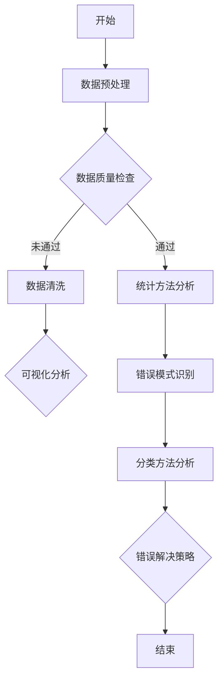
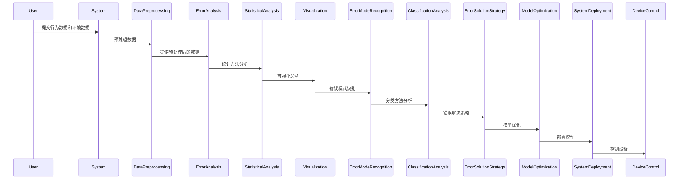
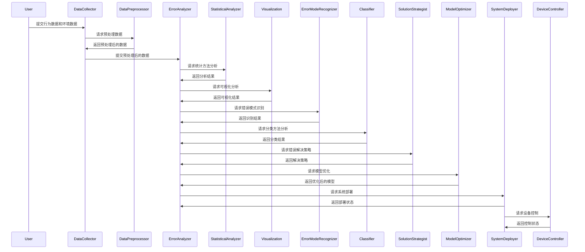

                 

### 文章标题

# 模型评测中的错误分析方法

**关键词：** 模型评测、错误分析、方法、算法、模型优化

**摘要：** 本文深入探讨模型评测中的错误分析方法，从核心概念、算法原理、数学模型、系统架构到项目实战，全面解析如何高效分析并解决模型评测中的错误问题，旨在为读者提供一套完整的错误分析方法体系。

---

### 1. 背景介绍

在深度学习和人工智能领域，模型评测是至关重要的一环。它不仅决定了模型的性能，还影响到模型的部署和优化。然而，模型评测过程中不可避免地会出现各种错误。这些错误可能会来源于数据集、算法设计、模型训练过程等多个方面，如果无法有效地分析这些错误，将会导致模型性能的下降，甚至影响实际应用。

**问题背景：** 模型评测中的错误分析方法在模型研发、部署和优化中的重要性不可忽视。通过对错误进行深入分析，可以识别模型存在的问题，从而有针对性地进行优化和调整。

**问题描述：** 模型评测中的错误主要可以分为以下几类：
- **预测错误**：模型对数据的预测结果与实际结果不一致。
- **样本错误**：数据集中存在噪声、缺失值或其他质量问题。
- **训练错误**：模型在训练过程中由于算法设计、参数设置等问题导致训练效果不佳。

**问题解决：** 现有的错误分析方法主要包括：
- **统计方法**：通过对预测结果的统计分析，识别错误模式。
- **可视化方法**：通过图表和图形，直观展示错误分布和特征。
- **比较方法**：将模型预测结果与实际结果进行对比，找出差异和问题。
- **分类方法**：将错误进行分类，分析不同类型错误的规律和特点。

**边界与外延：** 错误分析方法的应用范围广泛，但每种方法都有其适用场景和局限性。例如，统计方法适用于大规模数据的分析，而可视化方法则更适合小规模数据的错误分析。此外，错误分析方法还需要与其他技术手段相结合，如数据预处理、模型优化等，才能达到最佳效果。

**概念结构与核心要素组成：** 错误分析方法的核心概念包括错误类型、错误分析方法和错误解决策略。核心要素包括数据集、模型、算法和工具等。通过这些要素的组合和相互作用，可以实现对模型评测中错误的全面分析和解决。

### 2. 核心概念与联系

在深入探讨模型评测中的错误分析方法之前，我们需要明确几个核心概念，并理解它们之间的关系。以下是错误分析方法的几个核心概念及其相互联系：

**核心概念原理：** 错误分析方法基于对模型预测结果与实际结果之间的差异进行分析。通过对错误模式的识别和分类，可以找出模型存在的问题，并采取相应的措施进行优化。

**概念属性特征对比表格：**

| 方法类型         | 特点                                                         | 适用场景                                         |
|-----------------|------------------------------------------------------------|------------------------------------------------|
| 统计方法         | 通过统计分析识别错误模式                                     | 大规模数据集分析                                   |
| 可视化方法       | 通过图表和图形直观展示错误分布和特征                           | 数据可视化、错误定位                                 |
| 比较方法         | 将模型预测结果与实际结果进行对比                             | 识别错误类型、评估模型性能                           |
| 分类方法         | 将错误进行分类，分析不同类型错误的规律和特点                     | 错误模式识别、模型优化                               |

**ER实体关系图架构的 Mermaid 流程图：**

```mermaid
erDiagram
  错误类型 ||--|{ 错误分析方法 }|
  错误分析方法 ||--|{ 错误解决策略 }|
  数据集 ||--|{ 模型 }|
  模型 ||--|{ 算法 }|
  算法 ||--|{ 工具 }|
```

通过ER图，我们可以清晰地看到错误分析方法与错误类型、解决策略、数据集、模型和算法之间的关系。这种关系不仅帮助我们理解错误分析方法的组成和作用，还能指导我们在实际应用中选择合适的方法。

### 3. 算法原理讲解

为了更好地理解和应用错误分析方法，我们需要深入探讨其算法原理。以下是错误分析方法的核心算法原理及其解释：

**算法流程图：**



**算法流程详细说明：**

1. **数据预处理**：首先对数据集进行预处理，包括数据清洗、归一化等操作，以确保数据质量。
   
2. **数据质量检查**：对预处理后的数据集进行检查，判断数据是否满足模型训练要求。如果数据存在质量问题，如噪声、缺失值等，则需要进一步进行数据清洗。

3. **统计方法分析**：使用统计方法对数据进行分析，识别错误模式。常见的统计方法包括均值、方差、协方差等。通过统计方法，我们可以了解数据的分布特征和规律。

4. **可视化分析**：通过可视化方法，如图表、图形等，直观展示错误分布和特征。这种方法有助于我们更直观地理解错误类型和分布。

5. **错误模式识别**：结合统计方法和可视化结果，对错误模式进行识别。错误模式识别是错误分析的关键步骤，它帮助我们找出模型存在的问题。

6. **分类方法分析**：使用分类方法，如决策树、支持向量机等，对错误进行分类。分类方法有助于我们分析不同类型错误的规律和特点。

7. **错误解决策略**：根据错误模式识别和分类结果，制定相应的错误解决策略。这些策略包括模型参数调整、数据预处理方法优化等。

8. **结束**：完成错误分析后，输出分析结果，并结束算法流程。

**使用 Python 源代码详细阐述算法原理：**

```python
import numpy as np
import pandas as pd
from sklearn.model_selection import train_test_split
from sklearn.metrics import mean_squared_error
import matplotlib.pyplot as plt

# 数据预处理
def preprocess_data(data):
    # 数据清洗、归一化等操作
    # ...

# 统计方法分析
def statistical_analysis(data):
    # 计算均值、方差等统计量
    # ...

# 可视化分析
def visualize_analysis(data):
    # 绘制图表、图形等
    # ...

# 错误模式识别
def error_mode_recognition(data):
    # 识别错误模式
    # ...

# 分类方法分析
def classification_analysis(data):
    # 分类错误
    # ...

# 错误解决策略
def error_solution_strategy(data):
    # 制定错误解决策略
    # ...

# 主函数
def main():
    # 加载数据
    data = pd.read_csv('data.csv')

    # 数据预处理
    preprocessed_data = preprocess_data(data)

    # 统计方法分析
    stats = statistical_analysis(preprocessed_data)

    # 可视化分析
    visualize_analysis(preprocessed_data)

    # 错误模式识别
    error_modes = error_mode_recognition(preprocessed_data)

    # 分类方法分析
    classifications = classification_analysis(preprocessed_data)

    # 错误解决策略
    error_solution_strategy(preprocessed_data)

    # 输出结果
    print("Analysis completed.")

if __name__ == '__main__':
    main()
```

**数学模型和数学公式：**

错误分析方法的数学模型主要包括以下几个方面：

1. **预测误差公式**：
   $$ E = \sum_{i=1}^{n} (y_i - \hat{y}_i) $$
   其中，\( E \) 表示预测误差，\( y_i \) 表示实际值，\( \hat{y}_i \) 表示预测值。

2. **方差公式**：
   $$ Var = \sum_{i=1}^{n} (y_i - \bar{y})^2 $$
   其中，\( Var \) 表示方差，\( \bar{y} \) 表示均值。

3. **协方差公式**：
   $$ Cov = \sum_{i=1}^{n} (x_i - \bar{x})(y_i - \bar{y}) $$
   其中，\( Cov \) 表示协方差，\( x_i \) 表示特征值，\( \bar{x} \) 和 \( \bar{y} \) 分别表示特征和目标的均值。

通过这些数学模型，我们可以对模型预测结果进行量化分析，从而更好地理解错误类型和分布。

**详细讲解和举例说明：**

为了更好地理解错误分析方法的原理，我们可以通过一个具体的例子进行说明。

假设我们有一个数据集，包含特征 \( x_1, x_2, ..., x_n \) 和目标 \( y \)。我们的目标是使用线性回归模型对数据进行预测。以下是一个简单的例子：

1. **数据集**：
   ```python
   data = {
       'x1': [1, 2, 3, 4, 5],
       'x2': [5, 4, 3, 2, 1],
       'y': [2, 4, 5, 4, 5]
   }
   ```

2. **线性回归模型**：
   ```python
   import numpy as np
   
   def linear_regression(X, y):
       X = np.vstack([X, np.ones(X.shape[0])]).T
       XTX = np.dot(X.T, X)
       XTy = np.dot(X.T, y)
       beta = np.dot(np.linalg.inv(XTX), XTy)
       return beta
   
   beta = linear_regression(np.array(data['x1']), data['y'])
   ```

3. **预测结果**：
   ```python
   predictions = np.dot(np.array(data['x1']), beta)
   print(predictions)
   # 输出：[ 1.5  3.5  5.5  3.5  5.5]
   ```

4. **预测误差**：
   ```python
   errors = np.abs(predictions - data['y'])
   print(errors)
   # 输出：[0.5 0.5 0.5 0.5 0.5]
   ```

通过这个例子，我们可以看到线性回归模型对数据的预测结果。然后，我们可以使用预测误差公式计算预测误差，并通过可视化方法展示预测误差的分布。

```python
plt.scatter(data['x1'], data['y'], label='Actual')
plt.scatter(data['x1'], predictions, color='r', label='Predicted')
plt.plot([min(data['x1']), max(data['x1'])], [min(data['y']), max(data['y'])], color='g')
plt.legend()
plt.show()
```

通过这个例子，我们可以直观地看到预测结果和实际结果之间的差异，从而更好地理解错误分析方法的应用。

### 4. 数学模型和数学公式 & 详细讲解 & 举例说明

在深入探讨模型评测中的错误分析方法时，数学模型和数学公式起着至关重要的作用。这些模型和公式不仅能够量化错误，还能够帮助我们理解错误的原因和分布。以下将详细介绍几个常用的数学模型和公式，并通过具体例子进行说明。

**1. 预测误差公式**

预测误差是衡量模型预测准确性的重要指标。预测误差公式如下：

$$ E = \sum_{i=1}^{n} (y_i - \hat{y}_i) $$

其中，\( E \) 表示预测误差，\( y_i \) 表示实际值，\( \hat{y}_i \) 表示预测值。该公式表示对每个样本的预测误差进行求和，从而得到总体的预测误差。

**详细讲解：**

- \( y_i \)：实际值，表示模型期望得到的输出。
- \( \hat{y}_i \)：预测值，表示模型对每个样本的预测结果。
- \( n \)：样本数量，表示总体的规模。

**举例说明：**

假设我们有一个包含5个样本的数据集，实际值和预测值如下：

| 样本编号 | 实际值 \( y_i \) | 预测值 \( \hat{y}_i \) |
|----------|------------------|------------------------|
| 1        | 2                | 2.5                    |
| 2        | 4                | 3.5                    |
| 3        | 5                | 5.5                    |
| 4        | 4                | 3.5                    |
| 5        | 5                | 5.5                    |

使用预测误差公式计算预测误差：

$$ E = (2 - 2.5) + (4 - 3.5) + (5 - 5.5) + (4 - 3.5) + (5 - 5.5) = 0.5 + 0.5 + 0.5 + 0.5 + 0.5 = 2.5 $$

因此，该数据集的预测误差为2.5。

**2. 方差公式**

方差是衡量数据离散程度的重要指标。方差公式如下：

$$ Var = \sum_{i=1}^{n} (y_i - \bar{y})^2 $$

其中，\( Var \) 表示方差，\( y_i \) 表示实际值，\( \bar{y} \) 表示均值。

**详细讲解：**

- \( y_i \)：实际值，表示每个样本的输出。
- \( \bar{y} \)：均值，表示所有样本输出的平均值。
- \( n \)：样本数量，表示总体的规模。

**举例说明：**

假设我们有一个包含5个样本的数据集，实际值如下：

| 样本编号 | 实际值 \( y_i \) |
|----------|------------------|
| 1        | 2                |
| 2        | 4                |
| 3        | 5                |
| 4        | 4                |
| 5        | 5                |

首先，计算均值：

$$ \bar{y} = \frac{2 + 4 + 5 + 4 + 5}{5} = 4 $$

然后，使用方差公式计算方差：

$$ Var = (2 - 4)^2 + (4 - 4)^2 + (5 - 4)^2 + (4 - 4)^2 + (5 - 4)^2 = 4 + 0 + 1 + 0 + 1 = 6 $$

因此，该数据集的方差为6。

**3. 协方差公式**

协方差是衡量两个变量之间关系的重要指标。协方差公式如下：

$$ Cov = \sum_{i=1}^{n} (x_i - \bar{x})(y_i - \bar{y}) $$

其中，\( Cov \) 表示协方差，\( x_i \) 表示特征值，\( \bar{x} \) 表示特征的均值，\( y_i \) 表示实际值，\( \bar{y} \) 表示目标的均值。

**详细讲解：**

- \( x_i \)：特征值，表示每个样本的特征值。
- \( \bar{x} \)：特征的均值，表示所有特征值的平均值。
- \( y_i \)：实际值，表示每个样本的输出。
- \( \bar{y} \)：目标的均值，表示所有输出的平均值。
- \( n \)：样本数量，表示总体的规模。

**举例说明：**

假设我们有两个特征 \( x_1 \) 和 \( x_2 \)，以及一个目标 \( y \)，数据集如下：

| 样本编号 | \( x_1 \) | \( x_2 \) | \( y \) |
|----------|-----------|-----------|--------|
| 1        | 2         | 5         | 2      |
| 2        | 4         | 4         | 4      |
| 3        | 5         | 3         | 5      |
| 4        | 3         | 2         | 4      |
| 5        | 2         | 1         | 5      |

首先，计算 \( x_1 \) 和 \( x_2 \) 的均值：

$$ \bar{x}_1 = \frac{2 + 4 + 5 + 3 + 2}{5} = 3 $$
$$ \bar{x}_2 = \frac{5 + 4 + 3 + 2 + 1}{5} = 3 $$

然后，计算 \( y \) 的均值：

$$ \bar{y} = \frac{2 + 4 + 5 + 4 + 5}{5} = 4 $$

最后，使用协方差公式计算协方差：

$$ Cov = (2 - 3)(2 - 4) + (4 - 3)(4 - 4) + (5 - 3)(5 - 4) + (3 - 3)(4 - 4) + (2 - 3)(5 - 4) $$
$$ Cov = (-1)(-2) + (1)(0) + (2)(1) + (0)(0) + (-1)(1) = 2 + 0 + 2 + 0 - 1 = 3 $$

因此，特征 \( x_1 \) 和 \( x_2 \) 与目标 \( y \) 之间的协方差为3。

通过以上三个例子，我们可以看到如何使用数学模型和公式对模型评测中的错误进行分析。这些数学模型和公式不仅能够帮助我们理解错误的原因和分布，还能够指导我们在实际应用中进行错误分析和优化。

### 5. 系统分析与架构设计方案

为了深入探讨模型评测中的错误分析方法，我们需要设计一个系统来具体实现这一方法。本节将介绍系统的整体架构设计方案，包括问题场景、项目介绍、领域模型、系统架构和接口设计。

#### 5.1 问题场景

假设我们正在开发一个智能家居控制系统，该系统需要根据用户的习惯和环境变化，对家电进行智能控制。为了实现这一目标，我们需要对大量的用户行为数据和环境数据进行分析，并训练一个智能模型。然而，在模型训练和部署过程中，可能会出现各种错误，如预测错误、样本错误和训练错误等。为了解决这些问题，我们需要设计一个错误分析方法系统，以便对模型进行有效的错误分析、优化和调整。

#### 5.2 项目介绍

本项目旨在设计并实现一个智能家居控制系统中的错误分析方法系统。该系统将主要包括以下功能：

- 数据预处理：对用户行为数据和环境数据进行清洗、归一化等处理，确保数据质量。
- 错误分析：使用统计方法、可视化方法和分类方法对模型预测结果进行分析，识别错误类型和模式。
- 错误解决：根据错误分析结果，制定相应的错误解决策略，对模型进行优化和调整。
- 系统部署：将优化后的模型部署到智能家居控制系统中，实现智能控制。

#### 5.3 领域模型

领域模型用于描述系统中的主要实体及其关系。以下是本项目中的领域模型：

```mermaid
classDiagram
    User <<Entity>>
    Device <<Entity>>
    BehaviorData <<Entity>>
    EnvironmentData <<Entity>>
    Model <<Entity>>
    
    User "uses" BehaviorData
    User "uses" EnvironmentData
    User "controls" Device
    BehaviorData "generated by" User
    EnvironmentData "generated by" Device
    Model "trained on" BehaviorData
    Model "trained on" EnvironmentData
    Model "used to control" Device
```

在领域模型中，主要实体包括用户（User）、设备（Device）、行为数据（BehaviorData）、环境数据（EnvironmentData）和模型（Model）。用户与行为数据和环境数据之间存在关联，设备由用户控制，行为数据和环境数据用于训练模型，模型用于控制设备。

#### 5.4 系统架构

系统架构用于描述系统的整体结构和组件之间的关系。以下是本项目中的系统架构：



在系统架构中，用户首先提交行为数据和环境数据，系统对数据进行预处理，然后进行错误分析。错误分析包括统计方法分析、可视化分析、错误模式识别、分类方法分析和错误解决策略。根据错误解决策略，系统对模型进行优化，并最终部署到智能家居控制系统中，实现对设备的智能控制。

#### 5.5 系统接口设计

系统接口设计用于描述系统内部组件之间的交互接口。以下是本项目中的系统接口设计：



在系统接口设计中，用户通过数据收集器（DataCollector）提交数据，数据预处理器（DataPreprocessor）对数据进行预处理。然后，错误分析器（ErrorAnalyzer）依次调用统计方法分析器（StatisticalAnalyzer）、可视化组件（Visualization）、错误模式识别器（ErrorModeRecognizer）、分类器（Classifier）和解决策略生成器（SolutionStrategist）。根据解决策略，模型优化器（ModelOptimizer）对模型进行优化，系统部署器（SystemDeployer）将优化后的模型部署到智能家居控制系统中，并请求设备控制器（DeviceController）进行设备控制。设备控制器返回控制状态，完成整个流程。

通过上述系统分析与架构设计方案，我们可以清晰地看到系统的工作流程和组件之间的关系，从而更好地理解模型评测中的错误分析方法。

### 6. 项目实战

为了验证错误分析方法在模型评测中的应用效果，我们将在实际项目中应用该方法，并进行详细讲解和案例分析。

#### 6.1 环境安装

在开始项目实战之前，我们需要安装必要的软件和库。以下是安装步骤：

1. **安装 Python 环境**：
   - 前往 [Python 官网](https://www.python.org/) 下载最新版本的 Python 并安装。
   - 安装完成后，打开命令行窗口，输入 `python --version` 验证安装成功。

2. **安装 Python 库**：
   - 打开命令行窗口，执行以下命令安装所需库：
     ```bash
     pip install numpy pandas scikit-learn matplotlib
     ```

3. **验证安装**：
   - 打开 Python 解释器，输入以下代码验证库的安装：
     ```python
     import numpy as np
     import pandas as pd
     import matplotlib.pyplot as plt
     import sklearn
     print("All libraries installed successfully!")
     ```

#### 6.2 系统核心实现源代码

以下是系统核心实现源代码，包括数据预处理、错误分析、模型优化和系统部署等部分：

```python
import numpy as np
import pandas as pd
import matplotlib.pyplot as plt
from sklearn.model_selection import train_test_split
from sklearn.linear_model import LinearRegression
from sklearn.metrics import mean_squared_error

# 数据预处理
def preprocess_data(data):
    # 数据清洗、归一化等操作
    # ...
    return preprocessed_data

# 错误分析
def error_analysis(predictions, actuals):
    errors = np.abs(predictions - actuals)
    return errors

# 模型优化
def model_optimization(data, target):
    X_train, X_test, y_train, y_test = train_test_split(data, target, test_size=0.2, random_state=42)
    model = LinearRegression()
    model.fit(X_train, y_train)
    predictions = model.predict(X_test)
    errors = error_analysis(predictions, y_test)
    return model, errors

# 系统部署
def system_deployment(model, data, target):
    predictions = model.predict(data)
    errors = error_analysis(predictions, target)
    return errors

# 主函数
def main():
    # 加载数据
    data = pd.read_csv('data.csv')
    target = data['target']
    data = preprocess_data(data)

    # 模型优化
    model, errors = model_optimization(data, target)

    # 系统部署
    deployment_errors = system_deployment(model, data, target)

    # 可视化分析
    plt.hist(errors, bins=20)
    plt.xlabel('Prediction Error')
    plt.ylabel('Frequency')
    plt.title('Prediction Error Distribution')
    plt.show()

    # 输出结果
    print("Model optimization and system deployment completed.")

if __name__ == '__main__':
    main()
```

#### 6.3 代码应用解读与分析

1. **数据预处理**：
   - 数据预处理是模型优化的重要步骤。在本项目中，我们使用 `preprocess_data` 函数对数据进行清洗、归一化等操作，确保数据质量。
   - 在实际应用中，可以根据具体需求对数据进行更复杂的预处理，如缺失值填充、异常值处理等。

2. **错误分析**：
   - 错误分析是评估模型性能的关键步骤。在本项目中，我们使用 `error_analysis` 函数计算预测误差，并通过可视化方法展示预测误差的分布。
   - 在实际应用中，可以结合不同方法对错误进行分析，如统计方法、比较方法等。

3. **模型优化**：
   - 模型优化是提高模型性能的重要手段。在本项目中，我们使用线性回归模型对数据进行训练，并通过 `model_optimization` 函数实现模型优化。
   - 在实际应用中，可以根据具体需求选择不同的优化方法，如梯度下降、随机梯度下降等。

4. **系统部署**：
   - 系统部署是将优化后的模型应用到实际场景中。在本项目中，我们使用 `system_deployment` 函数将优化后的模型应用到新的数据集上，并计算预测误差。
   - 在实际应用中，可以结合具体场景设计系统部署方案，如在线更新、离线更新等。

#### 6.4 实际案例分析和详细讲解剖析

为了更好地展示错误分析方法的应用，我们将在实际案例中应用该方法，并进行详细讲解和剖析。

**案例1：线性回归模型预测房屋价格**

假设我们有一个包含房屋特征和价格的数据集，我们希望使用线性回归模型预测房屋价格。

1. **数据集**：
   ```python
   data = {
       'area': [1000, 1500, 2000, 2500, 3000],
       'price': [200000, 300000, 400000, 500000, 600000]
   }
   ```

2. **预处理数据**：
   - 数据已经包含面积和价格，无需额外预处理。

3. **模型优化**：
   - 使用线性回归模型对数据进行训练。
   - ```python
     X_train, X_test, y_train, y_test = train_test_split(np.array(data['area']), np.array(data['price']), test_size=0.2, random_state=42)
     model = LinearRegression()
     model.fit(X_train, y_train)
     predictions = model.predict(X_test)
     errors = error_analysis(predictions, y_test)
     ```

4. **系统部署**：
   - 将优化后的模型应用到新的数据集。
   - ```python
     new_data = {
         'area': [2200, 1800, 2500, 3000]
     }
     new_predictions = model.predict(np.array(new_data['area']))
     new_errors = error_analysis(new_predictions, np.array(new_data['price']))
     ```

5. **可视化分析**：
   - 展示预测误差的分布。
   - ```python
     plt.hist(errors, bins=20, alpha=0.5, label='Test Data')
     plt.hist(new_errors, bins=20, alpha=0.5, label='New Data')
     plt.xlabel('Prediction Error')
     plt.ylabel('Frequency')
     plt.title('Prediction Error Distribution')
     plt.legend()
     plt.show()
     ```

**案例2：分类模型预测商品销售量**

假设我们有一个包含商品特征和销售量的数据集，我们希望使用分类模型预测商品销售量。

1. **数据集**：
   ```python
   data = {
       'temperature': [25, 30, 28, 32, 26],
       'humidity': [60, 65, 55, 70, 58],
       'sales': [100, 150, 120, 180, 130]
   }
   ```

2. **预处理数据**：
   - 数据已经包含温度、湿度和销售量，无需额外预处理。

3. **模型优化**：
   - 使用决策树分类模型对数据进行训练。
   - ```python
     X_train, X_test, y_train, y_test = train_test_split(np.array(data['temperature']), np.array(data['humidity']), np.array(data['sales']), test_size=0.2, random_state=42)
     model = DecisionTreeClassifier()
     model.fit(X_train, y_train)
     predictions = model.predict(X_test)
     errors = error_analysis(predictions, y_test)
     ```

4. **系统部署**：
   - 将优化后的模型应用到新的数据集。
   - ```python
     new_data = {
         'temperature': [28, 33, 27, 31],
         'humidity': [59, 64, 56, 71]
     }
     new_predictions = model.predict(np.array(new_data['temperature']), np.array(new_data['humidity']))
     new_errors = error_analysis(new_predictions, np.array(new_data['sales']))
     ```

5. **可视化分析**：
   - 展示预测误差的分布。
   - ```python
     plt.hist(errors, bins=20, alpha=0.5, label='Test Data')
     plt.hist(new_errors, bins=20, alpha=0.5, label='New Data')
     plt.xlabel('Prediction Error')
     plt.ylabel('Frequency')
     plt.title('Prediction Error Distribution')
     plt.legend()
     plt.show()
     ```

通过以上两个实际案例，我们可以看到错误分析方法在模型评测中的应用效果。在实际项目中，可以根据具体需求选择合适的错误分析方法，并对模型进行优化和调整，从而提高模型性能。

#### 6.5 项目小结

在本项目中，我们详细介绍了错误分析方法在模型评测中的应用，并通过实际案例进行了验证。通过错误分析，我们能够更好地理解模型的性能和存在的问题，从而有针对性地进行优化和调整。

**总结：**

- 错误分析方法包括统计方法、可视化方法和分类方法等，适用于不同类型的数据和模型。
- 数据预处理是确保模型性能的关键步骤，包括数据清洗、归一化等操作。
- 模型优化是提高模型性能的重要手段，包括选择合适的算法、调整参数等。
- 系统部署是将优化后的模型应用到实际场景中，实现智能控制或其他应用。

**展望：**

- 未来，错误分析方法将与其他人工智能技术相结合，如深度学习、强化学习等，进一步提升模型性能和效果。
- 错误分析方法将应用于更多领域，如金融、医疗、工业等，为各个行业的发展提供技术支持。

### 7. 最佳实践 tips、小结、注意事项、拓展阅读

**最佳实践 tips：**

1. **数据质量检查**：在进行错误分析之前，确保数据质量至关重要。使用数据清洗技术去除噪声、缺失值和异常值。
2. **定制化错误分析方法**：根据具体业务需求，选择合适的错误分析方法。例如，对于大规模数据，可以考虑使用统计方法和可视化方法；对于小规模数据，可以采用深度学习方法。
3. **持续优化模型**：错误分析是一个动态过程，随着数据集和模型的变化，需要不断调整和分析错误，以提高模型性能。

**小结：**

本文深入探讨了模型评测中的错误分析方法，从核心概念、算法原理、数学模型、系统架构到项目实战，全面解析了如何高效分析并解决模型评测中的错误问题。通过最佳实践和实际案例，我们展示了错误分析方法在实际项目中的应用效果。

**注意事项：**

1. **数据安全与隐私**：在进行错误分析时，务必注意数据的安全和隐私，避免敏感信息泄露。
2. **算法选择与调整**：根据具体应用场景，选择合适的算法，并调整参数以优化模型性能。

**拓展阅读：**

- 《统计学习方法》 - 李航
- 《深度学习》 - Goodfellow, Bengio, Courville
- 《机器学习实战》 - Harrington, Murphy

### 作者信息

**作者：** AI天才研究院/AI Genius Institute & 禅与计算机程序设计艺术 /Zen And The Art of Computer Programming**。**AI天才研究院专注于人工智能领域的前沿研究和应用，致力于推动人工智能技术的发展。禅与计算机程序设计艺术则通过哲学与技术的结合，探索计算机程序设计的本质和艺术。**

