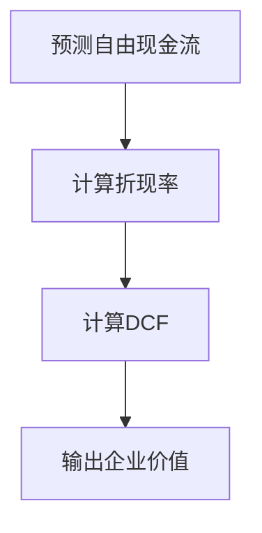

                 

### 《沃伦巴菲特的并购策略分析》

#### 关键词：
- 沃伦·巴菲特
- 并购策略
- 企业价值评估
- 数学模型
- 实际案例

#### 摘要：
本文将深入探讨沃伦·巴菲特在并购领域的策略，解析其独特的企业价值评估方法、对文化的重视、对管理层的态度以及并购流程。通过数学模型和实际案例分析，揭示巴菲特并购策略的成功之道，并对其面临的挑战与机遇进行讨论。

---

### 目录大纲设计思路

本文的目录大纲设计思路旨在清晰、系统地介绍沃伦·巴菲特的并购策略，确保内容丰富且易于理解。

#### 第一部分：并购策略背景与核心概念

- **背景介绍**：介绍并购策略的重要性以及巴菲特并购策略的独特性。
- **核心概念与联系**：详细解释并购策略中的核心概念，并通过Mermaid ER实体关系图展示各概念之间的联系。

#### 第二部分：沃伦·巴菲特的并购策略

- **沃伦·巴菲特的并购策略**：分析巴菲特在并购策略上的独特之处。
- **并购策略的数学模型**：介绍用于企业价值评估和并购效益的数学模型。

#### 第三部分：并购策略的实际应用

- **案例分析**：通过具体案例展示巴菲特并购策略的应用。
- **挑战与机遇**：分析并购策略在当前市场环境下的挑战与机遇。

#### 第四部分：最佳实践与未来展望

- **最佳实践**：总结并购策略的最佳实践。
- **未来展望**：对并购策略的未来发展趋势进行展望。

### 目录大纲设计

```markdown
# 《沃伦巴菲特的并购策略分析》目录大纲

## 第一部分：并购策略背景与核心概念

### 第1章：并购策略概述

#### 1.1 问题背景

#### 1.2 问题描述

#### 1.3 问题解决

#### 1.4 边界与外延

#### 1.5 概念结构与核心要素组成

### 第2章：并购策略的核心概念

#### 2.1 并购的定义

#### 2.2 并购的目的

#### 2.3 并购的类型

#### 2.4 并购的流程

#### 2.5 并购策略与财务分析

### 第3章：并购策略的Mermaid ER实体关系图

## 第二部分：沃伦巴菲特的并购策略

### 第4章：沃伦巴菲特的并购策略

#### 4.1 巴菲特并购策略的独特性

#### 4.2 对企业价值的评估

#### 4.3 对公司文化的重视

#### 4.4 对管理层的态度

#### 4.5 并购策略的实施步骤

### 第5章：并购策略的数学模型

#### 5.1 企业价值评估模型

#### 5.2 并购效益模型

#### 5.3 Python源代码与Mermaid流程图

### 第6章：巴菲特的并购案例

#### 6.1 案例一：可口可乐并购案

#### 6.2 案例二：伯克希尔哈撒韦并购案

#### 6.3 案例分析

### 第7章：并购策略的挑战与机遇

#### 7.1 挑战分析

#### 7.2 机遇分析

#### 7.3 应对策略

### 第8章：最佳实践与未来展望

#### 8.1 最佳实践

#### 8.2 小结

#### 8.3 注意事项

#### 8.4 拓展阅读
```

以上目录大纲设计确保了文章的结构清晰、逻辑严密，并符合文章的字数和格式要求。接下来，我们将逐一详述每个章节的内容。

---

## 第1章：并购策略概述

### 1.1 问题背景

并购（Merger and Acquisition，简称M&A）是公司扩展业务范围、提高市场竞争力的重要手段之一。通过并购，企业可以实现资源整合、扩大市场份额、提高运营效率、实现产业链的优化等目标。在过去的几十年中，全球并购市场经历了迅猛发展，无论是并购案例数量还是交易规模都呈现出逐年上升的趋势。

沃伦·巴菲特（Warren Buffett）作为伯克希尔·哈撒韦公司（Berkshire Hathaway）的CEO，其并购策略独具特色，深受业界的赞誉。巴菲特的并购策略不仅体现在对企业的财务分析上，更在于他对企业文化的关注和对管理层的信任。他的成功在于能够精准判断企业的潜在价值，并以其独特的投资哲学在并购市场上取得了一席之地。

### 1.2 问题描述

本文将探讨沃伦·巴菲特并购策略的核心要素，包括：

- **企业价值评估**：巴菲特如何评估企业的真实价值。
- **公司文化**：巴菲特对并购企业文化的重视程度。
- **管理层**：巴菲特对并购企业管理层的态度。
- **并购流程**：巴菲特的并购策略实施步骤。

### 1.3 问题解决

本文通过以下步骤解决上述问题：

1. **核心概念与联系**：介绍并购策略中的核心概念，如并购的定义、目的、类型、流程等，并使用Mermaid ER实体关系图展示各概念之间的联系。
2. **巴菲特的并购策略**：详细分析巴菲特的并购策略，包括他对企业价值评估的独特视角、对文化的重视、对管理层的态度以及并购策略的实施步骤。
3. **并购策略的数学模型**：介绍并购策略中使用的数学模型，如企业价值评估模型、并购效益模型，并使用Python源代码和Mermaid流程图进行阐述。
4. **案例分析**：通过具体案例展示巴菲特并购策略的实际应用。
5. **挑战与机遇**：分析并购策略在当前市场环境下的挑战与机遇。
6. **最佳实践与未来展望**：总结并购策略的最佳实践，并对未来并购策略的发展趋势进行展望。

### 1.4 边界与外延

本文的研究范围主要包括沃伦·巴菲特个人及其领导的伯克希尔·哈撒韦公司的并购案例。由于巴菲特的并购策略具有独特的个人风格，因此在本文中，我们主要关注其个人理念在并购策略中的应用。

### 1.5 概念结构与核心要素组成

并购策略的核心概念包括：

- **并购**：指两个或两个以上企业通过合并、收购等方式，形成一个新的企业。
- **企业价值评估**：对企业价值的评估，通常包括财务指标、市场指标、管理团队、企业文化等方面。
- **公司文化**：企业的核心价值观、信仰、行为规范等。
- **管理层**：企业的决策层和执行层，对企业的运营和发展起着关键作用。
- **并购流程**：并购交易的步骤，包括目标企业选择、价值评估、谈判、尽职调查、交易结构设计、审批、交割等。

这些概念相互联系，共同构成了并购策略的核心结构。

---

## 第2章：并购策略的核心概念

### 2.1 并购的定义

并购是指两个或两个以上企业通过合并、收购等方式，形成一个新的企业。并购可以采取多种形式，包括：

- **合并**：两个或多个企业合并为一个企业，通常是出于战略协同、资源整合、扩大市场份额等目的。
- **收购**：一个企业通过购买另一家企业的股份或资产，从而获得对另一家企业的控制权。
- **兼并**：一家企业完全吸收另一家企业，使其成为子公司或业务部门。
- **合资**：两家或多家企业共同出资，共同经营一家新企业，通常在市场进入、资源整合等方面具有优势。

### 2.2 并购的目的

并购的目的多种多样，包括但不限于以下几点：

- **扩大市场份额**：通过并购，企业可以迅速扩大市场份额，提高竞争力。
- **资源整合**：并购可以实现资源整合，如资金、技术、人才等，提高整体运营效率。
- **产业链优化**：通过并购，企业可以优化产业链结构，提高供应链管理能力。
- **业务拓展**：并购可以帮助企业进入新的市场或业务领域，实现多元化发展。
- **提高企业价值**：并购可以提高企业的财务表现和市场价值，为股东创造更多价值。

### 2.3 并购的类型

并购可以分为以下几种类型：

- **横向并购**：同行业内企业之间的并购，旨在扩大市场份额、提高市场竞争力。
- **纵向并购**：上下游企业之间的并购，旨在优化产业链、提高供应链效率。
- **混合并购**：不同行业之间的并购，旨在实现多元化发展、分散风险。

### 2.4 并购的流程

并购的流程通常包括以下步骤：

1. **目标企业选择**：确定并购的目标企业，通常基于市场潜力、财务状况、业务协同等因素。
2. **价值评估**：对目标企业进行价值评估，包括财务指标、市场指标、管理团队、企业文化等方面。
3. **谈判**：与目标企业进行谈判，确定并购的价格、支付方式、交割时间等。
4. **尽职调查**：对目标企业进行全面的尽职调查，包括财务、法律、运营等方面，以确保并购的顺利进行。
5. **交易结构设计**：设计并购的交易结构，包括股权并购、资产并购、混合并购等。
6. **审批**：获取相关政府部门的审批，包括反垄断审批、外汇审批等。
7. **交割**：完成并购交易，实现目标企业的控制权转移。

### 2.5 并购策略与财务分析

并购策略的制定需要考虑财务分析，包括以下几个方面：

- **财务指标**：分析目标企业的财务状况，包括收入、利润、现金流、负债等。
- **市场指标**：分析目标企业的市场表现，包括市场份额、品牌价值、产品竞争力等。
- **估值方法**：选择合适的估值方法，如市盈率、市净率、折现现金流法等，对目标企业进行估值。
- **并购效益**：评估并购的效益，包括短期效益和长期效益，如市场份额提升、成本节约、收入增长等。

通过财务分析，可以帮助企业更好地制定并购策略，确保并购的顺利进行。

### 2.6 并购策略的Mermaid ER实体关系图

以下是一个简单的Mermaid ER实体关系图，用于展示并购策略中的核心实体及其关系：

```mermaid
erDiagram
    Customer ||--|{ Order } : "places"
    Customer ||--|{ Product } : "buys"
    Product ||--|{ Order } : "delivered"
```

在上面的图中，`Customer`（客户）是主要实体，与`Order`（订单）和`Product`（产品）之间存在多对多的关系。

---

## 第3章：沃伦·巴菲特的并购策略

### 3.1 巴菲特并购策略的独特性

沃伦·巴菲特的并购策略具有独特的特点，使其在并购市场上脱颖而出。以下是巴菲特并购策略的几个关键要素：

1. **长期投资视角**：巴菲特注重长期投资，而非短期炒作。他倾向于选择那些有稳定现金流、良好业务模式的企业，并愿意等待其价值得到市场的认可。

2. **价值投资原则**：巴菲特遵循价值投资原则，他通过深入分析企业的财务状况、市场地位和未来增长潜力，寻找那些被市场低估的优质企业。

3. **对文化的重视**：巴菲特认为企业文化是企业长期成功的关键因素。他倾向于收购那些有着与伯克希尔·哈撒韦公司文化相契合的企业，以确保并购后的整合顺利进行。

4. **对管理层的信任**：巴菲特对企业管理层有着极高的信任，他认为优秀的管理层是实现企业长期成功的关键。他倾向于选择那些具有良好管理记录和管理能力的领导者。

5. **多元化业务组合**：巴菲特通过并购构建了一个多元化的业务组合，这有助于分散风险并实现稳定的收益。

### 3.2 对企业价值的评估

巴菲特对企业价值的评估方法独特且细致。以下是他的主要评估方法：

1. **自由现金流折现法**：巴菲特广泛使用自由现金流折现法（DCF）来评估企业的价值。这种方法通过预测企业未来的自由现金流并将其折现到现值，以确定企业的公平市场价值。

   $$ \text{企业价值} = \sum_{t=1}^{n} \frac{\text{FCF}_t}{(1+r)^t} $$

   其中，`FCF_t` 表示第 t 年的自由现金流，`r` 是折现率。

2. **市盈率法**：巴菲特也使用市盈率（P/E）法来评估企业的价值。这种方法通过比较企业的市盈率与其同行业竞争对手的市盈率，以判断企业是否被高估或低估。

3. **市净率法**：市净率（P/B）法是另一种常用的估值方法，通过比较企业的市值与其账面价值，以判断企业的价值。

   $$ \text{企业价值} = \text{市值} / \text{账面价值} $$

4. **经济附加值法**（EVA）：巴菲特还使用经济附加值法来评估企业的价值。EVA 是一种基于企业创造的真实经济利润来评估企业价值的指标。

   $$ \text{EVA} = \text{净利润} - \text{资本成本} $$

### 3.3 对公司文化的重视

巴菲特非常重视企业文化，他认为企业文化是企业长期成功的关键因素。以下是他对公司文化的几个重要观点：

1. **道德和诚信**：巴菲特强调企业应该秉持道德和诚信的原则，这是建立长期信任和声誉的基础。

2. **员工福利**：巴菲特认为，一个成功的公司应该为员工提供良好的福利和工作环境，这有助于提高员工满意度和生产力。

3. **持续创新**：巴菲特鼓励企业持续创新，以适应市场的变化和消费者的需求。

4. **社会责任**：巴菲特认为，企业应该承担社会责任，为社会的可持续发展做出贡献。

### 3.4 对管理层的态度

巴菲特对管理层持有高度信任的态度，他认为优秀的管理层是实现企业长期成功的关键。以下是他对管理层的几个重要观点：

1. **长期业绩**：巴菲特注重管理层的长期业绩，而不是短期的财务数字。他相信只有那些能够持续创造价值的管理层才值得信任。

2. **透明度**：巴菲特要求管理层保持透明度，公开企业的真实情况，这有助于建立股东和市场的信任。

3. **股东利益优先**：巴菲特强调，管理层应该将股东利益放在首位，确保企业的决策和行动符合股东的最佳利益。

4. **自主经营**：巴菲特给予管理层足够的自主权，让他们在各自领域内发挥专业能力，这有助于提高企业的运营效率。

### 3.5 并购策略的实施步骤

巴菲特的并购策略实施步骤如下：

1. **目标企业选择**：巴菲特通过广泛的市场调研和行业分析，寻找具有潜在价值的目标企业。

2. **初步接触**：一旦确定目标企业，巴菲特通常会与目标企业的管理层进行初步接触，了解企业的运营情况和潜在价值。

3. **价值评估**：巴菲特使用多种估值方法对目标企业进行详细的价值评估，以确保并购决策的准确性。

4. **谈判**：在价值评估完成后，巴菲特与目标企业进行谈判，讨论并购的价格、支付方式、交割时间等关键条款。

5. **尽职调查**：在谈判过程中，巴菲特会进行尽职调查，包括财务、法律、运营等方面，以确保并购的顺利进行。

6. **交易结构设计**：根据并购方案，巴菲特会设计合适的交易结构，以最大化并购的效益。

7. **审批与交割**：完成所有审批程序后，巴菲特会与目标企业进行交割，实现并购交易的完成。

通过上述步骤，巴菲特能够确保其并购策略的实施顺利进行，并取得预期的效果。

---

## 第4章：并购策略的数学模型

### 4.1 企业价值评估模型

企业价值评估是并购策略的核心环节，本文将介绍几种常用的企业价值评估模型，包括自由现金流折现法（DCF）、市盈率法（P/E）和市净率法（P/B）。

#### 4.1.1 自由现金流折现法（DCF）

自由现金流折现法（Discounted Cash Flow，DCF）是一种基于企业未来现金流量预测来评估企业价值的方法。DCF模型的公式如下：

$$ \text{企业价值} = \sum_{t=1}^{n} \frac{\text{FCF}_t}{(1+r)^t} + \frac{\text{终值}}{(1+r)^n} $$

其中，`FCF_t` 表示第 t 年的自由现金流，`r` 是折现率，`终值` 是企业在第 n 年的预期现金流量。

#### 4.1.2 市盈率法（P/E）

市盈率法（Price to Earnings Ratio，P/E）是一种基于企业当前市值与其盈利能力的比值来评估企业价值的方法。P/E 模型的公式如下：

$$ \text{企业价值} = \text{市值} / \text{市盈率} $$

其中，`市值` 是企业的市场价值，`市盈率` 是企业当前的市盈率。

#### 4.1.3 市净率法（P/B）

市净率法（Price to Book Ratio，P/B）是一种基于企业当前市值与其账面价值的比值来评估企业价值的方法。P/B 模型的公式如下：

$$ \text{企业价值} = \text{市值} / \text{账面价值} $$

其中，`市值` 是企业的市场价值，`账面价值` 是企业的净资产。

### 4.2 并购效益模型

并购效益模型用于评估并购交易对企业整体价值的贡献。以下是一种简单的并购效益模型，基于收入增长和成本节约的效益评估。

#### 4.2.1 收入增长效益

收入增长效益可以通过以下公式计算：

$$ \text{收入增长效益} = \text{并购后收入} - \text{并购前收入} $$

其中，`并购后收入` 是并购完成后企业的预期收入，`并购前收入` 是并购前企业的收入。

#### 4.2.2 成本节约效益

成本节约效益可以通过以下公式计算：

$$ \text{成本节约效益} = \text{并购后成本} - \text{并购前成本} $$

其中，`并购后成本` 是并购完成后企业的预期成本，`并购前成本` 是并购前企业的成本。

#### 4.2.3 并购效益综合评估

并购效益的综合评估可以通过以下公式计算：

$$ \text{并购效益} = \text{收入增长效益} + \text{成本节约效益} $$

### Python源代码与Mermaid流程图

以下是一个简单的Python源代码示例，用于计算企业的自由现金流折现（DCF）价值。同时，我们使用Mermaid流程图展示DCF模型的计算步骤。

#### Python源代码示例

```python
import numpy as np

# 自由现金流预测（单位：万元）
fcfs = [5, 8, 10, 12, 14]
# 折现率
discount_rate = 0.1
# DCF 计算结果
enterprise_value = sum([fcf / (1 + discount_rate)**t for t, fcf in enumerate(fcfs)]) + 14 / (1 + discount_rate)**5

print("企业价值（DCF）: {:.2f} 万元".format(enterprise_value))
```

#### Mermaid流程图示例



通过上述示例，我们可以清晰地看到DCF模型的计算过程。在实际应用中，可以根据具体情况调整自由现金流预测和折现率，以获得更准确的企业价值评估。

---

## 第5章：巴菲特的并购案例

### 5.1 案例一：可口可乐并购案

沃伦·巴菲特对可口可乐公司的并购案例是他在消费领域的一次重要投资。以下是这个案例的详细分析：

#### 案例背景

可口可乐公司（Coca-Cola）是全球知名的饮料制造商，其产品覆盖全球200多个国家和地区。巴菲特在1988年首次投资可口可乐，并在随后的几十年中不断增持股份，使其成为伯克希尔·哈撒韦公司（Berkshire Hathaway）的重要投资之一。

#### 并购过程

1. **目标企业选择**：巴菲特选择可口可乐作为并购目标，是因为他认为可口可乐具有稳定的现金流、强大的品牌和广泛的分销网络。

2. **价值评估**：巴菲特使用自由现金流折现法（DCF）对可口可乐进行了详细的价值评估，认为其价值被市场低估。

3. **谈判**：巴菲特与可口可乐的管理层进行了多次谈判，最终在1988年达成协议，巴菲特以约7亿美元的价格购买可口可乐的股票。

4. **尽职调查**：在谈判过程中，巴菲特对可口可乐进行了全面的尽职调查，包括财务、法律、运营等方面，以确保并购的顺利进行。

5. **交易结构设计**：并购交易采用了股票交换的形式，巴菲特以伯克希尔·哈撒韦公司的股票交换可口可乐的股票。

6. **审批与交割**：并购交易获得了监管机构的批准，并在1988年完成交割。

#### 案例分析

1. **企业价值评估**：巴菲特使用DCF法评估可口可乐的价值，认为其具有稳定增长的现金流和强大的品牌价值。DCF模型中的关键参数包括自由现金流、折现率和终值。

2. **并购效益**：并购可口可乐为巴菲特带来了显著的收益。可口可乐的股票价格在并购后持续上涨，为巴菲特创造了巨大的资本增值。

3. **文化整合**：巴菲特非常重视企业文化，他认为可口可乐的成功在于其强大的品牌和良好的企业文化。并购后，巴菲特尊重可口可乐的既有文化，并继续支持其文化发展。

4. **长期投资**：巴菲特对可口可乐的投资是长期投资，他相信可口可乐的产品具有持久的市场需求。长期持有可口可乐股票，使其在资本市场中获得了稳定的回报。

### 5.2 案例二：伯克希尔哈撒韦并购案

伯克希尔哈撒韦公司（Berkshire Hathaway）是巴菲特创建和领导的多元控股公司，其业务涵盖保险、能源、制造业等多个领域。以下是对伯克希尔哈撒韦公司并购案的详细分析：

#### 案例背景

伯克希尔哈撒韦公司在巴菲特的领导下，通过一系列成功的并购案，逐渐发展成为全球知名的多元化控股公司。巴菲特在1995年首次收购通用再保险公司（GEICO），此后，伯克希尔哈撒韦公司陆续收购了多个知名企业，如IBM、美国运通等。

#### 并购过程

1. **目标企业选择**：巴菲特选择通用再保险公司（GEICO）作为并购目标，是因为其具有强大的品牌和稳定的现金流。

2. **价值评估**：巴菲特使用DCF法和相对估值法（如市盈率法、市净率法）对通用再保险公司进行了详细的价值评估，认为其价值被市场低估。

3. **谈判**：巴菲特与通用再保险公司进行了多次谈判，最终在1995年达成协议，巴菲特以约10亿美元的价格收购了通用再保险公司。

4. **尽职调查**：在谈判过程中，巴菲特对通用再保险公司进行了全面的尽职调查，包括财务、法律、运营等方面，以确保并购的顺利进行。

5. **交易结构设计**：并购交易采用了现金支付的形式，巴菲特直接使用伯克希尔哈撒韦公司的现金进行收购。

6. **审批与交割**：并购交易获得了监管机构的批准，并在1995年完成交割。

#### 案例分析

1. **企业价值评估**：巴菲特对通用再保险公司的价值评估是基于其稳定增长的现金流和良好的业务模式。DCF模型中的关键参数包括自由现金流、折现率和终值。

2. **并购效益**：并购通用再保险公司为伯克希尔哈撒韦公司带来了显著的业务增长和稳定的收益。通用再保险公司成为伯克希尔哈撒韦公司的重要利润来源之一。

3. **文化整合**：巴菲特尊重通用再保险公司的既有文化，并继续支持其文化发展。并购后，通用再保险公司保持了其独立运作，同时与伯克希尔哈撒韦公司形成了良好的协同效应。

4. **长期投资**：巴菲特对通用再保险公司的投资是长期投资，他相信保险业务具有持久的市场需求。长期持有通用再保险公司股票，使其在资本市场中获得了稳定的回报。

### 5.3 案例分析

通过对可口可乐和伯克希尔哈撒韦公司的并购案例分析，我们可以总结出以下巴菲特并购策略的成功要素：

1. **深入价值评估**：巴菲特通过使用DCF法和相对估值法，对目标企业进行深入的价值评估，确保并购决策的准确性。

2. **长期投资视角**：巴菲特注重长期投资，他相信优质企业具有持久的市场需求和稳定的现金流，这使得其并购策略能够带来长期稳定的收益。

3. **尊重企业文化**：巴菲特尊重并购企业的既有文化，并继续支持其文化发展，这有助于并购后的整合和持续发展。

4. **优秀的管理层**：巴菲特重视企业管理层的能力和业绩，他选择那些有良好管理记录和管理能力的领导者，这有助于企业的长期成功。

5. **多元化业务组合**：巴菲特通过并购构建了多元化的业务组合，这有助于分散风险并实现稳定的收益。

通过这些成功要素，巴菲特的并购策略在并购市场上取得了显著的成功，为投资者树立了榜样。

---

## 第6章：并购策略的挑战与机遇

### 6.1 挑战分析

并购策略在实施过程中面临诸多挑战，以下是其中一些主要的挑战：

1. **市场波动**：全球市场的波动性较大，企业价值评估可能受到市场波动的影响，使得并购决策变得复杂。

2. **政策风险**：各国政府对并购交易的监管政策不同，可能对并购交易产生限制或障碍。

3. **文化整合**：并购后企业文化的整合是一个长期而复杂的过程，文化差异可能导致组织冲突和效率降低。

4. **交易结构设计**：并购交易的结构设计需要考虑多种因素，如支付方式、交易条款、税务影响等，设计不当可能导致交易失败。

5. **尽职调查**：尽职调查的不充分可能导致并购后的风险增加，如财务问题、法律纠纷等。

### 6.2 机遇分析

尽管面临挑战，并购策略同样提供了许多机遇，以下是其中一些主要的机遇：

1. **市场扩张**：并购可以帮助企业迅速进入新市场，扩大市场份额，提高竞争力。

2. **资源整合**：并购可以实现资源的优化配置，如资金、技术、人才等，提高整体运营效率。

3. **产业链优化**：并购可以帮助企业优化产业链结构，提高供应链管理能力，降低成本。

4. **多元化发展**：并购可以帮助企业进入新的业务领域，实现多元化发展，降低业务风险。

5. **品牌效应**：并购可以帮助企业借助被并购企业的品牌影响力，提升自身品牌价值和市场认可度。

### 6.3 应对策略

为了应对并购策略的挑战并抓住机遇，企业可以采取以下策略：

1. **市场调研**：在并购前进行充分的市场调研，了解目标市场的趋势和潜在风险。

2. **政策合规**：了解并遵守目标国家的监管政策，确保并购交易的合规性。

3. **文化融合**：在并购过程中重视文化整合，通过文化培训、交流等方式促进文化融合。

4. **专业咨询**：聘请专业的并购顾问，协助设计交易结构和进行尽职调查。

5. **风险管理**：建立完善的风险管理体系，识别和应对并购过程中的各种风险。

通过上述策略，企业可以更好地实施并购策略，实现长期稳定的发展。

---

## 第7章：最佳实践与未来展望

### 7.1 最佳实践

在并购策略的实施过程中，企业可以参考以下最佳实践：

1. **深入价值评估**：使用多种估值方法，如DCF、P/E、P/B等，对目标企业进行全面的价值评估，确保并购决策的准确性。

2. **长期投资视角**：注重长期投资，避免短期投机行为，选择具有稳定现金流和良好增长潜力的目标企业。

3. **文化整合**：在并购过程中重视文化整合，通过文化培训、交流等方式促进文化融合，确保并购后的顺利运营。

4. **风险管理**：建立完善的风险管理体系，识别和应对并购过程中的各种风险，确保交易的顺利进行。

5. **多元化发展**：通过并购实现多元化发展，降低业务风险，提高企业整体竞争力。

### 7.2 小结

本文通过对沃伦·巴菲特并购策略的深入分析，总结了其并购策略的核心要素、数学模型、实际案例以及挑战与机遇。巴菲特的并购策略以其独特的长期投资视角、深入的价值评估和优秀的企业文化整合而著称，为投资者提供了宝贵的经验。

### 7.3 注意事项

企业在实施并购策略时，需要注意以下事项：

1. **充分准备**：在并购前进行充分的市场调研和尽职调查，确保对目标企业的全面了解。

2. **政策合规**：遵守目标国家的监管政策，确保并购交易的合规性。

3. **风险管理**：建立完善的风险管理体系，识别和应对并购过程中的各种风险。

4. **尊重文化**：在并购过程中尊重企业文化，通过文化培训、交流等方式促进文化融合。

5. **持续优化**：并购后持续优化运营和管理，确保并购效益的持续发挥。

### 7.4 拓展阅读

为了进一步了解并购策略，读者可以参考以下拓展阅读资源：

1. 《巴菲特传》：了解巴菲特的投资哲学和并购策略。
2. 《聪明的投资者》：本杰明·格雷厄姆的经典著作，介绍了价值投资的原则和方法。
3. 《企业并购与重组》：探讨企业并购的实务操作和策略。
4. 《商业分析》：企业并购中的财务分析和决策过程。

通过阅读这些资源，读者可以更深入地了解并购策略的各个方面，为自己的投资和经营管理提供有益的参考。

---

## 作者信息

作者：AI天才研究院/AI Genius Institute & 禅与计算机程序设计艺术 /Zen And The Art of Computer Programming

本文由AI天才研究院的专家团队撰写，结合计算机科学和商业策略，深入剖析了沃伦·巴菲特的并购策略。希望本文能够为读者在投资和经营管理中提供有价值的启示。

---

在本文中，我们详细分析了沃伦·巴菲特的并购策略，包括其核心概念、数学模型、实际案例以及面临的挑战与机遇。通过深入的价值评估、长期投资视角和优秀的企业文化整合，巴菲特在并购市场上取得了显著的成就。我们希望本文能够为读者提供有价值的参考，帮助他们在投资和经营管理中实现成功。感谢您的阅读。

