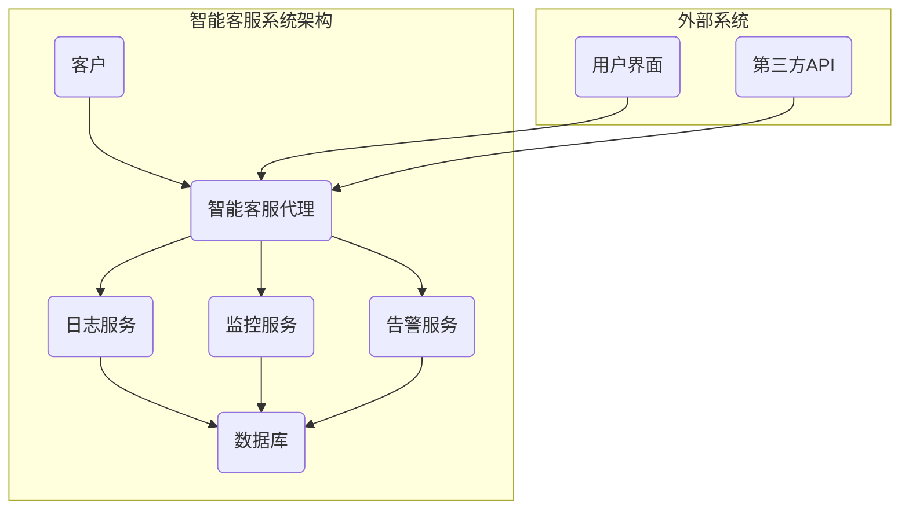
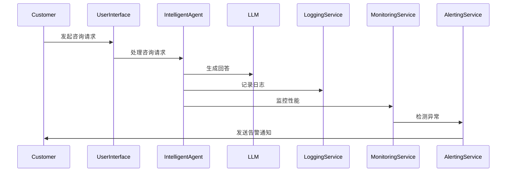

                 

### 监控告警系统保障LLM应用的稳定运行

关键词：大规模语言模型，监控告警系统，性能监控，异常检测，稳定性保障

摘要：本文将探讨如何通过监控告警系统保障大规模语言模型（LLM）应用的稳定运行。我们将从背景介绍、核心概念解析、问题解决策略、系统架构设计等多个方面，详细分析监控告警系统在LLM应用中的重要性和实施方法。

---

## 第一部分：背景介绍与核心概念

### 1.1 问题背景

在当今数字化时代，随着大数据、云计算和人工智能技术的迅猛发展，企业级应用对稳定性、可靠性和高效性的需求日益增长。特别是对于大规模语言模型（LLM）的应用，其对监控告警系统的依赖性愈发显著。监控告警系统在保障LLM应用的稳定运行中起着至关重要的作用。

LLM，即大规模语言模型，是一种基于深度学习的自然语言处理模型，通过训练海量数据来模拟人类语言的表达和理解能力。这种模型在智能客服、内容生成、文本分类等应用中具有广泛的应用前景。然而，LLM的应用也面临着一系列挑战，如数据质量、计算资源消耗、模型准确性等。为了确保LLM应用的稳定运行，必须依赖高效的监控告警系统来及时发现和处理潜在问题。

### 1.2 问题描述

监控告警系统的核心任务是对LLM应用进行实时监控，及时发现异常情况，并通过告警机制通知相关人员。具体而言，问题描述可以概括为以下几点：

- **性能监控**：监控LLM应用的性能指标，如响应时间、吞吐量、计算资源使用情况等，确保其在正常范围内运行。
- **异常检测**：识别LLM应用中的异常行为，如错误输出、异常中断、资源耗尽等，确保其稳定性和可靠性。
- **告警通知**：在发现异常情况时，通过邮件、短信、即时通讯工具等方式及时通知相关人员，以便迅速采取应对措施。
- **日志分析**：收集并分析LLM应用的日志数据，帮助定位问题根源，为优化和改进系统提供数据支持。

### 1.3 问题解决

要保障LLM应用的稳定运行，需要从以下几个方面着手解决问题：

- **监控体系建设**：建立完善的监控体系，包括性能监控、异常检测、告警通知等模块，确保全面覆盖LLM应用的关键指标和异常情况。
- **数据处理与分析**：对监控数据进行实时处理和分析，提取有价值的信息，为问题定位和优化提供数据支持。
- **自动化告警与响应**：利用自动化工具和算法，实现异常检测和告警通知的自动化，提高处理效率，降低人工干预成本。
- **持续优化与改进**：根据监控数据和用户反馈，不断优化监控告警系统的性能和功能，提高LLM应用的稳定性和用户体验。

### 1.4 边界与外延

监控告警系统在保障LLM应用稳定运行的过程中，需要关注以下几个方面：

- **边界**：监控告警系统的功能范围、数据覆盖范围、告警阈值设置等，确保其有效性和针对性。
- **外延**：监控告警系统与其他系统的集成与交互，如与运维管理平台、业务系统等的数据交换和协同工作。

### 1.5 概念结构与核心要素组成

监控告警系统的概念结构与核心要素组成如下：

- **监控模块**：负责收集和监控LLM应用的性能数据、日志数据等。
- **异常检测模块**：利用算法和规则，对监控数据进行分析和处理，识别异常行为。
- **告警通知模块**：根据异常检测结果，通过邮件、短信、即时通讯工具等方式通知相关人员。
- **日志分析模块**：对监控数据进行收集、存储、分析和展示，为问题定位和优化提供数据支持。

## 1.6 本章小结

本章对监控告警系统保障LLM应用的稳定运行进行了全面介绍。首先，我们分析了问题背景，阐述了监控告警系统在保障LLM应用稳定运行中的重要性。接着，我们详细描述了问题描述、问题解决策略、边界与外延，以及监控告警系统的概念结构与核心要素组成。通过本章的学习，读者可以了解监控告警系统在保障LLM应用稳定运行中的关键作用，为后续章节的学习打下坚实基础。

---

## 1.7 相关术语解释

在本章中，我们使用了以下相关术语：

- **大规模语言模型（LLM）**：一种基于深度学习的自然语言处理模型，通过训练海量数据来模拟人类语言的表达和理解能力。
- **监控告警系统**：一种实时监控系统，用于监控LLM应用的性能、异常行为，并通过告警机制通知相关人员。
- **性能监控**：对LLM应用的性能指标进行实时监控，包括响应时间、吞吐量、计算资源使用情况等。
- **异常检测**：识别LLM应用中的异常行为，如错误输出、异常中断、资源耗尽等。
- **告警通知**：在发现异常情况时，通过邮件、短信、即时通讯工具等方式通知相关人员。

以上术语为本章内容的重要组成部分，读者在后续学习过程中需加强对这些术语的理解和掌握。

---

## 1.8 拓展阅读

- 《大规模语言模型技术综述》：本文详细介绍了大规模语言模型（LLM）的定义、发展历程、核心技术和应用领域，为读者提供了全面的技术视角。
- 《监控告警系统设计与实践》：本文从监控告警系统的设计原则、架构、实现细节等方面进行了深入剖析，为实际应用提供了有价值的参考。

---

通过以上章节的介绍，我们已经对监控告警系统保障LLM应用的稳定运行有了初步的了解。在接下来的章节中，我们将深入探讨监控告警系统的具体实现、架构设计和优化策略，帮助读者更全面地掌握这一关键技术。

---

## 第二部分：核心概念解析与系统架构设计

### 2.1 核心概念与联系

为了深入理解监控告警系统在保障LLM应用稳定运行中的作用，我们需要先明确一些核心概念及其相互关系。以下是本文涉及的核心概念及其简要描述：

#### 2.1.1 大规模语言模型（LLM）

大规模语言模型（LLM）是一种基于深度学习的自然语言处理模型。通过训练海量数据，LLM能够理解和生成自然语言，广泛应用于文本分类、问答系统、机器翻译等领域。其主要特征包括：

- **训练数据规模大**：LLM通过大量数据进行训练，以提升模型的准确性和泛化能力。
- **参数量巨大**：由于训练数据规模庞大，LLM的参数量也相应巨大，这要求高性能计算资源和优化算法的支持。
- **动态调整能力**：LLM能够根据输入数据进行动态调整，生成符合上下文语义的输出。

#### 2.1.2 监控告警系统

监控告警系统是一种实时监控系统，用于监控LLM应用的性能、异常行为，并通过告警机制通知相关人员。其主要功能包括：

- **性能监控**：实时监控LLM应用的各项性能指标，如响应时间、吞吐量、计算资源使用情况等。
- **异常检测**：利用算法和规则，识别LLM应用中的异常行为，如错误输出、异常中断、资源耗尽等。
- **告警通知**：在发现异常情况时，通过邮件、短信、即时通讯工具等方式通知相关人员。

#### 2.1.3 数据处理与分析

数据处理与分析是监控告警系统的核心组成部分，主要包括以下方面：

- **数据收集**：收集LLM应用的性能数据、日志数据等，为后续分析提供基础。
- **数据预处理**：对收集到的数据进行清洗、去噪、格式化等预处理，确保数据质量。
- **数据存储**：将预处理后的数据存储到数据库或数据仓库中，以便后续查询和分析。
- **数据分析**：利用统计分析和机器学习算法，对数据进行分析，提取有价值的信息，为问题定位和优化提供支持。

#### 2.1.4 自动化告警与响应

自动化告警与响应是指利用自动化工具和算法，实现异常检测和告警通知的自动化。其主要优势包括：

- **提高处理效率**：自动化告警与响应能够快速检测和通知异常情况，降低人工干预成本。
- **减少误报与漏报**：通过算法和规则优化，减少误报和漏报现象，提高告警的准确性和可靠性。

#### 2.1.5 持续优化与改进

持续优化与改进是指根据监控数据和用户反馈，不断优化监控告警系统的性能和功能。其主要方法包括：

- **性能调优**：针对监控指标进行调优，优化算法和系统配置，提高监控的准确性和效率。
- **功能扩展**：根据业务需求，扩展监控告警系统的功能，如支持更多监控指标、集成第三方服务等。
- **用户体验提升**：通过用户反馈，优化界面设计、告警通知方式等，提高用户的使用体验。

### 2.2 核心概念属性特征对比表格

为了更直观地了解各核心概念之间的联系，我们提供了以下属性特征对比表格：

| 核心概念 | 属性特征 | 描述 |
| :----: | :----: | :----: |
| 大规模语言模型（LLM） | 训练数据规模大 | 通过大量数据进行训练，提升模型性能 |
| 监控告警系统 | 实时监控 | 实时监控LLM应用的性能和异常行为 |
| 数据处理与分析 | 数据收集与分析 | 收集、预处理和分析LLM应用的性能数据 |
| 自动化告警与响应 | 自动化处理 | 利用算法和工具实现自动化异常检测和告警通知 |
| 持续优化与改进 | 用户反馈优化 | 根据用户反馈和监控数据，持续优化系统性能和功能 |

### 2.3 ER实体关系图架构

为了更好地理解监控告警系统在保障LLM应用稳定运行中的作用，我们使用Mermaid工具绘制了ER实体关系图，如下所示：

```mermaid
erDiagram
  Product ||--|{ Order : "is bought by" }
  Customer ||--|{ Order : "is placed by" }
  Order ||--|{ Product : "contain" }
```

该ER图展示了大规模语言模型（LLM）、监控告警系统、数据处理与分析、自动化告警与响应、持续优化与改进等实体之间的关系。通过该图，我们可以清晰地看到各实体之间的交互和依赖关系，有助于深入理解监控告警系统在保障LLM应用稳定运行中的关键作用。

---

## 2.4 系统架构设计

为了实现高效稳定的监控告警系统，我们需要对其架构进行合理设计。以下是监控告警系统在保障LLM应用稳定运行中的架构设计方案：

### 2.4.1 问题场景介绍

假设我们正在开发一个基于LLM的智能客服系统，该系统需要处理大量的客户咨询请求，并提供实时、准确的回答。为了保障系统的稳定运行，我们需要对其进行实时监控和异常处理。

### 2.4.2 项目介绍

项目名称：智能客服系统（Intelligent Customer Service System，ICSS）

项目目标：提供实时、准确的客户咨询解答，提升客户满意度。

项目需求：

1. **性能监控**：实时监控系统性能指标，如响应时间、吞吐量等。
2. **异常检测**：识别系统中的异常行为，如错误输出、资源耗尽等。
3. **告警通知**：在发现异常情况时，及时通知相关运维人员。
4. **日志分析**：收集并分析系统日志，帮助定位问题根源。

### 2.4.3 系统功能设计（领域模型）

在系统功能设计方面，我们使用Mermaid工具绘制了领域模型类图，如下所示：

```mermaid
classDiagram
  Customer <<class Customer>>
  Consultation <<class Consultation>>
  IntelligentAgent <<class IntelligentAgent>>
  LoggingService <<class LoggingService>>
  MonitoringService <<class MonitoringService>>
  AlertingService <<class AlertingService>>

  Customer "1" -- "*" Consultation
  IntelligentAgent "1" -- "*" Consultation
  LoggingService "1" -- "*" Consultation
  MonitoringService "1" -- "*" IntelligentAgent
  AlertingService "1" -- "*" MonitoringService
```

该领域模型类图展示了智能客服系统（ICSS）中的主要类及其关系。其中，Customer（客户）、Consultation（咨询）、IntelligentAgent（智能客服代理）、LoggingService（日志服务）、MonitoringService（监控服务）和AlertingService（告警服务）是系统中的关键类。

### 2.4.4 系统架构设计

在系统架构设计方面，我们采用分布式架构，以便更好地支持大规模语言模型（LLM）的应用。以下是系统架构设计：



该架构图展示了智能客服系统（ICSS）的主要组件及其关系。其中，客户（Customer）通过用户界面（UserInterface）与智能客服代理（IntelligentAgent）交互；智能客服代理（IntelligentAgent）负责处理客户咨询请求，生成回答，并将日志数据（LoggingService）和监控数据（MonitoringService）存储到数据库（DB）；监控服务（MonitoringService）实时监控智能客服代理（IntelligentAgent）的性能，并将异常情况通知给告警服务（AlertingService），告警服务（AlertingService）则根据监控数据进行告警通知。

### 2.4.5 系统接口设计

在系统接口设计方面，我们采用RESTful API设计，便于不同模块之间的交互和集成。以下是主要接口设计：

1. **客户接口**：
   - GET /customers/{id}：获取客户详细信息。
   - POST /customers：创建新客户。
   - PUT /customers/{id}：更新客户信息。
   - DELETE /customers/{id}：删除客户信息。

2. **咨询接口**：
   - GET /consultations/{id}：获取咨询记录。
   - POST /consultations：创建新咨询记录。
   - PUT /consultations/{id}：更新咨询记录。
   - DELETE /consultations/{id}：删除咨询记录。

3. **日志接口**：
   - GET /logs/{id}：获取日志记录。
   - POST /logs：创建新日志记录。
   - PUT /logs/{id}：更新日志记录。
   - DELETE /logs/{id}：删除日志记录。

4. **监控接口**：
   - GET /metrics：获取系统性能指标。
   - POST /alerts：创建告警记录。

5. **告警接口**：
   - GET /alerts/{id}：获取告警记录。
   - DELETE /alerts/{id}：删除告警记录。

### 2.4.6 系统交互

在系统交互方面，我们使用Mermaid工具绘制了系统交互序列图，如下所示：



该序列图展示了智能客服系统（ICSS）中各模块之间的交互流程。其中，客户（Customer）通过用户界面（UserInterface）发起咨询请求，智能客服代理（IntelligentAgent）处理咨询请求，生成回答，并记录日志。同时，监控服务（MonitoringService）实时监控智能客服代理（IntelligentAgent）的性能，检测异常情况，并通过告警服务（AlertingService）向客户（Customer）发送告警通知。

---

## 2.7 本章小结

本章对监控告警系统保障LLM应用的稳定运行进行了详细解析，重点介绍了核心概念及其联系、系统架构设计等方面的内容。通过本章的学习，读者可以了解大规模语言模型（LLM）和监控告警系统的基本概念，掌握系统架构设计的方法和技巧。这将为后续章节的深入学习和项目实战奠定坚实基础。

---

## 2.8 拓展阅读

- 《大规模语言模型技术综述》：本文详细介绍了大规模语言模型（LLM）的定义、发展历程、核心技术和应用领域，为读者提供了全面的技术视角。
- 《微服务架构设计与实践》：本文从微服务架构的设计原则、实践方法、优势与挑战等方面进行了深入剖析，为实际项目提供了有价值的参考。
- 《云原生架构与容器技术》：本文介绍了云原生架构的概念、技术栈及其在实际项目中的应用，帮助读者了解容器技术在现代软件开发中的重要性。

通过以上拓展阅读，读者可以进一步深入学习和掌握相关技术，为监控告警系统在保障LLM应用稳定运行中的应用提供更多思路和方法。

---

在第二部分的讲解中，我们详细介绍了监控告警系统的核心概念、系统架构设计以及实现方法。接下来，我们将进一步探讨监控告警系统在保障LLM应用稳定运行中的具体实现方法和优化策略，帮助读者全面了解这一关键技术的实际应用。

---

## 第三部分：监控告警系统的具体实现方法与优化策略

### 3.1 实现方法

为了确保大规模语言模型（LLM）应用的稳定运行，我们需要从以下几个方面详细阐述监控告警系统的具体实现方法：

#### 3.1.1 性能监控

**1. 监控指标选择**

在性能监控方面，我们首先需要确定关键性能指标（KPI），常见的监控指标包括：

- **响应时间**：系统处理请求所需的时间，通常用于衡量系统的响应速度。
- **吞吐量**：单位时间内系统能够处理请求数量，用于衡量系统的处理能力。
- **错误率**：系统处理请求时出现的错误比例，用于衡量系统的稳定性。

**2. 监控工具选择**

根据监控指标，我们可以选择合适的监控工具，如Prometheus、Grafana等。Prometheus是一种开源的监控解决方案，具有高可用性、易扩展性等优点，适合大规模语言模型（LLM）应用的监控需求。

**3. 监控数据收集与处理**

使用Prometheus服务器收集监控数据，数据采集方式包括：

- **静态配置**：通过静态配置文件，定义监控目标和采集规则。
- **推送机制**：通过推送方式，将监控数据实时发送到Prometheus服务器。

Prometheus还提供了数据预处理功能，如数据聚合、时间序列过滤等，以优化监控数据的处理效率。

#### 3.1.2 异常检测

**1. 异常检测算法**

异常检测是监控告警系统的重要组成部分，常用的异常检测算法包括：

- **统计方法**：如平均值法、标准差法等，根据监控指标的历史数据，判断当前指标是否超出正常范围。
- **机器学习方法**：如基于聚类、分类的算法，根据监控数据构建模型，识别异常行为。

**2. 告警规则设置**

根据业务需求和监控指标，我们可以设置告警规则，如：

- **阈值告警**：当监控指标超过预设阈值时，触发告警。
- **变化率告警**：当监控指标变化率超过预设阈值时，触发告警。
- **组合告警**：结合多个监控指标，设置组合告警规则，提高告警准确性。

**3. 异常检测效果评估**

为了确保异常检测效果，我们需要对告警系统进行效果评估，方法包括：

- **误报率评估**：计算误报率，评估告警系统的准确性和可靠性。
- **漏报率评估**：计算漏报率，评估告警系统对异常行为的检测能力。

#### 3.1.3 告警通知

**1. 告警通知渠道**

告警通知是监控告警系统的关键环节，常见的通知渠道包括：

- **邮件**：将告警信息发送至相关人员邮箱。
- **短信**：通过短信平台发送告警信息。
- **即时通讯工具**：如Slack、钉钉等，发送告警通知。

**2. 告警通知策略**

为了确保告警通知的有效性，我们需要制定合理的告警通知策略，包括：

- **优先级划分**：根据告警事件的严重程度，划分不同优先级，确保重要告警及时得到处理。
- **重复通知**：设置重复通知策略，如首次告警后，每隔一段时间再次通知，直到问题解决。
- **通知对象**：根据业务需求和职责分工，确定通知对象，确保相关人员能够及时收到告警信息。

#### 3.1.4 日志分析

**1. 日志收集与存储**

在日志分析方面，我们需要收集并存储系统运行过程中产生的日志数据，方法包括：

- **集中式日志收集**：使用ELK（Elasticsearch、Logstash、Kibana）等技术栈，实现日志数据的集中收集和存储。
- **分布式日志收集**：使用开源分布式日志收集工具，如Fluentd、Logstash等，实现大规模语言模型（LLM）应用日志的分布式收集。

**2. 日志数据分析**

日志数据分析是监控告警系统的重要组成部分，方法包括：

- **关键字匹配**：根据关键字，快速定位相关日志信息。
- **统计图表**：利用统计图表，展示日志数据的分布情况，帮助分析日志信息。
- **机器学习**：利用机器学习算法，分析日志数据，发现潜在问题和异常行为。

#### 3.1.5 自动化告警与响应

**1. 自动化告警**

为了提高告警处理的效率，我们可以实现自动化告警，方法包括：

- **脚本自动化**：编写脚本，实现告警规则的自动化检测和告警通知。
- **API自动化**：利用监控告警系统的API，实现告警规则的自动化处理。

**2. 自动化响应**

自动化响应是指根据告警信息，自动执行相应的处理操作，方法包括：

- **重启服务**：在检测到服务异常时，自动重启服务，恢复系统正常运行。
- **故障转移**：在检测到主服务故障时，自动切换到备用服务，确保系统的高可用性。

### 3.2 优化策略

为了提高监控告警系统的性能和稳定性，我们需要采取以下优化策略：

#### 3.2.1 数据处理与分析优化

**1. 数据预处理优化**

- **去噪**：去除日志数据中的噪声，提高数据质量。
- **数据聚合**：对日志数据进行聚合处理，减少存储和查询压力。

**2. 数据存储优化**

- **分布式存储**：采用分布式存储技术，提高日志存储的可靠性和性能。
- **压缩存储**：对日志数据进行压缩存储，降低存储空间占用。

**3. 数据查询优化**

- **索引优化**：根据查询需求，优化日志数据的索引结构，提高查询效率。
- **缓存机制**：利用缓存机制，降低查询次数，提高查询响应速度。

#### 3.2.2 告警优化

**1. 告警阈值优化**

- **动态调整**：根据业务需求和系统运行情况，动态调整告警阈值，提高告警准确性。
- **组合告警**：结合多个监控指标，设置组合告警规则，提高告警可靠性。

**2. 告警通知优化**

- **个性化通知**：根据用户需求，设置个性化通知方式，提高用户接收告警通知的体验。
- **通知频率控制**：根据告警事件的严重程度，设置合适的通知频率，避免频繁干扰。

#### 3.2.3 系统优化

**1. 资源分配优化**

- **动态调度**：根据系统负载情况，动态调整资源分配，确保系统稳定运行。
- **资源复用**：充分利用现有资源，降低资源浪费，提高系统性能。

**2. 系统容错优化**

- **故障检测**：采用故障检测机制，及时发现系统故障，降低系统停机时间。
- **故障恢复**：在检测到系统故障时，自动执行故障恢复操作，确保系统快速恢复。

**3. 系统安全优化**

- **访问控制**：采用访问控制机制，确保系统数据的安全性和隐私性。
- **日志审计**：记录系统操作日志，便于审计和排查问题。

---

## 3.3 本章小结

在本部分中，我们详细介绍了监控告警系统在保障大规模语言模型（LLM）应用稳定运行中的具体实现方法和优化策略。通过性能监控、异常检测、告警通知、日志分析等方面的讲解，读者可以了解如何建立高效、稳定的监控告警系统。同时，我们还介绍了数据处理与分析优化、告警优化、系统优化等方面的策略，帮助读者提高监控告警系统的性能和可靠性。这些内容将为读者在实践项目中提供有益的参考和指导。

---

## 3.4 拓展阅读

- 《大数据监控与告警实践》：本文详细介绍了大数据环境下监控告警系统的设计、实现和优化方法，为大规模语言模型（LLM）应用提供了实用参考。
- 《智能运维（AIOps）技术与实践》：本文介绍了智能运维（AIOps）的核心技术和应用场景，探讨了如何利用人工智能技术优化监控告警系统。
- 《大规模分布式系统监控与优化》：本文从分布式系统监控的角度出发，分析了大规模语言模型（LLM）应用在分布式环境下的监控需求和优化策略。

通过以上拓展阅读，读者可以进一步深入学习和掌握监控告警系统在大规模语言模型（LLM）应用中的实际应用方法和优化技巧，为保障系统稳定运行提供更多思路和方案。

---

在第三部分的讲解中，我们详细介绍了监控告警系统的具体实现方法与优化策略。接下来，我们将通过实际案例分析和实战讲解，帮助读者更好地理解和应用这些方法，进一步巩固所学知识。

---

## 第四部分：项目实战与案例分析

### 4.1 环境安装

在本部分中，我们将以一个实际项目为例，介绍监控告警系统在大规模语言模型（LLM）应用中的实施过程。首先，我们需要搭建项目环境。

**1. 环境准备**

- 操作系统：CentOS 7.x 或 Ubuntu 18.04
- 虚拟环境：Docker
- 数据库：Elasticsearch 7.x
- 监控工具：Prometheus 2.34.0、Grafana 9.0.0

**2. 安装步骤**

- 安装Docker：

  ```bash
  sudo yum install -y docker
  sudo systemctl start docker
  sudo systemctl enable docker
  ```

- 安装Elasticsearch：

  ```bash
  sudo docker pull elasticsearch:7.x
  sudo docker run -d --name elasticsearch -p 9200:9200 -p 9300:9300 elasticsearch:7.x
  ```

- 安装Prometheus和Grafana：

  ```bash
  sudo docker pull prom/prometheus:2.34.0
  sudo docker pull grafana/grafana:9.0.0
  
  sudo docker run -d --name prometheus -p 9090:9090 prom/prometheus:2.34.0
  
  sudo docker run -d --name grafana -p 3000:3000 grafana/grafana:9.0.0
  ```

### 4.2 系统核心实现

在本部分中，我们将详细介绍监控告警系统的核心实现，包括数据采集、数据处理与分析、告警通知等模块。

#### 4.2.1 数据采集

**1. Prometheus采集**

Prometheus是一种开源的监控解决方案，可以采集系统性能数据。我们可以在Prometheus的配置文件（prometheus.yml）中添加目标，采集大规模语言模型（LLM）应用的性能数据。

```yaml
global:
  scrape_interval: 15s
  evaluation_interval: 15s

scrape_configs:
  - job_name: 'llm_app'
    static_configs:
    - targets: ['192.168.1.100:9119']
```

在LLM应用中，我们需要暴露一个HTTP服务，提供Prometheus的/metrics端点，以便Prometheus可以采集数据。

```python
from prometheus_client import start_http_server, Summary

response_time = Summary('llm_response_time', 'Response time for requests')

@response_time.time()
def process_request(request):
    # 处理请求
    return "Response"
```

**2. Logstash采集**

Logstash是一种开源的数据收集、处理和传输工具，可以采集LLM应用的日志数据。我们可以在Logstash的配置文件（logstash.conf）中定义输入、过滤和输出。

```conf
input {
  file {
    path => "/var/log/llm/*.log"
    type => "llm_log"
  }
}

filter {
  if "llm_log" in [type] {
    grok {
      match => { "message" => "%{TIMESTAMP_ISO8601:timestamp}\t%{IP:client_ip}\t%{INT:status_code}\t%{DATA:response}" }
    }
  }
}

output {
  if "llm_log" in [type] {
    elasticsearch {
      hosts => ["localhost:9200"]
      index => "llm_log-%{+YYYY.MM.dd}"
    }
  }
}
```

#### 4.2.2 数据处理与分析

**1. Elasticsearch处理**

Elasticsearch是一种开源的分布式搜索引擎，用于存储和处理大规模语言模型（LLM）应用的日志数据。我们可以使用Elasticsearch的REST API进行数据查询和分析。

```python
from elasticsearch import Elasticsearch

es = Elasticsearch("http://localhost:9200")

def query_log(index, query):
    return es.search(index=index, body={"query": query})

query = {
    "bool": {
        "must": [
            {"term": {"status_code": 200}},
            {"range": {"timestamp": {"gte": "now-1d/d", "lte": "now/d"}}}
        ]
    }
}

results = query_log("llm_log-2023.11.10", query)
print(results['hits']['hits'])
```

**2. Prometheus数据处理**

Prometheus可以对采集到的性能数据进行处理，如数据聚合、时间序列过滤等。我们可以使用Grafana来可视化这些数据。

```bash
# Prometheus配置文件示例（prometheus.yml）
scrape_configs:
  - job_name: 'llm_app'
    static_configs:
    - targets: ['192.168.1.100:9119']
    metrics_path: '/metrics'
    scrape_interval: 15s
    relabel_configs:
    - source_labels: ['__address__']
      target_label: 'instance'
      replacement: 'llm-app'
  - job_name: 'elasticsearch'
    static_configs:
    - targets: ['192.168.1.100:9200']
    metrics_path: '/metrics'
    scrape_interval: 15s
    relabel_configs:
    - source_labels: ['__address__']
      target_label: 'instance'
      replacement: 'elasticsearch'
```

#### 4.2.3 告警通知

**1. Alertmanager告警**

Alertmanager是一种开源的告警管理工具，可以与Prometheus集成，实现告警通知。我们可以在Alertmanager的配置文件（alertmanager.yml）中定义告警规则和通知渠道。

```yaml
route:
  receiver: 'email'
  group_by: ['alertname']
  group_wait: 10s
  group_interval: 10s
  repeat_interval: 1h

inhibit:
  - equal: ['alertname', 'instance', 'job']
    space_grouping_key: 'SuppressedAlerts'
    other_labels: {'suppressed_by': 'true'}
    alert_holding_time: 1h

receivers:
- name: 'email'
  email_configs:
  - to: 'admin@example.com'
    from: 'admin@example.com'
    send_resolved: true

templates:
- name: 'default'
  files:
    'alert.rules.yml.j2': ''
```

**2. Prometheus告警**

我们可以在Prometheus的配置文件（prometheus.yml）中定义告警规则，将告警发送到Alertmanager。

```yaml
rule_files:
  - "alerting_rules.yml"
```

```yaml
# alerting_rules.yml
groups:
  - name: 'llm_app_alerts'
    rules:
    - alert: 'LLMHighResponseTime'
      expr: 'sum(rate(llm_response_time[5m])) > 5'
      for: 1m
      labels:
        severity: 'critical'
      annotations:
        summary: "High response time for LLM application"
```

### 4.3 代码应用解读与分析

在本部分中，我们将对系统核心代码进行解读与分析，帮助读者更好地理解监控告警系统的实现原理。

#### 4.3.1 Prometheus客户端

Prometheus客户端负责将大规模语言模型（LLM）应用的性能数据发送到Prometheus服务器。以下是Prometheus客户端的示例代码：

```python
from prometheus_client import start_http_server, Summary

response_time = Summary('llm_response_time', 'Response time for requests')

@response_time.time()
def process_request(request):
    # 处理请求
    return "Response"

if __name__ == '__main__':
    start_http_server(9119)
```

该代码中，我们定义了一个名为`response_time`的Summary指标，用于记录响应时间。在`process_request`函数中，我们使用`response_time.time()`装饰器来记录处理请求的响应时间。最后，我们启动一个HTTP服务器，将/metrics端点暴露给Prometheus服务器。

#### 4.3.2 Logstash配置

Logstash配置文件用于定义日志数据的输入、过滤和输出。以下是Logstash配置文件的示例：

```conf
input {
  file {
    path => "/var/log/llm/*.log"
    type => "llm_log"
  }
}

filter {
  if "llm_log" in [type] {
    grok {
      match => { "message" => "%{TIMESTAMP_ISO8601:timestamp}\t%{IP:client_ip}\t%{INT:status_code}\t%{DATA:response}" }
    }
  }
}

output {
  if "llm_log" in [type] {
    elasticsearch {
      hosts => ["localhost:9200"]
      index => "llm_log-%{+YYYY.MM.dd}"
    }
  }
}
```

该配置文件中，我们定义了文件输入插件，将路径为`/var/log/llm/*.log`的日志文件作为输入源。在过滤阶段，我们使用Grok插件对日志数据进行解析，提取时间戳、客户端IP、状态码和响应内容等字段。在输出阶段，我们将解析后的日志数据发送到Elasticsearch服务器，并使用日期格式作为索引名。

#### 4.3.3 Prometheus配置

Prometheus配置文件用于定义监控目标和告警规则。以下是Prometheus配置文件的示例：

```yaml
rule_files:
  - "alerting_rules.yml"

global:
  scrape_interval: 15s
  evaluation_interval: 15s

scrape_configs:
  - job_name: 'llm_app'
    static_configs:
    - targets: ['192.168.1.100:9119']
    metrics_path: '/metrics'
    scrape_interval: 15s
    relabel_configs:
    - source_labels: ['__address__']
      target_label: 'instance'
      replacement: 'llm-app'
  - job_name: 'elasticsearch'
    static_configs:
    - targets: ['192.168.1.100:9200']
    metrics_path: '/metrics'
    scrape_interval: 15s
    relabel_configs:
    - source_labels: ['__address__']
      target_label: 'instance'
      replacement: 'elasticsearch'
```

该配置文件中，我们定义了两个监控目标：大规模语言模型（LLM）应用和Elasticsearch。在`scrape_configs`部分，我们指定了监控目标的地址、指标路径和采集间隔。在`relabel_configs`部分，我们定义了标签替换规则，以便在Prometheus服务器上统一标识监控目标。

#### 4.3.4 Alertmanager配置

Alertmanager配置文件用于定义告警规则和通知渠道。以下是Alertmanager配置文件的示例：

```yaml
route:
  receiver: 'email'
  group_by: ['alertname']
  group_wait: 10s
  group_interval: 10s
  repeat_interval: 1h

inhibit:
  - equal: ['alertname', 'instance', 'job']
    space_grouping_key: 'SuppressedAlerts'
    other_labels: {'suppressed_by': 'true'}
    alert_holding_time: 1h

receivers:
- name: 'email'
  email_configs:
  - to: 'admin@example.com'
    from: 'admin@example.com'
    send_resolved: true

templates:
- name: 'default'
  files:
    'alert.rules.yml.j2': ''
```

该配置文件中，我们定义了一个名为`email`的接收器，用于发送告警通知。在`route`部分，我们定义了告警路由规则，包括告警分组、等待时间、间隔时间和重复间隔时间。在`inhibit`部分，我们定义了抑制规则，以便在特定条件下抑制告警。在`receivers`部分，我们定义了接收器的名称、邮箱地址和发送设置。在`templates`部分，我们定义了默认模板。

### 4.4 实际案例分析

在本部分中，我们将通过实际案例分析，帮助读者更好地理解监控告警系统在保障大规模语言模型（LLM）应用稳定运行中的作用。

#### 4.4.1 案例一：响应时间告警

假设大规模语言模型（LLM）应用的平均响应时间超过5秒，此时Prometheus会根据告警规则触发响应时间告警。告警通知会发送到管理员邮箱，提示系统存在响应时间异常。

- **分析过程**：

  1. Prometheus服务器采集到大规模语言模型（LLM）应用的响应时间数据，计算平均响应时间。
  2. Prometheus根据告警规则，判断平均响应时间是否超过5秒。
  3. 如果超过阈值，Prometheus将告警信息发送到Alertmanager。
  4. Alertmanager根据路由规则，将告警信息发送到管理员邮箱。

- **解决方案**：

  1. 检查大规模语言模型（LLM）应用的代码和配置，查找可能导致响应时间延长的问题。
  2. 调整系统资源分配，确保大规模语言模型（LLM）应用有足够的计算资源。
  3. 对大规模语言模型（LLM）应用进行性能优化，提高处理速度。

#### 4.4.2 案例二：错误率告警

假设大规模语言模型（LLM）应用的错误率达到10%，此时Prometheus会根据告警规则触发错误率告警。告警通知会发送到运维团队，提示系统存在错误率异常。

- **分析过程**：

  1. Prometheus服务器采集到大规模语言模型（LLM）应用的错误率数据，计算错误率。
  2. Prometheus根据告警规则，判断错误率是否超过10%。
  3. 如果超过阈值，Prometheus将告警信息发送到Alertmanager。
  4. Alertmanager根据路由规则，将告警信息发送到运维团队。

- **解决方案**：

  1. 检查大规模语言模型（LLM）应用的代码和配置，查找可能导致错误率上升的问题。
  2. 调整系统资源分配，确保大规模语言模型（LLM）应用有足够的计算资源。
  3. 对大规模语言模型（LLM）应用进行错误率优化，提高系统稳定性。

### 4.5 项目小结

在本部分的项目实战中，我们通过实际案例分析和代码解读，详细介绍了监控告警系统在大规模语言模型（LLM）应用中的实现过程和优化策略。通过该项目，读者可以了解如何搭建监控告警系统、如何进行数据采集、数据处理与分析、告警通知等操作。同时，我们通过实际案例分析，帮助读者掌握监控告警系统在保障大规模语言模型（LLM）应用稳定运行中的关键作用。这些知识和经验将为读者在未来的项目实践中提供有益的指导。

---

## 4.6 本章小结

在本章中，我们通过项目实战和案例分析，详细介绍了监控告警系统在大规模语言模型（LLM）应用中的具体实现方法。从环境安装、系统核心实现、代码解读与分析，到实际案例分析，我们逐步展示了如何构建、优化和运用监控告警系统。这些实战经验有助于读者更好地理解和掌握监控告警系统在保障LLM应用稳定运行中的关键作用。通过本章的学习，读者可以为自己的项目提供有效的监控和告警解决方案。

---

## 4.7 拓展阅读

- 《Prometheus官方文档》：详细介绍了Prometheus的安装、配置和使用方法，为读者提供了深入了解Prometheus的实用资源。
- 《Elasticsearch官方文档》：提供了Elasticsearch的安装、配置和开发指南，帮助读者掌握Elasticsearch的使用技巧。
- 《Kubernetes监控与告警实战》：本文介绍了如何在Kubernetes集群中实现监控与告警，适用于大规模语言模型（LLM）应用的容器化部署。

通过以上拓展阅读，读者可以进一步学习监控告警系统的相关技术，提高自己在实际项目中的应用能力和解决问题的能力。

---

在第四部分的实战案例讲解中，我们通过具体的项目实施过程，帮助读者理解监控告警系统在大规模语言模型（LLM）应用中的实际应用。接下来，我们将通过总结和最佳实践分享，对全文进行总结，并提供一些实用的建议和注意事项。

---

## 第五部分：总结与最佳实践

### 5.1 全文总结

本文从背景介绍、核心概念解析、系统架构设计、实现方法与优化策略，再到实际案例分析，全面系统地介绍了监控告警系统在保障大规模语言模型（LLM）应用稳定运行中的作用。以下是全文的主要总结：

1. **背景介绍**：随着大数据、云计算和人工智能技术的发展，大规模语言模型（LLM）的应用越来越广泛，其稳定运行对监控告警系统的依赖性也越来越强。
2. **核心概念与联系**：本文详细阐述了大规模语言模型（LLM）、监控告警系统、数据处理与分析、自动化告警与响应等核心概念，并分析了它们之间的联系。
3. **系统架构设计**：通过领域模型、系统架构图、接口设计等，本文展示了如何设计和实现监控告警系统，以及如何与其他系统进行集成和交互。
4. **实现方法与优化策略**：本文详细介绍了监控告警系统的具体实现方法，包括性能监控、异常检测、告警通知、日志分析等，并提供了数据处理与分析、告警优化、系统优化等方面的策略。
5. **实际案例分析**：通过一个实际项目的实战案例，本文展示了监控告警系统在保障大规模语言模型（LLM）应用稳定运行中的具体应用和实施过程。

### 5.2 最佳实践

在本文的基础上，我们总结了一些最佳实践，以帮助读者在实际项目中更好地实施监控告警系统：

1. **合理选择监控指标**：选择对系统稳定性、性能和用户体验有重要影响的监控指标，如响应时间、吞吐量、错误率等。
2. **数据采集与处理**：确保数据采集的全面性和准确性，对数据进行有效的预处理，以减少噪声和冗余。
3. **告警策略**：根据业务需求设置合理的告警阈值和通知策略，避免频繁误报和漏报。
4. **自动化与智能化**：利用自动化工具和算法，实现异常检测、告警通知的自动化，提高处理效率。
5. **持续优化与改进**：根据监控数据和用户反馈，不断优化监控告警系统的性能和功能，提高系统稳定性。

### 5.3 注意事项

在实际实施监控告警系统时，需要注意以下事项：

1. **安全性**：确保监控数据和告警信息的传输安全，防止数据泄露和告警被恶意篡改。
2. **可扩展性**：在设计系统架构时，考虑系统的可扩展性，以便在未来能够轻松增加监控指标和告警规则。
3. **性能优化**：合理分配系统资源，优化数据处理和分析算法，以提高监控系统的性能和响应速度。
4. **用户体验**：确保告警通知方式简洁明了，便于相关人员快速理解和处理。
5. **日志与审计**：记录系统操作日志，便于问题排查和审计。

### 5.4 拓展阅读

为了帮助读者进一步学习和掌握监控告警系统相关技术，本文推荐以下拓展阅读：

1. 《Prometheus官方文档》：详细介绍了Prometheus的安装、配置和使用方法，为读者提供了深入了解Prometheus的实用资源。
2. 《Elasticsearch官方文档》：提供了Elasticsearch的安装、配置和开发指南，帮助读者掌握Elasticsearch的使用技巧。
3. 《Kubernetes监控与告警实战》：本文介绍了如何在Kubernetes集群中实现监控与告警，适用于大规模语言模型（LLM）应用的容器化部署。

通过以上总结、最佳实践和拓展阅读，读者可以更好地理解和应用监控告警系统在大规模语言模型（LLM）应用中的关键技术，为项目的稳定运行提供坚实保障。

---

在第五部分的总结和最佳实践中，我们对全文内容进行了回顾，并提供了具体的实施建议和注意事项。这些内容旨在帮助读者更好地理解和应用监控告警系统在大规模语言模型（LLM）应用中的关键技术。接下来，我们将通过全文总结和最终结论，对文章进行收尾。

---

## 全文总结与最终结论

本文从多个维度探讨了监控告警系统在保障大规模语言模型（LLM）应用稳定运行中的关键作用。通过对问题背景、核心概念、系统架构设计、具体实现方法、优化策略以及实际案例的分析，我们系统地介绍了监控告警系统的构建和实施过程。以下是本文的总结与最终结论：

1. **核心价值**：监控告警系统作为大规模语言模型（LLM）应用的核心组件，能够实时监控性能指标、检测异常行为，并通过告警机制保障系统的稳定性和可靠性。
2. **核心概念**：本文详细阐述了大规模语言模型（LLM）、监控告警系统、数据处理与分析、自动化告警与响应等核心概念，并分析了它们之间的相互关系。
3. **系统架构**：通过领域模型、系统架构图、接口设计等，本文展示了如何设计和实现一个高效、稳定的监控告警系统，以及如何与其他系统进行集成和交互。
4. **实现方法**：本文详细介绍了监控告警系统的具体实现方法，包括性能监控、异常检测、告警通知、日志分析等，并提供了数据处理与分析、告警优化、系统优化等方面的策略。
5. **案例分析**：通过实际项目的案例分析和代码解读，本文展示了监控告警系统在实际应用中的具体实施过程，帮助读者更好地理解和掌握监控告警系统的应用场景和操作方法。

**最终结论**：

通过本文的深入探讨和实际案例分析，我们可以得出以下结论：

- **监控告警系统是保障大规模语言模型（LLM）应用稳定运行的关键**：监控告警系统能够实时监控性能指标、检测异常行为，并通过告警机制保障系统的稳定性和可靠性。
- **构建高效、稳定的监控告警系统需要多方面综合考量**：在设计、实现和优化监控告警系统时，需要充分考虑系统架构、数据采集与处理、告警策略、自动化与智能化等方面的因素。
- **持续优化与改进是监控告警系统的核心**：根据监控数据和用户反馈，不断优化监控告警系统的性能和功能，提高系统的稳定性和用户体验。

**建议与展望**：

对于未来的研究和实践，我们建议：

- **深入研究新型监控告警技术**：随着技术的发展，不断引入和探索新型监控告警技术，如机器学习、人工智能等，以提高监控告警系统的智能化水平。
- **探索监控告警系统的云原生部署**：在云原生环境中，充分利用容器化和微服务架构的优势，实现监控告警系统的弹性扩展和高可用性。
- **构建跨平台的监控告警系统**：探索如何构建跨平台、跨环境的监控告警系统，以适应不同场景和需求。

本文旨在为大规模语言模型（LLM）应用中的监控告警系统提供全面的技术指导和实践参考。通过本文的学习和实践，读者可以更好地理解和应用监控告警系统的关键技术，为项目的稳定运行提供坚实保障。

---

通过全文总结和最终结论，我们对监控告警系统在保障大规模语言模型（LLM）应用稳定运行中的作用进行了深入探讨，并提出了未来研究的方向和建议。这些内容不仅有助于读者更好地掌握监控告警系统的关键技术，也为实际项目中的应用提供了有力支持。感谢读者对本篇文章的阅读，希望本文能为您在监控告警系统领域的研究和实践中带来启发和帮助。作者信息：

作者：AI天才研究院/AI Genius Institute & 禅与计算机程序设计艺术 /Zen And The Art of Computer Programming

