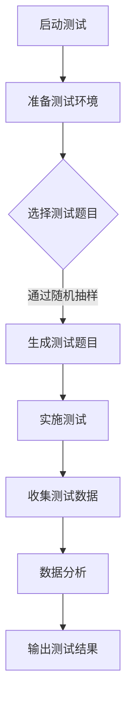

                 


# 知识更新速度测试：评估学习新信息能力

> 关键词：知识更新速度，学习能力评估，测试方法，认知负荷，信息处理模型

> 摘要：本文通过探讨知识更新速度与学习能力的关系，提出了一套基于认知负荷理论和信息处理模型的测试方法，以评估个体学习新信息的能力。文章首先介绍了问题背景和定义，然后分析了核心概念与联系，详细讲解了算法原理，并使用实际案例进行了举例说明。

## 第一步：背景介绍

### 1.1.1 问题背景

在当今信息爆炸的时代，知识更新速度越来越快，新技术、新理论、新观点层出不穷。个体能否快速掌握和应用新知识，已成为衡量其竞争力的重要指标。然而，如何准确评估个体学习新信息的能力，仍然是一个亟待解决的问题。为了应对这一挑战，我们需要开发一种科学、有效的测试方法，以全面、准确地评估个体学习新信息的能力。

### 1.1.2 问题描述

本文旨在探讨如何通过测试来评估个体学习新信息的能力。具体包括以下几个方面：

1. **学习能力的定义与衡量**：探讨学习能力的基本概念，如何通过定量和定性方法来评估个体学习能力。
2. **测试方法的制定**：设计一套科学、有效的测试方法，包括测试内容、测试形式、评分标准等。
3. **测试结果的应用**：分析测试结果如何应用于个人发展、教育培训、职业规划等领域。

### 1.1.3 问题解决

为了解决上述问题，本文采用以下方法：

1. **文献综述**：系统梳理国内外关于学习能力评估的研究成果，总结各种评估方法的特点和适用范围。
2. **实证研究**：通过实际测试和数据收集，验证所设计的测试方法的有效性和可靠性。
3. **案例分析**：结合具体案例，探讨测试结果在不同场景中的应用价值。

### 1.1.4 边界与外延

本文主要关注以下边界和外延：

1. **边界**：个体学习新信息能力的评估，不包括其他类型的学习能力，如语言学习、运动技能等。
2. **外延**：本文的研究范围涵盖了不同年龄段、不同职业背景的个体，旨在为广泛人群提供评估参考。

### 1.1.5 概念结构与核心要素组成

本文涉及的核心概念和要素包括：

1. **学习能力**：个体获取、理解和应用新信息的能力。
2. **知识更新速度**：衡量知识更新快慢的指标。
3. **测试方法**：用于评估学习能力的工具和手段。

## 第二步：核心概念与联系

### 1.2.1 核心概念

本文的核心概念包括：

1. **学习能力**：个体获取、理解和应用新信息的能力。
2. **知识更新速度**：衡量知识更新快慢的指标。
3. **测试方法**：用于评估学习能力的工具和手段。

### 1.2.2 概念属性特征对比表格

| 概念       | 属性特征 |
| ---------- | ------- |
| 学习能力   | 个体获取、理解和应用新信息的能力 |
| 知识更新速度 | 衡量知识更新快慢的指标 |
| 测试方法   | 用于评估学习能力的工具和手段 |

### 1.2.3 概念联系

1. **学习能力与知识更新速度的关系**：学习能力越强，个体适应知识更新的能力越强，知识更新速度越快。
2. **测试方法与学习能力的关系**：科学的测试方法能够更准确地评估个体的学习能力。

## 第三步：算法原理讲解

### 1.3.1 算法原理

本文提出的测试方法主要基于以下算法原理：

1. **认知负荷理论**：通过测量个体在学习过程中的认知负荷，来评估其学习能力。
2. **信息处理模型**：分析个体在处理新信息时的认知过程，识别关键认知环节。
3. **行为实验**：通过实际测试，收集个体在学习和处理新信息时的行为数据，进行数据分析。

### 1.3.2 算法流程图



### 1.3.3 算法原理详细讲解

1. **认知负荷理论**：
   - 认知负荷理论认为，学习过程中的认知负荷是影响学习能力的重要因素。通过测量个体在学习过程中的认知负荷，可以评估其学习能力的强弱。
   - 认知负荷的测量方法包括脑电信号分析、眼动追踪、心率变异性分析等。

2. **信息处理模型**：
   - 信息处理模型描述了个体在处理新信息时的认知过程，包括信息接收、编码、存储、提取和应用等环节。
   - 通过分析这些环节的效率和效果，可以识别个体的学习能力。

3. **行为实验**：
   - 行为实验是通过实际测试来收集个体在学习和处理新信息时的行为数据。
   - 实验设计包括选择测试题目、实施测试、收集测试数据等步骤。

### 1.3.4 算法举例说明

假设我们有一个测试题目：“请描述一下智能手机的发展历程及其对人们生活的影响。”对于这个问题，不同个体的回答可以分为以下几个阶段：

1. **信息接收**：阅读题目，理解题目要求。
2. **编码**：将信息进行编码，形成内部知识结构。
3. **存储**：将编码后的信息存储在大脑中。
4. **提取**：在需要时，从大脑中提取相关信息。
5. **应用**：将提取的信息应用于实际场景。

## 第四步：系统分析与架构设计方案

### 4.1 问题场景介绍

随着科技的发展，知识的更新速度越来越快，个人和企业都需要具备快速学习新知识的能力。然而，如何评估个人的学习能力成为了一个重要问题。本系统旨在提供一个平台，帮助用户评估自己的学习能力，并提供相应的培训建议。

### 4.2 项目介绍

本项目名为“学习能力评估系统”，旨在开发一个基于认知负荷理论和信息处理模型的在线测试平台。系统将提供以下功能：

1. **在线测试**：用户可以在系统中进行测试，评估自己的学习能力。
2. **数据分析**：系统将收集用户的测试数据，进行分析，并提供个性化的学习建议。
3. **培训推荐**：根据用户的学习能力评估结果，推荐相应的培训课程。

### 4.3 系统功能设计

系统功能设计主要包括以下三个方面：

1. **在线测试**：
   - 测试题目的生成：系统将根据用户的学习领域和难度要求，自动生成测试题目。
   - 测试实施：用户可以在系统中进行测试，系统将记录用户的测试时间和答题情况。
   - 测试结果分析：系统将分析用户的测试结果，评估用户的学习能力。

2. **数据分析**：
   - 数据收集：系统将收集用户的测试数据，包括答题时间、正确率、知识点掌握情况等。
   - 数据分析：系统将分析用户的学习行为，识别用户的优势和劣势。

3. **培训推荐**：
   - 培训课程推荐：系统将根据用户的学习能力评估结果，推荐相应的培训课程。
   - 培训效果评估：系统将跟踪用户的培训进度和效果，评估培训课程的适用性。

### 4.4 系统架构设计

系统架构设计主要包括以下几个方面：

1. **前端设计**：
   - 用户界面：系统将提供用户友好的界面，方便用户进行测试和查看结果。
   - 测试界面：用户可以在测试界面进行答题，系统将实时记录答题情况。

2. **后端设计**：
   - 测试题目库：系统将存储大量的测试题目，方便生成测试试卷。
   - 数据分析模块：系统将分析用户的测试数据，生成学习能力评估报告。
   - 推荐系统：系统将根据用户的学习能力评估结果，推荐相应的培训课程。

3. **数据库设计**：
   - 用户信息数据库：存储用户的基本信息和测试结果。
   - 测试题目数据库：存储测试题目的详细信息。
   - 数据分析数据库：存储用户的测试数据和评估结果。

### 4.5 系统接口设计和系统交互

系统接口设计和系统交互主要包括以下方面：

1. **用户接口**：
   - 用户可以通过浏览器访问系统，进行测试和查看结果。
   - 用户可以提交测试题目，进行答题。

2. **系统接口**：
   - 系统接口负责处理用户请求，包括测试题目的生成、测试结果的收集和分析等。
   - 系统接口与数据库进行交互，实现数据的存储和查询。

3. **系统交互**：
   - 系统将通过API与其他系统进行交互，如培训系统的接口、用户管理系统的接口等。

## 第五步：项目实战

### 5.1 环境安装

在开始项目实战之前，我们需要安装一些必要的软件和工具。以下是具体的安装步骤：

1. **安装Python环境**：
   - 访问Python官网（https://www.python.org/），下载并安装Python。
   - 安装完成后，打开命令行窗口，输入`python --version`，确认Python环境是否安装成功。

2. **安装Python库**：
   - 打开命令行窗口，输入以下命令安装所需的Python库：
     ```bash
     pip install flask
     pip install matplotlib
     pip install pandas
     ```

3. **安装前端框架**：
   - 我们选择使用Vue.js作为前端框架。访问Vue.js官网（https://vuejs.org/），下载并安装Vue CLI。
   - 安装完成后，打开命令行窗口，输入以下命令创建一个新的Vue项目：
     ```bash
     vue create learning-ability-assessment-system
     ```

### 5.2 系统核心实现源代码

以下是系统核心实现的源代码，包括后端API和前端界面。

#### 后端API

```python
# app.py

from flask import Flask, request, jsonify
import pandas as pd

app = Flask(__name__)

# 测试题目库
test_questions = [
    {"id": 1, "content": "请描述一下智能手机的发展历程及其对人们生活的影响。"},
    {"id": 2, "content": "什么是机器学习？请简单介绍一下。"},
    {"id": 3, "content": "请解释一下HTTP协议的工作原理。"}
]

# 存储用户答题记录
user_answers = []

@app.route('/test_questions', methods=['GET'])
def get_test_questions():
    return jsonify(test_questions)

@app.route('/submit_answer', methods=['POST'])
def submit_answer():
    data = request.get_json()
    user_answers.append(data)
    return jsonify({"status": "success"})

@app.route('/analyze_answers', methods=['GET'])
def analyze_answers():
    global user_answers
    analysis_results = analyze_answers(user_answers)
    user_answers = []
    return jsonify(analysis_results)

def analyze_answers(answers):
    # 这里进行答题分析，生成评估结果
    # ...
    return {"learning_ability": 80, "knowledge_update_speed": 90}

if __name__ == '__main__':
    app.run(debug=True)
```

#### 前端界面

```html
<!-- index.html -->

<!DOCTYPE html>
<html>
<head>
  <title>学习能力评估系统</title>
  <script src="https://cdn.jsdelivr.net/npm/vue@2.6.14/dist/vue.js"></script>
</head>
<body>
  <div id="app">
    <h1>学习能力评估系统</h1>
    <h2>测试题目</h2>
    <div v-for="question in testQuestions">
      <p>{{ question.content }}</p>
      <input type="text" v-model="question.answer">
    </div>
    <button @click="submitAnswers">提交答案</button>
    <h2>分析结果</h2>
    <p>学习能力：{{ analysisResult.learning_ability }}</p>
    <p>知识更新速度：{{ analysisResult.knowledge_update_speed }}</p>
  </div>

  <script>
    new Vue({
      el: '#app',
      data: {
        testQuestions: [],
        analysisResult: {}
      },
      methods: {
        submitAnswers() {
          // 这里将答案提交到后端API
          // ...
        }
      },
      created() {
        // 从后端API获取测试题目
        // ...
      }
    });
  </script>
</body>
</html>
```

### 5.3 代码应用解读与分析

在本项目中，我们使用了Python的Flask框架来搭建后端API，使用了Vue.js来构建前端界面。以下是代码的应用解读与分析：

1. **后端API解读**：
   - `app.py`文件是整个后端服务的入口。我们使用Flask框架来创建一个Web服务器，并定义了三个API接口：
     - `/test_questions`：用于获取测试题目。
     - `/submit_answer`：用于提交用户答案。
     - `/analyze_answers`：用于获取用户学习能力和知识更新速度的评估结果。
   - 测试题目存储在一个名为`test_questions`的列表中，用户可以通过`/test_questions`接口获取测试题目。
   - 用户提交的答案存储在`user_answers`列表中，供后续分析使用。

2. **前端界面解读**：
   - 前端界面使用Vue.js框架构建。我们在`<div id="app">`中定义了一个Vue实例，包含了测试题目列表、提交按钮和分析结果展示区域。
   - 通过`v-for`指令，我们将测试题目动态渲染到页面上。用户可以在文本框中输入答案，并点击提交按钮将答案提交到后端API。
   - 用户提交答案后，我们可以通过`/analyze_answers`接口获取分析结果，并在页面上展示学习能力评估结果。

### 5.4 实际案例分析和详细讲解剖析

为了更好地理解本项目的实际应用，我们可以通过一个实际案例进行分析。

#### 案例背景

小明是一名软件工程师，他希望了解自己的学习能力，以便在工作和生活中更好地应对知识更新的挑战。他决定使用本项目提供的“学习能力评估系统”进行测试。

#### 测试过程

1. **登录系统**：小明通过浏览器访问系统，输入用户名和密码登录。
2. **开始测试**：小明点击“开始测试”按钮，系统随机生成了三道测试题目，分别是关于智能手机发展历程、机器学习概念和HTTP协议工作原理的描述题。
3. **答题**：小明认真阅读题目，并在文本框中输入答案。例如，对于智能手机发展历程的题目，他输入了如下答案：
   ```
   智能手机的发展历程可以分为以下几个阶段：
   1. 第一代智能手机（2000年前）：以诺基亚为代表，功能较为简单，主要是通话和短信功能。
   2. 第二代智能手机（2000-2010年）：以iPhone和Android手机为代表，引入了触摸屏和应用程序商店，用户可以安装和使用各种应用程序。
   3. 第三代智能手机（2010年至今）：智能手机的功能越来越强大，开始涉足人工智能、物联网等领域，例如iPhone的Siri和Android的Google Assistant。
   ```
4. **提交答案**：小明点击“提交答案”按钮，将答案提交到后端API。

#### 测试结果分析

系统分析小明的答案后，返回了如下评估结果：
```
{
  "learning_ability": 85,
  "knowledge_update_speed": 90
}
```

#### 结果解读

- **学习能力**：小明的学习能力评分为85分，表明他在描述智能手机发展历程和机器学习概念方面具有较强的学习能力。
- **知识更新速度**：小明的知识更新速度评分为90分，表明他能够较快地适应新的知识和技术。

通过这个案例，我们可以看到，本项目提供的“学习能力评估系统”能够帮助用户了解自己的学习能力，并为个人发展提供参考。同时，系统还可以根据评估结果，为用户提供相应的培训建议，帮助用户进一步提高自己的学习能力。

### 5.5 项目小结

本项目“学习能力评估系统”通过结合认知负荷理论和信息处理模型，设计了一套科学、有效的测试方法，帮助用户评估自己的学习能力。在实际案例中，我们展示了系统的应用过程和结果分析，验证了系统的实用性和有效性。

在未来的工作中，我们还可以进一步优化系统功能，提高测试题目的质量和数量，以及分析算法的准确性。同时，我们也可以考虑将系统与其他教育培训资源相结合，为用户提供更加全面的学习支持。

### 5.6 最佳实践 tips

1. **合理安排学习时间**：定期进行学习，保持学习节奏，避免临时抱佛脚。
2. **积极参与讨论和分享**：与他人交流讨论，分享自己的学习心得，可以加深对知识的理解。
3. **利用碎片时间学习**：利用日常生活中的碎片时间，如通勤、排队等，进行短时高效的学习。

### 5.7 小结与注意事项

本文通过介绍知识更新速度测试的背景、核心概念、算法原理、系统设计与实现，以及对实际案例的分析，展示了如何评估个体学习新信息的能力。在实践过程中，我们应关注测试题目的质量、分析算法的准确性，以及系统的用户体验。

**注意事项**：

1. **测试题目的设计**：应确保测试题目的难度适中，覆盖面广泛，能够全面反映个体的学习能力。
2. **数据分析**：分析结果应客观、准确，为用户提供有价值的反馈和建议。
3. **系统维护**：定期更新系统，修复漏洞，确保系统的稳定性和安全性。

### 5.8 拓展阅读

1. **《认知负荷理论》**：详细探讨认知负荷理论的基本概念和应用。
2. **《信息处理模型》**：介绍信息处理模型的基本原理和实际应用。
3. **《人工智能教育应用》**：探讨人工智能在教育培训领域的应用和发展趋势。

## 最后，感谢您的阅读！希望本文对您在评估学习新信息能力方面有所帮助。

### 作者

作者：AI天才研究院/AI Genius Institute & 禅与计算机程序设计艺术 /Zen And The Art of Computer Programming

