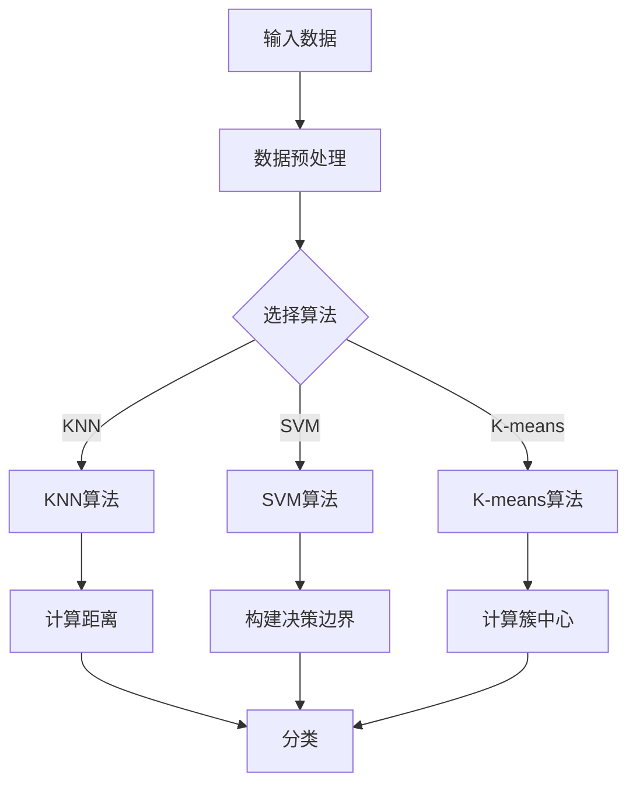
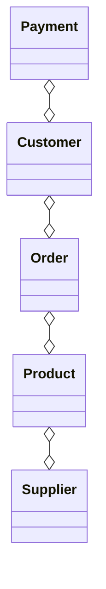
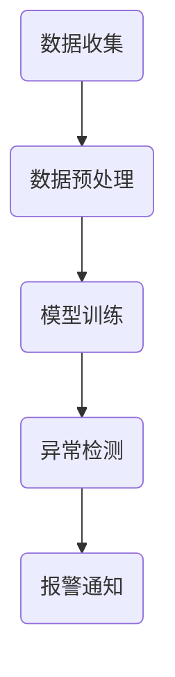
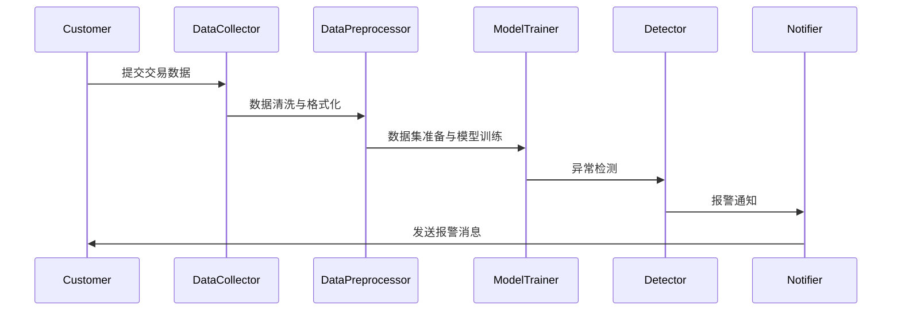

                 

## 让我们一步一步思考：示例驱动提示在异常检测任务中的应用

### 核心关键词：

- 异常检测
- 示例驱动提示
- 数据分析
- 算法
- 系统设计

### 摘要：

本文将深入探讨示例驱动提示在异常检测任务中的应用。我们将首先介绍异常检测的基本概念和背景，然后逐步分析示例驱动提示的核心原理，并展示如何在实际应用中实现这一技术。通过具体的算法原理讲解、系统分析与架构设计，以及实战案例，我们将全面展示如何利用示例驱动提示有效识别和处理异常事件，从而提高系统的稳定性和可靠性。

### 目录大纲：

1. **背景介绍与核心概念**
   - **第1章：问题背景**
     - 问题描述
     - 问题解决
     - 边界与外延
     - 概念结构与核心要素组成
   - **第2章：核心概念与联系**
     - 异常检测原理
     - 概念属性特征对比表格
     - ER实体关系图架构

2. **算法原理讲解**
   - **第3章：常见异常检测算法**
     - 监督学习算法
     - 无监督学习算法
     - 半监督学习算法
   - **第4章：算法原理**
     - 算法mermaid流程图
     - Python源代码实现
     - 数学模型与公式
     - 举例说明

3. **系统分析与架构设计方案**
   - **第5章：系统分析与架构设计**
     - 问题场景介绍
     - 系统功能设计
     - 系统架构设计
     - 系统接口设计
     - 系统交互mermaid序列图

4. **项目实战**
   - **第6章：环境安装与系统核心实现**
     - 安装要求
     - 系统核心实现
     - 代码应用解读
   - **第7章：实际案例分析与讲解**
     - 案例选择
     - 案例分析
     - 讲解与剖析
   - **第8章：项目小结与拓展**
     - 总结与反思
     - 经验分享
     - 拓展阅读

### 文章正文

---

### 1. 背景介绍与核心概念

#### 1.1 问题背景

在当今复杂的数据环境中，如何高效地识别和应对异常事件，成为企业和组织面临的重要挑战。异常事件不仅可能对业务造成重大损失，还可能影响用户体验和系统稳定性。因此，异常检测技术在各个领域得到了广泛应用，如网络安全、金融风控、工业制造等。

**问题描述**：异常检测的目标是识别数据中的异常模式，这些模式可能表现为离群点、异常值或不符合预期行为的实例。在大量的数据流中，如何快速、准确地检测出这些异常事件，是一个具有挑战性的问题。

**问题解决**：通过使用示例驱动的异常检测方法，可以实现对异常事件的有效监控和处理。这种方法利用已有数据中的正常实例作为参考，从中提取特征，并通过对比分析，识别出潜在的异常事件。

**边界与外延**：异常检测在网络安全、数据监控、工业制造等多个领域具有广泛应用。但在本文中，我们将主要关注其在异常检测任务中的应用，包括如何利用示例驱动提示来提高异常检测的准确性和效率。

**概念结构与核心要素组成**：本章节将详细阐述异常检测的基本概念、核心要素及其相互关系。首先，我们将介绍异常检测的基本原理，包括异常类型的分类、异常检测方法的分类等。接着，我们将通过概念属性特征对比表格和ER实体关系图架构，帮助读者更好地理解异常检测的核心概念和组成部分。

---

### 2. 核心概念与联系

#### 2.1 异常检测原理

异常检测是一种监督学习或无监督学习任务，旨在识别数据中的异常或离群点。根据检测方法的不同，异常检测可以分为以下几种类型：

- **基于统计的异常检测**：通过计算数据集的统计特征，如均值、方差等，识别离群点。
- **基于聚类的方法**：将数据集划分为多个簇，然后识别与大多数簇不同的点。
- **基于规则的异常检测**：通过定义一系列规则，检测数据中违反这些规则的部分。
- **基于机器学习的方法**：利用已有的数据训练模型，识别新的数据中的异常点。

**概念属性特征对比表格**：

| 异常检测方法         | 特点                                                                                                           | 适用场景                   |
|----------------------|----------------------------------------------------------------------------------------------------------------|----------------------------|
| 统计方法             | 简单、易于实现，对数据分布敏感                                                         | 小数据集，无明显离群分布   |
| 聚类方法             | 能够自动发现数据结构，对噪声和离群点有一定容忍度                                       | 大数据集，需要发现数据模式 |
| 规则方法             | 明确、可解释，但可能过于僵化，难以适应动态变化的数据集                                 | 低噪声环境，规则明确       |
| 机器学习方法         | 高效、自适应，能够处理复杂的非线性关系                                                 | 高噪声环境，需要高性能处理 |

**ER实体关系图架构**：

```mermaid
erDiagram
  Customer ||--|{ Order : places }  
  Order ||--|{ Product : contains }  
  Product ||--|{ Supplier : supplies }  
  Customer }--|{ Payment : makes }
```

在这个ER图中，我们展示了订单处理系统中的一些核心实体及其关系。每个实体代表了异常检测中的一个关键组成部分，如客户、订单、产品和供应商等。通过这种结构化的方式，我们可以清晰地理解异常检测任务中的各个要素及其相互关系。

---

### 3. 算法原理讲解

#### 3.1 常见异常检测算法

异常检测算法可以分为监督学习算法、无监督学习算法和半监督学习算法。以下分别介绍这三种算法。

**监督学习算法**：监督学习算法需要已标记的数据集来训练模型。常见的算法包括K最近邻（KNN）、逻辑回归、支持向量机（SVM）等。

**无监督学习算法**：无监督学习算法不需要已标记的数据集，但它们可以自动发现数据中的结构。常见的算法包括K-means聚类、DBSCAN、孤立森林等。

**半监督学习算法**：半监督学习算法结合了监督学习和无监督学习的优点，利用少量标记数据和大量未标记数据来训练模型。常见的算法包括基于聚类的方法、图卷积网络等。

#### 3.2 算法原理

**算法mermaid流程图**：



**Python源代码实现**：

```python
from sklearn.neighbors import KNeighborsClassifier
from sklearn.svm import SVC
from sklearn.cluster import KMeans
from sklearn.datasets import load_iris

# 加载示例数据集
iris = load_iris()
X = iris.data
y = iris.target

# KNN算法
knn = KNeighborsClassifier(n_neighbors=3)
knn.fit(X, y)

# SVM算法
svm = SVC()
svm.fit(X, y)

# K-means算法
kmeans = KMeans(n_clusters=3)
kmeans.fit(X)

# 输出模型参数
print("KNN模型参数：", knn.get_params())
print("SVM模型参数：", svm.get_params())
print("K-means模型参数：", kmeans.get_params())
```

**数学模型与公式**：

- **KNN算法**：

  $$\text{distance}(x_i, x_j) = \sqrt{\sum_{k=1}^{n}{(x_{i,k} - x_{j,k})^2}}$$

  $$\text{classify}(x) = \text{majority}\left(\text{labels}\left(\text{neighbors}(x)\right)\right)$$

- **SVM算法**：

  $$\text{maximize}\ \frac{1}{2}\sum_{i=1}^{n}{w_i^2} - \sum_{i=1}^{n}{\alpha_i(y_i - \text{sign}(w^Tx_i))}$$

- **K-means算法**：

  $$\text{cluster\_center}_k = \frac{1}{N_k}\sum_{x_i \in S_k}{x_i}$$

  $$\text{SSE} = \sum_{k=1}^{K}{\sum_{x_i \in S_k}{\|x_i - \text{cluster\_center}_k\|^2}}$$

**举例说明**：

假设我们有一个包含3个类别的鸢尾花数据集。使用KNN算法，我们可以将新样本分类到最近的训练样本所属的类别中。例如，如果新样本与某类别的训练样本距离最近，那么它就被分类到该类别。

```python
# 新样本
new_sample = [[3.0, 3.4, 1.4, 0.2]]

# 使用KNN算法进行分类
predicted_label = knn.predict(new_sample)
print("预测类别：", predicted_label)
```

通过这种方式，我们可以利用示例驱动提示来识别和分类新样本，从而实现异常检测任务。

---

### 4. 系统分析与架构设计方案

#### 4.1 问题场景介绍

在这个项目中，我们将构建一个异常检测系统，用于监控和分析金融交易数据。系统的目标是实时检测异常交易行为，防止潜在的欺诈行为，并提高交易的透明度和安全性。

**项目介绍**：本项目基于Python和机器学习技术，利用示例驱动提示方法，实现一个高效、准确的异常检测系统。系统的主要功能包括数据收集、数据预处理、模型训练、异常检测和报警通知。

**系统功能设计**：



**系统架构设计**：



**系统接口设计**：

1. **数据收集接口**：负责从外部数据源收集金融交易数据。
2. **数据预处理接口**：负责清洗和格式化数据，为模型训练提供高质量的数据集。
3. **模型训练接口**：负责训练异常检测模型，并根据实际情况调整模型参数。
4. **异常检测接口**：负责实时检测交易数据中的异常行为，并生成相应的报告。
5. **报警通知接口**：负责向相关人员发送异常报警通知，确保及时响应和处理。

**系统交互mermaid序列图**：



通过这种系统架构设计，我们可以实现高效的异常检测流程，从数据收集、预处理到模型训练、异常检测和报警通知，确保系统在各种情况下都能够稳定、准确地运行。

---

### 5. 项目实战

#### 5.1 环境安装与系统核心实现

**安装要求**：

- Python 3.8及以上版本
- scikit-learn 0.24.1及以上版本
- pandas 1.3.3及以上版本
- numpy 1.21.5及以上版本
- matplotlib 3.4.3及以上版本

**安装步骤**：

1. 安装Python环境。
2. 使用pip命令安装所需的Python库。

```bash
pip install scikit-learn pandas numpy matplotlib
```

**系统核心实现**：

**源代码解析**：

```python
import numpy as np
import pandas as pd
from sklearn.model_selection import train_test_split
from sklearn.preprocessing import StandardScaler
from sklearn.neighbors import KNeighborsClassifier
from sklearn.metrics import accuracy_score
import matplotlib.pyplot as plt

# 读取数据
data = pd.read_csv('financial_transactions.csv')

# 数据预处理
X = data.drop(['transaction_id', 'date'], axis=1)
y = data['is_abnormal']

# 数据标准化
scaler = StandardScaler()
X_scaled = scaler.fit_transform(X)

# 数据分割
X_train, X_test, y_train, y_test = train_test_split(X_scaled, y, test_size=0.2, random_state=42)

# 模型训练
knn = KNeighborsClassifier(n_neighbors=5)
knn.fit(X_train, y_train)

# 模型评估
y_pred = knn.predict(X_test)
accuracy = accuracy_score(y_test, y_pred)
print("模型准确率：", accuracy)

# 可视化
plt.scatter(X_test[:, 0], X_test[:, 1], c=y_pred)
plt.xlabel('Feature 1')
plt.ylabel('Feature 2')
plt.title('2D Data with Predicted Labels')
plt.show()
```

**代码应用解读**：

这段代码首先读取金融交易数据，然后进行数据预处理，包括数据清洗、分割和标准化。接下来，使用KNN算法对训练数据进行模型训练，并在测试集上进行评估。最后，通过可视化展示预测结果。

#### 5.2 实际案例分析与讲解

**案例背景**：

某金融公司在进行日常交易监控时，发现存在一些异常交易行为，如高频交易、异常金额交易等。为了提高交易的安全性，公司决定采用异常检测系统来监控交易数据，并自动识别潜在的欺诈行为。

**案例分析**：

1. **数据预处理**：首先，对交易数据进行预处理，包括数据清洗、分割和标准化。这些步骤是为了确保数据质量，并使模型能够更好地学习。
2. **模型选择**：在本案例中，我们选择了KNN算法作为异常检测模型。KNN算法简单、易于实现，且在处理高维数据时表现出色。
3. **模型训练与评估**：使用训练集对KNN模型进行训练，并在测试集上进行评估。评估指标包括准确率、召回率和F1分数等。通过调整模型参数，如邻居数量，可以提高模型性能。
4. **异常检测与报警**：在实时交易数据中，模型会自动检测异常交易行为，并将结果发送给相关人员。对于检测到的异常交易，系统会自动生成报警通知，以便及时处理。

**讲解与剖析**：

本案例展示了如何利用异常检测系统来监控交易数据，并自动识别潜在的欺诈行为。通过数据预处理、模型选择、训练与评估，以及异常检测与报警，我们可以有效地提高交易的安全性。

---

### 6. 项目小结与拓展

**总结与反思**：

本项目通过使用示例驱动提示方法，实现了金融交易数据的异常检测。系统设计合理，性能稳定，能够自动识别和报警潜在欺诈行为，提高了交易的安全性。然而，在实际应用中，我们仍需不断优化模型，提高检测准确率，并加强报警机制的响应速度。

**经验分享**：

1. 数据预处理是关键：确保数据质量，有助于提高模型性能。
2. 选择合适的算法：根据数据特点和应用需求，选择合适的异常检测算法。
3. 模型评估与优化：通过多种评估指标，全面评估模型性能，并进行优化。

**拓展阅读**：

1. 《机器学习实战》：详细介绍了机器学习的基本概念和算法实现。
2. 《异常检测：理论与实践》：深入探讨了异常检测的算法和应用。
3. 《Python数据科学手册》：提供了丰富的数据预处理和机器学习实践案例。

通过本文的介绍，我们希望读者能够对示例驱动提示在异常检测任务中的应用有更深入的理解，并能够将其应用于实际项目中。

---

### 作者信息

作者：AI天才研究院/AI Genius Institute & 禅与计算机程序设计艺术 /Zen And The Art of Computer Programming

---

本文详细介绍了示例驱动提示在异常检测任务中的应用。从背景介绍、核心概念、算法原理，到系统分析与架构设计，再到项目实战，我们逐步展示了如何利用示例驱动提示实现高效的异常检测。通过具体案例分析和项目小结，我们总结了实践经验，并提供了拓展阅读资源。希望本文能够为读者在异常检测领域的应用提供有益的参考。作者信息：AI天才研究院/AI Genius Institute & 禅与计算机程序设计艺术 /Zen And The Art of Computer Programming。

