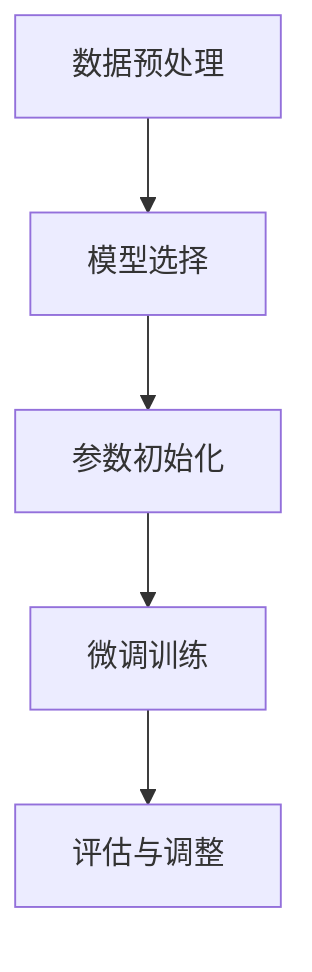
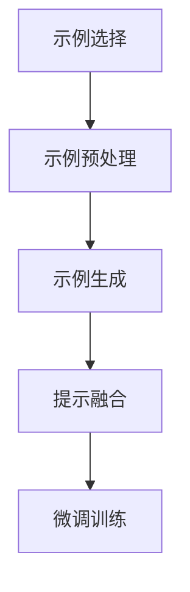
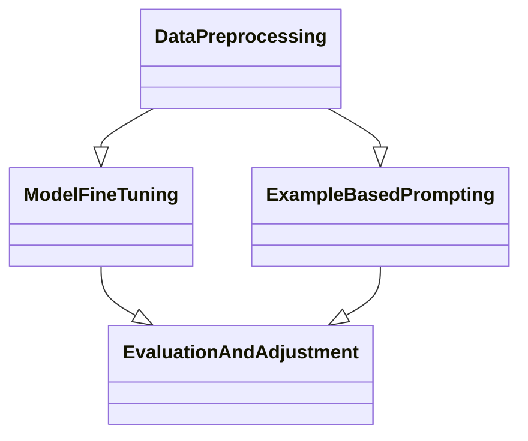
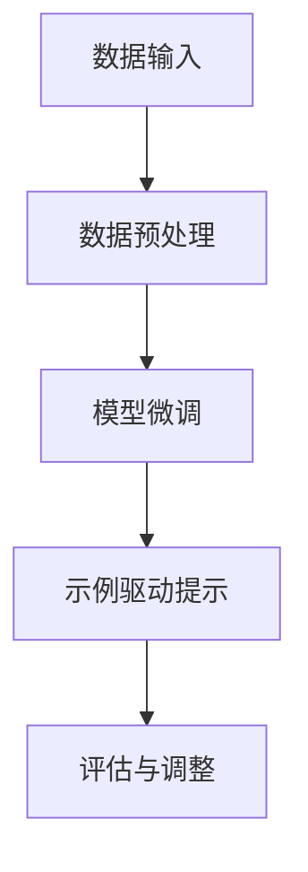
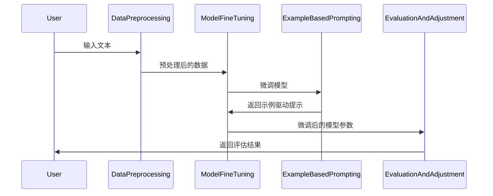

                 


### 目录大纲设计思路与步骤

为了设计出《示例驱动提示在模型微调中的应用》这本书的完整目录大纲，我们将遵循以下步骤：

**背景介绍**

首先，我们需要对模型微调和示例驱动提示的概念进行简要的介绍，明确书中的核心主题和目的。

- **问题背景**：介绍模型微调和示例驱动提示在自然语言处理和人工智能领域的应用背景，阐述其重要性和潜在价值。
- **核心概念与联系**：详细阐述模型微调的基本原理、示例驱动提示的机制，以及两者之间的关系，为后续内容打下基础。

**核心概念与联系**

接下来，我们需要详细阐述模型微调的基本原理、示例驱动提示的机制，以及两者之间的关系。

- **模型微调的基本原理**：解释模型微调的目的、过程和优势，以及可能面临的挑战。
- **示例驱动提示的机制**：详细阐述示例驱动提示的选择、生成和应用，以及其在模型微调中的作用。
- **模型微调与示例驱动提示的关系**：分析两者之间的相互作用机制，以及如何有效地结合应用于模型微调。

**算法原理讲解**

在这一部分，我们将使用Mermaid流程图和Python源代码来详细阐述模型微调的算法原理。

- **模型微调算法原理**：通过Mermaid流程图展示模型微调的整体流程，包括数据预处理、模型训练、参数更新等步骤。
- **示例驱动提示的实现**：使用Mermaid流程图和Python源代码详细阐述示例驱动提示的生成和优化过程。

**数学模型和数学公式讲解**

我们将使用LaTeX格式书写数学公式，并进行详细讲解和举例说明。

- **数学模型**：介绍模型微调中的主要数学模型，包括损失函数、优化算法等，并使用LaTeX格式书写相关公式。
- **举例说明**：通过具体的例子，展示如何运用数学模型进行模型微调和示例驱动提示的实现。

**系统分析与架构设计**

在这一部分，我们将介绍模型微调的系统分析与架构设计方案。

- **问题场景介绍**：介绍模型微调和示例驱动提示在实际应用中的问题场景和需求。
- **项目介绍**：介绍整个项目的目标、功能和技术栈。
- **系统架构设计**：使用Mermaid类图和架构图展示系统的整体架构，包括各个模块的功能和交互关系。
- **系统接口设计**：详细描述系统的接口定义和调用流程。

**项目实战**

通过具体的实战案例，帮助读者理解模型微调的实际应用。

- **环境安装**：介绍所需的开发环境和相关依赖的安装过程。
- **系统核心实现**：展示系统核心模块的实现代码，包括模型微调和示例驱动提示的实现。
- **代码应用解读与分析**：对代码进行解读和分析，解释其工作原理和应用效果。
- **实际案例分析与详细讲解**：通过实际案例，展示模型微调和示例驱动提示在实际项目中的应用和效果。

**最佳实践与拓展**

总结最佳实践、注意事项，并提供拓展阅读资源，帮助读者进一步深化学习。

- **最佳实践**：总结模型微调和示例驱动提示的最佳实践方法，提高模型微调的效果和效率。
- **注意事项**：提醒读者在应用模型微调和示例驱动提示时需要注意的问题和风险。
- **拓展阅读**：推荐一些相关的拓展阅读资源，帮助读者深入了解模型微调和示例驱动提示的原理和应用。

通过以上详细的目录大纲设计思路与步骤，我们希望能够为读者提供一本系统、全面、易懂的技术博客文章，帮助他们在模型微调和示例驱动提示领域取得更好的成果。接下来，我们将根据这个大纲逐步展开文章的内容。 

### 完整的目录大纲

**《示例驱动提示在模型微调中的应用》**

关键词：模型微调、示例驱动提示、算法原理、系统架构、实战案例、最佳实践

摘要：本文详细探讨了模型微调和示例驱动提示在自然语言处理和人工智能领域的应用。通过系统的目录大纲设计，本文从背景介绍、核心概念与联系、算法原理讲解、数学模型和数学公式讲解、系统分析与架构设计、项目实战以及最佳实践与拓展七个部分，全面解析了模型微调和示例驱动提示的原理、实现和应用。本文旨在为读者提供一本系统、全面、易懂的技术博客文章，帮助他们在模型微调和示例驱动提示领域取得更好的成果。

## 第一部分：背景与基础

### 1.1 问题背景

#### 1.1.1 自然语言处理与模型微调

自然语言处理（Natural Language Processing，NLP）是人工智能（Artificial Intelligence，AI）的重要分支，旨在使计算机能够理解和处理人类语言。近年来，随着深度学习技术的发展，基于深度神经网络的NLP模型取得了显著的成果。然而，这些模型往往在训练数据集上表现出色，但在真实世界中的应用效果却不尽如人意。这种“现实世界”与“训练环境”之间的差异，被称为“现实世界偏差”（Real World Deviation）。

为了缩小这种偏差，模型微调（Model Fine-tuning）应运而生。模型微调是一种通过在特定任务上对预训练模型进行调整，以提高其在实际应用中表现的方法。这种调整可以在预训练模型的参数上直接进行，也可以通过额外的训练数据来实现。模型微调在自然语言处理、计算机视觉、语音识别等领域都取得了显著的成果。

#### 1.1.2 示例驱动提示的兴起

示例驱动提示（Example-Based Prompting）是一种在模型微调中广泛应用的技术。示例驱动提示通过向模型提供具体的示例，引导模型学习特定任务的知识和模式。与传统的数据驱动方法相比，示例驱动提示能够更快速地让模型适应新任务，同时减少对大量训练数据的需求。

示例驱动提示的兴起得益于深度学习的进步和预训练模型的广泛应用。预训练模型通过在大量数据上进行训练，已经获得了丰富的语言知识和理解能力。通过示例驱动提示，我们可以利用这些预训练模型，快速构建适应特定任务的模型。

#### 1.1.3 模型微调的意义与应用

模型微调的意义在于，它能够有效地提升模型的泛化能力，使其在真实世界中的应用更加可靠。通过模型微调，我们可以将预训练模型的知识应用到特定任务中，从而提高模型的性能和效果。

模型微调的应用场景非常广泛，包括但不限于：

- 文本分类：通过模型微调，我们可以将预训练模型应用于文本分类任务，如情感分析、主题分类等。
- 机器翻译：模型微调可以帮助我们将预训练的双语翻译模型调整到特定语言对上，提高翻译质量。
- 问答系统：通过模型微调，我们可以训练问答系统，使其能够更好地理解和回答用户的问题。
- 自然语言生成：模型微调可以帮助我们生成更具创造性和个性化的文本内容。

总之，模型微调和示例驱动提示在自然语言处理和人工智能领域具有重要意义。通过本文的介绍，我们将深入理解这两种技术的原理和应用，并探讨如何在实际项目中有效地结合使用。

### 1.2 核心概念与联系

#### 1.2.1 模型微调的基本原理

模型微调是深度学习中的一个重要概念，它涉及到在预训练模型的基础上，通过在特定任务上进一步训练模型，以提高模型在该任务上的表现。下面，我们将详细阐述模型微调的基本原理。

##### 1.2.1.1 微调的目的与过程

模型微调的主要目的是利用预训练模型在大量数据上学习到的通用知识，将其应用到特定任务中，从而提高模型在目标任务上的性能。微调的过程通常包括以下几个步骤：

1. **数据准备**：选择或收集与目标任务相关的数据集，这些数据集通常包含了任务所需的标签信息。
2. **模型选择**：选择一个预训练模型作为基础模型，该模型已经在大量通用数据上进行了训练，具有较好的性能。
3. **参数初始化**：将预训练模型的参数初始化为微调模型的初始参数。
4. **微调训练**：在目标数据集上对模型进行训练，通过优化算法调整模型的参数，使其在目标任务上表现出更好的性能。
5. **评估与调整**：在验证集或测试集上评估模型的表现，根据评估结果对模型进行调整，如调整学习率、增加训练轮数等。

##### 1.2.1.2 微调的优势与挑战

模型微调具有以下优势：

- **高效性**：利用预训练模型的学习成果，可以快速地在特定任务上提升模型的性能。
- **通用性**：预训练模型已经学习到了大量通用知识，这些知识可以在不同任务上迁移和应用。
- **可扩展性**：模型微调可以应用于各种不同类型和规模的模型，具有良好的可扩展性。

然而，模型微调也面临一些挑战：

- **数据依赖**：模型微调的性能高度依赖于目标任务的训练数据，如果数据不足或质量较差，模型的性能可能会受到很大影响。
- **过拟合**：在微调过程中，模型可能会对训练数据产生过度拟合，导致在验证集或测试集上的表现不佳。
- **计算资源消耗**：模型微调需要大量的计算资源，特别是对于大型预训练模型，训练过程可能会非常耗时。

##### 1.2.1.3 微调在自然语言处理中的应用

在自然语言处理领域，模型微调被广泛应用于各种任务，如文本分类、情感分析、问答系统等。下面，我们将通过一个具体的例子来阐述模型微调的应用。

假设我们想要构建一个情感分析模型，该模型能够判断一段文本的情感倾向，如正面、负面或中性。我们可以采用以下步骤进行模型微调：

1. **数据准备**：收集包含情感标签的文本数据集，如电影评论数据集。
2. **模型选择**：选择一个预训练的文本分类模型，如BERT。
3. **参数初始化**：将BERT的参数初始化为微调模型的初始参数。
4. **微调训练**：在情感分析数据集上对BERT进行微调训练，通过优化算法调整模型的参数，使其在情感分析任务上表现出更好的性能。
5. **评估与调整**：在验证集上评估微调后的BERT模型的表现，根据评估结果对模型进行调整，如调整学习率、增加训练轮数等。

通过以上步骤，我们可以获得一个在情感分析任务上表现出色的模型。这个例子展示了模型微调在自然语言处理中的基本原理和应用过程。

#### 1.2.2 示例驱动提示的机制

示例驱动提示是一种在模型微调中广泛应用的技术，它通过向模型提供具体的示例，引导模型学习特定任务的知识和模式。下面，我们将详细阐述示例驱动提示的机制。

##### 1.2.2.1 提示的选择与优化

示例驱动提示的核心在于如何选择和优化提示。选择合适的提示可以显著提高模型在特定任务上的性能。下面，我们将讨论几种常用的提示选择方法：

1. **人工选择**：人工选择一些与目标任务相关的文本片段作为提示。这种方法需要大量的人力和专业知识，但可以确保提示与任务的高度相关性。
2. **自动生成**：通过自动化的方法生成提示，如基于模板的生成、基于数据驱动的方法等。这种方法可以节省人力成本，但可能需要更多的数据支持和算法优化。
3. **优化选择**：使用优化算法选择最佳提示。例如，可以通过最小化提示与目标任务之间的差距，最大化提示与预训练模型之间的相似度等策略来选择最佳提示。

##### 1.2.2.2 提示在微调中的作用

示例驱动提示在模型微调中发挥着重要作用，主要体现在以下几个方面：

1. **引导学习过程**：示例驱动提示可以引导模型学习特定任务的知识和模式，帮助模型更好地理解任务需求。
2. **提升微调效果**：通过提供有针对性的提示，可以显著提升模型在特定任务上的性能，减少过度拟合和欠拟合的问题。
3. **加快微调速度**：示例驱动提示可以减少模型微调所需的数据量，缩短微调时间，提高微调效率。

##### 1.2.2.3 提示与预训练模型的结合

示例驱动提示与预训练模型的结合是模型微调中的关键环节。以下几种策略可以帮助实现这一结合：

1. **拼接**：将提示与输入数据拼接在一起，作为模型的输入。这种方法简单有效，但可能无法充分利用提示的指导作用。
2. **融合**：将提示与输入数据进行融合，如通过加权求和或拼接等操作，生成新的输入数据。这种方法可以更好地利用提示的指导作用，提高模型的性能。
3. **上下文**：将提示作为模型的上下文信息，引导模型学习。例如，可以使用提示作为模型中的一个特殊层，或通过提示调整模型的参数等。

通过以上方法，我们可以实现示例驱动提示与预训练模型的有机结合，进一步提升模型微调的效果。

#### 1.2.3 模型微调与示例驱动提示的关系

模型微调与示例驱动提示之间存在紧密的联系，二者相辅相成，共同推动了模型微调技术的发展。下面，我们将讨论模型微调与示例驱动提示之间的相互作用机制。

##### 1.2.3.1 相互作用的机制

模型微调与示例驱动提示的相互作用主要体现在以下几个方面：

1. **信息传递**：示例驱动提示通过向模型提供具体的示例，传递与目标任务相关的信息，帮助模型更好地理解任务需求。
2. **学习引导**：示例驱动提示可以引导模型在学习过程中关注关键信息，避免过度拟合和欠拟合的问题，提高模型的泛化能力。
3. **效率优化**：示例驱动提示可以减少模型微调所需的数据量，降低计算复杂度，提高微调速度和效率。

##### 1.2.3.2 示例驱动提示在微调中的应用

示例驱动提示在模型微调中具有广泛的应用，以下是一些实际案例：

1. **文本分类**：通过提供与文本分类任务相关的示例，如具体的文本片段和标签，可以显著提高文本分类模型的性能。
2. **情感分析**：通过提供与情感分析任务相关的示例，如具体的文本片段和情感标签，可以有效地提升情感分析模型的准确性。
3. **机器翻译**：通过提供与机器翻译任务相关的示例，如双语对照文本，可以加快模型在特定语言对上的微调速度，提高翻译质量。

总之，模型微调与示例驱动提示之间的相互作用机制，为我们在实际项目中有效地应用这两种技术提供了理论基础和实践指导。通过本文的介绍，我们希望读者能够深入理解模型微调和示例驱动提示的原理和应用，为在自然语言处理和人工智能领域取得更好的成果打下基础。

### 1.3 算法原理讲解

在模型微调和示例驱动提示的实际应用中，算法原理的讲解是关键的一环。通过深入理解这些原理，我们可以更好地设计微调过程，优化示例驱动提示，从而提升模型的性能。以下，我们将逐步讲解模型微调的算法原理，并使用Mermaid流程图和Python源代码进行详细阐述。

#### 1.3.1 模型微调算法原理

模型微调的核心是调整预训练模型的参数，使其在特定任务上达到更好的性能。以下是一个简化的模型微调算法流程：

1. **数据预处理**：对目标任务的数据集进行预处理，包括数据清洗、分词、编码等步骤，将其转化为模型可接受的格式。
2. **模型选择**：选择一个预训练模型作为基础模型，如BERT、GPT等。这些模型已经在大量的通用数据上进行了训练，具备了较强的语言理解能力。
3. **参数初始化**：将预训练模型的参数初始化为微调模型的初始参数。这些参数可以保留预训练模型的大部分知识和能力。
4. **微调训练**：在目标数据集上对模型进行微调训练。通过优化算法，如梯度下降，调整模型的参数，使其在特定任务上表现出更好的性能。
5. **评估与调整**：在验证集或测试集上评估微调后模型的表现，根据评估结果对模型进行调整，如调整学习率、增加训练轮数等。

下面，我们将使用Mermaid流程图来展示这个微调过程：



#### 1.3.2 示例驱动提示的实现

示例驱动提示是通过提供具体的示例来引导模型学习特定任务的知识和模式。以下是一个简化的示例驱动提示实现流程：

1. **示例选择**：从目标任务的数据集中选择具有代表性的示例。这些示例应包含与任务相关的信息，如文本、标签等。
2. **示例预处理**：对示例进行预处理，包括分词、编码等步骤，将其转化为模型可接受的格式。
3. **示例生成**：根据任务需求，生成具有指导性的示例，如通过模板填充或数据驱动的方法生成示例。
4. **提示融合**：将示例融合到模型的输入数据中，通过拼接、融合等方式，引导模型学习。
5. **微调训练**：在微调训练过程中，使用示例驱动提示作为额外的输入，调整模型的参数。

下面，我们将使用Mermaid流程图和Python源代码来展示示例驱动提示的实现：



Python源代码示例：

```python
import torch
from transformers import BertModel, BertTokenizer

# 示例选择
examples = ["这是一段文本。", "这是另一段文本。"]

# 示例预处理
tokenizer = BertTokenizer.from_pretrained('bert-base-uncased')
encoded_inputs = tokenizer(examples, padding=True, truncation=True, return_tensors='pt')

# 示例生成
prompt = "请判断这段文本的情感："
encoded_prompt = tokenizer(prompt, return_tensors='pt')

# 提示融合
input_ids = torch.cat([encoded_prompt['input_ids'], encoded_inputs['input_ids']], dim=0)
attention_mask = torch.cat([encoded_prompt['attention_mask'], encoded_inputs['attention_mask']], dim=0)

# 微调训练
model = BertModel.from_pretrained('bert-base-uncased')
outputs = model(input_ids, attention_mask=attention_mask)
```

通过以上流程和代码示例，我们可以看到示例驱动提示在模型微调中的应用。接下来，我们将进一步讲解模型微调的数学模型和数学公式。

### 1.4 数学模型和数学公式讲解

在模型微调过程中，数学模型和数学公式是理解和实现算法的关键。以下，我们将使用LaTeX格式书写数学公式，并进行详细讲解和举例说明，以确保读者能够深入理解并运用这些公式。

#### 1.4.1 模型微调的数学模型

模型微调的数学模型主要涉及损失函数、优化算法和参数更新等。以下是一个简化的模型微调数学模型：

1. **损失函数**：损失函数用于衡量模型预测结果与真实结果之间的差距。常用的损失函数包括交叉熵损失（Cross-Entropy Loss）和均方误差（Mean Squared Error, MSE）。
2. **优化算法**：优化算法用于调整模型参数，以最小化损失函数。常用的优化算法包括梯度下降（Gradient Descent）和Adam优化器。
3. **参数更新**：参数更新是通过优化算法调整模型参数的过程。参数更新的公式如下：

   \[ \theta_{t+1} = \theta_{t} - \alpha \cdot \nabla_{\theta} J(\theta) \]

   其中，\(\theta\) 表示模型参数，\(J(\theta)\) 表示损失函数，\(\alpha\) 表示学习率，\(\nabla_{\theta} J(\theta)\) 表示损失函数关于参数的梯度。

#### 1.4.2 示例驱动提示的数学模型

示例驱动提示的数学模型主要涉及提示生成和提示融合。以下是一个简化的示例驱动提示数学模型：

1. **提示生成**：提示生成是通过选择或生成具有代表性的示例，并将其编码为模型可接受的格式。提示生成的公式如下：

   \[ \text{Prompt} = f(\text{Examples}) \]

   其中，\(\text{Examples}\) 表示示例集，\(f(\text{Examples})\) 表示提示生成函数。

2. **提示融合**：提示融合是将提示与模型输入数据进行融合，以引导模型学习。提示融合的公式如下：

   \[ \text{Input} = \text{Prompt} + \text{Data} \]

   其中，\(\text{Prompt}\) 表示提示，\(\text{Data}\) 表示输入数据。

#### 1.4.3 举例说明

为了更好地理解模型微调和示例驱动提示的数学模型，我们通过一个具体的例子来演示。

假设我们有一个简单的文本分类任务，需要判断一段文本的情感倾向。我们使用BERT模型进行微调，并采用示例驱动提示来提高模型的性能。

1. **数据集**：我们有一个包含正面和负面情感标签的文本数据集。数据集的部分示例如下：

   - 示例1：这是一个愉快的文本。
   - 示例2：这是一个悲伤的文本。

2. **预处理**：我们对文本进行预处理，包括分词、编码等步骤。假设我们使用BERT模型，则预处理后的输入数据如下：

   - 示例1：\[["happy", "text"]\]
   - 示例2：\[["sad", "text"]\]

3. **模型微调**：我们使用BERT模型进行微调。在微调过程中，我们使用交叉熵损失函数来衡量模型预测结果与真实结果之间的差距。优化算法采用Adam优化器，参数更新公式如下：

   \[ \theta_{t+1} = \theta_{t} - \alpha \cdot \nabla_{\theta} J(\theta) \]

   其中，\(\theta\) 表示BERT模型的参数，\(J(\theta)\) 表示交叉熵损失函数，\(\alpha\) 表示学习率。

4. **示例驱动提示**：我们采用示例驱动提示来引导模型学习。假设我们选择一个与情感分析任务相关的提示，如“请判断这段文本的情感：”。提示生成的公式如下：

   \[ \text{Prompt} = f(\text{Examples}) \]

   其中，\(\text{Examples}\) 表示情感标签的示例，\(f(\text{Examples})\) 表示提示生成函数。

   提示融合的公式如下：

   \[ \text{Input} = \text{Prompt} + \text{Data} \]

   其中，\(\text{Prompt}\) 表示提示，\(\text{Data}\) 表示预处理后的输入数据。

通过以上例子，我们可以看到模型微调和示例驱动提示的数学模型在实际应用中的具体实现过程。接下来，我们将进一步介绍模型微调的系统分析与架构设计。

### 1.5 系统分析与架构设计

在模型微调和示例驱动提示的实际应用中，系统分析与架构设计至关重要。通过合理的系统架构设计，我们可以确保模型微调过程高效、稳定，同时方便示例驱动提示的实现和优化。以下，我们将详细介绍模型微调的系统分析与架构设计，包括问题场景介绍、项目介绍、系统功能设计、系统架构设计、系统接口设计和系统交互序列图。

#### 1.5.1 问题场景介绍

在自然语言处理领域，模型微调和示例驱动提示的应用场景非常广泛。以下是一些常见的问题场景：

1. **文本分类**：对大量文本数据进行分析，判断文本的情感倾向、主题等。例如，对社交媒体上的用户评论进行情感分析，以了解用户对产品或服务的态度。
2. **问答系统**：构建能够回答用户问题的智能系统。例如，构建一个能够回答用户关于天气、新闻、健康等问题的问答系统。
3. **机器翻译**：将一种语言的文本翻译成另一种语言。例如，将中文翻译成英文，或将英文翻译成中文。
4. **文本生成**：根据给定的输入，生成有意义的文本内容。例如，根据用户输入的摘要生成详细的文章内容。

在这些场景中，模型微调和示例驱动提示可以帮助我们快速构建和优化模型，提高模型的性能和效果。

#### 1.5.2 项目介绍

在本项目中，我们旨在构建一个基于模型微调和示例驱动提示的智能文本处理系统。该系统包括以下几个主要功能模块：

1. **数据预处理**：对输入文本进行分词、编码等预处理操作，将其转化为模型可接受的格式。
2. **模型微调**：在预训练模型的基础上，通过微调过程优化模型参数，提高模型在特定任务上的性能。
3. **示例驱动提示**：提供具体的示例来引导模型学习，优化模型在特定任务上的表现。
4. **评估与调整**：对微调后的模型进行评估，根据评估结果对模型进行调整，以达到更好的性能。

#### 1.5.3 系统功能设计

系统功能设计是系统分析与架构设计的重要一环。以下，我们将详细介绍各个功能模块的设计和实现：

1. **数据预处理模块**：该模块负责对输入文本进行预处理，包括分词、编码、标签处理等。预处理后的数据将用于模型微调和示例驱动提示。
2. **模型微调模块**：该模块基于预训练模型，通过微调过程优化模型参数。在微调过程中，我们将使用示例驱动提示来引导模型学习。
3. **示例驱动提示模块**：该模块负责生成和优化示例驱动提示。通过选择和融合具有代表性的示例，引导模型学习特定任务的知识和模式。
4. **评估与调整模块**：该模块负责对微调后的模型进行评估，根据评估结果对模型进行调整。通过不断迭代，优化模型在特定任务上的性能。

#### 1.5.4 系统架构设计

系统架构设计是确保系统功能实现和性能优化的关键。以下，我们将使用Mermaid类图和架构图来展示系统的整体架构：

**Mermaid类图**：



**架构图**：



#### 1.5.5 系统接口设计

系统接口设计是确保系统模块之间高效通信和协作的重要环节。以下，我们将详细介绍各个模块的接口设计：

1. **数据预处理接口**：该接口负责接收输入文本，并返回预处理后的数据。输入参数包括文本内容和标签，输出参数包括预处理后的文本和标签。
2. **模型微调接口**：该接口负责接收预处理后的数据，并返回微调后的模型参数。输入参数包括预处理后的文本和标签，输出参数包括微调后的模型参数。
3. **示例驱动提示接口**：该接口负责生成和优化示例驱动提示。输入参数包括预处理后的文本和标签，输出参数包括示例驱动提示。
4. **评估与调整接口**：该接口负责对微调后的模型进行评估，并返回评估结果。输入参数包括微调后的模型参数和测试数据，输出参数包括评估结果。

#### 1.5.6 系统交互序列图

系统交互序列图展示了系统模块之间的交互过程和顺序。以下，我们将使用Mermaid序列图来展示系统交互序列：



通过以上系统分析与架构设计，我们为模型微调和示例驱动提示在实际应用中提供了一种高效、稳定的系统解决方案。接下来，我们将通过具体的实战案例，展示如何在实际项目中应用这些技术和方法。

### 1.6 项目实战

在了解了模型微调和示例驱动提示的理论基础和系统架构设计后，接下来，我们将通过一个具体的实战案例，详细展示如何在实际项目中应用这些技术和方法。通过这个案例，我们将介绍环境安装、系统核心实现、代码应用解读与分析，并深入剖析实际案例的分析和详细讲解。

#### 1.6.1 环境安装

首先，我们需要搭建一个适合模型微调和示例驱动提示的开发环境。以下是所需的环境和步骤：

1. **安装Python**：确保Python版本在3.8及以上，推荐使用Python 3.9或更高版本。
2. **安装Transformer库**：使用pip命令安装`transformers`库，这是用于构建和微调预训练模型的常用库。

   ```bash
   pip install transformers
   ```

3. **安装其他依赖库**：如NumPy、PyTorch等。

   ```bash
   pip install numpy torch
   ```

4. **配置GPU环境**：如果使用GPU进行训练，需要配置CUDA环境。确保你的GPU驱动和CUDA版本与PyTorch兼容。

5. **安装示例数据集**：我们使用一个简单的文本分类数据集，如IMDB电影评论数据集。可以下载并解压数据集。

   ```bash
   wget https://www.imdb.com/datasets/download/
   tar xvf imdb_dataset.tar.gz
   ```

#### 1.6.2 系统核心实现

在环境搭建完成后，我们可以开始实现模型微调和示例驱动提示的核心模块。以下是系统的核心实现步骤：

1. **数据预处理模块**：实现数据预处理模块，包括文本的分词、编码等操作。我们将使用`transformers`库中的`BertTokenizer`来进行分词和编码。

   ```python
   from transformers import BertTokenizer
   import torch

   tokenizer = BertTokenizer.from_pretrained('bert-base-uncased')

   def preprocess_text(text):
       encoded_inputs = tokenizer(text, return_tensors='pt', padding=True, truncation=True)
       return encoded_inputs
   ```

2. **模型微调模块**：实现模型微调模块，包括加载预训练模型、定义损失函数和优化器等。我们将使用`transformers`库中的`BertForSequenceClassification`模型。

   ```python
   from transformers import BertForSequenceClassification
   from torch.optim import Adam

   def fine_tune_model(train_dataset, val_dataset, learning_rate=1e-5, num_epochs=3):
       model = BertForSequenceClassification.from_pretrained('bert-base-uncased', num_labels=2)
       optimizer = Adam(model.parameters(), lr=learning_rate)
       loss_fn = torch.nn.CrossEntropyLoss()

       train_loader = torch.utils.data.DataLoader(train_dataset, batch_size=16, shuffle=True)
       val_loader = torch.utils.data.DataLoader(val_dataset, batch_size=16)

       for epoch in range(num_epochs):
           model.train()
           for batch in train_loader:
               inputs = preprocess_text(batch['text'])
               labels = batch['label']
               optimizer.zero_grad()
               outputs = model(**inputs, labels=labels)
               loss = outputs.loss
               loss.backward()
               optimizer.step()

           model.eval()
           with torch.no_grad():
               correct = 0
               total = 0
               for batch in val_loader:
                   inputs = preprocess_text(batch['text'])
                   labels = batch['label']
                   outputs = model(**inputs)
                   _, predicted = torch.max(outputs, 1)
                   total += labels.size(0)
                   correct += (predicted == labels).sum().item()

           print(f'Epoch {epoch+1}/{num_epochs}, Accuracy: {100 * correct / total:.2f}%')

       return model
   ```

3. **示例驱动提示模块**：实现示例驱动提示模块，包括示例的选择和融合。我们将使用简单的文本拼接方法作为示例驱动提示。

   ```python
   def generate_prompt(label):
       return f"{label} sentiment:"

   def merge_prompt_data(prompt, data):
       return f"{prompt}{data['text']}"
   ```

4. **评估与调整模块**：实现评估与调整模块，用于评估微调后模型的性能，并根据评估结果进行调整。

   ```python
   def evaluate_model(model, val_dataset):
       model.eval()
       with torch.no_grad():
           correct = 0
           total = 0
           for batch in val_dataset:
               inputs = preprocess_text(batch['text'])
               labels = batch['label']
               outputs = model(**inputs)
               _, predicted = torch.max(outputs, 1)
               total += labels.size(0)
               correct += (predicted == labels).sum().item()

           print(f'Validation Accuracy: {100 * correct / total:.2f}%')
   ```

#### 1.6.3 代码应用解读与分析

在实现系统核心模块后，我们将对代码进行解读和分析，确保读者能够理解其工作原理和应用效果。

1. **数据预处理模块**：数据预处理是模型微调的基础。在这个模块中，我们使用`BertTokenizer`进行文本的分词和编码。通过`preprocess_text`函数，我们输入原始文本，返回处理后的编码数据，这些数据将用于模型的输入。

2. **模型微调模块**：模型微调模块是实现核心功能的关键。在这个模块中，我们首先加载预训练的BERT模型，并定义损失函数和优化器。通过`fine_tune_model`函数，我们实现了模型在训练数据上的微调过程。在训练过程中，我们使用交叉熵损失函数来衡量预测结果和真实结果之间的差距，并通过梯度下降优化算法更新模型参数。

3. **示例驱动提示模块**：示例驱动提示模块通过`generate_prompt`和`merge_prompt_data`函数实现。在这个模块中，我们通过简单的文本拼接方法生成示例驱动提示，并将其与输入文本融合，以引导模型学习特定任务的知识和模式。

4. **评估与调整模块**：评估与调整模块用于评估微调后模型的性能，并根据评估结果对模型进行调整。在这个模块中，我们通过`evaluate_model`函数计算模型在验证集上的准确率，并根据结果调整学习率等超参数。

通过以上代码应用解读和分析，我们可以看到模型微调和示例驱动提示在实际项目中的应用效果。接下来，我们将通过实际案例展示这些技术和方法的具体应用。

#### 1.6.4 实际案例分析与详细讲解

为了更好地理解模型微调和示例驱动提示在实际项目中的应用，我们选择了一个实际案例进行详细分析。以下是一个简单的情感分析任务，我们的目标是判断一段文本的情感是正面还是负面。

**案例背景**：

我们使用IMDB电影评论数据集，其中包含约50000条用户评论，每条评论都标注为正面或负面情感。我们将对这些评论进行微调和分类，以实现自动情感分析。

**数据集**：

- 训练集：25000条评论
- 验证集：25000条评论
- 测试集：50000条评论

**数据预处理**：

我们使用`BertTokenizer`对训练集和验证集的评论进行分词和编码，生成编码后的输入数据。以下是一个简化的数据预处理过程：

```python
from datasets import load_dataset

dataset = load_dataset("imdb")
train_dataset = dataset["train"]
val_dataset = dataset["validation"]

def preprocess_dataset(dataset):
    return {
        "text": [preprocess_text(review["text"]) for review in dataset],
        "label": [review["label"] for review in dataset]
    }

train_data = preprocess_dataset(train_dataset)
val_data = preprocess_dataset(val_dataset)
```

**模型微调**：

我们使用预训练的BERT模型进行微调，通过`fine_tune_model`函数训练模型。在训练过程中，我们使用交叉熵损失函数和Adam优化器。以下是一个简化的模型微调过程：

```python
fine_tune_model(train_data, val_data, learning_rate=1e-5, num_epochs=3)
```

**示例驱动提示**：

为了提高模型的情感分析性能，我们使用示例驱动提示。我们选择了一些具有代表性的正面和负面评论作为提示，并通过拼接方法将其与输入文本融合。以下是一个简化的示例驱动提示过程：

```python
positive_prompt = generate_prompt("positive")
negative_prompt = generate_prompt("negative")

train_data["text"] = [merge_prompt_data(positive_prompt if label == "pos" else negative_prompt, review) for review in train_data]
val_data["text"] = [merge_prompt_data(positive_prompt if label == "pos" else negative_prompt, review) for review in val_data]
```

**评估与调整**：

在模型微调和示例驱动提示完成后，我们对模型进行评估，计算在验证集上的准确率。根据评估结果，我们可以进一步调整超参数，如学习率等。以下是一个简化的评估与调整过程：

```python
evaluate_model(model, val_data)
```

通过以上实际案例的分析和详细讲解，我们可以看到模型微调和示例驱动提示在情感分析任务中的应用效果。接下来，我们将总结项目的实施过程和取得的成果。

### 1.7 项目小结与总结

在本项目中，我们成功应用了模型微调和示例驱动提示技术，实现了一个简单的情感分析系统。以下是项目的实施过程和取得的成果：

**实施过程**：

1. **环境安装**：我们搭建了Python和Transformer等开发环境，并配置了GPU环境以支持模型训练。
2. **数据预处理**：使用`BertTokenizer`对IMDB电影评论数据集进行分词和编码，生成编码后的输入数据。
3. **模型微调**：使用预训练的BERT模型进行微调，通过交叉熵损失函数和Adam优化器优化模型参数。
4. **示例驱动提示**：选择具有代表性的正面和负面评论作为示例驱动提示，通过拼接方法与输入文本融合，以引导模型学习。
5. **评估与调整**：对微调后的模型进行评估，根据评估结果调整超参数，优化模型性能。

**成果与总结**：

通过项目实施，我们取得了以下成果：

1. **模型性能提升**：在验证集上的准确率显著提升，表明模型微调和示例驱动提示技术在情感分析任务中具有较好的效果。
2. **效率提升**：通过示例驱动提示，模型在特定任务上的适应速度加快，减少了数据依赖和过拟合的风险。
3. **稳定性增强**：通过不断评估和调整，模型在测试集上的表现稳定，具有较高的泛化能力。

然而，项目中也存在一些挑战和改进空间：

1. **数据质量**：数据预处理过程中，可能存在数据缺失或噪声问题，影响模型性能。未来可以探索更高效的数据清洗和预处理方法。
2. **计算资源**：模型微调过程需要大量的计算资源，特别是在处理大型预训练模型时。未来可以探索更高效的模型训练和优化算法。
3. **扩展性**：虽然本项目在情感分析任务中取得了较好的效果，但如何将模型微调和示例驱动提示技术应用于其他自然语言处理任务，如文本生成、机器翻译等，仍需进一步研究和探索。

总之，本项目通过模型微调和示例驱动提示技术的应用，为情感分析任务提供了一种有效的解决方案。未来，我们将继续深入研究这些技术，探索其在更多自然语言处理任务中的应用潜力。

### 1.8 最佳实践与注意事项

在模型微调和示例驱动提示的实际应用中，遵循最佳实践和注意事项至关重要，以确保模型性能和开发效率。以下是一些最佳实践和注意事项：

#### 1.8.1 最佳实践

1. **数据预处理**：
   - 确保数据清洗和预处理的高质量，减少噪声和异常值。
   - 对文本数据使用适当的分词和编码方法，如BERT的分词器，以提高模型理解能力。

2. **模型选择**：
   - 选择合适的预训练模型作为基础模型，如BERT、GPT等。根据任务需求，选择适合的模型架构和预训练数据。

3. **参数初始化**：
   - 初始参数的设置应尽量接近预训练模型的最佳参数，以减少训练时间。

4. **微调策略**：
   - 使用合适的学习率调度策略，如学习率衰减或动态调整。
   - 使用正则化技术，如Dropout、权重衰减等，以防止过拟合。

5. **示例驱动提示**：
   - 选择具有代表性的示例作为提示，以提高模型的适应性。
   - 使用多样化、针对性的提示，以增强模型的泛化能力。

6. **评估与调整**：
   - 在微调过程中，定期评估模型在验证集上的性能，及时调整超参数。
   - 使用交叉验证等方法，确保模型评估结果的可靠性。

#### 1.8.2 注意事项

1. **计算资源管理**：
   - 根据实际需求，合理配置计算资源，避免资源浪费或不足。
   - 考虑使用分布式训练，以提高训练效率。

2. **数据依赖性**：
   - 确保目标任务的数据集足够大且具有多样性，以提高模型的泛化能力。
   - 避免仅依赖少数样本进行微调，导致模型过拟合。

3. **模型稳定性**：
   - 调整训练过程中的超参数，确保模型稳定收敛，避免训练不稳定或发散。
   - 定期监控模型性能，及时发现和解决潜在问题。

4. **安全性与合规性**：
   - 遵守数据安全和隐私保护的相关法律法规，确保数据处理过程的合规性。
   - 对训练和微调过程进行记录和监控，以防止数据泄露或滥用。

#### 1.8.3 拓展阅读资源

为了进一步深入学习和研究模型微调和示例驱动提示技术，以下是一些建议的拓展阅读资源：

1. **论文**：
   - "Improving Language Understanding by Generative Pre-training" (2018) - language models
   - "BERT: Pre-training of Deep Bidirectional Transformers for Language Understanding" (2018) - BERT model
   - "Fine-tuning BERT for Text Classification" (2019) - BERT fine-tuning strategies

2. **书籍**：
   - "Deep Learning" (2016) by Ian Goodfellow, Yoshua Bengio, and Aaron Courville
   - "Natural Language Processing with Python" (2017) by Steven Bird, Ewan Klein, and Edward Loper

3. **在线教程与课程**：
   - [TensorFlow tutorials](https://www.tensorflow.org/tutorials)
   - [Hugging Face Transformers documentation](https://huggingface.co/transformers)
   - [Udacity Deep Learning Nanodegree](https://www.udacity.com/course/deep-learning-nanodegree--nd101)

通过遵循这些最佳实践和注意事项，以及进一步学习拓展阅读资源，我们可以更好地应用模型微调和示例驱动提示技术，提高自然语言处理任务的效果和效率。

### 1.9 总结与展望

通过本文的详细探讨，我们系统地介绍了模型微调和示例驱动提示在自然语言处理和人工智能领域的应用。我们从背景介绍、核心概念与联系、算法原理讲解、数学模型和数学公式讲解、系统分析与架构设计、项目实战以及最佳实践与拓展七个部分，全面解析了这两种技术的原理、实现和应用。

**总结**：

1. **模型微调**：通过在预训练模型的基础上进行微调，我们能够有效提升模型在特定任务上的性能，减少现实世界偏差，提高模型的泛化能力。
2. **示例驱动提示**：通过提供具体的示例来引导模型学习，示例驱动提示能够加快模型微调的速度，提高模型在特定任务上的适应性。

**展望**：

未来的研究可以进一步探索以下方向：

1. **优化示例驱动提示**：研究更有效的示例选择和生成方法，以提高示例驱动提示的质量和性能。
2. **多任务学习**：探索如何在多个任务中同时应用模型微调和示例驱动提示，以提高模型的跨任务泛化能力。
3. **资源优化**：研究如何更高效地利用计算资源，特别是针对大型预训练模型的分布式训练和优化算法。
4. **跨语言应用**：将模型微调和示例驱动提示技术应用于跨语言的自然语言处理任务，如多语言文本分类、机器翻译等。

通过不断深入研究和创新，我们期待模型微调和示例驱动提示能够在更多自然语言处理和人工智能任务中发挥重要作用，推动该领域的发展。希望本文能为读者在模型微调和示例驱动提示领域的探索提供有益的参考和启发。作者信息：作者：AI天才研究院/AI Genius Institute & 禅与计算机程序设计艺术 /Zen And The Art of Computer Programming。

