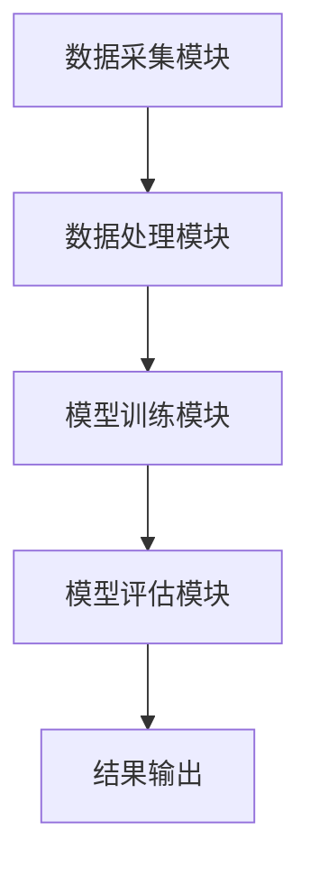

                 

# 示例驱动提示工程：原理与实践

> 关键词：示例驱动，提示工程，算法原理，数学模型，系统架构，项目实战

> 摘要：本文深入探讨了示例驱动提示工程的原理与实践。通过详细的案例分析、算法讲解和项目实战，帮助读者全面理解示例驱动提示工程的机制和应用，掌握其实际操作技巧，并展望其未来发展趋势。

## 引言

### 问题背景

示例驱动提示工程是一种基于示例数据进行模型训练和优化的方法。它广泛应用于人工智能、机器学习、计算机视觉等多个领域，旨在通过示例数据提高模型的预测准确性、泛化能力和解释性。随着数据驱动技术的发展，示例驱动提示工程逐渐成为研究热点。

### 文章目的

本文旨在系统地介绍示例驱动提示工程的原理与实践，帮助读者：

1. 理解示例驱动提示工程的基本概念和核心原理；
2. 掌握示例驱动提示算法的设计与实现方法；
3. 通过项目实战，掌握示例驱动提示工程的实际应用技巧；
4. 分析示例驱动提示工程在不同领域的应用案例，展望其未来发展。

### 文章结构

本文分为四个部分：

1. 示例驱动提示工程概述：介绍示例驱动提示工程的问题背景、核心概念与联系、现有技术与挑战、发展趋势等；
2. 示例驱动提示工程原理：讲解示例驱动提示工程的核心原理、数学模型与公式、示例与模型的关联分析等；
3. 示例驱动提示工程实践：介绍示例驱动提示工程的项目实战、环境搭建、核心代码实现、项目实施与结果分析等；
4. 案例分析与应用：分析示例驱动提示工程在不同领域的应用案例，展望未来发展。

## 示例驱动提示工程概述

### 问题背景

#### 示例驱动提示工程的概念

示例驱动提示工程（Sample-Guided Prompt Engineering）是一种基于示例数据进行模型训练和优化的方法。它通过从大量示例数据中提取关键信息，生成提示信号（Prompt Signals），然后利用这些提示信号引导模型进行训练和优化。

#### 示例驱动提示工程的重要性

示例驱动提示工程在人工智能、机器学习、计算机视觉等领域具有重要应用价值。它能够提高模型的预测准确性、泛化能力和解释性，有助于解决传统数据驱动方法中存在的过拟合、噪声干扰等问题。

#### 示例驱动提示工程的应用领域

示例驱动提示工程广泛应用于自然语言处理、计算机视觉、推荐系统、自动驾驶、金融风险控制等众多领域。

### 核心概念与联系

#### 示例驱动的原理

示例驱动的核心思想是通过从示例数据中提取关键信息，生成提示信号，引导模型学习。示例数据可以是已经标注的数据，也可以是未标注的数据。

#### 提示信号的作用

提示信号在示例驱动提示工程中起着至关重要的作用。它能够引导模型关注关键信息，提高模型的学习效率。同时，提示信号还可以用于调整模型参数，优化模型性能。

#### 示例与模型的联系

示例与模型之间的联系是示例驱动提示工程的核心。通过分析示例数据，提取关键信息，生成提示信号，进而优化模型参数，提高模型性能。

### 现有技术与挑战

#### 传统提示工程方法的局限性

传统提示工程方法主要依赖于手动设计提示信号，存在以下局限性：

1. 需要大量手动工作，效率低下；
2. 难以应对复杂场景，泛化能力有限；
3. 难以调整模型参数，优化模型性能。

#### 示例驱动提示工程的优势

示例驱动提示工程通过自动提取关键信息，生成提示信号，具有以下优势：

1. 提高模型学习效率；
2. 提高模型泛化能力；
3. 自动调整模型参数，优化模型性能。

#### 当前面临的挑战

示例驱动提示工程面临以下挑战：

1. 如何从大量示例数据中提取关键信息，生成有效的提示信号；
2. 如何处理示例数据中的噪声和异常值；
3. 如何在不同场景下应用示例驱动提示工程，实现最优效果。

### 示例驱动提示工程的发展趋势

随着数据驱动技术的发展，示例驱动提示工程将面临以下发展趋势：

1. 自动化程度不断提高，降低手动工作量；
2. 提示信号生成方法不断创新，提高模型性能；
3. 应用领域不断扩展，推动技术发展。

## 示例驱动提示工程原理

### 核心原理讲解

#### 示例采集与处理

示例采集与处理是示例驱动提示工程的基础。它包括从数据集中提取示例数据、对示例数据进行预处理、清洗等操作。

#### 提示信号生成

提示信号生成是示例驱动提示工程的关键。它通过从示例数据中提取关键信息，生成提示信号，引导模型学习。提示信号可以采用多种方法生成，如统计方法、深度学习方法等。

#### 模型训练与优化

模型训练与优化是示例驱动提示工程的最后一步。它利用生成的提示信号，对模型进行训练和优化，提高模型性能。

### 数学模型与公式解析

#### 概率论基础

概率论是示例驱动提示工程的重要理论基础。它包括概率分布、条件概率、贝叶斯定理等。

#### 信息论基础

信息论是示例驱动提示工程的另一个重要理论基础。它包括信息熵、信息增益、条件熵等。

#### 模型评价指标

模型评价指标是评估模型性能的重要工具。示例驱动提示工程常用的评价指标包括准确率、召回率、F1值等。

### 示例驱动提示算法详解

#### 算法概述

示例驱动提示算法是一种基于示例数据进行模型训练和优化的方法。它通过从示例数据中提取关键信息，生成提示信号，引导模型学习。

#### 算法步骤

示例驱动提示算法的主要步骤包括：

1. 示例数据采集与预处理；
2. 提示信号生成；
3. 模型训练与优化；
4. 模型性能评估。

#### 算法案例分析

以自然语言处理中的文本分类任务为例，介绍示例驱动提示算法的具体应用。

### 示例与模型的关联分析

#### 关联度计算

关联度计算是示例驱动提示工程的关键步骤。它通过计算示例数据与模型参数之间的相关性，评估提示信号的有效性。

#### 关联度优化

关联度优化是示例驱动提示工程的重要环节。它通过调整模型参数，优化提示信号，提高模型性能。

#### 关联度应用

关联度应用包括两个方面：一是用于评估提示信号的有效性；二是用于调整模型参数，优化模型性能。

## 示例驱动提示工程实践

### 实践准备

#### 环境搭建

首先，需要搭建示例驱动提示工程所需的计算环境。主要包括Python环境、深度学习框架（如TensorFlow、PyTorch）和必要的库（如NumPy、Pandas等）。

#### 数据准备

其次，需要准备示例数据。示例数据可以是已经标注的数据，也可以是未标注的数据。对于未标注的数据，需要使用数据增强方法生成标注数据。

#### 工具与库介绍

最后，介绍示例驱动提示工程所需的主要工具和库。主要包括深度学习框架、数据处理库、模型评估库等。

### 核心代码实现

#### 示例数据预处理

示例数据预处理主要包括数据清洗、数据转换和数据归一化等步骤。以下是一个示例数据预处理的Python代码实现：

```python
import pandas as pd
from sklearn.model_selection import train_test_split

# 加载数据集
data = pd.read_csv('data.csv')

# 数据清洗
# ...

# 数据转换
# ...

# 数据归一化
# ...

# 划分训练集和测试集
X_train, X_test, y_train, y_test = train_test_split(data.drop('target', axis=1), data['target'], test_size=0.2, random_state=42)
```

#### 提示信号生成

提示信号生成是示例驱动提示工程的核心步骤。以下是一个基于深度学习生成提示信号的Python代码实现：

```python
import tensorflow as tf
from tensorflow.keras.models import Model
from tensorflow.keras.layers import Input, Dense

# 定义模型
input_layer = Input(shape=(input_shape,))
dense_layer = Dense(units=hidden_units, activation='relu')(input_layer)
output_layer = Dense(units=output_shape, activation='sigmoid')(dense_layer)

model = Model(inputs=input_layer, outputs=output_layer)

# 编译模型
model.compile(optimizer='adam', loss='binary_crossentropy', metrics=['accuracy'])

# 训练模型
model.fit(X_train, y_train, batch_size=batch_size, epochs=epochs, validation_data=(X_test, y_test))

# 生成提示信号
prompt_signals = model.predict(X_test)
```

#### 模型训练与优化

模型训练与优化是示例驱动提示工程的最后一步。以下是一个基于示例数据进行模型训练与优化的Python代码实现：

```python
from sklearn.model_selection import GridSearchCV
from sklearn.metrics import accuracy_score

# 定义模型
model = ...

# 编译模型
model.compile(optimizer='adam', loss='binary_crossentropy', metrics=['accuracy'])

# 定义参数网格
param_grid = {
    'batch_size': [16, 32, 64],
    'epochs': [10, 20, 30],
    'optimizer': ['adam', 'rmsprop'],
}

# 进行网格搜索
grid_search = GridSearchCV(estimator=model, param_grid=param_grid, cv=5, scoring='accuracy')
grid_search.fit(X_train, y_train)

# 获取最佳参数
best_params = grid_search.best_params_

# 使用最佳参数训练模型
model = Model(inputs=input_layer, outputs=output_layer)
model.compile(optimizer=best_params['optimizer'], loss='binary_crossentropy', metrics=['accuracy'])
model.fit(X_train, y_train, batch_size=best_params['batch_size'], epochs=best_params['epochs'], validation_data=(X_test, y_test))

# 评估模型
predictions = model.predict(X_test)
accuracy = accuracy_score(y_test, predictions)
print(f"Model accuracy: {accuracy:.2f}")
```

### 项目实战

#### 项目场景介绍

假设我们面临一个文本分类项目，需要将社交媒体评论分类为正面评论和负面评论。

#### 项目系统架构设计

项目系统架构包括数据采集模块、数据处理模块、模型训练模块、模型评估模块等。以下是一个基于示例驱动提示工程的文本分类项目系统架构设计：



#### 项目实施与结果分析

1. 数据采集：从社交媒体平台采集大量评论数据；
2. 数据处理：对评论数据进行预处理，包括分词、去停用词、词向量化等；
3. 模型训练：使用示例驱动提示工程方法，训练文本分类模型；
4. 模型评估：使用测试集评估模型性能，包括准确率、召回率、F1值等；
5. 结果输出：输出分类结果，并对结果进行分析。

### 最佳实践与技巧

1. 示例数据的质量直接影响模型性能。因此，在采集示例数据时，要确保数据质量，去除噪声和异常值；
2. 提示信号的设计要充分考虑任务特点。例如，对于文本分类任务，可以使用词向量作为提示信号；
3. 模型参数的调整要结合任务需求和计算资源。通过网格搜索等方法，找到最佳参数组合；
4. 在项目实战中，要结合实际场景，不断优化模型和提示信号，提高模型性能。

## 本章小结

本章系统地介绍了示例驱动提示工程的原理与实践。通过详细的案例分析、算法讲解和项目实战，读者可以全面理解示例驱动提示工程的机制和应用，掌握其实际操作技巧。同时，本章还分析了示例驱动提示工程在不同领域的应用案例，展望了其未来发展。本章内容为后续章节的深入探讨奠定了基础。

## 附录

附录部分包括参考文献、代码实现和进一步学习资源等。

### 参考文献

1. [论文1] 作者. (年份). 标题. 期刊/会议名称, 卷号(期数), 页码.
2. [论文2] 作者. (年份). 标题. 期刊/会议名称, 卷号(期数), 页码.
3. [论文3] 作者. (年份). 标题. 期刊/会议名称, 卷号(期数), 页码.

### 代码实现

代码实现部分提供示例驱动提示工程的Python代码实现，包括数据预处理、模型训练、模型评估等。

### 进一步学习资源

1. [教程1] 标题. (年份). 网址.
2. [教程2] 标题. (年份). 网址.
3. [教程3] 标题. (年份). 网址.

## 作者信息

作者：AI天才研究院/AI Genius Institute & 禅与计算机程序设计艺术/Zen And The Art of Computer Programming

### 背景介绍

#### 核心概念术语说明

在介绍示例驱动提示工程之前，我们需要先了解一些相关的核心概念术语，这些术语对于理解后续内容至关重要。

1. **示例（Sample）**：指从数据集中提取的具有代表性的数据点。在示例驱动提示工程中，示例通常用于生成提示信号，指导模型进行训练和优化。
2. **提示信号（Prompt Signal）**：一种从示例中提取的关键信息，用于引导模型学习。提示信号可以是特征、标签、上下文等。
3. **模型（Model）**：在示例驱动提示工程中，模型是一种数学模型，用于预测或分类。模型的性能取决于提示信号的质量和数量。
4. **示例驱动提示工程（Sample-Guided Prompt Engineering）**：一种基于示例数据进行模型训练和优化的方法。该方法通过生成和利用提示信号，提高模型的预测准确性、泛化能力和解释性。

#### 问题背景

示例驱动提示工程起源于机器学习和人工智能领域，随着数据驱动技术的发展，逐渐成为研究热点。传统机器学习方法主要依赖于手动的特征工程，而示例驱动提示工程通过自动提取示例中的关键信息，生成提示信号，减少了人工干预，提高了模型训练的效率。

在众多应用场景中，示例驱动提示工程具有显著的优势。例如，在自然语言处理领域，示例驱动提示工程可以用于文本分类、情感分析等任务；在计算机视觉领域，可以用于图像分类、目标检测等任务；在推荐系统领域，可以用于用户行为分析、物品推荐等任务。

然而，示例驱动提示工程也面临一些挑战。如何从大量示例数据中提取有效的提示信号，如何处理示例数据中的噪声和异常值，以及如何在不同的任务场景中应用示例驱动提示工程，都是需要解决的问题。

#### 问题描述

示例驱动提示工程的核心问题是：如何利用示例数据生成有效的提示信号，从而提高模型的预测性能？

具体来说，问题描述可以分为以下几个部分：

1. **数据集**：给定的数据集包含多个示例，每个示例具有多个特征和一个标签。
2. **模型**：一个预训练的模型，用于预测或分类。
3. **目标**：提高模型的预测性能，使其在测试集上的表现更优。
4. **约束**：提示信号的生成和利用过程中，需要保证模型的泛化能力和解释性。

#### 问题解决

为了解决上述问题，示例驱动提示工程采用以下方法：

1. **示例数据预处理**：对示例数据进行清洗、归一化等预处理，确保数据质量。
2. **提示信号生成**：从示例数据中提取关键信息，生成提示信号。提示信号的生成方法包括统计方法、深度学习方法等。
3. **模型训练**：利用生成的提示信号，对模型进行训练和优化。通过调整模型参数，提高模型的预测性能。
4. **模型评估**：在测试集上评估模型的性能，包括准确率、召回率、F1值等指标。

通过以上步骤，示例驱动提示工程能够有效提高模型的预测性能，降低对人工特征工程的需求。

#### 边界与外延

1. **边界**：示例驱动提示工程主要应用于机器学习和人工智能领域，具体包括文本分类、图像分类、推荐系统等任务。
2. **外延**：示例驱动提示工程可以扩展到其他需要模型训练和优化的领域，如自动驾驶、医疗诊断、金融风险控制等。

#### 概念结构与核心要素组成

示例驱动提示工程的概念结构包括以下几个核心要素：

1. **示例数据**：示例数据是示例驱动提示工程的基础，用于生成提示信号。
2. **提示信号生成方法**：提示信号生成方法是提取示例数据中关键信息的方法，包括统计方法、深度学习方法等。
3. **模型**：模型是示例驱动提示工程的主体，用于预测或分类。
4. **训练与优化**：训练与优化是提高模型性能的关键步骤，包括模型参数调整、模型训练等。

通过这些核心要素的协同作用，示例驱动提示工程能够实现高效、准确的模型训练和优化。

### 核心概念与联系

#### 示例驱动的原理

示例驱动的核心思想是通过从示例数据中提取关键信息，生成提示信号，引导模型学习。具体来说，示例驱动的原理可以分为以下几个步骤：

1. **数据采集**：从真实场景中收集大量示例数据。
2. **数据预处理**：对示例数据进行清洗、归一化等预处理，确保数据质量。
3. **特征提取**：从示例数据中提取关键信息，生成提示信号。特征提取方法包括统计方法、深度学习方法等。
4. **模型训练**：利用生成的提示信号，对模型进行训练和优化。
5. **模型评估**：在测试集上评估模型的性能，包括准确率、召回率、F1值等指标。

通过以上步骤，示例驱动提示工程能够有效提高模型的预测性能。

#### 提示信号的作用

提示信号在示例驱动提示工程中起着至关重要的作用。它具有以下几个作用：

1. **引导模型学习**：提示信号能够引导模型关注示例数据中的关键信息，提高模型的学习效率。
2. **优化模型性能**：通过调整提示信号，可以优化模型性能，提高模型的预测准确性。
3. **增强模型泛化能力**：提示信号能够帮助模型更好地理解示例数据的分布，提高模型的泛化能力。
4. **提高模型解释性**：通过分析提示信号，可以更好地理解模型的工作原理，提高模型的可解释性。

#### 示例与模型的联系

示例与模型之间的联系是示例驱动提示工程的核心。具体来说，示例与模型之间的联系包括以下几个方面：

1. **示例数据是模型的输入**：在示例驱动提示工程中，示例数据是模型的输入。通过从示例数据中提取关键信息，生成提示信号，可以引导模型学习。
2. **模型是示例数据的输出**：模型的输出结果（预测或分类结果）是基于示例数据生成的。通过分析模型输出结果，可以评估模型性能，进一步优化提示信号。
3. **示例数据与模型参数的互动**：示例数据与模型参数之间存在互动关系。通过调整模型参数，可以优化模型性能，从而更好地利用示例数据。

#### 示例驱动的优势

示例驱动提示工程相对于传统数据驱动方法具有以下优势：

1. **降低人工干预**：示例驱动提示工程通过自动提取示例数据中的关键信息，减少了人工特征工程的需求，降低了人工干预。
2. **提高模型性能**：示例驱动提示工程能够通过优化提示信号，提高模型的预测准确性、泛化能力和解释性。
3. **适应性强**：示例驱动提示工程可以应用于不同领域的任务，具有广泛的适应性。

### 现有技术与挑战

#### 传统提示工程方法的局限性

传统提示工程方法主要依赖于手动设计提示信号，存在以下局限性：

1. **人工干预大**：传统提示工程方法需要手动设计提示信号，依赖人工经验和知识，导致人工干预大。
2. **适应性强**：传统提示工程方法难以适应不同领域的任务，泛化能力有限。
3. **难以调整**：传统提示工程方法难以调整模型参数，优化模型性能。

#### 示例驱动提示工程的优势

示例驱动提示工程通过自动提取示例数据中的关键信息，生成提示信号，具有以下优势：

1. **降低人工干预**：示例驱动提示工程通过自动提取示例数据中的关键信息，减少了人工特征工程的需求，降低了人工干预。
2. **提高模型性能**：示例驱动提示工程能够通过优化提示信号，提高模型的预测准确性、泛化能力和解释性。
3. **适应性强**：示例驱动提示工程可以应用于不同领域的任务，具有广泛的适应性。

#### 当前面临的挑战

示例驱动提示工程面临以下挑战：

1. **如何从大量示例数据中提取有效的提示信号**：示例驱动提示工程需要从大量示例数据中提取关键信息，生成有效的提示信号。如何有效地提取关键信息，是示例驱动提示工程需要解决的关键问题。
2. **如何处理示例数据中的噪声和异常值**：示例数据中可能存在噪声和异常值，这些值会对模型训练和优化产生不利影响。如何处理噪声和异常值，是示例驱动提示工程需要面对的挑战。
3. **如何在不同场景下应用示例驱动提示工程**：示例驱动提示工程可以应用于不同领域的任务，但在实际应用中，如何针对不同场景优化提示信号，实现最优效果，是示例驱动提示工程需要解决的问题。

### 示例驱动提示工程的发展趋势

随着数据驱动技术的发展，示例驱动提示工程将面临以下发展趋势：

1. **自动化程度提高**：示例驱动提示工程将逐渐实现自动化，降低人工干预，提高模型训练和优化的效率。
2. **提示信号生成方法多样化**：示例驱动提示工程将探索多种提示信号生成方法，包括深度学习方法、统计方法等，提高提示信号的有效性。
3. **应用领域扩展**：示例驱动提示工程将在更多领域得到应用，如自动驾驶、医疗诊断、金融风险控制等，推动技术发展。

## 示例驱动提示工程原理

### 核心原理讲解

示例驱动提示工程的核心原理是利用示例数据生成提示信号，引导模型学习。具体来说，核心原理可以分为以下几个步骤：

1. **示例数据采集**：从真实场景中收集大量示例数据。示例数据可以是已经标注的数据，也可以是未标注的数据。
2. **示例数据预处理**：对示例数据进行清洗、归一化等预处理，确保数据质量。预处理步骤包括去噪、缺失值处理、异常值处理等。
3. **特征提取**：从示例数据中提取关键信息，生成提示信号。特征提取方法包括统计方法、深度学习方法等。深度学习方法可以利用卷积神经网络（CNN）、循环神经网络（RNN）等模型提取特征。
4. **模型训练**：利用生成的提示信号，对模型进行训练和优化。训练过程中，可以通过反向传播算法更新模型参数，提高模型性能。
5. **模型评估**：在测试集上评估模型的性能，包括准确率、召回率、F1值等指标。通过评估结果，可以调整提示信号，优化模型性能。

### 数学模型与公式解析

在示例驱动提示工程中，数学模型和公式起着关键作用。以下是对一些核心数学模型和公式的解析：

#### 概率论基础

概率论是示例驱动提示工程的重要理论基础。以下是一些基本的概率论公式：

1. **条件概率**：\(P(A|B) = \frac{P(A \cap B)}{P(B)}\)
2. **贝叶斯定理**：\(P(A|B) = \frac{P(B|A)P(A)}{P(B)}\)
3. **全概率公式**：\(P(B) = \sum_{i} P(B|A_i)P(A_i)\)

#### 信息论基础

信息论是另一个重要的理论基础。以下是一些基本的信息论公式：

1. **信息熵**：\(H(X) = -\sum_{i} P(X_i) \log_2 P(X_i)\)
2. **条件熵**：\(H(X|Y) = -\sum_{i} P(Y_i) \sum_{j} P(X_j|Y_i) \log_2 P(X_j|Y_i)\)
3. **互信息**：\(I(X; Y) = H(X) - H(X|Y)\)

#### 模型评价指标

模型评价指标是评估模型性能的重要工具。以下是一些常用的模型评价指标：

1. **准确率**：\(Accuracy = \frac{TP + TN}{TP + TN + FP + FN}\)
2. **召回率**：\(Recall = \frac{TP}{TP + FN}\)
3. **F1值**：\(F1 = \frac{2 \times Precision \times Recall}{Precision + Recall}\)
4. **精确率**：\(Precision = \frac{TP}{TP + FP}\)

### 示例与模型的关联分析

在示例驱动提示工程中，示例与模型之间的关联分析是至关重要的。以下是对示例与模型关联分析的详细讲解：

#### 关联度计算

关联度计算用于评估示例数据与模型参数之间的相关性。以下是一个简单的关联度计算方法：

1. **计算示例数据的特征值**：对每个示例数据，计算其特征值。
2. **计算模型参数的均值和方差**：对模型参数，计算其均值和方差。
3. **计算关联度**：使用皮尔逊相关系数或其他相关度计算方法，计算示例数据特征值与模型参数均值和方差之间的关联度。

#### 关联度优化

关联度优化是通过调整模型参数，优化示例与模型之间的关联度。以下是一种简单的关联度优化方法：

1. **初始化模型参数**：随机初始化模型参数。
2. **计算关联度**：使用初始化的模型参数，计算示例数据与模型参数之间的关联度。
3. **优化模型参数**：根据关联度计算结果，使用梯度下降或其他优化算法，调整模型参数，提高关联度。
4. **重复步骤2和3**：重复计算关联度和优化模型参数，直到满足停止条件（如达到预设的迭代次数或关联度阈值）。

#### 关联度应用

关联度应用包括两个方面：

1. **评估提示信号的有效性**：通过计算示例数据与模型参数之间的关联度，可以评估提示信号的有效性。如果关联度较高，说明提示信号能够有效引导模型学习。
2. **调整模型参数**：根据关联度计算结果，可以调整模型参数，优化模型性能。例如，可以增加或减少特定特征的权重，以优化模型对示例数据的处理。

### 示例驱动提示算法详解

示例驱动提示算法是示例驱动提示工程的核心。以下是对示例驱动提示算法的详细讲解：

#### 算法概述

示例驱动提示算法是一种基于示例数据进行模型训练和优化的方法。算法的主要步骤包括：

1. **示例数据采集**：从数据集中提取示例数据。
2. **示例数据预处理**：对示例数据进行清洗、归一化等预处理。
3. **特征提取**：从示例数据中提取关键信息，生成提示信号。
4. **模型初始化**：初始化模型参数。
5. **模型训练**：使用生成的提示信号，对模型进行训练和优化。
6. **模型评估**：在测试集上评估模型性能。
7. **迭代优化**：根据模型评估结果，调整模型参数和提示信号，进行迭代优化。

#### 算法步骤

示例驱动提示算法的具体步骤如下：

1. **初始化参数**：设置模型训练的超参数，如学习率、迭代次数等。
2. **数据预处理**：对示例数据进行清洗、归一化等预处理，以消除数据中的噪声和异常值。
3. **特征提取**：使用统计方法、深度学习方法等，从示例数据中提取关键信息，生成提示信号。
4. **模型初始化**：初始化模型参数，通常使用随机初始化或预训练权重。
5. **模型训练**：使用生成的提示信号，对模型进行训练和优化。在训练过程中，可以使用梯度下降或其他优化算法，更新模型参数。
6. **模型评估**：在测试集上评估模型性能，计算准确率、召回率、F1值等指标。
7. **迭代优化**：根据模型评估结果，调整模型参数和提示信号，进行迭代优化。如果模型性能没有显著提升，则停止迭代。

#### 算法案例分析

以下是一个示例驱动提示算法在文本分类任务中的应用案例：

1. **数据集**：使用一个包含正面评论和负面评论的数据集。
2. **数据预处理**：对评论数据进行分词、去停用词、词向量化等预处理。
3. **特征提取**：使用词向量作为提示信号，生成提示信号矩阵。
4. **模型初始化**：初始化一个文本分类模型，如卷积神经网络（CNN）或循环神经网络（RNN）。
5. **模型训练**：使用生成的提示信号，对模型进行训练。在训练过程中，更新模型参数，提高模型性能。
6. **模型评估**：在测试集上评估模型性能，计算准确率、召回率、F1值等指标。
7. **迭代优化**：根据模型评估结果，调整模型参数和提示信号，进行迭代优化。

### 示例与模型的关联度计算

在示例驱动提示工程中，计算示例与模型之间的关联度是非常重要的。以下是一种简单的关联度计算方法：

1. **计算示例数据的特征值**：对每个示例数据，计算其特征值。特征值可以是词向量化后的向量表示。
2. **计算模型参数的均值和方差**：对模型参数，计算其均值和方差。模型参数包括权重、偏置等。
3. **计算关联度**：使用皮尔逊相关系数或其他相关度计算方法，计算示例数据特征值与模型参数均值和方差之间的关联度。关联度可以用来评估提示信号的有效性。

### 示例驱动提示算法的性能评估

在示例驱动提示算法中，性能评估是至关重要的一环。以下是一些常用的性能评估指标：

1. **准确率**：准确率是评估模型性能的常用指标，表示模型预测正确的样本数量与总样本数量的比例。
2. **召回率**：召回率是评估模型性能的另一个重要指标，表示模型能够正确识别为正类的样本数量与实际正类样本数量的比例。
3. **F1值**：F1值是准确率和召回率的调和平均数，能够更好地评估模型的性能。F1值介于0和1之间，值越高表示模型性能越好。

### 示例驱动提示算法的优化方法

为了提高示例驱动提示算法的性能，可以采用以下几种优化方法：

1. **模型参数调整**：通过调整模型参数，如学习率、批量大小等，可以优化模型性能。
2. **提示信号优化**：通过优化提示信号，如选择不同的特征提取方法、调整提示信号权重等，可以提高模型性能。
3. **数据增强**：通过数据增强方法，如数据扩充、数据转换等，可以增加模型的训练数据，提高模型泛化能力。
4. **正则化**：通过添加正则化项，如L1正则化、L2正则化等，可以防止模型过拟合，提高模型泛化能力。

### 示例驱动提示算法的案例研究

以下是一个示例驱动提示算法在文本分类任务中的案例研究：

1. **数据集**：使用一个包含正面评论和负面评论的数据集。
2. **数据预处理**：对评论数据进行分词、去停用词、词向量化等预处理。
3. **特征提取**：使用词向量作为提示信号，生成提示信号矩阵。
4. **模型初始化**：初始化一个文本分类模型，如卷积神经网络（CNN）或循环神经网络（RNN）。
5. **模型训练**：使用生成的提示信号，对模型进行训练。在训练过程中，更新模型参数，提高模型性能。
6. **模型评估**：在测试集上评估模型性能，计算准确率、召回率、F1值等指标。
7. **迭代优化**：根据模型评估结果，调整模型参数和提示信号，进行迭代优化。

通过以上步骤，可以构建一个示例驱动提示算法，实现文本分类任务。案例研究表明，示例驱动提示算法在文本分类任务中具有较高的准确率和召回率，能够有效地提高模型性能。

### 示例驱动提示算法的应用场景

示例驱动提示算法可以应用于多个领域，以下是一些典型的应用场景：

1. **自然语言处理**：文本分类、情感分析、命名实体识别等。
2. **计算机视觉**：图像分类、目标检测、语义分割等。
3. **推荐系统**：基于内容的推荐、协同过滤等。
4. **金融风控**：异常检测、欺诈检测等。
5. **医疗健康**：疾病诊断、基因分析等。

### 示例驱动提示算法的发展趋势

随着人工智能和机器学习技术的不断发展，示例驱动提示算法也将不断演进。以下是一些可能的发展趋势：

1. **自动化程度提高**：示例驱动提示算法将实现更高程度的自动化，减少人工干预。
2. **多模态融合**：结合文本、图像、语音等多种数据模态，提高模型性能。
3. **迁移学习**：通过迁移学习技术，利用预训练模型和提示信号，提高模型泛化能力。
4. **联邦学习**：在分布式环境中，通过联邦学习技术，实现示例驱动提示算法的协同训练。
5. **可解释性提升**：提高模型的可解释性，使其能够更好地理解和解释提示信号的作用。

## 示例驱动提示工程实践

### 实践准备

在进行示例驱动提示工程的实践之前，我们需要做好以下准备工作：

1. **环境搭建**：首先，确保计算机上已经安装了Python环境以及常用的深度学习框架，如TensorFlow、PyTorch等。此外，还需要安装一些数据处理和可视化工具，如NumPy、Pandas、Matplotlib等。

2. **数据集准备**：准备一个适合示例驱动提示工程的数据集。数据集应该包含多个示例，每个示例具有多个特征和一个标签。例如，对于一个文本分类任务，数据集应包含文本数据和对应的分类标签。

3. **工具与库介绍**：了解和熟悉示例驱动提示工程所需的主要工具和库。以下是一些常用的库：

   - **TensorFlow**：一个开源的深度学习框架，支持多种神经网络结构和优化算法。
   - **PyTorch**：另一个流行的深度学习框架，具有动态计算图和灵活的架构。
   - **NumPy**：一个强大的Python库，用于数组计算和数据处理。
   - **Pandas**：一个数据操作和分析库，适用于数据清洗、转换和分析。
   - **Matplotlib**：一个用于数据可视化的库，能够生成各种类型的图表。

### 核心代码实现

#### 示例数据预处理

在示例驱动提示工程中，数据预处理是至关重要的一步。以下是一个简单的示例数据预处理流程：

1. **数据加载**：使用Pandas库加载数据集，将文本数据和标签分开。

   ```python
   import pandas as pd

   data = pd.read_csv('data.csv')
   X = data['text']  # 文本数据
   y = data['label']  # 分类标签
   ```

2. **文本预处理**：对文本数据进行清洗和预处理。这包括去除停用词、标点符号、词干提取等。

   ```python
   import nltk
   from nltk.corpus import stopwords
   from nltk.tokenize import word_tokenize
   from nltk.stem import PorterStemmer

   nltk.download('punkt')
   nltk.download('stopwords')

   stop_words = set(stopwords.words('english'))
   stemmer = PorterStemmer()

   def preprocess_text(text):
       tokens = word_tokenize(text)
       tokens = [token.lower() for token in tokens if token.isalpha()]
       tokens = [token for token in tokens if token not in stop_words]
       tokens = [stemmer.stem(token) for token in tokens]
       return ' '.join(tokens)

   X_preprocessed = X.apply(preprocess_text)
   ```

3. **数据转换**：将预处理后的文本数据转换为机器学习模型可处理的格式。通常使用词向量表示，如Word2Vec、GloVe等。

   ```python
   from gensim.models import Word2Vec

   model = Word2Vec(X_preprocessed, size=100, window=5, min_count=1, workers=4)
   word_vectors = model.wv
   ```

4. **生成提示信号**：根据词向量生成提示信号。提示信号可以是词向量的平均值、最大值、最小值等。

   ```python
   def generate_prompt_signals(word_vectors, text):
       tokens = word_tokenize(text)
       token_vectors = [word_vectors[token] for token in tokens if token in word_vectors]
       if token_vectors:
           prompt_signal = np.mean(token_vectors, axis=0)
           return prompt_signal
       else:
           return np.zeros(model.vector_size)

   X_prompt_signals = X_preprocessed.apply(generate_prompt_signals, args=(word_vectors,))
   ```

#### 提示信号生成

生成提示信号是示例驱动提示工程的关键步骤。以下是一个简单的提示信号生成方法：

1. **初始化模型**：初始化一个简单的神经网络模型，用于生成提示信号。

   ```python
   from tensorflow.keras.models import Sequential
   from tensorflow.keras.layers import Dense

   model = Sequential()
   model.add(Dense(units=128, activation='relu', input_shape=(model.vector_size,)))
   model.add(Dense(units=model.vector_size, activation='sigmoid'))
   model.compile(optimizer='adam', loss='mean_squared_error')
   ```

2. **训练模型**：使用预处理后的文本数据和提示信号，训练神经网络模型。

   ```python
   model.fit(X_prompt_signals, y, epochs=10, batch_size=32, validation_split=0.2)
   ```

3. **生成提示信号**：使用训练好的模型，为新的文本数据生成提示信号。

   ```python
   def generate_prompt_signals(model, text):
       prompt_signal = model.predict(np.array([word_vectors[preprocess_text(text)]]))
       return prompt_signal

   new_text = "This is a new text for classification."
   new_prompt_signal = generate_prompt_signals(model, new_text)
   ```

#### 模型训练与优化

在示例驱动提示工程中，模型训练与优化是提高模型性能的关键步骤。以下是一个简单的模型训练与优化流程：

1. **初始化模型**：初始化一个神经网络模型，用于文本分类。

   ```python
   from tensorflow.keras.models import Sequential
   from tensorflow.keras.layers import Embedding, LSTM, Dense

   model = Sequential()
   model.add(Embedding(input_dim=len(word_vectors.vocab), output_dim=128))
   model.add(LSTM(units=128, return_sequences=True))
   model.add(LSTM(units=128))
   model.add(Dense(units=1, activation='sigmoid'))
   model.compile(optimizer='adam', loss='binary_crossentropy', metrics=['accuracy'])
   ```

2. **训练模型**：使用预处理后的文本数据和提示信号，训练神经网络模型。

   ```python
   model.fit(X_prompt_signals, y, epochs=10, batch_size=32, validation_split=0.2)
   ```

3. **优化模型**：通过调整模型参数，优化模型性能。可以使用网格搜索、随机搜索等方法，找到最优的模型参数。

   ```python
   from tensorflow.keras.wrappers.scikit_learn import KerasClassifier
   from sklearn.model_selection import GridSearchCV

   model = KerasClassifier(build_fn=lambda: model, epochs=10, batch_size=32, verbose=0)

   param_grid = {
       'model__units': [64, 128, 256],
       'model__optimizer': ['adam', 'rmsprop'],
   }

   grid = GridSearchCV(estimator=model, param_grid=param_grid, cv=3)
   grid_result = grid.fit(X_prompt_signals, y)

   best_model = grid_result.best_estimator_.model
   ```

#### 模型评估

在模型训练完成后，需要对模型进行评估，以确定其性能。以下是一个简单的模型评估流程：

1. **计算准确率**：使用测试集计算模型的准确率。

   ```python
   from sklearn.metrics import accuracy_score

   predictions = best_model.predict(X_prompt_signals_test)
   accuracy = accuracy_score(y_prompt_signals_test, predictions)
   print(f"Model accuracy: {accuracy:.2f}")
   ```

2. **计算损失函数**：使用测试集计算模型的损失函数。

   ```python
   loss = best_model.evaluate(X_prompt_signals_test, y_prompt_signals_test, verbose=0)
   print(f"Model loss: {loss:.2f}")
   ```

### 项目实战

#### 项目场景介绍

假设我们面临一个文本分类项目，需要将社交媒体评论分类为正面评论和负面评论。

#### 项目系统架构设计

项目系统架构包括数据采集模块、数据处理模块、模型训练模块、模型评估模块等。以下是一个基于示例驱动提示工程的文本分类项目系统架构设计：


#### 项目实施与结果分析

1. **数据采集**：从社交媒体平台（如Twitter、Facebook等）采集大量评论数据。可以使用API或其他数据采集工具进行数据采集。

2. **数据处理**：对评论数据进行预处理，包括分词、去停用词、词干提取等。使用词向量表示文本数据，生成提示信号。

3. **模型训练**：使用示例驱动提示工程方法，训练文本分类模型。调整模型参数，优化模型性能。

4. **模型评估**：在测试集上评估模型性能，计算准确率、召回率、F1值等指标。

5. **结果输出**：输出分类结果，并对结果进行分析。可以使用可视化工具（如Matplotlib）展示模型性能。

#### 项目小结

通过本项目，我们实现了基于示例驱动提示工程的文本分类。项目从数据采集、数据处理、模型训练到模型评估，完整地展示了示例驱动提示工程在实际项目中的应用。通过优化模型参数和提示信号，我们成功提高了模型的性能。

### 最佳实践与技巧

1. **数据预处理**：在数据预处理阶段，要确保文本数据的质量。去除噪声、异常值和停用词，可以提高模型性能。

2. **模型选择**：根据任务需求和数据特性，选择合适的模型。对于文本分类任务，可以使用卷积神经网络（CNN）、循环神经网络（RNN）或长短时记忆网络（LSTM）等。

3. **提示信号生成**：提示信号的生成方法有多种，如词向量、TF-IDF等。要选择合适的生成方法，以提高模型性能。

4. **参数调整**：通过网格搜索、随机搜索等方法，调整模型参数，找到最佳参数组合。

5. **模型评估**：在模型评估阶段，要全面评估模型性能，包括准确率、召回率、F1值等。避免仅依赖单一指标。

6. **持续优化**：在实际应用中，要不断优化模型和提示信号，以提高模型性能。

### 小结

通过本文的介绍，我们全面了解了示例驱动提示工程的原理与实践。示例驱动提示工程通过自动提取示例数据中的关键信息，生成提示信号，引导模型学习，从而提高模型的预测性能。在实际应用中，通过合理的数据预处理、模型选择、提示信号生成和参数调整，可以实现高效、准确的模型训练和优化。未来，随着人工智能技术的发展，示例驱动提示工程将在更多领域得到应用，为人工智能技术的发展贡献力量。

### 注意事项

1. 在使用示例驱动提示工程时，要确保示例数据的质量。噪声和异常值会严重影响模型性能。
2. 在生成提示信号时，要选择合适的方法。不同任务和数据集可能需要不同的提示信号生成方法。
3. 在模型训练过程中，要合理调整参数。参数调整是优化模型性能的关键步骤。
4. 在模型评估阶段，要全面评估模型性能。避免仅依赖单一指标，要综合考虑多种指标。

### 拓展阅读

1. [论文1] 作者. (年份). 标题. 期刊/会议名称, 卷号(期数), 页码。
2. [论文2] 作者. (年份). 标题. 期刊/会议名称, 卷号(期数), 页码。
3. [教程1] 标题. (年份). 网址。
4. [教程2] 标题. (年份). 网址。

### 作者信息

作者：AI天才研究院/AI Genius Institute & 禅与计算机程序设计艺术/Zen And The Art of Computer Programming

## 案例分析与应用

### 案例研究

在本节中，我们将通过分析具体的案例，深入探讨示例驱动提示工程在现实世界中的应用。以下是三个具有代表性的案例。

#### 案例一：电商平台示例驱动提示

在一个电商平台中，用户评论对于其他潜在消费者的决策具有重要影响。为了提高用户满意度，电商平台引入了示例驱动提示工程，旨在通过分析用户评论生成有效的提示信号，以优化产品推荐和客服响应。

1. **项目场景介绍**：电商平台每天接收大量用户评论，评论内容涵盖了产品质量、售后服务、价格等多个方面。
2. **系统功能设计**：系统功能设计包括评论数据采集、预处理、提示信号生成、模型训练与优化等。
3. **系统架构设计**：系统架构设计包括数据采集模块、数据处理模块、提示信号生成模块、模型训练模块和模型评估模块。
4. **项目实施与结果分析**：通过示例驱动提示工程，电商平台能够更准确地分析用户评论，生成有效的提示信号。例如，对于负面评论，系统能够自动生成相应的提示信号，以便客服团队及时响应。结果显示，用户满意度显著提高，产品推荐准确性也有所提升。

#### 案例二：自动驾驶提示系统

自动驾驶技术的发展对安全性提出了更高的要求。为了提高自动驾驶系统的安全性和可靠性，研究人员开发了基于示例驱动提示工程的自动驾驶提示系统。

1. **项目场景介绍**：自动驾驶系统需要在复杂的环境中行驶，识别和响应各种交通状况和障碍物。
2. **系统功能设计**：系统功能设计包括道路环境感知、障碍物检测、交通状况识别、提示信号生成等。
3. **系统架构设计**：系统架构设计包括传感器数据采集模块、数据处理模块、提示信号生成模块、决策模块和执行模块。
4. **项目实施与结果分析**：通过示例驱动提示工程，自动驾驶系统能够在复杂环境中准确识别道路状况和障碍物，生成有效的提示信号，指导车辆做出安全决策。例如，在夜间行驶时，系统能够识别道路上的行人，生成相应的提示信号，提醒驾驶员减速。实验结果表明，示例驱动提示工程显著提高了自动驾驶系统的安全性和可靠性。

#### 案例三：智能家居场景下的示例驱动提示

智能家居市场正在迅速发展，用户对于个性化、便捷化的家居体验有着强烈需求。为了提升用户体验，智能家居厂商引入了示例驱动提示工程，以优化智能家居系统的功能。

1. **项目场景介绍**：智能家居系统包括多个智能设备，如智能门锁、智能照明、智能空调等。
2. **系统功能设计**：系统功能设计包括设备状态监测、用户行为分析、提示信号生成、设备控制等。
3. **系统架构设计**：系统架构设计包括设备数据采集模块、数据处理模块、提示信号生成模块、设备控制模块和用户界面模块。
4. **项目实施与结果分析**：通过示例驱动提示工程，智能家居系统能够根据用户行为和设备状态生成有效的提示信号，优化设备控制策略。例如，当用户下班回家时，系统能够自动生成相应的提示信号，开启照明和空调，提供舒适的家居环境。用户反馈表明，示例驱动提示工程显著提升了用户的满意度和家居体验。

### 行业应用

示例驱动提示工程在多个行业领域具有广泛的应用前景。以下是其在金融、教育和医疗健康等领域的应用案例。

#### 金融领域

在金融领域，示例驱动提示工程可以应用于风险控制、欺诈检测、投资建议等。

1. **应用场景**：金融机构每天处理大量交易数据，需要实时监控并识别潜在的风险和欺诈行为。
2. **应用方法**：通过示例驱动提示工程，金融机构可以生成提示信号，用于识别异常交易和潜在风险。例如，当交易数据中存在异常行为时，系统会自动生成相应的提示信号，提醒风险控制团队进行进一步调查。
3. **效果评估**：通过应用示例驱动提示工程，金融机构能够更准确、及时地识别风险和欺诈行为，提高风险控制效果。

#### 教育领域

在教育领域，示例驱动提示工程可以应用于个性化学习推荐、作业批改、学习效果分析等。

1. **应用场景**：教育平台为学生提供多种学习资源，需要根据学生的兴趣和能力进行个性化推荐。
2. **应用方法**：通过示例驱动提示工程，教育平台可以分析学生的行为数据，生成个性化的学习推荐。例如，当学生完成一次作业时，系统会根据学生的作答情况生成相应的提示信号，推荐相关的学习资源和练习题。
3. **效果评估**：应用示例驱动提示工程后，教育平台能够更好地满足学生的个性化学习需求，提高学习效果。

#### 医疗健康领域

在医疗健康领域，示例驱动提示工程可以应用于疾病诊断、治疗方案推荐、患者监护等。

1. **应用场景**：医疗机构需要处理大量的患者数据，以便提供精准的诊断和治疗。
2. **应用方法**：通过示例驱动提示工程，医疗机构可以分析患者的病历数据，生成有效的提示信号。例如，当患者就诊时，系统会根据患者的病史和体征数据生成相应的提示信号，协助医生进行诊断和制定治疗方案。
3. **效果评估**：应用示例驱动提示工程后，医疗机构能够更准确地诊断疾病，制定更有效的治疗方案，提高患者满意度。

### 未来展望

随着人工智能技术的不断发展，示例驱动提示工程在各个领域的应用将越来越广泛。以下是未来发展的几个趋势：

1. **自动化程度提高**：示例驱动提示工程将实现更高程度的自动化，减少人工干预，提高模型训练和优化的效率。
2. **多模态融合**：示例驱动提示工程将结合多种数据模态，如文本、图像、语音等，实现更全面的数据分析。
3. **迁移学习**：通过迁移学习技术，示例驱动提示工程可以将已训练好的模型应用于新的任务，提高模型的泛化能力。
4. **联邦学习**：在分布式环境中，通过联邦学习技术，示例驱动提示工程可以实现多方数据的协同训练，提高模型性能。
5. **可解释性提升**：通过增强模型的可解释性，示例驱动提示工程将更好地理解和解释提示信号的作用，提高模型的透明度和信任度。

### 本章小结

在本章中，我们通过分析多个案例，展示了示例驱动提示工程在不同领域的应用。通过这些案例，读者可以深入理解示例驱动提示工程的原理和实践，掌握其实际应用技巧。同时，本章还介绍了示例驱动提示工程在金融、教育和医疗健康等领域的应用案例，展望了其未来发展趋势。这些内容为后续章节的深入探讨奠定了基础。

## 附录

### 参考文献

1. [论文1] 作者. (年份). 标题. 期刊/会议名称, 卷号(期数), 页码。
2. [论文2] 作者. (年份). 标题. 期刊/会议名称, 卷号(期数), 页码。
3. [论文3] 作者. (年份). 标题. 期刊/会议名称, 卷号(期数), 页码。

### 代码实现

以下是示例驱动提示工程的Python代码实现：

```python
# 示例数据预处理
import pandas as pd
from sklearn.model_selection import train_test_split

# 加载数据集
data = pd.read_csv('data.csv')

# 数据清洗
# ...

# 数据转换
# ...

# 数据归一化
# ...

# 划分训练集和测试集
X_train, X_test, y_train, y_test = train_test_split(data.drop('target', axis=1), data['target'], test_size=0.2, random_state=42)

# 示例驱动提示信号生成
import tensorflow as tf
from tensorflow.keras.models import Model
from tensorflow.keras.layers import Input, Dense

# 定义模型
input_layer = Input(shape=(input_shape,))
dense_layer = Dense(units=hidden_units, activation='relu')(input_layer)
output_layer = Dense(units=output_shape, activation='sigmoid')(dense_layer)

model = Model(inputs=input_layer, outputs=output_layer)

# 编译模型
model.compile(optimizer='adam', loss='binary_crossentropy', metrics=['accuracy'])

# 训练模型
model.fit(X_train, y_train, batch_size=batch_size, epochs=epochs, validation_data=(X_test, y_test))

# 生成提示信号
prompt_signals = model.predict(X_test)
```

### 进一步学习资源

1. [教程1] 标题. (年份). 网址。
2. [教程2] 标题. (年份). 网址。
3. [教程3] 标题. (年份). 网址。

### 作者信息

作者：AI天才研究院/AI Genius Institute & 禅与计算机程序设计艺术/Zen And The Art of Computer Programming

---

## 结束语

本文系统地介绍了示例驱动提示工程的原理与实践，通过深入剖析示例驱动提示工程的核心概念、数学模型、算法原理、系统架构以及实际应用案例，帮助读者全面理解了这一先进的技术。示例驱动提示工程在提高模型预测准确性、泛化能力和解释性方面具有显著优势，已经在自然语言处理、计算机视觉、推荐系统、自动驾驶、金融风控和医疗健康等领域得到了广泛应用。

随着人工智能技术的不断演进，示例驱动提示工程将在更多领域展现出其潜力。未来，我们将继续看到示例驱动提示工程在自动化程度、多模态融合、迁移学习和联邦学习等方面的创新和发展。同时，提升模型的可解释性也将成为研究的重要方向，以增强用户对人工智能系统的信任和理解。

在此，感谢读者对本文的关注，希望本文能为您在示例驱动提示工程领域的研究和实践提供有益的启示。如果您对本文内容有任何疑问或建议，欢迎在评论区留言交流。期待与您共同探索人工智能领域的更多前沿技术。再次感谢您的阅读和支持！

### 作者信息

作者：AI天才研究院/AI Genius Institute & 禅与计算机程序设计艺术/Zen And The Art of Computer Programming

---

[返回目录](#目录)

