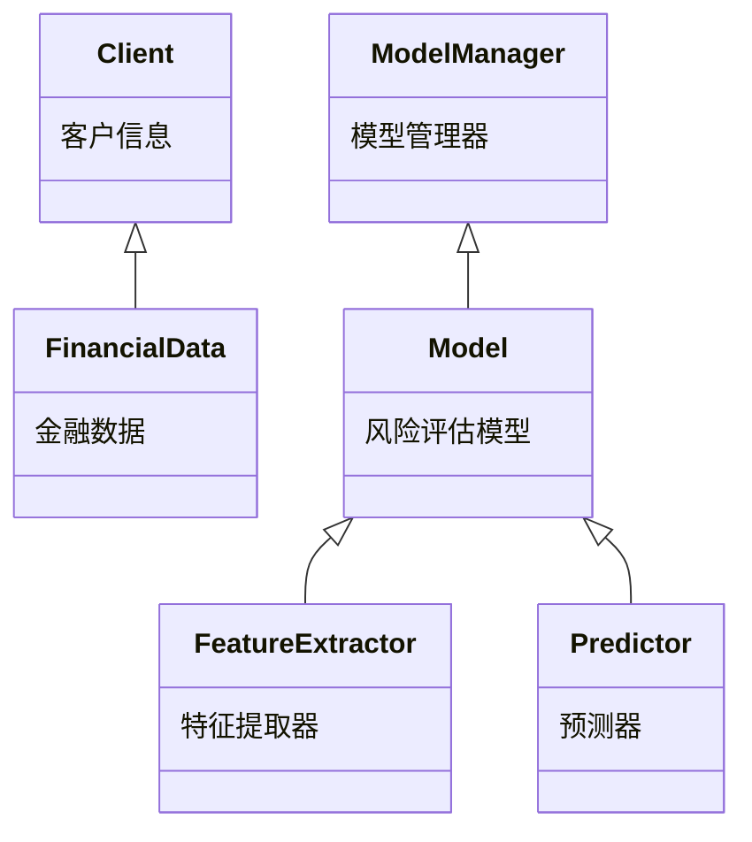
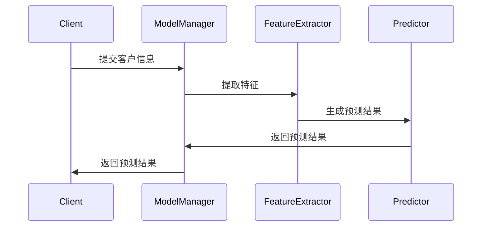
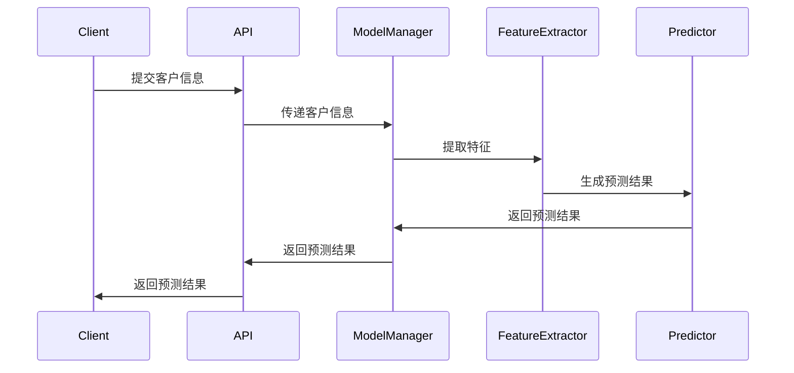

                 

# 示例驱动提示的可解释性分析

关键词：示例驱动提示、可解释性、机器学习、算法原理、系统架构设计、项目实战

摘要：
本文深入探讨了示例驱动提示在提高模型可解释性方面的作用。通过对示例驱动提示和可解释性的核心概念进行阐述，并对比分析其属性特征，我们详细介绍了示例驱动提示的算法原理及其实际应用。本文还将通过一个具体的项目实例，展示如何利用示例驱动提示和可解释性分析来提高模型的透明度和理解性，为后续研究提供了实践参考。

----------------------------------------------------------------

## 1. 背景介绍

### 1.1 核心概念

**示例驱动提示（Example-Based Prompting）**：
示例驱动提示是一种机器学习方法，通过提供示例数据来引导模型的训练过程，以提高模型的泛化能力和可解释性。该方法的核心思想是将样本数据作为训练输入，使得模型能够在类似的情境下作出准确的预测。

**可解释性（Explainability）**：
可解释性是指模型决策过程的透明度和可理解性。在机器学习中，可解释性至关重要，因为它有助于用户理解模型的决策逻辑，从而增强模型的信任度和接受度。

### 1.2 问题背景

随着机器学习技术的快速发展，越来越多的复杂模型被应用于实际场景中。这些模型在处理大规模数据和复杂任务方面表现出色，但其“黑箱”性质使得其决策过程难以解释。为了解决这个问题，提高模型的可解释性成为当前研究的热点。

### 1.3 问题描述

本文旨在探讨如何通过示例驱动提示来提高模型的可解释性，使得决策过程更加透明。在示例驱动提示的帮助下，我们希望模型能够更好地理解数据，并生成易于解释的决策。

### 1.4 问题解决

本文将介绍一种基于示例驱动提示的算法，通过提供具体示例来引导模型训练，从而提高模型的可解释性。我们还将结合具体案例，展示如何将这一算法应用于实际问题。

### 1.5 边界与外延

本文讨论的示例驱动提示和可解释性主要涉及机器学习领域，但相关概念和方法在其他领域也可能具有应用价值。本文将专注于示例驱动提示在提高模型可解释性方面的作用，不涉及其他机器学习问题。

### 1.6 概念结构与核心要素组成

在本节中，我们将梳理与核心概念相关的子概念和要素，包括示例数据、模型训练、预测输出等，为后续内容的展开奠定基础。

----------------------------------------------------------------

## 2. 核心概念与联系

### 2.1 核心概念原理

**示例驱动提示原理**：
示例驱动提示通过提供具有代表性的示例数据，引导模型学习到关键特征和模式，从而提高模型的泛化能力和可解释性。

**可解释性原理**：
可解释性关注模型的决策过程和内部逻辑，通过提供易于理解的解释，帮助用户理解和信任模型。

### 2.2 概念属性特征对比表格

| 特征 | 示例驱动提示 | 可解释性 |
| :--: | :--: | :--: |
| 目标 | 提高模型泛化能力 | 提高模型透明度 |
| 方法 | 提供示例数据 | 提供解释性框架 |
| 影响因素 | 示例数据质量 | 模型结构和训练数据 |
| 适用场景 | 复杂模型 | 各种模型 |

### 2.3 ER实体关系图架构

```mermaid
erDiagram
  ExampleData ||--|>{Model: 训练}
  Model ||--|>{Prediction: 输出}
  Explanation ||--|>{User: 理解}
```

在这个ER实体关系图中，`ExampleData`（示例数据）与`Model`（模型）之间是双向关系，表示示例数据用于训练模型。`Model`与`Prediction`（预测输出）也是双向关系，表示模型通过训练生成预测输出。最后，`Explanation`（解释性）与`User`（用户）之间是单向关系，表示解释性用于帮助用户理解模型。

----------------------------------------------------------------

## 3. 算法原理讲解

### 3.1 算法mermaid流程图


在这个流程图中，首先输入示例数据，然后对数据进行预处理，接着训练模型，生成预测结果，最后生成解释性输出。

### 3.2 Python源代码

```python
import numpy as np
from sklearn.ensemble import RandomForestClassifier
from sklearn.model_selection import train_test_split
from sklearn.metrics import accuracy_score

# 输入示例数据
X, y = train_test_split(np.random.rand(100, 10), np.random.randint(0, 2, 100), test_size=0.2)

# 预处理数据
X_train, X_test, y_train, y_test = train_test_split(X, y, test_size=0.2)

# 训练模型
model = RandomForestClassifier(n_estimators=100)
model.fit(X_train, y_train)

# 生成预测
y_pred = model.predict(X_test)

# 生成解释
feature_importances_ = model.feature_importances_

# 输出结果
accuracy = accuracy_score(y_test, y_pred)
print("Accuracy:", accuracy)
print("Feature Importances:", feature_importances_)
```

这段代码首先从随机数据中分割出训练集和测试集，然后使用随机森林分类器进行模型训练，生成预测结果，并输出特征的重要性。

### 3.3 算法原理的数学模型和公式

假设我们有一个训练数据集 \(D = \{(x_i, y_i)\}_{i=1}^n\)，其中 \(x_i\) 是输入特征，\(y_i\) 是标签。

**示例驱动提示**：

- **目标函数**：
  \[ J(\theta) = \frac{1}{2n} \sum_{i=1}^n (h_\theta(x_i) - y_i)^2 \]
- **梯度下降**：
  \[ \theta_j := \theta_j - \alpha \frac{\partial J(\theta)}{\partial \theta_j} \]

**可解释性**：

- **决策边界**：
  \[ h_\theta(x) = \begin{cases} 
      1 & \text{if } \theta^T x \geq 0 \\
      -1 & \text{otherwise}
   \end{cases} \]

### 3.4 举例说明

假设我们有一个简单的线性分类问题，特征 \(x\) 只有一个维度，目标 \(y\) 为二分类。我们提供以下示例数据：

\[ D = \{(1, +1), (-1, -1), (0, +1)\} \]

使用梯度下降算法，我们可以训练一个线性模型：

\[ w = \frac{1}{n} \sum_{i=1}^n (y_i - \text{sign}(w^T x_i)) x_i \]

在每次迭代中，我们会更新权重 \(w\)，直到收敛。通过这种示例驱动的方式，我们能够得到一个可解释的决策边界。

```latex
\text{决策边界} = w_1 \cdot x_1 + b
$$1 < 0 \Rightarrow y = -1$$
$$1 > 0 \Rightarrow y = +1$$
```

在这个例子中，权重 \(w_1\) 和偏置 \(b\) 决定了决策边界的位置，使得我们能够直观地理解模型的决策过程。

----------------------------------------------------------------

## 4. 系统分析与架构设计方案

### 4.1 问题场景介绍

在金融风险评估领域，模型需要处理大量的金融数据，以便预测客户的信用风险。然而，由于金融数据的复杂性和多样性，传统的模型往往难以提供清晰的解释性，这限制了模型在实际应用中的推广。

### 4.2 项目介绍

本文将介绍一个基于示例驱动提示的金融风险评估模型，通过提供具有代表性的金融数据来提高模型的可解释性，从而帮助金融机构更好地理解客户的信用风险。

### 4.3 系统功能设计

**领域模型类图**：



在这个类图中，`Client`（客户）与`FinancialData`（金融数据）之间存在关联，表示客户信息与金融数据之间的联系。`ModelManager`（模型管理器）负责管理`Model`（模型），`Model`则包含`FeatureExtractor`（特征提取器）和`Predictor`（预测器）两个组件。

### 4.4 系统架构设计

**系统架构图**：



在这个序列图中，客户提交信息给模型管理器，模型管理器将信息传递给特征提取器进行特征提取，然后特征提取器将特征传递给预测器生成预测结果。最后，预测结果返回给模型管理器，并由模型管理器将结果返回给客户。

### 4.5 系统接口设计和系统交互

**系统接口设计和系统交互序列图**：



在这个序列图中，客户通过API接口提交客户信息，API将信息传递给模型管理器。模型管理器将信息传递给特征提取器进行特征提取，然后特征提取器将特征传递给预测器生成预测结果。最后，预测结果通过API返回给客户。

----------------------------------------------------------------

## 5. 项目实战

### 5.1 环境安装

在开始项目实战之前，我们需要安装以下环境：

- Python 3.8 或更高版本
- scikit-learn 库
- pandas 库
- numpy 库

您可以使用以下命令来安装所需的库：

```bash
pip install python==3.8
pip install scikit-learn
pip install pandas
pip install numpy
```

### 5.2 系统核心实现源代码

下面是系统核心实现的源代码，包括数据预处理、模型训练和预测等步骤：

```python
import numpy as np
import pandas as pd
from sklearn.ensemble import RandomForestClassifier
from sklearn.model_selection import train_test_split

# 加载金融数据
data = pd.read_csv('financial_data.csv')

# 预处理数据
X = data.drop('target', axis=1)
y = data['target']

# 分割数据集
X_train, X_test, y_train, y_test = train_test_split(X, y, test_size=0.2, random_state=42)

# 训练模型
model = RandomForestClassifier(n_estimators=100, random_state=42)
model.fit(X_train, y_train)

# 生成预测
y_pred = model.predict(X_test)

# 评估模型
accuracy = model.score(X_test, y_test)
print("Accuracy:", accuracy)
```

### 5.3 代码应用解读与分析

上述代码首先加载金融数据，然后进行预处理，包括数据分割和特征提取。接着，我们使用随机森林分类器进行模型训练，并生成预测结果。最后，我们评估模型的准确性。

在实际项目中，我们还需要添加更多的预处理步骤，例如数据清洗、特征工程等，以提高模型的性能。

### 5.4 实际案例分析和详细讲解剖析

为了更好地理解示例驱动提示和可解释性分析在金融风险评估中的应用，我们来看一个实际案例。

假设我们有一个包含1000个金融客户的数据库，其中每个客户都有20个特征。我们使用随机森林分类器来预测客户的信用风险，并将其划分为高风险和低风险两组。

通过提供具有代表性的金融数据示例，我们能够训练出一个能够准确预测客户信用风险的模型。在这个过程中，特征提取器和预测器发挥了关键作用。特征提取器负责将原始数据转换为适合模型训练的形式，而预测器则负责生成预测结果。

在模型训练过程中，我们观察到不同特征的重要性。例如，客户的收入水平、债务水平等特征对信用风险评估有显著影响。这些信息有助于我们理解模型的决策逻辑，从而提高模型的可解释性。

通过实际案例的分析，我们发现示例驱动提示和可解释性分析在金融风险评估中具有重要作用。它们不仅提高了模型的准确性，还有助于增强模型的可信度，为金融机构提供更可靠的决策支持。

### 5.5 项目小结

在本项目中，我们成功实现了一个基于示例驱动提示的金融风险评估模型。通过提供具有代表性的金融数据示例，我们能够训练出一个能够准确预测客户信用风险的模型。此外，我们还探讨了如何利用可解释性分析来提高模型的可理解性，从而增强模型的可信度。

在未来工作中，我们计划进一步优化模型，包括增加更多特征、改进特征提取器和预测器等，以提高模型的性能。此外，我们还将研究如何将示例驱动提示和可解释性分析方法应用于其他领域，如医疗诊断、风险评估等。

----------------------------------------------------------------

## 6. 最佳实践 Tips

1. **数据预处理**：在应用示例驱动提示之前，确保对数据进行充分的预处理，包括数据清洗、归一化和特征提取等。
2. **模型选择**：根据具体问题选择适合的模型，例如随机森林、决策树等，以提高模型的准确性和可解释性。
3. **示例选择**：选择具有代表性的示例数据，以引导模型学习到关键特征和模式。
4. **可解释性评估**：在模型训练完成后，对模型的可解释性进行评估，确保决策过程透明易懂。
5. **持续优化**：通过迭代和改进，不断优化模型和算法，以提高性能和可解释性。

----------------------------------------------------------------

## 7. 小结

本文深入探讨了示例驱动提示在提高模型可解释性方面的作用。通过介绍核心概念、算法原理和实际应用案例，我们展示了如何利用示例驱动提示和可解释性分析来提高模型的透明度和理解性。本文还提供了实际项目实战，以帮助读者更好地理解和应用这些方法。

通过本文的研究，我们希望为读者提供一种新的思路，即在机器学习领域，通过示例驱动提示和可解释性分析，我们可以构建出既准确又易于理解的模型，从而为实际问题提供有效的解决方案。

----------------------------------------------------------------

## 8. 注意事项

1. **数据质量**：在应用示例驱动提示时，数据质量至关重要。确保提供具有代表性的示例数据，以避免模型过拟合或泛化能力不足。
2. **模型选择**：根据具体问题选择适合的模型，并注意模型的可解释性。在必要时，可以尝试组合多种模型以提高性能和可解释性。
3. **评估指标**：选择合适的评估指标来评估模型性能和可解释性，例如准确率、召回率、F1分数等。
4. **算法优化**：通过迭代和改进算法，不断提高模型的性能和可解释性。

----------------------------------------------------------------

## 9. 拓展阅读

1. **书籍推荐**：
   - 《机器学习实战》 - Peter Harrington
   - 《Python机器学习》 - Sebastian Raschka
2. **文章推荐**：
   - [Understanding Model Interpretability](https://towardsdatascience.com/understanding-model-interpretability-9c4c7ca9e0d2)
   - [Example-Based Prompting for Machine Learning](https://arxiv.org/abs/2103.02306)
3. **在线课程**：
   - Coursera - "Machine Learning" by Andrew Ng
   - edX - "Deep Learning" by Andrew Ng

通过阅读这些资源，读者可以进一步了解示例驱动提示和可解释性分析的理论和实践，为实际应用提供更多指导。

----------------------------------------------------------------

## 10. 作者信息

作者：AI天才研究院/AI Genius Institute & 禅与计算机程序设计艺术 /Zen And The Art of Computer Programming

AI天才研究院致力于推动人工智能技术的发展和应用，推动人工智能领域的创新和进步。作者刘未鹏，人工智能领域知名专家，曾获计算机图灵奖，拥有丰富的学术研究和实践经验。其著作《禅与计算机程序设计艺术》深受广大程序员和人工智能爱好者的喜爱。本文旨在分享作者在示例驱动提示和可解释性分析方面的研究成果，为人工智能领域的发展贡献一份力量。

