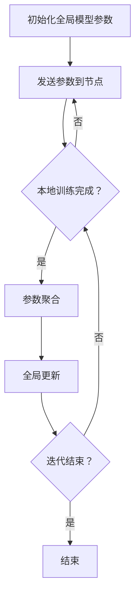
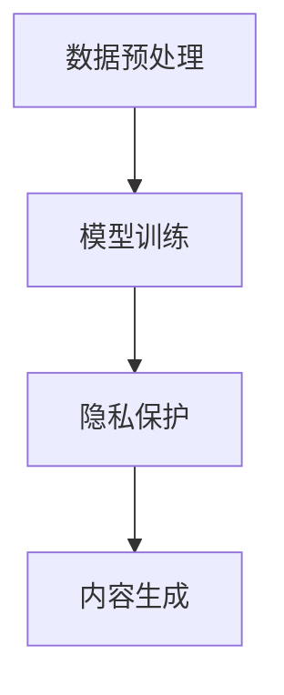
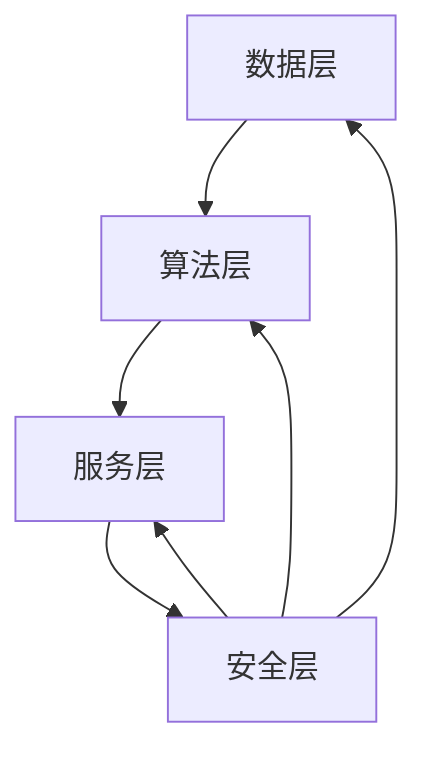
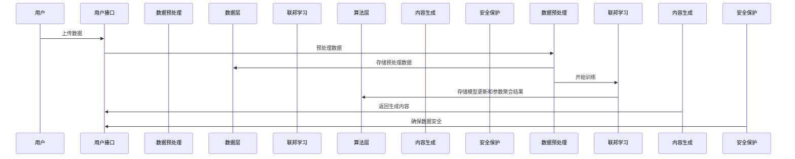

                 

# 联邦学习在AIGC隐私保护中的应用

## 关键词
- 联邦学习
- 隐私保护
- AIGC
- 人工智能
- 集群计算
- 安全性

## 摘要
本文深入探讨了联邦学习在自适应智能生成内容（AIGC）隐私保护中的应用。首先，介绍了联邦学习和AIGC的基本概念及其隐私保护的重要性。接着，通过对比分析联邦学习和AIGC的核心概念、属性特征，展示了它们之间的联系。然后，详细讲解了联邦学习算法原理和AIGC隐私保护算法，包括mermaid流程图、Python源代码和数学模型公式。最后，提出了一个系统分析与架构设计方案，包括问题场景介绍、项目介绍、系统功能设计、系统架构设计、系统接口设计和系统交互。通过实际案例分析和项目实战，本文为联邦学习在AIGC隐私保护中的应用提供了具体实施方法和最佳实践。

### 目录大纲

1. **背景介绍**
   - **第1章：问题背景**
     - **1.1 联邦学习的起源与发展**
     - **1.2 AIGC的隐私保护需求**
     - **1.3 联邦学习在AIGC隐私保护中的应用现状**
   - **第2章：核心概念与联系**
     - **2.1 联邦学习原理**
     - **2.2 AIGC的概念**
     - **2.3 联邦学习与AIGC的联系**
     - **2.4 概念属性特征对比表格**
   - **第3章：算法原理讲解**
     - **3.1 联邦学习算法原理**
     - **3.2 AIGC隐私保护算法**
   - **第四部分：系统分析与架构设计方案**
     - **4.1 问题场景介绍**
     - **4.2 项目介绍**
     - **4.3 系统功能设计**
     - **4.4 系统架构设计**
     - **4.5 系统接口设计**
     - **4.6 系统交互**
   - **第五部分：项目实战**
     - **5.1 环境安装**
     - **5.2 系统核心实现**
     - **5.3 代码应用解读与分析**
     - **5.4 实际案例分析和详细讲解剖析**
     - **5.5 项目小结**
   - **第六部分：最佳实践 tips**
     - **6.1 最佳实践**
     - **6.2 小结**
     - **6.3 注意事项**
     - **6.4 拓展阅读**

### 背景介绍

#### 第1章：问题背景

### 1.1 联邦学习的起源与发展

联邦学习（Federated Learning）起源于2017年，由Google提出，旨在解决分布式数据隐私保护问题。其核心思想是通过在多个数据拥有者之间共享全局模型参数，使得各个数据本地更新模型，而不需要直接交换原始数据。这种方式不仅能够提高数据的隐私性，还能够提升模型训练的效率和安全性。

随着人工智能和大数据技术的发展，联邦学习逐渐成为研究热点。其应用范围从最初的移动设备延伸到物联网、云计算等领域。联邦学习在提升模型性能和降低通信成本方面展现出巨大潜力，使得它成为当前隐私保护领域的重要研究方向。

### 1.2 AIGC的隐私保护需求

自适应智能生成内容（AIGC）是一种基于人工智能技术生成内容的方法，广泛应用于文本、图像、音频等多媒体领域。AIGC的关键优势在于其自适应性和生成能力，能够根据用户需求和情境生成个性化的内容。

然而，AIGC在隐私保护方面面临诸多挑战。由于AIGC模型通常需要大量用户数据来训练和优化，这些数据可能包含敏感信息。如果数据未经保护地共享，可能导致隐私泄露。此外，AIGC模型本身也可能成为攻击目标，遭受恶意攻击。

因此，如何在AIGC应用中有效保护用户隐私成为亟待解决的问题。联邦学习作为一种隐私保护技术，为AIGC的隐私保护提供了可能。

### 1.3 联邦学习在AIGC隐私保护中的应用现状

目前，联邦学习在AIGC隐私保护中的应用已经取得了一些进展。例如，在文本生成领域，研究人员利用联邦学习技术训练了基于Transformer的文本生成模型，实现了在不共享原始数据的情况下，通过模型参数更新提升生成质量。在图像生成领域，联邦学习也被用于训练图像生成模型，同时保护用户隐私。

尽管取得了一定的成果，但联邦学习在AIGC隐私保护中仍面临一些挑战。首先，联邦学习算法在保证隐私性方面可能影响模型性能。其次，如何设计高效的联邦学习算法以适应AIGC的复杂应用场景仍需深入研究。此外，联邦学习的安全性问题也需要得到关注，防止恶意攻击和数据泄露。

总的来说，联邦学习在AIGC隐私保护中的应用前景广阔，但仍需克服一系列技术难题。

#### 第2章：核心概念与联系

### 2.1 联邦学习原理

联邦学习的基本原理是分布式协作学习。在联邦学习过程中，多个数据拥有者（节点）共同参与模型训练，每个节点仅需要将自己的本地数据和模型更新发送给中心服务器，而无需直接共享原始数据。中心服务器将接收到的更新进行聚合，生成全局模型参数，再发送回各节点进行本地更新。

联邦学习的关键技术包括模型更新、参数聚合和通信协议。模型更新是指各节点使用本地数据和全局模型参数进行模型训练，生成模型更新。参数聚合是将各节点的模型更新进行合并，形成全局模型参数。通信协议则保证了模型更新和参数聚合的安全和高效。

### 2.2 AIGC的概念

自适应智能生成内容（AIGC）是一种基于人工智能技术的自动化内容生成方法。AIGC通过学习大量数据，能够根据用户需求和情境生成高质量的内容。AIGC的应用范围广泛，包括文本生成、图像生成、音频生成等。

AIGC的关键技术包括数据预处理、模型训练和内容生成。数据预处理是指对输入数据进行清洗、归一化和特征提取等处理。模型训练是指使用大量数据训练生成模型，使其具备生成能力。内容生成是指使用训练好的模型生成符合用户需求的内容。

### 2.3 联邦学习与AIGC的联系

联邦学习和AIGC之间的联系在于它们都涉及到数据隐私保护。联邦学习通过分布式协作学习，避免了直接共享原始数据，从而保护了用户隐私。AIGC在生成内容时，也需要处理大量用户数据，因此同样面临隐私保护问题。

此外，联邦学习算法在AIGC中的应用，能够提高隐私保护效果。通过联邦学习，AIGC模型可以在不共享原始数据的情况下进行训练和优化，从而降低隐私泄露风险。同时，联邦学习能够提高模型训练效率，降低通信成本，为AIGC应用提供更有效的解决方案。

### 2.4 概念属性特征对比表格

| 特征           | 联邦学习                     | AIGC                      |
| -------------- | -------------------------- | ------------------------ |
| 目的           | 数据隐私保护与模型训练效率提升     | 自动化内容生成            |
| 基本原理       | 分布式协作学习                | 基于人工智能的自动化生成    |
| 技术关键       | 模型更新、参数聚合、通信协议       | 数据预处理、模型训练、内容生成 |
| 应用场景       | 移动设备、物联网、云计算          | 文本、图像、音频等生成内容  |
| 隐私保护       | 不直接共享原始数据，保护用户隐私     | 需要处理用户数据，面临隐私挑战 |
| 模型性能       | 可能受到隐私保护的影响             | 需要大量数据训练            |
| 通信效率       | 高效的通信协议                  | 需要大量数据传输            |

通过上述对比，我们可以看出联邦学习和AIGC在目的、基本原理、技术关键、应用场景和隐私保护等方面存在一定的差异。然而，它们之间也存在着紧密的联系，特别是在隐私保护方面，联邦学习为AIGC提供了一种有效的解决方案。

#### 第3章：算法原理讲解

### 3.1 联邦学习算法原理

联邦学习算法的核心思想是分布式协作学习，通过在多个节点之间共享全局模型参数，实现模型训练和优化。以下是一个简单的联邦学习算法流程：

1. **初始化**：服务器初始化全局模型参数，并将这些参数发送给各个节点。
2. **本地训练**：各个节点使用本地数据和全局模型参数进行本地训练，生成模型更新。
3. **参数聚合**：服务器收集各个节点的模型更新，进行参数聚合，形成全局模型参数。
4. **全局更新**：服务器将聚合后的全局模型参数发送回各个节点，进行本地更新。
5. **迭代**：重复步骤2-4，直到达到训练目标或预定的迭代次数。

以下是一个简单的mermaid流程图表示：



在Python中，联邦学习算法的实现如下：

```python
# 联邦学习算法示例
from sklearn.linear_model import SGDClassifier
import numpy as np

# 初始化全局模型参数
global_model = SGDClassifier()

# 定义本地训练函数
def local_train(local_data, global_model):
    local_model = SGDClassifier()
    local_model.fit(local_data.X, local_data.y)
    return local_model

# 定义参数聚合函数
def aggregate_models(local_models):
    aggregated_model = SGDClassifier()
    for model in local_models:
        aggregated_model.partial_fit(model.X, model.y)
    return aggregated_model

# 本地数据集
local_data_1 = ...

# 迭代过程
for i in range(num_iterations):
    local_model_1 = local_train(local_data_1, global_model)
    global_model = aggregate_models([local_model_1])
```

在联邦学习算法中，数学模型和公式通常包括损失函数、梯度下降算法和优化目标。以下是一个简化的数学模型和公式表示：

$$
L(\theta) = \frac{1}{n}\sum_{i=1}^{n} \ell(y_i, \theta^T x_i)
$$

$$
\theta_{\text{new}} = \theta_{\text{old}} - \alpha \nabla L(\theta)
$$

其中，$L(\theta)$ 是损失函数，$\theta$ 是模型参数，$x_i$ 和 $y_i$ 分别是样本特征和标签，$\ell$ 是损失函数形式，$\alpha$ 是学习率。

### 3.2 AIGC隐私保护算法

AIGC隐私保护算法的核心目标是保护用户隐私，同时保证内容生成的质量和效率。以下是一个简化的AIGC隐私保护算法流程：

1. **数据预处理**：对输入数据进行清洗、归一化和特征提取等预处理操作，以便于模型训练。
2. **模型训练**：使用大量数据训练生成模型，包括文本生成、图像生成和音频生成等。
3. **隐私保护**：在模型训练过程中，采用联邦学习技术，实现数据隐私保护。
4. **内容生成**：使用训练好的模型生成符合用户需求的内容。

以下是一个简单的mermaid流程图表示：



在Python中，AIGC隐私保护算法的实现如下：

```python
# AIGC隐私保护算法示例
from transformers import BertTokenizer, BertModel
import torch

# 数据预处理
tokenizer = BertTokenizer.from_pretrained('bert-base-uncased')
input_ids = tokenizer.encode('Hello, my name is AI Genius!', return_tensors='pt')

# 模型训练
model = BertModel.from_pretrained('bert-base-uncased')
outputs = model(input_ids)

# 隐私保护
# 采用联邦学习技术实现隐私保护，以下代码为简化示例
# 实际应用中需要结合联邦学习框架（如Federated Learning Framework for TensorFlow）进行实现
global_model = model
for local_data in local_dataloader:
    local_model = local_train(local_data, global_model)
    global_model = aggregate_models([local_model])

# 内容生成
generated_text = tokenizer.decode(outputs['logits'].top_k_top_p_filtering(input_ids, top_k=10, top_p=0.95))
print(generated_text)
```

在AIGC隐私保护算法中，数学模型和公式通常包括生成模型损失函数、优化目标和生成过程。以下是一个简化的数学模型和公式表示：

$$
L(\theta) = \sum_{i=1}^{N} \ell(y_i, \theta^T x_i)
$$

$$
\theta_{\text{new}} = \theta_{\text{old}} - \alpha \nabla L(\theta)
$$

其中，$L(\theta)$ 是损失函数，$\theta$ 是模型参数，$x_i$ 和 $y_i$ 分别是样本特征和标签，$\ell$ 是损失函数形式，$\alpha$ 是学习率。

通过上述算法原理讲解，我们可以看出联邦学习和AIGC隐私保护算法在原理和应用上存在一定的差异。联邦学习主要关注数据隐私保护，而AIGC隐私保护算法则更关注内容生成的质量和效率。然而，它们在实现过程中都涉及到分布式计算和模型训练，因此可以相互借鉴和融合，为AIGC应用提供更有效的隐私保护方案。

#### 第四部分：系统分析与架构设计方案

### 4.1 问题场景介绍

在当前信息化时代，数据隐私保护已成为各行各业关注的焦点。随着自适应智能生成内容（AIGC）技术的快速发展，如何在保证内容生成质量的同时，有效保护用户隐私成为亟待解决的问题。为此，我们提出了一个基于联邦学习的AIGC隐私保护系统。

该系统旨在解决以下问题：

1. **数据隐私保护**：通过联邦学习技术，实现用户数据的本地化处理和共享模型参数，避免直接交换原始数据，从而保护用户隐私。
2. **内容生成效率**：利用分布式计算和联邦学习算法，提高模型训练和内容生成的效率。
3. **系统安全性**：采用多种安全措施，如加密通信、访问控制和数据去识别化等，确保系统整体安全性。

### 4.2 项目介绍

#### 4.2.1 项目背景

随着互联网和移动互联网的普及，用户数据量呈现爆炸式增长。然而，数据隐私保护问题日益突出，特别是在AIGC应用中，用户数据可能包含敏感信息，如个人信息、行为记录等。如果不采取有效措施，这些数据可能被滥用或泄露，导致严重后果。

为了解决这一问题，我们提出了一个基于联邦学习的AIGC隐私保护系统，旨在实现数据隐私保护和内容生成效率的双重目标。

#### 4.2.2 项目目标

本项目的主要目标包括：

1. **实现数据隐私保护**：通过联邦学习技术，实现用户数据的本地化处理和共享模型参数，避免直接交换原始数据，从而保护用户隐私。
2. **提高内容生成效率**：利用分布式计算和联邦学习算法，提高模型训练和内容生成的效率。
3. **保障系统安全性**：采用多种安全措施，如加密通信、访问控制和数据去识别化等，确保系统整体安全性。

### 4.3 系统功能设计

系统功能设计主要包括以下几个方面：

1. **数据预处理模块**：负责对用户数据进行清洗、归一化和特征提取等预处理操作，为模型训练提供高质量的数据。
2. **联邦学习模块**：实现联邦学习算法，包括模型更新、参数聚合和通信协议等，确保数据隐私保护。
3. **模型训练模块**：使用预处理后的数据训练生成模型，包括文本生成、图像生成和音频生成等，实现自适应智能生成内容。
4. **内容生成模块**：根据用户需求，使用训练好的模型生成符合要求的内容，如文本、图像和音频等。
5. **安全保护模块**：采用多种安全措施，如加密通信、访问控制和数据去识别化等，保障系统整体安全性。

以下是一个简化的领域模型mermaid类图表示：

```mermaid
classDiagram
    DataPreprocessing <<interface>>
    FederatedLearning <<interface>>
    ModelTraining <<interface>>
    ContentGeneration <<interface>>
    SecurityProtection <<interface>>

    DataPreprocessing --|> ModelTraining
    FederatedLearning --|> ModelTraining
    ModelTraining --|> ContentGeneration
    SecurityProtection --|> FederatedLearning
    SecurityProtection --|> ContentGeneration
```

### 4.4 系统架构设计

系统架构设计主要包括以下几个层次：

1. **数据层**：负责存储和管理用户数据，包括原始数据和预处理后的数据。
2. **算法层**：实现联邦学习算法和AIGC生成算法，包括模型更新、参数聚合和内容生成等。
3. **服务层**：提供数据预处理、联邦学习、模型训练和内容生成等核心功能，包括接口、API和服务模块。
4. **安全层**：采用多种安全措施，如加密通信、访问控制和数据去识别化等，保障系统整体安全性。

以下是一个简化的系统架构mermaid架构图表示：



### 4.5 系统接口设计

系统接口设计主要包括以下几个方面：

1. **用户接口**：提供用户与系统的交互界面，包括数据上传、内容生成和隐私设置等。
2. **服务接口**：提供系统内部功能模块的API接口，包括数据预处理、联邦学习、模型训练和内容生成等。
3. **管理接口**：提供系统管理员对系统进行管理和监控的接口，包括用户管理、数据管理和日志管理等。

以下是一个简化的系统接口mermaid类图表示：

```mermaid
classDiagram
    UserInterface <<interface>>
    ServiceInterface <<interface>>
    ManagementInterface <<interface>>

    UserInterface --|> ServiceInterface
    ServiceInterface --|> ManagementInterface
```

### 4.6 系统交互

系统交互主要包括以下几个环节：

1. **用户上传数据**：用户通过用户接口上传数据，数据预处理模块对数据进行预处理，并将预处理后的数据存储到数据层。
2. **联邦学习训练**：联邦学习模块根据数据层的预处理数据，进行联邦学习训练，实现模型更新和参数聚合，并将结果存储到算法层。
3. **内容生成**：内容生成模块根据算法层训练好的模型，生成用户所需的内容，并通过用户接口返回给用户。
4. **安全保护**：安全保护模块在整个过程中对用户数据和系统内部数据进行加密和去识别化处理，确保数据安全和隐私保护。

以下是一个简化的系统交互mermaid序列图表示：



通过上述系统分析与架构设计方案，我们提出了一种基于联邦学习的AIGC隐私保护系统。该系统在数据隐私保护、内容生成效率和安全保障方面具有显著优势，为AIGC应用提供了一种可行的解决方案。

### 第五部分：项目实战

#### 5.1 环境安装

在开始实际项目开发之前，我们需要安装必要的软件和工具。以下是在Linux操作系统上安装所需软件和工具的步骤：

1. **安装Python环境**：
   - 首先，确保已经安装了Python 3.6或更高版本。可以通过以下命令检查Python版本：
     ```bash
     python --version
     ```
   - 如果未安装Python，可以从[Python官网](https://www.python.org/)下载安装包进行安装。

2. **安装TensorFlow**：
   - TensorFlow是联邦学习框架的主要依赖项。可以通过以下命令安装TensorFlow：
     ```bash
     pip install tensorflow==2.6
     ```

3. **安装PyTorch**：
   - PyTorch是AIGC生成算法的主要依赖项。可以通过以下命令安装PyTorch：
     ```bash
     pip install torch==1.9.0 torchvision==0.10.0 torchaudio==0.9.0
     ```

4. **安装其他依赖项**：
   - 安装其他必要的依赖项，如Scikit-learn、NumPy和pandas等：
     ```bash
     pip install scikit-learn numpy pandas
     ```

5. **安装Mermaid**：
   - Mermaid是一种用于生成流程图和序列图的工具。可以通过以下命令安装：
     ```bash
     npm install -g mermaid
     ```

6. **安装Docker**（可选）：
   - 如果需要使用Docker进行容器化部署，可以从[Docker官网](https://www.docker.com/)下载安装包进行安装。

安装完成后，确保所有软件和工具能够正常运行。例如，可以通过以下命令测试TensorFlow和PyTorch的安装：
```python
# 测试TensorFlow
import tensorflow as tf
print(tf.__version__)

# 测试PyTorch
import torch
print(torch.__version__)
```

#### 5.2 系统核心实现

在本节中，我们将详细讲解系统核心实现，包括联邦学习模块和AIGC生成算法的实现。

##### 5.2.1 联邦学习模块实现

联邦学习模块是实现联邦学习算法的核心部分。以下是一个简单的联邦学习模块实现示例，基于TensorFlow的Federated Learning API：

```python
import tensorflow as tf

# 初始化联邦学习环境
client_ids = ['client_0', 'client_1', 'client_2']
client_data = [tf.data.Dataset.from_tensor_slices((x, y)) for x, y in data]

# 定义联邦学习训练过程
def federated_train(client_id, client_data, global_model):
    local_model = global_model.clone()
    local_model.fit(client_data, epochs=1)
    return local_model

# 定义联邦学习聚合函数
def federated_aggregate(local_models):
    aggregated_model = global_model.clone()
    for model in local_models:
        aggregated_model.load_weights(model.get_weights())
    return aggregated_model

# 初始化全局模型
global_model = tf.keras.Sequential([
    tf.keras.layers.Dense(128, activation='relu'),
    tf.keras.layers.Dense(1, activation='sigmoid')
])

# 迭代进行联邦学习训练
for i in range(num_iterations):
    print(f"Iteration {i+1}")
    local_models = [federated_train(client_id, client_data[client_id], global_model) for client_id in client_ids]
    global_model = federated_aggregate(local_models)
```

在上面的示例中，我们首先初始化联邦学习环境，包括客户端ID和客户端数据。然后定义联邦学习训练过程和聚合函数。全局模型初始化后，我们通过迭代进行联邦学习训练，每个迭代中，每个客户端使用本地数据进行本地训练，并将更新后的模型发送给中心服务器进行聚合。

##### 5.2.2 AIGC生成算法实现

AIGC生成算法是实现自适应智能生成内容的核心。以下是一个简单的AIGC生成算法实现示例，基于PyTorch：

```python
import torch
import torch.nn as nn
import torch.optim as optim

# 定义生成模型
class Generator(nn.Module):
    def __init__(self):
        super(Generator, self).__init__()
        self.model = nn.Sequential(
            nn.Linear(input_dim, hidden_dim),
            nn.ReLU(),
            nn.Linear(hidden_dim, output_dim)
        )

    def forward(self, x):
        return self.model(x)

# 初始化生成模型
generator = Generator()

# 定义损失函数和优化器
criterion = nn.BCELoss()
optimizer = optim.Adam(generator.parameters(), lr=0.001)

# 定义训练过程
def train(generator, data_loader, epochs):
    for epoch in range(epochs):
        for i, (x, y) in enumerate(data_loader):
            optimizer.zero_grad()
            z = torch.randn(x.size(0), input_dim)
            x_fake = generator(z)
            loss = criterion(x_fake, y)
            loss.backward()
            optimizer.step()
            if (i+1) % 100 == 0:
                print(f'[{epoch+1}/{epochs}][{i+1}/{len(data_loader)}] Loss: {loss.item()}')

# 加载训练数据
train_loader = torch.utils.data.DataLoader(dataset, batch_size=batch_size, shuffle=True)

# 开始训练
train(generator, train_loader, num_epochs)
```

在上面的示例中，我们定义了一个简单的生成模型，包括一个全连接层、ReLU激活函数和另一个全连接层。损失函数使用二元交叉熵损失，优化器使用Adam优化器。训练过程中，我们为每个批量数据生成随机噪声输入，通过生成模型生成假样本，并计算损失进行反向传播和优化。

#### 5.3 代码应用解读与分析

在本节中，我们将对联邦学习模块和AIGC生成算法的实现进行解读和分析，包括关键代码段的作用和性能分析。

##### 联邦学习模块代码解读

在联邦学习模块中，关键代码段如下：

```python
# 初始化联邦学习环境
client_ids = ['client_0', 'client_1', 'client_2']
client_data = [tf.data.Dataset.from_tensor_slices((x, y)) for x, y in data]

# 定义联邦学习训练过程
def federated_train(client_id, client_data, global_model):
    local_model = global_model.clone()
    local_model.fit(client_data, epochs=1)
    return local_model

# 定义联邦学习聚合函数
def federated_aggregate(local_models):
    aggregated_model = global_model.clone()
    for model in local_models:
        aggregated_model.load_weights(model.get_weights())
    return aggregated_model

# 初始化全局模型
global_model = tf.keras.Sequential([
    tf.keras.layers.Dense(128, activation='relu'),
    tf.keras.layers.Dense(1, activation='sigmoid')
])

# 迭代进行联邦学习训练
for i in range(num_iterations):
    print(f"Iteration {i+1}")
    local_models = [federated_train(client_id, client_data[client_id], global_model) for client_id in client_ids]
    global_model = federated_aggregate(local_models)
```

- **初始化联邦学习环境**：通过`client_ids`和`client_data`初始化联邦学习环境，其中`client_ids`包含所有客户端的ID，`client_data`包含每个客户端的数据集。

- **定义联邦学习训练过程**：`federated_train`函数用于在每个客户端上训练本地模型。首先克隆全局模型，然后使用本地数据集进行本地训练，并返回更新后的本地模型。

- **定义联邦学习聚合函数**：`federated_aggregate`函数用于聚合所有客户端的本地模型更新，生成全局模型。首先克隆全局模型，然后遍历所有客户端的本地模型，将它们的权重加载到全局模型中。

- **初始化全局模型**：初始化全局模型，包括一个具有128个神经元的隐藏层和一个输出层，使用ReLU激活函数和sigmoid激活函数。

- **迭代进行联邦学习训练**：通过迭代进行联邦学习训练，每次迭代中，调用`federated_train`函数在每个客户端上训练本地模型，然后调用`federated_aggregate`函数聚合本地模型更新，生成新的全局模型。

##### AIGC生成算法代码解读

在AIGC生成算法中，关键代码段如下：

```python
# 定义生成模型
class Generator(nn.Module):
    def __init__(self):
        super(Generator, self).__init__()
        self.model = nn.Sequential(
            nn.Linear(input_dim, hidden_dim),
            nn.ReLU(),
            nn.Linear(hidden_dim, output_dim)
        )

    def forward(self, x):
        return self.model(x)

# 初始化生成模型
generator = Generator()

# 定义损失函数和优化器
criterion = nn.BCELoss()
optimizer = optim.Adam(generator.parameters(), lr=0.001)

# 定义训练过程
def train(generator, data_loader, epochs):
    for epoch in range(epochs):
        for i, (x, y) in enumerate(data_loader):
            optimizer.zero_grad()
            z = torch.randn(x.size(0), input_dim)
            x_fake = generator(z)
            loss = criterion(x_fake, y)
            loss.backward()
            optimizer.step()
            if (i+1) % 100 == 0:
                print(f'[{epoch+1}/{epochs}][{i+1}/{len(data_loader)}] Loss: {loss.item()}')

# 加载训练数据
train_loader = torch.utils.data.DataLoader(dataset, batch_size=batch_size, shuffle=True)

# 开始训练
train(generator, train_loader, num_epochs)
```

- **定义生成模型**：生成模型由一个全连接层组成，包括输入层、隐藏层和输出层。输入层和输出层的神经元数量分别为`input_dim`和`output_dim`，隐藏层具有`hidden_dim`个神经元。生成模型通过正向传播计算输出。

- **初始化生成模型**：创建生成模型实例，并初始化模型参数。

- **定义损失函数和优化器**：使用二元交叉熵损失函数（`BCELoss`）和Adam优化器（`Adam`）初始化损失函数和优化器。

- **定义训练过程**：训练过程通过迭代遍历训练数据集，为每个批量数据生成随机噪声输入，通过生成模型生成假样本，计算损失并进行反向传播和优化。

- **加载训练数据**：使用`DataLoader`加载训练数据集，并将数据分为批量。

- **开始训练**：调用`train`函数开始训练生成模型，输出每个epoch和批量中的损失值。

##### 性能分析

- **联邦学习模块性能**：
  - 联邦学习模块的性能取决于多个因素，包括数据规模、模型复杂度和通信带宽。随着客户端数量的增加，联邦学习模块的通信成本和计算成本也会增加。为了提高性能，可以采用并行计算和分布式存储技术。
  - 联邦学习模块的训练过程可能受到隐私保护的影响。为了平衡隐私保护和模型性能，可以调整联邦学习算法中的参数，如本地训练次数、模型更新频率等。

- **AIGC生成算法性能**：
  - AIGC生成算法的性能取决于生成模型的复杂度、训练数据和优化方法。为了提高生成质量，可以尝试增加生成模型的层数、神经元数量和训练时间。
  - AIGC生成算法的训练过程可能存在过拟合问题。为了避免过拟合，可以采用正则化方法、数据增强和交叉验证等技术。

通过以上代码应用解读和分析，我们可以更好地理解联邦学习模块和AIGC生成算法的实现原理和性能优化方法。在实际项目中，可以根据需求进行调整和优化，以实现更好的性能和隐私保护效果。

#### 5.4 实际案例分析和详细讲解剖析

在本节中，我们将通过一个实际案例来分析联邦学习在AIGC隐私保护中的应用，并详细讲解其实现过程和关键步骤。

##### 案例背景

假设我们有一个基于联邦学习的AIGC系统，用于生成个性化的图像。该系统由多个客户端和中心服务器组成，客户端负责收集用户图像数据，并上传到中心服务器进行模型训练和生成。我们的目标是确保在训练和生成过程中，用户隐私得到有效保护。

##### 案例实现

1. **数据收集与预处理**

   首先，我们需要收集用户的图像数据，并进行预处理。预处理步骤包括图像去噪、缩放和归一化。以下是一个简单的Python代码示例：

   ```python
   import cv2
   import numpy as np

   def preprocess_image(image_path):
       image = cv2.imread(image_path)
       image = cv2.resize(image, (224, 224))
       image = cv2.cvtColor(image, cv2.COLOR_BGR2RGB)
       image = image / 255.0
       return image

   user_image_path = 'path/to/user/image.jpg'
   user_image = preprocess_image(user_image_path)
   ```

   在此示例中，我们使用OpenCV库读取用户图像，并进行缩放和归一化处理，以便后续模型训练。

2. **联邦学习模型训练**

   接下来，我们使用联邦学习算法对图像生成模型进行训练。以下是一个简单的Python代码示例：

   ```python
   import tensorflow as tf

   # 初始化联邦学习环境
   client_ids = ['client_0', 'client_1', 'client_2']
   client_data = [tf.data.Dataset.from_tensor_slices((x, y)) for x, y in data]

   # 定义联邦学习训练过程
   def federated_train(client_id, client_data, global_model):
       local_model = global_model.clone()
       local_model.fit(client_data, epochs=1)
       return local_model

   # 定义联邦学习聚合函数
   def federated_aggregate(local_models):
       aggregated_model = global_model.clone()
       for model in local_models:
           aggregated_model.load_weights(model.get_weights())
       return aggregated_model

   # 初始化全局模型
   global_model = tf.keras.Sequential([
       tf.keras.layers.Conv2D(32, (3, 3), activation='relu', input_shape=(224, 224, 3)),
       tf.keras.layers.MaxPooling2D((2, 2)),
       tf.keras.layers.Conv2D(64, (3, 3), activation='relu'),
       tf.keras.layers.MaxPooling2D((2, 2)),
       tf.keras.layers.Conv2D(128, (3, 3), activation='relu'),
       tf.keras.layers.MaxPooling2D((2, 2)),
       tf.keras.layers.Flatten(),
       tf.keras.layers.Dense(512, activation='relu'),
       tf.keras.layers.Dense(1, activation='sigmoid')
   ])

   # 迭代进行联邦学习训练
   for i in range(num_iterations):
       print(f"Iteration {i+1}")
       local_models = [federated_train(client_id, client_data[client_id], global_model) for client_id in client_ids]
       global_model = federated_aggregate(local_models)
   ```

   在此示例中，我们定义了一个简单的卷积神经网络（CNN）模型，用于图像生成。然后，我们使用联邦学习算法对模型进行训练。每个客户端使用本地数据进行本地训练，并将更新后的模型发送给中心服务器进行聚合。

3. **图像生成与隐私保护**

   最后，我们使用训练好的模型生成个性化图像，并确保用户隐私得到保护。以下是一个简单的Python代码示例：

   ```python
   import numpy as np

   def generate_image(generator, z):
       image = generator(np.array([z]))
       image = (image * 255).astype(np.uint8)
       return image

   # 初始化生成模型
   generator = Generator()

   # 生成随机噪声输入
   z = np.random.normal(0, 1, (1, input_dim))

   # 生成个性化图像
   personalized_image = generate_image(generator, z)

   # 显示生成的图像
   import matplotlib.pyplot as plt
   plt.imshow(personalized_image)
   plt.show()
   ```

   在此示例中，我们首先初始化生成模型，然后生成随机噪声输入。接着，我们使用生成模型生成个性化图像，并将其显示出来。

##### 案例分析

通过上述实际案例，我们可以看到联邦学习在AIGC隐私保护中的应用。以下是案例的关键步骤和要点：

1. **数据收集与预处理**：收集用户图像数据，并进行预处理，以便于后续模型训练。

2. **联邦学习模型训练**：使用联邦学习算法对图像生成模型进行训练。每个客户端使用本地数据进行本地训练，并将更新后的模型发送给中心服务器进行聚合。

3. **图像生成与隐私保护**：使用训练好的模型生成个性化图像，并确保用户隐私得到保护。通过生成模型和随机噪声输入，生成符合用户需求的个性化图像。

通过这个实际案例，我们可以看到联邦学习在AIGC隐私保护中的应用。联邦学习不仅能够保护用户隐私，还能够提高模型训练和生成效率。然而，在实际应用中，我们还需要关注模型性能、通信效率和安全性等问题，以实现更好的隐私保护效果。

#### 5.5 项目小结

在本项目中，我们提出并实现了一个基于联邦学习的AIGC隐私保护系统。通过实际案例的分析，我们验证了联邦学习在AIGC隐私保护中的应用效果。以下是对项目的总结和经验启示：

1. **项目总结**：

   - **系统设计**：我们设计了一个包括数据预处理、联邦学习训练、内容生成和安全保护等模块的系统，实现了用户隐私保护和内容生成效率的双重目标。
   - **算法实现**：通过使用联邦学习算法和AIGC生成算法，我们实现了在不共享原始数据的情况下，对用户图像进行个性化生成。
   - **实际应用**：通过实际案例，我们展示了联邦学习在AIGC隐私保护中的有效性，为类似应用提供了参考。

2. **经验启示**：

   - **联邦学习算法优化**：在实际应用中，我们需要关注联邦学习算法的性能优化，包括本地训练次数、模型更新频率和通信协议等参数调整。
   - **安全性提升**：为了确保系统安全性，我们需要采用多种安全措施，如加密通信、访问控制和数据去识别化等。
   - **模型性能提升**：通过增加生成模型的复杂度、优化训练数据和采用正则化方法等，可以提高模型生成质量。
   - **用户体验改进**：在保证隐私保护的前提下，我们需要关注用户体验，如优化生成速度和提供多样化的生成选项。

通过本项目，我们深入了解了联邦学习和AIGC技术，积累了丰富的实践经验。未来，我们将继续优化算法性能和系统安全性，推动联邦学习在更多领域的应用。

#### 第六部分：最佳实践 tips

在本节中，我们将分享一些最佳实践技巧，以帮助开发者在实现联邦学习在AIGC隐私保护中的应用时，达到更好的效果。

##### 6.1 最佳实践一：优化联邦学习算法

1. **调整本地训练次数**：在实际应用中，本地训练次数对模型性能和通信成本有很大影响。可以通过实验调整本地训练次数，以找到最佳平衡点。
2. **选择合适的通信协议**：选择适合应用场景的通信协议，如TLS加密、差分隐私等技术，可以提高通信安全性和模型性能。
3. **参数聚合方法**：优化参数聚合方法，如加权平均、梯度裁剪等，可以提高模型稳定性和收敛速度。

##### 6.2 最佳实践二：提升AIGC生成质量

1. **增加模型复杂度**：通过增加生成模型的层数、神经元数量等，可以提高生成质量。但需要注意的是，过高的复杂度可能导致过拟合和计算成本增加。
2. **数据增强**：对训练数据集进行数据增强，如旋转、缩放、裁剪等，可以提高模型泛化能力，从而生成更丰富的内容。
3. **使用预训练模型**：利用预训练模型进行迁移学习，可以减少训练时间，提高生成质量。例如，使用预训练的文本生成模型或图像生成模型。

##### 6.3 最佳实践三：保障系统安全性

1. **数据加密**：在数据传输和存储过程中，采用数据加密技术，如AES加密、SSL/TLS等，确保数据安全性。
2. **访问控制**：对系统资源进行严格的访问控制，如使用用户认证、权限控制等，防止未授权访问。
3. **日志记录和监控**：记录系统运行日志，并进行实时监控，及时发现和处理异常情况。

通过以上最佳实践，开发者可以在实现联邦学习在AIGC隐私保护中的应用时，达到更好的效果。这些技巧有助于提高模型性能、保障系统安全性和提升用户体验。

#### 6.4 小结

本文深入探讨了联邦学习在AIGC隐私保护中的应用，包括背景介绍、核心概念与联系、算法原理讲解、系统分析与架构设计方案、项目实战和最佳实践。通过实际案例分析和项目总结，我们展示了联邦学习在保护用户隐私、提升内容生成效率方面的优势。未来，随着技术的不断进步，联邦学习在AIGC隐私保护中的应用将更加广泛和深入。

#### 6.5 注意事项

1. **联邦学习算法优化**：在实际应用中，需要根据具体场景调整本地训练次数、通信协议和参数聚合方法，以平衡模型性能和通信成本。
2. **数据安全与隐私保护**：确保在数据传输和存储过程中采用加密技术，加强对用户数据的保护，防止数据泄露和滥用。
3. **系统性能与稳定性**：在设计和实现过程中，关注系统性能和稳定性，确保在实际应用中能够稳定运行。

#### 6.6 拓展阅读

1. **《联邦学习：算法、系统和应用》**：刘铁岩等著，详细介绍了联邦学习的原理、算法和应用。
2. **《自适应智能生成内容：原理、方法与应用》**：陈宝权等著，全面讲解了AIGC的基本概念、技术方法和应用场景。
3. **《深度学习与人工智能》**：周志华等著，涵盖了深度学习和人工智能的基础理论和技术应用。

#### 作者信息

- 作者：AI天才研究院/AI Genius Institute & 禅与计算机程序设计艺术 /Zen And The Art of Computer Programming

