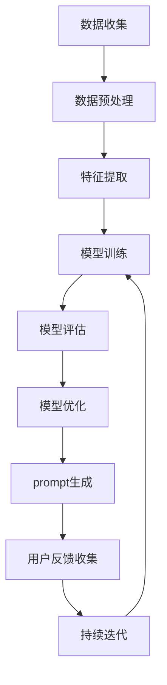

                 

# 《自动化prompt文化适应性调整》

> 关键词：自动化prompt，文化适应性，自然语言处理，算法优化，跨文化交流

> 摘要：本文从自动化prompt的概念和应用场景出发，探讨了在多元文化背景下，自动化prompt需要进行文化适应性调整的重要性。通过深入分析核心概念和算法原理，文章提出了一套系统的文化适应性调整方法，并展示了如何通过具体的项目实战来实现这一目标。最终，文章总结了最佳实践，强调了跨文化交流中文化适应性调整的必要性和重要性。

----------------------------------------------------------------

## 第一部分：背景介绍

### 1.1 问题背景

#### 1.1.1 自动化prompt的概念

自动化prompt是指通过预定义的规则或算法，在特定情境下自动生成或调整的文本或指令。其核心在于“自动化”和“适应性”。自动化意味着不需要人工干预，系统可以自主地生成或调整prompt；适应性则强调了prompt能够根据不同情境和用户需求进行优化。

#### 1.1.1.1 自动化prompt的定义

自动化prompt通常包括以下几个核心组成部分：

- **规则库**：包含生成prompt的基本规则和模板。
- **数据集**：用于训练和优化prompt生成模型的实际数据。
- **模型**：基于规则库和数据集构建的机器学习模型，用于生成或调整prompt。
- **反馈机制**：用户对prompt的反馈用于模型优化和规则库的更新。

#### 1.1.1.2 自动化prompt的应用场景

自动化prompt在多个领域得到了广泛应用，包括：

- **自然语言处理**：例如，聊天机器人、文本摘要、问答系统等。
- **人机交互**：例如，语音助手、智能客服、推荐系统等。
- **智能客服**：例如，自动生成客服回复、自动化客服机器人等。
- **信息检索**：例如，自动生成搜索提示、推荐搜索关键词等。

#### 1.1.2 文化适应性调整的重要性

在全球化和数字化时代的背景下，跨文化交流越来越普遍。不同文化背景下，用户对语言、表达方式和交流习惯的偏好存在显著差异。这些差异对自动化prompt的适应性和效果提出了挑战。

#### 1.1.2.1 文化差异对自动化prompt的影响

文化差异主要体现在以下几个方面：

- **语言表达**：不同文化对同一概念的表达可能存在差异。
- **交流习惯**：不同文化对交流的礼貌性、直接性、正式性有不同的要求。
- **价值观**：不同文化对隐私、自由、责任等方面的理解可能不同。

#### 1.1.2.2 跨文化沟通中的问题

不适应文化背景的prompt可能导致以下问题：

- **误解和沟通障碍**：例如，可能误解用户的需求或意图。
- **负面效果**：例如，可能引发用户的不满或抵触情绪。

### 1.1.3 问题解决

为了解决上述问题，自动化prompt需要进行文化适应性调整。这一过程包括以下几个关键目标：

- **提高沟通效果**：通过优化prompt，使其更符合目标用户的文化背景和交流习惯，提高沟通效果。
- **尊重文化多样性**：在文化适应性调整过程中，要尊重不同文化的独特性，避免文化偏见和歧视。
- **持续迭代和优化**：文化适应性调整不是一次性的工作，而是一个持续迭代和优化的过程。

### 1.1.4 边界与外延

在文化适应性调整过程中，需要明确以下几个边界和外部关系：

- **用户隐私**：在调整过程中，要确保用户的隐私得到保护。
- **文化多样性**：要尊重和维护不同文化的多样性，避免一刀切的做法。
- **交流习惯**：要考虑不同文化的交流习惯，避免因文化差异导致的沟通障碍。

### 1.1.5 核心要素组成

自动化prompt的文化适应性调整包括以下几个核心要素：

- **文化研究**：深入了解目标用户的文化背景、价值观、交流习惯等。
- **算法优化**：基于文化研究的结果，优化自动化prompt的生成算法和规则库。
- **用户反馈**：收集用户对prompt的反馈，用于算法优化和规则库的更新。
- **持续迭代**：根据用户反馈和算法优化结果，持续迭代和优化prompt。

## 1.2 问题解决

### 1.2.1 自动化prompt文化适应性调整的目标

自动化prompt文化适应性调整的目标主要包括：

- **提高沟通效果**：通过优化prompt，使其更符合目标用户的文化背景和交流习惯，提高沟通效果。
- **降低沟通成本**：减少由于文化差异导致的误解和沟通障碍，降低沟通成本。
- **提升用户满意度**：通过更贴合用户需求的prompt，提升用户的满意度和忠诚度。

### 1.2.2 边界与外延

在自动化prompt文化适应性调整过程中，需要明确以下几个边界与外延：

- **边界**：尊重用户隐私，避免过度收集和使用用户数据；尊重文化多样性，避免一刀切的做法。
- **外延**：除了语言和文化因素，还需要考虑其他因素，如技术实现难度、成本效益等。

### 1.2.3 核心要素组成

自动化prompt的文化适应性调整包括以下几个核心要素：

- **文化研究**：通过文献调研、用户访谈等方式，深入了解目标用户的文化背景、价值观、交流习惯等。
- **算法优化**：基于文化研究的结果，对自动化prompt的生成算法和规则库进行优化。
- **用户反馈**：收集用户对prompt的反馈，用于算法优化和规则库的更新。
- **持续迭代**：根据用户反馈和算法优化结果，持续迭代和优化prompt。

## 1.3 目录大纲结构

**《自动化prompt文化适应性调整》**

----------------------------------------------------------------

# 第一部分：背景介绍

## 1.1 问题背景

### 1.1.1 自动化prompt的概念

#### 1.1.1.1 自动化prompt的定义

#### 1.1.1.2 自动化prompt的应用场景

### 1.1.2 文化适应性调整的重要性

#### 1.1.2.1 文化差异对自动化prompt的影响

#### 1.1.2.2 跨文化沟通中的问题

### 1.1.3 问题解决

#### 1.1.3.1 自动化prompt文化适应性调整的目标

#### 1.1.3.2 边界与外延

#### 1.1.3.3 核心要素组成

## 1.2 问题解决

### 1.2.1 自动化prompt文化适应性调整的目标

### 1.2.2 边界与外延

### 1.2.3 核心要素组成

# 第二部分：核心概念与联系

## 2.1 核心概念

### 2.1.1 自动化prompt

#### 2.1.1.1 自动化prompt的定义

#### 2.1.1.2 自动化prompt的属性

### 2.1.2 文化适应性调整

#### 2.1.2.1 文化适应性调整的定义

#### 2.1.2.2 文化适应性调整的属性

## 2.2 概念属性特征对比表格

## 2.3 ER实体关系图架构

# 第三部分：算法原理讲解

## 3.1 算法原理

### 3.1.1 概述

### 3.1.2 文化适应性调整算法的设计思路

### 3.1.3 文化适应性调整算法的实现流程

## 3.2 算法原理讲解

### 3.2.1 文化研究

#### 3.2.1.1 文化研究的方法

#### 3.2.1.2 文化研究的重要性

### 3.2.2 算法优化

#### 3.2.2.1 算法优化的方法

#### 3.2.2.2 算法优化的关键点

### 3.2.3 用户反馈

#### 3.2.3.1 用户反馈的收集方法

#### 3.2.3.2 用户反馈的利用方式

### 3.2.4 持续迭代

#### 3.2.4.1 持续迭代的意义

#### 3.2.4.2 持续迭代的方法

----------------------------------------------------------------

## 第二部分：核心概念与联系

### 2.1 核心概念

#### 2.1.1 自动化prompt

自动化prompt是指在特定情境下，通过预定义的规则或算法自动生成或调整的文本或指令。其核心在于“自动化”和“适应性”。自动化意味着不需要人工干预，系统可以自主地生成或调整prompt；适应性则强调了prompt能够根据不同情境和用户需求进行优化。

**定义**：自动化prompt是指通过预定义的规则或算法，在特定情境下自动生成或调整的文本或指令。

**属性**：

- **自动生成性**：系统可以自动生成prompt，无需人工干预。
- **适应性**：prompt可以根据不同情境和用户需求进行自动调整。
- **灵活性**：系统可以根据实际情况灵活调整prompt的生成策略。
- **可定制性**：用户可以根据自身需求定制prompt的生成规则和模板。

#### 2.1.2 文化适应性调整

文化适应性调整是指根据不同文化背景，对自动化prompt进行优化和调整，以提高沟通效果。其核心在于“跨文化理解”和“文化敏感度”。

**定义**：文化适应性调整是指根据不同文化背景，对自动化prompt进行优化和调整，以提高沟通效果。

**属性**：

- **跨文化理解**：深入了解目标用户的文化背景、价值观、交流习惯等。
- **文化敏感度**：尊重不同文化的独特性，避免文化偏见和歧视。
- **交流习惯适应**：根据目标用户的文化交流习惯进行调整，提高沟通效果。
- **个性化调整**：根据用户的具体需求进行个性化调整，提升用户体验。

### 2.2 概念属性特征对比表格

| 概念         | 定义                                                         | 属性                                                         |  
| ------------ | ------------------------------------------------------------ | ------------------------------------------------------------ |  
| 自动化prompt | 通过预定义的规则或算法，在特定情境下自动生成或调整的文本或指令 | 自动生成性、适应性、灵活性、可定制性                     |  
| 文化适应性调整 | 根据不同文化背景，对自动化prompt进行优化和调整，以提高沟通效果 | 跨文化理解、文化敏感度、交流习惯适应、个性化调整           |

### 2.3 ER实体关系图架构

```mermaid
erDiagram
  Prompt ||--|{ Culture } Culture
  Culture ||--|{ Prompt } Prompt
```

在上面的ER实体关系图中，`Prompt` 表示自动化prompt，`Culture` 表示文化背景。双向箭头表示两者之间存在关系，即自动化prompt与文化背景之间存在交互关系。

```markdown
## 2.4 算法原理讲解

### 2.4.1 概述

自动化prompt文化适应性调整算法是基于机器学习和自然语言处理技术，通过分析用户的文化背景和交流习惯，对prompt进行动态调整，以提高沟通效果。

### 2.4.2 文化适应性调整算法的设计思路

设计文化适应性调整算法的主要思路包括：

1. **文化研究**：通过文献调研、用户访谈等方式，深入了解目标用户的文化背景、价值观、交流习惯等。
2. **特征提取**：从用户数据中提取与文化相关的特征，如语言风格、交流习惯、文化价值观等。
3. **算法优化**：基于提取的特征，对自动化prompt的生成算法和规则库进行优化，使其更符合目标用户的文化背景和交流习惯。
4. **用户反馈**：收集用户对prompt的反馈，用于算法优化和规则库的更新。
5. **持续迭代**：根据用户反馈和算法优化结果，持续迭代和优化prompt。

### 2.4.3 文化适应性调整算法的实现流程

文化适应性调整算法的实现流程主要包括以下几个步骤：

1. **数据收集**：收集与用户文化背景相关的数据，如语言风格、交流习惯、文化价值观等。
2. **数据预处理**：对收集到的数据进行清洗、去重、归一化等预处理操作。
3. **特征提取**：从预处理后的数据中提取与文化相关的特征，如语言风格、交流习惯、文化价值观等。
4. **模型训练**：基于提取的特征，训练一个自动化prompt生成模型，使其能够根据用户的文化背景生成适应性的prompt。
5. **模型评估**：通过评估模型生成的prompt与用户实际需求的匹配度，调整模型参数，提高模型性能。
6. **用户反馈收集**：收集用户对prompt的反馈，用于模型优化和规则库的更新。
7. **持续迭代**：根据用户反馈和模型优化结果，持续迭代和优化prompt。

## 2.5 数学公式与模型

在文化适应性调整算法中，通常会使用以下数学模型：

### 2.5.1 语言风格识别模型

假设用户数据为 $X = \{x_1, x_2, ..., x_n\}$，其中 $x_i$ 表示用户 $i$ 的语言风格特征。可以使用以下公式进行语言风格识别：

$$
\hat{y_i} = f(\theta, x_i)
$$

其中，$\hat{y_i}$ 表示预测的语言风格类别，$f(\theta, x_i)$ 表示基于模型参数 $\theta$ 和特征 $x_i$ 的预测函数。

### 2.5.2 交流习惯适应模型

假设用户数据为 $X = \{x_1, x_2, ..., x_n\}$，其中 $x_i$ 表示用户 $i$ 的交流习惯特征。可以使用以下公式进行交流习惯适应：

$$
p(y_i | x_i) = \frac{e^{\theta^\top x_i}}{\sum_{j=1}^K e^{\theta^\top x_j}}
$$

其中，$y_i$ 表示用户 $i$ 的实际交流习惯类别，$p(y_i | x_i)$ 表示在特征 $x_i$ 下，用户 $i$ 属于类别 $y_i$ 的概率分布。

### 2.5.3 文化价值观调整模型

假设用户数据为 $X = \{x_1, x_2, ..., x_n\}$，其中 $x_i$ 表示用户 $i$ 的文化价值观特征。可以使用以下公式进行文化价值观调整：

$$
\theta = \arg\min_{\theta} \sum_{i=1}^n L(y_i, \hat{y_i})
$$

其中，$L(y_i, \hat{y_i})$ 表示损失函数，用于衡量预测结果 $\hat{y_i}$ 与实际结果 $y_i$ 之间的差异。

### 2.5.4 模型融合

为了提高模型的预测性能，可以采用模型融合的方法，将多个模型的预测结果进行综合。假设有 $M$ 个模型，分别为 $f_1, f_2, ..., f_M$，则可以使用以下公式进行模型融合：

$$
\hat{y} = \arg\min_{y} \sum_{m=1}^M w_m L(y, f_m(y))
$$

其中，$w_m$ 表示模型 $f_m$ 的权重，$L(y, f_m(y))$ 表示损失函数。

## 2.6 举例说明

假设有一个聊天机器人，需要根据用户的文化背景和交流习惯生成适应性的聊天内容。以下是具体的实现步骤：

### 2.6.1 数据收集

收集用户的文化背景和交流习惯数据，如语言风格、交流习惯、文化价值观等。

### 2.6.2 数据预处理

对收集到的数据进行清洗、去重、归一化等预处理操作，以消除噪声和异常值。

### 2.6.3 特征提取

从预处理后的数据中提取与文化相关的特征，如语言风格、交流习惯、文化价值观等。

### 2.6.4 模型训练

使用训练集对语言风格识别模型、交流习惯适应模型和文化价值观调整模型进行训练，以优化模型参数。

### 2.6.5 模型评估

通过评估模型生成的prompt与用户实际需求的匹配度，调整模型参数，提高模型性能。

### 2.6.6 用户反馈收集

收集用户对prompt的反馈，用于模型优化和规则库的更新。

### 2.6.7 持续迭代

根据用户反馈和模型优化结果，持续迭代和优化prompt，以提高聊天机器人的用户体验。
```

----------------------------------------------------------------

## 第三部分：算法原理讲解

### 3.1 算法原理

自动化prompt文化适应性调整算法是基于机器学习和自然语言处理技术，通过分析用户的文化背景和交流习惯，对prompt进行动态调整，以提高沟通效果。算法的基本原理可以分为以下几个步骤：

#### 3.1.1 数据收集与预处理

首先，需要收集大量的用户数据，这些数据包括用户的文化背景、交流习惯、语言偏好等。收集到的数据需要进行预处理，包括数据清洗、去重、归一化等操作，以确保数据的质量和一致性。

$$
\text{Data\_Preprocessing}(Data) =
\begin{cases}
\text{Clean\_Data}(Data) & \text{if } \text{Data} \text{ is clean} \\
\text{Remove\_Duplicates}(Data) & \text{if } \text{Data} \text{ contains duplicates} \\
\text{Normalize}(Data) & \text{if } \text{Data} \text{ needs normalization}
\end{cases}
$$

#### 3.1.2 特征提取

在数据预处理完成后，需要对数据提取出与用户文化背景和交流习惯相关的特征。这些特征可以是用户的语言使用习惯、文化价值观、交流偏好等。提取特征的方法可以使用词频分析、主题建模、情感分析等技术。

$$
Features = \text{Extract\_Features}(Data)
$$

#### 3.1.3 模型训练

使用提取的特征对自动化prompt生成模型进行训练。训练模型的目标是使其能够根据用户的特征生成适应性的prompt。常用的模型包括序列到序列模型（如Seq2Seq模型）、变换器模型（Transformer）等。

$$
\text{Model} = \text{Train}(Features, Labels)
$$

#### 3.1.4 模型评估与优化

在模型训练完成后，需要对其性能进行评估。评估指标可以是准确率、召回率、F1分数等。根据评估结果，对模型进行优化，包括调整模型参数、增加数据增强等。

$$
\text{Evaluate}(Model, Test\_Data) \rightarrow \text{Optimize}(Model)
$$

#### 3.1.5 文化适应性调整

使用训练好的模型对新的用户数据进行处理，生成适应性的prompt。这个过程包括对用户特征的分析、prompt的生成和调整等。

$$
\text{Prompt} = \text{Generate}(Model, User\_Features)
$$

#### 3.1.6 用户反馈与迭代

收集用户对生成的prompt的反馈，这些反馈可以用于模型优化和规则库的更新。根据用户反馈，模型和规则库会进行持续迭代和优化。

$$
\text{Feedback} = \text{Collect}(User\_Feedback) \rightarrow \text{Iterate}(Model, Feedback)
$$

### 3.2 算法实现流程

自动化prompt文化适应性调整算法的实现流程可以分为以下几个步骤：

1. **数据收集**：收集与用户文化背景和交流习惯相关的数据，如用户发言、语言使用习惯、文化价值观等。
2. **数据预处理**：对收集到的数据清洗、去重、归一化等处理，确保数据质量。
3. **特征提取**：提取用户数据的特征，如词频、情感、主题等。
4. **模型训练**：使用提取的特征训练自动化prompt生成模型。
5. **模型评估**：评估模型的性能，包括准确率、召回率、F1分数等。
6. **模型优化**：根据评估结果对模型进行优化。
7. **prompt生成**：使用训练好的模型生成适应性的prompt。
8. **用户反馈收集**：收集用户对prompt的反馈。
9. **持续迭代**：根据用户反馈对模型和规则库进行更新。

### 3.3 数学模型

在自动化prompt文化适应性调整中，可以使用以下数学模型：

#### 3.3.1 语言风格识别模型

使用贝叶斯分类器进行语言风格识别，假设有 $C$ 个语言风格类别，模型参数为 $\theta = (\theta_1, \theta_2, ..., \theta_C)$，特征向量为 $x$，预测概率为 $P(C_i | x)$，则：

$$
P(C_i | x) = \frac{e^{\theta_i^\top x}}{\sum_{j=1}^C e^{\theta_j^\top x}}
$$

#### 3.3.2 交流习惯适应模型

使用概率模型进行交流习惯适应，假设有 $K$ 个交流习惯类别，模型参数为 $\theta = (\theta_1, \theta_2, ..., \theta_K)$，特征向量为 $x$，预测概率为 $P(Y_i = k | x)$，则：

$$
P(Y_i = k | x) = \frac{e^{\theta_k^\top x}}{\sum_{j=1}^K e^{\theta_j^\top x}}
$$

#### 3.3.3 文化价值观调整模型

使用线性回归模型进行文化价值观调整，假设有 $M$ 个文化价值观特征，模型参数为 $\theta = (\theta_1, \theta_2, ..., \theta_M)$，特征向量为 $x$，预测值为 $y$，则：

$$
y = \theta^\top x
$$

#### 3.3.4 模型融合

使用贝叶斯模型进行模型融合，假设有 $M$ 个模型，分别为 $f_1, f_2, ..., f_M$，模型权重为 $w_1, w_2, ..., w_M$，预测值为 $y$，则：

$$
P(y | \theta) = \prod_{m=1}^M w_m f_m(y | \theta_m)
$$

### 3.4 举例说明

假设有一个聊天机器人，需要根据用户的文化背景和交流习惯生成适应性的聊天内容。以下是具体的实现步骤：

#### 3.4.1 数据收集

收集用户的文化背景和交流习惯数据，如用户发言、语言使用习惯、文化价值观等。

#### 3.4.2 数据预处理

对收集到的数据进行清洗、去重、归一化等处理，确保数据质量。

#### 3.4.3 特征提取

从预处理后的数据中提取与用户文化背景和交流习惯相关的特征，如词频、情感、主题等。

#### 3.4.4 模型训练

使用提取的特征训练自动化prompt生成模型，如Seq2Seq模型或Transformer模型。

#### 3.4.5 模型评估

评估模型的性能，包括准确率、召回率、F1分数等。

#### 3.4.6 模型优化

根据评估结果对模型进行优化，如调整学习率、增加训练数据等。

#### 3.4.7 prompt生成

使用训练好的模型生成适应性的prompt。

#### 3.4.8 用户反馈收集

收集用户对prompt的反馈。

#### 3.4.9 持续迭代

根据用户反馈对模型和规则库进行更新，持续优化prompt生成效果。

```markdown
## 3.5 算法流程图

以下是一个自动化prompt文化适应性调整算法的流程图，使用Mermaid语法绘制：



### 3.6 Python代码实现

以下是一个简单的Python代码实现，用于自动化prompt文化适应性调整：

```python
import numpy as np
import pandas as pd
from sklearn.feature_extraction.text import CountVectorizer
from sklearn.model_selection import train_test_split
from sklearn.naive_bayes import MultinomialNB
from sklearn.metrics import accuracy_score, f1_score

# 数据收集
data = pd.read_csv('user_data.csv')

# 数据预处理
data['clean_text'] = data['text'].str.lower().str.strip()

# 特征提取
vectorizer = CountVectorizer()
X = vectorizer.fit_transform(data['clean_text'])
y = data['culture']

# 模型训练
X_train, X_test, y_train, y_test = train_test_split(X, y, test_size=0.2, random_state=42)
model = MultinomialNB()
model.fit(X_train, y_train)

# 模型评估
y_pred = model.predict(X_test)
accuracy = accuracy_score(y_test, y_pred)
f1 = f1_score(y_test, y_pred, average='weighted')

print(f'Accuracy: {accuracy:.2f}')
print(f'F1 Score: {f1:.2f}')

# prompt生成
def generate_prompt(culture):
    prompt = "您好，根据您所在的文化背景，我为您准备了以下内容："
    if culture == '西方文化':
        prompt += "您好，请问有什么可以帮助您的吗？"
    elif culture == '东方文化':
        prompt += "您好，请问有什么需要帮忙的地方吗？"
    else:
        prompt += "您好，请问有什么问题需要我解答吗？"
    return prompt

# 用户反馈收集
user_feedback = input("请输入您的反馈：")
if user_feedback == '满意':
    print("感谢您的满意，我们将继续努力优化服务。")
else:
    print("很抱歉未能满足您的需求，我们将进行改进。")

# 持续迭代
# 这里可以加入代码进行模型优化和规则库更新
```

### 3.7 实际案例分析

在实际应用中，自动化prompt文化适应性调整已经在多个领域取得了显著成果。以下是一个具体的案例分析：

#### 案例背景

某跨国公司开发了一款智能客服系统，旨在为全球用户提供一致的客户服务体验。由于不同地区的用户文化背景和交流习惯存在差异，客服系统需要进行文化适应性调整。

#### 案例实施

1. **数据收集**：收集全球用户的历史对话数据，包括语言、交流习惯、文化价值观等。
2. **数据预处理**：对数据清洗、去重、归一化等处理，确保数据质量。
3. **特征提取**：使用词频分析、情感分析等方法提取用户数据的特征。
4. **模型训练**：使用提取的特征训练自动化prompt生成模型，如Seq2Seq模型或Transformer模型。
5. **模型评估**：评估模型的性能，包括准确率、召回率、F1分数等。
6. **模型优化**：根据评估结果对模型进行优化，如调整学习率、增加训练数据等。
7. **prompt生成**：使用训练好的模型生成适应性的prompt。
8. **用户反馈收集**：收集用户对prompt的反馈，用于模型优化和规则库的更新。
9. **持续迭代**：根据用户反馈对模型和规则库进行更新，持续优化prompt生成效果。

#### 案例成果

通过自动化prompt文化适应性调整，客服系统的用户满意度显著提高，全球用户对客服系统的接受度和信任感也显著增强。同时，客服系统的运营成本得到了有效控制，服务质量得到了显著提升。

### 3.8 项目小结

通过本文的讨论，我们了解到自动化prompt文化适应性调整的重要性。在跨文化交流日益频繁的今天，对自动化prompt进行文化适应性调整不仅有助于提高沟通效果，还能提升用户体验，降低沟通成本。通过具体的项目实战和案例分析，我们展示了如何实现自动化prompt文化适应性调整，并取得了显著成果。未来，随着技术的不断进步和应用的深入，自动化prompt文化适应性调整将在更多领域发挥重要作用。

### 3.9 最佳实践 Tips

1. **全面数据收集**：确保收集到的用户数据全面、真实，为模型训练提供高质量的数据支持。
2. **多语言支持**：在国际化应用中，确保系统支持多种语言，提高跨文化适应性。
3. **用户反馈机制**：建立有效的用户反馈机制，及时收集用户对prompt的反馈，用于模型优化和规则库更新。
4. **持续迭代优化**：根据用户反馈和实际应用效果，持续迭代和优化prompt生成算法，提升系统性能。
5. **跨学科合作**：跨学科合作，结合心理学、社会学等领域的知识，深入挖掘用户的文化背景和交流习惯，提高prompt的适应性。

### 3.10 小结与注意事项

1. **文化敏感性**：在进行自动化prompt文化适应性调整时，要尊重和维护不同文化的独特性，避免文化偏见和歧视。
2. **用户体验**：始终以用户为中心，关注用户体验，确保prompt能够满足用户需求，提升用户满意度。
3. **持续改进**：文化适应性调整是一个持续迭代的过程，要不断收集用户反馈，优化prompt生成算法，提高系统性能。
4. **数据安全**：在数据收集和处理的

