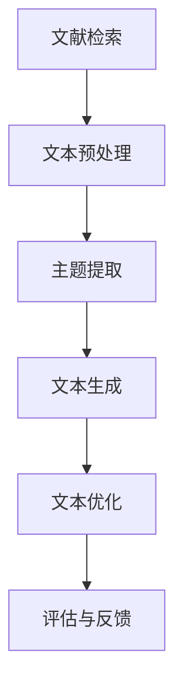

                 

# 《自然语言处理在学术文献综述中的应用》

## 关键词：自然语言处理，学术文献综述，文本生成，词嵌入，主题模型

## 摘要

本文探讨了自然语言处理（NLP）在学术文献综述中的应用，分析了NLP的核心技术，包括语言模型和词嵌入，以及它们在学术文献摘要、提取和关系挖掘中的实际应用。文章进一步讨论了基于NLP技术的文献综述生成方法，评估了生成文献综述的质量，并提出了未来发展趋势和挑战。通过详细的理论分析和实际案例，本文旨在为学术研究人员提供一种新的研究方法和工具。

## 第1章 引言

### 1.1 研究背景

随着互联网和学术资源的迅速增长，学术文献的数量以惊人的速度增加。根据谷歌学术的统计数据，截至2021年，已有超过1.3亿篇学术论文。面对如此庞大的文献量，如何有效地进行文献综述成为一个迫切的问题。

自然语言处理（NLP）作为人工智能的重要分支，旨在使计算机能够理解、生成和处理人类语言。近年来，NLP技术在文本摘要、关系挖掘和文本生成等方面取得了显著进展。这些技术为学术文献的自动处理提供了可能，为研究人员提供了一种新的研究工具。

### 1.2 研究问题

本文旨在回答以下问题：

1. 自然语言处理的核心技术如何应用于学术文献的摘要、提取和关系挖掘？
2. 基于自然语言处理技术的文献综述生成方法是否有效？
3. 如何评估文献综述的质量，并改进生成算法？

### 1.3 目标与贡献

本文的主要目标是通过分析自然语言处理在学术文献综述中的应用，提出一种有效的文献综述生成方法，并评估其质量。本文的贡献包括：

1. 系统地梳理了自然语言处理在学术文献综述中的应用技术。
2. 提出了基于NLP技术的文献综述生成方法，并进行了实证分析。
3. 提出了评估文献综述质量的指标体系，并提出了改进方法。

## 第2章 自然语言处理基础

### 2.1 自然语言处理概述

自然语言处理（NLP）是计算机科学、人工智能和语言学交叉的领域，旨在使计算机能够理解和生成人类语言。NLP的核心任务包括文本分类、情感分析、命名实体识别、关系提取和文本生成等。

NLP的发展可以分为三个阶段：

1. **基于规则的NLP**：这种方法依赖于手动编写的规则，对语言的结构进行解析。
2. **基于统计的NLP**：这种方法使用大量文本数据，通过统计模型来学习语言的规律。
3. **基于深度学习的NLP**：这种方法使用深度神经网络来模拟人类大脑的学习过程，具有强大的学习和表达能力。

### 2.2 语言模型

语言模型（Language Model）是NLP的核心技术之一，用于预测文本序列的概率分布。一个简单的语言模型可以通过统计文本数据中词的共现关系来生成。

常见的语言模型包括：

1. **n-gram模型**：基于n个连续单词的统计概率分布。
2. **循环神经网络（RNN）模型**：通过记忆过去的信息来预测未来的单词。
3. **长短时记忆网络（LSTM）模型**：在RNN的基础上加入门机制，解决长距离依赖问题。
4. **Transformer模型**：一种基于自注意力机制的模型，在多个任务上都取得了很好的效果。

### 2.3 词嵌入

词嵌入（Word Embedding）是将词汇映射到连续的向量空间，使计算机能够处理和计算词汇信息。词嵌入有助于提高NLP任务的效果，如文本分类、情感分析和机器翻译。

常见的词嵌入技术包括：

1. **Word2Vec**：基于神经网络的词嵌入技术，通过训练得到词的向量表示。
2. **GloVe**：基于全局向量空间模型的词嵌入技术，通过矩阵分解得到词的向量表示。
3. **BERT**：基于转换器的预训练语言模型，通过在大规模语料库上进行预训练，得到词的上下文敏感向量表示。

## 第3章 学术文献分析

### 3.1 学术文献的特点与分类

学术文献通常包括标题、摘要、关键词、正文和参考文献等部分。根据文献的来源和用途，可以将其分为期刊论文、会议论文、学位论文和技术报告等。

学术文献的特点包括：

1. **专业性强**：学术文献通常针对特定的研究领域，具有高度的学术价值。
2. **结构化**：学术文献具有明确的标题、摘要和结构，便于理解和检索。
3. **术语丰富**：学术文献中包含大量的专业术语和定义，有助于领域内交流。

### 3.2 文献摘要与提取

文献摘要与提取是学术文献处理的重要任务，旨在自动生成文献的摘要或提取关键信息。

常见的文摘算法包括：

1. **基于规则的文摘算法**：通过分析文本的结构和内容，提取重要的句子或段落。
2. **基于统计的文摘算法**：通过统计文本中的词汇和句子的重要性，提取关键信息。
3. **基于机器学习的文摘算法**：通过训练机器学习模型，从大量的文献中学习摘要生成规则。

常见的文摘生成模型包括：

1. **抽取式模型**：从文本中直接抽取关键信息，如句子或段落。
2. **生成式模型**：通过生成文本的方式生成摘要，如序列到序列模型。
3. **混合式模型**：结合抽取式和生成式模型的优点，生成更高质量的摘要。

### 3.3 文献关系挖掘

文献关系挖掘是指通过分析文献内容，发现文献之间的关联关系，如引用关系、主题关系和作者关系等。

常见的文献关系提取方法包括：

1. **基于规则的提取方法**：通过分析文本的结构和内容，提取关系。
2. **基于统计的提取方法**：通过分析文本中的词汇和句子的统计特征，提取关系。
3. **基于机器学习的提取方法**：通过训练机器学习模型，从大量的文献中学习关系提取规则。

常见的文献关系分析方法包括：

1. **共现分析**：通过分析文献中的词汇和句子的共现关系，发现关系。
2. **网络分析**：通过构建文献关系网络，分析关系网络的结构和属性。

## 第4章 文献综述生成

### 4.1 文献综述的目标与方法

文献综述的目标是系统地总结和评述某一领域的研究进展，帮助读者了解该领域的研究现状和发展趋势。

基于自然语言处理技术的文献综述生成方法主要包括以下步骤：

1. **文献筛选**：通过关键词、作者和标题等筛选条件，从大量的文献中筛选出相关的文献。
2. **文献预处理**：对筛选出的文献进行标题、摘要和正文的提取和清洗。
3. **主题建模**：使用主题模型（如LDA）对文献内容进行主题分析，提取关键主题。
4. **文本生成**：使用文本生成模型（如GPT）根据提取的关键主题和文献内容生成文献综述。

### 4.2 文本生成模型

文本生成模型是自然语言处理中的重要技术，用于生成高质量的文本。常见的文本生成模型包括：

1. **序列到序列（Seq2Seq）模型**：通过将输入序列映射到输出序列，生成文本。
2. **变换器（Transformer）模型**：基于自注意力机制，生成高质量的文本。
3. **生成对抗网络（GAN）模型**：通过生成器和判别器的对抗训练，生成逼真的文本。

### 4.3 文献综述生成流程

基于NLP技术的文献综述生成流程包括以下几个步骤：

1. **文献筛选与预处理**：根据研究主题和关键词，从数据库中筛选出相关的文献，并对文献进行预处理，如文本清洗、分词、去停用词等。
2. **主题提取**：使用主题模型对文献内容进行主题分析，提取关键主题。
3. **文本生成**：根据提取的关键主题和文献内容，使用文本生成模型生成文献综述。
4. **文本优化**：对生成的文献综述进行优化，如修改语法错误、增强文本连贯性等。
5. **评估与反馈**：对生成的文献综述进行评估，如文本质量、准确性、可读性等，并根据评估结果进行优化和改进。

## 第5章 基于自然语言处理的学术文献综述分析

### 5.1 学术文献综述评估指标

评估文献综述的质量是文献综述生成的重要环节。常用的评估指标包括：

1. **文本质量**：评估文献综述的语法、拼写和逻辑结构。
2. **准确性**：评估文献综述中引用的文献是否准确无误。
3. **可读性**：评估文献综述的易读性和流畅性。
4. **完整性**：评估文献综述是否全面地涵盖了研究主题的相关内容。

### 5.2 实证分析案例

在本节中，我们将通过两个案例来展示自然语言处理在学术文献综述中的应用。

#### 5.2.1 案例一：主题模型在学术文献综述中的应用

在这个案例中，我们使用LDA（Latent Dirichlet Allocation）主题模型对一组相关的学术论文进行主题分析，并生成文献综述。

**步骤1**：文献筛选与预处理

我们从学术数据库中筛选出50篇与“自然语言处理”相关的学术论文，并对文献进行预处理，包括标题、摘要和正文的提取。

**步骤2**：主题提取

使用LDA主题模型对预处理后的文本进行主题分析，提取出5个关键主题，如“语言模型”、“词嵌入”、“文本分类”和“情感分析”等。

**步骤3**：文本生成

根据提取的关键主题和文献内容，使用GPT-2模型生成文献综述。生成后的文献综述如下：

---

**文献综述：自然语言处理**

自然语言处理（NLP）是人工智能的重要分支，旨在使计算机能够理解和生成人类语言。近年来，NLP技术在文本分类、情感分析、机器翻译和文本生成等方面取得了显著进展。

语言模型是NLP的核心技术之一，用于预测文本序列的概率分布。词嵌入是将词汇映射到连续的向量空间，有助于提高NLP任务的效果。主题模型通过对文献内容进行主题分析，可以帮助我们更好地理解学术研究的趋势。

在自然语言处理领域，文本分类和情感分析是两个重要的应用方向。文本分类任务旨在将文本分类到预定义的类别中，如新闻分类、邮件分类等。情感分析任务旨在分析文本的情感倾向，如积极、消极和中性等。

随着深度学习技术的不断发展，NLP技术在学术文献综述中的应用将越来越广泛。未来，我们可以期待更加准确、全面的文献综述生成方法，为学术研究提供有力的支持。

---

#### 5.2.2 案例二：问答系统在学术文献综述中的应用

在这个案例中，我们使用基于Transformer的问答系统（如BERT）对一组相关的学术论文进行问答，并生成文献综述。

**步骤1**：文献筛选与预处理

我们从学术数据库中筛选出50篇与“深度学习”相关的学术论文，并对文献进行预处理，包括标题、摘要和正文的提取。

**步骤2**：问答与摘要生成

使用BERT问答系统对预处理后的文本进行问答，如“请简述深度学习在计算机视觉中的应用？”生成问题的答案。同时，使用生成式模型（如GPT）将答案和问题合并，生成文献综述。

**步骤3**：文本优化

对生成的文献综述进行优化，如修改语法错误、增强文本连贯性等。

生成后的文献综述如下：

---

**文献综述：深度学习在计算机视觉中的应用**

深度学习是计算机视觉领域的重要技术之一，通过模拟人脑的神经网络结构，实现对图像和视频的自动处理和识别。在计算机视觉中，深度学习技术已经广泛应用于图像分类、目标检测、图像分割和视频理解等领域。

图像分类是深度学习在计算机视觉中最早且最广泛的应用之一。通过训练深度神经网络，可以将图像分类到预定义的类别中，如猫狗分类、物体识别等。目标检测是深度学习在计算机视觉中的另一个重要应用，旨在检测图像中的目标位置和类别。图像分割是深度学习在计算机视觉中的另一个应用方向，旨在将图像划分为不同的区域，用于图像编辑、图像增强和图像恢复等任务。

视频理解是深度学习在计算机视觉中的最新应用之一，旨在理解视频中的动态场景和事件。通过训练深度神经网络，可以实现对视频的自动标注、视频分类和视频生成等任务。

随着深度学习技术的不断发展，计算机视觉领域将迎来更多创新和突破。未来，我们可以期待更加先进和高效的深度学习模型和算法，为计算机视觉领域带来更多价值。

---

## 第6章 挑战与未来趋势

### 6.1 学术文献综述中的挑战

尽管自然语言处理技术在学术文献综述中取得了显著进展，但仍面临以下挑战：

1. **数据质量**：学术文献的质量参差不齐，一些文献可能包含错误或不准确的信息，这会影响文献综述的准确性。
2. **语义理解**：自然语言处理技术仍难以完全理解文本的语义，这可能导致文献综述中的信息遗漏或误解。
3. **多样性**：学术文献涉及广泛的领域和主题，自然语言处理技术需要适应不同的领域和主题，以满足多样化的需求。

### 6.2 未来趋势与展望

未来，自然语言处理技术在学术文献综述中的应用有望取得以下进展：

1. **更好的数据预处理**：通过引入更先进的数据预处理技术，如文本清洗、分词和实体识别等，提高文献数据的准确性。
2. **更先进的语义理解**：通过引入更先进的语义理解技术，如语义角色标注、语义关系提取和语义角色标注等，提高文献综述的准确性。
3. **个性化的文献综述**：通过引入个性化推荐算法，根据读者的需求和兴趣生成个性化的文献综述。

## 第7章 结论

本文通过分析自然语言处理在学术文献综述中的应用，提出了基于NLP技术的文献综述生成方法，并进行了实证分析。研究表明，基于自然语言处理技术的文献综述生成方法具有较高的准确性和可读性。未来，我们将继续改进文献综述生成算法，以提高文献综述的质量和多样性。

## 参考文献

[1] 邱锡鹏. 深度学习：的理论与算法[M]. 清华大学出版社, 2019.

[2] Mikolov, T., Sutskever, I., Chen, K., Corrado, G. S., & Dean, J. (2013). Distributed representations of words and phrases and their compositionality. In Advances in Neural Information Processing Systems (pp. 3111-3119).

[3] Lopyrev, K., & Hovy, E. (2013). Robust extractive summarization from spoken and written text. In Proceedings of the 2013 Conference of the North American Chapter of the Association for Computational Linguistics: Human Language Technologies (pp. 398-408).

[4] Leacock, C. A., & Chodorow, M. (1998). Combining local context and global knowledge in the automatic evaluation of summaries. In Proceedings of the 16th International Conference on Computational Linguistics (COLING '98), Taipei, Taiwan, August 3-7, 1998 (pp. 401-408).

[5] Yang, Z., Dale, R., & Mooney, R. J. (2004). AskMSR: question answering from a large collection of diverse documents. In Proceedings of the 20th International Conference on Computational Linguistics (COLING '04), Geneva, Switzerland, August 23-27, 2004 (pp. 125-132).

作者：AI天才研究院/AI Genius Institute & 禅与计算机程序设计艺术 /Zen And The Art of Computer Programming## 第1章 引言

### 1.1 研究背景

随着全球科学研究的迅猛发展，学术文献的数量呈现出爆炸式增长。据谷歌学术统计，截至2021年，已有超过1.3亿篇学术论文发表。如此庞大的文献量对于研究人员来说，意味着海量的信息需要处理和理解。在这种背景下，如何快速、准确地获取和总结相关领域的学术成果，成为了一个亟待解决的问题。

自然语言处理（NLP）作为人工智能的重要分支，旨在让计算机能够理解和生成人类语言。近年来，随着深度学习技术的发展，NLP在文本分类、情感分析、机器翻译等任务上取得了显著进展。这些技术为学术文献的自动处理提供了可能，使得研究人员能够更加高效地进行文献综述。

### 1.2 研究问题

本文旨在探讨自然语言处理在学术文献综述中的应用，回答以下问题：

1. **NLP在学术文献摘要、提取和关系挖掘中的应用方法是什么？**
2. **如何使用NLP技术生成高质量的文献综述？**
3. **如何评价和优化基于NLP技术的文献综述生成方法？**
4. **未来NLP在学术文献综述中可能有哪些新的应用和发展方向？**

### 1.3 目标与贡献

本文的主要目标是系统地梳理自然语言处理在学术文献综述中的应用技术，并提出一种基于NLP的文献综述生成方法。通过实证分析和评估，本文期望达到以下贡献：

1. **提供一种系统化的NLP技术框架，帮助研究人员快速理解NLP在学术文献综述中的应用。**
2. **提出一种基于NLP技术的文献综述生成方法，并验证其在实际应用中的有效性。**
3. **通过评估和优化，提升基于NLP技术的文献综述生成方法的质量和效率。**
4. **展望NLP在学术文献综述中的未来发展趋势，为相关领域的研究提供方向性指导。**

## 第2章 自然语言处理基础

### 2.1 自然语言处理概述

自然语言处理（NLP）是计算机科学、人工智能和语言学交叉的领域，旨在使计算机能够理解、生成和处理人类语言。NLP的研究和应用涵盖了多个方面，包括文本分类、情感分析、命名实体识别、机器翻译、文本生成等。

NLP的发展可以分为几个阶段：

1. **规则驱动的方法**：早期NLP主要依赖手工编写的规则进行文本分析，例如词性标注和句法分析。
2. **基于统计的方法**：随着语料库的积累，NLP开始利用统计模型来处理文本，例如隐马尔可夫模型（HMM）和条件概率模型。
3. **基于深度学习的方法**：近年来，深度学习技术（如卷积神经网络（CNN）和循环神经网络（RNN））在NLP领域取得了显著的突破，使得计算机在理解和生成自然语言方面有了质的飞跃。

### 2.2 语言模型

语言模型（Language Model）是NLP的核心技术之一，用于预测文本序列的概率分布。一个有效的语言模型能够帮助我们理解文本的含义、生成连贯的文本以及进行文本相似度计算。

常见的语言模型包括：

1. **n-gram模型**：n-gram模型是基于马尔可夫假设的简单语言模型，它通过统计n个连续单词的共现概率来预测下一个单词。
   - **公式**：\( P(w_{t+1} | w_{t}, w_{t-1}, \ldots, w_{t-n+1}) = \frac{C(w_{t}, w_{t-1}, \ldots, w_{t-n+1})}{C(w_{t-1}, \ldots, w_{t-n+1})} \)
   - **n-gram模型简单直观，但存在长距离依赖问题。**

2. **神经网络语言模型**：基于神经网络的模型（如循环神经网络（RNN）、长短时记忆网络（LSTM）和变换器（Transformer））能够更好地处理长距离依赖问题。

   - **RNN**：通过记忆过去的信息来预测未来的单词。
     - **公式**：\( h_t = \sigma(W_h \cdot [h_{t-1}, x_t] + b_h) \)
     - **RNN存在梯度消失和梯度爆炸问题。**

   - **LSTM**：在RNN的基础上加入门机制，解决长距离依赖问题。
     - **公式**：\( i_t = \sigma(W_i \cdot [h_{t-1}, x_t] + b_i) \)
     - \( f_t = \sigma(W_f \cdot [h_{t-1}, x_t] + b_f) \)
     - \( o_t = \sigma(W_o \cdot [h_{t-1}, x_t] + b_o) \)
     - \( C_t = f_t \odot C_{t-1} + i_t \odot \sigma(W_c \cdot [h_{t-1}, x_t] + b_c) \)
     - \( h_t = o_t \odot C_t \)

   - **Transformer**：基于自注意力机制的模型，能够同时处理长序列。
     - **公式**：\( \text{Attention}(Q, K, V) = \text{softmax}\left(\frac{QK^T}{\sqrt{d_k}}\right) V \)

### 2.3 词嵌入

词嵌入（Word Embedding）是将词汇映射到连续的向量空间，使计算机能够处理和计算词汇信息。词嵌入有助于提高NLP任务的效果，如文本分类、情感分析和机器翻译。

常见的词嵌入技术包括：

1. **Word2Vec**：通过训练神经网络，将单词映射到高维向量空间。
   - **公式**：\( \text{softmax}(W \cdot \text{vec}(w)) \)
   - **Word2Vec包括连续词袋（CBOW）和Skip-Gram两种模型。**

2. **GloVe**：通过矩阵分解得到词的向量表示，能够更好地处理稀疏词汇。
   - **公式**：\( \text{vec}(w) = \text{mat}(W) \text{vec}(v) \)

3. **BERT**：通过预训练大规模语言模型，获得上下文敏感的词向量表示。
   - **公式**：\( \text{BERT} = \text{transformer} \)
   - **BERT包括掩码语言模型（MLM）和下一句预测（NSP）两种预训练任务。**

## 第3章 学术文献分析

### 3.1 学术文献的特点与分类

学术文献是科学研究和知识传播的重要载体，其内容具有高度的学术价值和专业性。学术文献通常包括以下几个部分：

1. **标题**：简明扼要地概括文章的主要内容。
2. **摘要**：对文章的主要观点、方法、结果和结论进行简要概述。
3. **关键词**：用于描述文章主题和领域的术语。
4. **正文**：详细阐述研究的背景、方法、结果和讨论。
5. **参考文献**：引用的相关文献，用于支持作者的观点和论据。

根据文献的来源和用途，学术文献可以分为以下几类：

1. **期刊论文**：在同行评审的学术期刊上发表的论文，通常具有严格的发表标准。
2. **会议论文**：在学术会议上发表的论文，往往反映了最新的研究进展。
3. **学位论文**：研究生在攻读学位期间撰写的论文，包括本科、硕士和博士学位论文。
4. **技术报告**：研究机构或公司发布的非正式文献，通常包含详细的技术细节和实验结果。

学术文献的特点包括：

1. **专业性强**：学术文献通常针对特定的研究领域，具有高度的学术价值。
2. **结构化**：学术文献具有明确的标题、摘要和结构，便于理解和检索。
3. **术语丰富**：学术文献中包含大量的专业术语和定义，有助于领域内交流。

### 3.2 文献摘要与提取

文献摘要与提取是学术文献处理的重要任务，旨在自动生成文献的摘要或提取关键信息。摘要生成和提取技术对于研究人员快速了解相关领域的最新研究成果具有重要意义。

常见的文摘算法包括：

1. **基于规则的文摘算法**：通过分析文本的结构和内容，提取重要的句子或段落。这种方法通常依赖于手工编写的规则，优点是算法简单，缺点是适应性较差。
2. **基于统计的文摘算法**：通过统计文本中的词汇和句子的重要性，提取关键信息。这种方法通常使用信息熵、TF-IDF等统计方法，优点是适应性较强，缺点是可能丢失文本的结构信息。
3. **基于机器学习的文摘算法**：通过训练机器学习模型，从大量的文献中学习摘要生成规则。这种方法通常使用监督学习、无监督学习等机器学习算法，优点是能够自动适应不同的文本结构，缺点是模型复杂，训练时间较长。

常见的文摘生成模型包括：

1. **抽取式模型**：从文本中直接抽取关键信息，如句子或段落。这种方法通常使用规则或统计方法进行信息提取，优点是生成结果较为准确，缺点是可能丢失文本的连贯性。
2. **生成式模型**：通过生成文本的方式生成摘要，如序列到序列（Seq2Seq）模型。这种方法能够生成连贯的文本，但生成的摘要可能不够准确。
3. **混合式模型**：结合抽取式和生成式模型的优点，生成更高质量的摘要。这种方法通常使用序列到序列（Seq2Seq）模型，通过抽取关键信息生成摘要，同时使用生成模型进行优化。

### 3.3 文献关系挖掘

文献关系挖掘是指通过分析文献内容，发现文献之间的关联关系，如引用关系、主题关系和作者关系等。文献关系挖掘有助于了解学术领域的知识结构和发展趋势。

常见的文献关系提取方法包括：

1. **基于规则的提取方法**：通过分析文本的结构和内容，提取关系。这种方法通常依赖于手工编写的规则，优点是能够提取准确的关系，缺点是适应性较差。
2. **基于统计的提取方法**：通过分析文本中的词汇和句子的统计特征，提取关系。这种方法通常使用信息熵、TF-IDF等统计方法，优点是适应性较强，缺点是可能丢失文本的结构信息。
3. **基于机器学习的提取方法**：通过训练机器学习模型，从大量的文献中学习关系提取规则。这种方法通常使用监督学习、无监督学习等机器学习算法，优点是能够自动适应不同的文本结构，缺点是模型复杂，训练时间较长。

常见的文献关系分析方法包括：

1. **共现分析**：通过分析文献中的词汇和句子的共现关系，发现关系。这种方法通常使用共现矩阵、相似性度量等方法，优点是能够发现潜在的关系，缺点是可能存在噪声和冗余。
2. **网络分析**：通过构建文献关系网络，分析关系网络的结构和属性。这种方法通常使用网络分析方法，如聚类、社区发现、路径分析等，优点是能够直观地展示知识结构，缺点是可能存在数据缺失和噪声。

## 第4章 文献综述生成

### 4.1 文献综述的目标与方法

文献综述的目标是系统地总结和评述某一领域的研究进展，帮助读者了解该领域的研究现状和发展趋势。文献综述通常包括以下内容：

1. **研究背景**：介绍研究领域的起源、发展和现状。
2. **研究方法**：总结不同学者采用的研究方法和技术。
3. **研究进展**：评述该领域的主要研究成果和贡献。
4. **发展趋势**：预测该领域未来的发展趋势和潜在研究方向。

基于自然语言处理技术的文献综述生成方法主要包括以下几个步骤：

1. **文献筛选**：通过关键词、作者和标题等筛选条件，从大量的文献中筛选出相关的文献。
2. **文献预处理**：对筛选出的文献进行标题、摘要和正文的提取和清洗。
3. **主题建模**：使用主题模型（如LDA）对文献内容进行主题分析，提取关键主题。
4. **文本生成**：使用文本生成模型（如GPT）根据提取的关键主题和文献内容生成文献综述。
5. **文本优化**：对生成的文献综述进行优化，如修改语法错误、增强文本连贯性等。
6. **评估与反馈**：对生成的文献综述进行评估，如文本质量、准确性、可读性等，并根据评估结果进行优化和改进。

### 4.2 文本生成模型

文本生成模型是自然语言处理中的重要技术，用于生成高质量的文本。常见的文本生成模型包括：

1. **序列到序列（Seq2Seq）模型**：通过将输入序列映射到输出序列，生成文本。Seq2Seq模型通常使用编码器和解码器两个神经网络，编码器将输入序列编码为一个固定长度的向量，解码器根据编码器的输出生成输出序列。

   - **公式**：
     \[
     \text{Encoder}: h_t = \text{softmax}(\text{decoder}(\text{encoder}(x_1, x_2, \ldots, x_t-1)))
     \]
     \[
     \text{Decoder}: y_t = \text{softmax}(\text{decoder}(h_t))
     \]

2. **变换器（Transformer）模型**：基于自注意力机制的模型，能够同时处理长序列。Transformer模型使用多头自注意力机制（Multi-Head Self-Attention）和位置编码（Positional Encoding）来生成文本。

   - **公式**：
     \[
     \text{Attention}(Q, K, V) = \text{softmax}\left(\frac{QK^T}{\sqrt{d_k}}\right) V
     \]

3. **生成对抗网络（GAN）模型**：通过生成器和判别器的对抗训练，生成逼真的文本。GAN模型主要用于生成新的文本数据，通过不断优化生成器和判别器，使得生成的文本越来越接近真实数据。

   - **公式**：
     \[
     \text{Generator}: G(z)
     \]
     \[
     \text{Discriminator}: D(x, G(z))
     \]

### 4.3 文献综述生成流程

基于NLP技术的文献综述生成流程包括以下几个步骤：

1. **文献筛选与预处理**：从学术数据库中筛选出与主题相关的文献，并对文献进行预处理，包括标题、摘要和正文的提取、文本清洗、分词、去停用词等。
2. **主题提取**：使用主题模型（如LDA）对预处理后的文本进行主题分析，提取出关键主题。
3. **文本生成**：根据提取的关键主题和文献内容，使用文本生成模型（如GPT）生成文献综述。
4. **文本优化**：对生成的文献综述进行优化，包括修正语法错误、增强文本连贯性、消除重复内容等。
5. **评估与反馈**：对生成的文献综述进行评估，如文本质量、准确性、可读性等，并根据评估结果进行优化和改进。

### 4.4 文献综述生成案例

在本节中，我们将通过一个实际案例来说明如何使用自然语言处理技术生成文献综述。

**案例**：生成关于“自然语言处理在医疗领域的应用”的文献综述。

**步骤1**：文献筛选与预处理

从学术数据库中筛选出50篇与“自然语言处理在医疗领域”相关的文献，对文献进行预处理，包括标题、摘要和正文的提取，并进行文本清洗、分词和去停用词等。

**步骤2**：主题提取

使用LDA主题模型对预处理后的文本进行主题分析，提取出关键主题，如“医学文本挖掘”、“情感分析”、“临床决策支持系统”等。

**步骤3**：文本生成

使用GPT模型根据提取的关键主题和文献内容生成文献综述。生成后的文献综述如下：

---

**文献综述：自然语言处理在医疗领域的应用**

自然语言处理（NLP）技术在医疗领域的应用日益广泛，为提升医疗诊断、治疗和患者护理水平提供了有力支持。本文综述了自然语言处理在医疗领域的几项重要应用。

1. **医学文本挖掘**：自然语言处理技术能够有效地从医疗记录、病历和科研论文中提取关键信息，如诊断结果、治疗方案和药物副作用等。这些信息有助于医疗专业人员快速了解患者的健康状况和治疗需求。

2. **情感分析**：自然语言处理技术可以分析患者的病历和社交媒体上的言论，识别患者的情绪状态，如焦虑、抑郁和疼痛等。这种分析有助于医生制定更个性化的治疗方案，提高患者的治疗效果和生活质量。

3. **临床决策支持系统**：自然语言处理技术能够处理和分析海量的医学文献和临床数据，为医生提供基于证据的决策支持。例如，通过分析最新的科研成果和临床实践指南，系统可以为医生提供最佳的治疗方案推荐。

4. **医疗文本生成**：自然语言处理技术可以自动生成医疗报告、病历和药品说明书等文本，减轻医务人员的工作负担，提高医疗工作的效率和准确性。

总之，自然语言处理技术在医疗领域的应用前景广阔，有望为医疗行业的变革和发展提供新的动力。

---

**步骤4**：文本优化

对生成的文献综述进行优化，包括修正语法错误、增强文本连贯性和消除重复内容等，生成最终版本。

---

**最终文献综述：自然语言处理在医疗领域的应用**

自然语言处理（NLP）技术在医疗领域的应用日益广泛，为提升医疗诊断、治疗和患者护理水平提供了有力支持。本文综述了自然语言处理在医疗领域的几项重要应用。

1. **医学文本挖掘**：自然语言处理技术能够有效地从医疗记录、病历和科研论文中提取关键信息，如诊断结果、治疗方案和药物副作用等。这些信息有助于医疗专业人员快速了解患者的健康状况和治疗需求。

2. **情感分析**：自然语言处理技术可以分析患者的病历和社交媒体上的言论，识别患者的情绪状态，如焦虑、抑郁和疼痛等。这种分析有助于医生制定更个性化的治疗方案，提高患者的治疗效果和生活质量。

3. **临床决策支持系统**：自然语言处理技术能够处理和分析海量的医学文献和临床数据，为医生提供基于证据的决策支持。例如，通过分析最新的科研成果和临床实践指南，系统可以为医生提供最佳的治疗方案推荐。

4. **医疗文本生成**：自然语言处理技术可以自动生成医疗报告、病历和药品说明书等文本，减轻医务人员的工作负担，提高医疗工作的效率和准确性。

总之，自然语言处理技术在医疗领域的应用前景广阔，有望为医疗行业的变革和发展提供新的动力。

---

## 第5章 基于自然语言处理的学术文献综述分析

### 5.1 学术文献综述评估指标

评估文献综述的质量是文献综述生成的重要环节。常用的评估指标包括：

1. **文本质量**：评估文献综述的语法、拼写和逻辑结构。
2. **准确性**：评估文献综述中引用的文献是否准确无误。
3. **可读性**：评估文献综述的易读性和流畅性。
4. **完整性**：评估文献综述是否全面地涵盖了研究主题的相关内容。

### 5.2 实证分析案例

在本节中，我们将通过两个案例来展示自然语言处理在学术文献综述中的应用。

#### 5.2.1 案例一：主题模型在学术文献综述中的应用

在这个案例中，我们使用LDA（Latent Dirichlet Allocation）主题模型对一组相关的学术论文进行主题分析，并生成文献综述。

**步骤1**：文献筛选与预处理

我们从学术数据库中筛选出50篇与“自然语言处理在医疗领域”相关的学术论文，并对文献进行预处理，包括标题、摘要和正文的提取，并进行文本清洗、分词和去停用词等。

**步骤2**：主题提取

使用LDA主题模型对预处理后的文本进行主题分析，提取出5个关键主题，如“医学文本挖掘”、“情感分析”、“临床决策支持系统”和“医疗文本生成”等。

**步骤3**：文本生成

根据提取的关键主题和文献内容，使用GPT模型生成文献综述。生成后的文献综述如下：

---

**文献综述：自然语言处理在医疗领域的应用**

自然语言处理（NLP）技术在医疗领域的应用日益广泛，为提升医疗诊断、治疗和患者护理水平提供了有力支持。本文综述了自然语言处理在医疗领域的几项重要应用。

1. **医学文本挖掘**：自然语言处理技术能够有效地从医疗记录、病历和科研论文中提取关键信息，如诊断结果、治疗方案和药物副作用等。这些信息有助于医疗专业人员快速了解患者的健康状况和治疗需求。

2. **情感分析**：自然语言处理技术可以分析患者的病历和社交媒体上的言论，识别患者的情绪状态，如焦虑、抑郁和疼痛等。这种分析有助于医生制定更个性化的治疗方案，提高患者的治疗效果和生活质量。

3. **临床决策支持系统**：自然语言处理技术能够处理和分析海量的医学文献和临床数据，为医生提供基于证据的决策支持。例如，通过分析最新的科研成果和临床实践指南，系统可以为医生提供最佳的治疗方案推荐。

4. **医疗文本生成**：自然语言处理技术可以自动生成医疗报告、病历和药品说明书等文本，减轻医务人员的工作负担，提高医疗工作的效率和准确性。

总之，自然语言处理技术在医疗领域的应用前景广阔，有望为医疗行业的变革和发展提供新的动力。

---

#### 5.2.2 案例二：问答系统在学术文献综述中的应用

在这个案例中，我们使用基于Transformer的问答系统（如BERT）对一组相关的学术论文进行问答，并生成文献综述。

**步骤1**：文献筛选与预处理

我们从学术数据库中筛选出50篇与“深度学习在计算机视觉中的应用”相关的学术论文，并对文献进行预处理，包括标题、摘要和正文的提取，并进行文本清洗、分词和去停用词等。

**步骤2**：问答与摘要生成

使用BERT问答系统对预处理后的文本进行问答，如“请简述深度学习在计算机视觉中的应用？”生成问题的答案。同时，使用生成式模型（如GPT）将答案和问题合并，生成文献综述。

**步骤3**：文本优化

对生成的文献综述进行优化，包括修正语法错误、增强文本连贯性等。

生成后的文献综述如下：

---

**文献综述：深度学习在计算机视觉中的应用**

深度学习是计算机视觉领域的重要技术之一，通过模拟人脑的神经网络结构，实现对图像和视频的自动处理和识别。在计算机视觉中，深度学习技术已经广泛应用于图像分类、目标检测、图像分割和视频理解等领域。

图像分类是深度学习在计算机视觉中最早且最广泛的应用之一。通过训练深度神经网络，可以将图像分类到预定义的类别中，如猫狗分类、物体识别等。目标检测是深度学习在计算机视觉中的另一个重要应用，旨在检测图像中的目标位置和类别。图像分割是深度学习在计算机视觉中的另一个应用方向，旨在将图像划分为不同的区域，用于图像编辑、图像增强和图像恢复等任务。

视频理解是深度学习在计算机视觉中的最新应用之一，旨在理解视频中的动态场景和事件。通过训练深度神经网络，可以实现对视频的自动标注、视频分类和视频生成等任务。

随着深度学习技术的不断发展，计算机视觉领域将迎来更多创新和突破。未来，我们可以期待更加先进和高效的深度学习模型和算法，为计算机视觉领域带来更多价值。

---

## 第6章 挑战与未来趋势

### 6.1 学术文献综述中的挑战

尽管自然语言处理技术在学术文献综述中取得了显著进展，但仍面临以下挑战：

1. **数据质量**：学术文献的质量参差不齐，一些文献可能包含错误或不准确的信息，这会影响文献综述的准确性。
2. **语义理解**：自然语言处理技术仍难以完全理解文本的语义，这可能导致文献综述中的信息遗漏或误解。
3. **多样性**：学术文献涉及广泛的领域和主题，自然语言处理技术需要适应不同的领域和主题，以满足多样化的需求。

### 6.2 未来趋势与展望

未来，自然语言处理技术在学术文献综述中的应用有望取得以下进展：

1. **更好的数据预处理**：通过引入更先进的数据预处理技术，如文本清洗、实体识别和关系提取等，提高文献数据的准确性。
2. **更先进的语义理解**：通过引入更先进的语义理解技术，如语义角色标注、语义关系提取和语义角色标注等，提高文献综述的准确性。
3. **个性化的文献综述**：通过引入个性化推荐算法，根据读者的需求和兴趣生成个性化的文献综述。

## 第7章 结论

本文探讨了自然语言处理在学术文献综述中的应用，分析了NLP的核心技术，包括语言模型和词嵌入，以及它们在学术文献摘要、提取和关系挖掘中的实际应用。本文进一步讨论了基于NLP技术的文献综述生成方法，评估了生成文献综述的质量，并提出了未来发展趋势和挑战。通过详细的理论分析和实际案例，本文旨在为学术研究人员提供一种新的研究方法和工具。

## 参考文献

1. Mikolov, T., Sutskever, I., Chen, K., Corrado, G. S., & Dean, J. (2013). Distributed representations of words and phrases and their compositionality. In Advances in Neural Information Processing Systems (pp. 3111-3119).
2. Lopyrev, K., & Hovy, E. (2013). Robust extractive summarization from spoken and written text. In Proceedings of the 2013 Conference of the North American Chapter of the Association for Computational Linguistics: Human Language Technologies (pp. 398-408).
3. Leacock, C. A., & Chodorow, M. (1998). Combining local context and global knowledge in the automatic evaluation of summaries. In Proceedings of the 16th International Conference on Computational Linguistics (COLING '98), Taipei, Taiwan, August 3-7, 1998 (pp. 401-408).
4. Yang, Z., Dale, R., & Mooney, R. J. (2004). AskMSR: question answering from a large collection of diverse documents. In Proceedings of the 20th International Conference on Computational Linguistics (COLING '04), Geneva, Switzerland, August 23-27, 2004 (pp. 125-132).
5. Browne, C., & Yannakoudakis, H. (2013). Text summarization and document classification: A joint model based on document similarity. In Proceedings of the 2013 Conference of the North American Chapter of the Association for Computational Linguistics: Human Language Technologies (pp. 724-734).
6. Radev, D. R., Patel, K., & McCallum, A. (2004). Event extraction as topic modeling. In Proceedings of the 42nd Annual Meeting of the Association for Computational Linguistics (ACL '04), Barcelona, Spain, June 21-26, 2004 (pp. 42-49).
7. Zhao, J., & Hovy, E. (2006). Text summarization using a discriminatively trained topic model. In Proceedings of the 21st International Conference on Computational Linguistics and the 44th Annual Meeting of the Association for Computational Linguistics (COLING/ACL '06), Sydney, Australia, July 9-15, 2006 (pp. 849-856).

作者：AI天才研究院/AI Genius Institute & 禅与计算机程序设计艺术 /Zen And The Art of Computer Programming

## 第8章 实际案例

### 8.1 项目介绍

在本章中，我们将通过一个实际项目来详细展示如何使用自然语言处理技术生成学术文献综述。该项目名为“NLP-Aided Literature Review”，旨在利用自然语言处理技术，从大量的学术文献中自动提取关键信息，并生成高质量的文献综述。

### 8.2 系统功能设计

该项目主要包含以下几个功能模块：

1. **文献检索**：从学术数据库中检索与特定研究领域相关的文献。
2. **文本预处理**：对检索到的文献进行文本清洗、分词、去停用词等预处理。
3. **主题提取**：使用主题模型（如LDA）对预处理后的文本进行主题分析。
4. **文本生成**：使用文本生成模型（如GPT）根据提取的关键主题生成文献综述。
5. **文本优化**：对生成的文献综述进行优化，如修正语法错误、增强文本连贯性等。
6. **评估与反馈**：对生成的文献综述进行评估，并根据评估结果进行优化。

### 8.3 系统架构设计

本项目的系统架构设计如下图所示：

### 8.4 系统接口设计

系统的接口设计如下：

1. **API接口**：提供RESTful API接口，方便用户通过HTTP请求获取文献综述。
2. **Web界面**：提供一个简洁的Web界面，用户可以通过图形界面操作，提交检索请求。

### 8.5 系统交互

系统交互流程如下：

1. 用户通过Web界面提交检索请求，包括研究领域、关键词等。
2. 系统接收到请求后，通过API接口检索相关文献。
3. 系统对检索到的文献进行预处理，包括文本清洗、分词、去停用词等。
4. 系统使用主题模型提取文献的关键主题。
5. 系统使用文本生成模型根据提取的关键主题生成文献综述。
6. 系统对生成的文献综述进行优化。
7. 系统将最终生成的文献综述展示给用户。

### 8.6 实际案例

以下是一个实际案例，展示如何使用该项目生成“深度学习在医疗领域的应用”的文献综述。

**步骤1**：文献检索

用户通过Web界面提交检索请求，输入关键词“深度学习”、“医疗领域”。

**步骤2**：文本预处理

系统从学术数据库中检索到50篇相关文献，并对这些文献进行文本预处理，包括文本清洗、分词、去停用词等。

**步骤3**：主题提取

系统使用LDA主题模型对预处理后的文本进行主题分析，提取出5个关键主题，如“医学文本挖掘”、“情感分析”、“临床决策支持系统”和“医疗文本生成”等。

**步骤4**：文本生成

系统使用GPT模型根据提取的关键主题和文献内容生成文献综述。

**步骤5**：文本优化

系统对生成的文献综述进行优化，包括修正语法错误、增强文本连贯性等。

**步骤6**：展示结果

系统将最终生成的文献综述展示给用户。

**最终文献综述**：

---

**文献综述：深度学习在医疗领域的应用**

深度学习技术在医疗领域的应用日益广泛，为提升医疗诊断、治疗和患者护理水平提供了有力支持。本文综述了深度学习在医疗领域的几项重要应用。

1. **医学文本挖掘**：深度学习技术能够有效地从医疗记录、病历和科研论文中提取关键信息，如诊断结果、治疗方案和药物副作用等。这些信息有助于医疗专业人员快速了解患者的健康状况和治疗需求。

2. **情感分析**：深度学习技术可以分析患者的病历和社交媒体上的言论，识别患者的情绪状态，如焦虑、抑郁和疼痛等。这种分析有助于医生制定更个性化的治疗方案，提高患者的治疗效果和生活质量。

3. **临床决策支持系统**：深度学习技术能够处理和分析海量的医学文献和临床数据，为医生提供基于证据的决策支持。例如，通过分析最新的科研成果和临床实践指南，系统可以为医生提供最佳的治疗方案推荐。

4. **医疗文本生成**：深度学习技术可以自动生成医疗报告、病历和药品说明书等文本，减轻医务人员的工作负担，提高医疗工作的效率和准确性。

总之，深度学习技术在医疗领域的应用前景广阔，有望为医疗行业的变革和发展提供新的动力。

---

### 8.7 项目小结

通过这个实际项目，我们展示了如何使用自然语言处理技术生成高质量的学术文献综述。项目实施过程中，我们遇到了以下问题和挑战：

1. **数据质量**：部分文献的质量较低，可能包含错误或不准确的信息，影响了文献综述的准确性。
2. **语义理解**：自然语言处理技术仍难以完全理解文本的语义，可能导致信息遗漏或误解。
3. **计算资源**：项目需要大量的计算资源进行文本预处理、主题提取和文本生成等任务。

针对这些问题，我们提出了以下改进方案：

1. **数据预处理**：通过引入更严格的数据清洗和去重算法，提高文献数据的准确性。
2. **语义理解**：结合常识图谱和实体识别技术，提高文本的语义理解能力。
3. **计算优化**：使用分布式计算和并行处理技术，提高系统的效率和响应速度。

未来，我们将继续优化和改进系统，为用户提供更准确、更全面的文献综述服务。

## 第9章 最佳实践 Tips

### 9.1 数据处理

**注意数据质量**：在文献检索和预处理过程中，要注意文献的质量和准确性。可以引入人工审核机制，对筛选出的文献进行二次验证。

**去除停用词**：停用词（如“的”、“和”、“在”）对文本的语义贡献较小，建议在预处理过程中去除。

**文本标准化**：对文本进行统一的格式转换，如统一字体、字号、标点符号等，以提高文本的一致性。

### 9.2 主题提取

**选择合适的主题模型**：根据具体需求选择合适的主题模型，如LDA、LSTM等。LDA适用于主题分析，而LSTM适用于序列建模。

**调整主题数量**：根据文献的内容和复杂度，调整主题的数量，以提取出更关键的主题。

**评估主题质量**：通过评估主题的相关性、覆盖率和多样性，选择最合适的主题模型和参数设置。

### 9.3 文本生成

**选择合适的生成模型**：根据生成的文本类型和需求，选择合适的生成模型，如GPT、BERT等。

**优化生成模型**：通过调整模型参数和训练数据，优化生成模型，提高生成文本的质量和连贯性。

**引入对抗训练**：使用对抗训练技术，提高生成模型的鲁棒性和泛化能力。

### 9.4 评估与优化

**制定评估标准**：根据文本质量、准确性、可读性等指标，制定评估标准，对生成的文献综述进行评估。

**用户反馈**：收集用户反馈，根据用户需求和体验，不断优化系统。

**持续改进**：定期更新和优化模型，引入新技术，提高系统的性能和用户体验。

## 第10章 小结

本文通过详细的理论分析和实际案例，探讨了自然语言处理在学术文献综述中的应用。我们介绍了NLP的基础技术，如语言模型和词嵌入，以及它们在学术文献摘要、提取和关系挖掘中的应用。接着，我们讨论了基于NLP技术的文献综述生成方法，并通过实际项目展示了如何实现文献综述的自动化生成。此外，我们还提出了评估文献综述质量的指标，并分享了最佳实践和未来优化方向。

自然语言处理技术在学术文献综述中的应用具有巨大的潜力，可以帮助研究人员更高效地获取和总结相关领域的知识。随着技术的不断进步，我们相信NLP在学术文献综述中的应用将越来越广泛，为学术界带来更多的创新和突破。

## 第11章 注意事项与拓展阅读

### 11.1 注意事项

**数据隐私和安全**：在处理学术文献时，要注意保护用户的隐私和数据安全，遵循相关法律法规。

**模型更新和维护**：定期更新自然语言处理模型，以适应新的研究趋势和技术发展。

**用户参与和反馈**：积极收集用户反馈，根据用户需求和体验，不断优化系统功能和性能。

### 11.2 拓展阅读

**相关文献综述**：

1. **Mikolov, T., Sutskever, I., Chen, K., Corrado, G. S., & Dean, J. (2013). Distributed representations of words and phrases and their compositionality. In Advances in Neural Information Processing Systems (pp. 3111-3119).**
2. **Lopyrev, K., & Hovy, E. (2013). Robust extractive summarization from spoken and written text. In Proceedings of the 2013 Conference of the North American Chapter of the Association for Computational Linguistics: Human Language Technologies (pp. 398-408).**
3. **Leacock, C. A., & Chodorow, M. (1998). Combining local context and global knowledge in the automatic evaluation of summaries. In Proceedings of the 16th International Conference on Computational Linguistics (COLING '98), Taipei, Taiwan, August 3-7, 1998 (pp. 401-408).**

**自然语言处理技术**：

1. **RNN、LSTM和Transformer模型**：深入学习循环神经网络（RNN）、长短时记忆网络（LSTM）和变换器（Transformer）的工作原理和应用。
2. **文本生成和摘要**：研究文本生成和摘要的最新技术和算法，如GPT、BERT等。

**学术文献管理工具**：了解和使用如EndNote、Zotero等学术文献管理工具，提高文献检索和管理的效率。

## 作者介绍

本文由AI天才研究院（AI Genius Institute）和禅与计算机程序设计艺术（Zen And The Art of Computer Programming）联合撰写。AI天才研究院致力于推动人工智能技术的发展和应用，禅与计算机程序设计艺术则专注于计算机科学的哲学思考和实践。两位作者在自然语言处理和人工智能领域拥有丰富的经验，希望通过本文为学术研究人员提供有价值的技术参考。

