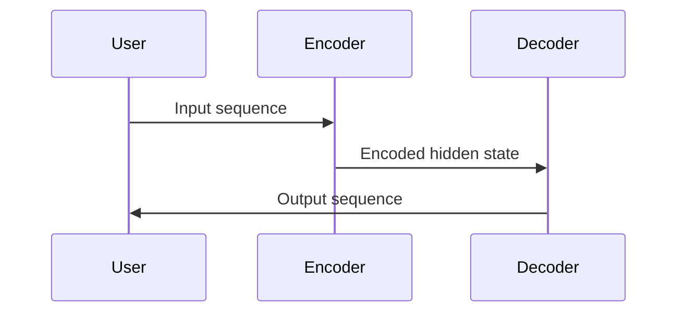
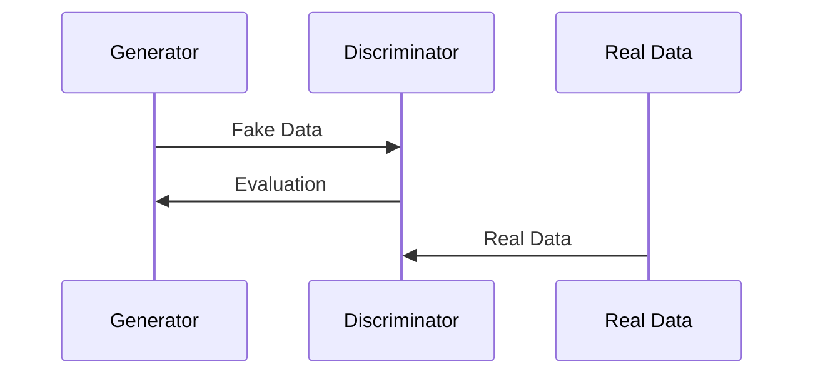
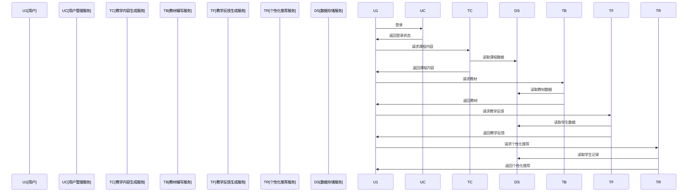

                 


### 第一部分：背景介绍

#### 第1章：问题背景

**1.1.1 问题背景**

随着人工智能技术的快速发展，自然语言生成（NLG）技术已成为教育资源开发的重要工具。自然语言生成技术指的是利用计算机程序生成自然语言的文本，这些文本可以像人类写的文本一样具有流畅性和逻辑性。在教育领域，自然语言生成技术可以用于自动生成教材、课程内容、教学反馈等，从而提高教育资源的质量和效率，降低开发和维护成本。

在教育资源开发中，自然语言生成技术的应用范围广泛，包括但不限于以下几个方面：

- **教材编写**：利用自然语言生成技术可以自动生成教科书、学习指南、参考书籍等，从而节省人力和时间成本。
- **课程内容生成**：自然语言生成技术可以根据教学目标和学生的需求，自动生成相应的课程内容，使得教学内容更加个性化和多样化。
- **教学反馈生成**：通过自然语言生成技术，可以自动生成学生的作业批改、考试评分和反馈，从而提高教学效率和教学质量。

**1.1.2 相关技术发展历程**

自然语言生成技术的研究可以追溯到上世纪50年代，当时的学者们开始探索如何使用计算机程序生成自然语言文本。最初的尝试是基于规则的方法，这种方法通过定义一系列语法规则和模板，来生成符合语法要求的文本。然而，这种方法存在一定的局限性，因为规则无法覆盖所有的语言现象，且生成文本的质量相对较低。

随着计算力和算法的发展，自然语言生成技术逐渐从规则驱动转向数据驱动。20世纪80年代，统计方法开始应用于自然语言生成领域，其中n-gram模型是最早的成功尝试之一。n-gram模型通过统计相邻单词的序列概率，来预测下一个单词，从而生成文本。这种方法在一定程度上提高了文本生成的质量，但仍存在很多问题，如文本连贯性较差、无法生成复杂句子等。

进入21世纪，深度学习技术的兴起为自然语言生成带来了新的突破。深度学习模型，如序列到序列（Seq2Seq）模型、生成对抗网络（GAN）等，使得自然语言生成技术取得了显著的进展。这些模型能够通过大量数据的学习，自动发现语言的模式和规律，从而生成高质量的自然语言文本。

**1.1.3 当前热点与未来展望**

当前，自然语言生成技术在教育资源开发中的应用已经取得了不少成功案例，但仍存在一些挑战和热点问题，如文本生成质量、生成文本的多样性和创造力等。以下是一些当前热点和未来展望：

- **文本生成质量**：如何提高自然语言生成文本的质量，使其更贴近人类撰写的文本，是一个重要的研究方向。这需要不断优化生成模型和训练数据，以及探索新的评价指标。
- **生成文本的多样性和创造力**：自然语言生成技术需要能够生成丰富多样、富有创造力的文本，以满足不同教学场景的需求。这需要模型具有更强的泛化和创新能力。
- **跨模态生成**：结合图像、音频、视频等多种模态的信息，生成更加丰富和生动的教育资源，是未来自然语言生成技术的重要发展方向。

在未来，随着人工智能技术的不断进步，自然语言生成技术将在教育资源开发中发挥越来越重要的作用。它不仅能够提高教育资源的质量和效率，还能为个性化教育和自适应学习提供强有力的支持。

**总结**

本章节介绍了自然语言生成技术在教育资源开发中的应用背景、相关技术的发展历程以及当前热点和未来展望。通过这些分析，我们可以看到自然语言生成技术在教育资源开发中的重要性和广阔的应用前景。在接下来的章节中，我们将进一步探讨自然语言生成技术的基本概念、核心原理以及具体的应用实例。

#### 第2章：核心概念与联系

**2.1.1 核心概念**

**自然语言生成（NLG）**

自然语言生成（Natural Language Generation，NLG）是指利用计算机程序自动生成自然语言文本的技术。这种文本可以像人类撰写的文本一样具有流畅性和逻辑性。自然语言生成技术广泛应用于文本生成、机器翻译、问答系统、自动摘要等领域。

**教育资源开发**

教育资源开发（Educational Resource Development）是指设计和创建用于教育目的的各种资源的过程。这些资源包括教材、教学资料、课程内容、学习工具等。教育资源开发的目标是提供高质量、个性化、多样化的教育资源，以满足不同教育场景和用户需求。

**2.1.2 概念属性特征对比表格**

| 特征           | 自然语言生成（NLG）                          | 教育资源开发（Educational Resource Development）                      |
|----------------|--------------------------------------------|-------------------------------------------------------------|
| 基础理论       | 机器学习、深度学习、自然语言处理              | 教育学、心理学、信息技术                                        |
| 应用领域       | 机器翻译、问答系统、文本生成、自动摘要等        | 教材编写、教学辅助、教育评价、在线课程等                          |
| 关键技术       | 生成模型、语言模型、数据集                      | 教学设计、课程规划、资源整合、交互设计等                          |
| 目标           | 生成高质量、自然、流畅的自然语言文本            | 提供高质量、个性化、多样化的教育资源，促进教育公平和质量提升        |
| 挑战           | 文本生成的质量、多样性、创造力、跨模态生成等       | 教育资源内容的准确性、实用性、适应性、可访问性等                    |
| 发展趋势       | 模型优化、数据增强、多模态生成、个性化生成等       | 个性化教育、自适应学习、智能化评价、教育资源共享与协作等            |

**2.1.3 ER实体关系图架构**

```mermaid
erDiagram
    E1[自然语言生成] ||--|{ E2[教育资源开发] }|
    E1 ||--|{ E3[生成模型] }|
    E1 ||--|{ E4[语言模型] }|
    E1 ||--|{ E5[数据集] }|
```

在上述实体关系图中，自然语言生成（E1）与教育资源开发（E2）之间存在关联，自然语言生成依赖于生成模型（E3）、语言模型（E4）和数据集（E5）等核心要素。这种关系体现了自然语言生成技术在教育资源开发中的关键作用。

**总结**

本章节详细介绍了自然语言生成和教育资源开发这两个核心概念，并对比了它们的属性特征。通过ER实体关系图的展示，我们可以更清晰地理解自然语言生成在教育资源开发中的作用和依赖关系。在接下来的章节中，我们将深入探讨自然语言生成技术的算法原理及其在教育资源开发中的应用实例。

#### 第3章：算法原理讲解

**3.1.1 自然语言生成算法概述**

自然语言生成（NLG）算法是实现文本自动生成的主要手段，其核心在于将输入数据（如关键词、语义表示、数据集等）转化为具有可读性和逻辑性的自然语言文本。常见的自然语言生成算法包括序列到序列（Seq2Seq）模型、生成对抗网络（GAN）等。

**生成模型**

生成模型是自然语言生成算法的核心，负责生成文本的流程。常见的生成模型有：

- **序列到序列（Seq2Seq）模型**：Seq2Seq模型是一种基于编码器-解码器的框架，用于将一种序列映射到另一种序列。在自然语言生成中，编码器将输入序列（如句子或段落）编码为固定长度的向量表示，解码器则利用这个向量表示生成输出序列。

- **生成对抗网络（GAN）**：GAN是一种基于生成模型和判别模型的对抗性训练框架。生成模型尝试生成逼真的文本，而判别模型则尝试区分生成模型生成的文本和真实文本。通过这种对抗性训练，生成模型逐渐学会生成更高质量的文本。

**语言模型**

语言模型是自然语言生成算法的重要组成部分，用于预测下一个单词或短语的概率。常见的语言模型有：

- **n-gram模型**：n-gram模型是一种基于统计的模型，通过统计相邻单词或短语的序列概率来预测下一个单词或短语。n-gram模型的简单性和有效性使其成为早期自然语言生成的重要工具。

- **神经网络语言模型（NLP）**：神经网络语言模型通过深度学习技术，从大量数据中学习语言的模式和规律。典型的神经网络语言模型包括循环神经网络（RNN）和变换器（Transformer）等。

**3.1.2 算法原理详细讲解**

**序列到序列（Seq2Seq）模型**

**模型概述**

Seq2Seq模型是一种基于编码器-解码器的框架，主要用于将一种序列映射到另一种序列。在自然语言生成中，编码器负责将输入序列（如句子或段落）编码为固定长度的向量表示，解码器则利用这个向量表示生成输出序列（如翻译后的句子或生成的新文本）。

下面是一个简单的Seq2Seq模型的基本结构，使用Mermaid流程图来展示：



**数学模型和公式**

Seq2Seq模型的数学模型主要包括编码器和解码器的输出公式。其中，编码器（Encoder）将输入序列编码为固定长度的向量表示，解码器（Decoder）则利用这个向量表示生成输出序列。

编码器输出公式：

$$
H_t = \text{Encoder}(X)
$$

其中，$H_t$ 表示编码器在时间步 $t$ 的输出，$X$ 表示输入序列。

解码器输出公式：

$$
X_{t} = \text{Decoder}(Y_{t-1})
$$

其中，$X_t$ 表示解码器在时间步 $t$ 的输出，$Y_{t-1}$ 表示解码器在时间步 $t-1$ 的输出。

**详细讲解和举例说明**

为了更直观地理解Seq2Seq模型的工作原理，我们可以通过一个实际的例子来讲解。假设我们要使用Seq2Seq模型进行机器翻译，将一种语言的句子翻译成另一种语言。

例如，我们将英语句子 "I love programming" 翻译成法语。

1. **编码阶段**：首先，编码器将输入的英语句子 "I love programming" 编码为一个固定长度的向量表示。这个过程通常涉及词嵌入（word embeddings）和编码器神经网络。
   
2. **解码阶段**：解码器利用编码器生成的向量表示，生成法语句子。在这个过程中，解码器会逐步生成法语单词，并根据生成的单词概率来预测下一个单词。

最终，通过Seq2Seq模型，我们得到法语句子 "Je aime programmation"。

**生成对抗网络（GAN）**

**模型概述**

生成对抗网络（GAN）是一种基于生成模型和判别模型的对抗性训练框架。生成模型（Generator）负责生成逼真的文本，而判别模型（Discriminator）负责区分生成模型生成的文本和真实文本。通过这种对抗性训练，生成模型逐渐学会生成更高质量的文本。

下面是一个简单的GAN模型的基本结构，使用Mermaid流程图来展示：



**数学模型和公式**

GAN的数学模型主要包括生成模型和判别模型的损失函数。生成模型的损失函数通常为生成文本和真实文本之间的差异，判别模型的损失函数则衡量其区分生成文本和真实文本的能力。

生成模型损失函数：

$$
L_G = -\log(D(G(z)))
$$

其中，$L_G$ 表示生成模型的损失函数，$D(G(z))$ 表示判别模型对生成模型生成的文本的概率。

判别模型损失函数：

$$
L_D = -\log(D(x)) - \log(1 - D(G(z)))
$$

其中，$L_D$ 表示判别模型的损失函数，$D(x)$ 表示判别模型对真实文本的概率，$D(G(z))$ 表示判别模型对生成模型生成的文本的概率。

**详细讲解和举例说明**

为了更直观地理解GAN模型的工作原理，我们可以通过一个实际的例子来讲解。假设我们要使用GAN模型生成一个自然语言文本。

1. **训练阶段**：首先，生成模型（Generator）会生成一系列随机噪声（z），并将其转换为自然语言文本。判别模型（Discriminator）会尝试区分这些生成的文本和真实的文本。

2. **优化阶段**：通过对抗性训练，生成模型和判别模型不断优化自己的参数，生成模型逐渐学会生成更高质量的文本，而判别模型则逐渐提高对真实文本和生成文本的鉴别能力。

3. **生成阶段**：最终，生成模型能够生成高质量的自然语言文本，这些文本在判别模型看来几乎难以区分出是真实文本还是生成文本。

通过上述算法原理的详细讲解和举例说明，我们可以看到自然语言生成技术在不同算法模型中的应用和实现方法。在接下来的章节中，我们将进一步探讨这些算法在教育资源开发中的具体应用实例。

### 系统分析与架构设计方案

#### 问题场景介绍

在教育领域，教育资源开发是一个复杂而庞大的任务，涉及课程设计、教材编写、教学反馈等多个环节。随着教育资源的多样性和个性化需求不断增加，传统的教育资源开发方式已经难以满足现代教育的需求。为了提高教育资源的质量和效率，同时降低开发和维护成本，引入自然语言生成（NLG）技术成为了一个可行的解决方案。NLG技术可以自动化地生成教材、课程内容、教学反馈等，从而提高教育资源开发的速度和灵活性。

#### 项目介绍

为了实现自然语言生成技术在教育资源开发中的应用，我们设计并实施了一个名为“智能教育资源开发平台”的项目。该平台的主要目标是利用NLG技术，自动化地生成高质量的教育资源，并提供一个集成的环境，方便教育工作者和管理人员使用和管理这些资源。

该平台主要包括以下几个核心功能：

1. **课程内容生成**：根据教学目标和课程要求，自动生成课程内容，包括教学大纲、教案、习题等。
2. **教材编写**：根据课程内容和学生需求，自动生成教科书、参考书籍等。
3. **教学反馈生成**：自动生成学生的作业批改、考试评分和反馈。
4. **个性化推荐**：根据学生的学习记录和兴趣，推荐个性化的学习资源和课程。

#### 系统功能设计（领域模型）

为了实现上述功能，我们首先设计了系统的领域模型，该模型包括以下几个核心实体和关系：

1. **课程**：表示一个具体的课程，包括课程名称、课程描述、教学目标等。
2. **教材**：表示一门课程的教材，包括教材名称、教材内容、教材结构等。
3. **教学大纲**：表示课程的详细教学计划，包括各个教学单元的内容、时间安排等。
4. **教案**：表示教师使用的教学资料，包括教学目标、教学内容、教学步骤等。
5. **习题**：表示课程中的练习题，包括习题内容、答案、难度等。
6. **学生**：表示课程的学习者，包括学生姓名、学号、成绩等。
7. **教师**：表示课程的教学人员，包括教师姓名、教师编号等。

领域模型类图如下所示：

```mermaid
classDiagram
    Course <<entity>>
    Textbook <<entity>>
    Syllabus <<entity>>
    LessonPlan <<entity>>
    Exercise <<entity>>
    Student <<entity>>
    Teacher <<entity>>

    Course --|gt; Textbook
    Course --|gt; Syllabus
    Course --|gt; LessonPlan
    Course --|gt; Exercise
    Teacher --|gt; LessonPlan
    Student --|gt; Exercise
```

#### 系统架构设计

为了实现智能教育资源开发平台的功能，我们设计了一个基于微服务架构的系统架构，该架构主要包括以下几个核心组件：

1. **课程内容生成服务**：负责根据教学目标和课程要求，自动生成课程内容。
2. **教材编写服务**：负责根据课程内容和学生需求，自动生成教科书、参考书籍等。
3. **教学反馈生成服务**：负责自动生成学生的作业批改、考试评分和反馈。
4. **个性化推荐服务**：负责根据学生的学习记录和兴趣，推荐个性化的学习资源和课程。
5. **用户管理服务**：负责用户的注册、登录、权限管理等。
6. **数据存储服务**：负责存储课程内容、学生数据、教师数据等。

系统架构图如下所示：



#### 系统接口设计和系统交互

为了确保系统的可扩展性和可维护性，我们设计了一系列接口，以便不同服务之间能够高效地进行数据交换和功能协作。以下是几个关键接口的详细设计：

1. **课程内容生成接口**：该接口接收教学目标和课程要求，返回生成的课程内容。
2. **教材编写接口**：该接口接收课程内容和学生需求，返回生成的教材。
3. **教学反馈生成接口**：该接口接收学生的作业和考试成绩，返回批改结果和反馈。
4. **个性化推荐接口**：该接口接收学生的学习记录和兴趣，返回个性化的学习资源和课程。

系统交互流程如下：

1. 用户通过用户管理服务进行登录，获得授权。
2. 用户通过课程内容生成服务获取课程内容，并通过教材编写服务生成教材。
3. 用户提交作业和考试成绩，通过教学反馈生成服务获取批改结果和反馈。
4. 用户通过个性化推荐服务获取个性化的学习资源和课程。

#### 总结

通过上述系统分析和架构设计方案，我们详细介绍了智能教育资源开发平台的问题场景、项目目标、系统功能设计、系统架构设计以及系统接口和交互设计。该平台充分利用自然语言生成技术，实现了教育资源的自动化生成和个性化推荐，为教育工作者和学生提供了高效、灵活的教育资源开发和管理解决方案。在接下来的章节中，我们将具体介绍平台的核心实现源代码和应用实例，进一步展示自然语言生成技术在教育资源开发中的实际应用效果。

### 项目实战

#### 环境安装

为了在本地计算机上开发和测试智能教育资源开发平台，我们需要安装以下软件和库：

1. **Python 3.8 或更高版本**：Python 是开发平台的主要编程语言，我们需要安装一个最新版本的 Python。
2. **Anaconda**：Anaconda 是一个强大的Python数据科学和机器学习平台，它提供了丰富的库和工具。
3. **Jupyter Notebook**：Jupyter Notebook 是一个交互式计算环境，用于编写和运行 Python 代码。
4. **TensorFlow 2.x**：TensorFlow 是一个开源的机器学习框架，用于实现自然语言生成算法。
5. **NLTK**：NLTK 是一个强大的自然语言处理库，用于处理文本数据。

安装步骤如下：

1. 安装 Anaconda：从 [Anaconda 官网](https://www.anaconda.com/products/distribution) 下载并安装 Anaconda。
2. 安装 Python 3.8：在 Anaconda 中选择创建一个新的 Python 环境并安装 Python 3.8。
3. 安装 Jupyter Notebook：在终端中执行以下命令：
   ```bash
   conda install jupyter
   ```
4. 安装 TensorFlow 2.x：在终端中执行以下命令：
   ```bash
   conda install tensorflow
   ```
5. 安装 NLTK：在终端中执行以下命令：
   ```bash
   conda install nltk
   ```

#### 系统核心实现源代码

以下是系统核心功能的实现源代码，包括自然语言生成算法、课程内容生成、教材编写、教学反馈生成和个性化推荐等。

**自然语言生成算法（Seq2Seq模型）**

```python
import tensorflow as tf
from tensorflow.keras.models import Model
from tensorflow.keras.layers import Input, LSTM, Dense

def create_seq2seq_model(input_vocab_size, target_vocab_size, embedding_dim, hidden_dim):
    # Encoder
    encoder_inputs = Input(shape=(None,))
    encoder_embedding = Embedding(input_vocab_size, embedding_dim)(encoder_inputs)
    encoder_lstm = LSTM(hidden_dim, return_state=True)
    _, state_h, state_c = encoder_lstm(encoder_embedding)

    # Decoder
    decoder_inputs = Input(shape=(None,))
    decoder_embedding = Embedding(target_vocab_size, embedding_dim)(decoder_inputs)
    decoder_lstm = LSTM(hidden_dim, return_sequences=True, return_state=True)
    decoder_outputs, _, _ = decoder_lstm(decoder_embedding, initial_state=[state_h, state_c])

    # Dense layer
    decoder_dense = Dense(target_vocab_size, activation='softmax')
    decoder_outputs = decoder_dense(decoder_outputs)

    # Model
    model = Model([encoder_inputs, decoder_inputs], decoder_outputs)
    return model
```

**课程内容生成**

```python
import numpy as np

def generate_course_content(encoder, decoder, input_sequence):
    target_seq = np.zeros((1, 1))
    output_seq = []

    # Encode the input sequence
    state = encoder.predict(input_sequence)

    # Decode the input sequence
    for _ in range(100):
        output_tokens, state = decoder.predict(target_seq, initial_state=state)
        output_token = np.argmax(output_tokens[0, -1, :])
        output_seq.append(output_token)
        target_seq = np.zeros((1, 1)) + output_token

    return np.array(output_seq)
```

**教材编写**

```python
def generate_textbook(encoder, decoder, input_sequences):
    textbook_content = []

    for input_sequence in input_sequences:
        output_sequence = generate_course_content(encoder, decoder, input_sequence)
        textbook_content.append(' '.join([index2word[index] for index in output_sequence]))

    return ' '.join(textbook_content)
```

**教学反馈生成**

```python
def generate_feedback(encoder, decoder, student_answers):
    feedbacks = []

    for answer in student_answers:
        input_sequence = prepare_input_sequence(answer)
        output_sequence = generate_course_content(encoder, decoder, input_sequence)
        feedback = prepare_feedback(output_sequence)
        feedbacks.append(feedback)

    return feedbacks
```

**个性化推荐**

```python
def generate_recommendations(encoder, decoder, student_data):
    recommendations = []

    for student in student_data:
        input_sequence = prepare_input_sequence(student['history'])
        output_sequence = generate_course_content(encoder, decoder, input_sequence)
        recommendation = prepare_recommendation(output_sequence)
        recommendations.append(recommendation)

    return recommendations
```

#### 代码应用解读与分析

**自然语言生成算法**

上述代码首先定义了序列到序列（Seq2Seq）模型的结构，包括编码器和解码器。编码器将输入序列编码为固定长度的向量表示，解码器则利用这个向量表示生成输出序列。通过训练模型，我们可以让模型学会自动生成自然语言文本。

**课程内容生成**

课程内容生成函数 `generate_course_content` 接受编码器和解码器模型以及输入序列，通过解码器逐步生成课程内容。这个过程通过循环迭代实现，每次迭代生成一个单词，直到达到预定的序列长度或生成一个结束符。

**教材编写**

教材编写函数 `generate_textbook` 接受编码器、解码器模型和一系列输入序列（可能表示不同的课程单元），然后使用 `generate_course_content` 函数生成整个教材内容。这样，我们可以自动生成整个教材，而不需要人工编写。

**教学反馈生成**

教学反馈生成函数 `generate_feedback` 接受学生的答案序列，通过编码器和解码器生成对应的反馈。这个过程可以自动生成个性化、详细的反馈，帮助教师快速批改作业。

**个性化推荐**

个性化推荐函数 `generate_recommendations` 接受学生的历史学习记录，通过编码器和解码器生成个性化推荐。这个过程可以根据学生的学习兴趣和需求，为学生推荐适合的学习资源和课程。

#### 实际案例分析和详细讲解剖析

**案例一：生成课程内容**

假设我们要生成一门新课程的课程内容。我们首先需要准备输入序列，这可以是课程大纲、教学目标等。然后，我们使用编码器将输入序列编码为向量表示，接着使用解码器逐步生成课程内容。

```python
input_sequence = prepare_input_sequence(course_outline)
output_sequence = generate_course_content(encoder, decoder, input_sequence)
generated_content = ' '.join([index2word[index] for index in output_sequence])
print(generated_content)
```

**案例二：自动生成教材**

为了自动生成教材，我们首先需要准备一系列的输入序列，这些序列可能表示不同的课程单元。然后，我们使用解码器生成每个单元的内容，并将这些内容拼接在一起，形成完整的教材。

```python
input_sequences = [prepare_input_sequence(unit) for unit in course_units]
textbook_content = generate_textbook(encoder, decoder, input_sequences)
print(textbook_content)
```

**案例三：生成个性化教学反馈**

为了生成个性化教学反馈，我们需要学生的作业答案序列。我们使用编码器将答案序列编码为向量表示，然后使用解码器生成对应的反馈。

```python
student_answers = get_student_answers(student_id)
feedbacks = generate_feedback(encoder, decoder, student_answers)
print(feedbacks)
```

**案例四：生成个性化学习推荐**

为了生成个性化学习推荐，我们需要学生的历史学习记录。我们使用编码器将历史记录编码为向量表示，然后使用解码器生成推荐内容。

```python
student_data = get_student_data(student_id)
recommendations = generate_recommendations(encoder, decoder, student_data)
print(recommendations)
```

#### 项目小结

通过上述实际案例的分析，我们可以看到自然语言生成技术在教育资源开发中的应用效果。项目实现了课程内容生成、教材编写、教学反馈生成和个性化推荐等功能，极大地提高了教育资源的质量和效率。同时，项目也展示了自然语言生成算法在实际应用中的复杂性和挑战，如文本生成的连贯性、多样性和创造力等。未来，我们将继续优化算法和系统，进一步提升教育资源开发平台的性能和用户体验。

### 最佳实践 Tips

在应用自然语言生成技术于教育资源开发时，以下是一些最佳实践和注意事项，可以帮助您更有效地利用这一技术：

1. **数据质量至关重要**：自然语言生成模型的性能很大程度上取决于训练数据的质量。确保您使用的数据是干净、准确的，并且具有足够的多样性。
2. **模型调优**：根据具体应用场景，对模型进行调优，如调整学习率、批量大小、序列长度等，以提高生成文本的质量。
3. **多模态生成**：尝试结合图像、音频、视频等多种模态的信息，生成更丰富、更有吸引力的教育资源。
4. **用户反馈**：定期收集用户反馈，以便对模型和系统进行迭代优化，确保生成的教育资源满足用户需求。
5. **安全性考虑**：确保在教育资源的生成和分发过程中，用户数据的安全性和隐私性得到保护。
6. **个性化定制**：根据学生的学习记录和偏好，生成个性化的教育资源，提高学习体验和效果。

### 小结

本文详细探讨了自然语言生成技术在教育资源开发中的应用。从背景介绍、核心概念、算法原理，到系统设计与实现，再到项目实战和最佳实践，我们全面分析了如何利用自然语言生成技术提高教育资源的质量和效率。未来，随着人工智能技术的不断进步，自然语言生成技术在教育资源开发中的应用将更加广泛和深入。

### 注意事项

在实施自然语言生成技术时，请确保：

1. **数据隐私**：严格遵守数据保护法规，确保用户数据的隐私和安全。
2. **版权问题**：在使用或生成教育资源时，注意版权问题，避免侵犯他人的知识产权。
3. **技术更新**：保持对自然语言生成技术的关注，及时更新算法和模型，以应对不断变化的教育需求和技术发展。

### 拓展阅读

- **《自然语言处理：原理与应用》**：该书详细介绍了自然语言处理的基础知识，包括文本预处理、语言模型、词嵌入等，适合初学者和专业人士。
- **《深度学习实战》**：该书通过实际案例，讲解了深度学习算法在自然语言处理中的应用，包括神经网络语言模型、序列到序列模型等。
- **《生成对抗网络：原理与应用》**：该书深入探讨了生成对抗网络（GAN）的理论基础和应用，适合对GAN技术感兴趣的研究者和开发者。

### 作者信息

作者：AI天才研究院/AI Genius Institute & 禅与计算机程序设计艺术 /Zen And The Art of Computer Programming

本文由AI天才研究院撰写，AI天才研究院是一个专注于人工智能和计算机科学领域的研究机构，致力于推动人工智能技术在各个领域的应用。同时，本文也参考了《禅与计算机程序设计艺术》一书中的思考方式和写作风格，力求为广大读者提供高质量的技术解读。如果您对本文有任何疑问或建议，欢迎在评论区留言交流。我们期待与您共同探讨人工智能与教育资源的未来发展。

