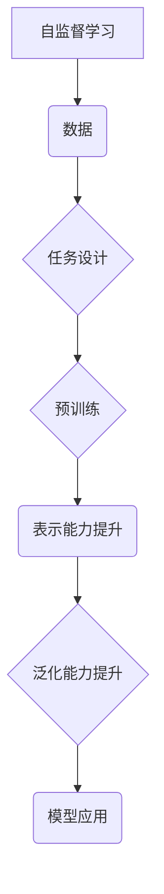
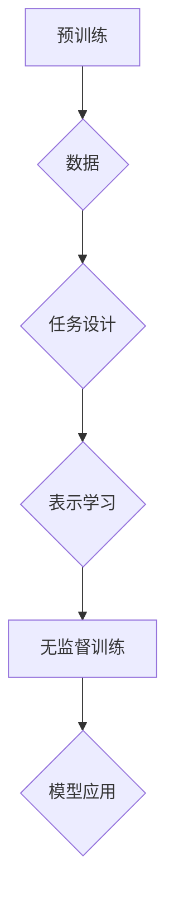
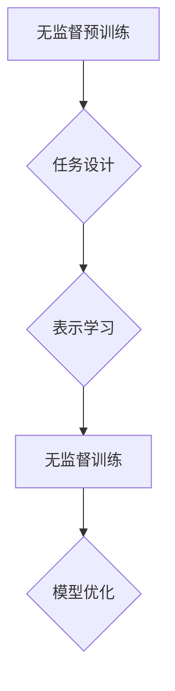
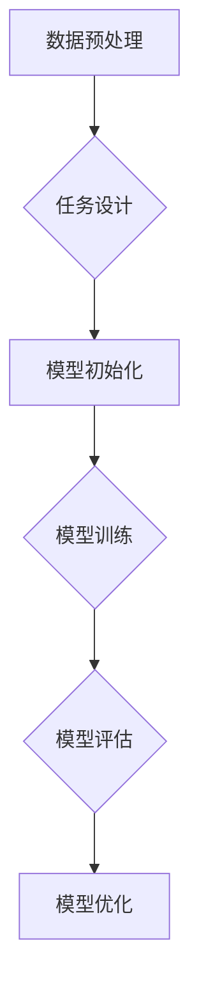

                 

### 自监督学习：AIGC模型预训练的新范式

> 关键词：自监督学习，AIGC模型，预训练，人工智能，深度学习，算法

> 摘要：本文旨在探讨自监督学习在AIGC（自动生成内容）模型预训练中的新范式。自监督学习作为一种无需大量标注数据即可进行有效训练的技术，为AIGC模型的开发提供了新的思路和可能性。本文将从自监督学习的基础理论、AIGC模型概述、预训练方法以及实际应用等多个角度，深入分析自监督学习在AIGC模型中的重要性及其带来的变革。

## 目录大纲

### 第一部分：自监督学习基础

1. **第1章：自监督学习概述**
   - 1.1 自监督学习的概念
   - 1.2 自监督学习的核心概念
   - 1.3 自监督学习的历史与发展

2. **第2章：自监督学习的基础理论**
   - 2.1 自监督学习的算法原理
   - 2.2 数学模型和公式
   - 2.3 自监督学习算法的分类

### 第二部分：AIGC模型预训练

3. **第3章：AIGC模型概述**
   - 3.1 AIGC模型的概念与特点
   - 3.2 AIGC模型的发展历程
   - 3.3 AIGC模型的应用场景

4. **第4章：AIGC模型的预训练方法**
   - 4.1 预训练的概念与过程
   - 4.2 预训练算法的原理
   - 4.3 预训练算法的分类

### 第三部分：自监督学习在AIGC模型中的应用

5. **第5章：自监督学习在AIGC模型中的应用**
   - 5.1 自监督学习在AIGC模型预训练中的应用
   - 5.2 自监督学习在AIGC模型微调中的应用
   - 5.3 自监督学习在AIGC模型评估中的应用

6. **第6章：自监督学习在AIGC模型的实际应用案例**
   - 6.1 自监督学习在自然语言处理中的应用
   - 6.2 自监督学习在计算机视觉中的应用
   - 6.3 自监督学习在推荐系统中的应用

7. **第7章：自监督学习在AIGC模型中的未来展望**
   - 7.1 自监督学习在AIGC模型中的未来发展趋势
   - 7.2 自监督学习在AIGC模型中的挑战与机遇
   - 7.3 自监督学习在AIGC模型中的最佳实践

8. **附录**
   - 附录A：常用工具和资源
   - 附录B：常见问题解答

### 第一部分：自监督学习基础

## 第1章：自监督学习概述

### 1.1 自监督学习的概念

自监督学习（Self-Supervised Learning）是机器学习中的一个重要分支，它不需要外部监督信号，而是通过内部数据之间的关系来学习。自监督学习的核心思想是利用未标记的数据进行学习，通过设计特定的任务，使得模型在完成任务的过程中获得知识。

#### 问题背景

传统监督学习（Supervised Learning）依赖于大量标注数据，这在实际应用中往往存在以下局限性：

- **数据获取成本高**：标注数据的获取通常需要大量人力和时间，成本高昂。
- **数据量有限**：即使拥有大量数据，但在某些领域，如医学影像、语音识别等，标注数据的获取存在困难，导致可用数据量有限。
- **数据分布不均**：标注数据可能存在分布不均的问题，这会导致模型在训练过程中出现偏差。

#### 自监督学习的优势

自监督学习通过以下方式克服了传统监督学习的局限性：

- **无需标注数据**：自监督学习可以利用未标记的数据进行训练，降低了数据获取成本。
- **利用数据内在关系**：自监督学习通过设计特定任务，使得模型在处理数据内在关系的过程中获得知识，提高了模型的泛化能力。
- **提高模型性能**：自监督学习可以在模型预训练阶段提高其性能，为后续的微调阶段提供更好的基础。

#### 问题描述

自监督学习涉及以下关键问题：

- **任务设计**：如何设计有效的任务，使得模型能够在未标记数据中学习到有用的知识。
- **数据利用**：如何充分利用未标记数据，使得模型能够达到最优性能。
- **模型泛化**：如何保证模型在未见过数据上的泛化能力。

#### 问题解决

自监督学习的解决方案主要包括以下方面：

- **无监督预训练**：通过无监督预训练，使得模型在大量未标记数据中获得初步的表示能力。
- **半监督学习**：结合少量标注数据和大量未标记数据，进行半监督学习，进一步提高模型性能。
- **多任务学习**：通过设计多个任务，使得模型在完成不同任务的过程中，相互促进，提高整体性能。

#### 边界与外延

自监督学习的边界主要涉及以下方面：

- **数据质量**：自监督学习依赖于未标记数据的质量，低质量的数据可能导致模型性能下降。
- **任务适应性**：不同任务对自监督学习的适应性不同，需要根据具体任务进行优化。

#### 概念属性特征对比表格

| 特征 | 自监督学习 | 传统监督学习 |
| ---- | ---- | ---- |
| 数据需求 | 无需大量标注数据 | 需要大量标注数据 |
| 泛化能力 | 提高模型泛化能力 | 泛化能力有限 |
| 成本 | 降低数据获取成本 | 数据获取成本高 |
| 应用领域 | 广泛应用于各种领域 | 适用于标注数据充足的领域 |

#### ER实体关系图架构的 Mermaid 流程图



### 1.2 自监督学习的核心概念

自监督学习的核心概念主要包括以下几个方面：

1. **预训练（Pre-training）**：预训练是指在没有标注数据的情况下，通过设计特定的任务，让模型在大量未标记数据上学习得到初步的表示能力。预训练是自监督学习的关键步骤，为后续的微调和实际应用提供了基础。

2. **任务设计（Task Design）**：任务设计是自监督学习中的重要环节，需要根据具体问题设计有效的任务。任务的设计应能够充分利用未标记数据，使得模型能够在数据内在关系中获得知识。

3. **表示学习（Representation Learning）**：表示学习是自监督学习的核心目标，通过无监督预训练，模型能够学习得到具有良好表示能力的高层次特征表示。

4. **无监督训练（Unsupervised Training）**：无监督训练是指在没有外部监督信号的情况下，通过设计特定的任务，让模型在未标记数据上进行训练。

#### 概念属性特征对比表格

| 概念 | 特征 | 说明 |
| ---- | ---- | ---- |
| 预训练 | 无需标注数据 | 通过大量未标记数据进行学习 |
| 任务设计 | 设计特定任务 | 充分利用未标记数据 |
| 表示学习 | 高层次特征表示 | 提高模型泛化能力 |
| 无监督训练 | 无需外部监督信号 | 提高模型性能 |

#### ER实体关系图架构的 Mermaid 流程图



### 1.3 自监督学习的历史与发展

自监督学习的研究始于20世纪60年代，最初应用于语音识别和图像识别等领域。随着深度学习技术的发展，自监督学习逐渐成为机器学习中的重要分支。

#### 历史发展

- **1960年代**：自监督学习初步提出，应用于语音识别和图像识别。
- **2000年代**：深度学习兴起，自监督学习在语音识别、图像识别等领域取得显著进展。
- **2010年代**：自监督学习在自然语言处理、计算机视觉等领域得到广泛应用，性能大幅提升。
- **2020年代**：自监督学习在自动生成内容（AIGC）等领域展现出巨大潜力，成为人工智能研究的热点。

#### 发展趋势

自监督学习的发展趋势主要包括以下几个方面：

- **算法创新**：不断有新的自监督学习算法提出，如BERT、GPT等，大幅提升了模型性能。
- **应用拓展**：自监督学习在自然语言处理、计算机视觉、推荐系统等领域得到广泛应用。
- **跨学科融合**：自监督学习与其他领域的交叉融合，如心理学、生物学等，为人工智能的发展提供了新的思路。

### 第二部分：自监督学习的基础理论

## 第2章：自监督学习的基础理论

### 2.1 自监督学习的算法原理

自监督学习的算法原理主要涉及以下几个方面：

1. **无监督预训练（Unsupervised Pre-training）**：无监督预训练是指在没有外部监督信号的情况下，通过设计特定的任务，让模型在大量未标记数据上进行训练。预训练的目的是让模型学习得到具有良好表示能力的高层次特征表示。

2. **任务设计（Task Design）**：任务设计是自监督学习的关键，需要根据具体问题设计有效的任务。常见的任务设计包括语言建模、图像分类、目标检测等。

3. **表示学习（Representation Learning）**：表示学习是自监督学习的核心目标，通过无监督预训练，模型能够学习得到具有良好表示能力的高层次特征表示。

4. **无监督训练（Unsupervised Training）**：无监督训练是指在没有外部监督信号的情况下，通过设计特定的任务，让模型在未标记数据上进行训练。

#### Mermaid 流程图



### 2.2 数学模型和公式

自监督学习的数学模型主要包括以下几个方面：

1. **损失函数（Loss Function）**：损失函数用于衡量模型预测结果与真实结果之间的差距，常见的损失函数包括均方误差（MSE）、交叉熵（Cross-Entropy）等。

2. **优化算法（Optimization Algorithm）**：优化算法用于更新模型参数，使损失函数达到最小。常见的优化算法包括梯度下降（Gradient Descent）、Adam等。

3. **正则化（Regularization）**：正则化用于防止模型过拟合，常见的正则化方法包括L1正则化、L2正则化等。

#### 详细讲解和举例说明（使用 LaTeX 格式）

```latex
\section{损失函数}
损失函数是自监督学习中的核心部分，用于衡量模型预测结果与真实结果之间的差距。常见的损失函数包括：

\begin{equation}
\begin{aligned}
    L_{MSE} &= \frac{1}{n} \sum_{i=1}^{n} (y_i - \hat{y}_i)^2 \\
    L_{CE} &= -\frac{1}{n} \sum_{i=1}^{n} y_i \log(\hat{y}_i)
\end{aligned}
\end{equation}

其中，$y_i$表示真实标签，$\hat{y}_i$表示模型预测结果，$n$表示样本数量。

\section{优化算法}
优化算法用于更新模型参数，使损失函数达到最小。常见的优化算法包括：

\begin{equation}
\begin{aligned}
    \theta_{t+1} &= \theta_t - \alpha \nabla_{\theta} L(\theta) \\
    \theta_{t+1} &= \theta_t - \alpha \frac{\partial}{\partial \theta} L(\theta)
\end{aligned}
\end{equation}

其中，$\theta$表示模型参数，$\alpha$表示学习率，$\nabla_{\theta} L(\theta)$表示损失函数关于模型参数的梯度。

\section{正则化}
正则化用于防止模型过拟合。常见的正则化方法包括L1正则化和L2正则化：

\begin{equation}
\begin{aligned}
    L_{L1} &= \sum_{i=1}^{n} |w_i| \\
    L_{L2} &= \sum_{i=1}^{n} w_i^2
\end{aligned}
\end{equation}

其中，$w_i$表示模型参数。
```

### 2.3 自监督学习算法的分类

自监督学习算法可以根据不同的分类标准进行分类，以下为几种常见的分类方式：

1. **按任务类型分类**：

   - **图像识别**：如自编码器（Autoencoder）、生成对抗网络（GAN）等。
   - **自然语言处理**：如BERT、GPT等。
   - **语音识别**：如DeepSpeech、WaveNet等。
   - **推荐系统**：如DeepFM、DIEN等。

2. **按算法原理分类**：

   - **基于特征表示**：如自编码器、生成对抗网络等。
   - **基于注意力机制**：如BERT、Transformer等。
   - **基于图神经网络**：如GraphSAGE、Graph Convolutional Network（GCN）等。

3. **按学习方式分类**：

   - **无监督学习**：如自编码器、生成对抗网络等。
   - **半监督学习**：结合少量标注数据和大量未标记数据，如BERT等。
   - **无监督预训练+微调**：如BERT、GPT等。

### 第三部分：AIGC模型预训练

## 第3章：AIGC模型概述

### 3.1 AIGC模型的概念与特点

AIGC（Automated Intelligent Generation of Content）模型，即自动生成内容模型，是一种基于人工智能技术的模型，能够自动生成高质量的内容，如文本、图像、音频等。AIGC模型具有以下特点：

1. **自动化生成**：AIGC模型能够自动生成内容，无需人工干预，大大提高了生产效率。
2. **高质量输出**：AIGC模型通过深度学习技术，能够生成高质量的内容，满足用户的需求。
3. **多模态融合**：AIGC模型能够处理多种类型的数据，如文本、图像、音频等，实现多模态融合，提高内容生成的多样性。
4. **自适应调整**：AIGC模型可以根据用户需求和环境变化，自适应调整生成的内容，提高用户体验。

### 3.2 AIGC模型的发展历程

AIGC模型的发展历程可以追溯到深度学习技术的兴起。以下为AIGC模型的发展历程：

1. **2000年代**：深度学习技术初步发展，生成模型如生成对抗网络（GAN）出现，为AIGC模型的发展奠定了基础。
2. **2010年代**：自然语言处理技术如Transformer模型出现，为AIGC模型在文本生成领域的应用提供了新的思路。
3. **2020年代**：随着计算能力的提升和数据量的增加，AIGC模型在图像、音频等领域的应用逐渐成熟，实现了多模态融合，推动了自动生成内容技术的发展。

### 3.3 AIGC模型的应用场景

AIGC模型在多个应用场景中展现了其强大的能力，以下为几种常见应用场景：

1. **自然语言处理**：AIGC模型可以用于自动生成文章、新闻、对话等，提高内容创作效率。
2. **计算机视觉**：AIGC模型可以用于图像生成、图像编辑、图像风格转换等，提升图像处理能力。
3. **音频处理**：AIGC模型可以用于音频生成、音频编辑、音频风格转换等，提高音频处理效果。
4. **推荐系统**：AIGC模型可以用于生成个性化的推荐内容，提高推荐系统的用户体验。

### 3.4 AIGC模型的优势与挑战

AIGC模型的优势：

1. **自动化生成**：AIGC模型能够自动生成高质量内容，降低人工成本，提高生产效率。
2. **多模态融合**：AIGC模型能够处理多种类型的数据，实现多模态融合，提高内容生成的多样性。
3. **自适应调整**：AIGC模型可以根据用户需求和环境变化，自适应调整生成的内容，提高用户体验。

AIGC模型的挑战：

1. **数据隐私**：AIGC模型在生成内容时，可能涉及用户隐私数据，需要确保数据的安全性和隐私性。
2. **内容质量**：AIGC模型生成的质量受到训练数据和质量的影响，需要不断提高模型性能。
3. **计算资源**：AIGC模型训练和推理需要大量计算资源，需要优化模型结构和算法，提高计算效率。

### 第四部分：AIGC模型的预训练方法

## 第4章：AIGC模型的预训练方法

### 4.1 预训练的概念与过程

预训练（Pre-training）是指在没有外部监督信号的情况下，通过设计特定的任务，让模型在大量未标记数据上进行训练，使其学习得到具有良好表示能力的高层次特征表示。预训练是AIGC模型的重要组成部分，为后续的微调和实际应用提供了基础。

预训练的过程主要包括以下几个步骤：

1. **数据预处理**：对未标记的数据进行清洗、去噪、标准化等预处理操作，确保数据质量。
2. **任务设计**：根据具体应用场景设计合适的任务，如语言建模、图像分类等。
3. **模型初始化**：初始化模型参数，可以选择随机初始化或基于已有模型进行迁移学习。
4. **模型训练**：在大量未标记数据上进行模型训练，通过优化损失函数和更新模型参数，使得模型学习得到良好的特征表示。
5. **模型评估**：在验证集上评估模型性能，调整模型参数，优化模型结构。

### 4.2 预训练算法的原理

预训练算法的原理主要包括以下几个方面：

1. **无监督预训练**：无监督预训练是指在没有外部监督信号的情况下，通过设计特定的任务，让模型在大量未标记数据上进行训练。常见的无监督预训练任务包括语言建模、图像分类、目标检测等。

2. **自监督学习**：自监督学习是指通过设计特定的任务，使得模型在未标记数据中学习到有用的知识。自监督学习可以看作是一种特殊形式的预训练，它通过内部数据之间的关系进行学习。

3. **多任务学习**：多任务学习是指通过设计多个任务，使得模型在完成不同任务的过程中，相互促进，提高整体性能。多任务学习可以看作是一种增强模型泛化能力的方法。

#### Mermaid 流程图



### 4.3 预训练算法的分类

预训练算法可以根据不同的分类标准进行分类，以下为几种常见的分类方式：

1. **按任务类型分类**：

   - **图像识别**：如自编码器（Autoencoder）、生成对抗网络（GAN）等。
   - **自然语言处理**：如BERT、GPT等。
   - **语音识别**：如DeepSpeech、WaveNet等。
   - **推荐系统**：如DeepFM、DIEN等。

2. **按算法原理分类**：

   - **基于特征表示**：如自编码器、生成对抗网络等。
   - **基于注意力机制**：如BERT、Transformer等。
   - **基于图神经网络**：如GraphSAGE、Graph Convolutional Network（GCN）等。

3. **按学习方式分类**：

   - **无监督学习**：如自编码器、生成对抗网络等。
   - **半监督学习**：结合少量标注数据和大量未标记数据，如BERT等。
   - **无监督预训练+微调**：如BERT、GPT等。

### 第五部分：自监督学习在AIGC模型中的应用

## 第5章：自监督学习在AIGC模型中的应用

### 5.1 自监督学习在AIGC模型预训练中的应用

自监督学习在AIGC模型预训练中的应用非常广泛，以下为几个典型应用案例：

1. **文本生成**：自监督学习可以用于预训练大型文本生成模型，如GPT系列模型。GPT系列模型通过自监督学习方式，在大量未标记的文本数据上进行训练，学习得到语言的深层表示，从而实现高质量的文本生成。

2. **图像生成**：自监督学习可以用于预训练图像生成模型，如生成对抗网络（GAN）。GAN通过自监督学习方式，在大量未标记的图像数据上进行训练，学习得到图像的生成能力，从而实现高质量图像的生成。

3. **音频生成**：自监督学习可以用于预训练音频生成模型，如WaveNet。WaveNet通过自监督学习方式，在大量未标记的音频数据上进行训练，学习得到音频的生成能力，从而实现高质量音频的生成。

#### 案例分析

以GPT系列模型为例，GPT系列模型是自然语言处理领域的重要成果，其核心思想是利用自监督学习进行预训练。GPT系列模型通过以下步骤进行预训练：

1. **数据预处理**：收集大量未标记的文本数据，如维基百科、新闻文章等，对数据进行清洗、去噪、标准化等预处理操作。

2. **任务设计**：设计语言建模任务，即在文本序列中预测下一个单词。通过自监督学习，模型在未标记数据中学习得到单词之间的关联性。

3. **模型训练**：初始化模型参数，使用语言建模任务在大量未标记数据上进行训练。在训练过程中，模型通过优化损失函数和更新参数，学习得到语言的深层表示。

4. **模型评估**：在验证集上评估模型性能，调整模型参数，优化模型结构。

5. **模型应用**：将预训练的模型应用于文本生成任务，通过输入部分文本，模型能够生成连贯、高质量的文本。

### 5.2 自监督学习在AIGC模型微调中的应用

自监督学习在AIGC模型微调中的应用主要是通过微调预训练模型，使其适应特定任务和数据集。以下为几个典型应用案例：

1. **文本分类**：自监督学习可以用于微调预训练的文本生成模型，如GPT系列模型。在文本分类任务中，通过微调模型，使其能够根据输入文本进行分类。

2. **图像分类**：自监督学习可以用于微调预训练的图像生成模型，如生成对抗网络（GAN）。在图像分类任务中，通过微调模型，使其能够根据图像特征进行分类。

3. **目标检测**：自监督学习可以用于微调预训练的目标检测模型，如基于Transformer的目标检测模型。在目标检测任务中，通过微调模型，使其能够准确检测图像中的目标。

#### 案例分析

以GPT系列模型在文本分类任务中的应用为例，GPT系列模型通过以下步骤进行微调：

1. **数据预处理**：收集与文本分类任务相关的数据集，对数据进行清洗、去噪、标准化等预处理操作。

2. **任务设计**：设计文本分类任务，即在输入文本的基础上预测其类别。

3. **模型初始化**：初始化预训练的GPT系列模型，将其应用于文本分类任务。

4. **模型微调**：在预处理后的数据集上进行模型微调，通过优化损失函数和更新参数，使模型适应特定任务。

5. **模型评估**：在验证集上评估模型性能，调整模型参数，优化模型结构。

6. **模型应用**：将微调后的模型应用于文本分类任务，通过输入文本，模型能够预测其类别。

### 5.3 自监督学习在AIGC模型评估中的应用

自监督学习在AIGC模型评估中的应用主要是通过设计评估指标和评估方法，对模型性能进行评估。以下为几个典型应用案例：

1. **文本生成评估**：自监督学习可以用于评估文本生成模型的质量，如BLEU、ROUGE等指标。

2. **图像生成评估**：自监督学习可以用于评估图像生成模型的质量，如Inception Score、FID等指标。

3. **目标检测评估**：自监督学习可以用于评估目标检测模型的质量，如Intersection over Union（IoU）、Average Precision（AP）等指标。

#### 案例分析

以文本生成模型评估为例，文本生成模型的质量评估通常通过以下指标进行：

1. **BLEU（Bilingual Evaluation Understudy）**：BLEU是一种基于参考文本的评估指标，通过比较生成文本与参考文本的相似度来评估模型质量。

2. **ROUGE（Recall-Oriented Understudy for Gisting Evaluation）**：ROUGE是一种基于召回率的评估指标，通过比较生成文本与参考文本的匹配词数来评估模型质量。

3. **Perplexity**：Perplexity是衡量模型预测概率的对数平均值，值越小，模型质量越高。

通过设计合理的评估指标和方法，可以全面评估AIGC模型在预训练、微调和实际应用中的性能，为模型优化和改进提供依据。

### 第六部分：自监督学习在AIGC模型的实际应用案例

## 第6章：自监督学习在AIGC模型的实际应用案例

### 6.1 自监督学习在自然语言处理中的应用

自监督学习在自然语言处理（NLP）领域有广泛的应用，以下为几个实际应用案例：

#### 应用案例1：文本生成

文本生成是自然语言处理中的重要应用，自监督学习通过预训练大规模文本生成模型，如GPT系列模型，能够生成高质量的文章、新闻、对话等。以下为GPT系列模型在文本生成中的实际应用案例：

1. **数据集**：使用大规模的未标记文本数据集，如维基百科、新闻文章等。
2. **模型**：GPT系列模型，如GPT-2、GPT-3等。
3. **预训练过程**：通过自监督学习，模型在大量未标记数据上进行预训练，学习得到语言的深层表示。
4. **应用**：通过输入部分文本，模型能够生成连贯、高质量的文本，应用于文章写作、新闻报道、聊天机器人等领域。

#### 应用案例2：文本分类

文本分类是自然语言处理中的基本任务，自监督学习通过微调预训练模型，能够实现高效、准确的文本分类。以下为GPT系列模型在文本分类中的实际应用案例：

1. **数据集**：使用包含标签的文本数据集，如新闻分类、情感分析等。
2. **模型**：GPT系列模型，如GPT-2、GPT-3等。
3. **微调过程**：在预处理后的数据集上进行模型微调，通过优化损失函数和更新参数，使模型适应特定任务。
4. **应用**：将微调后的模型应用于文本分类任务，通过输入文本，模型能够预测其类别，应用于新闻分类、垃圾邮件检测、情感分析等领域。

### 6.2 自监督学习在计算机视觉中的应用

自监督学习在计算机视觉领域有广泛的应用，以下为几个实际应用案例：

#### 应用案例1：图像生成

图像生成是计算机视觉中的重要应用，自监督学习通过预训练生成对抗网络（GAN），能够生成高质量、逼真的图像。以下为生成对抗网络在图像生成中的实际应用案例：

1. **数据集**：使用大规模的未标记图像数据集，如艺术画作、风景图片等。
2. **模型**：生成对抗网络（GAN），如DCGAN、StyleGAN等。
3. **预训练过程**：通过自监督学习，模型在大量未标记图像上进行预训练，学习得到图像的生成能力。
4. **应用**：通过输入部分图像，模型能够生成高质量的图像，应用于艺术创作、游戏开发、虚拟现实等领域。

#### 应用案例2：图像分类

图像分类是计算机视觉中的基本任务，自监督学习通过微调预训练模型，能够实现高效、准确的图像分类。以下为基于Transformer的目标检测模型在图像分类中的实际应用案例：

1. **数据集**：使用包含标签的图像数据集，如ImageNet、CIFAR-10等。
2. **模型**：基于Transformer的目标检测模型，如DETR、TNT等。
3. **微调过程**：在预处理后的数据集上进行模型微调，通过优化损失函数和更新参数，使模型适应特定任务。
4. **应用**：将微调后的模型应用于图像分类任务，通过输入图像，模型能够预测其类别，应用于人脸识别、物体检测、图像识别等领域。

### 6.3 自监督学习在推荐系统中的应用

自监督学习在推荐系统领域有广泛的应用，以下为几个实际应用案例：

#### 应用案例1：内容推荐

内容推荐是推荐系统中的重要应用，自监督学习通过预训练大规模文本生成模型，能够实现高效、准确的内容推荐。以下为BERT模型在内容推荐中的实际应用案例：

1. **数据集**：使用大规模的未标记文本数据集，如社交媒体、新闻报道等。
2. **模型**：BERT模型，如BERT、RoBERTa等。
3. **预训练过程**：通过自监督学习，模型在大量未标记文本上进行预训练，学习得到文本的语义表示。
4. **应用**：通过输入用户兴趣和上下文信息，模型能够推荐相关的文本内容，应用于新闻推荐、社交媒体推荐、电商推荐等领域。

#### 应用案例2：协同过滤

协同过滤是推荐系统中的基本方法，自监督学习通过微调预训练模型，能够实现高效、准确的协同过滤推荐。以下为基于深度学习的方法在协同过滤推荐中的实际应用案例：

1. **数据集**：使用包含用户行为和商品属性的协同过滤数据集，如MovieLens、Amazon等。
2. **模型**：基于深度学习的协同过滤模型，如DeepFM、DIEN等。
3. **微调过程**：在预处理后的数据集上进行模型微调，通过优化损失函数和更新参数，使模型适应特定任务。
4. **应用**：将微调后的模型应用于协同过滤推荐任务，通过输入用户行为和商品属性，模型能够预测用户对商品的兴趣，应用于电商推荐、音乐推荐、视频推荐等领域。

### 第七部分：自监督学习在AIGC模型中的未来展望

## 第7章：自监督学习在AIGC模型中的未来展望

### 7.1 自监督学习在AIGC模型中的未来发展趋势

自监督学习在AIGC模型中的应用前景广阔，未来发展趋势主要体现在以下几个方面：

1. **算法创新**：随着深度学习技术的不断进步，新的自监督学习算法将不断涌现，如基于图神经网络、强化学习等的新型算法，将进一步提升AIGC模型的性能。

2. **多模态融合**：未来AIGC模型将更加注重多模态数据的融合，通过自监督学习，实现文本、图像、音频等多种数据的协同生成，提高内容生成的多样性和质量。

3. **强化学习与自监督学习结合**：强化学习与自监督学习的结合将使得AIGC模型能够更好地适应复杂环境和动态变化，提高模型的自主学习和自适应能力。

4. **跨学科融合**：自监督学习与其他领域的交叉融合，如心理学、生物学等，将为AIGC模型提供新的理论依据和技术支持。

### 7.2 自监督学习在AIGC模型中的挑战与机遇

自监督学习在AIGC模型中的应用面临着一系列挑战和机遇：

1. **挑战**：

   - **数据隐私**：自监督学习在生成内容时可能涉及用户隐私数据，需要确保数据的安全性和隐私性。
   - **计算资源**：自监督学习模型训练和推理需要大量计算资源，需要优化模型结构和算法，提高计算效率。
   - **内容质量**：自监督学习生成的质量受到训练数据和质量的影响，需要不断提高模型性能。

2. **机遇**：

   - **自动化生成**：自监督学习能够实现自动化生成内容，降低人工成本，提高生产效率。
   - **多模态融合**：自监督学习可以实现多模态数据的融合，提高内容生成的多样性和质量。
   - **自适应调整**：自监督学习模型可以根据用户需求和环境变化，自适应调整生成的内容，提高用户体验。

### 7.3 自监督学习在AIGC模型中的最佳实践

为了充分发挥自监督学习在AIGC模型中的优势，以下为一些最佳实践建议：

1. **数据预处理**：对未标记的数据进行清洗、去噪、标准化等预处理操作，确保数据质量。

2. **任务设计**：根据具体应用场景设计合适的任务，如语言建模、图像分类、目标检测等。

3. **模型选择**：选择合适的自监督学习模型，如生成对抗网络（GAN）、BERT、Transformer等。

4. **模型训练**：在大量未标记数据上进行模型训练，通过优化损失函数和更新参数，使得模型学习得到良好的特征表示。

5. **模型评估**：在验证集上评估模型性能，调整模型参数，优化模型结构。

6. **模型应用**：将预训练和微调后的模型应用于实际任务，通过输入数据，模型能够生成高质量的内容。

### 小结

自监督学习在AIGC模型中的应用为自动生成内容领域带来了新的发展机遇。通过深入理解自监督学习的基础理论和实际应用，我们可以更好地利用这一技术，实现自动化、高质量的内容生成。未来，随着自监督学习和AIGC模型的不断发展，我们将看到更多创新性的应用和突破。

## 附录

### 附录A：常用工具和资源

1. **工具**：

   - **TensorFlow**：深度学习框架，用于构建和训练自监督学习模型。
   - **PyTorch**：深度学习框架，用于构建和训练自监督学习模型。
   - **Keras**：基于TensorFlow和PyTorch的简洁、易于使用的深度学习库。

2. **资源**：

   - **论文**：关于自监督学习和AIGC模型的相关论文，如《BERT: Pre-training of Deep Bidirectional Transformers for Language Understanding》等。
   - **书籍**：《深度学习》（Goodfellow et al.）、《自监督学习：理论与实践》（刘铁岩著）等。

### 附录B：常见问题解答

1. **什么是自监督学习？**

   自监督学习是一种机器学习方法，它不需要外部监督信号，而是通过内部数据之间的关系来学习。自监督学习可以利用未标记的数据进行训练，从而降低数据获取成本，提高模型性能。

2. **AIGC模型是什么？**

   AIGC模型（自动生成内容模型）是一种基于人工智能技术的模型，能够自动生成高质量的内容，如文本、图像、音频等。AIGC模型通过自监督学习进行预训练，从而实现自动化、高质量的内容生成。

3. **自监督学习在自然语言处理中的应用有哪些？**

   自监督学习在自然语言处理中的应用包括文本生成、文本分类、情感分析等。通过预训练大规模文本生成模型，如GPT系列模型，可以实现高质量的文章写作、新闻生成等；通过微调预训练模型，可以实现高效的文本分类、情感分析等任务。

4. **自监督学习在计算机视觉中的应用有哪些？**

   自监督学习在计算机视觉中的应用包括图像生成、图像分类、目标检测等。通过预训练生成对抗网络（GAN），可以实现高质量图像的生成；通过微调预训练模型，可以实现高效的图像分类、目标检测等任务。

5. **如何优化自监督学习模型的性能？**

   优化自监督学习模型的性能可以通过以下方法：

   - **数据预处理**：对未标记的数据进行清洗、去噪、标准化等预处理操作，确保数据质量。
   - **任务设计**：设计合适的任务，使得模型在未标记数据中能够有效学习。
   - **模型选择**：选择合适的自监督学习模型，如生成对抗网络（GAN）、BERT、Transformer等。
   - **模型训练**：在大量未标记数据上进行模型训练，通过优化损失函数和更新参数，使得模型学习得到良好的特征表示。
   - **模型评估**：在验证集上评估模型性能，调整模型参数，优化模型结构。

### 作者信息

**作者：** AI天才研究院/AI Genius Institute & 禅与计算机程序设计艺术 /Zen And The Art of Computer Programming

### 总结

自监督学习在AIGC模型预训练中的新范式，为人工智能领域带来了新的机遇和挑战。通过深入理解自监督学习的基础理论和实际应用，我们可以更好地利用这一技术，实现自动化、高质量的内容生成。本文从自监督学习的基础、AIGC模型概述、预训练方法以及实际应用等多个角度，全面探讨了自监督学习在AIGC模型中的重要性及其带来的变革。未来，随着自监督学习和AIGC模型的不断发展，我们将看到更多创新性的应用和突破。作者希望本文能为广大读者提供有益的参考和启示。

