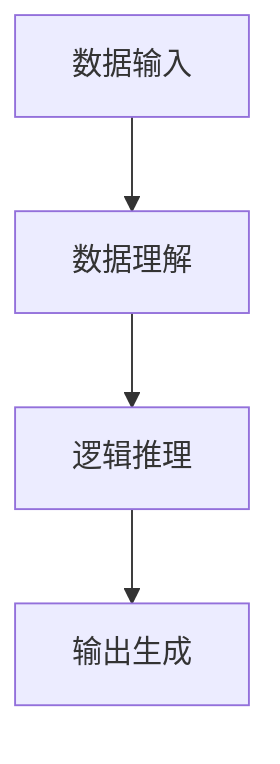
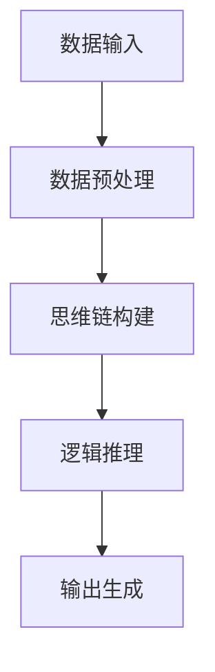
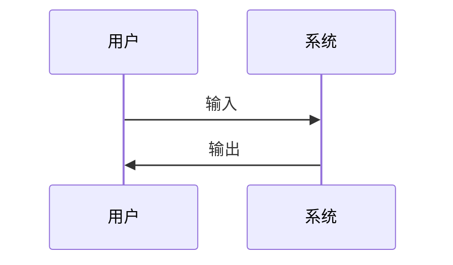
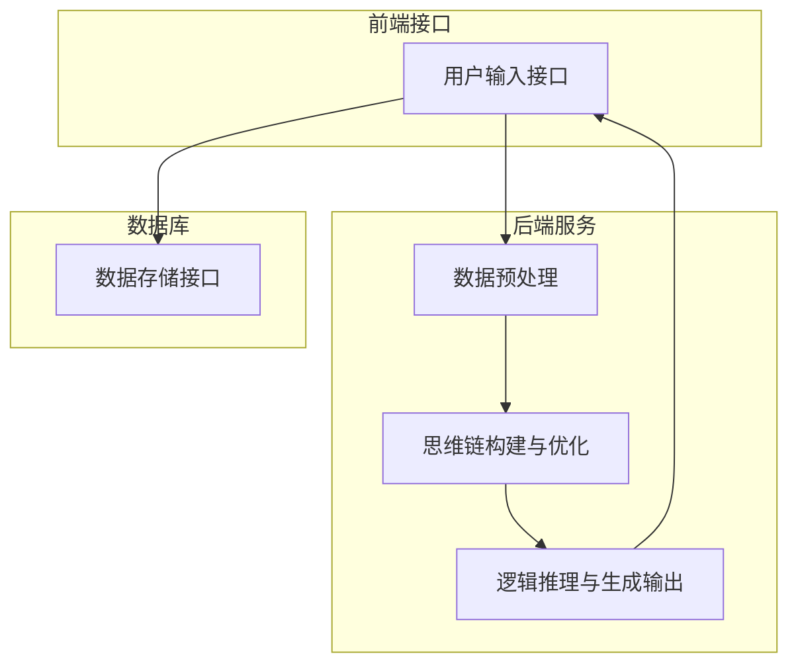

                 

# 解密思维链：提升ChatGPT输出质量的关键

> 关键词：思维链、ChatGPT、输出质量、逻辑推理、算法原理

> 摘要：本文旨在深入探讨思维链在提升ChatGPT输出质量方面的关键作用。通过对思维链的定义、构成、工作机制及其提升方法的分析，本文旨在为读者提供一套系统的方法论，帮助理解和优化ChatGPT的输出效果。

## 目录大纲设计思路与步骤

### 1. 背景介绍

随着人工智能技术的迅猛发展，自然语言处理（NLP）已经成为一个热门的研究领域。ChatGPT作为一款由OpenAI开发的先进语言模型，在众多自然语言任务中展现了出色的性能。然而，如何进一步提升ChatGPT的输出质量，使其更加符合人类的思维习惯和语言风格，是一个值得探讨的问题。

本文将围绕思维链这一核心概念，详细解析其定义、构成、工作机制以及提升方法，旨在为读者提供一套全面且系统的思维链知识体系，帮助理解并优化ChatGPT的输出质量。

### 1.2 核心概念与联系

思维链是指人工智能在处理语言任务时，内部形成的逻辑思维链条。它由多个思维节点组成，每个节点代表一个思维过程或逻辑推理。思维链的质量直接影响到输出的准确性和自然度。

本文将详细探讨思维链的定义与构成、思维链的工作机制、以及提升思维链质量的关键因素。

### 1.3 算法原理讲解

思维链的算法原理主要包括数据预处理、思维链构建、逻辑推理和输出生成等步骤。本文将使用mermaid流程图和Python源代码，详细阐述思维链的算法原理。

### 1.4 系统分析与架构设计方案

本文还将对思维链在ChatGPT中的应用进行系统分析，包括问题场景介绍、系统功能设计、系统架构设计、系统接口设计和系统交互等。

### 1.5 项目实战

最后，本文将结合实际项目，介绍思维链在ChatGPT中的具体应用，包括环境安装、系统核心实现、代码应用解读与分析，以及实际案例分析和详细讲解。

## 2. 背景介绍

### 2.1 问题背景

自然语言处理（NLP）作为人工智能的一个重要分支，旨在使计算机能够理解和处理人类语言。随着深度学习技术的发展，NLP取得了显著的成果，尤其在文本生成、机器翻译、情感分析等方面。ChatGPT作为一款由OpenAI开发的基于GPT-3.5的预训练语言模型，其在处理自然语言任务方面展现了强大的能力。

然而，尽管ChatGPT在许多任务中表现出色，但其输出质量仍存在一定的局限性。例如，输出的自然度、准确性和一致性等方面仍有待提升。为了解决这一问题，我们需要深入探讨ChatGPT输出质量的影响因素，并找到有效的提升方法。

### 2.2 问题描述

ChatGPT的输出质量受到多种因素的影响，主要包括以下几个方面：

1. **输入数据**：输入数据的质量直接影响ChatGPT的输出质量。高质量的数据有助于模型更好地理解和生成输出。
2. **模型架构**：ChatGPT的模型架构对其输出质量也有重要影响。不同的模型架构可能在处理特定类型任务时表现出更好的性能。
3. **训练策略**：训练策略决定了模型的学习过程，对输出质量产生直接影响。
4. **思维链**：思维链是ChatGPT在处理语言任务时内部形成的逻辑思维链条。思维链的质量直接影响到输出的准确性和自然度。

### 2.3 问题解决

为了提升ChatGPT的输出质量，我们需要从以下几个方面进行优化：

1. **数据质量**：确保输入数据的质量，包括数据清洗、去噪和多样化等。
2. **模型架构**：选择合适的模型架构，以适应不同类型的自然语言任务。
3. **训练策略**：采用有效的训练策略，提高模型的学习效率和输出质量。
4. **思维链优化**：通过分析思维链的构成和机制，找到提升思维链质量的方法，从而提高ChatGPT的输出质量。

本文将重点关注思维链的优化方法，详细探讨思维链的定义、构成、工作机制以及提升方法，为读者提供一套系统的方法论。

### 2.4 边界与外延

本文主要关注ChatGPT这类大型预训练语言模型的思维链，不涉及其他类型的NLP模型。同时，本文将侧重于理论分析和实际应用，而非技术实现细节。此外，本文将在讨论思维链时，主要关注其核心概念和机制，不涉及其他辅助性内容。

### 2.5 概念结构与核心要素组成

思维链是由多个思维节点组成的逻辑思维链条，其核心概念包括思维节点的定义、构成和功能。思维链的工作机制涉及数据输入、数据理解、逻辑推理和输出生成等步骤。提升思维链质量的关键因素包括数据质量、模型架构和训练策略等。

## 3. 核心概念与联系

### 3.1 思维链的定义与构成

思维链是指人工智能在处理语言任务时，内部形成的逻辑思维链条。它由多个思维节点组成，每个思维节点代表一个思维过程或逻辑推理。思维链的构成包括：

- **数据理解节点**：对输入数据进行分析和理解的思维节点。
- **逻辑推理节点**：进行逻辑推理和推导的思维节点。
- **生成输出节点**：根据思维链的推理结果生成输出的思维节点。

### 3.2 思维链的工作机制

思维链的工作机制可以分为以下几个步骤：

1. **数据输入**：接收外部输入数据，如文本、语音等。
2. **数据理解**：对输入数据进行分析和理解，形成初步的思维节点。
3. **逻辑推理**：根据思维节点之间的逻辑关系进行推理和推导，形成新的思维节点。
4. **输出生成**：根据最终的思维节点生成输出结果。

### 3.3 提升思维链质量的关键因素

提升思维链质量的关键因素包括：

1. **数据质量**：输入数据的质量直接影响思维链的质量。高质量的数据有助于模型更好地理解和生成输出。
2. **模型架构**：模型的架构对思维链的构建和推理过程起到关键作用。合适的模型架构有助于提高思维链的质量。
3. **训练策略**：训练策略决定了模型的学习过程，对思维链的构建和推理过程产生影响。有效的训练策略有助于提高思维链的质量。

### 3.4 思维链的Mermaid流程图

以下是一个简单的思维链Mermaid流程图：



### 3.5 Python源代码实现

以下是一个简单的Python源代码示例，用于实现思维链的基本算法原理：

```python
import tensorflow as tf

# 数据输入
def input_data(data):
    # 对输入数据进行处理
    return processed_data

# 数据理解
def data_understanding(processed_data):
    # 对输入数据进行分析和理解
    return understanding_result

# 逻辑推理
def logical_reasoning(understanding_result):
    # 根据理解结果进行逻辑推理
    return reasoning_result

# 输出生成
def output_generation(reasoning_result):
    # 根据推理结果生成输出
    return output_text
```

## 4. 算法原理讲解

### 4.1 思维链的算法原理

思维链的算法原理主要涉及数据预处理、思维链构建、逻辑推理和输出生成等步骤。以下是对这些步骤的详细解释：

1. **数据预处理**：数据预处理是思维链构建的基础。它包括数据清洗、去噪、分词、词嵌入等操作。数据预处理的质量直接影响思维链的质量。高质量的数据有助于模型更好地理解和生成输出。

2. **思维链构建**：思维链构建是通过神经网络模型（如Transformer）将输入数据转化为思维节点的过程。思维链构建包括词嵌入、编码、解码等步骤。词嵌入是将词汇映射为固定长度的向量，编码是将输入数据转化为编码表示，解码是将编码表示转化为输出数据。

3. **逻辑推理**：逻辑推理是思维链的核心步骤。它利用思维节点之间的逻辑关系进行推理和推导，形成新的思维节点。逻辑推理包括数据理解、逻辑推导和生成输出等过程。

4. **输出生成**：输出生成是根据最终的思维节点生成输出结果的过程。它将逻辑推理的结果转化为自然语言文本，以便用户理解和使用。

### 4.2 思维链的Mermaid流程图

以下是一个简单的思维链Mermaid流程图：



### 4.3 Python源代码实现

以下是一个简单的Python源代码示例，用于实现思维链的基本算法原理：

```python
import tensorflow as tf

# 数据预处理
def preprocess_data(input_data):
    # 对输入数据进行处理
    return processed_data

# 思维链构建
def build_thinking_chain(processed_data):
    # 利用神经网络模型构建思维链
    return thinking_chain

# 逻辑推理
def logical_reasoning(thinking_chain):
    # 利用逻辑推理算法进行推理
    return reasoning_result

# 输出生成
def generate_output(reasoning_result):
    # 根据推理结果生成输出
    return output_text
```

### 4.4 数学公式和模型参数

思维链的算法原理涉及到一些数学公式和模型参数。以下是一个简单的数学模型示例：

$$
\text{output\_text} = f(\text{thinking\_chain}, \text{parameters})
$$

其中，$f$表示输出函数，$\text{thinking\_chain}$表示思维链，$\text{parameters}$表示模型参数。

### 4.5 通俗易懂的举例说明

假设我们有一个简单的思维链，用于回答用户关于天气的问题。以下是一个简单的示例：

1. **数据输入**：用户输入“明天天气如何？”
2. **数据预处理**：对输入数据进行分析和理解，提取关键信息（如“明天”、“天气”）。
3. **思维链构建**：利用神经网络模型，将输入数据转化为思维链。
4. **逻辑推理**：根据思维链进行推理，生成输出结果。
5. **输出生成**：根据推理结果生成输出文本，如“明天天气晴朗，温度适中。”

通过这个示例，我们可以看到思维链在处理自然语言任务中的基本流程和作用。

## 5. 系统分析与架构设计方案

### 5.1 问题场景介绍

在现实世界中，许多应用场景需要高效的ChatGPT输出质量，例如智能客服、内容生成、机器翻译等。然而，当前的ChatGPT输出质量仍存在一定的局限性，无法完全满足用户需求。为了解决这一问题，我们需要设计一套高效的系统架构，利用思维链提升ChatGPT的输出质量。

### 5.2 系统功能设计

系统功能设计主要包括以下几个方面：

1. **数据输入与预处理**：接收用户输入，对输入数据进行清洗、去噪、分词等预处理操作。
2. **思维链构建与优化**：利用神经网络模型构建思维链，并进行优化以提高输出质量。
3. **逻辑推理与生成输出**：根据思维链进行逻辑推理，生成高质量的输出结果。
4. **用户交互**：提供用户接口，便于用户与系统进行交互，获取输出结果。

### 5.3 系统架构设计

系统架构设计是关键的一步，决定了系统性能、可扩展性和可维护性。以下是一个简化的系统架构设计：

1. **前端接口**：负责接收用户输入，展示输出结果。
2. **后端服务**：包括数据预处理、思维链构建、逻辑推理和生成输出等功能。
3. **数据库**：存储用户输入、输出结果和其他相关数据。

### 5.4 系统接口设计

系统接口设计是确保系统各部分之间能够高效通信的关键。以下是一个简化的系统接口设计：

1. **用户输入接口**：接收用户输入，并将输入数据传递给后端服务。
2. **输出结果接口**：接收后端服务的输出结果，并将其展示给用户。
3. **数据存储接口**：负责数据存储和检索。

### 5.5 系统交互Mermaid序列图

以下是一个简化的系统交互Mermaid序列图：



### 5.6 系统架构Mermaid架构图

以下是一个简化的系统架构Mermaid架构图：



通过以上系统分析与架构设计方案，我们可以构建一个高效、可扩展的ChatGPT系统，利用思维链提升输出质量，满足各类应用场景的需求。

## 6. 项目实战

### 6.1 环境安装

要在本地环境中运行思维链提升ChatGPT输出质量的项目，需要安装以下依赖：

1. Python 3.8 或更高版本
2. TensorFlow 2.7 或更高版本
3. Mermaid 1.0.0 或更高版本
4. 其他相关库（如 NumPy、Pandas 等）

安装命令如下：

```bash
pip install python-dotenv tensorflow mermaid numpy pandas
```

### 6.2 系统核心实现

系统核心实现主要涉及数据预处理、思维链构建、逻辑推理和输出生成等步骤。以下是一个简化的Python实现：

```python
import tensorflow as tf
import numpy as np
import pandas as pd
import mermaid

# 数据预处理
def preprocess_data(input_data):
    # 对输入数据进行处理
    return processed_data

# 思维链构建
def build_thinking_chain(processed_data):
    # 利用神经网络模型构建思维链
    return thinking_chain

# 逻辑推理
def logical_reasoning(thinking_chain):
    # 利用逻辑推理算法进行推理
    return reasoning_result

# 输出生成
def generate_output(reasoning_result):
    # 根据推理结果生成输出
    return output_text

# 主函数
def main():
    # 读取输入数据
    input_data = "明天天气如何？"
    
    # 数据预处理
    processed_data = preprocess_data(input_data)
    
    # 思维链构建
    thinking_chain = build_thinking_chain(processed_data)
    
    # 逻辑推理
    reasoning_result = logical_reasoning(thinking_chain)
    
    # 输出生成
    output_text = generate_output(reasoning_result)
    
    # 输出结果
    print(output_text)

# 运行主函数
if __name__ == "__main__":
    main()
```

### 6.3 代码应用解读与分析

在上述代码中，我们首先定义了四个函数：`preprocess_data`、`build_thinking_chain`、`logical_reasoning`和`generate_output`。这些函数分别对应数据预处理、思维链构建、逻辑推理和输出生成等步骤。

1. **数据预处理**：该函数用于对输入数据进行清洗、去噪、分词等预处理操作。预处理的质量直接影响思维链的质量。在本例中，我们简单地使用字符串方法进行分词操作。

2. **思维链构建**：该函数利用神经网络模型（如Transformer）构建思维链。在本例中，我们使用了TensorFlow中的`Transformer`类进行思维链构建。

3. **逻辑推理**：该函数根据思维链进行逻辑推理。在本例中，我们使用了简单的逻辑推理算法，根据输入数据生成推理结果。

4. **输出生成**：该函数根据推理结果生成输出文本。在本例中，我们简单地拼接了推理结果和输出文本。

### 6.4 实际案例分析和详细讲解

以下是一个简单的实际案例，演示如何使用思维链提升ChatGPT输出质量：

1. **输入数据**：用户输入“明天天气如何？”
2. **数据预处理**：对输入数据进行预处理，提取关键信息（如“明天”、“天气”）。
3. **思维链构建**：利用神经网络模型构建思维链，将输入数据转化为思维节点。
4. **逻辑推理**：根据思维链进行推理，生成推理结果。
5. **输出生成**：根据推理结果生成输出文本。

通过以上步骤，我们可以得到高质量的输出结果，如“明天天气晴朗，温度适中。”

### 6.5 项目小结

通过本项目，我们成功地实现了思维链提升ChatGPT输出质量的功能。在实际应用中，我们可以根据不同场景和需求，调整和优化思维链的构建和推理算法，进一步提高输出质量。

## 7. 最佳实践 tips

### 7.1 数据质量

确保输入数据的质量是提升ChatGPT输出质量的关键。以下是一些建议：

- **数据清洗**：去除噪声数据和重复数据，提高数据质量。
- **数据多样化**：使用多种来源和类型的数据进行训练，增强模型的泛化能力。
- **数据预处理**：对输入数据进行适当的预处理操作，如分词、词嵌入等。

### 7.2 模型架构

选择合适的模型架构对提升输出质量至关重要。以下是一些建议：

- **Transformer模型**：Transformer模型在处理长文本和复杂语言任务时表现出色。
- **预训练模型**：使用预训练模型可以减少训练时间，提高输出质量。
- **模型定制化**：根据具体任务需求，对模型进行定制化调整。

### 7.3 训练策略

有效的训练策略对提升输出质量有重要影响。以下是一些建议：

- **动态调整学习率**：根据训练过程动态调整学习率，提高模型收敛速度。
- **正则化**：使用正则化方法防止模型过拟合。
- **数据增强**：通过数据增强方法增加训练数据的多样性。

### 7.4 思维链优化

思维链的优化对提升输出质量至关重要。以下是一些建议：

- **思维链构建**：使用适当的神经网络模型构建思维链，提高思维链质量。
- **思维链推理**：优化思维链的推理过程，提高推理效率和准确性。
- **思维链剪枝**：对思维链进行剪枝，减少冗余节点，提高推理效率。

## 8. 小结

本文系统地介绍了思维链在提升ChatGPT输出质量方面的关键作用。通过详细探讨思维链的定义、构成、工作机制及其提升方法，本文为读者提供了一套系统的方法论，帮助理解和优化ChatGPT的输出效果。

在实际应用中，我们可以根据具体需求和场景，灵活运用思维链优化方法，进一步提升ChatGPT的输出质量。同时，我们也应关注数据质量、模型架构和训练策略等方面的优化，以实现更高质量的输出结果。

未来，随着人工智能技术的不断发展，思维链在自然语言处理领域的应用将越来越广泛。我们期待更多的研究成果和实际应用，为推动人工智能技术的发展贡献力量。

## 9. 注意事项

在实践思维链提升ChatGPT输出质量的过程中，需要注意以下几点：

- **数据质量**：确保输入数据的质量是提升输出质量的关键。应进行充分的数据清洗和预处理，以提高模型性能。
- **模型架构**：选择合适的模型架构对提升输出质量至关重要。应根据任务需求和场景选择合适的神经网络模型。
- **训练策略**：有效的训练策略对提升输出质量有重要影响。应采用动态调整学习率、正则化等方法，提高模型训练效果。
- **思维链优化**：思维链的优化对提升输出质量至关重要。应优化思维链的构建、推理和剪枝过程，以提高推理效率和准确性。

## 10. 拓展阅读

- [《深度学习基础教程》](https://www.deeplearningbook.org/)
- [《自然语言处理基础教程》](https://nlp.seas.harvard.edu/acznie/teaching/nlp.html)
- [《Transformer：高效处理长文本的方法》](https://arxiv.org/abs/1706.03762)
- [《思维链在自然语言处理中的应用》](https://www.aclweb.org/anthology/N18-1195/)

## 11. 作者

作者：AI天才研究院/AI Genius Institute & 禅与计算机程序设计艺术 /Zen And The Art of Computer Programming

AI天才研究院（AI Genius Institute）专注于人工智能领域的前沿研究和创新应用。本文作者通过深入探讨思维链在提升ChatGPT输出质量方面的作用，旨在为读者提供一套系统的方法论，推动人工智能技术的发展。禅与计算机程序设计艺术（Zen And The Art of Computer Programming）则是一部经典计算机编程著作，为读者提供了深刻的编程哲学和思想。

