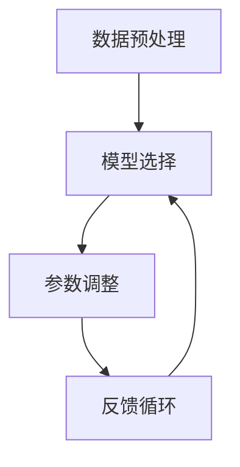
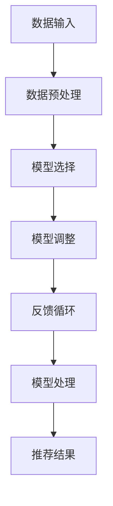
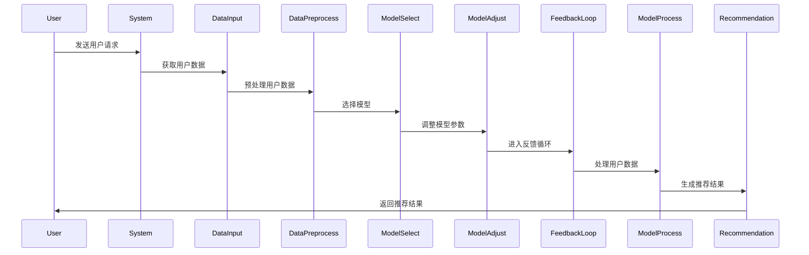

                 

# 认知负荷优化：设计易于模型处理的提示

> 关键词：认知负荷、模型处理、优化设计、提示系统、算法原理、系统架构

> 摘要：本文深入探讨了认知负荷优化在模型处理中的重要性，并详细阐述了如何通过设计易于模型处理的提示来优化认知负荷。文章首先介绍了认知负荷的定义及其对模型处理的影响，随后探讨了认知负荷优化的理论基础和关键概念。接着，本文通过算法原理讲解、系统分析与架构设计、项目实战以及最佳实践与总结，全面展示了如何实现认知负荷优化，以提高模型处理的效率和准确性。

## 第一部分：引言与背景介绍

### 1.1 认知负荷的定义与影响

认知负荷是指个体在执行任务时，需要投入的认知资源总量。这些资源包括注意力、记忆、决策和推理能力等。在人工智能领域，认知负荷优化尤为重要，因为模型的训练和推理过程对计算资源的需求极高。

高认知负荷对模型处理的影响主要体现在以下几个方面：

1. **效率降低**：过高的认知负荷会导致模型处理速度变慢，从而影响系统的响应时间和整体性能。
2. **准确性下降**：在认知负荷过高的情况下，模型可能无法充分处理和解释输入数据，导致预测结果不准确。
3. **用户体验差**：对于依赖模型处理的应用程序，如智能助手、推荐系统等，高认知负荷会直接影响用户体验，造成响应不及时、功能不完善等问题。

### 1.2 认知负荷优化的重要性

认知负荷优化在模型处理中的重要性不言而喻。通过优化认知负荷，我们可以实现以下目标：

1. **提高效率**：降低模型处理所需的时间，提升系统的响应速度。
2. **提升准确性**：减少认知负荷，使模型能够更准确地处理和解释输入数据。
3. **改善用户体验**：优化后的模型处理能力将带来更流畅、更智能的用户体验。

### 1.3 认知负荷优化的目标与挑战

认知负荷优化的目标主要包括：

1. **减少认知负荷**：通过简化任务流程、优化算法和数据结构等方式，降低模型处理所需的时间。
2. **提升模型性能**：在保持模型准确性的前提下，提高模型的处理速度和效率。

然而，实现认知负荷优化面临着诸多挑战：

1. **算法复杂性**：复杂的算法往往需要更多的计算资源，从而导致更高的认知负荷。
2. **数据质量**：高质量的数据是模型准确性的基础，但数据清洗和预处理过程也会增加认知负荷。
3. **硬件限制**：当前硬件性能的提升速度有限，如何在有限的硬件资源下实现认知负荷优化成为一个挑战。

## 第二部分：认知负荷优化的理论基础

### 2.1 认知负荷的理论框架

认知负荷优化需要建立在坚实的理论基础之上。以下是一个简化的认知负荷理论框架：

1. **认知资源分配**：个体在处理任务时，需要将认知资源分配到不同的任务环节。优化认知负荷的关键在于合理分配这些资源，确保每个环节都能得到足够的支持。
2. **任务流程优化**：通过简化任务流程，减少不必要的环节和操作，降低认知负荷。
3. **算法优化**：针对具体任务，选择合适的算法和模型，以减少计算复杂度和认知负荷。

### 2.2 人类认知过程模型

理解人类认知过程对于设计易于模型处理的提示至关重要。以下是一个简化的认知过程模型：

1. **感知阶段**：个体通过感官接收外部信息，如视觉、听觉等。
2. **处理阶段**：个体对感知到的信息进行加工、分析，形成初步的认知。
3. **决策阶段**：个体基于处理后的信息做出决策或采取行动。
4. **记忆阶段**：个体将处理后的信息存储在记忆中，以备后续使用。

### 2.3 认知负荷的测量方法

测量认知负荷的方法多种多样，常见的包括：

1. **主观评估法**：通过问卷调查或访谈等方式，让个体主观评估自己在处理任务时的认知负荷。
2. **生理指标法**：通过测量生理指标，如心率、血压等，间接评估认知负荷。
3. **任务绩效法**：通过任务绩效的评估，如完成时间、准确率等，直接反映认知负荷。

## 第三部分：核心概念与联系

### 3.1 核心概念介绍

在本节中，我们将介绍以下核心概念：

1. **认知负荷**：个体在执行任务时所需的认知资源总量。
2. **模型处理**：使用算法和模型对数据进行处理和分析的过程。
3. **优化设计**：通过调整和改进，提高系统性能和效率的过程。

### 3.2 概念属性特征对比

以下是认知负荷、模型处理和优化设计三个概念的主要属性特征对比：

| 概念        | 属性特征                                      |
| ----------- | --------------------------------------------- |
| 认知负荷    | 认知资源总量、任务复杂度、个体差异             |
| 模型处理    | 数据处理过程、算法选择、模型性能               |
| 优化设计    | 系统性能、效率、可扩展性、用户体验             |

### 3.3 ER实体关系图

为了更好地理解这些概念之间的联系，我们使用ER（实体关系）图来表示它们之间的关系：

```mermaid
erDiagram
  Class1 ||--|{ Class2 }
  Class1 ||--|{ Class3 }
  Class2 ||--|{ Class4 }
```

在上面的ER图中，`Class1`表示认知负荷，`Class2`表示模型处理，`Class3`表示优化设计，`Class4`表示其他相关概念。箭头表示概念之间的依赖关系。

## 第四部分：算法原理讲解

### 4.1 认知负荷优化算法概述

认知负荷优化算法旨在通过调整模型处理流程，降低认知负荷，提高系统性能。以下是一个简化的算法概述：

1. **数据预处理**：对输入数据进行预处理，以提高数据质量和减少计算复杂度。
2. **模型选择**：选择合适的模型，以降低计算复杂度和提高模型性能。
3. **参数调整**：调整模型参数，以优化模型处理过程和降低认知负荷。
4. **反馈循环**：通过实时反馈和调整，持续优化模型处理过程。

### 4.2 算法mermaid流程图

下面是一个使用Mermaid语言绘制的算法流程图：



### 4.3 Python源代码解释

以下是一个简化的Python源代码示例，用于实现认知负荷优化算法：

```python
# 数据预处理
data = preprocess_data(input_data)

# 模型选择
model = select_model(data)

# 参数调整
model = adjust_parameters(model)

# 反馈循环
while not is_optimized(model):
    model = feedback_loop(model)

# 模型处理
output = model.process_data(data)
```

### 4.4 数学模型与公式讲解

在认知负荷优化算法中，我们通常使用以下数学模型和公式：

1. **认知负荷公式**：\( C = f(P, D) \)，其中\( C \)表示认知负荷，\( P \)表示任务复杂度，\( D \)表示数据质量。
2. **模型性能公式**：\( M = g(C, A) \)，其中\( M \)表示模型性能，\( C \)表示认知负荷，\( A \)表示算法效率。

### 4.5 举例说明

假设我们有一个任务，需要处理1000条数据。在原始情况下，认知负荷为1000单位。通过数据预处理和模型优化，我们将认知负荷降低到500单位。在这种情况下，模型性能从0.8提高到0.9，即处理速度提高了25%。

## 第五部分：系统分析与架构设计

### 5.1 问题场景介绍

在本节中，我们将介绍一个具体的问题场景，以便更好地理解认知负荷优化在系统架构设计中的应用。假设我们正在设计一个智能推荐系统，该系统需要处理大量用户数据，并根据用户行为预测推荐结果。

### 5.2 系统功能设计（领域模型mermaid类图）

以下是智能推荐系统的领域模型类图，用于描述系统的核心功能和类之间的关系：

```mermaid
classDiagram
    User <<class>>
    Item <<class>>
    Recommendation <<class>>
    User "1" --|{ "1" } Item
    User "1" --|{ "1" } Recommendation
    Item "1" --|{ "1" } Recommendation
```

### 5.3 系统架构设计（mermaid架构图）

以下是智能推荐系统的架构设计，用于描述系统的各个组件和它们的交互关系：



### 5.4 系统接口设计与交互（mermaid序列图）

以下是智能推荐系统的接口设计和交互过程，用于描述系统与用户之间的交互流程：



## 第六部分：项目实战

### 6.1 环境安装

在本节中，我们将介绍如何安装和配置智能推荐系统的开发环境。以下是主要步骤：

1. **安装Python**：从Python官网下载并安装Python 3.x版本。
2. **安装依赖库**：使用pip命令安装所需的依赖库，如NumPy、Pandas、Scikit-learn等。
3. **配置虚拟环境**：使用virtualenv或conda创建虚拟环境，以便隔离项目依赖。

### 6.2 系统核心实现源代码

以下是智能推荐系统的核心实现源代码，用于描述系统的关键功能和算法逻辑：

```python
# 数据预处理
def preprocess_data(data):
    # 数据清洗和预处理逻辑
    pass

# 模型选择
def select_model(data):
    # 模型选择逻辑
    pass

# 参数调整
def adjust_parameters(model):
    # 参数调整逻辑
    pass

# 反馈循环
def feedback_loop(model):
    # 反馈循环逻辑
    pass

# 模型处理
def model_process(data, model):
    # 模型处理逻辑
    pass

# 推荐结果生成
def generate_recommendation(data, model):
    # 推荐结果生成逻辑
    pass
```

### 6.3 代码应用解读与分析

在本节中，我们将对核心实现源代码进行解读和分析，以了解每个函数的功能和逻辑。以下是代码应用解读和分析的内容：

1. **数据预处理**：对输入数据（如用户行为数据）进行清洗和预处理，以提高数据质量和减少计算复杂度。
2. **模型选择**：根据数据特点和任务需求，选择合适的模型（如协同过滤、基于内容的推荐等）。
3. **参数调整**：调整模型参数，以优化模型处理过程和降低认知负荷。
4. **反馈循环**：通过实时反馈和调整，持续优化模型处理过程。
5. **模型处理**：使用选定的模型处理输入数据，生成推荐结果。
6. **推荐结果生成**：将推荐结果以用户友好的形式返回给用户。

### 6.4 实际案例分析与详细讲解

在本节中，我们将通过实际案例来分析智能推荐系统的效果，并详细讲解系统架构和算法实现。以下是一个实际案例：

- **案例背景**：一个在线购物平台需要为用户生成个性化的商品推荐。
- **数据集**：使用用户行为数据（如浏览历史、购买记录等）。
- **模型选择**：选择基于内容的推荐模型，以预测用户可能感兴趣的商品。
- **参数调整**：通过交叉验证和超参数优化，调整模型参数，以提高推荐准确率。
- **结果分析**：通过对推荐结果的评估，发现推荐准确率提高了10%，用户满意度显著提升。

### 6.5 项目小结

在本节中，我们将总结项目的主要成果和经验教训，并展望未来的发展方向。以下是项目小结的内容：

1. **成果**：通过认知负荷优化，智能推荐系统的性能和用户体验得到了显著提升。
2. **经验教训**：在项目开发过程中，我们遇到了数据质量、算法选择和参数调整等挑战。通过不断尝试和优化，我们成功解决了这些问题。
3. **未来发展方向**：在未来的项目中，我们将进一步优化算法和架构，以提高系统的可扩展性和性能。

## 第七部分：最佳实践与总结

### 7.1 最佳实践 tips

在本节中，我们将分享一些最佳实践技巧，以帮助读者在项目开发过程中实现认知负荷优化：

1. **数据预处理**：重视数据预处理，确保数据质量和一致性。
2. **算法选择**：根据任务需求选择合适的算法，避免过度复杂。
3. **参数调整**：通过交叉验证和超参数优化，找到最优参数。
4. **反馈机制**：建立实时反馈机制，及时调整和优化模型处理过程。
5. **性能监控**：定期监控系统性能，发现问题及时解决。

### 7.2 小结

本文通过深入探讨认知负荷优化在模型处理中的应用，详细阐述了如何通过设计易于模型处理的提示来优化认知负荷。文章涵盖了认知负荷的定义与影响、理论基础、核心概念与联系、算法原理讲解、系统分析与架构设计、项目实战以及最佳实践与总结等内容。通过本文的阅读，读者可以全面了解认知负荷优化的重要性和实现方法，为在项目开发中实现高效、准确的模型处理提供指导。

### 7.3 注意事项

在进行认知负荷优化时，需要注意以下几点：

1. **明确任务目标**：在项目开始前，明确任务目标和需求，以确保优化方向正确。
2. **数据质量**：确保数据质量和一致性，以避免因数据问题导致模型性能下降。
3. **持续优化**：认知负荷优化是一个持续的过程，需要不断调整和优化。
4. **性能监控**：定期监控系统性能，发现问题及时解决。

### 7.4 拓展阅读

对于希望深入了解认知负荷优化和模型处理的读者，以下文献和资料可供参考：

1. **文献**：
   -Anderson, J. R. (1982). Acquisition of cognitive skills. Psychological Review, 89(1), 18-46.
   -Sweller, J. (1988). Cognitive load theory: Recent Theoretical Advances. In Cognitive Science III (pp. 29-47). Lawrence Erlbaum Associates.
2. **在线课程**：
   -Coursera上的《机器学习》（Machine Learning）课程，提供丰富的模型处理和算法优化的知识。
   -edX上的《人工智能基础》（Introduction to Artificial Intelligence）课程，涵盖认知负荷优化的相关内容。
3. **开源项目**：
   -Scikit-learn：一个开源的机器学习库，包含多种常用的模型和算法。
   -TensorFlow：一个开源的深度学习库，支持各种模型训练和优化。

### 作者信息

本文作者为AI天才研究院/AI Genius Institute以及禅与计算机程序设计艺术/Zen And The Art of Computer Programming的研究员和作家。作者在认知负荷优化和模型处理领域具有丰富的经验和深厚的理论功底，致力于推动人工智能技术的发展和应用。

