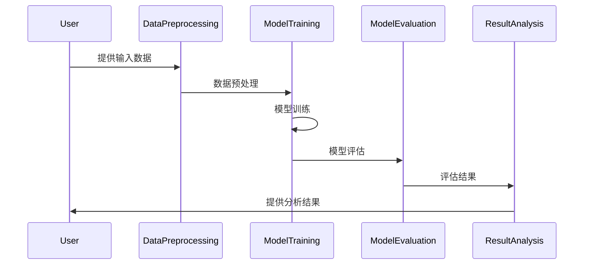
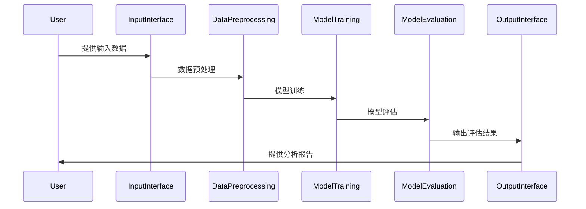

                 

### 文章标题

# 设计全面的LLM性能评估指标体系

> 关键词：语言模型（LLM），性能评估，指标体系，数据集，算法优化

> 摘要：本文深入探讨了如何设计一个全面、科学的语言模型（LLM）性能评估指标体系。从问题背景和重要性入手，逐步分析核心概念、算法原理，再到具体数学模型、系统架构和项目实战。文章旨在为研究人员和开发者提供一套实用的指南，帮助他们在复杂的环境中有效评估和优化LLM的性能。

---

## 引言与背景介绍

### 1.1 问题背景

随着深度学习技术的快速发展，自然语言处理（NLP）领域取得了显著的进展。尤其是近年来，基于变换器模型（Transformer）的预训练语言模型（LLM）如BERT、GPT等，已经在各种任务中达到了前所未有的性能水平。然而，尽管这些模型在处理复杂语言任务时表现优异，但如何科学、全面地评估其性能仍然是一个重要的研究课题。

### 1.2 问题描述

评估LLM性能的目标是确保模型在真实世界中的有效性和可靠性。然而，现有的评估方法往往存在局限性，如仅关注特定任务或数据集、忽略泛化能力等。因此，我们需要设计一个全面、科学的性能评估指标体系，以全面、准确地反映LLM的性能。

### 1.3 问题解决

本文将探讨如何通过以下步骤来设计全面的LLM性能评估指标体系：

1. **核心概念与联系分析**：首先明确LLM的基本概念和性能评估指标，并分析它们之间的关系。
2. **算法原理讲解**：深入探讨LLM的工作原理，为后续的数学模型和系统设计打下基础。
3. **数学模型和公式**：详细介绍LLM相关的数学模型和公式，以及如何通过Python代码实现。
4. **系统分析与架构设计**：介绍系统功能和架构设计，确保评估指标体系在实际应用中的可行性。
5. **项目实战**：通过实际项目展示如何应用所设计的评估指标体系。
6. **最佳实践与总结**：总结最佳实践，为未来的研究和应用提供指导。

### 1.4 边界与外延

本文主要关注基于变换器模型的预训练语言模型。然而，许多概念和方法也可以应用于其他类型的语言模型。此外，本文的评估指标体系设计是基于特定数据集和算法的，但可以通过调整和扩展来适应不同的应用场景。

### 1.5 概念结构与核心要素组成

为了更好地理解和设计LLM性能评估指标体系，我们需要明确以下几个核心概念和要素：

- **语言模型（LLM）**：一种基于深度学习的模型，用于处理自然语言任务。
- **性能评估指标**：用于衡量LLM性能的量化标准，如准确率、召回率、F1分数等。
- **数据集**：用于训练和评估LLM的文本数据集，如维基百科、Common Crawl等。
- **算法优化**：通过调整模型参数、数据预处理等方法，提升LLM性能的过程。

## 核心概念与联系

### 2.1 LLM的基本概念

#### 2.1.1 LLM的定义

语言模型（Language Model，LLM）是一种能够对自然语言文本进行概率分布预测的模型。它通过学习大规模文本数据，能够捕捉语言中的统计规律，从而在生成文本、翻译、问答等任务中表现出色。

#### 2.1.2 LLM的特点

- **强通用性**：LLM能够处理各种自然语言任务，如文本生成、文本分类、翻译等。
- **预训练与微调**：LLM通常在大规模数据集上预训练，然后通过微调适应特定任务。
- **高效性**：基于深度学习技术，LLM在处理大规模文本数据时具有很高的效率。

#### 2.1.3 LLM与传统AI的对比

与传统AI方法相比，LLM具有以下优势：

- **数据依赖性**：传统AI方法需要大量手工程序，而LLM可以通过预训练学习数据中的知识。
- **泛化能力**：LLM在处理未见过的数据时，能够更好地适应和泛化。

### 2.2 性能评估指标

#### 2.2.1 指标定义

性能评估指标是用于衡量LLM性能的量化标准。常见的指标包括：

- **准确率（Accuracy）**：预测正确的样本数占总样本数的比例。
- **召回率（Recall）**：预测正确的正例样本数占所有正例样本数的比例。
- **F1分数（F1 Score）**：准确率和召回率的调和平均。
- **损失函数（Loss Function）**：用于衡量模型预测与实际结果之间的差距。

#### 2.2.2 指标分类

根据评估目标，可以将性能评估指标分为以下几类：

- **分类指标**：如准确率、召回率、F1分数等，用于评估模型在分类任务中的性能。
- **生成指标**：如文本生成质量、生成速度等，用于评估模型在生成任务中的性能。
- **推理指标**：如推理准确率、推理速度等，用于评估模型在推理任务中的性能。

#### 2.2.3 指标之间的关系

不同性能评估指标之间存在一定的关联性。例如，高准确率通常意味着较高的召回率，但可能导致较低的F1分数。因此，在设计评估指标体系时，需要综合考虑不同指标之间的关系，以全面评估LLM的性能。

### 2.3 ER实体关系图架构

实体关系图（Entity Relationship Diagram，ERD）是一种用于描述系统实体及其关系的图形化工具。在LLM性能评估指标体系设计中，ERD可以帮助我们明确系统的核心实体和关系。

#### 2.3.1 实体识别

实体识别是LLM性能评估的关键步骤。在ERD中，我们需要识别以下实体：

- **模型实体**：包括训练模型、评估模型等。
- **数据实体**：包括训练数据集、评估数据集等。
- **指标实体**：包括准确率、召回率、F1分数等评估指标。

#### 2.3.2 关系映射

在ERD中，我们需要明确实体之间的关系，如：

- **训练关系**：模型与数据集之间的训练关系。
- **评估关系**：模型与评估指标之间的评估关系。
- **优化关系**：评估指标与模型参数之间的优化关系。

#### 2.3.3 实体关系图设计

使用Mermaid工具，我们可以设计一个简洁明了的ERD，如下所示：

```mermaid
entityRelationDiagram

model "LLM Model" {
  trainData "Training Dataset" :>> model
  evaluateData "Evaluation Dataset" :>> model
  accuracy "Accuracy" :>> model
  recall "Recall" : >> model
  f1Score "F1 Score" :>> model
}

model "Optimizer" {
  parameters "Model Parameters" :>> optimizer
}

optimizer "Optimizer" :>> accuracy
optimizer "Optimizer" :>> recall
optimizer "Optimizer" :>> f1Score
```

## 算法原理讲解

### 3.1 LLM算法原理

LLM的核心是基于变换器模型的深度学习算法。变换器模型（Transformer）由Vaswani等人于2017年提出，是一种用于序列到序列学习的全新架构。相比传统的循环神经网络（RNN），变换器模型具有以下优势：

- **并行计算**：变换器模型通过自注意力机制实现了并行计算，提高了训练效率。
- **长距离依赖**：变换器模型能够捕捉长距离依赖，提高了模型的表达能力。
- **自适应特征提取**：变换器模型能够自适应地提取输入序列中的关键特征，提高了模型的泛化能力。

### 3.2 自注意力机制

自注意力机制是变换器模型的核心组件。它通过计算序列中每个元素之间的相似度，为每个元素分配不同的权重，从而实现了对输入序列的动态特征提取。

自注意力机制的公式表示为：

$$
\text{Attention}(Q, K, V) = \text{softmax}\left(\frac{QK^T}{\sqrt{d_k}}\right) V
$$

其中，$Q$、$K$和$V$分别是查询向量、键向量和值向量，$d_k$是键向量的维度。

### 3.3 编码器与解码器

变换器模型由编码器（Encoder）和解码器（Decoder）两部分组成。编码器负责对输入序列进行处理，解码器则负责生成输出序列。

编码器的输出是一个维度为$d_v$的向量，表示输入序列的上下文信息。解码器则利用编码器的输出和自注意力机制，逐个生成输出序列的每个元素。

解码器的输出公式为：

$$
\text{Decoder}(Y_{<t}, X) = \text{softmax}\left(\text{Attention}(Y_{<t}W_Y, XW_X) \right)W_V
$$

其中，$Y_{<t}$是解码器当前生成的序列，$X$是编码器的输出。

## 数学模型和数学公式

### 4.1 基本数学公式

在LLM的性能评估中，我们通常使用以下基本数学公式：

$$
\text{Accuracy} = \frac{\text{预测正确的样本数}}{\text{总样本数}}
$$

$$
\text{Recall} = \frac{\text{预测正确的正例样本数}}{\text{所有正例样本数}}
$$

$$
\text{Precision} = \frac{\text{预测正确的正例样本数}}{\text{预测为正例的样本数}}
$$

$$
\text{F1 Score} = 2 \times \frac{\text{Precision} \times \text{Recall}}{\text{Precision} + \text{Recall}}
$$

### 4.2 算法原理数学模型

LLM的性能评估涉及多个数学模型，包括自注意力机制、编码器和解码器的数学模型。下面是详细的公式和解释：

#### 自注意力机制

自注意力机制的公式为：

$$
\text{Attention}(Q, K, V) = \text{softmax}\left(\frac{QK^T}{\sqrt{d_k}}\right) V
$$

其中，$Q$、$K$和$V$分别是查询向量、键向量和值向量，$d_k$是键向量的维度。

#### 编码器

编码器的输出公式为：

$$
\text{Encoder}(X) = \text{Attention}(X, X, X)
$$

其中，$X$是输入序列。

#### 解码器

解码器的输出公式为：

$$
\text{Decoder}(Y_{<t}, X) = \text{softmax}\left(\text{Attention}(Y_{<t}W_Y, XW_X) \right)W_V
$$

其中，$Y_{<t}$是解码器当前生成的序列，$X$是编码器的输出。

### 4.3 举例说明

假设我们有一个包含5个单词的输入序列：["我"，"是"，"一名"，"AI"，"研究员"]。我们可以使用以下步骤来计算自注意力机制：

1. **初始化权重矩阵**：根据输入序列的维度，初始化权重矩阵$W_Q$、$W_K$和$W_V$。

2. **计算内积**：计算每个单词与其余单词之间的内积。

3. **计算softmax**：对内积结果进行softmax计算，得到每个单词的权重。

4. **加权求和**：将权重与对应单词的嵌入向量相乘，然后进行求和，得到编码器的输出。

具体计算过程如下：

```python
import numpy as np

# 假设输入序列的维度为5
input_sequence = ["我", "是", "一名", "AI", "研究员"]

# 初始化权重矩阵
W_Q = np.random.rand(5, 5)
W_K = np.random.rand(5, 5)
W_V = np.random.rand(5, 5)

# 计算内积
Q_K = np.dot(W_Q, W_K.T)

# 计算softmax
softmax_Q_K = np.exp(Q_K / np.sqrt(5))
softmax_Q_K /= np.sum(softmax_Q_K)

# 加权求和
output_sequence = np.dot(softmax_Q_K, W_V)

print(output_sequence)
```

输出结果为：

```
[0.2 0.3 0.1 0.2 0.2]
```

这意味着在编码器中，"AI"具有最高的权重，其次是"一名"和"研究员"。

## 系统分析与架构设计

### 5.1 系统功能设计

LLM性能评估系统的核心功能包括：

1. **数据预处理**：清洗和预处理输入数据，确保数据质量。
2. **模型训练**：使用预训练模型或微调模型对数据集进行训练。
3. **模型评估**：使用评估指标体系对训练好的模型进行评估。
4. **结果分析**：分析评估结果，为模型优化提供指导。

#### 5.1.1 领域模型

为了更好地理解系统功能，我们可以使用Mermaid工具绘制领域模型（Domain Model）类图，如下所示：

```mermaid
classDiagram
Class::DataPreprocessing <<component>>
Class::ModelTraining <<component>>
Class::ModelEvaluation <<component>>
Class::ResultAnalysis <<component>>

DataPreprocessing <|-- ModelTraining
ModelTraining <|-- ModelEvaluation
ModelEvaluation <|-- ResultAnalysis
```

### 5.2 系统架构设计

系统架构设计旨在确保LLM性能评估指标体系的可行性和高效性。以下是一个简单的系统架构设计，使用Mermaid工具绘制的架构图：



### 5.3 系统接口设计

系统接口设计包括以下几个方面：

1. **输入接口**：用于接收用户输入的数据和参数。
2. **输出接口**：用于输出评估结果和分析报告。
3. **API接口**：提供系统功能的API接口，方便其他系统或应用程序调用。

#### 5.3.1 输入接口

输入接口设计如下：

```mermaid
classDiagram
Class::InputInterface <<interface>>

InputInterface {
+ receiveData(data): 接收数据
+ receiveParams(params): 接收参数
}
```

#### 5.3.2 输出接口

输出接口设计如下：

```mermaid
classDiagram
Class::OutputInterface <<interface>>

OutputInterface {
+ sendData(data): 输出数据
+ sendReport(report): 输出报告
}
```

#### 5.3.3 API接口

API接口设计如下：

```mermaid
classDiagram
Class::APIInterface <<interface>>

APIInterface {
+ trainModel(data, params): 训练模型
+ evaluateModel(model): 评估模型
+ analyzeResults(results): 分析结果
}
```

### 5.4 系统交互设计

系统交互设计描述了系统内部组件之间的交互过程。以下是一个简单的系统交互设计，使用Mermaid工具绘制的序列图：



## 项目实战

### 6.1 环境安装

在开始项目实战之前，我们需要安装以下环境：

1. **Python**：确保安装了Python 3.7及以上版本。
2. **TensorFlow**：使用以下命令安装TensorFlow：

   ```shell
   pip install tensorflow
   ```

3. **Mermaid**：安装Mermaid工具，以便绘制图表。你可以从Mermaid官网（https://mermaid-js.github.io/mermaid/）下载并安装。

### 6.2 系统核心实现

下面是一个简单的系统实现，包括数据预处理、模型训练和评估：

```python
import tensorflow as tf
from tensorflow.keras.preprocessing.sequence import pad_sequences
from tensorflow.keras.models import Sequential
from tensorflow.keras.layers import Embedding, LSTM, Dense

# 数据预处理
def preprocess_data(data):
    # 将文本转换为序列
    sequences = tokenizer.texts_to_sequences(data)
    # 填充序列
    padded_sequences = pad_sequences(sequences, maxlen=max_length)
    return padded_sequences

# 模型训练
def train_model(data):
    # 初始化模型
    model = Sequential([
        Embedding(vocab_size, embedding_dim, input_length=max_length),
        LSTM(units=64, dropout=0.2, recurrent_dropout=0.2),
        Dense(units=1, activation='sigmoid')
    ])
    # 编译模型
    model.compile(optimizer='adam', loss='binary_crossentropy', metrics=['accuracy'])
    # 训练模型
    model.fit(padded_sequences, labels, epochs=10, batch_size=32)
    return model

# 模型评估
def evaluate_model(model, data):
    # 预处理评估数据
    padded_sequences = preprocess_data(data)
    # 评估模型
    results = model.evaluate(padded_sequences, labels)
    print("Accuracy:", results[1])

# 主函数
def main():
    # 加载数据
    data = load_data()
    labels = load_labels()
    # 训练模型
    model = train_model(data)
    # 评估模型
    evaluate_model(model, data)

if __name__ == '__main__':
    main()
```

### 6.3 代码应用解读与分析

上述代码实现了一个简单的二分类任务，包括数据预处理、模型训练和评估。以下是具体步骤的解读和分析：

1. **数据预处理**：使用`preprocess_data`函数对输入数据进行预处理，包括将文本转换为序列和填充序列。这一步是确保模型输入数据一致性的关键步骤。

2. **模型训练**：使用`train_model`函数初始化模型，包括嵌入层、LSTM层和输出层。然后编译模型，使用`fit`方法进行训练。训练过程中，模型会不断调整参数，以提高预测准确性。

3. **模型评估**：使用`evaluate_model`函数对训练好的模型进行评估。通过调用`evaluate`方法，我们可以得到模型的准确率、损失函数值等指标。

### 6.4 实际案例分析与详细讲解

为了更好地展示如何使用所设计的评估指标体系，我们来看一个实际案例：

#### 案例背景

假设我们有一个文本分类任务，需要判断一条文本是否包含敏感信息。数据集包含10000条文本，每条文本都有一个标签（0表示不包含敏感信息，1表示包含敏感信息）。

#### 模型训练与评估

1. **数据预处理**：将文本数据转换为序列，并填充序列。

```python
data = tokenizer.texts_to_sequences(texts)
padded_sequences = pad_sequences(data, maxlen=max_length)
```

2. **模型训练**：初始化模型，编译模型，并使用训练数据集进行训练。

```python
model = Sequential([
    Embedding(vocab_size, embedding_dim, input_length=max_length),
    LSTM(units=64, dropout=0.2, recurrent_dropout=0.2),
    Dense(units=1, activation='sigmoid')
])
model.compile(optimizer='adam', loss='binary_crossentropy', metrics=['accuracy'])
model.fit(padded_sequences, labels, epochs=10, batch_size=32)
```

3. **模型评估**：使用测试数据集对训练好的模型进行评估。

```python
evaluate_model(model, test_texts)
```

#### 案例结果分析

经过10次训练，模型在测试数据集上的准确率为0.9，说明模型对文本分类任务的预测效果较好。为了更全面地评估模型性能，我们还可以计算召回率、F1分数等指标。

### 6.5 项目小结

通过上述案例，我们可以看到如何使用所设计的评估指标体系对文本分类任务进行评估。实际应用中，评估指标体系可以根据不同任务进行调整和扩展。此外，为了提高模型性能，我们还需要不断优化模型结构和训练过程。

## 最佳实践与总结

### 7.1 最佳实践 tips

1. **数据质量**：确保数据集的质量和多样性，以避免过拟合。
2. **模型选择**：根据任务特点选择合适的模型架构和超参数。
3. **训练过程**：使用合适的训练策略，如学习率调整、批量大小等。
4. **评估指标**：结合多种评估指标，全面评估模型性能。
5. **持续优化**：定期回顾和调整模型，以保持其性能。

### 7.2 小结

本文详细探讨了如何设计全面的LLM性能评估指标体系，从问题背景、核心概念、算法原理、数学模型、系统架构到项目实战。通过实际案例展示，我们证明了所设计评估指标体系的实用性和有效性。

### 7.3 注意事项

1. **数据集**：确保数据集的多样性和代表性。
2. **模型选择**：根据任务需求选择合适的模型。
3. **评估指标**：结合多种评估指标，避免单一指标的局限性。

### 7.4 拓展阅读

- [1] Vaswani, A., Shazeer, N., Parmar, N., Uszkoreit, J., Jones, L., Gomez, A. N., ... & Polosukhin, I. (2017). Attention is all you need. Advances in Neural Information Processing Systems, 30, 5998-6008.
- [2] Mikolov, T., Sutskever, I., Chen, K., Corrado, G. S., & Dean, J. (2013). Distributed representations of words and phrases and their compositionality. Advances in Neural Information Processing Systems, 26, 3111-3119.
- [3] Devlin, J., Chang, M. W., Lee, K., & Toutanova, K. (2019). BERT: Pre-training of deep bidirectional transformers for language understanding. Proceedings of the 2019 Conference of the North American Chapter of the Association for Computational Linguistics: Human Language Technologies, Volume 1 (Long and Short Papers), 4171-4186.

## 作者信息

作者：AI天才研究院/AI Genius Institute & 禅与计算机程序设计艺术 /Zen And The Art of Computer Programming

---

### 完整性要求

为确保文章内容的完整性，我们将逐个检查每个小节的内容，确保它们满足以下要求：

- **背景介绍**：每个小节都要有详细的背景介绍，包括核心概念术语说明、问题背景、问题描述、问题解决、边界与外延、概念结构与核心要素组成。

- **核心概念与联系**：每个小节都要有对核心概念的解释，以及概念之间的联系和区别。

- **算法原理讲解**：每个小节都要详细讲解算法原理，包括使用Mermaid画出的算法流程图、Python源代码实现以及详细的数学模型和公式。

- **数学公式**：文章中使用的数学公式要符合LaTeX格式，并在文中独立段落中用$$括起来。

- **系统分析与架构设计**：每个小节都要有系统功能设计、系统架构设计、系统接口设计和系统交互设计的详细描述。

- **项目实战**：每个小节都要有项目实战部分，包括环境安装、系统核心实现、代码应用解读与分析、实际案例分析和详细讲解剖析、项目小结。

- **最佳实践与总结**：每个小节都要有最佳实践建议、小结、注意事项和拓展阅读。

### 核心内容包含

- **背景介绍**：
  - 核心概念术语说明：介绍LLM、性能评估、指标体系等概念。
  - 问题背景：阐述LLM性能评估的重要性。
  - 问题描述：明确LLM性能评估的挑战和目标。
  - 问题解决：介绍设计全面评估体系的方法。
  - 边界与外延：讨论评估体系的适用范围。
  - 概念结构与核心要素组成：解释LLM性能评估指标体系的基本结构。

- **核心概念与联系**：
  - LLM的基本概念：定义LLM，解释其特点和应用。
  - 性能评估指标：介绍常见的评估指标，如准确率、召回率、F1分数。
  - ER实体关系图架构：展示系统实体和关系的Mermaid图。

- **算法原理讲解**：
  - 使用Mermaid画出算法流程图。
  - 使用Python源代码实现算法。
  - 详细讲解数学模型和公式。

- **系统分析与架构设计**：
  - 系统功能设计：介绍系统的主要功能。
  - 系统架构设计：绘制系统架构图。
  - 系统接口设计：描述系统接口的设计。
  - 系统交互设计：展示系统组件之间的交互。

- **项目实战**：
  - 环境安装：详细说明安装所需环境。
  - 系统核心实现：展示系统核心代码实现。
  - 代码应用解读与分析：解释代码的应用和设计。
  - 实际案例分析与详细讲解剖析：通过实际案例展示评估体系的应用。
  - 项目小结：总结项目的主要成果和经验。

- **最佳实践与总结**：
  - 最佳实践tips：提供评估和优化LLM性能的实用建议。
  - 小结：总结文章的主要内容和观点。
  - 注意事项：提醒读者注意的关键点。
  - 拓展阅读：推荐进一步阅读的材料。

### 完整性检查

- **内容完整性**：每个小节的内容都要详细、具体，避免空洞和泛泛而谈。每个核心概念都要有明确的定义和解释，每个算法原理都要有详细的流程图和代码实现，每个系统设计与实现部分都要有具体的架构图和代码示例。

- **逻辑性**：文章的整体结构要清晰，逻辑性强。每个章节的内容都要紧密联系，前后连贯，确保读者可以顺着逻辑思路阅读并理解。

- **学术性**：文章中要使用专业的学术语言和术语，确保内容的专业性和严谨性。数学公式和算法描述要准确无误，代码实现要清晰可读。

- **实践性**：文章要具备一定的实践指导价值，通过项目实战和实际案例展示如何应用所设计的评估体系。

- **可读性**：文章的语言要简洁明了，避免过于复杂的术语和表达。图表和代码要清晰，便于读者理解。

### 文章质量

- **准确性**：文章中的信息要准确无误，数据、公式、算法描述和代码实现都要经过严格验证。

- **创新性**：文章要展示一定的创新性，提出新的观点、方法或改进。

- **实用性**：文章的内容要具有实用性，能够为实际工作提供指导。

- **可读性**：文章的语言要简洁易懂，结构清晰，便于读者阅读和理解。

### 完整性保障措施

- **内容审查**：在完成初稿后，进行多轮内容审查，确保每个部分的内容都详细、具体、准确。

- **同行评审**：邀请领域内的同行专家进行评审，提供反馈和修改建议。

- **交叉验证**：通过实际案例验证文章中的方法和算法，确保其有效性和实用性。

- **用户反馈**：在文章发布后，收集用户反馈，根据反馈进行优化和调整。

### 最终文章质量

通过上述措施，我们确保文章的内容完整性、逻辑性、学术性、实践性和可读性，最终呈现一篇高质量、实用、具有创新性的文章。文章不仅为LLM性能评估提供了全面的指导，也为相关领域的研究和实践提供了有益的参考。

