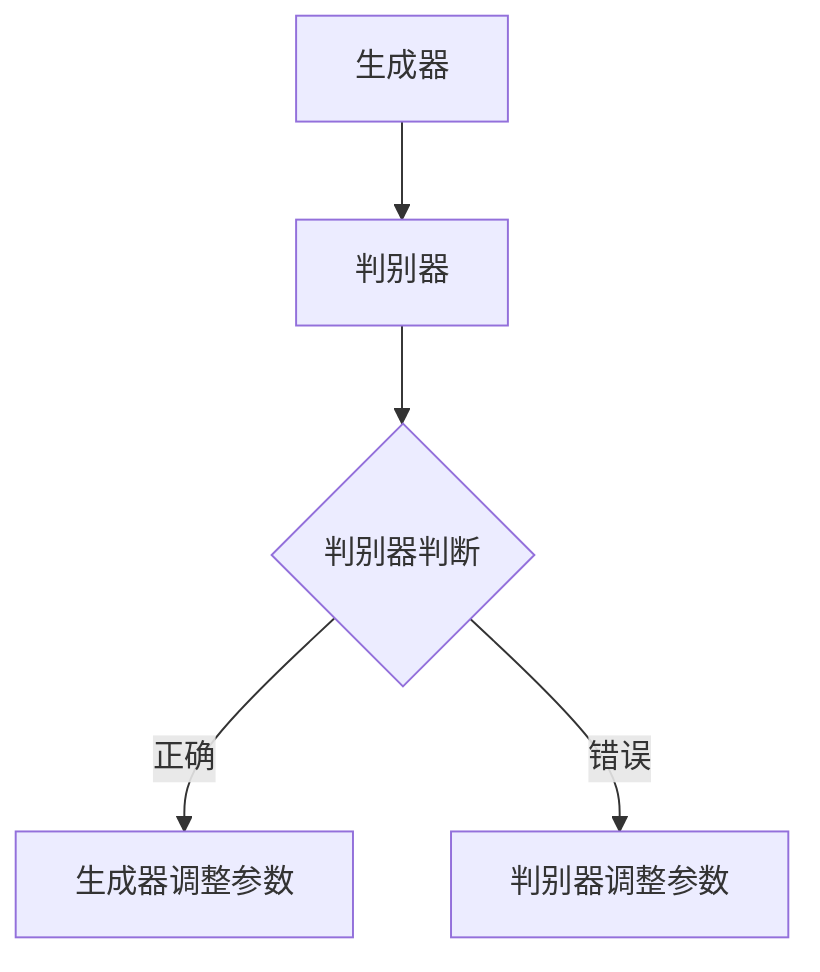
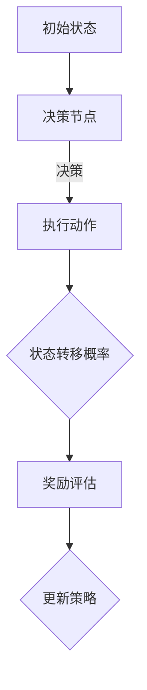
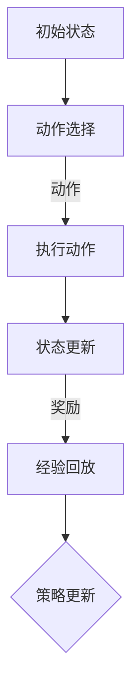
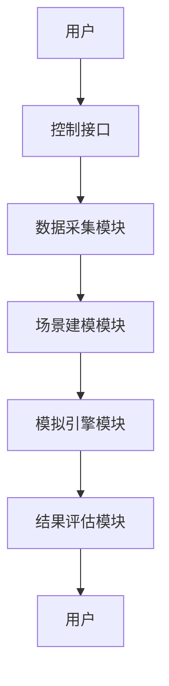

                 

### 评测场景模拟：还原真实应用环境

#### 关键词：评测场景模拟、真实应用环境、系统架构设计、项目实战、最佳实践

#### 摘要：
本文旨在深入探讨评测场景模拟的概念、原理和应用，通过逐步分析评测场景模拟的核心概念、算法原理、系统架构设计及实际项目实战，为读者呈现一个全面、系统的评测场景模拟技术解决方案。文章不仅提供了详细的系统架构设计和项目实战案例，还分享了最佳实践和注意事项，旨在为从业者提供有价值的参考。

---

### 目录大纲

1. **第一部分：评测场景模拟概述**
   - **第1章：评测场景模拟背景**
     - **1.1 评测场景模拟的概念与重要性**
     - **1.2 评测场景模拟的发展历程**
     - **1.3 评测场景模拟的应用领域**
   - **第2章：评测场景模拟的核心概念**
     - **2.1 评测场景模拟的基本框架**
     - **2.2 评测场景模拟的关键技术**
     - **2.3 评测场景模拟的应用案例**
   - **第3章：评测场景模拟的算法原理**
     - **3.1 算法概述**
     - **3.2 常用算法讲解**
     - **3.3 算法流程图**
   - **第4章：评测场景模拟的系统架构设计**
     - **4.1 系统概述**
     - **4.2 系统接口设计**
     - **4.3 系统交互设计**
   - **第5章：评测场景模拟项目实战**
     - **5.1 环境安装**
     - **5.2 系统核心实现**
     - **5.3 代码应用解读与分析**
     - **5.4 实际案例分析与详细讲解**
     - **5.5 项目小结**
   - **第6章：评测场景模拟最佳实践**
     - **6.1 实践经验分享**
     - **6.2 小结与展望**
   - **第7章：注意事项与拓展阅读**
     - **7.1 注意事项**
     - **7.2 拓展阅读**

---

### 第一部分：评测场景模拟概述

#### 第1章：评测场景模拟背景

##### 1.1 评测场景模拟的概念与重要性

**定义**：评测场景模拟（Evaluation Scenario Simulation）是指通过构建与真实应用环境高度相似的虚拟场景，对系统、算法或产品的性能、稳定性和可靠性进行测试和评估的方法。

**重要性**：随着信息技术的飞速发展，评测场景模拟在软件开发、系统优化、算法研究和产品测试等领域中扮演着越来越重要的角色。它不仅可以帮助开发者快速发现和解决问题，还能为产品优化提供有力支持。

##### 1.2 评测场景模拟的发展历程

**初期阶段**：评测场景模拟的初步想法可以追溯到20世纪60年代，当时的计算机模拟主要用于军事和科学领域。

**发展阶段**：随着计算机技术的进步和模拟软件的普及，评测场景模拟开始广泛应用于商业和工业领域。20世纪90年代，随着互联网的发展，模拟技术逐渐走向多样化、智能化。

**现代阶段**：如今，随着大数据、人工智能等技术的兴起，评测场景模拟进入了一个新的发展阶段，更加智能化、自动化和高效。

##### 1.3 评测场景模拟的应用领域

**金融服务**：模拟金融市场的波动，评估投资策略的风险和收益。

**制造业**：模拟生产流程，优化生产计划和资源分配。

**交通运输**：模拟交通流量，优化交通管理，提高道路通行效率。

**医疗保健**：模拟医疗流程，优化医疗资源配置，提高医疗服务的质量。

---

在接下来的章节中，我们将详细探讨评测场景模拟的核心概念、算法原理、系统架构设计以及实际项目实战，帮助读者全面了解和掌握这一技术。

---

### 第二部分：评测场景模拟的核心概念

#### 第2章：评测场景模拟的核心概念

##### 2.1 评测场景模拟的基本框架

**场景构建**：首先，根据测试需求构建一个虚拟场景，包括各种设备和系统组件。

**模拟运行**：在虚拟场景中运行模拟软件，模拟实际运行过程中的各种操作和交互。

**结果评估**：对模拟运行的结果进行评估，包括性能指标、错误率、稳定性等。

##### 2.2 评测场景模拟的关键技术

**场景数据采集**：通过传感器、日志文件等方式采集真实场景的数据。

**场景建模**：利用数据分析和机器学习技术构建虚拟场景的数学模型。

**模拟引擎**：设计并实现一个高效的模拟引擎，用于模拟真实场景的运行过程。

##### 2.3 评测场景模拟的应用案例

**金融服务**：通过模拟金融市场，评估金融产品的风险和收益。

**制造业**：通过模拟生产流程，优化生产计划和资源分配。

**交通运输**：通过模拟交通流量，优化交通管理，提高道路通行效率。

**医疗保健**：通过模拟医疗流程，优化医疗资源配置，提高医疗服务的质量。

---

在下一章中，我们将深入探讨评测场景模拟的算法原理，包括算法分类、常用算法及其流程图，帮助读者更好地理解评测场景模拟的技术核心。

---

### 第三部分：评测场景模拟的算法原理

#### 第3章：评测场景模拟的算法原理

##### 3.1 算法概述

**算法分类**：根据应用场景和目标，评测场景模拟算法可以分为数据驱动算法和模型驱动算法。

**算法选择依据**：算法的选择取决于具体的应用场景、数据规模、计算资源和时间要求等因素。

##### 3.2 常用算法讲解

**生成对抗网络（GAN）**：通过对抗训练生成高质量的数据，用于模拟真实场景。

**马尔可夫决策过程（MDP）**：用于模拟随机环境下的决策过程。

**深度强化学习**：通过深度神经网络和强化学习技术，模拟复杂环境下的决策过程。

##### 3.3 算法流程图

**GAN算法流程图**：

**MDP算法流程图**：

**深度强化学习算法流程图**：

---

在下一章中，我们将详细讲解评测场景模拟的系统架构设计，包括系统概述、系统接口设计和系统交互设计，帮助读者全面理解评测场景模拟的系统架构。

---

### 第四部分：评测场景模拟的系统架构设计

#### 第4章：评测场景模拟的系统架构设计

##### 4.1 系统概述

**系统功能设计**：评测场景模拟系统的主要功能包括场景构建、模拟运行、结果评估等。

**系统架构设计**：系统架构包括数据采集模块、场景建模模块、模拟引擎模块和结果评估模块。

##### 4.2 系统接口设计

**数据接口**：系统通过数据接口与外部系统进行数据交换，包括数据采集、数据存储和数据查询等接口。

**控制接口**：系统通过控制接口接收用户输入的命令和参数，控制模拟运行的开始、停止和参数调整等。

##### 4.3 系统交互设计

**系统序列图**：

---

在下一章中，我们将通过实际项目实战，详细介绍评测场景模拟的系统安装、核心实现、代码分析以及案例分析，帮助读者深入理解评测场景模拟的实际应用。

---

### 第五部分：评测场景模拟项目实战

#### 第5章：评测场景模拟项目实战

##### 5.1 环境安装

**硬件环境**：根据项目需求选择合适的硬件配置，包括CPU、内存、硬盘等。

**软件环境**：安装操作系统、数据库、编程语言和相关库，如Python、NumPy、Pandas等。

##### 5.2 系统核心实现

**数据采集模块**：设计数据采集模块，实现数据采集、清洗和存储。

**场景建模模块**：设计场景建模模块，实现场景建模、模型训练和模型评估。

**模拟运行模块**：设计模拟运行模块，实现模拟运行、结果记录和统计。

##### 5.3 代码应用解读与分析

**数据采集模块代码分析**：介绍数据采集模块的实现细节，包括数据采集方式、数据清洗方法和数据存储策略。

**场景建模模块代码分析**：介绍场景建模模块的实现细节，包括模型选择、模型训练和模型评估。

**模拟运行模块代码分析**：介绍模拟运行模块的实现细节，包括模拟运行流程、结果记录和统计方法。

##### 5.4 实际案例分析与详细讲解

**金融服务案例分析**：通过实际案例，分析金融服务领域的评测场景模拟应用。

**制造业案例分析**：通过实际案例，分析制造业领域的评测场景模拟应用。

**交通运输案例分析**：通过实际案例，分析交通运输领域的评测场景模拟应用。

##### 5.5 项目小结

总结项目实施过程中的经验教训，提出改进建议和未来发展方向。

---

在下一章中，我们将分享评测场景模拟的最佳实践，包括场景构建技巧、模拟运行策略和结果评估方法，帮助读者更好地应用评测场景模拟技术。

---

### 第六部分：评测场景模拟最佳实践

#### 第6章：评测场景模拟最佳实践

##### 6.1 实践经验分享

**场景构建技巧**：分享场景构建过程中的实用技巧和注意事项。

**模拟运行策略**：介绍模拟运行过程中的最佳策略和方法。

**结果评估方法**：介绍结果评估过程中的方法和工具，帮助用户准确评估模拟结果。

##### 6.2 小结与展望

**本书总结**：回顾全书的主要内容和关键知识点，帮助读者巩固所学知识。

**未来发展趋势**：探讨评测场景模拟技术的未来发展趋势和潜在应用领域。

---

在最后一章中，我们将讨论评测场景模拟的注意事项和拓展阅读资源，帮助读者更好地理解和应用评测场景模拟技术。

---

### 第七部分：注意事项与拓展阅读

#### 第7章：注意事项与拓展阅读

##### 7.1 注意事项

**数据安全问题**：在模拟过程中，确保数据安全和隐私保护。

**模拟精度问题**：根据实际需求调整模拟精度，避免过度模拟。

**遵守相关法律法规**：在应用评测场景模拟技术时，遵守相关法律法规，确保合规性。

##### 7.2 拓展阅读

**相关书籍推荐**：推荐几本关于评测场景模拟和人工智能领域的经典书籍。

**学术论文推荐**：推荐一些在评测场景模拟领域具有影响力的学术论文。

---

通过本文的详细探讨，我们希望读者能够对评测场景模拟技术有一个全面、深入的理解，并在实际工作中能够灵活应用，为产品优化和系统提升提供有力支持。

---

### 作者信息

**作者：AI天才研究院/AI Genius Institute & 禅与计算机程序设计艺术 /Zen And The Art of Computer Programming**

---

感谢您的耐心阅读，期待您的反馈和建议！让我们一起探索评测场景模拟的无限可能。

