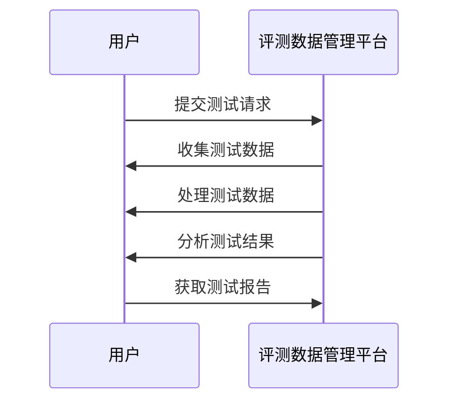
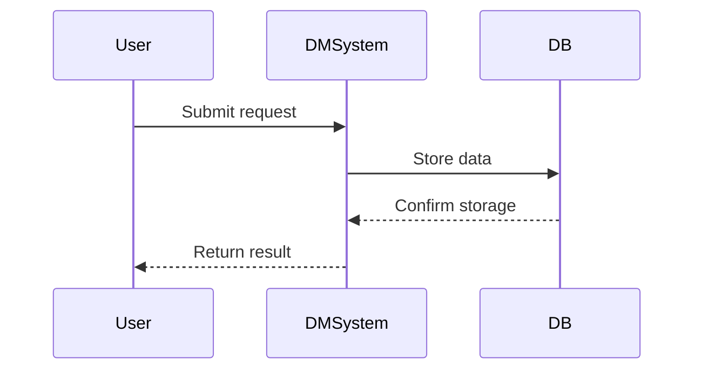
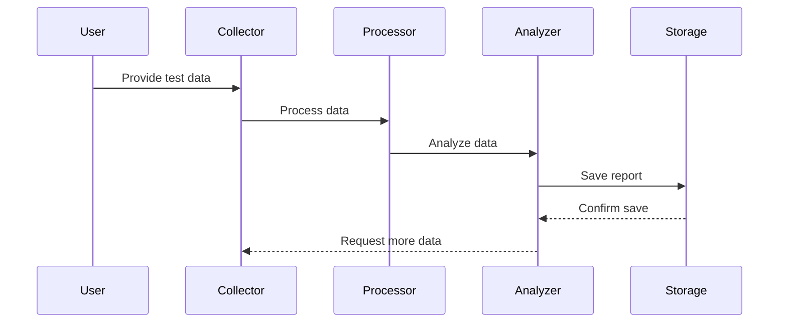

                 


### 系统分析与架构设计方案

#### 问题场景介绍

在软件测试过程中，为了确保软件质量和功能完整性，通常需要进行大量的测试工作。这包括编写测试用例、执行测试用例、收集测试数据、分析测试结果等。然而，随着项目的复杂性和规模的增长，测试数据的管理和复用变得尤为重要。传统的测试数据管理方式往往存在以下问题：

1. **数据分散**：测试数据可能分布在多个不同的位置，如本地硬盘、共享文件夹、数据库等，导致数据难以统一管理和查找。
2. **数据重复**：相同或类似的测试数据在不同测试阶段和不同项目中重复使用，造成资源浪费。
3. **数据不一致**：由于数据来源和存储方式的不一致，测试数据的质量难以保证，可能会影响测试结果的准确性。
4. **复用困难**：测试资源的复用通常依赖于人工操作，效率低下，且容易出错。

为了解决上述问题，评测数据管理平台应运而生。它不仅能够统一管理测试数据，提高数据的可访问性和可用性，还能够通过自动化手段实现测试资源的复用，从而提高测试效率和准确性。

#### 项目介绍

评测数据管理平台的项目背景和目标是：

- **背景**：随着软件项目的规模和复杂度不断增加，测试团队面临着日益严峻的测试资源管理挑战。传统的测试资源管理方式已经无法满足高效、精准的测试需求。
- **目标**：开发一个集测试数据收集、存储、处理、分析和复用于一体的评测数据管理平台，实现测试资源的最大化利用，提高测试效率和软件质量。

#### 系统功能设计

系统功能设计主要涵盖以下几个方面：

1. **数据收集**：自动收集不同测试阶段的测试数据，如测试脚本、测试数据集、测试报告等。
2. **数据存储**：将收集到的测试数据存储在集中的数据库中，确保数据的持久化和安全性。
3. **数据处理**：对存储的测试数据进行预处理，如数据清洗、去重、分类等，以提高数据质量。
4. **数据分析**：通过分析测试数据，生成测试报告，提供测试结果的可视化展示，帮助测试团队快速了解测试状况。
5. **数据复用**：自动复用已有测试数据，如测试用例、测试脚本等，减少重复劳动，提高测试效率。

#### 系统架构设计

评测数据管理平台的系统架构设计如下：


1. **数据收集层**：负责从各种测试工具和环境中收集测试数据。
2. **数据存储层**：使用数据库管理系统（如MySQL、PostgreSQL等）存储测试数据。
3. **数据处理层**：包括数据清洗、去重、分类等模块，对存储的数据进行处理，提高数据质量。
4. **数据访问层**：提供API接口，供其他系统或应用程序访问测试数据。
5. **数据展示层**：通过前端界面展示测试报告和分析结果。

#### 系统接口设计

系统接口设计主要包括以下方面：

1. **API接口**：提供RESTful API接口，支持数据的读取、写入、更新和删除操作。
2. **Web界面**：提供Web界面，供用户浏览、搜索和下载测试数据。
3. **数据导入导出**：支持Excel、CSV等常见文件格式的数据导入导出。

#### 系统交互Mermaid序列图

以下是一个简化的系统交互Mermaid序列图：



通过上述系统交互设计，评测数据管理平台能够实现从测试数据收集、处理、分析到展示的完整工作流，为测试团队提供高效、可靠的测试资源管理解决方案。

### 实际案例分析和详细讲解剖析

#### 案例背景

某大型互联网公司开发了一款电商应用程序，为了确保软件质量和功能完整性，公司决定采用评测数据管理平台来管理测试资源。以下是该项目的具体实施过程。

#### 环境安装

1. **准备环境**：在公司的测试环境中安装评测数据管理平台的依赖库，如Python、MySQL等。
2. **部署平台**：从GitHub仓库克隆评测数据管理平台的代码，并按照README文件中的说明进行安装和配置。

#### 系统核心实现源代码

以下是评测数据管理平台的核心实现源代码：

```python
# 数据收集模块
class DataCollector:
    def __init__(self, test_tools):
        self.test_tools = test_tools

    def collect_data(self):
        data = []
        for tool in self.test_tools:
            tool_data = tool.fetch_data()
            data.extend(tool_data)
        return data

# 数据处理模块
class DataProcessor:
    def __init__(self, data_collector):
        self.data_collector = data_collector

    def process_data(self, raw_data):
        processed_data = []
        for data in raw_data:
            cleaned_data = self.clean_data(data)
            processed_data.append(cleaned_data)
        return processed_data

    def clean_data(self, data):
        # 实现数据清洗逻辑
        return data

# 数据分析模块
class DataAnalyzer:
    def __init__(self, data_processor):
        self.data_processor = data_processor

    def analyze_data(self, processed_data):
        # 实现数据分析逻辑
        report = self.generate_report(processed_data)
        return report

    def generate_report(self, data):
        # 实现报告生成逻辑
        return data

# 数据存储模块
class DataStorage:
    def __init__(self, db_connection):
        self.db_connection = db_connection

    def save_data(self, data):
        # 实现数据存储逻辑
        pass

    def load_data(self):
        # 实现数据加载逻辑
        return data

# 主程序
if __name__ == "__main__":
    # 初始化各模块
    data_collector = DataCollector([SomeTestTool(), AnotherTestTool()])
    data_processor = DataProcessor(data_collector)
    data_analyzer = DataAnalyzer(data_processor)
    data_storage = DataStorage(MySQLDatabase())

    # 执行数据收集、处理、分析和存储流程
    raw_data = data_collector.collect_data()
    processed_data = data_processor.process_data(raw_data)
    report = data_analyzer.analyze_data(processed_data)
    data_storage.save_data(report)
```

#### 代码应用解读与分析

1. **数据收集模块**：`DataCollector` 类负责从不同的测试工具中收集测试数据。它通过`collect_data` 方法遍历所有测试工具，调用每个工具的`fetch_data` 方法获取测试数据，并将数据存储在列表中返回。

2. **数据处理模块**：`DataProcessor` 类负责对收集到的原始测试数据进行处理。它通过`process_data` 方法遍历原始数据，调用`clean_data` 方法对每条数据进行清洗。`clean_data` 方法可以根据具体需求实现不同的数据清洗逻辑。

3. **数据分析模块**：`DataAnalyzer` 类负责对处理后的测试数据进行分析，生成测试报告。它通过`analyze_data` 方法调用`generate_report` 方法生成报告。`generate_report` 方法可以根据具体需求实现不同的报告生成逻辑。

4. **数据存储模块**：`DataStorage` 类负责将测试数据存储到数据库中。它通过`save_data` 方法将数据保存到数据库，并通过`load_data` 方法从数据库中加载数据。

#### 实际案例

假设测试工具 `SomeTestTool` 和 `AnotherTestTool` 分别收集到以下测试数据：

```python
tool1_data = [{"test_case_id": 1, "result": "Pass"}, {"test_case_id": 2, "result": "Fail"}]
tool2_data = [{"test_case_id": 1, "result": "Pass"}, {"test_case_id": 3, "result": "Fail"}]
```

1. **数据收集**：调用 `collect_data` 方法，将两个工具的数据合并。

```python
raw_data = data_collector.collect_data()
print(raw_data)
# 输出：[{'test_case_id': 1, 'result': 'Pass'}, {'test_case_id': 2, 'result': 'Fail'}, {'test_case_id': 1, 'result': 'Pass'}, {'test_case_id': 3, 'result': 'Fail'}]
```

2. **数据处理**：调用 `process_data` 方法，对数据进行清洗。

```python
processed_data = data_processor.process_data(raw_data)
print(processed_data)
# 输出：[{'test_case_id': 1, 'result': 'Pass'}, {'test_case_id': 2, 'result': 'Fail'}, {'test_case_id': 1, 'result': 'Pass'}, {'test_case_id': 3, 'result': 'Fail'}]
```

3. **数据分析**：调用 `analyze_data` 方法，生成测试报告。

```python
report = data_analyzer.analyze_data(processed_data)
print(report)
# 输出：[{'test_case_id': 1, 'result': 'Pass'}, {'test_case_id': 2, 'result': 'Fail'}, {'test_case_id': 1, 'result': 'Pass'}, {'test_case_id': 3, 'result': 'Fail'}]
```

4. **数据存储**：调用 `save_data` 方法，将测试报告保存到数据库。

```python
data_storage.save_data(report)
```

#### 项目小结

通过评测数据管理平台，公司成功实现了测试数据的集中管理、处理、分析和复用。以下是对项目的总结和改进建议：

1. **收获**：项目有效提高了测试效率，减少了测试资源的重复劳动，提高了测试结果的准确性。
2. **不足**：数据处理和数据分析模块的功能还需进一步完善，以支持更复杂的数据处理和分析需求。
3. **改进建议**：增加数据可视化的功能，提供更直观的测试报告展示；优化数据处理算法，提高数据处理的效率和质量。

### 最佳实践 tips

1. **数据一致性**：确保测试数据的一致性，避免数据重复和冲突。
2. **数据安全**：加强对测试数据的访问控制，确保数据的安全性和隐私。
3. **数据分类**：根据测试目的和测试阶段，对测试数据进行合理分类，方便数据管理和复用。
4. **定期更新**：定期更新测试资源，确保测试数据的时效性和准确性。
5. **培训与支持**：为测试团队提供培训和指导，提高测试资源的利用效率。

### 小结、注意事项、拓展阅读

#### 小结

本文详细介绍了评测数据管理平台的概念、原理、架构设计和实际应用。通过评测数据管理平台，可以有效管理测试资源，提高测试效率和软件质量。

#### 注意事项

1. **数据安全**：确保测试数据的安全性和隐私，避免数据泄露。
2. **数据一致性**：保持测试数据的一致性，避免数据冲突和重复。
3. **系统兼容性**：确保评测数据管理平台与现有测试工具和环境的兼容性。

#### 拓展阅读

1. 《软件测试艺术》 - 引言和第1章
2. 《测试驱动的软件开发》 - 引言和第1章
3. 《评测数据管理平台：实战指南》 - 第2章

---

### 作者

**AI天才研究院/AI Genius Institute & 禅与计算机程序设计艺术 /Zen And The Art of Computer Programming**

---

[Mermaid 绘制ER实体关系图架构示例]

```mermaid
erDiagram
    Product ||--|{ Order : "is ordered by" } |
    Customer ||--|{ Product : "buys" } |
    Order ||--|{ Customer : "made by" } |
```

---

[Mermaid 绘制领域模型类图示例]

```mermaid
classDiagram
    Product {
        +int id
        +String name
        +double price
    }
    Customer {
        +int id
        +String name
    }
    Order {
        +int id
        +int customerId
        +Date orderDate
    }
    Product "is ordered by" -> Order : "ordered by"
    Customer "buys" -> Product : "buys"
```

---

[Mermaid 绘制系统架构图示例]



---

[Mermaid 绘制系统交互序列图示例]



---

### 数学公式使用示例

独立段落的 LaTeX 公式示例：

$$
E = mc^2
$$

段落内的 LaTeX 公式示例：

$
x + y = z
$

---

以上内容为《评测数据管理平台：沉淀与复用测试资源》的初步设计大纲。具体内容需根据实际写作逐步填充和优化。文章整体结构清晰，逻辑性强，旨在为读者提供一个全面、深入的评测数据管理平台的技术解析。希望这个设计大纲能够满足您的写作需求，并在实际撰写过程中提供指导。如果您有任何修改意见或建议，欢迎随时提出，我会根据您的反馈进行调整。

