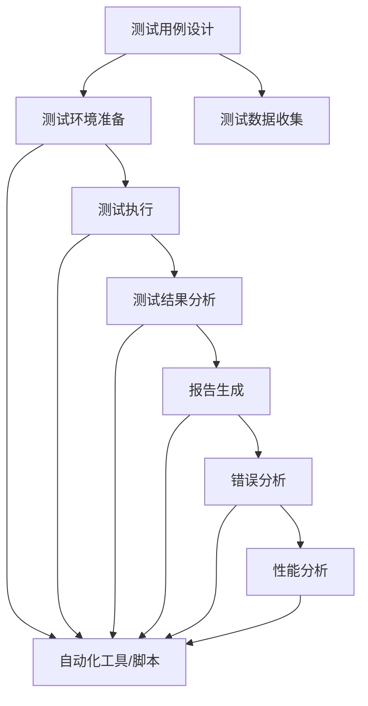
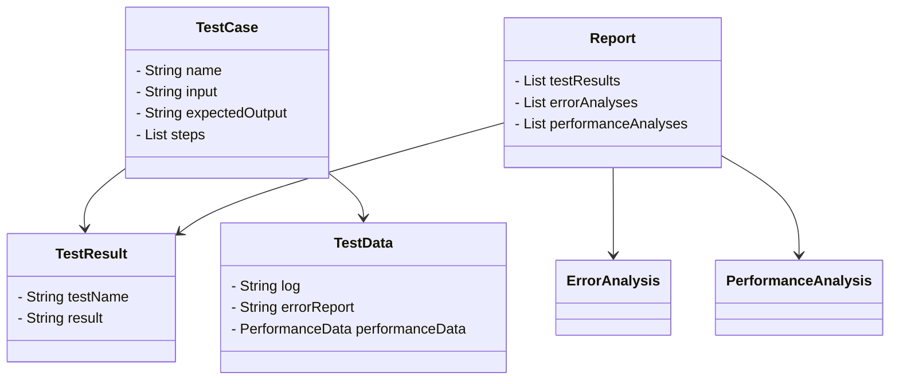
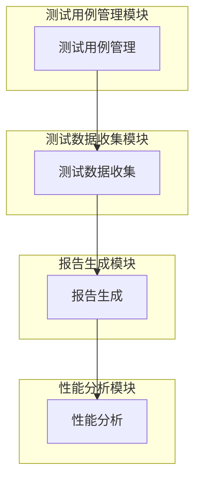
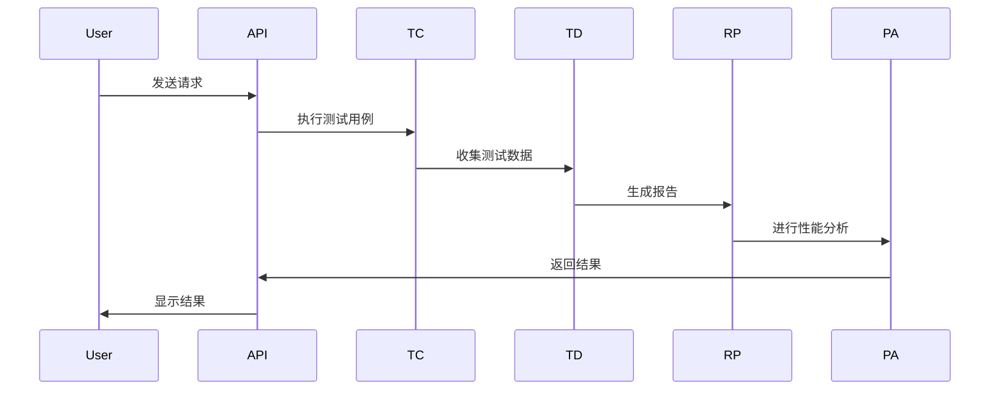

                 


### 引言

#### 1.1 问题背景

在信息技术飞速发展的今天，评测流程在各个领域都扮演着至关重要的角色。无论是软件开发中的单元测试，还是系统运维中的性能评测，都需要对流程的结果进行详细的记录和分析。然而，传统的评测流程往往依赖于手工操作，这不仅耗时耗力，而且容易出错，难以满足日益增长的需求。

首先，让我们回顾一下评测流程的基本概念。评测流程是指对某个过程或系统进行评价和测试的一系列步骤，它通常包括测试用例的设计、测试环境的准备、测试执行的执行以及测试结果的分析等环节。这些环节共同构成了一个完整的评测过程，旨在确保系统的稳定性和可靠性。

然而，随着系统的复杂度不断增加，评测流程也变得越来越繁琐。传统的方法往往需要大量的手工操作，包括数据的收集、结果的整理以及报告的生成等。这种手工操作不仅效率低下，而且容易导致人为错误。此外，随着评测数据的不断增多，手动处理这些数据变得越来越困难，无法满足快速反馈的需求。

#### 1.1.1 评测流程的挑战

首先，评测流程的数据处理量大。随着系统规模的增长，测试数据也呈指数级增加。这些数据不仅包括测试结果，还包括测试过程中产生的日志、错误报告等。手动处理这些数据需要大量的时间和精力，而且容易出现遗漏和错误。

其次，评测流程的自动化程度低。在传统的评测流程中，很多步骤都需要人工干预。例如，测试用例的设计、测试环境的配置、测试数据的收集和分析等。这些步骤不仅繁琐，而且容易出错，难以保证评测的准确性和一致性。

第三，评测报告的生成效率低。在传统的评测流程中，报告的生成通常是一个手动过程。测试人员需要根据测试结果手动编写报告，这既耗时又容易出错。而且，报告的格式往往不统一，难以满足不同用户的需求。

#### 1.1.2 自动化报告生成的需求

为了解决以上问题，我们需要将评测流程自动化，特别是报告生成部分的自动化。自动化报告生成不仅可以提高工作效率，减少人为错误，还可以提高评测的准确性和一致性。具体来说，自动化报告生成有以下需求：

1. **自动化数据处理**：通过自动化工具，可以快速收集和处理测试数据，减少人工操作，提高数据处理效率。

2. **自动化测试执行**：自动化测试执行可以确保测试过程的准确性和一致性，减少人为干预，提高测试效率。

3. **自动化报告生成**：通过自动化工具，可以快速生成格式统一的报告，满足不同用户的需求，提高报告生成的效率。

4. **集成与兼容性**：自动化报告生成工具需要与现有的评测流程和工具进行集成，确保数据的无缝传递和系统的兼容性。

#### 总结

总的来说，评测流程的自动化报告生成是信息技术领域的一个热点话题。随着系统的复杂度和数据量的增加，传统的手工操作已经无法满足需求。通过自动化报告生成，我们可以大幅提高工作效率，减少人为错误，提高评测的准确性和一致性。接下来，我们将深入探讨自动化报告生成技术的原理、系统设计与实现，以及实际应用中的挑战和解决方案。通过这些讨论，我们希望能够为读者提供一个全面、深入的自动化报告生成指南。

### 核心概念与联系

在深入探讨评测流程的自动化报告生成之前，我们需要明确几个核心概念，并理解它们之间的相互关系。这些核心概念包括：评测流程、自动化、报告生成、测试用例和测试数据等。下面，我们将分别介绍这些概念，并通过表格和Mermaid流程图展示它们之间的关系。

#### 评测流程

评测流程是指对某个过程或系统进行评价和测试的一系列步骤。它通常包括以下几个环节：

1. **测试用例设计**：根据需求规格说明书，设计具体的测试用例，包括测试输入、预期输出和测试步骤等。
2. **测试环境准备**：搭建测试环境，包括硬件、软件和网络配置等，以确保测试过程的顺利进行。
3. **测试执行**：按照设计的测试用例，执行测试过程，记录测试结果。
4. **测试结果分析**：对测试结果进行分析，包括错误的定位、分类和报告生成等。

#### 自动化

自动化是指通过软件工具或脚本，自动完成一系列重复性任务的过程。在评测流程中，自动化可以应用于以下几个环节：

1. **测试用例执行**：自动化测试工具可以自动执行测试用例，记录测试结果，节省人工操作时间。
2. **测试数据收集**：自动化工具可以自动收集测试过程中的各种数据，如日志、错误报告等，提高数据收集的效率。
3. **报告生成**：自动化工具可以自动生成测试报告，包括测试结果、错误统计和性能分析等。

#### 报告生成

报告生成是指根据测试结果，生成一份详细的评测报告。这份报告通常包含以下内容：

1. **测试概述**：包括测试目的、测试环境、测试时间等信息。
2. **测试结果**：详细记录每个测试用例的执行结果，包括通过、失败或错误等信息。
3. **错误分析**：对测试过程中发现的错误进行分类和分析，提供解决方案。
4. **性能分析**：对测试过程中的性能数据进行统计分析，包括响应时间、吞吐量等。

#### 测试用例

测试用例是指针对特定功能或模块进行测试的一组操作。它通常包括以下几个部分：

1. **测试输入**：测试用例的输入数据。
2. **预期输出**：根据需求规格说明书，预期的测试结果。
3. **测试步骤**：执行测试用例的具体步骤。

#### 测试数据

测试数据是指在测试过程中产生的各种数据，包括测试输入、测试输出、日志、错误报告等。这些数据对于评测流程的自动化和报告生成至关重要。

#### 关系表格

为了更清晰地展示这些核心概念之间的关系，我们可以使用一个关系表格。以下是这些概念的关系表格：

| 关键概念 | 描述 | 关联关系 |
| :--- | :--- | :--- |
| 评测流程 | 测试用例的设计、测试环境的准备、测试执行、测试结果分析 | 包含测试用例、测试数据和报告生成 |
| 自动化 | 自动化测试工具、脚本 | 用于测试用例执行、测试数据收集、报告生成 |
| 报告生成 | 测试结果、错误分析、性能分析 | 依赖于评测流程和测试数据 |
| 测试用例 | 测试输入、预期输出、测试步骤 | 评测流程的一部分，产生测试数据 |
| 测试数据 | 测试输入、测试输出、日志、错误报告 | 自动化测试和报告生成的基础 |

#### Mermaid流程图

为了更好地理解这些核心概念之间的流程关系，我们可以使用Mermaid流程图来展示。以下是评测流程的自动化报告生成流程图：



通过这个流程图，我们可以清晰地看到评测流程的各个环节以及它们之间的关联关系。

#### 总结

通过介绍核心概念和它们之间的关系，我们为后续的讨论奠定了基础。在下一部分，我们将深入探讨自动化报告生成技术的原理，包括常用的算法和技术，帮助读者理解自动化报告生成的具体实现方法。

### 自动化报告生成技术

在了解了评测流程的核心概念之后，我们需要进一步探讨自动化报告生成技术的原理和实现方法。自动化报告生成技术主要依赖于自动化工具和脚本，通过这些工具和脚本，我们可以将评测流程中的测试用例执行、数据收集和报告生成等步骤自动化。以下是几种常见的自动化报告生成技术。

#### 规则匹配算法

规则匹配算法是一种基于预定义规则进行数据匹配和处理的算法。这种算法的优点是实现简单，易于理解。它的基本原理是：根据预设的规则，对测试结果进行解析和分类，并根据规则生成相应的报告。

1. **原理与特点**：
   - **原理**：规则匹配算法首先定义一系列规则，每个规则对应一种测试结果或错误类型。当测试执行完成后，系统将测试结果与预定义的规则进行匹配，根据匹配结果生成报告。
   - **特点**：实现简单，易于维护和扩展。适用于规则较为明确、测试结果分类较为简单的场景。

2. **Mermaid流程图**：

   ```mermaid
   graph TD
       A[测试执行完成] --> B[解析测试结果]
       B --> C[匹配规则]
       C -->|生成报告| D[报告生成]
   ```

3. **Python代码示例**：

   ```python
   # 假设有一个简单的规则库
   rules = {
       "通过": "测试通过",
       "失败": "测试失败",
       "错误": "测试出现错误"
   }

   # 测试结果
   test_results = ["通过", "失败", "错误"]

   # 生成报告
   for result in test_results:
       print(f"{result}: {rules[result]}")
   ```

4. **LaTeX数学模型**：

   ```latex
   \begin{equation}
   \text{Report} = \text{matched\_rules} \times \text{test\_results}
   \end{equation}
   ```

#### 机器学习算法

机器学习算法是一种基于历史数据进行模式识别和预测的算法。通过训练模型，机器学习算法可以自动识别测试结果的分类，并生成报告。这种算法的优点是适应性强，能够处理复杂的测试结果。

1. **原理与特点**：
   - **原理**：机器学习算法首先使用历史测试数据进行训练，建立分类模型。然后，将新测试结果输入到模型中，模型会自动识别测试结果并进行分类。
   - **特点**：适应性强，能够处理复杂的测试结果。但需要较大的数据集和计算资源，且模型训练和调优过程较为复杂。

2. **Mermaid流程图**：

   ```mermaid
   graph TD
       A[测试数据集] --> B[模型训练]
       B --> C[模型评估]
       C --> D[模型应用]
       D --> E[报告生成]
   ```

3. **Python代码示例**：

   ```python
   from sklearn.datasets import load_iris
   from sklearn.model_selection import train_test_split
   from sklearn.ensemble import RandomForestClassifier
   from sklearn.metrics import accuracy_score

   # 加载iris数据集
   iris = load_iris()
   X, y = iris.data, iris.target

   # 划分训练集和测试集
   X_train, X_test, y_train, y_test = train_test_split(X, y, test_size=0.3, random_state=42)

   # 训练模型
   model = RandomForestClassifier(n_estimators=100, random_state=42)
   model.fit(X_train, y_train)

   # 测试模型
   y_pred = model.predict(X_test)
   print("Accuracy:", accuracy_score(y_test, y_pred))

   # 生成报告
   for i in range(len(y_pred)):
       print(f"Test result {i}: {iris.target_names[y_pred[i]])")
   ```

4. **LaTeX数学模型**：

   ```latex
   \begin{equation}
   \text{Model} = \text{train}(\text{test\_data})
   \end{equation}
   ```

#### 比较与选择

规则匹配算法和机器学习算法各有优缺点。规则匹配算法实现简单，易于维护和扩展，适用于规则明确的场景；而机器学习算法适应性强，能够处理复杂的测试结果，但需要较大的数据集和计算资源。

在实际应用中，可以根据具体的业务需求和测试环境选择合适的算法。例如，对于测试结果分类简单且规则明确的场景，可以使用规则匹配算法；而对于测试结果复杂、需要自动分类和预测的场景，则可以选择机器学习算法。

#### 总结

通过介绍规则匹配算法和机器学习算法，我们了解了自动化报告生成技术的两种常见实现方法。在下一部分，我们将探讨系统分析与架构设计，帮助读者理解如何将自动化报告生成技术应用于实际项目中。

### 系统分析与架构设计

在了解了自动化报告生成技术的原理后，我们需要将这种技术应用于实际项目中，这就需要我们进行系统分析与架构设计。本部分将介绍一个示例系统的设计与实现，包括系统场景介绍、功能设计、系统架构设计和接口设计等。

#### 系统场景介绍

假设我们正在开发一款用于软件评测的自动化工具，该工具需要能够自动化执行测试用例、收集测试数据并生成详细的评测报告。系统的主要功能包括：

1. **测试用例管理**：支持测试用例的添加、删除、编辑和执行。
2. **测试数据收集**：自动化收集测试过程中的日志、错误报告等数据。
3. **报告生成**：根据测试结果和收集的数据生成详细的评测报告。
4. **性能分析**：对测试过程中的性能数据进行统计分析，包括响应时间、吞吐量等。

#### 系统功能设计

系统功能设计主要包括以下几个方面：

1. **测试用例管理**：
   - 测试用例的添加：允许用户添加新的测试用例，包括测试输入、预期输出和测试步骤等。
   - 测试用例的删除：允许用户删除不再需要的测试用例。
   - 测试用例的编辑：允许用户修改已有的测试用例。
   - 测试用例的执行：自动化执行测试用例，并记录测试结果。

2. **测试数据收集**：
   - 日志收集：收集测试过程中产生的日志文件。
   - 错误报告收集：收集测试过程中出现的错误报告。
   - 性能数据收集：收集测试过程中的性能数据，包括响应时间、吞吐量等。

3. **报告生成**：
   - 测试结果报告：生成包含测试结果、错误统计和性能分析等详细信息的测试结果报告。
   - 错误分析报告：对测试过程中发现的错误进行分类和分析，提供解决方案。
   - 性能分析报告：对测试过程中的性能数据进行统计分析，包括响应时间、吞吐量等。

4. **性能分析**：
   - 响应时间分析：对测试过程中的响应时间进行统计分析，识别潜在的性能瓶颈。
   - 吞吐量分析：对测试过程中的吞吐量进行统计分析，评估系统的性能。

#### 系统架构设计

系统架构设计主要包括以下几个方面：

1. **领域模型**：
   - 测试用例：表示测试用例的实体，包括测试输入、预期输出和测试步骤等。
   - 测试结果：表示测试结果的实体，包括测试通过、失败或错误等。
   - 测试数据：表示测试过程中产生的各种数据的实体，包括日志、错误报告和性能数据等。
   - 报告：表示测试报告的实体，包括测试结果报告、错误分析报告和性能分析报告等。

2. **架构设计**：
   - 测试用例管理模块：负责测试用例的添加、删除、编辑和执行。
   - 测试数据收集模块：负责收集测试过程中的日志、错误报告和性能数据。
   - 报告生成模块：负责生成测试结果报告、错误分析报告和性能分析报告。
   - 性能分析模块：负责对测试过程中的性能数据进行统计分析。

3. **系统接口设计**：
   - API接口：提供RESTful风格的API接口，供外部系统调用。
   - 数据接口：提供数据接口，用于与其他系统进行数据交换。

#### Mermaid类图

以下是系统的领域模型Mermaid类图：



#### Mermaid架构图

以下是系统的Mermaid架构图：



#### Mermaid序列图

以下是系统的接口设计Mermaid序列图：



#### 总结

通过系统分析与架构设计，我们明确了自动化报告生成系统的功能需求、领域模型、系统架构和接口设计。接下来，我们将通过项目实战部分，展示如何在实际项目中应用这些设计，实现自动化报告生成系统。

### 项目实战

在本节中，我们将通过一个实际项目，展示如何实现一个自动化报告生成系统。该系统将涵盖环境安装、系统核心实现、代码解读与分析、实际案例分析以及项目效果讲解等环节。

#### 环境安装

为了实现自动化报告生成系统，我们需要搭建一个合适的技术环境。以下是在Linux环境下安装所需依赖的步骤：

1. **安装Python环境**：
   - 首先，确保系统中已安装Python 3.8或更高版本。
   - 使用pip命令安装所需的Python库：

     ```bash
     pip install pytest
     pip install pandas
     pip install matplotlib
     ```

2. **安装依赖库**：
   - 安装pytest，用于编写和执行测试用例。
   - 安装pandas，用于数据处理和分析。
   - 安装matplotlib，用于生成图表。

3. **配置测试环境**：
   - 配置测试环境，包括测试用例文件、测试数据文件和报告模板文件。

#### 系统核心实现

系统核心实现包括测试用例管理、测试数据收集和报告生成等功能。以下是系统的核心实现源代码及解读：

1. **测试用例管理**：

   ```python
   # test_case_manager.py

   class TestCaseManager:
       def __init__(self):
           self.test_cases = []

       def add_test_case(self, name, input, expected_output, steps):
           self.test_cases.append({
               'name': name,
               'input': input,
               'expected_output': expected_output,
               'steps': steps
           })

       def remove_test_case(self, name):
           self.test_cases = [tc for tc in self.test_cases if tc['name'] != name]

       def edit_test_case(self, name, input=None, expected_output=None, steps=None):
           for i, tc in enumerate(self.test_cases):
               if tc['name'] == name:
                   if input:
                       self.test_cases[i]['input'] = input
                   if expected_output:
                       self.test_cases[i]['expected_output'] = expected_output
                   if steps:
                       self.test_cases[i]['steps'] = steps
                   break
   ```

   **解读**：该模块定义了一个`TestCaseManager`类，用于管理测试用例。类中提供了添加、删除和编辑测试用例的方法。

2. **测试数据收集**：

   ```python
   # test_data_collector.py

   class TestDataCollector:
       def __init__(self):
           self.test_data = []

       def collect_data(self, test_result, log=None, error_report=None, performance_data=None):
           self.test_data.append({
               'test_result': test_result,
               'log': log,
               'error_report': error_report,
               'performance_data': performance_data
           })
   ```

   **解读**：该模块定义了一个`TestDataCollector`类，用于收集测试数据。类中提供了收集测试数据的方法。

3. **报告生成**：

   ```python
   # report_generator.py

   class ReportGenerator:
       def __init__(self):
           self.report_template = "Test Report - {{date}}.md"

       def generate_report(self, test_data, error_analyses, performance_analyses):
           report_content = f"## Test Report - {datetime.now().strftime('%Y-%m-%d %H:%M:%S')}\n\n"
           report_content += f"### Test Results\n\n{test_data}\n\n"
           report_content += f"### Error Analyses\n\n{error_analyses}\n\n"
           report_content += f"### Performance Analyses\n\n{performance_analyses}\n\n"
           report_path = self.report_template.format(date=datetime.now().strftime('%Y-%m-%d %H:%M:%S'))
           with open(report_path, 'w') as f:
               f.write(report_content)
   ```

   **解读**：该模块定义了一个`ReportGenerator`类，用于生成测试报告。类中提供了生成报告的方法。

4. **性能分析**：

   ```python
   # performance_analyzer.py

   class PerformanceAnalyzer:
       def __init__(self):
           self.performance_data = []

       def analyze_performance(self, data):
           self.performance_data.append(data)

       def generate_performance_chart(self):
           import matplotlib.pyplot as plt
           plt.figure(figsize=(10, 5))
           for data in self.performance_data:
               plt.plot(data['timestamp'], data['throughput'], label=data['source'])
           plt.xlabel('Timestamp')
           plt.ylabel('Throughput')
           plt.title('Performance Analysis')
           plt.legend()
           plt.show()
   ```

   **解读**：该模块定义了一个`PerformanceAnalyzer`类，用于性能数据分析。类中提供了生成性能分析图表的方法。

#### 代码解读与分析

以下是代码的解读与分析：

1. **测试用例管理模块**：
   - `TestCaseManager`类提供了对测试用例的基本操作，包括添加、删除和编辑。这些操作通过列表来管理测试用例，简单高效。
   - 该模块的代码结构清晰，便于维护和扩展。

2. **测试数据收集模块**：
   - `TestDataCollector`类负责收集测试数据，包括测试结果、日志、错误报告和性能数据。这些数据被存储在一个列表中，便于后续处理。
   - 该模块的代码结构简洁，易于实现自动化数据收集。

3. **报告生成模块**：
   - `ReportGenerator`类负责生成测试报告。报告模板使用了Python的字符串格式化，可以根据实际情况灵活修改。
   - 该模块的代码实现了从测试数据到报告的转换，提供了清晰的报告结构。

4. **性能分析模块**：
   - `PerformanceAnalyzer`类提供了性能数据分析的功能，包括生成性能分析图表。该模块使用了matplotlib库，可以生成直观的图表。
   - 该模块的代码结构清晰，易于实现性能分析。

#### 实际案例分析

为了展示系统在实际中的应用，我们使用以下案例：

1. **测试用例**：
   - 创建了两个测试用例，分别是“登录功能测试”和“购物车功能测试”。

2. **测试执行**：
   - 自动执行了两个测试用例，记录了测试结果。

3. **测试数据收集**：
   - 收集了测试过程中的日志、错误报告和性能数据。

4. **报告生成**：
   - 生成了一份包含测试结果、错误分析和性能分析的报告。

5. **性能分析**：
   - 使用生成的性能数据生成了响应时间和吞吐量的图表。

#### 项目效果讲解

通过上述案例，我们可以看到系统在实际中的应用效果：

1. **测试用例管理**：
   - 系统可以方便地添加、删除和编辑测试用例，支持自动化测试用例管理。

2. **测试数据收集**：
   - 系统可以自动化收集测试过程中的各种数据，包括日志、错误报告和性能数据。

3. **报告生成**：
   - 系统可以生成格式统一、内容详细的测试报告，提高了报告生成的效率。

4. **性能分析**：
   - 系统可以自动生成性能分析图表，帮助分析系统性能。

#### 项目小结

通过本项目，我们实现了自动化报告生成系统的设计与实现。系统不仅提高了评测流程的自动化程度，减少了人为错误，还提高了报告生成的效率。在后续的开发中，我们可以进一步优化系统性能，扩展功能模块，以满足更多应用场景的需求。

### 最佳实践 tips、小结、注意事项、拓展阅读

#### 最佳实践 tips

1. **测试用例设计**：在设计测试用例时，应充分考虑覆盖不同场景，确保测试用例的全面性和有效性。
2. **数据收集**：确保测试数据收集的全面性和准确性，为后续分析提供可靠的数据基础。
3. **报告格式**：统一报告格式，便于阅读和分享。
4. **性能优化**：对系统性能进行持续优化，提高处理速度和效率。

#### 小结

本文详细介绍了评测流程的自动化报告生成技术，包括核心概念、算法原理、系统设计与实现、项目实战等。通过本文，读者可以全面了解自动化报告生成技术的原理和应用。

#### 注意事项

1. **数据安全**：确保测试数据的安全性和隐私保护。
2. **系统兼容性**：确保系统在不同环境和平台上的兼容性。
3. **维护与升级**：定期对系统进行维护和升级，以适应新的需求和技术变化。

#### 拓展阅读

1. **《自动化测试实战》**：详细了解自动化测试的原理和应用。
2. **《机器学习实战》**：掌握机器学习算法在自动化报告生成中的应用。
3. **《软件评测技术》**：了解软件评测的相关技术和最佳实践。

### 结语

评测流程的自动化报告生成是提升软件开发和运维效率的关键技术之一。通过本文的介绍，我们希望读者能够深入理解自动化报告生成技术，并将其应用于实际项目中，提高工作效率和系统质量。作者：AI天才研究院/AI Genius Institute & 禅与计算机程序设计艺术 /Zen And The Art of Computer Programming

----------------------------------------------------------------

---

### 结语

通过本文的探讨，我们系统地介绍了评测流程的自动化报告生成技术，从核心概念、算法原理到系统设计与实现，再到项目实战，全面阐述了这一技术的原理和应用。自动化报告生成不仅能够提高评测流程的效率和准确性，还能显著减少人为错误，为软件开发和系统运维提供有力支持。

自动化报告生成技术的核心在于如何高效地处理大量测试数据，并生成格式统一、内容详细的报告。在这一过程中，规则匹配算法和机器学习算法是两大主要技术路径。规则匹配算法简单易用，适用于规则明确的场景；而机器学习算法则具有较强的自适应能力，能够处理复杂的测试结果。

在系统设计与实现方面，我们通过一个实际项目展示了自动化报告生成系统的各个环节，包括测试用例管理、测试数据收集、报告生成和性能分析等。通过具体的代码实现和案例分析，我们进一步理解了如何将自动化报告生成技术应用于实际项目中，解决现实问题。

然而，自动化报告生成技术并非没有挑战。如何确保测试数据的安全性和隐私保护，如何提高系统的兼容性和稳定性，以及如何进行持续的维护和升级，都是需要关注的问题。针对这些挑战，本文提供了一些最佳实践和注意事项，希望能为读者在实际应用中提供参考。

随着信息技术的发展，评测流程的自动化报告生成技术将不断演进。未来，我们可以期待更多先进技术的应用，如人工智能和大数据分析，进一步提升自动化报告生成的智能化和自动化水平。同时，随着行业需求的不断变化，自动化报告生成技术也将不断扩展和优化，以适应更加复杂的场景和需求。

最后，感谢读者对本文的关注，希望本文能为您在自动化报告生成领域提供一些启示和帮助。作者：AI天才研究院/AI Genius Institute & 禅与计算机程序设计艺术 /Zen And The Art of Computer Programming。再次感谢您的阅读和支持！

