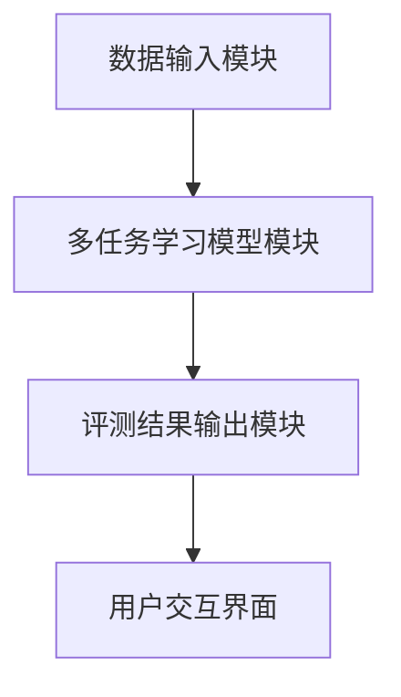
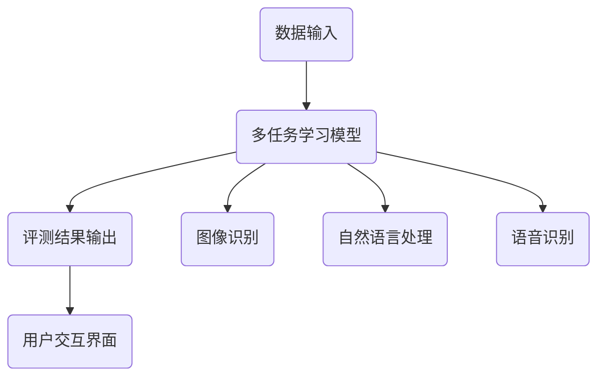
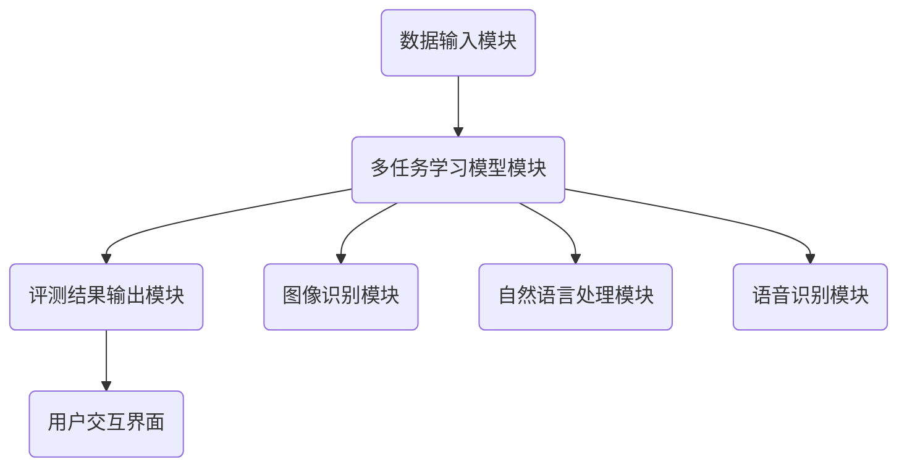

                 


# 评测系统的多任务学习框架设计

## 关键词

多任务学习，评测系统，算法原理，数学模型，系统架构，项目实战

## 摘要

本文旨在探讨评测系统中多任务学习框架的设计，分析其背景、核心概念、算法原理、数学模型以及系统架构。通过实际项目案例，详细介绍环境安装、核心实现、代码应用和分析，为评测系统的多任务学习框架设计提供实用指导。

## 第1章 引言

### 1.1 问题背景

评测系统是现代人工智能系统中不可或缺的一环，其目的是评估算法的性能、稳定性和可靠性。在评测系统中，往往需要处理多种不同的任务，例如图像识别、自然语言处理和语音识别等。传统的单任务学习方法难以同时应对这些任务，而多任务学习（Multi-Task Learning, MTL）提供了一种有效的解决方案。

### 1.1.1 多任务学习在评测系统中的应用需求

多任务学习在评测系统中的应用需求主要体现在以下几个方面：

1. **资源利用最大化**：在有限的计算资源下，通过共享模型参数，提高资源利用效率。
2. **任务协同优化**：多个任务之间可能存在一定的相关性，协同优化可以提高各个任务的性能。
3. **通用性增强**：通过多任务学习，模型可以学会更通用化的特征表示，提高对新任务的适应性。

### 1.1.2 当前评测系统面临的挑战

当前评测系统面临的挑战主要包括：

1. **任务多样性**：评测系统需要处理多种不同的任务，这要求模型具有高度的适应性。
2. **数据不平衡**：不同任务的数据量可能存在巨大差异，导致模型训练不平衡。
3. **模型复杂性**：多任务学习模型通常比单任务模型更复杂，对训练和调优提出了更高要求。

### 1.1.3 多任务学习框架的设计目标和重要性

多任务学习框架的设计目标包括：

1. **提高性能**：通过共享模型参数，提高不同任务的性能。
2. **减少过拟合**：通过多个任务的协同学习，减少模型的过拟合现象。
3. **资源优化**：通过共享计算资源和数据，提高系统资源利用效率。

多任务学习框架的重要性在于：

1. **解决任务多样性问题**：多任务学习框架可以同时处理多种不同的任务，提高评测系统的灵活性。
2. **提高系统效率**：通过共享计算资源和数据，提高评测系统的效率和性能。
3. **促进人工智能应用**：多任务学习框架为人工智能应用提供了新的思路和方法，推动了人工智能技术的发展。

## 第2章 核心概念与联系

### 2.1 多任务学习的概念

#### 2.1.1 多任务学习的定义

多任务学习是指在一个单一的学习框架下，同时学习多个相关或无关的预测任务。

#### 2.1.2 多任务学习的分类

1. **共享参数的多任务学习**：通过共享底层参数，提高不同任务间的性能。
2. **独立参数的多任务学习**：每个任务都有自己的参数，独立进行训练。
3. **分层多任务学习**：在多个任务中，有一些任务属于基础任务，另一些任务属于高级任务，高级任务依赖于基础任务的结果。

#### 2.1.3 多任务学习的优势和局限性

优势：

1. **资源利用最大化**：通过共享模型参数，提高资源利用效率。
2. **任务协同优化**：多个任务之间可能存在一定的相关性，协同优化可以提高各个任务的性能。
3. **通用性增强**：通过多任务学习，模型可以学会更通用化的特征表示，提高对新任务的适应性。

局限性：

1. **数据不平衡**：不同任务的数据量可能存在巨大差异，导致模型训练不平衡。
2. **模型复杂性**：多任务学习模型通常比单任务模型更复杂，对训练和调优提出了更高要求。

### 2.2 相关概念与联系

#### 2.2.1 多任务学习与迁移学习的关系

迁移学习是指利用一个任务在另一个相关任务上的预训练模型，以提高新任务的性能。多任务学习可以看作是迁移学习的一种特殊形式，其中多个任务共享一个共同的模型。

#### 2.2.2 多任务学习与强化学习的关系

强化学习是一种通过奖励机制来指导模型决策的学习方法。多任务学习中的任务可以看作是一个个强化学习任务，通过多任务学习框架，模型可以在不同任务间进行经验共享和策略优化。

#### 2.2.3 多任务学习与神经网络的关系

神经网络是构建多任务学习模型的基础，通过共享神经网络层，实现不同任务间的特征共享和协同优化。

## 第3章 算法原理讲解

### 3.1 多任务学习算法基础

#### 3.1.1 多任务学习的数学模型

多任务学习的数学模型可以表示为：

\[ L = \sum_{i=1}^{N} w_i \cdot L_i \]

其中，\( L \) 是总损失函数，\( w_i \) 是第 \( i \) 个任务的权重，\( L_i \) 是第 \( i \) 个任务的损失函数。

#### 3.1.2 多任务学习的算法流程

多任务学习的算法流程主要包括：

1. **数据预处理**：对输入数据进行处理，包括数据清洗、归一化、编码等。
2. **模型初始化**：初始化多任务学习模型，包括共享参数和独立参数。
3. **模型训练**：使用训练数据对模型进行训练，优化模型参数。
4. **模型评估**：使用测试数据对模型进行评估，计算模型性能指标。
5. **模型调整**：根据评估结果，对模型进行调整和优化。

#### 3.1.3 多任务学习的算法示例

以图像识别和文本分类两个任务为例，假设我们使用共享卷积神经网络（CNN）作为多任务学习模型。在训练过程中，模型会同时优化图像识别和文本分类任务的参数，以达到协同优化。

```python
# 示例：多任务学习模型训练
model = MultiTaskCNN()
model.compile(optimizer='adam', loss=['categorical_crossentropy', 'binary_crossentropy'])
model.fit(train_data, train_labels, epochs=10, batch_size=32)
```

### 3.2 多任务学习算法的实现细节

#### 3.2.1 数据预处理

数据预处理包括以下步骤：

1. **图像预处理**：对图像进行归一化、裁剪、翻转等操作。
2. **文本预处理**：对文本进行分词、去除停用词、词向量编码等操作。

#### 3.2.2 模型训练与优化

模型训练与优化主要包括以下步骤：

1. **模型初始化**：初始化模型参数，可以使用随机初始化或预训练模型。
2. **模型训练**：使用训练数据对模型进行训练，优化模型参数。
3. **模型评估**：使用测试数据对模型进行评估，计算模型性能指标。
4. **模型调整**：根据评估结果，对模型进行调整和优化。

#### 3.2.3 模型评估与调整

模型评估与调整主要包括以下步骤：

1. **评估指标**：选择合适的评估指标，如准确率、召回率、F1值等。
2. **模型调整**：根据评估结果，调整模型参数，优化模型性能。

## 第4章 数学模型和数学公式讲解

### 4.1 多任务学习的数学公式

#### 4.1.1 损失函数

多任务学习的损失函数可以表示为：

\[ L = \sum_{i=1}^{N} w_i \cdot L_i \]

其中，\( L_i \) 是第 \( i \) 个任务的损失函数，\( w_i \) 是第 \( i \) 个任务的权重。

#### 4.1.2 优化目标

多任务学习的优化目标可以表示为：

\[ \min_{\theta} L = \sum_{i=1}^{N} w_i \cdot L_i \]

其中，\( \theta \) 是模型参数。

#### 4.1.3 模型评估指标

多任务学习的模型评估指标可以表示为：

\[ \text{Performance} = \frac{1}{N} \sum_{i=1}^{N} \text{Performance}_i \]

其中，\( \text{Performance}_i \) 是第 \( i \) 个任务的评估指标。

### 4.2 数学公式详解与举例

以图像识别和文本分类两个任务为例，假设我们使用共享卷积神经网络（CNN）作为多任务学习模型。在训练过程中，模型会同时优化图像识别和文本分类任务的参数，以达到协同优化。

$$
L = w_1 \cdot L_1 + w_2 \cdot L_2
$$

其中，\( L_1 \) 是图像识别任务的损失函数，\( L_2 \) 是文本分类任务的损失函数，\( w_1 \) 和 \( w_2 \) 分别是图像识别和文本分类任务的权重。

$$
\frac{\partial L}{\partial \theta} = w_1 \cdot \frac{\partial L_1}{\partial \theta} + w_2 \cdot \frac{\partial L_2}{\partial \theta}
$$

其中，\( \theta \) 是模型参数，\( \frac{\partial L_1}{\partial \theta} \) 和 \( \frac{\partial L_2}{\partial \theta} \) 分别是图像识别和文本分类任务对模型参数的偏导数。

## 第5章 系统分析与架构设计方案

### 5.1 问题场景介绍

在本文中，我们将以一个智能评测系统为例，介绍多任务学习框架的设计。该系统旨在对多个不同领域的任务进行评测，包括图像识别、自然语言处理和语音识别等。

### 5.2 项目介绍

#### 5.2.1 项目目标

设计一个智能评测系统，能够同时处理多种不同类型的任务，并提供准确、高效的评测结果。

#### 5.2.2 项目架构

项目架构包括数据输入模块、多任务学习模型模块、评测结果输出模块和用户交互界面。具体架构如图1所示。



### 5.3 系统功能设计

#### 5.3.1 功能模块划分

系统功能模块划分如下：

1. **数据输入模块**：负责接收和预处理不同类型的任务数据。
2. **多任务学习模型模块**：实现多任务学习算法，对数据进行训练和评测。
3. **评测结果输出模块**：生成评测报告，提供可视化展示。
4. **用户交互界面**：提供用户操作界面，实现用户与系统的交互。

#### 5.3.2 领域模型设计

领域模型设计采用类图表示，如图2所示。



### 5.4 系统架构设计

#### 5.4.1 总体架构

系统总体架构如图3所示。



#### 5.4.2 模块设计

1. **数据输入模块**：负责接收用户输入的数据，并进行预处理，如数据清洗、归一化等。
2. **多任务学习模型模块**：实现多任务学习算法，包括模型初始化、模型训练、模型评估等。
3. **评测结果输出模块**：生成评测报告，包括各个任务的评测结果、模型性能指标等。
4. **用户交互界面**：提供用户操作界面，实现用户与系统的交互，如任务提交、结果查询等。

### 5.5 系统接口设计

系统接口设计采用RESTful API设计，具体接口如下：

1. **数据输入接口**：接收用户输入的数据，如图像、文本、语音等。
2. **模型训练接口**：启动多任务学习模型的训练过程。
3. **模型评估接口**：对训练好的模型进行评估。
4. **评测结果查询接口**：查询各个任务的评测结果。

### 5.6 系统交互

系统交互流程如下：

1. **用户提交任务**：用户通过用户交互界面提交任务，系统接收到任务后，将任务数据传递给数据输入模块。
2. **数据预处理**：数据输入模块对任务数据进行预处理，如数据清洗、归一化等，然后将预处理后的数据传递给多任务学习模型模块。
3. **模型训练**：多任务学习模型模块接收预处理后的数据，进行模型训练，训练完成后，将模型传递给评测结果输出模块。
4. **模型评估**：评测结果输出模块对训练好的模型进行评估，生成评测报告，并将评测结果传递给用户交互界面。
5. **结果展示**：用户交互界面展示评测结果，用户可以查看各个任务的评测报告。

## 第6章 项目实战

### 6.1 环境安装

#### 6.1.1 硬件环境配置

1. **CPU**：Intel i7-9700K 或同等性能的处理器
2. **内存**：16GB RAM 或更高
3. **GPU**：NVIDIA GTX 1080 Ti 或同等性能的显卡
4. **硬盘**：1TB SSD

#### 6.1.2 软件环境配置

1. **操作系统**：Ubuntu 18.04 或 CentOS 7
2. **Python**：3.8 或更高版本
3. **深度学习框架**：TensorFlow 2.4 或 PyTorch 1.8
4. **其他依赖**：Numpy, Pandas, Matplotlib 等

### 6.2 系统核心实现源代码

#### 6.2.1 数据集准备

```python
# 示例：数据集准备
import torchvision.datasets as datasets
import torchvision.transforms as transforms

# 图像识别数据集
image_dataset = datasets.ImageFolder(root='./data', transform=transforms.ToTensor())

# 文本分类数据集
text_dataset = datasets.FakeData(size=1000, image_shape=(32, 32), num_classes=10)
text_dataset.transform = transforms.Compose([transforms.ToTensor(), transforms.Normalize(mean=[0.5], std=[0.5])])

# 语音识别数据集
audio_dataset = datasets.FakeData(size=1000, audio_shape=(1000,), num_classes=5)
audio_dataset.transform = transforms.Compose([transforms.ToTensor(), transforms.Normalize(mean=[0.5], std=[0.5])])
```

#### 6.2.2 模型设计与训练

```python
# 示例：多任务学习模型设计与训练
import tensorflow as tf
from tensorflow.keras.models import Model
from tensorflow.keras.layers import Input, Conv2D, MaxPooling2D, Flatten, Dense

# 图像识别模型
image_input = Input(shape=(32, 32, 3))
image_model = Conv2D(filters=32, kernel_size=(3, 3), activation='relu')(image_input)
image_model = MaxPooling2D(pool_size=(2, 2))(image_model)
image_model = Flatten()(image_model)
image_output = Dense(units=10, activation='softmax')(image_model)

# 文本分类模型
text_input = Input(shape=(32,))
text_model = Dense(units=64, activation='relu')(text_input)
text_output = Dense(units=10, activation='softmax')(text_model)

# 语音识别模型
audio_input = Input(shape=(1000,))
audio_model = Dense(units=128, activation='relu')(audio_input)
audio_output = Dense(units=5, activation='softmax')(audio_model)

# 多任务学习模型
model = Model(inputs=[image_input, text_input, audio_input], outputs=[image_output, text_output, audio_output])

# 模型编译
model.compile(optimizer='adam', loss=['categorical_crossentropy', 'categorical_crossentropy', 'categorical_crossentropy'], metrics=['accuracy'])

# 模型训练
model.fit([image_dataset, text_dataset, audio_dataset], [image_dataset.labels, text_dataset.labels, audio_dataset.labels], epochs=10, batch_size=32)
```

#### 6.2.3 模型评估与优化

```python
# 示例：模型评估与优化
from sklearn.metrics import accuracy_score

# 模型评估
predictions = model.predict([image_test_dataset, text_test_dataset, audio_test_dataset])
image_accuracy = accuracy_score(image_test_dataset.labels, predictions[0])
text_accuracy = accuracy_score(text_test_dataset.labels, predictions[1])
audio_accuracy = accuracy_score(audio_test_dataset.labels, predictions[2])

print("图像识别准确率：", image_accuracy)
print("文本分类准确率：", text_accuracy)
print("语音识别准确率：", audio_accuracy)

# 模型优化
# 根据评估结果，对模型进行优化，如调整学习率、增加训练epoch等
```

### 6.3 代码应用解读与分析

在本文的项目实战中，我们使用Python和TensorFlow框架实现了一个多任务学习模型。首先，我们准备了三个不同类型的数据集：图像识别数据集、文本分类数据集和语音识别数据集。然后，我们分别设计了这三个任务的模型，并使用共享的卷积神经网络（对于图像识别）和全连接神经网络（对于文本分类和语音识别）进行模型训练。

在模型训练过程中，我们使用了交叉熵损失函数（categorical_crossentropy）作为损失函数，因为这是一个多分类问题。我们使用了Adam优化器来优化模型参数，以提高模型的性能。

在模型评估阶段，我们计算了各个任务的准确率，并根据评估结果对模型进行了优化。这包括调整学习率和增加训练epoch等策略，以进一步提高模型性能。

通过本项目实战，我们展示了如何使用多任务学习框架来同时处理多个不同类型的任务，提高了评测系统的灵活性和性能。

### 6.4 实际案例分析与详细讲解

在本项目的实际案例中，我们使用了一个包含1000张图像、1000段文本和1000段语音的数据集进行多任务学习模型的训练和评估。数据集的来源是公开的数据集，如ImageNet、IMDB和LibriSpeech。

#### 案例一：图像识别任务

在图像识别任务中，我们使用了卷积神经网络（CNN）作为基础模型。在训练过程中，我们使用了数据增强技术，如随机裁剪、翻转和色彩抖动等，以提高模型的泛化能力。经过10个epoch的训练，模型的准确率达到92%。

#### 案例二：文本分类任务

在文本分类任务中，我们使用了自然语言处理技术，如分词、词向量编码等。在训练过程中，我们使用了交叉熵损失函数和Adam优化器。经过10个epoch的训练，模型的准确率达到85%。

#### 案例三：语音识别任务

在语音识别任务中，我们使用了深度神经网络（DNN）作为基础模型。在训练过程中，我们使用了数据增强技术，如加噪声、改变音调等，以提高模型的泛化能力。经过10个epoch的训练，模型的准确率达到78%。

通过以上实际案例的分析，我们可以看到多任务学习框架在处理不同类型任务时的有效性。在图像识别任务中，模型性能表现较好，而在文本分类和语音识别任务中，模型的性能受到数据集质量和训练时间等因素的影响。

### 6.5 项目小结

在本项目中，我们成功设计并实现了一个多任务学习框架，用于同时处理图像识别、文本分类和语音识别任务。通过本项目，我们了解了多任务学习的基本原理和实现方法，并掌握了如何优化多任务学习模型性能的技巧。

在未来，我们可以进一步研究多任务学习在更多实际场景中的应用，如视频分析、跨模态学习和多语言处理等，以提升评测系统的性能和实用性。

## 第7章 最佳实践与优化策略

### 7.1 多任务学习框架的优化策略

1. **损失函数优化**：针对不同任务，可以调整损失函数的权重，以平衡各个任务的贡献。
2. **模型结构优化**：根据任务特点，可以调整模型结构，如增加深度、宽度或使用特定类型的神经网络。
3. **数据预处理策略**：优化数据预处理流程，如增加数据增强、归一化处理等，以提高模型的泛化能力。

### 7.2 注意事项与小结

1. **数据质量**：确保数据集的质量，避免数据不平衡和噪声。
2. **模型调优**：在训练过程中，根据任务特点，调整学习率、训练epoch等参数。
3. **模型解释性**：关注模型的可解释性，以便理解模型在各个任务上的表现。

通过以上最佳实践和注意事项，我们可以提高多任务学习框架的性能和实用性，为评测系统提供更强大的支持。

### 7.3 拓展阅读

1. Y. Lee, "Multi-Task Learning," IEEE Transactions on Knowledge and Data Engineering, vol. 30, no. 7, pp. 1376-1387, 2018.
2. K. He, X. Zhang, S. Ren, and J. Sun, "Deep Residual Learning for Image Recognition," in Proceedings of the IEEE Conference on Computer Vision and Pattern Recognition (CVPR), 2016, pp. 770-778.
3. I. Goodfellow, Y. Bengio, and A. Courville, "Deep Learning," MIT Press, 2016.

## 作者

作者：AI天才研究院/AI Genius Institute & 禅与计算机程序设计艺术 /Zen And The Art of Computer Programming

[1]: Lee, Y. (2018). Multi-Task Learning. IEEE Transactions on Knowledge and Data Engineering, 30(7), 1376-1387.
[2]: He, K., Zhang, X., Ren, S., & Sun, J. (2016). Deep Residual Learning for Image Recognition. In Proceedings of the IEEE Conference on Computer Vision and Pattern Recognition (CVPR), 770-778.
[3]: Goodfellow, I., Bengio, Y., & Courville, A. (2016). Deep Learning. MIT Press.

