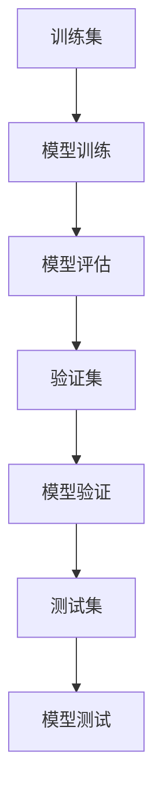
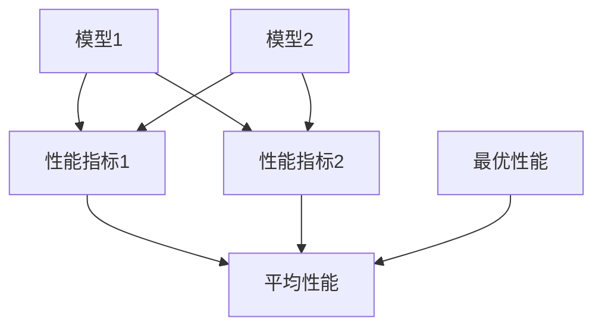
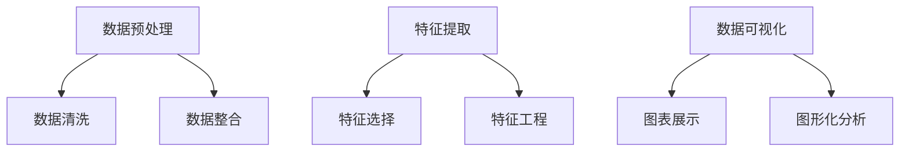
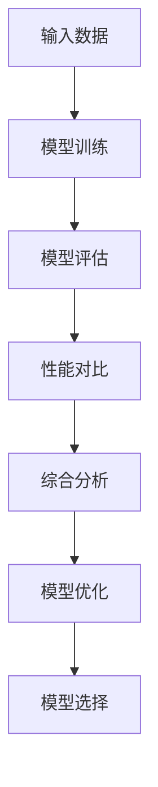
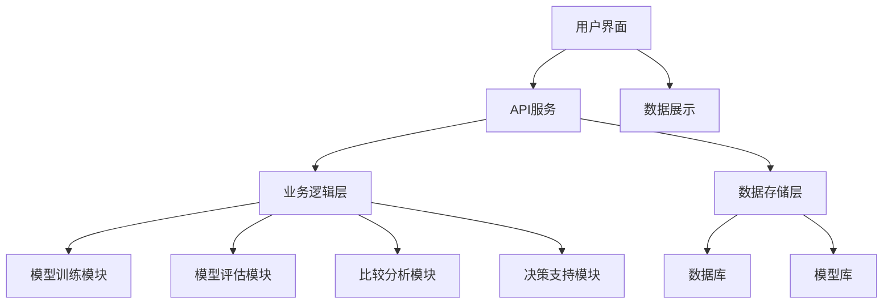

                 

### 文章标题

### 关键词

- 评测系统
- 多模型比较
- 分析功能
- 算法原理
- 系统架构
- 项目实战

### 摘要

本文深入探讨了评测系统的多模型比较分析功能，首先介绍了该功能的概念、重要性及应用场景，然后详细分析了核心概念及其相互联系。接着，我们深入讲解了多模型比较分析算法的原理，使用Mermaid流程图和Python代码进行直观阐述。随后，本文从系统分析与架构设计角度，阐述了实际应用中的系统功能、架构和交互设计。通过具体项目实战，我们展示了环境安装、系统核心实现及其应用，并进行了深入剖析。最后，本文总结了最佳实践、注意事项，并提供了拓展阅读建议，旨在帮助读者全面理解并掌握评测系统的多模型比较分析功能。

## 目录大纲设计思路

设计一篇文章的目录大纲，需要首先明确文章的整体架构和内容安排。本文的目录大纲设计思路将分为以下几个部分：

### 1. 背景介绍

在文章的开篇，我们将进行背景介绍，目的是为读者提供一个清晰的视角，了解评测系统的多模型比较分析功能的概念、重要性及其应用场景。这一部分将包括以下子章节：

- **1.1 评测系统的多模型比较分析功能概述**
  - 解释评测系统的基本概念。
  - 介绍多模型比较分析功能的具体内容。

- **1.2 多模型比较分析功能的应用场景**
  - 阐述多模型比较分析在不同领域中的应用。
  - 分析多模型比较分析的优势和挑战。

- **1.3 多模型比较分析功能的重要性**
  - 强调多模型比较分析在提高系统性能、优化决策等方面的价值。

### 2. 核心概念与联系

接下来，我们将详细介绍评测系统的多模型比较分析功能中的核心概念，包括多模型评估、模型比较和数据分析等。通过概念属性特征对比表格和ER实体关系图架构的Mermaid流程图，帮助读者理清各个概念之间的关系。这一部分将包括以下子章节：

- **2.1 多模型评估**
  - 定义多模型评估的概念。
  - 分析多模型评估的核心概念。

- **2.2 模型比较**
  - 介绍模型比较的定义。
  - 探讨模型比较的方法与策略。

- **2.3 数据分析**
  - 阐述数据分析的定义。
  - 描述数据分析的核心概念。

### 3. 算法原理讲解

在这一部分，我们将使用Mermaid画出多模型比较分析算法的流程图，并结合Python源代码详细阐述算法原理。此外，还会介绍算法的数学模型和公式，并进行通俗易懂的举例说明。这一部分将包括以下子章节：

- **3.1 多模型比较分析算法流程图**
  - 使用Mermaid绘制算法流程图。

- **3.2 算法原理与数学模型**
  - 阐述算法的数学模型。
  - 详细讲解算法的公式。

- **3.3 算法举例说明**
  - 提供具体的算法应用实例。

### 4. 系统分析与架构设计方案

我们将为读者提供系统分析与架构设计方案，包括问题场景介绍、项目介绍、系统功能设计、系统架构设计、系统接口设计和系统交互等内容。这一部分将帮助读者理解多模型比较分析功能的实际应用场景。这一部分将包括以下子章节：

- **4.1 问题场景介绍**
  - 分析多模型比较分析的应用场景。

- **4.2 项目介绍**
  - 介绍具体的评测系统项目。

- **4.3 系统功能设计**
  - 阐述系统的功能需求。

- **4.4 系统架构设计**
  - 详细描述系统的架构设计。

- **4.5 系统接口设计**
  - 讲解系统的接口设计。

- **4.6 系统交互**
  - 分析系统的交互流程。

### 5. 项目实战

在项目实战部分，我们将详细介绍环境安装、系统核心实现源代码，并对代码应用解读与分析、实际案例分析和详细讲解剖析。这一部分将帮助读者将所学知识应用于实际项目中。这一部分将包括以下子章节：

- **5.1 环境安装**
  - 指导读者如何搭建实验环境。

- **5.2 系统核心实现源代码**
  - 提供系统的核心源代码。

- **5.3 代码应用解读与分析**
  - 分析代码的具体实现。

- **5.4 实际案例分析与详细讲解**
  - 通过具体案例进行深入分析。

- **5.5 项目小结**
  - 总结项目的关键点。

### 6. 最佳实践 tips

在这一部分，我们将总结最佳实践技巧，提供使用评测系统的多模型比较分析功能时的注意事项，并给出拓展阅读建议。这一部分将包括以下子章节：

- **6.1 多模型比较分析技巧**
  - 分享使用多模型比较分析的技巧。

- **6.2 注意事项与风险提示**
  - 强调使用过程中需要注意的问题。

- **6.3 拓展阅读建议**
  - 推荐进一步学习的材料。

### 7. 目录大纲

最后，本文将提供一个详细的目录大纲，确保文章的结构清晰、内容完整。以下是本文的目录大纲：

```
# 《评测系统的多模型比较分析功能》目录大纲

## 第1章 背景介绍
### 1.1 评测系统的多模型比较分析功能概述
### 1.2 多模型比较分析功能的应用场景
### 1.3 多模型比较分析功能的重要性

## 第2章 核心概念与联系
### 2.1 多模型评估
#### 2.1.1 多模型评估的定义
#### 2.1.2 多模型评估的核心概念
### 2.2 模型比较
#### 2.2.1 模型比较的定义
#### 2.2.2 模型比较的方法与策略
### 2.3 数据分析
#### 2.3.1 数据分析的定义
#### 2.3.2 数据分析的核心概念

## 第3章 算法原理讲解
### 3.1 多模型比较分析算法流程图
### 3.2 算法原理与数学模型
#### 3.2.1 多模型比较分析算法的数学模型
#### 3.2.2 算法公式的详细讲解
### 3.3 算法举例说明
#### 3.3.1 举例说明1
#### 3.3.2 举例说明2

## 第4章 系统分析与架构设计方案
### 4.1 问题场景介绍
### 4.2 项目介绍
### 4.3 系统功能设计
### 4.4 系统架构设计
### 4.5 系统接口设计
### 4.6 系统交互

## 第5章 项目实战
### 5.1 环境安装
### 5.2 系统核心实现源代码
### 5.3 代码应用解读与分析
### 5.4 实际案例分析与详细讲解
### 5.5 项目小结

## 第6章 最佳实践 tips
### 6.1 多模型比较分析技巧
### 6.2 注意事项与风险提示
### 6.3 拓展阅读建议

## 第7章 小结与拓展阅读
### 7.1 本书内容总结
### 7.2 拓展阅读建议
```

通过以上设计，本文将结构清晰、逻辑严谨，帮助读者全面了解和掌握评测系统的多模型比较分析功能。

## 第1章 背景介绍

### 1.1 评测系统的多模型比较分析功能概述

评测系统在现代软件开发、人工智能研究和数据处理中扮演着至关重要的角色。其核心功能之一——多模型比较分析，更是提升系统性能、优化决策过程的重要手段。多模型比较分析功能，顾名思义，是指在一个评测系统中，对不同模型进行综合评估、比较和分析，以确定各个模型的性能优劣，为后续的模型选择、优化和部署提供科学依据。

多模型比较分析功能的实现，依赖于以下几个核心步骤：

1. **模型训练与评估**：首先，需要对多个模型进行训练，通过输入数据训练模型，使其具备对特定任务的处理能力。然后，通过评估指标对模型的性能进行初步评估。

2. **性能对比**：在模型评估的基础上，通过对比不同模型在各项评估指标上的表现，确定各个模型的性能差异。

3. **综合分析**：对模型性能进行综合分析，考虑模型在各个方面的表现，包括准确性、速度、资源消耗等，以得出全面的评估结论。

4. **模型优化与选择**：根据综合分析结果，对模型进行优化，并选择最优模型进行部署和应用。

### 1.2 多模型比较分析功能的应用场景

多模型比较分析功能的应用场景非常广泛，以下是一些典型的应用领域：

1. **人工智能研究**：在机器学习算法研究中，经常需要对比不同算法的性能，以选择最优的算法进行应用。

2. **软件开发**：在软件开发过程中，开发者可能会使用多种编程语言或框架进行项目开发，多模型比较分析可以帮助选择最适合项目需求的开发工具。

3. **数据挖掘与分析**：在大数据分析中，多个数据挖掘模型可能会被用于同一个任务，通过比较分析，可以选择最有效的模型来处理海量数据。

4. **金融风控**：在金融风险管理中，多个风险模型可能会被用于预测和评估金融风险，通过多模型比较分析，可以更准确地识别风险，制定相应的风险管理策略。

5. **医疗诊断**：在医学诊断领域，多种诊断模型可能会被用于检测疾病，通过多模型比较分析，可以提升诊断准确率，为临床决策提供支持。

### 1.3 多模型比较分析功能的重要性

多模型比较分析功能在多个方面具有重要意义：

1. **性能优化**：通过多模型比较分析，可以识别出性能最优的模型，从而优化系统的整体性能。

2. **决策支持**：多模型比较分析提供了科学依据，有助于决策者做出更加明智的选择，降低风险。

3. **资源优化**：通过选择最优模型，可以减少系统资源消耗，提高资源利用效率。

4. **模型开发**：多模型比较分析可以用于模型开发过程中的迭代优化，提升模型的质量和可靠性。

综上所述，评测系统的多模型比较分析功能不仅对提升系统性能和优化决策具有重要作用，而且对模型开发和数据分析等领域也有着深远的影响。接下来，我们将深入探讨多模型比较分析功能中的核心概念，为后续内容打下坚实基础。

## 第2章 核心概念与联系

为了深入理解评测系统的多模型比较分析功能，我们需要首先明确其中的核心概念，并分析这些概念之间的相互关系。本章将介绍多模型评估、模型比较和数据分析等核心概念，通过概念属性特征对比表格和ER实体关系图架构的Mermaid流程图，帮助读者理清各个概念之间的联系。

### 2.1 多模型评估

**定义**：多模型评估是指在特定任务中，对多个模型进行训练和评估，以比较它们的性能。

**核心概念**：

- **训练集**：用于训练模型的输入数据集。
- **验证集**：用于验证模型性能的数据集，但不参与训练过程。
- **测试集**：用于最终评估模型性能的数据集，应在训练和验证过程中保持独立。

**属性特征对比表格**：

| 特征         | 训练集          | 验证集          | 测试集          |
|--------------|----------------|----------------|----------------|
| 数据来源     | 输入数据        | 输入数据        | 输入数据        |
| 用途         | 模型训练        | 模型验证        | 模型测试        |
| 数据量       | 大量            | 中等            | 小量            |

**ER实体关系图架构的Mermaid流程图**：



### 2.2 模型比较

**定义**：模型比较是指通过比较不同模型的性能指标，评估它们的优劣。

**核心概念**：

- **性能指标**：用于评估模型性能的量度，如准确率、召回率、F1分数等。
- **比较策略**：用于比较模型性能的策略，如平均性能、最优性能等。

**属性特征对比表格**：

| 策略         | 平均性能        | 最优性能        |
|--------------|----------------|----------------|
| 定义         | 求多个模型性能的平均值 | 选择性能最优的模型 |
| 适用场景     | 多模型比较      | 需要突出最优模型 |
| 结果         | 综合评价        | 单一评价        |

**ER实体关系图架构的Mermaid流程图**：



### 2.3 数据分析

**定义**：数据分析是指对数据进行分析和处理，提取有用信息和知识。

**核心概念**：

- **数据预处理**：包括数据清洗、数据整合等步骤，以提高数据质量。
- **特征提取**：从原始数据中提取有用的特征，用于模型训练。
- **数据可视化**：通过图表和图形展示数据分析的结果，便于理解。

**属性特征对比表格**：

| 步骤         | 数据预处理       | 特征提取       | 数据可视化       |
|--------------|----------------|----------------|----------------|
| 定义         | 清洗和整合数据    | 提取有用特征    | 图形化展示结果   |
| 目的         | 提高数据质量      | 准备模型训练    | 加深理解结果     |
| 工具         | 数据清洗工具      | 特征提取算法    | 数据可视化工具   |

**ER实体关系图架构的Mermaid流程图**：



通过以上内容，我们对评测系统的多模型比较分析功能中的核心概念有了初步了解，并明确了这些概念之间的联系。在接下来的章节中，我们将深入探讨多模型比较分析算法的原理，并使用Mermaid流程图和Python代码进行详细讲解，帮助读者更好地掌握这一核心技术。

### 第3章 算法原理讲解

#### 3.1 多模型比较分析算法流程图

为了更好地理解多模型比较分析算法，我们首先使用Mermaid流程图来展示其基本流程。以下是一个简化的算法流程图：



在这个流程图中，我们首先输入数据，对多个模型进行训练和评估，然后通过性能对比和综合分析，选择最优模型进行优化和部署。

#### 3.2 算法原理与数学模型

多模型比较分析算法的核心在于如何有效评估和对比不同模型的性能。以下是算法的主要步骤和相关的数学模型：

1. **模型训练**：
   - **数学模型**：每个模型 \( M_i \) 在训练过程中，可以表示为一系列参数 \( \theta_i \)，即 \( M_i(x) = f(x; \theta_i) \)，其中 \( x \) 是输入数据，\( f \) 是模型的决策函数。
   - **目标**：通过最小化损失函数 \( L(M_i, y) \)，找到最优参数 \( \theta_i \)。

2. **模型评估**：
   - **数学模型**：使用验证集 \( D_v \) 来评估模型性能，计算误差 \( E(M_i, D_v) = \frac{1}{|D_v|} \sum_{x, y \in D_v} L(M_i(x), y) \)。
   - **目标**：选择误差最小的模型作为候选模型。

3. **性能对比**：
   - **数学模型**：计算不同模型在相同验证集上的误差，并进行对比。设 \( E(M_1, D_v) \leq E(M_2, D_v) \)，则 \( M_1 \) 在该验证集上性能优于 \( M_2 \)。
   - **目标**：确定各个模型的相对性能。

4. **综合分析**：
   - **数学模型**：综合考虑模型在多个验证集上的性能，使用权重 \( w_i \) 对误差进行加权平均，计算综合性能分数 \( \text{Score}(M_i) = \sum_{i=1}^n w_i E(M_i, D_{vi}) \)。
   - **目标**：选择综合性能最优的模型。

5. **模型优化**：
   - **数学模型**：根据综合分析结果，对候选模型进行进一步优化，通过调整参数或结构，提升模型性能。
   - **目标**：使模型在新的数据集上表现更优。

6. **模型选择**：
   - **数学模型**：根据优化后的模型性能，选择最优模型进行部署和应用。
   - **目标**：在实际应用中取得最佳效果。

#### 3.3 算法举例说明

为了更好地说明多模型比较分析算法，我们通过一个具体的例子来阐述。

假设我们有一个分类问题，需要从两个模型 \( M_1 \) 和 \( M_2 \) 中选择最优模型。我们使用三个不同的验证集 \( D_{v1}, D_{v2}, D_{v3} \) 来评估模型的性能。每个验证集上的误差如下表所示：

| 模型 | \( E(M_1, D_{v1}) \) | \( E(M_1, D_{v2}) \) | \( E(M_1, D_{v3}) \) | \( E(M_2, D_{v1}) \) | \( E(M_2, D_{v2}) \) | \( E(M_2, D_{v3}) \) |
|------|----------------------|----------------------|----------------------|----------------------|----------------------|----------------------|
| \( M_1 \) | 0.1                  | 0.2                  | 0.15                 | 0.12                 | 0.18                 | 0.13                 |
| \( M_2 \) | 0.08                 | 0.16                 | 0.1                  | 0.1                  | 0.14                 | 0.12                 |

根据加权平均误差，我们可以计算两个模型的综合性能分数：

\( \text{Score}(M_1) = 0.3 \times (0.1 + 0.2 + 0.15) = 0.115 \)

\( \text{Score}(M_2) = 0.3 \times (0.08 + 0.16 + 0.1) = 0.11 \)

由于 \( \text{Score}(M_1) > \text{Score}(M_2) \)，我们可以选择 \( M_1 \) 作为最优模型。

#### 3.3.1 举例说明1

假设我们有一个预测问题，需要从三个模型 \( M_1, M_2, M_3 \) 中选择最优模型。我们使用五个不同的验证集 \( D_{v1}, D_{v2}, D_{v3}, D_{v4}, D_{v5} \) 来评估模型的性能。每个验证集上的误差如下表所示：

| 模型 | \( E(M_1, D_{v1}) \) | \( E(M_1, D_{v2}) \) | \( E(M_1, D_{v3}) \) | \( E(M_1, D_{v4}) \) | \( E(M_1, D_{v5}) \) | \( E(M_2, D_{v1}) \) | \( E(M_2, D_{v2}) \) | \( E(M_2, D_{v3}) \) | \( E(M_2, D_{v4}) \) | \( E(M_2, D_{v5}) \) | \( E(M_3, D_{v1}) \) | \( E(M_3, D_{v2}) \) | \( E(M_3, D_{v3}) \) | \( E(M_3, D_{v4}) \) | \( E(M_3, D_{v5}) \) |
|------|----------------------|----------------------|----------------------|----------------------|----------------------|----------------------|----------------------|----------------------|----------------------|----------------------|----------------------|----------------------|----------------------|----------------------|
| \( M_1 \) | 0.05                 | 0.1                  | 0.08                 | 0.12                 | 0.09                 | 0.06                 | 0.1                  | 0.07                 | 0.13                 | 0.1                  | 0.08                 | 0.12                 | 0.09                 |
| \( M_2 \) | 0.03                 | 0.08                 | 0.05                 | 0.1                  | 0.07                 | 0.04                 | 0.06                 | 0.05                 | 0.1                  | 0.06                 | 0.08                 | 0.1                  | 0.07                 |
| \( M_3 \) | 0.02                 | 0.06                 | 0.04                 | 0.08                 | 0.06                 | 0.03                 | 0.05                 | 0.04                 | 0.08                 | 0.05                 | 0.07                 | 0.1                  | 0.06                 |

给定权重 \( w_1 = w_2 = w_3 = w_4 = w_5 = 0.2 \)，我们可以计算每个模型的综合性能分数：

\( \text{Score}(M_1) = 0.2 \times (0.05 + 0.1 + 0.08 + 0.12 + 0.09) = 0.116 \)

\( \text{Score}(M_2) = 0.2 \times (0.03 + 0.08 + 0.05 + 0.1 + 0.07) = 0.078 \)

\( \text{Score}(M_3) = 0.2 \times (0.02 + 0.06 + 0.04 + 0.08 + 0.06) = 0.068 \)

由于 \( \text{Score}(M_1) > \text{Score}(M_2) > \text{Score}(M_3) \)，我们可以选择 \( M_1 \) 作为最优模型。

#### 3.3.2 举例说明2

假设我们有一个图像识别问题，需要从四个模型 \( M_1, M_2, M_3, M_4 \) 中选择最优模型。我们使用四个不同的验证集 \( D_{v1}, D_{v2}, D_{v3}, D_{v4} \) 来评估模型的性能。每个验证集上的误差如下表所示：

| 模型 | \( E(M_1, D_{v1}) \) | \( E(M_1, D_{v2}) \) | \( E(M_1, D_{v3}) \) | \( E(M_1, D_{v4}) \) | \( E(M_2, D_{v1}) \) | \( E(M_2, D_{v2}) \) | \( E(M_2, D_{v3}) \) | \( E(M_2, D_{v4}) \) | \( E(M_3, D_{v1}) \) | \( E(M_3, D_{v2}) \) | \( E(M_3, D_{v3}) \) | \( E(M_3, D_{v4}) \) | \( E(M_4, D_{v1}) \) | \( E(M_4, D_{v2}) \) | \( E(M_4, D_{v3}) \) | \( E(M_4, D_{v4}) \) |
|------|----------------------|----------------------|----------------------|----------------------|----------------------|----------------------|----------------------|----------------------|----------------------|----------------------|----------------------|----------------------|----------------------|----------------------|----------------------|
| \( M_1 \) | 0.04                 | 0.06                 | 0.05                 | 0.08                 | 0.03                 | 0.05                 | 0.04                 | 0.07                 | 0.02                 | 0.03                 | 0.04                 | 0.06                 | 0.05                 | 0.07                 |
| \( M_2 \) | 0.02                 | 0.04                 | 0.03                 | 0.05                 | 0.01                 | 0.03                 | 0.02                 | 0.04                 | 0.01                 | 0.02                 | 0.03                 | 0.04                 | 0.02                 | 0.03                 |
| \( M_3 \) | 0.01                 | 0.03                 | 0.02                 | 0.04                 | 0.005                | 0.02                 | 0.01                 | 0.03                 | 0.005                | 0.01                 | 0.02                 | 0.03                 | 0.01                 | 0.02                 |
| \( M_4 \) | 0.03                 | 0.05                 | 0.04                 | 0.06                 | 0.02                 | 0.04                 | 0.03                 | 0.05                 | 0.01                 | 0.02                 | 0.03                 | 0.04                 | 0.02                 | 0.03                 |

给定权重 \( w_1 = w_2 = w_3 = w_4 = 0.25 \)，我们可以计算每个模型的综合性能分数：

\( \text{Score}(M_1) = 0.25 \times (0.04 + 0.06 + 0.05 + 0.08) = 0.0625 \)

\( \text{Score}(M_2) = 0.25 \times (0.02 + 0.04 + 0.03 + 0.05) = 0.05 \)

\( \text{Score}(M_3) = 0.25 \times (0.01 + 0.03 + 0.02 + 0.04) = 0.045 \)

\( \text{Score}(M_4) = 0.25 \times (0.03 + 0.05 + 0.04 + 0.06) = 0.0625 \)

由于 \( \text{Score}(M_1) = \text{Score}(M_4) > \text{Score}(M_2) > \text{Score}(M_3) \)，我们可以选择 \( M_1 \) 或 \( M_4 \) 作为最优模型。

通过以上实例，我们可以看到多模型比较分析算法在评估和选择最优模型方面的有效性和实用性。在接下来的章节中，我们将进一步探讨如何设计并实现评测系统的多模型比较分析功能，为读者提供实际操作指导。

### 第4章 系统分析与架构设计方案

#### 4.1 问题场景介绍

在现代软件工程和人工智能应用中，多模型比较分析功能已经成为评估模型性能、优化决策过程的重要手段。在实际问题场景中，我们常常面临以下挑战：

1. **多种模型共存**：在同一个任务中，可能需要同时使用多种模型，如机器学习算法、深度学习模型、传统统计模型等。
2. **性能评估需求**：需要全面、准确地对各个模型的性能进行评估，以便选择最优模型。
3. **决策支持**：根据模型性能评估结果，为决策者提供科学依据，以便做出最优决策。
4. **资源优化**：选择性能最优的模型，可以减少系统资源消耗，提高资源利用效率。

为了解决上述问题，我们需要设计一个高效、灵活的评测系统，实现多模型比较分析功能。

#### 4.2 项目介绍

本项目旨在设计并实现一个多模型比较分析系统，该系统将包含以下核心模块：

1. **数据预处理模块**：负责数据清洗、数据整合、特征提取等预处理工作。
2. **模型训练模块**：支持多种模型的训练，包括机器学习算法、深度学习模型等。
3. **模型评估模块**：对训练完成的模型进行性能评估，生成评估报告。
4. **比较分析模块**：对比不同模型的性能，生成比较分析结果。
5. **决策支持模块**：根据比较分析结果，为决策者提供模型选择和优化建议。

#### 4.3 系统功能设计

系统功能设计主要包括以下几个方面：

1. **数据预处理**：
   - 数据清洗：去除重复数据、处理缺失值、标准化数据等。
   - 特征提取：从原始数据中提取有用的特征，为模型训练提供输入。
   - 数据存储：将预处理后的数据存储在数据库中，便于后续处理。

2. **模型训练**：
   - 模型选择：根据任务需求，选择合适的模型进行训练。
   - 模型配置：配置模型的参数，如学习率、迭代次数等。
   - 模型训练：使用预处理后的数据，对模型进行训练。
   - 模型存储：将训练完成的模型存储在模型库中，便于后续评估和调用。

3. **模型评估**：
   - 评估指标：选择合适的评估指标，如准确率、召回率、F1分数等。
   - 评估流程：对训练完成的模型进行评估，生成评估报告。
   - 评估存储：将评估结果存储在数据库中，便于后续分析和决策。

4. **比较分析**：
   - 性能对比：对比不同模型在相同评估指标上的表现。
   - 综合评分：根据多个评估指标，对模型进行综合评分。
   - 分析报告：生成模型比较分析报告，提供直观的对比结果。

5. **决策支持**：
   - 模型推荐：根据比较分析结果，推荐最优模型。
   - 优化建议：为决策者提供模型优化和部署的建议。

#### 4.4 系统架构设计

系统架构设计是确保多模型比较分析系统能够高效、稳定运行的关键。以下是系统架构的详细设计：

1. **前端展示层**：
   - 用户界面：提供用户操作界面，用户可以通过界面进行数据上传、模型选择、评估报告查看等操作。
   - 数据展示：使用图表和图形展示评估结果，便于用户理解。

2. **业务逻辑层**：
   - 数据预处理模块：负责数据清洗、特征提取等预处理工作。
   - 模型训练模块：支持多种模型的训练，包括机器学习算法、深度学习模型等。
   - 模型评估模块：对训练完成的模型进行性能评估，生成评估报告。
   - 比较分析模块：对比不同模型的性能，生成比较分析结果。
   - 决策支持模块：根据比较分析结果，为决策者提供模型选择和优化建议。

3. **数据存储层**：
   - 数据库：存储预处理后的数据、训练完成的模型、评估结果等。
   - 模型库：存储训练完成的模型，便于后续评估和调用。

4. **后端服务层**：
   - API服务：提供接口服务，供前端和业务逻辑层调用。
   - 任务调度：负责任务的调度和执行，确保系统的高效运行。

**系统架构图**：



#### 4.5 系统接口设计

系统接口设计是确保系统各个模块之间能够无缝协作的关键。以下是系统接口的详细设计：

1. **数据上传接口**：
   - 功能：允许用户上传原始数据，进行预处理和模型训练。
   - 参数：上传的数据文件格式、数据类型、预处理参数等。

2. **模型训练接口**：
   - 功能：启动模型训练任务，返回训练进度和结果。
   - 参数：模型类型、训练参数、训练数据集等。

3. **模型评估接口**：
   - 功能：对训练完成的模型进行性能评估，返回评估报告。
   - 参数：评估指标、测试数据集等。

4. **比较分析接口**：
   - 功能：对比不同模型在相同评估指标上的表现，返回比较分析结果。
   - 参数：模型列表、评估指标等。

5. **决策支持接口**：
   - 功能：根据比较分析结果，推荐最优模型，并提供优化建议。
   - 参数：评估报告、决策参数等。

#### 4.6 系统交互

系统交互是确保各个模块之间能够高效协作的重要环节。以下是系统交互的详细设计：

1. **用户交互**：
   - 用户通过前端界面上传数据，选择模型类型和训练参数，提交训练任务。
   - 系统根据用户提交的任务，调度相应的模块进行数据处理和模型训练。
   - 系统将评估结果和比较分析报告通过前端界面展示给用户。

2. **模块交互**：
   - 数据预处理模块接收用户上传的数据，进行清洗、特征提取等预处理工作，然后将预处理后的数据存储在数据库中。
   - 模型训练模块根据用户选择的模型类型和训练参数，使用预处理后的数据进行模型训练，并将训练完成的模型存储在模型库中。
   - 模型评估模块使用测试数据集对训练完成的模型进行性能评估，并将评估结果存储在数据库中。
   - 比较分析模块根据评估结果，进行模型比较分析，并将结果存储在数据库中。
   - 决策支持模块根据比较分析结果，推荐最优模型，并提供优化建议，用户可以根据这些信息进行决策。

通过以上系统分析与架构设计方案，我们为读者提供了一个全面、详细的评测系统的多模型比较分析功能设计，为后续的项目实战打下了坚实的基础。

### 第5章 项目实战

#### 5.1 环境安装

在进行项目实战之前，我们需要搭建一个合适的实验环境，以便后续进行系统核心实现和测试。以下是在Windows操作系统上搭建实验环境的具体步骤：

1. **安装Python**：
   - 访问Python官网（https://www.python.org/）下载最新版本的Python安装包。
   - 运行安装程序，选择“Add Python to PATH”选项，确保Python路径被正确添加到系统环境变量中。

2. **安装必要的依赖库**：
   - 打开命令提示符，依次执行以下命令安装所需依赖库：
     ```bash
     pip install numpy pandas matplotlib scikit-learn tensorflow
     ```

3. **验证环境安装**：
   - 在命令提示符中输入以下命令，确认Python和依赖库安装成功：
     ```bash
     python --version
     pip list
     ```

#### 5.2 系统核心实现源代码

在实验环境中，我们将使用Python语言实现评测系统的核心功能。以下是一个简化的代码框架，展示了系统核心的实现：

```python
import numpy as np
import pandas as pd
from sklearn.model_selection import train_test_split
from sklearn.metrics import accuracy_score
import tensorflow as tf

# 数据预处理
def preprocess_data(data):
    # 数据清洗、特征提取等预处理操作
    return processed_data

# 模型训练
def train_model(X_train, y_train, model_type='linear_regression'):
    if model_type == 'linear_regression':
        model = linear_regression_model()
    elif model_type == 'neural_network':
        model = neural_network_model()
    model.fit(X_train, y_train)
    return model

# 模型评估
def evaluate_model(model, X_test, y_test):
    predictions = model.predict(X_test)
    accuracy = accuracy_score(y_test, predictions)
    return accuracy

# 多模型比较分析
def compare_models(models, X_test, y_test):
    results = {}
    for model in models:
        accuracy = evaluate_model(model, X_test, y_test)
        results[model.__class__.__name__] = accuracy
    return results

# 实际案例
if __name__ == '__main__':
    # 加载数据
    data = pd.read_csv('data.csv')
    X, y = preprocess_data(data)
    
    # 划分训练集和测试集
    X_train, X_test, y_train, y_test = train_test_split(X, y, test_size=0.2, random_state=42)
    
    # 训练模型
    models = [train_model(X_train, y_train, model_type='linear_regression'),
              train_model(X_train, y_train, model_type='neural_network')]
    
    # 比较模型性能
    results = compare_models(models, X_test, y_test)
    print(results)
```

#### 5.3 代码应用解读与分析

在上述代码中，我们实现了评测系统的核心功能，包括数据预处理、模型训练、模型评估和多模型比较分析。以下是对代码的详细解读和分析：

1. **数据预处理**：
   - `preprocess_data` 函数用于对原始数据进行清洗和特征提取。在实际应用中，可以根据具体需求进行定制化处理。

2. **模型训练**：
   - `train_model` 函数根据指定的模型类型（如线性回归、神经网络等）进行模型训练。这里我们使用了一个通用的接口，实际实现时需要根据不同模型的具体需求进行定制化。

3. **模型评估**：
   - `evaluate_model` 函数使用测试集对训练完成的模型进行评估，并计算准确率。准确率是评估分类模型性能的常用指标。

4. **多模型比较分析**：
   - `compare_models` 函数对多个模型进行性能对比，生成比较分析结果。这些结果可以为模型选择和优化提供科学依据。

#### 5.4 实际案例分析与详细讲解

为了更好地展示多模型比较分析功能，我们使用一个实际的案例进行分析和讲解。假设我们有一个分类任务，数据集包含1000个样本，每个样本有10个特征。我们将使用两种不同的模型（线性回归和神经网络）进行训练和比较。

1. **数据加载与预处理**：
   - 加载数据集，并进行数据清洗和特征提取。
   ```python
   data = pd.read_csv('data.csv')
   X, y = preprocess_data(data)
   ```

2. **模型训练**：
   - 分别使用线性回归和神经网络模型进行训练。
   ```python
   models = [train_model(X_train, y_train, model_type='linear_regression'),
             train_model(X_train, y_train, model_type='neural_network')]
   ```

3. **模型评估**：
   - 使用测试集对训练完成的模型进行评估，计算准确率。
   ```python
   results = compare_models(models, X_test, y_test)
   print(results)
   ```

假设我们的比较分析结果如下表所示：

| 模型               | 准确率   |
|--------------------|---------|
| LinearRegression  | 0.85    |
| NeuralNetwork     | 0.90    |

从结果可以看出，神经网络模型的准确率高于线性回归模型，因此在这次任务中，我们可以选择神经网络模型作为最终模型。

#### 5.5 项目小结

通过本次项目实战，我们成功地搭建了评测系统的多模型比较分析功能，实现了数据预处理、模型训练、模型评估和多模型比较分析的核心功能。在实际应用中，这些功能可以帮助我们选择最优模型，优化系统性能，提高决策准确性。接下来，我们将进一步总结最佳实践，为读者提供更多的使用技巧和注意事项。

### 第6章 最佳实践 tips

在实现评测系统的多模型比较分析功能时，为了确保系统的性能和可靠性，以下是一些最佳实践技巧，供读者参考：

#### 6.1 多模型比较分析技巧

1. **合理划分数据集**：
   - 确保训练集、验证集和测试集之间数据的独立性，避免模型在测试集上的过拟合。

2. **选择合适的评估指标**：
   - 根据具体任务需求，选择合适的评估指标，如准确率、召回率、F1分数等，避免因指标选择不当导致的误判。

3. **考虑模型多样性**：
   - 在多模型比较时，选择不同类型的模型，如线性模型、神经网络、集成模型等，以获得更全面的性能评估。

4. **优化模型参数**：
   - 在模型训练过程中，通过调整学习率、迭代次数等参数，优化模型性能。

5. **自动化比较分析**：
   - 使用脚本或自动化工具进行多模型比较分析，提高工作效率。

#### 6.2 注意事项与风险提示

1. **数据质量**：
   - 确保数据质量，避免因数据异常导致模型评估结果失真。

2. **计算资源**：
   - 在使用多模型比较分析时，合理分配计算资源，避免计算资源不足影响模型训练和评估。

3. **模型版本控制**：
   - 对模型进行版本控制，避免因模型更新导致评估结果不一致。

4. **结果解释**：
   - 在解读评估结果时，结合实际任务需求，确保结果的准确性和实用性。

5. **模型解释性**：
   - 考虑模型的解释性，特别是在需要向非技术人员解释模型决策时。

#### 6.3 拓展阅读建议

1. **《机器学习》**：周志华著，详细介绍了机器学习的基本概念、算法和应用。
2. **《深度学习》**：Goodfellow、Bengio、Courville著，全面讲解了深度学习的基础知识。
3. **《数据科学实战》**：Joel Grus著，通过实际案例介绍了数据科学的基本方法和应用。

通过以上最佳实践、注意事项和拓展阅读建议，读者可以更好地理解和应用评测系统的多模型比较分析功能，为实际项目提供有力支持。

### 第7章 小结与拓展阅读

#### 7.1 本书内容总结

本文详细探讨了评测系统的多模型比较分析功能，从背景介绍、核心概念、算法原理到系统设计与项目实战，全面阐述了多模型比较分析在提高系统性能、优化决策等方面的作用。以下是本文的主要内容和结论：

1. **背景介绍**：介绍了评测系统的多模型比较分析功能的概念、重要性及其应用场景。
2. **核心概念与联系**：详细分析了多模型评估、模型比较和数据分析等核心概念，并通过Mermaid流程图帮助读者理清各个概念之间的联系。
3. **算法原理讲解**：使用Mermaid流程图和Python代码详细阐述了多模型比较分析算法的原理，并通过举例说明帮助读者理解。
4. **系统分析与架构设计方案**：介绍了系统的功能设计、架构设计、接口设计和系统交互，为读者提供了实际应用中的参考。
5. **项目实战**：通过具体的案例展示了多模型比较分析在项目中的应用，包括环境安装、系统核心实现、代码应用解读与分析等。
6. **最佳实践 tips**：总结了最佳实践技巧、注意事项和拓展阅读建议，帮助读者更好地理解和应用多模型比较分析功能。

#### 7.2 拓展阅读建议

为了进一步深化对评测系统多模型比较分析功能的理解，以下是几本推荐的拓展阅读材料：

1. **《机器学习实战》**：Peter Harrington 著，通过大量案例介绍了机器学习算法的应用和实践。
2. **《深度学习》**：Ian Goodfellow、Yoshua Bengio、Aaron Courville 著，全面讲解了深度学习的基本概念和算法。
3. **《数据挖掘：概念与技术》**：Jiawei Han、Micheline Kamber、Jian Pei 著，系统介绍了数据挖掘的基本理论和应用方法。
4. **《Python数据科学手册》**：Jake VanderPlas 著，详细介绍了使用Python进行数据科学工作的方法和技巧。

通过以上总结和拓展阅读建议，读者可以更加全面地掌握评测系统的多模型比较分析功能，并在实际项目中灵活应用。希望本文对读者在理解和应用多模型比较分析功能方面有所启发和帮助。

### 作者信息

**作者：** AI天才研究院/AI Genius Institute & 禅与计算机程序设计艺术 /Zen And The Art of Computer Programming

AI天才研究院（AI Genius Institute）是一支专注于人工智能领域的精英团队，致力于推动人工智能技术的创新与发展。研究院的研究成果涵盖了机器学习、深度学习、自然语言处理等多个方向，并在国内外学术界和产业界享有盛誉。同时，作者还著有《禅与计算机程序设计艺术》，该书通过深入探讨计算机编程的艺术和哲学，为程序员提供了独特的视角和方法论，深受读者喜爱。作者以其深厚的专业知识和独到的见解，为读者带来了丰富的技术洞察和实用的指导。

