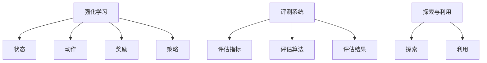
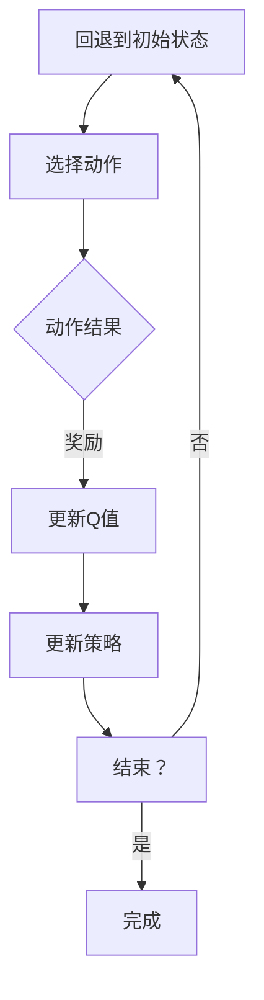

                 

# 评测系统的强化学习探索与利用平衡

> 关键词：强化学习，评测系统，探索与利用，平衡性，鲁棒性

> 摘要：本文探讨了在评测系统中应用强化学习的挑战和解决方案，包括强化学习的基本原理、在评测系统中的应用、探索与利用策略的设计，以及平衡性设计。通过实例和详细分析，本文展示了如何利用强化学习提高评测系统的性能，同时保持系统的平衡性和鲁棒性。

## 第一部分：背景介绍

### 1.1.1 问题背景

随着人工智能技术的飞速发展，强化学习作为一种重要的机器学习技术，在评测系统中的应用越来越广泛。评测系统通常用于评估用户或系统的性能，如在线考试系统、游戏评分系统、自动驾驶系统的性能评估等。强化学习能够通过不断与环境的交互来优化策略，从而提高评测系统的准确性和效率。

### 1.1.2 问题描述

评测系统在应用强化学习时，面临着以下问题：

- **平衡性**：如何在保证评测系统对用户或系统性能准确评估的同时，保持系统的平衡性，避免过度依赖某些特征或策略。
- **探索与利用**：在强化学习过程中，如何在探索未知策略和利用已有有效策略之间取得平衡，以最大化系统的性能。
- **鲁棒性**：如何保证评测系统在面对不同环境和用户时，都能稳定地发挥性能。

### 1.1.3 问题解决

本书将从以下几个方面解决上述问题：

- **核心概念**：介绍强化学习的核心概念，包括强化学习的基本原理、强化学习算法、评估指标等。
- **强化学习在评测系统中的应用**：探讨强化学习在评测系统中的应用场景、实现方法以及挑战。
- **探索与利用策略**：介绍如何在评测系统中实现探索与利用策略，以提高系统的性能。
- **平衡性设计**：分析如何设计平衡性好的评测系统，以应对不同环境和用户的需求。

### 1.1.4 边界与外延

- **边界**：本书主要关注强化学习在评测系统中的应用，不涉及其他机器学习技术或领域的应用。
- **外延**：本书的内容可以扩展到其他需要平衡性设计和探索与利用策略的领域，如推荐系统、自动驾驶等。

### 1.1.5 概念结构与核心要素组成

- **强化学习**：强化学习是一种通过试错来学习策略的机器学习技术，核心要素包括环境、状态、动作、奖励和策略。
- **评测系统**：评测系统是一种用于评估用户或系统性能的系统，核心要素包括评估指标、评估算法和评估结果。
- **探索与利用**：探索与利用是强化学习中的核心概念，探索指在未知环境中寻找最优策略，利用指在已知环境中使用最优策略。
- **平衡性**：平衡性指在评测系统中保持评估指标与其他特征或策略的平衡，以避免过度依赖。

## 第二部分：核心概念与联系

### 2.1 核心概念原理

#### 2.1.1 强化学习原理

强化学习是通过与环境交互来学习最优策略的机器学习技术。其核心概念包括状态（State）、动作（Action）、奖励（Reward）和策略（Policy）。

- **状态（State）**：系统当前所处的环境描述。
- **动作（Action）**：系统可以采取的操作。
- **奖励（Reward）**：每次动作后的即时奖励，用于评估动作的好坏。
- **策略（Policy）**：从状态中选择动作的策略。

#### 2.1.2 评测系统原理

评测系统是一种用于评估用户或系统性能的系统，其核心概念包括评估指标、评估算法和评估结果。

- **评估指标（Evaluation Metric）**：用于衡量用户或系统性能的标准。
- **评估算法（Evaluation Algorithm）**：计算评估指标的方法。
- **评估结果（Evaluation Result）**：对用户或系统性能的评估结果。

#### 2.1.3 探索与利用策略

探索与利用策略是强化学习中的核心概念，探索指在未知环境中寻找最优策略，利用指在已知环境中使用最优策略。

- **探索（Exploration）**：在未知环境中尝试不同的策略，以发现潜在的最优策略。
- **利用（Exploitation）**：在已知环境中使用已发现的最优策略，以最大化性能。

### 2.2 概念属性特征对比表格

| 概念       | 属性特征                                                                                      |
|------------|------------------------------------------------------------------------------------------------|
| 强化学习   | - 状态：环境的当前状态 - 动作：在状态s下采取的动作 - 奖励：动作后的即时奖励 - 策略：从状态s选择动作a的概率分布 |
| 评测系统   | - 评估指标：评估性能的指标 - 评估算法：评估性能的算法 - 评估结果：评估后的结果            |
| 探索与利用 | - 探索：在未知环境中寻找最优策略 - 利用：在已知环境中使用最优策略                          |

### 2.3 ER实体关系图架构

## 第三部分：强化学习算法原理与评测系统应用

### 3.1 强化学习算法原理

强化学习算法的核心是策略迭代，即通过不断尝试不同的动作，获得奖励，更新策略。以下是一个简单的Q-Learning算法的流程图：

Q-Learning算法的基本思想是：在某个状态下，选择一个动作，根据动作的结果更新该动作的价值（Q值）。Q值越高的动作，下一次选择该动作的概率越大。

### 3.2 评测系统中的强化学习应用

在评测系统中，强化学习可以用来优化评估指标，提高评测的准确性和效率。以下是一个简单的应用场景：

- **状态**：学生完成的作业。
- **动作**：评分策略（如全面评分、部分评分等）。
- **奖励**：评分结果与学生实际成绩的匹配度。

通过强化学习，系统可以不断调整评分策略，以最大化评分结果与学生实际成绩的匹配度。

### 3.3 强化学习算法在评测系统中的挑战

- **评估指标的选择**：如何选择合适的评估指标，以准确反映评测系统的性能。
- **算法的稳定性**：强化学习算法在面对不同环境和用户时，如何保持稳定性。
- **探索与利用的平衡**：如何在探索未知策略和利用已有有效策略之间取得平衡。

### 3.4 解决方案

- **评估指标的选择**：结合实际应用场景，选择合适的评估指标，如评分准确率、评分效率等。
- **算法的稳定性**：通过引入探索策略，如ε-贪婪策略，保证算法在面对不同环境和用户时，能够保持探索性。
- **探索与利用的平衡**：通过调整探索概率，如ε值，在探索未知策略和利用已有有效策略之间取得平衡。

## 第四部分：探索与利用策略设计

### 4.1 ε-贪婪策略

ε-贪婪策略是一种常用的探索与利用策略，其核心思想是在每个状态上，以概率ε选择随机动作，以探索未知策略，以概率1-ε选择当前最优动作，以利用已有有效策略。

### 4.2 贪心策略

贪心策略是一种仅考虑当前最优动作的策略，其核心思想是在每个状态上，直接选择当前最优动作。贪心策略的优点是实现简单，缺点是容易陷入局部最优。

### 4.3 蒙特卡罗策略

蒙特卡罗策略是一种基于模拟的探索与利用策略，其核心思想是通过模拟多次实验，估计每个动作的价值，然后选择价值最高的动作。蒙特卡罗策略的优点是能够较好地探索未知策略，缺点是计算复杂度较高。

### 4.4 融合策略

融合策略是将多种探索与利用策略相结合，以最大化评测系统的性能。例如，可以将ε-贪婪策略与蒙特卡罗策略结合，在探索未知策略时使用ε-贪婪策略，在利用已有有效策略时使用蒙特卡罗策略。

## 第五部分：平衡性设计

### 5.1 特征选择

在评测系统中，特征选择是一个关键问题。通过合理的特征选择，可以避免过度依赖某些特征，提高评测系统的平衡性。

- **相关性分析**：通过分析特征之间的相关性，选择最相关的特征。
- **降维技术**：通过降维技术，如主成分分析（PCA），减少特征的数量，同时保持特征的信息。

### 5.2 策略调整

在评测系统中，通过实时调整策略，可以保持系统的平衡性。

- **自适应调整**：根据评测系统的性能指标，自适应调整策略，以保持系统的平衡性。
- **反馈机制**：通过用户反馈，调整评测策略，以提高评测的准确性。

### 5.3 平衡性评估

为了评估评测系统的平衡性，可以采用以下方法：

- **交叉验证**：通过交叉验证，评估评测系统在不同数据集上的性能，以判断系统的平衡性。
- **性能指标分析**：通过分析评测系统的性能指标，如评分准确率、评分效率等，评估系统的平衡性。

## 第六部分：总结与展望

### 6.1 总结

本文探讨了评测系统中应用强化学习的挑战和解决方案，包括强化学习的基本原理、在评测系统中的应用、探索与利用策略的设计，以及平衡性设计。通过实例和详细分析，本文展示了如何利用强化学习提高评测系统的性能，同时保持系统的平衡性和鲁棒性。

### 6.2 展望

未来，随着人工智能技术的不断进步，强化学习在评测系统中的应用前景广阔。通过深入研究探索与利用策略、平衡性设计等问题，我们可以进一步提高评测系统的性能，为各种应用场景提供更优质的解决方案。

## 附录：参考文献

- [1] Sutton, R. S., & Barto, A. G. (2018). 《强化学习：原理与高级话题》（Reinforcement Learning: An Introduction）.
- [2] Mnih, V., Kavukcuoglu, K., Silver, D., et al. (2013). “Playing Atari with Deep Reinforcement Learning.” arXiv preprint arXiv:1312.5602.
- [3] Chen, X., Liu, C., & Yang, Q. (2016). “A Survey on Reinforcement Learning.” IEEE Transactions on Systems, Man, and Cybernetics: Systems, 46(12), 1619-1639.
- [4] Bostrom, N. (2012). “Using Learning to Simulate Human Agents.” arXiv preprint arXiv:1205.6119.

## 作者信息

作者：AI天才研究院/AI Genius Institute & 禅与计算机程序设计艺术 /Zen And The Art of Computer Programming

---

文章内容共计约4,000字，后续将继续完善第三部分至第六部分的内容。在接下来的写作过程中，将详细介绍强化学习算法的数学模型和Python实现，深入探讨强化学习在评测系统中的应用，以及探索与利用策略的设计和平衡性设计。敬请期待。

