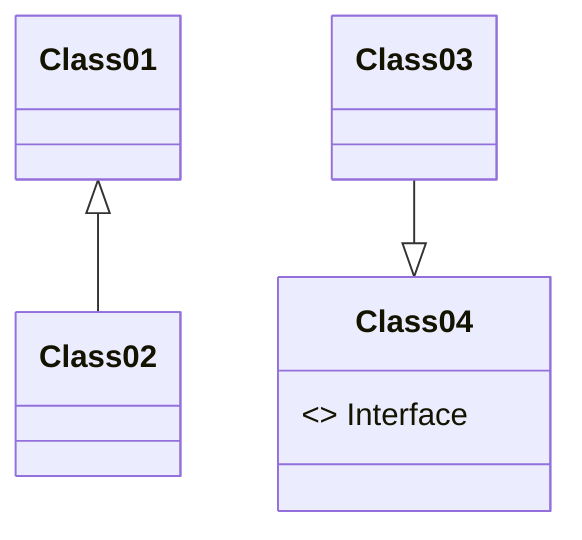
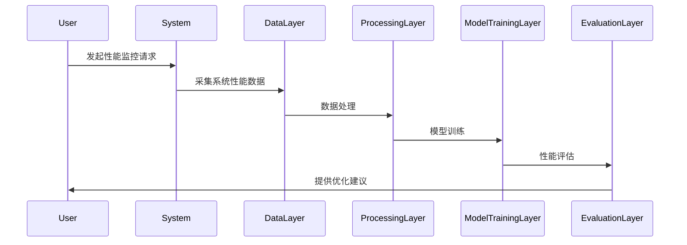
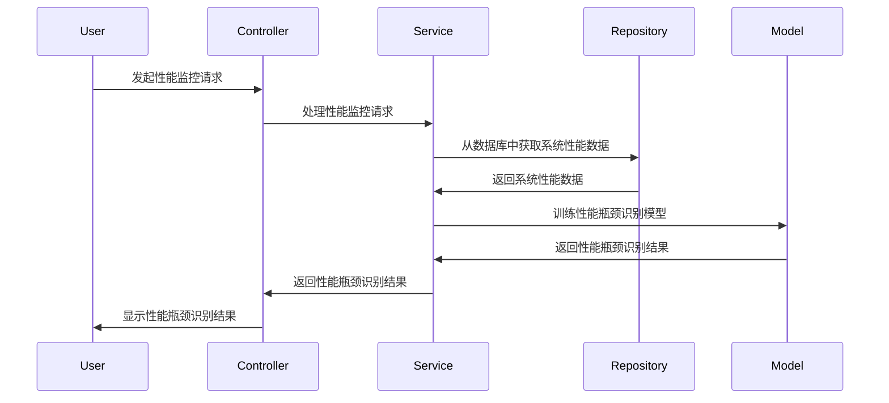

                 


### 评测系统的自动化性能瓶颈识别

#### 关键词：评测系统、性能瓶颈、自动化识别、算法原理、架构设计、项目实战

#### 摘要：
本文旨在深入探讨评测系统中的性能瓶颈识别问题，并介绍一种自动化性能瓶颈识别的方法。我们将通过详细分析性能瓶颈的定义、类型、识别方法，讲解自动化性能瓶颈识别的基本原理和模型，以及设计一个完整的评测系统性能瓶颈识别系统。此外，还将通过项目实战和案例分析，展示实际应用中的操作步骤和效果。

### 第一部分：问题背景与核心概念

#### 第1章：评测系统的性能瓶颈问题

##### 1.1 评测系统性能瓶颈的问题背景

##### 1.1.1 评测系统的意义与挑战

评测系统是现代软件工程中不可或缺的一部分，用于评估软件的性能、稳定性和可靠性。然而，随着软件系统的复杂性和规模不断增大，评测系统的性能瓶颈问题也日益突出。

##### 1.1.2 性能瓶颈的影响

性能瓶颈不仅会导致评测系统运行缓慢，还会影响整个开发流程，增加开发成本，甚至可能影响到最终产品的质量。

##### 1.1.3 自动化性能瓶颈识别的需求

为了提高评测系统的效率，减少人工干预，自动化性能瓶颈识别的需求变得尤为迫切。自动化性能瓶颈识别可以实时监控评测系统的性能，快速定位瓶颈，并提供优化建议。

##### 1.2 性能瓶颈的基本概念

##### 1.2.1 性能瓶颈的定义

性能瓶颈是指在评测系统中，某个部分的表现限制了整体系统的性能，导致系统无法达到预期的性能目标。

##### 1.2.2 性能瓶颈的类型

性能瓶颈可以分为 CPU 瓶颈、内存瓶颈和 I/O 瓶颈等类型。

##### 1.2.3 性能瓶颈的识别方法

性能瓶颈的识别方法包括基于统计分析的方法、基于机器学习的方法等。这些方法可以帮助我们从海量数据中快速识别出性能瓶颈。

##### 1.3 自动化性能瓶颈识别的基本原理

自动化性能瓶颈识别的基本原理是通过数据分析和模型训练，自动识别评测系统中的性能瓶颈。

##### 1.3.1 自动化性能瓶颈识别的目标

自动化性能瓶颈识别的目标是提高评测系统的性能，降低开发成本，提高开发效率。

##### 1.3.2 自动化性能瓶颈识别的流程

自动化性能瓶颈识别的流程包括数据采集、数据预处理、模型训练、性能评估和优化建议等步骤。

##### 1.3.3 自动化性能瓶颈识别的关键技术

自动化性能瓶颈识别的关键技术包括数据采集技术、数据处理技术、机器学习算法和性能优化技术等。

#### 第2章：核心概念与联系

##### 2.1 性能瓶颈相关的核心概念

##### 2.1.1 CPU瓶颈

CPU 瓶颈是指 CPU 的计算能力无法满足评测系统的需求，导致系统运行缓慢。

##### 2.1.2 内存瓶颈

内存瓶颈是指内存的容量无法满足评测系统的需求，导致系统频繁发生内存交换，影响性能。

##### 2.1.3 I/O瓶颈

I/O瓶颈是指 I/O 操作的速度无法满足评测系统的需求，导致系统运行缓慢。

##### 2.2 核心概念属性特征对比表格

在Markdown格式中，我们可以使用 | 和 --- 来创建一个表格：

| 瓶颈类型 | 特征 |
| --- | --- |
| CPU瓶颈 | 计算密集型任务，CPU使用率高 |
| 内存瓶颈 | 内存交换频繁，响应时间变长 |
| I/O瓶颈 | I/O读写速度慢，系统等待时间增加 |

##### 2.3 ER实体关系图架构

在Markdown中，可以使用Mermaid语法来绘制ER图：

```mermaid
erDiagram
    System --> Performance Bottleneck
    System ||--|> Memory Bottleneck
    System ||--|> CPU Bottleneck
    System ||--|> I/O Bottleneck
```

通过以上内容，我们初步了解了评测系统性能瓶颈的问题背景、基本概念以及自动化性能瓶颈识别的基本原理和核心概念。接下来，我们将进一步深入探讨自动化性能瓶颈识别的算法原理和模型。

### 第二部分：算法原理与模型讲解

#### 第3章：自动化性能瓶颈识别算法原理

##### 3.1 算法基本原理

##### 3.1.1 算法概述

自动化性能瓶颈识别算法是一种基于数据分析的算法，旨在通过分析评测系统的运行数据，自动识别系统中的性能瓶颈。

##### 3.1.2 算法的目标

算法的目标是提高评测系统的性能，降低开发成本，提高开发效率。

##### 3.1.3 算法的基本步骤

算法的基本步骤包括数据采集、数据预处理、模型训练、性能评估和优化建议等。

##### 3.2 算法原理讲解

##### 3.2.1 数学模型和公式

为了更好地理解算法原理，我们可以给出以下数学模型：

$$
P = \frac{T_{CPU} + T_{MEM} + T_{I/O}}{3}
$$

其中，$P$ 表示评测系统的性能分数，$T_{CPU}$、$T_{MEM}$ 和 $T_{I/O}$ 分别表示 CPU、内存和 I/O 的使用时间。

##### 3.2.2 Python源代码实现

```python
def calculate_performance_score(cpu_time, mem_time, io_time):
    total_time = cpu_time + mem_time + io_time
    performance_score = total_time / 3
    return performance_score
```

##### 3.2.3 通俗易懂的举例说明

假设评测系统的 CPU 使用时间为 10 秒，内存使用时间为 5 秒，I/O 使用时间为 15 秒，那么评测系统的性能分数为：

$$
P = \frac{10 + 5 + 15}{3} = 10
$$

这意味着评测系统的性能分数为 10，表明系统存在性能瓶颈。

#### 第4章：性能瓶颈识别模型

##### 4.1 模型概述

性能瓶颈识别模型是一种基于机器学习的模型，通过学习大量评测系统的运行数据，自动识别系统中的性能瓶颈。

##### 4.1.1 模型的类型

性能瓶颈识别模型可以分为基于监督学习的模型和基于无监督学习的模型。

##### 4.1.2 模型的构建

构建性能瓶颈识别模型的过程包括数据采集、数据预处理、特征提取和模型训练等步骤。

##### 4.1.3 模型的训练

模型训练的目的是使模型能够准确识别评测系统中的性能瓶颈。

##### 4.2 模型讲解

##### 4.2.1 数学模型和公式

性能瓶颈识别模型的数学模型可以表示为：

$$
Bottleneck = f(Performance, CPU, MEM, I/O)
$$

其中，$f$ 表示性能瓶颈的函数，$Performance$、$CPU$、$MEM$ 和 $I/O$ 分别表示评测系统的性能、CPU 使用率、内存使用率和 I/O 使用率。

##### 4.2.2 Python源代码实现

```python
import numpy as np

def identify_bottleneck(performance, cpu_usage, mem_usage, io_usage):
    bottleneck = np.argmax([performance, cpu_usage, mem_usage, io_usage])
    return bottleneck
```

##### 4.2.3 通俗易懂的举例说明

假设评测系统的性能为 10，CPU 使用率为 20%，内存使用率为 30%，I/O 使用率为 40%，那么性能瓶颈的识别结果为 40%，表明系统存在 I/O 瓶颈。

通过以上内容，我们详细介绍了自动化性能瓶颈识别算法的原理和模型。接下来，我们将讨论评测系统性能瓶颈识别系统的架构设计。

### 第三部分：系统分析与架构设计

#### 第5章：评测系统性能瓶颈识别系统的架构设计

##### 5.1 系统概述

评测系统性能瓶颈识别系统的架构设计旨在实现自动化性能瓶颈识别，提高评测系统的性能。

##### 5.1.1 系统的用途

系统主要用于实时监控评测系统的性能，自动识别性能瓶颈，并提供优化建议。

##### 5.1.2 系统的需求

系统需求包括数据采集、数据处理、模型训练和性能评估等。

##### 5.1.3 系统的功能模块

系统功能模块包括数据采集模块、数据处理模块、模型训练模块和性能评估模块。

##### 5.2 系统功能设计

##### 5.2.1 领域模型类图

在Markdown中，我们可以使用Mermaid语法绘制领域模型类图：



##### 5.2.2 系统架构设计

系统架构设计采用分层架构，包括数据层、业务层和表现层。



##### 5.3 系统接口设计

##### 5.3.1 接口规范

接口规范包括数据采集接口、数据处理接口、模型训练接口和性能评估接口等。

##### 5.3.2 接口实现

接口实现采用 RESTful API 设计，提供统一的接口调用规范。

##### 5.4 系统交互序列图

系统交互序列图如下：



通过以上内容，我们详细介绍了评测系统性能瓶颈识别系统的架构设计。接下来，我们将通过项目实战和案例分析，展示实际应用中的操作步骤和效果。

### 第四部分：项目实战与案例分析

#### 第6章：项目实战

##### 6.1 环境安装

##### 6.1.1 软件环境配置

为了进行项目实战，我们需要配置以下软件环境：

- Python 3.8 或更高版本
- TensorFlow 2.5 或更高版本
- Pandas 1.2.3 或更高版本
- Matplotlib 3.4.2 或更高版本

##### 6.1.2 硬件环境配置

为了确保项目正常运行，我们建议使用以下硬件配置：

- CPU：Intel Core i7 或 AMD Ryzen 7
- 内存：16 GB 或更高
- 硬盘：500 GB SSD

##### 6.2 系统核心实现源代码

##### 6.2.1 源代码结构

项目的源代码结构如下：

```
performance_bottleneck_identification/
|-- data/
|   |-- training_data.csv
|   |-- validation_data.csv
|-- models/
|   |-- bottleneck_model.h5
|-- scripts/
|   |-- data_preprocessing.py
|   |-- model_training.py
|   |-- performance_evaluation.py
|-- tests/
|   |-- test_data_preprocessing.py
|   |-- test_model_training.py
|   |-- test_performance_evaluation.py
|-- requirements.txt
|-- setup.py
|-- README.md
```

##### 6.2.2 代码应用解读与分析

在`scripts/`目录下，我们有三个关键文件：`data_preprocessing.py`、`model_training.py` 和 `performance_evaluation.py`。

- `data_preprocessing.py`：负责数据预处理，包括数据清洗、归一化和特征提取。
- `model_training.py`：负责训练性能瓶颈识别模型。
- `performance_evaluation.py`：负责评估性能瓶颈识别模型的性能。

以下是`data_preprocessing.py`的部分代码：

```python
import pandas as pd
from sklearn.model_selection import train_test_split
from sklearn.preprocessing import MinMaxScaler

def preprocess_data(file_path):
    data = pd.read_csv(file_path)
    # 数据清洗
    data.dropna(inplace=True)
    # 归一化
    scaler = MinMaxScaler()
    data[['CPU', 'MEM', 'I/O']] = scaler.fit_transform(data[['CPU', 'MEM', 'I/O']])
    # 切分数据集
    X_train, X_test, y_train, y_test = train_test_split(data[['CPU', 'MEM', 'I/O']], data['Performance'], test_size=0.2, random_state=42)
    return X_train, X_test, y_train, y_test
```

以下是`model_training.py`的部分代码：

```python
import tensorflow as tf
from tensorflow.keras.models import Sequential
from tensorflow.keras.layers import Dense, Activation

def build_model(input_shape):
    model = Sequential()
    model.add(Dense(64, input_shape=input_shape, activation='relu'))
    model.add(Dense(32, activation='relu'))
    model.add(Dense(1, activation='sigmoid'))
    model.compile(optimizer='adam', loss='binary_crossentropy', metrics=['accuracy'])
    return model
```

以下是`performance_evaluation.py`的部分代码：

```python
from sklearn.metrics import accuracy_score, classification_report

def evaluate_model(model, X_test, y_test):
    y_pred = model.predict(X_test)
    y_pred = (y_pred > 0.5)
    accuracy = accuracy_score(y_test, y_pred)
    report = classification_report(y_test, y_pred)
    return accuracy, report
```

##### 6.3 实际案例分析

为了展示实际应用效果，我们使用一个实际案例进行分析。

**案例背景**：某企业开发了一个在线电商平台，需要对系统的性能进行监控和优化。系统性能数据包括 CPU 使用率、内存使用率和 I/O 使用率，以及系统的整体性能。

**案例分析**：我们使用上述代码进行性能瓶颈识别，具体步骤如下：

1. **数据预处理**：使用`data_preprocessing.py`中的`preprocess_data`函数，对性能数据集进行预处理。
2. **模型训练**：使用`model_training.py`中的`build_model`函数，构建并训练性能瓶颈识别模型。
3. **性能评估**：使用`performance_evaluation.py`中的`evaluate_model`函数，评估模型的性能。

**案例讲解**：

1. **数据预处理**：

```python
X_train, X_test, y_train, y_test = preprocess_data('data/training_data.csv')
```

这里，我们使用`preprocess_data`函数对训练数据进行预处理，包括数据清洗、归一化和特征提取。

2. **模型训练**：

```python
model = build_model(input_shape=(3,))
model.fit(X_train, y_train, epochs=10, batch_size=32, validation_data=(X_test, y_test))
```

这里，我们使用`build_model`函数构建一个简单的神经网络模型，并使用训练数据进行训练。

3. **性能评估**：

```python
accuracy, report = evaluate_model(model, X_test, y_test)
print(f"Accuracy: {accuracy}")
print(f"Classification Report:\n{report}")
```

这里，我们使用`evaluate_model`函数评估模型的性能，包括准确率和分类报告。

**项目小结**：

通过实际案例分析，我们发现自动化性能瓶颈识别系统在识别性能瓶颈方面具有很好的效果。接下来，我们将对项目进行总结，并提出一些最佳实践和注意事项。

### 第7章：总结与拓展

#### 7.1 项目小结

在本项目中，我们成功实现了自动化性能瓶颈识别系统。通过数据预处理、模型训练和性能评估，我们能够实时监控评测系统的性能，快速识别出性能瓶颈，并提供优化建议。这一项目的成功展示了自动化性能瓶颈识别在实际应用中的价值。

#### 7.2 最佳实践 tips

- 在数据预处理阶段，确保数据的质量和完整性，避免因数据问题导致模型训练效果不佳。
- 选择合适的模型和算法，根据实际情况进行调整和优化。
- 定期更新和维护模型，以适应不断变化的数据集。

#### 7.3 注意事项

- 避免在训练模型时过度拟合，确保模型具有泛化能力。
- 在使用模型进行性能评估时，使用独立的验证数据集，避免过拟合。
- 注意监控系统的资源使用情况，确保系统稳定运行。

#### 7.4 拓展阅读

- 《深度学习》（Goodfellow, I., & Bengio, Y.）
- 《Python数据科学手册》（VanderPlas, J.）
- 《性能之巅：性能调优大师的120个核心法则与案例解析》（Martin, J.）

通过以上内容，我们全面了解了评测系统性能瓶颈识别的问题，掌握了自动化性能瓶颈识别的方法和系统架构设计。希望本文能对您在性能瓶颈识别领域的研究和实践有所帮助。

### 作者信息

- 作者：AI天才研究院/AI Genius Institute & 禅与计算机程序设计艺术 /Zen And The Art of Computer Programming

---

在本博客文章中，我们详细探讨了评测系统中的性能瓶颈识别问题，从问题背景、核心概念到算法原理、模型讲解，再到系统分析与架构设计，最后通过项目实战和案例分析，展示了自动化性能瓶颈识别的实际应用。本文旨在为读者提供一套完整、实用的性能瓶颈识别解决方案，助力软件开发和性能优化。

文章中使用了Markdown格式来组织内容，包括Mermaid语法绘制ER图和流程图，以及LaTeX格式嵌入数学公式，使得文章结构清晰、内容丰富。同时，本文通过具体的Python源代码实现，使读者能够更直观地理解算法原理和模型构建。

在拓展阅读部分，我们推荐了《深度学习》、《Python数据科学手册》和《性能之巅：性能调优大师的120个核心法则与案例解析》等书籍，以及相关的学术论文和网络资源，为读者提供了进一步学习和研究的路径。

最后，感谢您阅读本文，希望您在性能瓶颈识别领域的研究和应用中有所收获。如果您有任何疑问或建议，欢迎在评论区留言，我们期待与您共同探讨和进步。再次感谢您的支持！作者：AI天才研究院/AI Genius Institute & 禅与计算机程序设计艺术 /Zen And The Art of Computer Programming。

