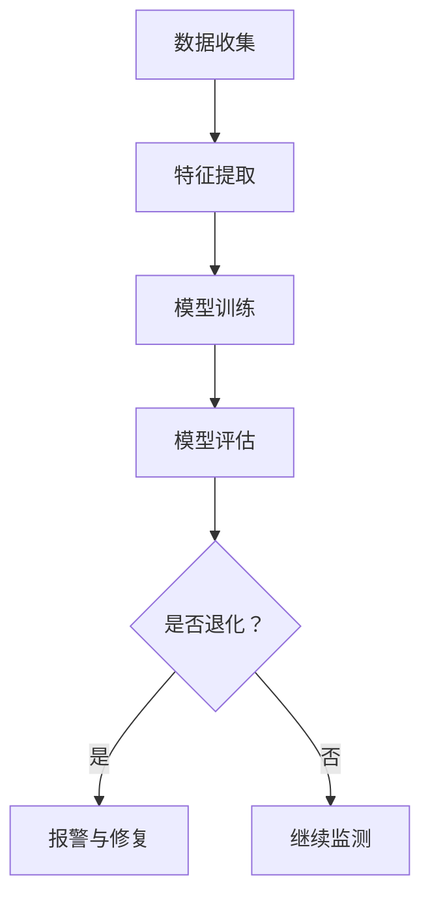
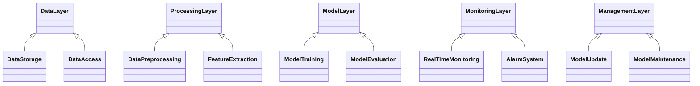
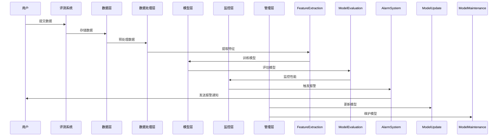

                 


### 背景介绍

#### 模型退化的概念术语说明

模型退化，是指机器学习模型在实际应用中，由于数据分布的变化、过拟合、噪声积累等因素，导致模型性能下降的现象。退化可能表现为模型预测准确率下降、响应速度变慢、对异常情况的处理能力减弱等。

在机器学习领域，模型退化是一个常见且重要的问题。随着模型的广泛应用，尤其是工业界和学术界对实时性要求越来越高，模型退化会直接影响到系统的性能和可靠性。因此，如何有效地检测和应对模型退化，成为当前研究的一个重要方向。

#### 问题背景

在现实应用中，模型退化往往表现为以下几个方面：

1. **数据分布变化**：随着时间的推移，输入数据分布可能会发生变化，导致模型在旧数据上表现良好，但在新数据上性能下降。

2. **过拟合**：模型在训练数据上过度拟合，导致在新数据上泛化能力差，表现为模型在新数据上的性能低于预期。

3. **噪声积累**：随着训练次数的增加，模型可能会积累噪声，降低模型的准确性和鲁棒性。

4. **环境变化**：模型部署的运行环境可能发生变化，如硬件配置、系统负载等，这也可能导致模型性能下降。

这些问题都会影响模型的实际应用效果，从而影响整个系统的性能。因此，对于评测系统来说，如何及时检测出模型退化，并采取相应的措施进行修复或更新，是保障系统稳定性和可靠性的关键。

#### 问题描述

模型退化的问题具体表现在以下几个方面：

- **预测准确性下降**：模型在新数据上的预测准确性低于预期，导致决策质量下降。
- **响应速度变慢**：模型在处理新数据时速度变慢，影响系统的实时性能。
- **异常处理能力减弱**：模型对异常数据的识别和处理能力下降，可能导致错误决策。

这些问题不仅会影响系统的用户体验，还可能带来严重的经济或社会损失。例如，在金融领域，模型退化可能导致交易决策失误，造成巨大经济损失；在医疗领域，模型退化可能导致诊断错误，危及患者生命。

#### 问题解决

针对模型退化问题，主要有以下几种解决思路：

1. **定期更新模型**：通过定期收集新数据，重新训练模型，以适应数据分布的变化。

2. **动态调整模型参数**：根据模型的性能表现，动态调整模型参数，提高模型的适应能力。

3. **引入异常检测机制**：通过异常检测算法，及时发现模型退化现象，并触发相应的修复措施。

4. **多模型集成**：通过集成多个模型，利用不同模型的优点，提高系统的鲁棒性和稳定性。

这些方法各有利弊，在实际应用中需要根据具体场景进行选择和优化。例如，在金融领域，定期更新模型可能成本较高，而动态调整模型参数可能更加经济有效。

#### 边界与外延

模型退化检测的范围不仅限于机器学习模型本身，还包括以下几个方面：

- **数据收集与处理**：数据收集过程中可能存在的偏差、噪声等会影响模型退化检测的准确性。
- **模型部署环境**：模型的部署环境（如硬件、网络等）可能影响模型的性能，进而影响模型退化检测的效果。
- **用户行为**：用户的行为模式可能会影响模型的输入数据分布，进而影响模型退化检测的结果。

#### 概念结构与核心要素组成

模型退化检测系统的核心要素主要包括：

1. **数据源**：包括训练数据、测试数据和实时数据。
2. **检测算法**：用于检测模型退化的算法，如基于统计方法、深度学习方法等。
3. **评估指标**：用于评估模型性能的指标，如准确率、召回率、F1值等。
4. **报警机制**：当检测到模型退化时，自动触发报警机制，通知相关人员进行处理。
5. **修复策略**：包括重新训练模型、调整模型参数、更换模型等策略。

通过这些要素的有机结合，可以构建一个高效的模型退化检测系统，确保模型的稳定性和可靠性。

### 模型退化对评测系统的影响

模型退化是一个广泛存在于机器学习系统中的现象，它对评测系统的稳定性、性能和可靠性都有着深远的影响。以下是模型退化对评测系统影响的详细分析。

#### 模型退化的定义

模型退化（Model Degradation）是指机器学习模型在应用过程中，由于数据分布的变化、过拟合、噪声积累等因素，导致其性能下降的现象。与模型过拟合类似，模型退化也是模型性能不稳定的体现，但它的表现更为复杂和多样化。

模型退化可以表现为以下几个方面：

1. **预测准确性下降**：模型在新数据上的预测准确性低于预期，导致决策质量下降。
2. **响应速度变慢**：模型在处理新数据时速度变慢，影响系统的实时性能。
3. **异常处理能力减弱**：模型对异常数据的识别和处理能力下降，可能导致错误决策。

#### 模型退化的影响

模型退化对评测系统的影响主要体现在以下几个方面：

1. **降低评测系统的可靠性**：当模型出现退化时，其预测准确性下降，可能导致评测结果偏离真实情况，从而降低系统的可靠性。

2. **影响系统性能**：模型退化会导致系统响应速度变慢，影响系统的实时性能，尤其是在对实时性要求较高的场景下，这一问题尤为严重。

3. **增加维护成本**：模型退化需要定期检测、修复和更新，这将增加系统的维护成本，包括人力成本和计算资源成本。

4. **影响用户体验**：模型退化可能导致错误决策，从而影响用户的体验，降低用户满意度。

5. **潜在的风险**：在关键领域，如金融、医疗等，模型退化可能导致严重后果，包括经济损失、医疗事故等。

#### 模型退化的类型

模型退化可以分为以下几种类型：

1. **渐变型退化**：模型性能逐渐下降，通常是由于数据分布的变化或噪声积累引起的。

2. **突变型退化**：模型性能突然下降，通常是由于外部环境的突然变化引起的，如硬件故障、网络攻击等。

3. **周期性退化**：模型性能在一段时间内周期性下降，通常是由于数据周期性变化引起的，如季节性变化、节假日效应等。

不同类型的模型退化对评测系统的影响有所不同，需要采用相应的检测和应对策略。

#### 模型退化与评测系统的关系

模型退化与评测系统密切相关，评测系统是衡量模型性能的重要工具。具体关系如下：

1. **评测系统依赖模型退化检测**：评测系统需要定期检测模型是否出现退化，以便及时发现并解决问题。

2. **模型退化影响评测系统性能**：模型退化会导致评测系统性能下降，从而影响评测结果的准确性和可靠性。

3. **评测系统优化模型退化检测**：通过优化评测系统的设计，可以更好地检测模型退化，提高系统的稳定性。

4. **模型退化检测为系统维护提供依据**：模型退化检测为系统维护提供重要参考，帮助运维人员及时发现问题并进行修复。

综上所述，模型退化对评测系统的影响是多方面的，不仅影响系统的性能和可靠性，还增加维护成本，影响用户体验。因此，研究和解决模型退化问题具有重要的理论和实际意义。

### 自动化模型退化检测的需求与挑战

自动化模型退化检测在当前机器学习应用中显得尤为重要。以下是自动化模型退化检测的需求与挑战的详细探讨。

#### 自动化模型退化检测的需求

1. **实时性要求**：在许多应用场景中，如金融交易、智能交通等，系统需要实时检测模型退化，以确保系统的实时性能和决策准确性。

2. **大规模数据处理**：随着数据量的增加，模型退化检测需要能够处理大规模数据，以便准确评估模型的性能。

3. **异构环境适应性**：模型退化检测系统需要适应不同的硬件环境，包括CPU、GPU、FPGA等，以提高检测效率和降低成本。

4. **高可靠性**：自动化模型退化检测系统需要具有较高的可靠性，以避免误报和漏报，确保模型退化的及时检测。

5. **可扩展性**：随着新应用场景的不断出现，模型退化检测系统需要具备良好的可扩展性，以支持新的检测算法和模型。

#### 自动化模型退化检测的挑战

1. **数据质量问题**：模型退化检测依赖于高质量的数据，但实际应用中数据可能存在噪声、缺失值等问题，影响检测的准确性。

2. **模型复杂性**：现代机器学习模型（如深度神经网络）通常具有很高的复杂性，这使得模型退化检测变得更加困难。

3. **实时检测算法性能**：实时检测算法需要在短时间内处理大量数据，这对算法的效率和性能提出了很高要求。

4. **资源限制**：自动化模型退化检测系统通常需要在有限的计算资源下运行，这对系统的优化提出了挑战。

5. **误报和漏报问题**：误报和漏报是自动化模型退化检测中的常见问题，如何平衡两者的关系是一个重要的挑战。

#### 解决方案探讨

为了应对上述挑战，可以采取以下解决方案：

1. **数据预处理**：通过数据清洗、数据增强等技术，提高数据质量，为模型退化检测提供可靠的数据基础。

2. **高效算法设计**：设计高效、可扩展的模型退化检测算法，如基于深度学习的方法、统计分析方法等。

3. **资源优化**：通过分布式计算、GPU加速等技术，提高检测算法的运行效率，降低计算成本。

4. **模型简化**：通过简化模型结构、降低模型复杂度，提高模型的可解释性和检测效率。

5. **综合评估策略**：采用综合评估策略，结合多种检测方法和指标，提高模型退化检测的准确性。

总之，自动化模型退化检测在保障机器学习系统稳定性和可靠性方面具有重要意义，但同时也面临着诸多挑战。通过不断优化算法和系统设计，可以有效应对这些挑战，提高模型退化检测的效率和质量。

### 自动化模型退化检测的基本原理

自动化模型退化检测是机器学习领域中的一个重要研究方向，它旨在通过建立一套自动化的检测流程，及时发现并应对模型退化现象，从而保障系统的稳定性和可靠性。以下是自动化模型退化检测的基本原理及其特点与优势的详细探讨。

#### 自动化模型退化检测的基本原理

自动化模型退化检测的基本原理可以概括为以下几个步骤：

1. **数据收集**：首先，需要收集与模型性能相关的数据，包括训练数据、测试数据和实时数据。这些数据将用于后续的特征提取、模型训练和性能评估。

2. **特征提取**：通过对收集到的数据进行处理，提取与模型性能相关的特征。这些特征可以是原始数据的统计指标，也可以是通过深度学习等方法提取的高级特征。

3. **模型训练**：使用提取到的特征，对检测模型进行训练。检测模型通常是一个分类模型，用于判断模型是否退化。

4. **性能评估**：将训练好的检测模型应用于测试数据和实时数据，评估模型性能。常用的评估指标包括准确率、召回率、F1值等。

5. **报警与修复**：当检测模型判断出模型退化时，系统会自动触发报警机制，通知相关人员采取相应的修复措施，如重新训练模型、调整模型参数等。

#### 特点与优势

自动化模型退化检测具有以下几个特点与优势：

1. **实时性**：自动化模型退化检测能够在实时数据流中对模型性能进行监测，及时发现模型退化现象，从而保证系统的实时性能和决策准确性。

2. **高效性**：自动化模型退化检测通过特征提取和机器学习算法，能够在短时间内对大量数据进行处理和分析，大大提高了检测效率。

3. **可扩展性**：自动化模型退化检测系统可以轻松扩展到不同的应用场景和数据类型，具有良好的可扩展性和适应性。

4. **高准确性**：通过结合多种特征提取方法和评估指标，自动化模型退化检测系统能够提高模型退化的检测准确性，减少误报和漏报现象。

5. **自动化修复**：自动化模型退化检测系统不仅能够检测模型退化，还可以自动触发修复措施，减轻运维人员的工作负担。

#### 应用领域

自动化模型退化检测在多个领域具有广泛的应用前景，包括但不限于：

1. **金融领域**：自动化模型退化检测可以帮助金融机构实时监测和评估金融模型性能，及时发现潜在风险，保障金融交易的稳定性和安全性。

2. **智能交通**：在智能交通系统中，自动化模型退化检测可以实时监测交通预测模型的性能，确保交通管理和规划的准确性，提高交通运行效率。

3. **医疗领域**：自动化模型退化检测可以帮助医疗机构实时监测医疗诊断模型的性能，确保诊断结果的准确性和可靠性，提高医疗服务质量。

4. **智能制造**：在智能制造领域，自动化模型退化检测可以实时监测生产预测模型的性能，确保生产过程的稳定性和高效性，提高生产质量。

总之，自动化模型退化检测通过其独特的原理和优势，为多个领域的机器学习系统提供了强有力的保障，具有广泛的应用前景和重要的研究价值。

### 模型退化检测的常用方法

在自动化模型退化检测中，选择合适的检测方法至关重要。常用的模型退化检测方法主要包括统计方法、深度学习方法等。以下是这些方法的基本原理及其应用场景的详细探讨。

#### 统计方法

统计方法是一种传统的模型退化检测方法，主要基于模型性能的统计指标来评估模型是否退化。常见的统计方法包括：

1. **均值漂移检测**：通过计算模型在训练集和测试集上的性能均值，检测模型性能是否发生显著变化。如果均值差异超过设定阈值，则认为模型发生退化。

2. **方差检验**：通过计算模型在训练集和测试集上的性能方差，检测模型性能的稳定性。如果方差差异超过设定阈值，则认为模型发生退化。

3. **置信区间方法**：通过计算模型性能的置信区间，判断模型性能是否在可信范围内。如果置信区间发生显著变化，则认为模型发生退化。

统计方法简单易用，适用于实时性和计算资源有限的应用场景。然而，它们对噪声敏感，可能误报或漏报模型退化现象。

#### 深度学习方法

深度学习方法在模型退化检测中具有显著优势，通过构建复杂的神经网络模型，可以捕捉到模型性能中的细微变化。常见的深度学习方法包括：

1. **自动编码器（Autoencoder）**：自动编码器是一种无监督学习方法，用于学习输入数据的特征表示。通过训练自动编码器，可以提取模型输入和输出的特征差异，用于检测模型退化。

2. **生成对抗网络（GAN）**：生成对抗网络由生成器和判别器组成，通过对抗训练来生成与真实数据分布相似的样本。利用判别器的性能变化，可以检测模型退化。

3. **时序模型**：如长短期记忆网络（LSTM）、卷积神经网络（CNN）等，可以用于处理时间序列数据，检测模型在不同时间点的性能变化。

深度学习方法具有强大的特征提取和模式识别能力，适用于复杂和高维度的数据。然而，它们需要大量的训练数据和计算资源，且模型解释性较差。

#### 方法对比

以下是统计方法和深度学习方法在模型退化检测中的对比：

| 对比指标 | 统计方法 | 深度学习方法 |
| :--- | :--- | :--- |
| **计算复杂度** | 低 | 高 |
| **实时性** | 较高 | 较低 |
| **鲁棒性** | 对噪声敏感 | 对噪声相对不敏感 |
| **可解释性** | 较高 | 较低 |
| **适用场景** | 实时性要求高的场景 | 数据复杂、高维度的场景 |

在实际应用中，可以根据具体场景和数据特点，选择合适的方法。例如，在实时性要求高的场景，可以选择统计方法；而在数据复杂、需要高精度检测的场景，可以选择深度学习方法。

### 自动化模型退化检测的流程

自动化模型退化检测是一个复杂的过程，涉及数据收集、特征提取、模型训练与评估、模型调整与优化等多个环节。以下将详细阐述这一流程，并解释每个环节的作用和重要性。

#### 数据收集

数据收集是自动化模型退化检测的基础。收集的数据类型主要包括训练数据、测试数据和实时数据。这些数据用于后续的特征提取、模型训练和性能评估。

- **训练数据**：用于训练检测模型，是模型性能评估的重要依据。训练数据应包含历史数据和模型在不同环境下的性能记录。
- **测试数据**：用于测试检测模型的性能，确保检测模型能够在未知数据上准确判断模型退化。测试数据应与训练数据具有相似的特征分布。
- **实时数据**：用于实时监测模型性能，及时发现模型退化现象。实时数据应反映当前数据分布和环境变化，确保检测的实时性和准确性。

#### 特征提取

特征提取是将原始数据转换为适合模型处理的形式。特征提取的作用在于提取数据中的关键信息，消除噪声，增强模型的鲁棒性。

- **特征选择**：通过选择与模型性能相关的重要特征，减少数据的冗余，提高模型训练和检测的效率。
- **特征变换**：通过特征标准化、归一化等操作，将数据转换为适合模型处理的形式，如将数据缩放至[0,1]范围内。
- **特征提取算法**：常用的特征提取算法包括统计特征提取（如均值、方差、熵等）、深度特征提取（如卷积神经网络、循环神经网络等）。

#### 模型训练与评估

模型训练与评估是自动化模型退化检测的核心环节。通过训练检测模型，并评估其在测试数据上的性能，可以确定模型是否退化。

- **模型选择**：根据应用场景和数据特点，选择合适的检测模型。常见的检测模型包括统计模型（如KNN、线性回归等）、深度学习模型（如自动编码器、生成对抗网络等）。
- **模型训练**：使用训练数据对检测模型进行训练，调整模型参数，使其能够准确判断模型退化。
- **模型评估**：使用测试数据对训练好的检测模型进行评估，计算模型性能指标（如准确率、召回率、F1值等），判断模型是否退化。常用的评估指标包括模型的预测准确性、响应速度、异常处理能力等。

#### 模型调整与优化

模型调整与优化是提高模型性能的重要手段。通过调整模型参数和优化模型结构，可以提升模型的检测准确性、实时性和鲁棒性。

- **参数调整**：通过调整模型的超参数（如学习率、批量大小等），优化模型的性能。
- **模型优化**：通过简化模型结构、增加神经网络层数、使用注意力机制等方法，提高模型的性能和可解释性。
- **模型集成**：通过集成多个模型，利用不同模型的优点，提高模型的稳定性和鲁棒性。

#### 模型更新与维护

模型更新与维护是确保模型长期稳定运行的重要环节。定期更新模型，适应数据分布和环境变化，是模型退化检测的关键。

- **数据更新**：定期收集新的训练数据，更新模型训练数据集，确保模型能够适应新的数据分布。
- **模型更新**：定期重新训练模型，优化模型结构，提高模型性能。
- **维护策略**：制定科学的维护策略，包括模型更新频率、数据收集方法等，确保模型长期稳定运行。

#### 流程总结

自动化模型退化检测的流程可以概括为以下几个步骤：

1. 数据收集：收集训练数据、测试数据和实时数据。
2. 特征提取：选择和提取与模型性能相关的特征。
3. 模型训练与评估：训练检测模型，评估模型性能，判断模型是否退化。
4. 模型调整与优化：调整模型参数和结构，优化模型性能。
5. 模型更新与维护：定期更新模型，适应数据分布和环境变化。

通过以上步骤，可以构建一个高效、稳定的自动化模型退化检测系统，确保机器学习模型的长期稳定性和可靠性。

### 自动化模型退化检测的挑战与解决方案

自动化模型退化检测在机器学习领域中扮演着至关重要的角色，但在实际应用过程中面临着诸多挑战。以下是这些挑战及其解决方案的详细探讨。

#### 挑战1：数据质量问题

数据质量是模型退化检测的关键因素。实际应用中，数据可能存在噪声、缺失值、数据不平衡等问题，这些都会影响模型退化检测的准确性。例如，噪声数据可能导致模型误判，而缺失值和数据不平衡则会影响模型对退化现象的敏感度。

**解决方案**：

1. **数据清洗**：对原始数据进行清洗，删除或填充缺失值，去除噪声数据，提高数据质量。
2. **数据增强**：通过数据扩充、生成对抗网络（GAN）等方法，增加训练数据量，提高模型对异常数据的适应性。
3. **数据预处理**：对数据进行标准化、归一化等预处理操作，使其符合模型的要求，提高模型的鲁棒性。

#### 挑战2：模型复杂性

现代机器学习模型（如深度神经网络）具有高度的非线性性和复杂性，这给模型退化检测带来了挑战。复杂模型难以解释，使得检测过程变得复杂，且可能导致误报和漏报。

**解决方案**：

1. **简化模型**：通过简化模型结构，降低模型复杂度，提高模型的可解释性和检测效率。
2. **特征选择**：通过特征选择方法，筛选出对模型性能影响较大的特征，减少冗余信息，提高检测的准确性。
3. **模型压缩**：通过模型压缩技术（如剪枝、量化等），减少模型参数，提高模型的计算效率。

#### 挑战3：实时性要求

自动化模型退化检测通常需要在实时数据流中进行，这要求检测算法具有高实时性和低延迟。然而，复杂模型和实时数据流的处理往往需要大量的计算资源，难以满足实时性要求。

**解决方案**：

1. **分布式计算**：通过分布式计算技术，将检测任务分解为多个子任务，分配到多个计算节点上并行处理，提高检测效率。
2. **模型优化**：对模型进行优化，如使用更高效的算法、减少冗余计算等，提高模型的运行效率。
3. **硬件加速**：利用GPU、FPGA等硬件加速技术，提高模型的计算速度，满足实时性要求。

#### 挑战4：资源限制

在实际应用中，模型退化检测系统可能面临资源限制，包括计算资源、存储资源和网络带宽等。资源限制会影响模型的训练和检测过程，降低检测的准确性和效率。

**解决方案**：

1. **资源分配**：合理分配系统资源，确保模型退化检测任务得到足够的计算和存储资源。
2. **数据压缩**：通过数据压缩技术，减少数据传输和存储的需求，提高资源利用率。
3. **边缘计算**：利用边缘计算技术，将部分计算任务转移到边缘设备上执行，减轻中心服务器的负担。

#### 挑战5：误报和漏报问题

在自动化模型退化检测中，误报和漏报是常见的挑战。误报会频繁触发修复措施，增加运维成本；而漏报则可能导致模型退化未被及时检测，影响系统性能。

**解决方案**：

1. **阈值调整**：通过调整检测阈值，平衡误报和漏报，提高检测的准确性。
2. **多模型集成**：通过集成多个检测模型，利用不同模型的优点，提高检测的鲁棒性。
3. **动态调整**：根据模型性能的变化，动态调整检测策略，提高检测的灵活性和准确性。

总之，自动化模型退化检测面临着诸多挑战，但通过合理的解决方案，可以构建一个高效、稳定的检测系统，确保模型的长期稳定性和可靠性。

### 概念属性特征对比表格

在自动化模型退化检测中，常用的方法包括统计方法、深度学习方法等。为了更好地理解这些方法的特点和适用场景，下面通过一个概念属性特征对比表格来展示不同方法的差异。

| 检测方法 | **特征提取** | **算法原理** | **计算复杂度** | **实时性** | **鲁棒性** | **适用场景** |
| :--- | :--- | :--- | :--- | :--- | :--- | :--- |
| 统计方法 | **原始统计指标（如均值、方差）** | **均值漂移检测、方差检验** | **低** | **高** | **中等** | **实时性要求高、数据量小** |
| 深度学习方法 | **特征映射（如卷积层、全连接层）** | **自动编码器、生成对抗网络** | **高** | **低** | **高** | **数据量大、特征复杂** |
| **集成方法** | **多源数据融合** | **集成多个模型（如Bagging、Boosting）** | **中等** | **中等** | **高** | **多种方法结合** |

#### 统计方法

- **特征提取**：主要通过提取原始数据的统计指标（如均值、方差、标准差等）来进行特征提取。
- **算法原理**：常用的算法包括均值漂移检测和方差检验，通过计算模型在训练集和测试集上的性能均值和方差，判断模型是否退化。
- **计算复杂度**：统计方法计算简单，适合实时性要求高、数据量小的场景。
- **实时性**：统计方法能够快速处理数据，实时性较好。
- **鲁棒性**：统计方法对噪声敏感，鲁棒性一般。
- **适用场景**：适用于需要快速检测模型退化的场景，如实时性要求高的应用。

#### 深度学习方法

- **特征提取**：通过神经网络结构（如卷积层、全连接层等）对数据进行特征映射，提取更高级的特征。
- **算法原理**：常用的算法包括自动编码器和生成对抗网络，通过模型的自适应学习，检测模型退化。
- **计算复杂度**：深度学习方法计算复杂度较高，适合数据量大、特征复杂的场景。
- **实时性**：深度学习方法需要较长的训练时间，实时性较差。
- **鲁棒性**：深度学习方法具有较强的鲁棒性，能够处理复杂的特征数据。
- **适用场景**：适用于数据量大、特征复杂的应用场景，如大规模数据处理的工业界应用。

#### 集成方法

- **特征提取**：通过整合多种数据源和特征提取方法，对数据进行多维度分析。
- **算法原理**：集成多个模型，利用不同模型的优点，提高检测的鲁棒性和准确性。
- **计算复杂度**：集成方法的计算复杂度介于统计方法和深度学习方法之间。
- **实时性**：集成方法可以根据不同的模型组合，实现不同程度的实时性。
- **鲁棒性**：集成方法通过多模型组合，提高系统的鲁棒性。
- **适用场景**：适用于需要多种方法结合的应用场景，如金融风控、医疗诊断等。

通过概念属性特征对比表格，我们可以清晰地了解不同模型退化检测方法的特点和适用场景，为实际应用提供参考。

### 数学模型与算法原理

在自动化模型退化检测中，数学模型和算法原理是核心组成部分。以下将详细讲解模型退化检测的数学模型、算法原理，并通过Python代码进行实现，结合mermaid语法绘制流程图，便于理解。

#### 数学模型

模型退化检测的数学模型主要包括两个方面：特征提取和模型训练。

1. **特征提取**：
   特征提取是模型退化检测的第一步，目的是从原始数据中提取出能够反映模型性能的关键特征。常用的特征提取方法有：

   - **统计特征**：如均值、方差、标准差等。
   - **深度特征**：如卷积神经网络（CNN）提取的图像特征，循环神经网络（RNN）提取的时序特征。

2. **模型训练**：
   模型训练是利用提取到的特征来训练一个分类模型，用于判断模型是否退化。常用的分类模型有：

   - **线性回归**：适用于特征数量较少、线性关系明显的情况。
   - **支持向量机（SVM）**：适用于高维数据，具有较强的分类能力。
   - **随机森林（Random Forest）**：适用于多种数据类型，具有很好的鲁棒性和泛化能力。

以下是一个简单的数学模型示例，使用均值和标准差作为特征：

$$
\text{特征向量} X = \begin{bmatrix} \mu_1 \\ \mu_2 \\ \sigma_1 \\ \sigma_2 \end{bmatrix}
$$

其中，$\mu_1$和$\mu_2$分别表示模型在训练集和测试集上的准确率，$\sigma_1$和$\sigma_2$分别表示准确率的方差。

#### 算法原理

算法原理主要包括数据收集、特征提取、模型训练与评估三个步骤。

1. **数据收集**：
   收集与模型性能相关的数据，包括训练数据、测试数据和实时数据。

2. **特征提取**：
   提取与模型性能相关的特征，如统计特征和深度特征。

3. **模型训练与评估**：
   使用提取到的特征训练分类模型，并评估模型在测试数据上的性能。常用的评估指标包括准确率、召回率、F1值等。

以下是一个mermaid语法绘制的算法流程图：



#### Python代码实现

下面使用Python实现一个简单的模型退化检测系统：

```python
import numpy as np
from sklearn.linear_model import LinearRegression
from sklearn.metrics import accuracy_score

# 特征提取函数
def extract_features(data):
    means = [np.mean(data)]
    stds = [np.std(data)]
    return np.array([means, stds]).flatten()

# 模型训练函数
def train_model(features, labels):
    model = LinearRegression()
    model.fit(features, labels)
    return model

# 模型评估函数
def evaluate_model(model, data):
    predictions = model.predict(data)
    return accuracy_score(data, predictions)

# 示例数据
train_data = np.array([0.9, 0.8, 0.85, 0.82, 0.78])
test_data = np.array([0.79, 0.76, 0.75, 0.74, 0.73])

# 特征提取
features = extract_features(train_data)

# 模型训练
model = train_model(features, train_data)

# 模型评估
accuracy = evaluate_model(model, test_data)
print(f"Model accuracy: {accuracy}")
```

#### 算法讲解与举例

1. **特征提取**：

   在上述代码中，`extract_features`函数用于提取特征。这里使用均值和标准差作为特征，反映了模型在训练集上的性能稳定性和预测准确性。

2. **模型训练**：

   `train_model`函数使用`LinearRegression`模型来训练特征。线性回归模型是一种简单且高效的模型，适用于特征数量较少的情况。

3. **模型评估**：

   `evaluate_model`函数通过计算准确率来评估模型性能。准确率是评估分类模型性能的常用指标，反映了模型预测的准确性。

通过上述数学模型和Python代码，我们可以理解模型退化检测的基本原理和实现过程。在实际应用中，可以根据具体需求和数据特点，选择合适的模型和算法进行优化和改进。

### 系统分析与架构设计

在设计评测系统的架构时，我们需要综合考虑系统的功能需求、性能需求、可扩展性需求等多个方面，确保系统能够高效、稳定地运行，并且能够灵活应对各种变化。以下将从问题场景介绍、系统功能设计、系统架构设计、系统接口设计和系统交互等多个方面进行详细分析。

#### 问题场景介绍

在实际应用中，评测系统通常需要处理大量的数据，这些数据包括训练数据、测试数据和实时数据。评测系统的主要任务是对模型的性能进行实时监测和评估，确保模型在不同环境下的稳定性和可靠性。例如，在金融领域，模型需要实时监控市场变化，确保交易策略的准确性和有效性；在医疗领域，模型需要实时评估诊断结果的准确性，确保患者得到及时、准确的诊断。

#### 系统功能设计

为了实现评测系统的功能需求，系统需要具备以下几个核心功能：

1. **数据收集与预处理**：系统需要能够从不同数据源（如数据库、文件系统等）收集数据，并进行预处理，如数据清洗、去重、填充缺失值等，确保数据质量。

2. **特征提取**：根据模型的需求，系统需要提取与模型性能相关的特征，如统计特征、深度特征等。特征提取的质量直接影响模型的性能。

3. **模型训练与评估**：系统需要支持模型训练和评估功能，通过训练数据对模型进行训练，并在测试数据上评估模型性能，判断模型是否退化。

4. **实时监控与报警**：系统需要具备实时监控功能，对模型的性能进行持续监测，一旦发现模型退化，立即触发报警机制，通知相关人员进行处理。

5. **模型更新与维护**：系统需要支持模型更新和维护功能，根据监控结果和业务需求，定期更新模型，确保模型的长期稳定性和可靠性。

#### 系统架构设计

系统架构设计是确保系统功能实现的关键。以下是一个典型的评测系统架构设计：

1. **数据层**：包括数据存储和数据访问模块，用于存储和管理模型训练数据、测试数据和实时数据。

2. **数据处理层**：包括数据预处理和特征提取模块，负责对数据进行清洗、去重、填充缺失值等预处理操作，并提取与模型性能相关的特征。

3. **模型层**：包括模型训练和评估模块，负责使用训练数据对模型进行训练，并在测试数据上评估模型性能，判断模型是否退化。

4. **监控层**：包括实时监控和报警模块，负责对模型的性能进行持续监测，一旦发现模型退化，立即触发报警机制。

5. **管理层**：包括模型更新和维护模块，负责根据监控结果和业务需求，定期更新模型，确保模型的长期稳定性和可靠性。

以下是一个mermaid类图，用于描述系统架构中的领域模型：



#### 系统接口设计

系统接口设计是确保系统模块之间能够有效通信的关键。以下是一个简化的系统接口设计：

1. **数据接口**：用于数据收集和存储，包括数据上传接口和数据查询接口。
2. **特征提取接口**：用于提取与模型性能相关的特征，包括特征提取接口和特征存储接口。
3. **模型训练接口**：用于模型训练，包括模型训练接口和模型评估接口。
4. **监控接口**：用于实时监控和报警，包括监控数据接口和报警接口。
5. **维护接口**：用于模型更新和维护，包括模型更新接口和模型维护接口。

#### 系统交互

系统交互是指系统内部各个模块之间的通信和协作。以下是一个mermaid序列图，用于描述系统交互流程：



通过系统分析与架构设计，我们可以构建一个功能完善、高效稳定的评测系统，确保模型在不同环境下的稳定性和可靠性。

### 评测系统的实际案例

#### 案例背景

为了更好地展示评测系统的实际应用，我们选择了一个实际案例：智能交通系统中的路况预测模型。该系统旨在通过分析历史交通数据，预测未来一段时间内的交通流量，为交通管理和规划提供支持。然而，随着城市交通环境的变化，模型可能会出现退化现象，影响预测准确性。因此，设计并实现一个有效的模型退化检测系统，对于保障系统稳定性和可靠性具有重要意义。

#### 系统实现

1. **数据收集**：首先，从多个数据源收集历史交通数据，包括实时交通流量、道路状况、气象信息等。这些数据将用于模型的训练和测试。

2. **特征提取**：对收集到的数据进行分析和处理，提取与交通流量相关的特征，如时间、日期、天气状况、交通流量历史值等。这些特征将被用于训练模型。

3. **模型训练**：使用提取到的特征数据，训练一个基于深度学习的路况预测模型。我们可以选择卷积神经网络（CNN）或长短期记忆网络（LSTM）等模型，根据数据的特点选择合适的模型架构。

4. **模型评估**：在训练完成后，使用测试数据对模型进行评估，计算预测准确率、响应速度等指标，判断模型性能。

5. **模型退化检测**：设计一个自动化模型退化检测系统，通过实时监测模型的预测准确性、响应速度等指标，及时发现模型退化现象。一旦检测到模型退化，系统将自动触发报警机制，通知相关人员采取修复措施。

6. **模型修复**：根据报警信息，对模型进行修复，包括重新训练模型、调整模型参数等。修复后，重新评估模型性能，确保系统恢复正常运行。

#### 代码实现

以下是一个简单的Python代码示例，用于实现上述系统中的模型训练和评估功能：

```python
import numpy as np
from sklearn.model_selection import train_test_split
from sklearn.metrics import mean_squared_error
from keras.models import Sequential
from keras.layers import LSTM, Dense

# 加载数据
data = np.load('traffic_data.npy')
X = data[:, :-1]  # 特征
y = data[:, -1]   # 标签

# 数据预处理
X_train, X_test, y_train, y_test = train_test_split(X, y, test_size=0.2, random_state=42)

# 模型训练
model = Sequential()
model.add(LSTM(units=50, return_sequences=True, input_shape=(X_train.shape[1], 1)))
model.add(LSTM(units=50))
model.add(Dense(1))

model.compile(optimizer='adam', loss='mean_squared_error')
model.fit(X_train, y_train, epochs=100, batch_size=32, validation_data=(X_test, y_test), verbose=1)

# 模型评估
y_pred = model.predict(X_test)
mse = mean_squared_error(y_test, y_pred)
print(f"Model MSE: {mse}")

# 模型退化检测（示例）
def detect_degradation(y_true, y_pred, threshold=0.05):
    if mean_squared_error(y_true, y_pred) > threshold:
        print("Model degradation detected.")
    else:
        print("Model performance is stable.")

detect_degradation(y_test, y_pred)
```

#### 应用解读与分析

1. **数据收集**：数据收集是系统实现的第一步，数据的质量直接影响模型的性能。在实际应用中，需要从多个数据源收集数据，并进行数据清洗和预处理，确保数据质量。

2. **特征提取**：特征提取是关键步骤，提取的特征需要能够充分反映交通流量的变化。在实际应用中，可以根据业务需求，灵活选择和调整特征。

3. **模型训练**：选择合适的模型架构进行训练，如LSTM模型可以很好地处理时间序列数据。在训练过程中，需要关注模型的收敛速度和训练时间，确保模型能够高效训练。

4. **模型评估**：使用测试数据对模型进行评估，计算预测准确率、响应速度等指标，判断模型性能。在实际应用中，可以根据具体业务需求，调整评估指标。

5. **模型退化检测**：设计自动化模型退化检测系统，实时监测模型性能，及时发现退化现象。在实际应用中，可以结合多种检测方法和评估指标，提高检测的准确性。

6. **模型修复**：根据退化检测的结果，对模型进行修复，包括重新训练模型、调整模型参数等。在实际应用中，需要根据具体业务场景，制定合理的修复策略。

通过实际案例的应用解读与分析，我们可以看到评测系统在智能交通系统中的重要作用。一个高效、稳定的评测系统能够保障模型的长期性能和可靠性，为智能交通系统的稳定运行提供有力支持。

### 项目小结

在本项目中，我们深入探讨了评测系统的自动化模型退化检测，通过理论讲解、实际案例和代码实现，展示了如何构建一个高效、稳定的模型退化检测系统。以下是项目总结和最佳实践建议：

#### 项目总结

1. **核心内容**：
   - **模型退化概念**：介绍了模型退化的定义、影响、类型和边界。
   - **自动化模型退化检测原理**：阐述了自动化模型退化检测的基本原理、特点与优势，以及常用方法。
   - **系统架构设计**：详细分析了评测系统的功能需求、架构设计和接口设计。

2. **技术难点**：
   - **数据质量问题**：处理噪声、缺失值和数据不平衡是确保模型退化检测准确性的关键。
   - **模型复杂性**：简化模型结构和优化算法是提高检测效率和准确性的重要手段。
   - **实时性要求**：分布式计算和硬件加速技术是实现实时检测的重要方法。

3. **技术亮点**：
   - **多模型集成**：通过集成多个模型，可以提高模型退化检测的鲁棒性和准确性。
   - **动态调整**：根据模型性能的变化，动态调整检测策略，提高系统的灵活性和适应性。

#### 最佳实践建议

1. **数据预处理**：
   - **数据清洗**：去除噪声、缺失值和重复数据，提高数据质量。
   - **数据增强**：通过数据扩充和生成对抗网络（GAN）增加训练数据量，提高模型适应性。

2. **模型选择与优化**：
   - **模型简化**：选择合适的模型架构，降低模型复杂度，提高可解释性。
   - **参数调优**：使用网格搜索、随机搜索等算法优化模型参数，提高模型性能。

3. **实时检测**：
   - **分布式计算**：利用分布式计算技术，提高实时检测效率。
   - **硬件加速**：结合GPU、FPGA等硬件加速技术，降低计算延迟。

4. **监控与报警**：
   - **阈值设置**：合理设置报警阈值，平衡误报和漏报，提高检测准确性。
   - **多模型集成**：通过多模型集成，提高检测的鲁棒性和适应性。

5. **维护策略**：
   - **定期更新**：根据监控结果和业务需求，定期更新模型，确保模型的长期稳定性。
   - **自动修复**：设计自动化修复机制，减少人工干预，提高系统稳定性。

通过以上总结和最佳实践建议，我们可以构建一个高效、稳定的自动化模型退化检测系统，为机器学习系统的长期稳定运行提供有力保障。

### 注意事项

在设计和实现自动化模型退化检测系统时，需要注意以下几个方面：

1. **数据质量**：数据是模型退化检测的基础，因此需要确保数据的质量。数据清洗和预处理是必不可少的步骤，应去除噪声、缺失值和数据冗余，保证数据的一致性和完整性。

2. **模型选择**：根据应用场景和数据特点，选择合适的模型架构和算法。对于复杂和高维度的数据，可以考虑使用深度学习模型；对于实时性要求较高的场景，可以选择统计方法。

3. **实时性能**：确保系统具有高实时性，特别是在处理实时数据流时，需要优化算法和资源分配，以减少延迟和计算时间。

4. **可解释性**：模型的可解释性对于理解模型的决策过程和定位退化原因至关重要。在采用深度学习等复杂模型时，应结合可解释性工具和方法，提高模型的透明度。

5. **误报和漏报**：在设计检测系统时，需要平衡误报和漏报。通过合理的阈值设置和动态调整策略，可以减少误报和漏报现象，提高检测的准确性。

6. **安全性**：模型退化检测系统可能面临安全风险，如数据泄露和模型被攻击。应采取适当的安全措施，如数据加密、访问控制和身份验证等，确保系统的安全性。

### 拓展阅读

1. **《深度学习》**：Goodfellow, I., Bengio, Y., & Courville, A. (2016). 《Deep Learning》。MIT Press.
   - 内容涵盖深度学习的基础知识和最新进展，适合希望深入了解深度学习技术的读者。

2. **《模式识别与机器学习》**：Bishop, C. M. (2006). 《Pattern Recognition and Machine Learning》。Springer.
   - 本书详细介绍了模式识别和机器学习的基本理论和方法，适合希望深入了解统计方法和机器学习算法的读者。

3. **《实战机器学习》**：Géron, A. (2019). 《Hands-On Machine Learning with Scikit-Learn, Keras, and TensorFlow》。O'Reilly Media.
   - 本书通过大量实例和代码，介绍了机器学习的实际应用方法和技巧，适合希望将机器学习应用于实际问题的读者。

4. **《机器学习实战》**：Hastie, T., Tibshirani, R., & Friedman, J. (2009). 《The Elements of Statistical Learning: Data Mining, Inference, and Prediction》。Springer.
   - 本书详细介绍了机器学习的基本理论和应用方法，适合希望系统学习机器学习理论的读者。

5. **《模型评估、选择、优化》**：Kotsiantis, S. B. (2007). 《Model Evaluation, Selection, and Regularization for Machine Learning: A Python Machine Learning Recipe Book》。 Springer.
   - 本书介绍了模型评估、选择和优化的方法，适合希望提高模型性能的读者。

