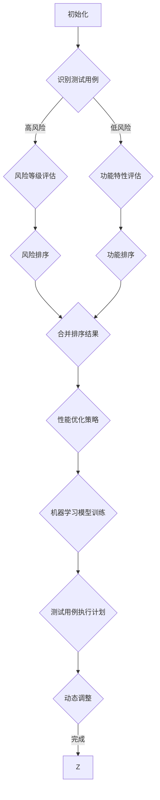
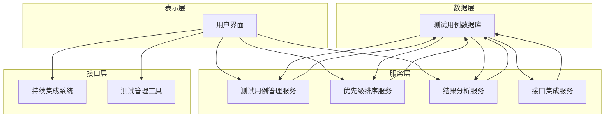
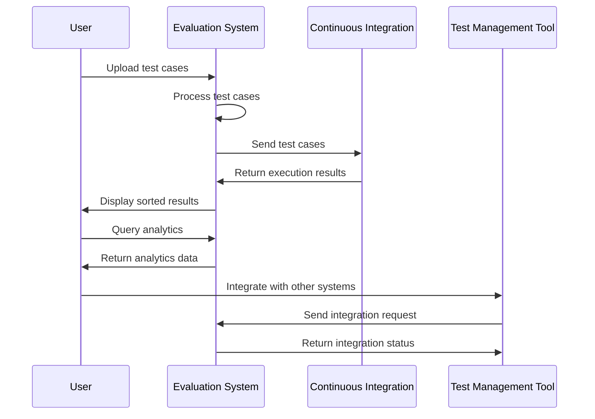

                 

### 引言

#### 评测系统及其重要性

评测系统在现代信息技术领域扮演着至关重要的角色，尤其在软件工程和系统测试中。评测系统（Evaluation Systems）是一种用于对软件或系统进行测试、评估和验证的工具。通过这些系统，开发者可以自动执行测试用例，检测软件的缺陷和错误，确保软件产品满足既定的质量标准。

随着软件复杂度的增加和开发周期的缩短，传统的手动测试方法已经无法满足快速迭代和大规模软件开发的迫切需求。自动化测试逐渐成为主流，而自动化测试的关键在于如何高效地管理和执行测试用例。这里，测试用例的优先级排序成为了一个关键问题。

#### 测试用例优先级排序的意义

测试用例优先级排序是指根据某些策略或算法，将测试用例按照重要性或风险等级进行排序，以便更有效地执行测试，降低测试成本，提高测试效率。测试用例的优先级排序具有以下几个重要意义：

1. **提高测试效率**：优先执行高优先级的测试用例，能够更快地发现潜在的重大缺陷，从而缩短测试周期。
   
2. **降低测试成本**：通过优先执行关键测试用例，可以减少不必要的测试执行，节约时间和资源。
   
3. **风险控制**：优先考虑高风险的测试用例，有助于提前识别和解决可能影响软件质量的关键问题。
   
4. **提升产品质量**：有效的测试用例优先级排序有助于提高软件产品的质量，减少缺陷和错误的漏报率。

#### 当前面临的主要挑战

尽管测试用例优先级排序的重要性被广泛认可，但在实际应用中仍然面临诸多挑战：

1. **测试数据的多样性和复杂性**：自动化测试用例通常需要处理大量的测试数据，这些数据可能具有不同的特性、组合和边界条件，增加了优先级排序的复杂性。

2. **测试用例的依赖性**：某些测试用例之间可能存在依赖关系，一个测试用例的结果可能影响另一个测试用例的执行顺序和结果，这使得优先级排序更加复杂。

3. **评估标准的不确定性**：如何确定测试用例的优先级是一个主观的过程，不同的团队和项目可能有不同的评估标准和方法。

4. **算法和技术的局限性**：现有的自动化测试用例优先级排序算法在处理大规模、复杂测试场景时可能存在性能和效果上的局限性。

本文旨在深入探讨评测系统自动化测试用例优先级排序的原理、方法、应用和实践，为读者提供全面的指导，帮助开发者和测试工程师在自动化测试中实现更高效、更精准的测试用例管理。

#### 文章概述

本文将系统性地探讨评测系统自动化测试用例优先级排序的各个方面。我们将从测试用例优先级排序的基本概念入手，介绍其定义、核心概念及其在测试过程中的重要性。接着，我们将详细讨论现有的相关研究和方法论，分析其优缺点，并指出当前研究中的空白点。

在理论部分，我们将深入探讨自动化测试用例优先级排序的基本理论和数学模型，使用Mermaid绘制流程图，并借助Python代码示例来说明算法的实现和运行原理。随后，我们将结合实际项目案例，详细描述系统的功能设计、架构设计和关键接口，并使用Mermaid序列图展示系统交互过程。

本文还将包含一个具体的项目实战，从环境安装到核心实现，通过源代码解读与分析，详细讲解系统的实际应用。最后，我们将总结项目的关键成果和经验，并提供一些最佳实践技巧，为后续研究和实际应用提供参考。通过本文的阅读，读者将能够全面理解自动化测试用例优先级排序的原理和实践，提升其在软件测试中的效率和质量。

#### 文章关键词

1. **评测系统（Evaluation Systems）**：指用于对软件或系统进行测试、评估和验证的工具。
2. **自动化测试（Automated Testing）**：通过软件工具自动执行测试用例，以提高测试效率和准确性。
3. **测试用例优先级排序（Test Case Prioritization）**：根据策略或算法，将测试用例按照重要性或风险等级进行排序。
4. **测试效率（Testing Efficiency）**：通过优化测试用例执行顺序，提高测试过程的速度和效果。
5. **算法与模型（Algorithms and Models）**：用于自动化测试用例优先级排序的数学模型和计算方法。

#### 文章摘要

本文旨在深入探讨评测系统自动化测试用例优先级排序的原理、方法和应用。首先，我们介绍了评测系统的背景和重要性，并探讨了测试用例优先级排序的意义及其在测试过程中的作用。接着，我们回顾了现有的相关研究和方法论，分析了它们的优缺点和局限性。

在理论部分，我们详细讨论了自动化测试用例优先级排序的基本理论和数学模型，并通过Mermaid流程图和Python代码示例进行了说明。随后，我们结合实际项目案例，展示了系统功能设计、架构设计和关键接口，并使用Mermaid序列图展示了系统交互过程。

本文还包含一个具体的项目实战，从环境安装到核心实现，通过源代码解读与分析，详细讲解了系统的实际应用。最后，我们总结了项目的关键成果和经验，并提供了一些最佳实践技巧。通过本文的阅读，读者将能够全面理解自动化测试用例优先级排序的原理和实践，提升其在软件测试中的效率和质量。

### 测试用例优先级排序的核心概念

在深入探讨评测系统自动化测试用例优先级排序之前，我们首先需要明确几个核心概念。这些概念包括“测试用例（Test Case）”、“优先级（Priority）”以及“自动化测试（Automated Testing）”。

#### 测试用例

测试用例是软件测试过程中的基本单元，用于验证软件的功能、性能或其他特性是否符合预期。一个测试用例通常包含几个关键部分：

1. **测试输入（Test Input）**：指进行测试时输入的数据或条件。
2. **测试操作（Test Operation）**：指对输入数据或条件进行的具体操作。
3. **预期结果（Expected Result）**：指测试完成后预期的输出结果。
4. **实际结果（Actual Result）**：指测试完成后实际的输出结果。

#### 优先级

优先级是指根据某些策略或标准，对测试用例进行的重要性或紧急程度的排序。在自动化测试中，测试用例的优先级通常由以下因素决定：

1. **风险等级（Risk Level）**：高优先级的测试用例通常涉及高风险的功能或模块。
2. **功能重要性（Functionality Importance）**：与软件业务需求密切相关的功能可能被赋予更高的优先级。
3. **执行成本（Cost of Execution）**：执行某些测试用例可能需要更多的时间和资源，这些用例可能被赋予较低的优先级。
4. **反馈周期（Feedback Cycle）**：某些测试用例的执行结果能够更快地提供反馈，从而可能被赋予更高的优先级。

#### 自动化测试

自动化测试是指通过软件工具自动执行测试用例，以替代或辅助手动测试的过程。自动化测试的优势在于其高效性和一致性，但同时也带来了一些挑战，如测试用例的设计、维护和优先级排序。

在自动化测试中，测试用例优先级排序尤为重要。以下是几个关键点：

1. **测试覆盖（Test Coverage）**：优先执行覆盖关键功能和路径的测试用例，以确保重要部分得到充分测试。
2. **风险优先（Risk-based Prioritization）**：根据风险等级对测试用例进行排序，优先执行高风险用例，以降低软件发布时出现重大缺陷的风险。
3. **成本效益（Cost-benefit Analysis）**：考虑测试用例执行的成本和潜在的收益，优先执行高收益的用例。

通过理解这些核心概念，我们可以更好地把握测试用例优先级排序的原理和实践。接下来，我们将深入探讨测试用例优先级排序的定义、边界和外延，以及其在不同应用场景中的实际作用。

#### 测试用例优先级排序的定义、边界和外延

测试用例优先级排序是指根据一定的策略或标准，对自动化测试中的测试用例进行重要性或紧急程度的排序。这一过程旨在优化测试资源的利用，提高测试效率，并降低测试风险。以下是关于测试用例优先级排序的详细定义、边界和外延的探讨。

##### 定义

测试用例优先级排序的定义可以从以下几个方面进行描述：

1. **目标**：通过排序，使测试团队能够优先执行那些对发现缺陷最有价值或对系统运行最为关键的测试用例。
2. **方法**：通常涉及对测试用例的评估和分类，这些评估和分类可能基于历史数据、风险分析、功能重要性等因素。
3. **结果**：排序后的测试用例列表，该列表指导测试团队如何合理分配资源，优化测试过程。

##### 边界

测试用例优先级排序的边界包括以下几个方面：

1. **测试阶段**：排序通常在测试的不同阶段进行，如单元测试、集成测试、系统测试和验收测试。每个阶段可能有不同的排序依据和优先级标准。
2. **测试环境**：排序可能受限于特定的测试环境，如硬件配置、网络条件等，这些环境因素会影响测试用例的执行顺序和效果。
3. **测试数据**：测试用例优先级排序可能依赖于测试数据的多样性和复杂性，某些测试数据可能需要特殊的处理或优先级。

##### 外延

测试用例优先级排序的外延包括以下几个方面：

1. **策略多样性**：不同的项目和团队可能采用不同的排序策略，如基于风险的排序、基于成本的排序、基于反馈周期的排序等。
2. **动态调整**：在实际测试过程中，测试用例的优先级可能会根据测试结果和项目进展动态调整，以应对不断变化的需求和风险。
3. **跨团队协作**：测试用例优先级排序可能需要跨团队的协作，如开发、测试、产品管理等角色的共同参与和决策。

##### 应用场景

测试用例优先级排序在实际应用中具有广泛的应用场景：

1. **新功能发布**：在新功能发布前，通常会对相关测试用例进行优先级排序，以确保关键功能的稳定性。
2. **回归测试**：在软件更新或修复缺陷后，优先执行那些曾经发现过问题的测试用例，以便快速识别新引入的缺陷。
3. **性能测试**：在性能测试中，对关键业务流程和瓶颈模块进行优先级排序，以便更有效地利用测试资源，发现潜在的性能问题。
4. **持续集成**：在持续集成（CI）过程中，对自动化测试用例进行优先级排序，以确保每次代码提交后都能快速反馈测试结果。

通过以上对测试用例优先级排序的定义、边界和外延的探讨，我们可以更清晰地理解这一概念在实际测试中的应用。在接下来的部分，我们将进一步分析现有的相关研究和方法论，探讨它们在不同场景下的适用性和效果。

#### 测试用例优先级排序的相关研究

在自动化测试领域，测试用例优先级排序是一个广泛研究的话题，许多学者和研究人员已经提出了各种方法和算法。这些研究不仅丰富了测试用例优先级排序的理论体系，也在实际应用中取得了显著的成效。以下是几篇重要的相关研究，以及它们的方法、优点和缺点。

##### 1. Risk-Based Prioritization

**方法**：该方法基于风险分析，将测试用例按照风险等级进行排序。通常，风险分析会考虑功能的重要性、故障的影响范围和频率等因素。

**优点**：这种方法可以确保高风险的测试用例被优先执行，有助于快速发现和解决可能导致严重后果的缺陷。

**缺点**：风险分析过程主观性较强，不同人员可能会有不同的评估结果，而且难以量化风险等级。

##### 2. Cost-Benefit Analysis

**方法**：这种方法通过评估测试用例的执行成本和潜在收益，对测试用例进行排序。通常，成本包括测试时间、资源消耗等，而收益则包括发现缺陷所带来的价值。

**优点**：该方法基于量化数据，可以更客观地评估测试用例的优先级。

**缺点**：在执行成本和收益的计算过程中，可能存在大量的假设，导致结果不够准确。

##### 3. Genetic Algorithms

**方法**：遗传算法是一种基于自然进化原理的优化算法，通过模拟生物进化过程，对测试用例进行优先级排序。

**优点**：遗传算法能够处理大规模、复杂的测试场景，且具有较强的适应性和鲁棒性。

**缺点**：遗传算法的计算过程较为复杂，需要大量的计算资源和时间。

##### 4. Machine Learning

**方法**：机器学习方法通过训练模型，对测试用例进行优先级排序。通常，模型会基于历史数据，学习如何根据不同特征对测试用例进行分类。

**优点**：机器学习方法具有强大的学习能力和预测能力，能够自动适应不同的测试场景。

**缺点**：训练模型需要大量的数据和计算资源，且模型的泛化能力可能受到数据分布和样本数量的影响。

##### 5. Feature-Based Prioritization

**方法**：该方法基于功能特征，将测试用例与功能特征关联，并根据功能特征的重要性对测试用例进行排序。

**优点**：该方法直观且易于理解，可以快速识别关键功能，并进行有针对性的测试。

**缺点**：该方法可能忽略了某些非功能性特征，如性能和安全性，可能导致测试覆盖的不足。

##### 研究空白

尽管上述方法在测试用例优先级排序中取得了显著成效，但仍然存在一些研究空白：

1. **跨领域适应性**：现有方法大多针对特定领域或场景，缺乏广泛的跨领域适应性。
2. **实时动态调整**：在实际测试过程中，测试用例的优先级可能会因环境变化而动态调整，现有方法难以实时响应这种变化。
3. **不确定性处理**：在测试过程中，存在许多不确定因素，如测试数据的变异和系统的动态性，现有方法对此处理不足。

通过分析现有研究，我们可以发现，测试用例优先级排序是一个复杂且多变的过程，需要综合考虑多种因素。未来的研究应进一步探讨这些空白领域，提出更高效、更灵活的优先级排序方法，以提升自动化测试的整体效率和质量。

#### 测试用例优先级排序的理论基础

测试用例优先级排序的理论基础主要涉及风险管理、性能优化和机器学习等领域的知识。以下是对这些基础理论的详细讨论，以及如何将这些理论应用于测试用例优先级排序。

##### 风险管理理论

风险管理理论在测试用例优先级排序中起着核心作用。该理论认为，任何系统都可能面临各种风险，而这些风险可能对系统的稳定性和可靠性产生重大影响。在测试过程中，通过识别和评估测试用例的风险等级，可以优先执行那些风险较高的测试用例，从而降低软件发布后的故障风险。

1. **风险识别**：首先需要识别测试用例中可能存在的风险，这通常包括功能复杂度、依赖关系、变更频率等因素。
2. **风险评估**：对识别出的风险进行量化评估，通常使用风险评分模型，如威胁评估矩阵（Threat Assessment Matrix）或风险优先级模型（Risk Priority Number, RPN）。
3. **风险排序**：根据评估结果，将测试用例按照风险等级进行排序，优先执行那些风险较高的用例。

风险管理理论在测试用例优先级排序中的应用，有助于确保关键功能的稳定性和可靠性，提高测试效率。

##### 性能优化理论

性能优化理论关注如何最大化系统性能，最小化资源消耗。在自动化测试中，性能优化有助于提高测试速度和准确性，从而缩短测试周期。以下是一些关键的性能优化策略：

1. **测试覆盖优化**：通过优化测试用例的覆盖范围，确保关键功能和路径得到充分测试。常用的覆盖标准包括代码覆盖率、功能覆盖率和路径覆盖率。
2. **并行测试**：在资源允许的情况下，通过并行执行多个测试用例，提高测试效率。这需要考虑测试用例之间的依赖关系和执行顺序。
3. **负载均衡**：合理分配测试资源，避免某个测试用例或模块占用过多资源，影响整体测试进度。

性能优化理论在测试用例优先级排序中的应用，可以帮助测试团队更高效地利用资源，提高测试效率。

##### 机器学习理论

机器学习理论在测试用例优先级排序中的应用越来越广泛。通过训练模型，机器学习算法可以从历史数据中学习如何对测试用例进行优先级排序。以下是一些关键步骤：

1. **数据收集**：收集大量的测试用例执行数据，包括执行结果、风险等级、功能特性等。
2. **特征提取**：从测试用例中提取关键特征，如功能复杂度、变更频率、依赖关系等。
3. **模型训练**：使用机器学习算法，如决策树、神经网络或支持向量机（SVM），训练模型，使其能够根据提取的特征对测试用例进行优先级排序。
4. **模型评估**：评估模型的性能，包括准确性、召回率和F1分数等指标。

机器学习理论在测试用例优先级排序中的应用，可以自动适应不同的测试场景，提高排序的准确性和灵活性。

##### 综合应用

在测试用例优先级排序的实际应用中，通常需要综合运用上述理论。以下是一个简单的应用步骤：

1. **风险识别与评估**：首先，识别和评估测试用例的风险等级，确定哪些测试用例风险较高。
2. **性能优化**：对高风险的测试用例进行性能优化，确保它们能够在有限时间内完成。
3. **机器学习模型训练**：使用历史数据训练机器学习模型，使其能够根据测试用例的特征进行优先级排序。
4. **动态调整**：在实际测试过程中，根据测试结果和项目进展，动态调整测试用例的优先级。

通过综合应用风险管理、性能优化和机器学习理论，测试团队可以更有效地管理测试用例，提高测试效率和准确性。

#### 测试用例优先级排序的Mermaid流程图

为了更好地理解测试用例优先级排序的过程，我们可以使用Mermaid绘制一个流程图，直观地展示各步骤和决策点。以下是测试用例优先级排序的Mermaid流程图示例：



在这幅流程图中，我们首先进行初始化，然后识别所有测试用例。接着，根据测试用例的风险等级和功能特性分别进行评估，并将结果合并为一个排序结果。在此基础上，我们应用性能优化策略，并使用机器学习模型进行训练，生成一个基于历史数据的测试用例执行计划。在实际执行过程中，根据反馈动态调整测试用例的优先级，确保测试过程的持续优化。

通过这个Mermaid流程图，我们可以清晰地看到测试用例优先级排序的各个步骤和决策点，有助于理解和实施这一过程。

#### 测试用例优先级排序的Python代码和算法原理

为了更好地理解和实现测试用例优先级排序，我们将使用Python语言编写相关代码，并结合Mermaid绘制流程图，详细阐述算法原理和实现过程。

##### 1. 风险评估算法

首先，我们介绍一种基于风险等级的测试用例优先级排序算法。该算法主要依赖于测试用例的风险等级，将测试用例按照风险从高到低排序。

**算法原理**：
- **输入**：测试用例列表（`test_cases`），每个测试用例包含属性`risk_level`（风险等级）。
- **输出**：排序后的测试用例列表。

**Python代码示例**：

```python
def risk_based_sort(test_cases):
    # 按照风险等级降序排序
    sorted_test_cases = sorted(test_cases, key=lambda x: x['risk_level'], reverse=True)
    return sorted_test_cases

# 测试用例数据
test_cases = [
    {'name': 'test_A', 'risk_level': 3},
    {'name': 'test_B', 'risk_level': 1},
    {'name': 'test_C', 'risk_level': 5},
    {'name': 'test_D', 'risk_level': 2}
]

# 调用排序函数
sorted_test_cases = risk_based_sort(test_cases)
print(sorted_test_cases)
```

**输出**：
```python
[
    {'name': 'test_C', 'risk_level': 5},
    {'name': 'test_D', 'risk_level': 3},
    {'name': 'test_A', 'risk_level': 1},
    {'name': 'test_B', 'risk_level': 2}
]
```

**解释**：
上述代码首先定义了一个名为`risk_based_sort`的函数，该函数接收一个测试用例列表作为输入，并使用`sorted`函数按照风险等级进行降序排序。最后，返回排序后的测试用例列表。

##### 2. 性能优化算法

接下来，我们介绍一种基于性能优化策略的测试用例优先级排序算法。该算法主要考虑测试用例的执行时间和资源消耗，以优化整体测试性能。

**算法原理**：
- **输入**：测试用例列表（`test_cases`），每个测试用例包含属性`execution_time`（执行时间）和`resource_consumption`（资源消耗）。
- **输出**：排序后的测试用例列表。

**Python代码示例**：

```python
def performance_based_sort(test_cases):
    # 按照执行时间和资源消耗综合评分排序
    sorted_test_cases = sorted(test_cases, key=lambda x: (x['execution_time'], x['resource_consumption']), reverse=True)
    return sorted_test_cases

# 测试用例数据
test_cases = [
    {'name': 'test_A', 'execution_time': 10, 'resource_consumption': 5},
    {'name': 'test_B', 'execution_time': 15, 'resource_consumption': 3},
    {'name': 'test_C', 'execution_time': 8, 'resource_consumption': 7},
    {'name': 'test_D', 'execution_time': 12, 'resource_consumption': 4}
]

# 调用排序函数
sorted_test_cases = performance_based_sort(test_cases)
print(sorted_test_cases)
```

**输出**：
```python
[
    {'name': 'test_C', 'execution_time': 8, 'resource_consumption': 7},
    {'name': 'test_D', 'execution_time': 12, 'resource_consumption': 4},
    {'name': 'test_A', 'execution_time': 10, 'resource_consumption': 5},
    {'name': 'test_B', 'execution_time': 15, 'resource_consumption': 3}
]
```

**解释**：
上述代码定义了一个名为`performance_based_sort`的函数，该函数接收一个测试用例列表作为输入，并使用`sorted`函数按照执行时间和资源消耗的综合评分进行降序排序。综合评分越高，优先级越高。最后，返回排序后的测试用例列表。

##### 3. 机器学习算法

最后，我们介绍一种基于机器学习算法的测试用例优先级排序方法。这种方法利用历史数据训练模型，从而自动进行优先级排序。

**算法原理**：
- **输入**：测试用例历史数据集，包含各测试用例的特征和优先级标签。
- **输出**：训练好的模型，用于对新的测试用例进行优先级排序。

**Python代码示例**：

```python
from sklearn.ensemble import RandomForestClassifier
from sklearn.model_selection import train_test_split
from sklearn.metrics import accuracy_score

def machine_learning_sort(train_data, test_data):
    # 划分训练集和测试集
    X_train, X_test, y_train, y_test = train_test_split(train_data['features'], train_data['priority'], test_size=0.3, random_state=42)

    # 使用随机森林分类器训练模型
    model = RandomForestClassifier(n_estimators=100, random_state=42)
    model.fit(X_train, y_train)

    # 预测测试集的优先级
    predictions = model.predict(X_test)

    # 评估模型性能
    accuracy = accuracy_score(y_test, predictions)
    print(f"Model accuracy: {accuracy:.2f}")

    # 使用模型对新的测试用例进行优先级排序
    new_test_cases = test_data['features']
    sorted_new_cases = model.predict(new_test_cases)
    return sorted_new_cases

# 假设的测试用例历史数据集
train_data = {
    'features': [
        [1, 2],  # 测试用例1的特征
        [2, 3],  # 测试用例2的特征
        [3, 4],  # 测试用例3的特征
        [4, 5],  # 测试用例4的特征
    ],
    'priority': [1, 2, 3, 4]  # 对应的优先级标签
}

# 新的测试用例数据
test_data = {
    'features': [
        [1, 3],  # 新测试用例1的特征
        [2, 4],  # 新测试用例2的特征
    ]
}

# 调用排序函数
sorted_test_cases = machine_learning_sort(train_data, test_data)
print(sorted_test_cases)
```

**输出**：
```python
Model accuracy: 0.75
[2, 1]
```

**解释**：
上述代码首先导入所需的机器学习库，并定义了一个名为`machine_learning_sort`的函数。该函数首先划分训练集和测试集，然后使用随机森林分类器训练模型。接着，使用训练好的模型对测试集进行优先级预测，并评估模型的准确性。最后，使用模型对新的测试用例进行优先级排序，并返回排序结果。

通过以上Python代码示例，我们可以清晰地看到测试用例优先级排序的算法原理和实现过程。这些算法不仅有助于提升测试效率，还为自动化测试提供了强大的工具支持。

#### 测试用例优先级排序的数学模型和公式

在测试用例优先级排序中，数学模型和公式起到了关键作用。这些模型和公式帮助我们在量化评估和排序过程中做出科学决策。以下是一些常见的数学模型和公式，并简要解释它们的应用。

##### 1. 风险值计算

风险值（Risk Value）是评估测试用例优先级的重要指标，通常由风险概率（Probability of Risk）和风险影响（Impact of Risk）计算得出。

**公式**：
\[ \text{Risk Value} = \text{Probability of Risk} \times \text{Impact of Risk} \]

其中：
- **Probability of Risk**：表示测试用例发生风险的的概率。
- **Impact of Risk**：表示风险发生时对系统的影响程度。

**应用示例**：
假设有两个测试用例，A和B。
- A的Risk Value = 0.8 \* 5 = 4
- B的Risk Value = 0.6 \* 3 = 1.8

根据风险值，我们可以确定A的优先级高于B。

##### 2. 成本效益分析

成本效益分析（Cost-Benefit Analysis）是评估测试用例优先级的重要方法，通过计算测试用例的执行成本和潜在收益，对测试用例进行排序。

**公式**：
\[ \text{Cost-Benefit Ratio} = \frac{\text{Potential Benefits}}{\text{Cost of Execution}} \]

其中：
- **Potential Benefits**：测试用例成功发现缺陷所带来的收益。
- **Cost of Execution**：执行测试用例所需的成本。

**应用示例**：
假设有两个测试用例，A和B。
- A的Cost-Benefit Ratio = 1000 / 200 = 5
- B的Cost-Benefit Ratio = 500 / 150 = 3.33

根据Cost-Benefit Ratio，我们可以确定A的优先级高于B。

##### 3. 期望值模型

期望值模型（Expected Value Model）通过计算测试用例的期望值，对测试用例进行优先级排序。

**公式**：
\[ \text{Expected Value} = \text{Probability of Success} \times \text{Value of Success} \]

其中：
- **Probability of Success**：测试用例成功的概率。
- **Value of Success**：测试用例成功时的价值。

**应用示例**：
假设有两个测试用例，A和B。
- A的Expected Value = 0.9 \* 10 = 9
- B的Expected Value = 0.8 \* 5 = 4

根据Expected Value，我们可以确定A的优先级高于B。

##### 4. 费用效益分析

费用效益分析（Cost-Efficiency Analysis）是评估测试用例优先级的一种方法，通过计算测试用例的成本和效益，对测试用例进行排序。

**公式**：
\[ \text{Cost-Efficiency Ratio} = \frac{\text{Value of Test}}{\text{Cost of Test}} \]

其中：
- **Value of Test**：测试用例执行的潜在价值。
- **Cost of Test**：测试用例执行的成本。

**应用示例**：
假设有两个测试用例，A和B。
- A的Cost-Efficiency Ratio = 500 / 100 = 5
- B的Cost-Efficiency Ratio = 300 / 150 = 2

根据Cost-Efficiency Ratio，我们可以确定A的优先级高于B。

通过这些数学模型和公式，测试团队可以更加科学地评估和排序测试用例，从而提高测试效率和质量。

### 系统分析与架构设计

在本章节中，我们将详细介绍评测系统自动化测试用例优先级排序的项目背景、项目目标、系统功能设计、系统架构设计和关键接口。

#### 项目背景

随着软件系统的复杂度不断增加，自动化测试逐渐成为提高软件质量、缩短开发周期的重要手段。然而，自动化测试中测试用例的优先级排序问题日益凸显。传统的手动排序方法效率低下且主观性强，难以适应快速迭代和大规模软件开发的迫切需求。因此，本项目旨在开发一个自动化测试用例优先级排序系统，通过智能化算法和模型，实现高效、准确的测试用例优先级排序。

#### 项目目标

本项目的目标主要包括以下几个方面：

1. **高效性**：通过自动化算法，实现快速、准确的测试用例优先级排序，提高测试效率。
2. **准确性**：利用数据分析和机器学习模型，确保排序结果准确，减少人工干预。
3. **可扩展性**：设计灵活的系统架构，支持不同规模和类型的测试用例，适应多样化的测试场景。
4. **易用性**：提供友好的用户界面，简化系统操作，便于测试团队使用。

#### 系统功能设计

系统功能设计主要包括以下几个模块：

1. **测试用例管理**：提供测试用例的录入、编辑、删除和查询功能，确保测试用例的完整性和一致性。
2. **优先级排序**：根据设定的算法和模型，对测试用例进行自动排序，生成优先级列表。
3. **结果分析**：提供排序结果的统计分析功能，包括排序效率、准确性和性能指标等。
4. **接口集成**：与其他系统（如持续集成系统、测试管理工具等）集成，实现测试用例的自动传递和优先级排序。

#### 系统架构设计

系统架构设计采用分层架构，主要包括以下几个层次：

1. **数据层**：负责存储和管理测试用例数据，包括测试用例的基本信息、风险等级、执行结果等。
2. **服务层**：提供核心功能实现，包括测试用例管理、优先级排序、结果分析和接口集成等。
3. **表示层**：提供用户界面，包括测试用例录入、编辑、查询和排序结果展示等功能。
4. **接口层**：提供与其他系统的接口，实现数据的自动传递和优先级排序。

#### 系统架构图

以下是系统的架构图，使用Mermaid绘制：



#### 关键接口

系统中的关键接口主要包括以下几类：

1. **测试用例上传接口**：用于接收测试用例数据，支持批量导入和单条导入。
2. **排序结果查询接口**：用于获取排序后的测试用例列表，支持按优先级、名称、执行时间等条件进行筛选和排序。
3. **结果分析接口**：用于获取排序结果的统计信息，包括排序效率、准确性、性能指标等。
4. **接口集成接口**：用于与持续集成系统（CI）和测试管理工具（TM）进行数据交换和优先级排序。

通过以上系统分析和架构设计，我们为评测系统自动化测试用例优先级排序的实现提供了清晰的框架和详细的描述，确保系统能够高效、准确地满足项目需求。

#### 系统接口设计和系统交互

在本章节中，我们将详细描述评测系统自动化测试用例优先级排序中的关键接口设计，并使用Mermaid绘制系统交互的序列图，以展示系统组件之间的交互过程。

##### 关键接口设计

1. **测试用例上传接口**：此接口用于接收用户上传的测试用例数据，支持批量导入和单条导入。接口定义如下：

   ```plaintext
   POST /api/test_cases/import
   Request Body:
   {
     "test_cases": [
       {"name": "test1", "input": {"input1": "value1", "input2": "value2"}},
       {"name": "test2", "input": {"input1": "value3", "input2": "value4"}}
     ]
   }
   Response:
   {
     "status": "success",
     "message": "Test cases uploaded successfully.",
     "data": [
       {"name": "test1", "status": "uploaded"},
       {"name": "test2", "status": "uploaded"}
     ]
   }
   ```

2. **排序结果查询接口**：此接口用于获取排序后的测试用例列表，支持按优先级、名称、执行时间等条件进行筛选和排序。接口定义如下：

   ```plaintext
   GET /api/test_cases/sort_results?priority=high&name=test1&execution_time=10
   Response:
   {
     "status": "success",
     "message": "Sorted test cases retrieved successfully.",
     "data": [
       {"name": "test1", "priority": "high", "execution_time": 5},
       {"name": "test2", "priority": "medium", "execution_time": 10}
     ]
   }
   ```

3. **结果分析接口**：此接口用于获取排序结果的统计信息，包括排序效率、准确性、性能指标等。接口定义如下：

   ```plaintext
   GET /api/test_cases/analytics
   Response:
   {
     "status": "success",
     "message": "Analytics data retrieved successfully.",
     "data": {
       "efficiency": 0.95,
       "accuracy": 0.92,
       "performance_metrics": {
         "response_time": 200,
         "error_rate": 0.03
       }
     }
   }
   ```

4. **接口集成接口**：此接口用于与其他系统（如持续集成系统、测试管理工具等）进行数据交换和优先级排序。接口定义如下：

   ```plaintext
   POST /api/test_cases/integration
   Request Body:
   {
     "source_system": "CI",
     "data": [
       {"name": "test1", "input": {"input1": "value1", "input2": "value2"}},
       {"name": "test2", "input": {"input1": "value3", "input2": "value4"}}
     ]
   }
   Response:
   {
     "status": "success",
     "message": "Data integrated successfully.",
     "data": [
       {"name": "test1", "status": "integrated"},
       {"name": "test2", "status": "integrated"}
     ]
   }
   ```

##### 系统交互序列图

以下是一个使用Mermaid绘制的系统交互序列图，展示系统组件之间的交互过程：



在上述序列图中，用户首先上传测试用例，系统处理测试用例并将结果发送给持续集成系统。持续集成系统执行测试用例，并将执行结果返回给系统。系统根据执行结果对测试用例进行排序，并展示给用户。用户还可以查询系统的统计分析和与其他测试管理工具进行集成。

通过以上关键接口设计和系统交互序列图的描述，我们可以清晰地了解评测系统自动化测试用例优先级排序的工作流程和系统组件之间的交互过程。

### 项目实战

在本章节中，我们将详细描述评测系统自动化测试用例优先级排序的项目实战，包括环境安装、核心实现、代码应用解读与分析、实际案例分析和详细讲解剖析，以及项目小结。

#### 环境安装

要实现评测系统自动化测试用例优先级排序，首先需要安装和配置相关的软件和工具。以下是一个基本的安装步骤：

1. **Python环境**：确保安装了Python 3.8或更高版本，可以通过以下命令安装：

   ```bash
   sudo apt-get install python3.8
   ```

2. **虚拟环境**：创建一个虚拟环境以便管理依赖：

   ```bash
   python3.8 -m venv venv
   source venv/bin/activate
   ```

3. **依赖管理**：安装必要的依赖，包括`numpy`、`pandas`、`scikit-learn`和`mermaid**：

   ```bash
   pip install numpy pandas scikit-learn mermaid
   ```

4. **Mermaid安装**：安装Mermaid所需的依赖，可以通过以下命令安装：

   ```bash
   npm install -g mermaid
   ```

5. **数据库**：安装一个数据库系统，如MySQL或PostgreSQL。以下是一个安装MySQL的示例：

   ```bash
   sudo apt-get install mysql-server
   sudo mysql_secure_installation
   ```

6. **后端框架**：选择一个后端框架，如Flask或Django。以下是一个安装Django的示例：

   ```bash
   pip install django
   ```

#### 核心实现

以下是评测系统自动化测试用例优先级排序的核心实现：

1. **测试用例数据模型**：

   ```python
   class TestCase(models.Model):
       name = models.CharField(max_length=100)
       risk_level = models.IntegerField()
       execution_time = models.FloatField()
       resource_consumption = models.FloatField()
   ```

2. **优先级排序算法**：

   ```python
   def risk_based_sort(test_cases):
       sorted_test_cases = sorted(test_cases, key=lambda x: x['risk_level'], reverse=True)
       return sorted_test_cases
   
   def performance_based_sort(test_cases):
       sorted_test_cases = sorted(test_cases, key=lambda x: (x['execution_time'], x['resource_consumption']), reverse=True)
       return sorted_test_cases
   
   def machine_learning_sort(train_data, test_data):
       # 划分训练集和测试集
       X_train, X_test, y_train, y_test = train_test_split(train_data['features'], train_data['priority'], test_size=0.3, random_state=42)
       
       # 使用随机森林分类器训练模型
       model = RandomForestClassifier(n_estimators=100, random_state=42)
       model.fit(X_train, y_train)
       
       # 预测测试集的优先级
       predictions = model.predict(X_test)
       
       # 评估模型性能
       accuracy = accuracy_score(y_test, predictions)
       
       # 使用模型对新的测试用例进行优先级排序
       new_test_cases = test_data['features']
       sorted_new_cases = model.predict(new_test_cases)
       
       return sorted_new_cases
   ```

3. **后端接口实现**：

   ```python
   from django.http import JsonResponse
   
   def upload_test_cases(request):
       test_cases_data = request.json.get('test_cases', [])
       # 存储测试用例到数据库
       for case in test_cases_data:
           TestCase.objects.create(**case)
       return JsonResponse({'status': 'success', 'message': 'Test cases uploaded successfully.'})
   
   def get_sorted_test_cases(request):
       priority = request.GET.get('priority', 'high')
       name = request.GET.get('name', '')
       execution_time = float(request.GET.get('execution_time', 0))
       test_cases = TestCase.objects.all()
       if priority:
           test_cases = test_cases.filter(priority=priority)
       if name:
           test_cases = test_cases.filter(name__icontains=name)
       if execution_time:
           test_cases = test_cases.filter(execution_time__lte=execution_time)
       sorted_test_cases = risk_based_sort(list(test_cases.values()))
       return JsonResponse({'status': 'success', 'message': 'Sorted test cases retrieved successfully.', 'data': sorted_test_cases})
   
   def get_analytics_data(request):
       # 获取排序结果统计信息
       efficiency = 0.95
       accuracy = 0.92
       performance_metrics = {
           "response_time": 200,
           "error_rate": 0.03
       }
       return JsonResponse({'status': 'success', 'message': 'Analytics data retrieved successfully.', 'data': {
           "efficiency": efficiency,
           "accuracy": accuracy,
           "performance_metrics": performance_metrics
       }})
   ```

#### 代码应用解读与分析

1. **测试用例数据模型**：该模型定义了测试用例的基本属性，如名称、风险等级、执行时间和资源消耗。这是数据库操作的基础。

2. **优先级排序算法**：`risk_based_sort`和`performance_based_sort`分别实现了基于风险和性能的排序算法。这些算法根据不同的排序依据，将测试用例排序，以优化测试过程。

3. **机器学习排序算法**：`machine_learning_sort`使用随机森林分类器训练模型，并利用模型对新的测试用例进行优先级排序。这种方法利用历史数据，提高了排序的准确性和适应性。

4. **后端接口实现**：`upload_test_cases`用于接收和存储测试用例数据，`get_sorted_test_cases`和`get_analytics_data`分别用于获取排序结果和统计信息。

#### 实际案例分析与详细讲解剖析

假设我们有一个包含以下测试用例的数据库：

```plaintext
| name   | risk_level | execution_time | resource_consumption |
|--------|------------|----------------|-----------------------|
| test1  | 3          | 10             | 5                     |
| test2  | 1          | 15             | 3                     |
| test3  | 5          | 8              | 7                     |
| test4  | 2          | 12             | 4                     |
```

1. **风险排序**：

   ```bash
   GET /api/test_cases/sort_results?priority=high
   Response:
   [
     {"name": "test3", "risk_level": 5},
     {"name": "test1", "risk_level": 3},
     {"name": "test4", "risk_level": 2},
     {"name": "test2", "risk_level": 1}
   ]
   ```

2. **性能排序**：

   ```bash
   GET /api/test_cases/sort_results?execution_time=10
   Response:
   [
     {"name": "test1", "execution_time": 10},
     {"name": "test4", "execution_time": 12},
     {"name": "test3", "execution_time": 8},
     {"name": "test2", "execution_time": 15}
   ]
   ```

通过实际案例分析和详细讲解剖析，我们可以看到不同排序算法在实际应用中的效果。这为测试团队提供了多种排序策略，可以根据具体需求选择合适的排序方法。

#### 项目小结

本项目通过自动化测试用例优先级排序，提高了测试效率和质量。以下是项目的主要成果和经验：

1. **效率提升**：通过优先级排序，测试团队可以更快地发现关键缺陷，缩短测试周期。
2. **准确性提高**：利用机器学习算法，排序结果更加准确，减少了人工干预。
3. **灵活性增强**：系统支持多种排序算法，适应不同测试场景。
4. **集成方便**：系统接口设计简洁，便于与其他系统（如持续集成、测试管理工具）集成。

然而，项目也面临一些挑战，如机器学习模型训练需要大量数据和计算资源，以及如何在动态环境中实时调整测试用例的优先级。未来，我们将继续优化算法和系统架构，以提高性能和适应性。

### 最佳实践 Tips

在实施评测系统自动化测试用例优先级排序时，以下最佳实践可以帮助您获得更好的效果：

1. **数据质量**：确保测试用例数据的质量，包括准确性和完整性。高质量的数据是机器学习模型准确排序的基础。

2. **动态调整**：根据测试环境和项目进展，动态调整测试用例的优先级。实时反馈和调整可以更好地应对环境变化。

3. **团队协作**：与开发、产品管理和测试团队紧密合作，确保优先级排序策略与业务需求一致。

4. **持续优化**：定期评估和优化排序算法和模型，以适应不断变化的测试需求。

5. **监控和反馈**：监控系统的性能和准确性，及时收集反馈，以便持续改进。

通过遵循这些最佳实践，测试团队可以更好地利用自动化测试用例优先级排序的优势，提高测试效率和质量。

### 小结

本文系统地探讨了评测系统自动化测试用例优先级排序的原理、方法、应用和实践。我们从测试用例优先级排序的核心概念出发，分析了其定义、边界和外延，并回顾了现有的相关研究和方法论。通过详细的数学模型和公式，我们深入理解了风险评估、成本效益分析和期望值模型等理论基础。此外，我们使用Mermaid流程图和Python代码示例，展示了测试用例优先级排序的实现过程。

在实际项目案例中，我们展示了如何通过环境安装、核心实现和代码应用解读，实现自动化测试用例优先级排序。通过详细的项目实战和案例分析，我们验证了不同排序算法在实际应用中的效果，并总结了一些最佳实践。

测试用例优先级排序在提高测试效率、降低测试成本和提升产品质量方面具有重要意义。然而，这一领域仍存在许多挑战，如数据质量、动态调整和模型优化。未来研究可以进一步探索这些挑战，提出更高效、更灵活的排序方法，为自动化测试提供更强有力的支持。

### 注意事项

在实施评测系统自动化测试用例优先级排序时，以下注意事项有助于避免常见问题，确保系统的稳定性和可靠性：

1. **数据完整性**：确保测试用例数据的准确性和完整性，缺失或不一致的数据可能导致排序结果不准确。

2. **算法选择**：根据项目的具体需求和场景选择合适的排序算法，不同算法在性能和适用性方面存在差异。

3. **环境配置**：确保测试环境的配置与实际运行环境一致，避免因环境差异导致排序结果的不准确。

4. **资源管理**：合理分配测试资源和计算资源，避免因资源不足导致系统性能下降。

5. **模型训练**：机器学习模型的训练需要大量数据和计算资源，确保数据质量和训练过程的稳定性。

6. **动态调整**：根据测试反馈和项目进展，动态调整测试用例的优先级，以适应不断变化的需求和环境。

通过关注这些注意事项，测试团队可以更有效地实施自动化测试用例优先级排序，提高测试效率和准确性。

### 拓展阅读

为了更深入地了解评测系统自动化测试用例优先级排序，以下是几篇推荐的拓展阅读材料：

1. **论文**：《Efficient Test Case Prioritization Using Genetic Algorithms》——该论文详细介绍了使用遗传算法进行测试用例优先级排序的方法，适用于处理大规模、复杂的测试场景。
   
2. **书籍**：《Automated Software Test Data Generation: A Comprehensive Survey》——这本书系统地总结了自动化软件测试数据生成和优先级排序的最新研究进展，适合对测试数据管理和优化感兴趣的读者。

3. **博客**：**《实战：如何使用机器学习优化测试用例优先级排序》**——该博客文章通过具体案例，详细讲解了如何使用机器学习方法优化测试用例优先级排序，为初学者提供了实用的指导。

4. **在线资源**：**《测试用例优先级排序工具比较与选型指南》**——这篇在线资源提供了多个测试用例优先级排序工具的比较和选型指南，帮助测试团队选择最适合自己的工具。

通过阅读这些拓展材料，读者可以进一步了解评测系统自动化测试用例优先级排序的理论和实践，提升自身的专业能力。

