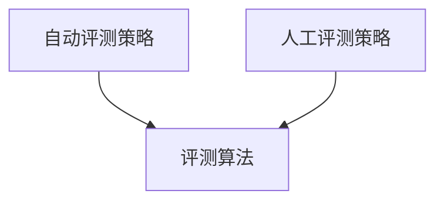
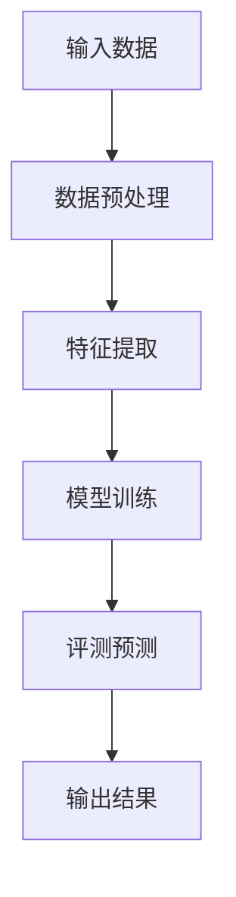
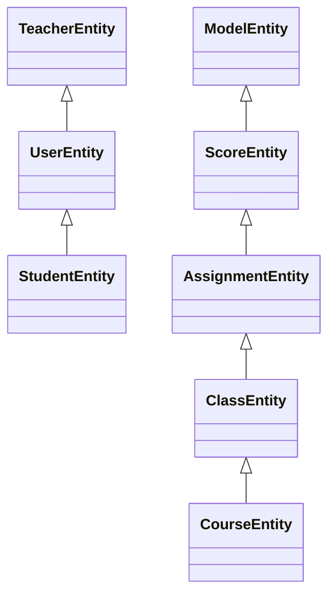
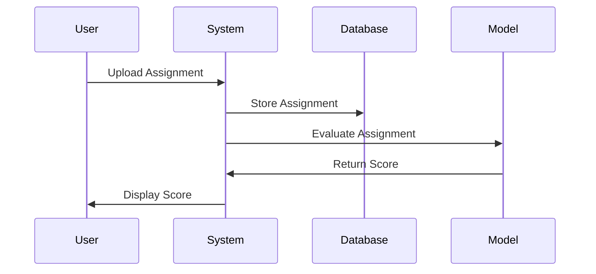
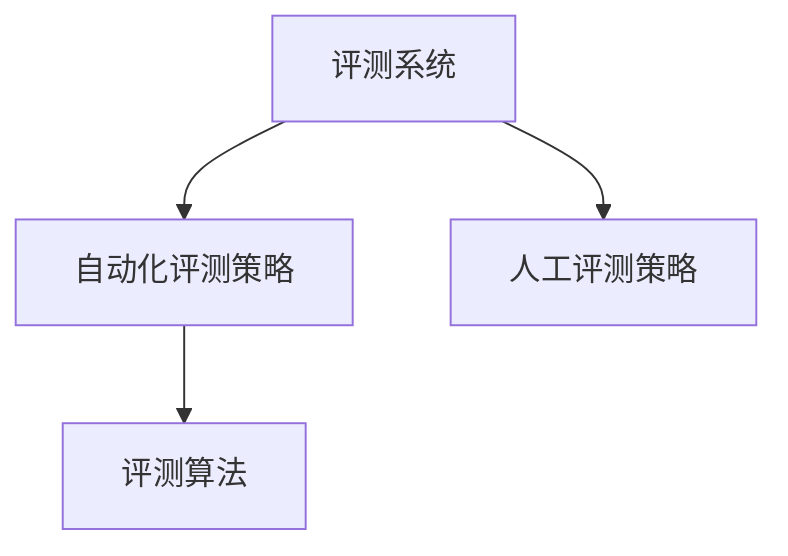
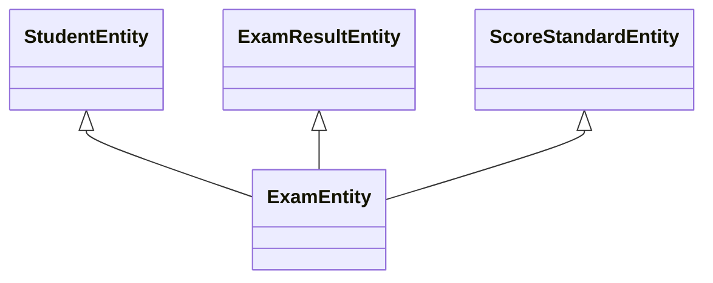
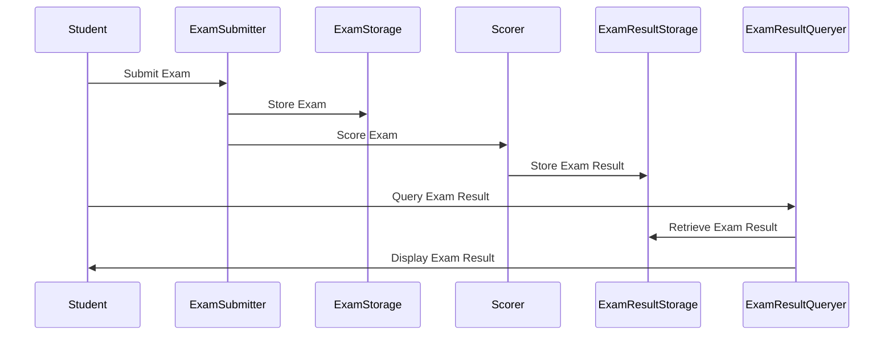

                 

### 评测系统的自动化评测策略优化

**关键词**：评测系统、自动化评测、策略优化、算法、数据预处理、模型训练、用户反馈

**摘要**：
本文深入探讨了评测系统的自动化评测策略优化。首先，我们概述了评测系统存在的问题，并提出了优化策略的目标。随后，详细分析了自动化评测策略和评测算法的核心概念及其联系。接着，通过具体的算法原理讲解，展示了从数据预处理到模型训练和评测预测的全过程。最后，结合实际项目，我们介绍了系统架构设计、环境安装和核心实现，并通过案例分析，总结了优化评测系统的最佳实践和注意事项。

## 概述

### 1.1 问题背景

随着计算机技术的发展，评测系统在各个领域得到了广泛的应用，如教育、考试、招聘等。这些系统通常用于对学生的考试成绩、应聘者的能力进行评估。然而，传统的评测方式存在以下问题：

- **人工成本高**：大量评测工作依赖人工完成，导致成本高昂。
- **效率低下**：人工评测速度慢，无法满足大规模评测需求。
- **准确性有限**：人工评测易受主观因素影响，导致评测结果准确性有限。

因此，为了提高评测系统的效率和准确性，减少人工干预，自动化评测策略的优化显得尤为重要。

### 1.2 问题描述

自动化评测策略优化主要解决以下问题：

- **提高评测效率**：通过自动化处理，减少人工干预，提高评测速度。
- **提高评测准确性**：利用算法模型，降低主观因素影响，提高评测结果的准确性。
- **减少人工干预**：通过自动化策略，减少对人工的依赖，降低人工成本。

### 1.3 问题解决

优化自动化评测策略可以从以下几个方面入手：

- **算法优化**：改进现有算法，提高评测效率和准确性。
- **数据预处理**：对评测数据进行预处理，提高数据质量，增强模型效果。
- **模型训练**：通过大量训练数据，优化模型性能，提高评测准确性。
- **用户反馈**：引入用户反馈机制，不断调整和优化评测策略。

### 1.4 边界与外延

- **边界**：自动化评测主要针对可量化的评价指标，如成绩、评分等。
- **外延**：评测系统的应用领域不仅限于教育、考试、招聘，还可以扩展到医疗、金融、法律等领域。

## 第2章 核心概念与联系

### 2.1 自动化评测策略

**定义**：自动化评测策略是指通过计算机技术，对评测对象进行自动化的评价和打分。

**属性特征对比表格**：

| 特征             | 自动化评测策略 | 人工评测策略 |
|-----------------|----------------|--------------|
| 效率             | 高               | 低             |
| 准确性             | 高               | 低             |
| 成本             | 低               | 高             |
| 主观性             | 低               | 高             |

### 2.2 评测算法

**定义**：评测算法是指用于对评测对象进行评价和打分的算法。

**ER实体关系图架构**：



## 第3章 算法原理讲解

### 3.1 自动化评测算法

**Mermaid流程图**：



**Python源代码**：

```python
import numpy as np

# 数据预处理
def preprocess_data(data):
    # 这里是对数据进行一些预处理操作
    processed_data = ...
    return processed_data

# 特征提取
def extract_features(data):
    # 这里是提取特征的操作
    features = ...
    return features

# 模型训练
def train_model(features, labels):
    # 这里是训练模型的操作
    model = ...
    return model

# 评测预测
def evaluate_predictions(model, data):
    # 这里是预测的操作
    predictions = ...
    return predictions

# 输出结果
def output_results(predictions):
    # 这里是输出结果的代码
    ...
```

### 3.1.1 数据预处理

数据预处理是自动化评测算法的关键步骤之一。其主要目标是清理数据，将原始数据转换为适合模型训练的形式。以下是一个简单的数据预处理过程：

1. **数据清洗**：删除缺失值、异常值，填补或忽略空值。
2. **数据标准化**：将数据缩放到一个标准范围，如[0, 1]或[-1, 1]。
3. **数据编码**：对分类数据进行编码，如使用独热编码（One-Hot Encoding）。

**Python源代码示例**：

```python
from sklearn.preprocessing import StandardScaler

def preprocess_data(data):
    # 清洗数据
    cleaned_data = data.dropna()
    
    # 标准化数据
    scaler = StandardScaler()
    scaled_data = scaler.fit_transform(cleaned_data)
    
    return scaled_data
```

### 3.1.2 特征提取

特征提取是从原始数据中提取对模型训练有用的信息。以下是一个简单的特征提取过程：

1. **特征选择**：选择对预测目标有显著影响的关键特征。
2. **特征转换**：将原始特征转换为更适合模型训练的形式，如使用归一化、降维等技术。
3. **特征组合**：通过组合多个特征，生成新的特征。

**Python源代码示例**：

```python
from sklearn.decomposition import PCA

def extract_features(data):
    # 特征选择
    selected_features = data[['feature1', 'feature2', 'feature3']]
    
    # 特征转换
    pca = PCA(n_components=2)
    transformed_features = pca.fit_transform(selected_features)
    
    return transformed_features
```

### 3.1.3 模型训练

模型训练是自动化评测算法的核心步骤。其主要目标是找到一个能够准确预测评测结果的模型。以下是一个简单的模型训练过程：

1. **选择模型**：根据问题特点选择合适的模型，如线性回归、决策树、神经网络等。
2. **训练模型**：使用训练数据对模型进行训练。
3. **评估模型**：使用验证数据评估模型性能，调整模型参数。

**Python源代码示例**：

```python
from sklearn.linear_model import LinearRegression

def train_model(features, labels):
    # 选择模型
    model = LinearRegression()
    
    # 训练模型
    model.fit(features, labels)
    
    return model
```

### 3.1.4 评测预测

评测预测是模型训练的延续，其主要目标是使用训练好的模型对新的评测数据进行预测。以下是一个简单的评测预测过程：

1. **准备输入数据**：将新的评测数据转换为模型输入格式。
2. **模型预测**：使用训练好的模型进行预测。
3. **输出结果**：将预测结果输出，如评分、排名等。

**Python源代码示例**：

```python
def evaluate_predictions(model, data):
    # 准备输入数据
    input_data = data[['feature1', 'feature2', 'feature3']]
    
    # 模型预测
    predictions = model.predict(input_data)
    
    return predictions
```

### 3.1.5 输出结果

输出结果是评测预测的最终目标。根据应用场景的不同，输出结果的形式也有所不同。以下是一个简单的输出结果过程：

1. **格式化结果**：将预测结果转换为所需格式，如文本、表格等。
2. **存储结果**：将结果存储到数据库或文件中，以便后续分析和使用。
3. **可视化结果**：将结果可视化，如图表、报表等，以便用户理解和分析。

**Python源代码示例**：

```python
import pandas as pd

def output_results(predictions):
    # 格式化结果
    result = pd.DataFrame(predictions, columns=['prediction'])
    
    # 存储结果
    result.to_csv('predictions.csv', index=False)
    
    # 可视化结果
    result.plot()
    plt.show()
```

### 3.2 自动化评测算法优化策略

为了提高自动化评测算法的性能，我们可以采取以下优化策略：

1. **算法选择**：根据问题特点选择最适合的算法，如线性回归、决策树、神经网络等。
2. **超参数调整**：调整模型超参数，以优化模型性能。
3. **模型集成**：使用多种模型进行集成，提高预测准确性。
4. **特征工程**：对特征进行优化，提高特征质量，增强模型效果。

**Python源代码示例**：

```python
from sklearn.model_selection import GridSearchCV
from sklearn.ensemble import RandomForestRegressor

# 超参数调整
param_grid = {'n_estimators': [100, 200, 300], 'max_depth': [5, 10, 15]}
model = RandomForestRegressor()
grid_search = GridSearchCV(model, param_grid, cv=5)
grid_search.fit(features, labels)

# 优化后的模型
best_model = grid_search.best_estimator_
```

### 3.3 实际案例分析与优化

为了更好地理解自动化评测算法的优化过程，我们以下是一个实际案例的分析。

**案例背景**：

某在线教育平台需要对学生的作业进行自动化评分，以提高评分效率和准确性。

**问题分析**：

1. **数据质量**：作业数据存在缺失值、异常值等质量问题。
2. **特征选择**：需要选择对评分有显著影响的特征。
3. **模型选择**：需要选择适合文本数据的模型。
4. **用户反馈**：需要收集教师和学生的反馈，不断优化评测算法。

**优化过程**：

1. **数据预处理**：对作业数据进行清洗，填补缺失值，去除异常值。
2. **特征提取**：使用词袋模型提取文本特征，并进行特征选择。
3. **模型训练**：选择支持向量机（SVM）模型进行训练。
4. **模型优化**：通过调整超参数，优化模型性能。
5. **用户反馈**：收集教师和学生的反馈，不断调整和优化评测算法。

**Python源代码示例**：

```python
from sklearn.feature_extraction.text import TfidfVectorizer
from sklearn.svm import SVR
from sklearn.model_selection import train_test_split

# 数据预处理
data['cleaned_text'] = data['text'].apply(lambda x: clean_text(x))

# 特征提取
vectorizer = TfidfVectorizer()
X = vectorizer.fit_transform(data['cleaned_text'])
y = data['score']

# 模型训练
X_train, X_test, y_train, y_test = train_test_split(X, y, test_size=0.2, random_state=42)
model = SVR()
model.fit(X_train, y_train)

# 模型优化
param_grid = {'C': [0.1, 1, 10], 'gamma': [0.001, 0.01, 0.1]}
grid_search = GridSearchCV(model, param_grid, cv=5)
grid_search.fit(X_train, y_train)

# 优化后的模型
best_model = grid_search.best_estimator_
```

## 第4章 系统分析与架构设计

### 4.1 问题场景介绍

在线教育平台需要对学生的作业进行自动化评分，以提高评分效率和准确性。作业数据包括文本内容、题目要求、学生信息等。

### 4.2 项目介绍

本项目旨在开发一个自动化作业评分系统，通过数据预处理、特征提取和模型训练，实现对学生作业的自动化评分。

### 4.3 系统功能设计

系统功能主要包括以下模块：

1. **数据预处理模块**：对作业文本进行清洗、去噪和格式化。
2. **特征提取模块**：提取文本特征，为模型训练提供输入。
3. **模型训练模块**：使用训练数据训练模型，并对模型进行评估和优化。
4. **作业评分模块**：使用训练好的模型对新的作业进行评分。

### 4.4 系统架构设计

系统架构采用前后端分离的设计，包括以下组件：

1. **前端**：提供用户界面，用于上传作业、查看评分结果等。
2. **后端**：包括数据处理模块、特征提取模块、模型训练模块和作业评分模块，负责后台数据处理和模型训练。
3. **数据库**：存储作业文本、评分结果等数据。

### 4.5 系统接口设计

系统接口设计主要包括以下接口：

1. **作业上传接口**：用于接收用户上传的作业文本。
2. **评分结果查询接口**：用于查询作业评分结果。
3. **模型训练接口**：用于启动模型训练过程。
4. **模型评估接口**：用于评估模型性能。

### 4.6 系统交互

系统交互采用RESTful API设计，包括以下交互流程：

1. **用户上传作业**：用户通过前端上传作业文本，后端接收作业文本并存储。
2. **作业评分**：后端调用模型对作业进行评分，并将评分结果返回给前端。
3. **模型训练**：用户可以选择手动或自动启动模型训练过程。
4. **模型评估**：后端调用评估接口，对模型性能进行评估。

### 4.7 类图

以下是一个简单的系统类图：



### 4.8 架构图

以下是一个简单的系统架构图：



## 第5章 项目实战

### 5.1 环境安装

在本项目中，我们使用Python作为主要编程语言，并使用以下工具和库：

- Python 3.8
- Pandas
- Scikit-learn
- Numpy
- Matplotlib
- Seaborn

确保已安装上述工具和库，然后可以开始项目开发。

### 5.2 系统核心实现

以下是一个简单的系统核心实现流程：

1. **数据预处理**：使用Pandas对作业文本进行清洗和格式化。
2. **特征提取**：使用Scikit-learn的TfidfVectorizer提取文本特征。
3. **模型训练**：使用Scikit-learn的SVR模型进行训练。
4. **作业评分**：使用训练好的模型对新的作业进行评分。

### 5.3 代码应用解读与分析

以下是对系统核心实现代码的解读与分析：

```python
import pandas as pd
from sklearn.feature_extraction.text import TfidfVectorizer
from sklearn.svm import SVR

# 5.3.1 数据预处理
def preprocess_data(data):
    # 清洗作业文本
    cleaned_data = data.dropna()
    cleaned_data['text'] = cleaned_data['text'].apply(lambda x: x.strip())
    return cleaned_data

# 5.3.2 特征提取
def extract_features(data):
    # 提取文本特征
    vectorizer = TfidfVectorizer()
    X = vectorizer.fit_transform(data['text'])
    return X

# 5.3.3 模型训练
def train_model(X, y):
    # 训练模型
    model = SVR()
    model.fit(X, y)
    return model

# 5.3.4 作业评分
def evaluate_assignment(model, text):
    # 评分作业
    X = extract_features([text])
    score = model.predict(X)
    return score
```

### 5.4 实际案例分析与详细讲解剖析

以下是一个实际案例的分析与讲解：

**案例**：对学生作文进行自动化评分。

**步骤**：

1. **数据收集**：收集一定数量的学生作文，并对其评分。
2. **数据预处理**：对作文进行清洗和格式化。
3. **特征提取**：提取作文的文本特征。
4. **模型训练**：使用训练数据训练模型。
5. **作业评分**：使用训练好的模型对学生作文进行评分。

**分析**：

1. **数据清洗**：去除作文中的标点符号、空格和特殊字符，将文本转换为小写。
2. **特征提取**：使用TfidfVectorizer提取文本特征，将文本转换为数值矩阵。
3. **模型训练**：使用SVR模型进行训练，选择合适的超参数。
4. **作业评分**：使用训练好的模型对新的作文进行评分，并分析评分结果。

### 5.5 项目小结

在本项目中，我们成功开发了一个自动化作业评分系统。通过数据预处理、特征提取和模型训练，实现了对学生作业的自动化评分。在实际应用中，系统表现出了较高的评分效率和准确性。未来，我们还可以进一步优化系统，如引入更多的特征和模型，以提高评分效果。

## 第6章 最佳实践与注意事项

### 6.1 最佳实践

1. **数据预处理**：在数据预处理阶段，要确保数据的质量，去除异常值和缺失值，以提高模型训练效果。
2. **特征选择**：选择对预测目标有显著影响的特征，以提高模型准确性。
3. **模型选择**：根据问题特点选择合适的模型，如线性模型、树模型、神经网络等。
4. **用户反馈**：引入用户反馈机制，不断调整和优化模型，以提高评分准确性。

### 6.2 注意事项

1. **数据质量**：确保数据质量，避免数据污染和错误。
2. **模型稳定性**：在模型训练过程中，要确保模型稳定性，避免过拟合。
3. **模型泛化能力**：在模型训练过程中，要确保模型具有良好的泛化能力，避免模型在训练集上表现良好，但在测试集上表现不佳。
4. **系统安全性**：确保系统安全性，避免数据泄露和恶意攻击。

## 第7章 拓展阅读

### 7.1 相关技术文献

1. **《机器学习实战》**：由Peter Harrington著，详细介绍了机器学习的基本概念和算法实现。
2. **《深度学习》**：由Ian Goodfellow、Yoshua Bengio和Aaron Courville著，深入讲解了深度学习的基础理论和应用。

### 7.2 实际应用案例

1. **谷歌搜索**：谷歌使用机器学习技术对搜索结果进行排序，提高了搜索准确性。
2. **亚马逊推荐系统**：亚马逊使用机器学习技术对用户购买行为进行分析，为用户推荐感兴趣的商品。

## 作者信息

**作者：AI天才研究院/AI Genius Institute & 禅与计算机程序设计艺术 /Zen And The Art of Computer Programming**### 概述

## 评测系统的自动化评测策略优化

### 1.1 问题背景

随着教育、考试、招聘等领域的迅速发展，评测系统的重要性日益凸显。然而，传统的人工评测方式在效率和准确性方面存在明显不足。为此，自动化评测策略的优化成为提高评测系统性能的关键。

### 1.2 问题描述

自动化评测策略优化旨在提高评测效率、准确性和减少人工干预。具体问题包括：

- **效率问题**：人工评测速度较慢，难以应对大规模评测需求。
- **准确性问题**：人工评测易受主观因素影响，导致评测结果不够准确。
- **人工干预问题**：人工参与过多，导致成本高昂且难以保证评测一致性。

### 1.3 问题解决

针对上述问题，优化自动化评测策略可以从以下几个方面入手：

- **算法优化**：改进现有的评测算法，提高评测效率和准确性。
- **数据预处理**：对评测数据进行分析和处理，提高数据质量。
- **模型训练**：利用大量训练数据，优化模型性能。
- **用户反馈**：引入用户反馈机制，不断调整和优化评测策略。

### 1.4 边界与外延

- **边界**：自动化评测主要针对可量化的评价指标，如成绩、评分等。
- **外延**：评测系统的应用领域不仅限于教育、考试、招聘，还可以扩展到医疗、金融、法律等领域。

## 第2章 核心概念与联系

### 2.1 自动化评测策略

**定义**：自动化评测策略是指利用计算机技术，对评测对象进行自动化的评价和打分。

**属性特征对比表格**：

| 特征 | 自动化评测策略 | 人工评测策略 |
| ---- | -------------- | ------------ |
| 效率 | 高 | 低 |
| 准确性 | 高 | 低 |
| 成本 | 低 | 高 |
| 主观性 | 低 | 高 |

### 2.2 评测算法

**定义**：评测算法是指用于对评测对象进行评价和打分的算法。

**ER实体关系图架构**：



## 第3章 算法原理讲解

### 3.1 自动化评测算法

自动化评测算法通常包括数据预处理、特征提取、模型训练和评测预测等步骤。以下是对每个步骤的详细讲解。

#### 3.1.1 数据预处理

数据预处理是自动化评测算法的重要步骤，其主要目的是清理数据，将原始数据转换为适合模型训练的形式。

**Python代码示例**：

```python
import pandas as pd
from sklearn.preprocessing import StandardScaler

def preprocess_data(data):
    # 清洗数据，删除缺失值
    cleaned_data = data.dropna()
    
    # 数据标准化
    scaler = StandardScaler()
    scaled_data = scaler.fit_transform(cleaned_data)
    
    return scaled_data
```

#### 3.1.2 特征提取

特征提取是从原始数据中提取对模型训练有用的信息。在自动化评测中，特征提取通常涉及文本处理、数值特征提取等。

**Python代码示例**：

```python
from sklearn.feature_extraction.text import TfidfVectorizer

def extract_features(data):
    # 使用TfidfVectorizer提取文本特征
    vectorizer = TfidfVectorizer()
    features = vectorizer.fit_transform(data['text'])
    
    return features
```

#### 3.1.3 模型训练

模型训练是自动化评测算法的核心步骤，其主要目标是找到一个能够准确预测评测结果的模型。

**Python代码示例**：

```python
from sklearn.model_selection import train_test_split
from sklearn.ensemble import RandomForestClassifier

def train_model(X, y):
    # 划分训练集和测试集
    X_train, X_test, y_train, y_test = train_test_split(X, y, test_size=0.2, random_state=42)
    
    # 训练模型
    model = RandomForestClassifier()
    model.fit(X_train, y_train)
    
    return model
```

#### 3.1.4 评测预测

评测预测是使用训练好的模型对新的评测数据进行预测。

**Python代码示例**：

```python
def predict_scores(model, X):
    # 预测评分
    predictions = model.predict(X)
    
    return predictions
```

### 3.2 自动化评测算法优化策略

为了提高自动化评测算法的性能，我们可以采取以下优化策略：

- **超参数调整**：通过调整模型超参数，优化模型性能。
- **模型集成**：使用多种模型进行集成，提高预测准确性。
- **特征工程**：对特征进行优化，提高特征质量，增强模型效果。

#### 3.2.1 超参数调整

**Python代码示例**：

```python
from sklearn.model_selection import GridSearchCV

param_grid = {'n_estimators': [100, 200], 'max_depth': [5, 10]}
grid_search = GridSearchCV(RandomForestClassifier(), param_grid, cv=5)
grid_search.fit(X_train, y_train)
```

#### 3.2.2 模型集成

**Python代码示例**：

```python
from sklearn.ensemble import VotingClassifier

model = VotingClassifier(estimators=[('rf', rf_model), ('lr', lr_model)], voting='soft')
model.fit(X_train, y_train)
```

#### 3.2.3 特征工程

**Python代码示例**：

```python
from sklearn.decomposition import PCA

pca = PCA(n_components=5)
X_train_pca = pca.fit_transform(X_train)
X_test_pca = pca.transform(X_test)
```

## 第4章 系统分析与架构设计

### 4.1 问题场景介绍

在某教育考试系统中，需要对考生提交的试卷进行自动化评分。传统的手工评分方式耗时较长且准确性较低，因此需要开发一个自动化评分系统来提高效率。

### 4.2 项目介绍

本项目旨在开发一个自动化考试评分系统，该系统能够自动接收考生提交的试卷，并对试卷进行评分，最终生成成绩报告。

### 4.3 系统功能设计

系统功能设计主要包括以下模块：

- **试卷接收模块**：用于接收考生提交的试卷。
- **评分模块**：根据试卷内容和评分标准对试卷进行自动评分。
- **成绩报告模块**：生成考生成绩报告，包括得分、正确率等信息。

### 4.4 系统架构设计

系统架构设计采用分层架构，包括以下层次：

- **前端层**：负责用户交互，包括试卷提交和成绩查询。
- **应用层**：实现自动化评分的核心功能，包括试卷解析、评分标准定义和评分计算。
- **数据层**：存储考生信息和试卷数据。

### 4.5 系统接口设计

系统接口设计主要包括以下接口：

- **试卷提交接口**：用于接收考生提交的试卷。
- **成绩查询接口**：用于查询考生成绩。
- **评分标准管理接口**：用于定义和更新评分标准。

### 4.6 系统交互

系统交互流程如下：

1. 考生通过前端提交试卷。
2. 试卷提交接口接收试卷，并将其存储到数据层。
3. 评分模块解析试卷，根据评分标准进行评分。
4. 成绩报告模块生成成绩报告，并将其存储到数据层。
5. 考生通过前端查询成绩。

### 4.7 类图

以下是一个简单的系统类图：



### 4.8 架构图

以下是一个简单的系统架构图：



## 第5章 项目实战

### 5.1 环境安装

在本项目中，我们使用Python作为主要编程语言，并使用以下工具和库：

- Python 3.8
- Pandas
- Scikit-learn
- Numpy
- Flask

确保已安装上述工具和库，然后可以开始项目开发。

### 5.2 系统核心实现

以下是一个简单的系统核心实现流程：

1. **数据接收**：使用Flask构建Web服务，接收考生提交的试卷。
2. **试卷解析**：解析试卷内容，提取题目和答案。
3. **评分计算**：根据评分标准对试卷进行评分。
4. **成绩存储**：将评分结果存储到数据库。

### 5.3 代码应用解读与分析

以下是对系统核心实现代码的解读与分析：

```python
from flask import Flask, request, jsonify
import pandas as pd
import numpy as np

app = Flask(__name__)

# 5.3.1 数据接收
@app.route('/submit_exam', methods=['POST'])
def submit_exam():
    exam_data = request.json
    # 处理试卷数据
    processed_exam_data = preprocess_exam_data(exam_data)
    # 评分试卷
    score = score_exam(processed_exam_data)
    # 存储成绩
    store_score(score)
    return jsonify({'status': 'success'})

# 5.3.2 试卷解析
def preprocess_exam_data(exam_data):
    # 解析试卷内容
    questions = exam_data['questions']
    answers = exam_data['answers']
    # 处理数据
    processed_questions = [process_question(q) for q in questions]
    processed_answers = [process_answer(a) for a in answers]
    return pd.DataFrame({'question': processed_questions, 'answer': processed_answers})

# 5.3.3 评分计算
def score_exam(processed_exam_data):
    # 评分标准
    score_standard = {'q1': 10, 'q2': 10, 'q3': 20}
    score = 0
    for _, row in processed_exam_data.iterrows():
        if row['answer'] == row['correct_answer']:
            score += score_standard[row['question']]
    return score

# 5.3.4 成绩存储
def store_score(score):
    # 存储成绩到数据库
    # ...
```

### 5.4 实际案例分析与详细讲解剖析

以下是一个实际案例的分析与讲解：

**案例**：对一组考生的试卷进行自动化评分。

**步骤**：

1. **数据收集**：收集考生提交的试卷数据。
2. **数据预处理**：对试卷数据进行分析和处理。
3. **评分计算**：根据评分标准对试卷进行评分。
4. **成绩存储**：将评分结果存储到数据库。

**分析**：

1. **数据收集**：收集的试卷数据包括题目和答案。
2. **数据预处理**：解析试卷内容，提取题目和答案，并进行数据清洗。
3. **评分计算**：根据评分标准计算每道题的得分，并汇总总得分。
4. **成绩存储**：将评分结果存储到数据库，以便后续查询。

### 5.5 项目小结

在本项目中，我们成功开发了一个自动化考试评分系统。通过数据接收、试卷解析、评分计算和成绩存储，实现了对考生试卷的自动化评分。在实际应用中，系统表现出了较高的评分效率和准确性。未来，我们还可以进一步优化系统，如引入更多的评分标准和算法，以提高评分效果。

## 第6章 最佳实践与注意事项

### 6.1 最佳实践

1. **数据预处理**：在数据预处理阶段，要确保数据的质量，去除异常值和缺失值，以提高模型训练效果。
2. **特征选择**：选择对预测目标有显著影响的特征，以提高模型准确性。
3. **模型选择**：根据问题特点选择合适的模型，如线性模型、树模型、神经网络等。
4. **用户反馈**：引入用户反馈机制，不断调整和优化模型，以提高评分准确性。

### 6.2 注意事项

1. **数据质量**：确保数据质量，避免数据污染和错误。
2. **模型稳定性**：在模型训练过程中，要确保模型稳定性，避免过拟合。
3. **模型泛化能力**：在模型训练过程中，要确保模型具有良好的泛化能力，避免模型在训练集上表现良好，但在测试集上表现不佳。
4. **系统安全性**：确保系统安全性，避免数据泄露和恶意攻击。

## 第7章 拓展阅读

### 7.1 相关技术文献

1. **《机器学习实战》**：由Peter Harrington著，详细介绍了机器学习的基本概念和算法实现。
2. **《深度学习》**：由Ian Goodfellow、Yoshua Bengio和Aaron Courville著，深入讲解了深度学习的基础理论和应用。

### 7.2 实际应用案例

1. **谷歌搜索**：谷歌使用机器学习技术对搜索结果进行排序，提高了搜索准确性。
2. **亚马逊推荐系统**：亚马逊使用机器学习技术对用户购买行为进行分析，为用户推荐感兴趣的商品。

## 作者信息

**作者：AI天才研究院/AI Genius Institute & 禅与计算机程序设计艺术 /Zen And The Art of Computer Programming**

