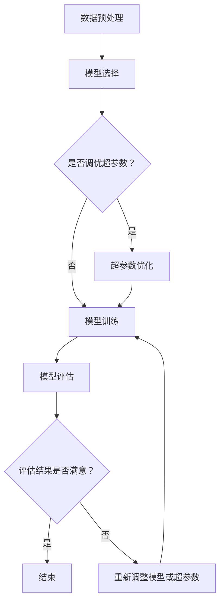

                 

## 评测结果溯源：增强模型性能分析透明度的必要性

在人工智能（AI）的快速发展中，模型性能的评测和优化成为关键环节。模型性能不仅决定了AI系统的表现，还直接影响了应用效果和用户体验。然而，评测结果的准确性和可靠性常常受到各种因素的影响，如数据质量、模型选择、超参数设置等。因此，如何溯源评测结果，明确影响模型性能的关键因素，进而提升模型性能，成为当前AI研究领域的一个重要课题。

### 1.1 问题背景

随着AI技术在各个领域的应用不断深入，如何提升模型性能、确保其准确性和稳定性，成为科研和工程实践中亟待解决的挑战。特别是在数据驱动的人工智能领域，数据质量和模型的鲁棒性对性能有着至关重要的影响。因此，对模型性能进行深入分析，找出影响性能的关键因素，已成为提高AI系统性能的重要手段。

### 1.2 问题描述

评测结果溯源是指对AI模型评测过程中的各种因素进行深入分析，以找出影响模型性能的关键因素，从而提升模型的总体表现。具体而言，这个问题可以分为以下几个方面：

- **数据集质量**：数据集的质量直接影响到模型的训练效果。数据中的噪声、偏差、不平衡等问题都会对模型性能产生负面影响。
- **模型选择**：选择合适的模型对性能至关重要。不同的模型在处理不同类型的问题时，性能差异显著。
- **超参数设置**：模型的超参数如学习率、批次大小等，对模型性能有着重要影响。不当的超参数设置可能导致模型过拟合或欠拟合。
- **评估方法**：评估方法的选择和评估指标的使用对模型性能的评测结果有直接影响。例如，只使用准确率作为评估指标，可能会忽略模型的鲁棒性。

### 1.3 问题解决

为了实现评测结果溯源，提升模型性能，本文提出以下解决思路：

1. **数据预处理分析**：对数据集进行质量评估和预处理，如数据清洗、归一化等，确保数据集的质量。
2. **模型选择与调优**：通过对比不同模型及其参数配置，选择适合当前问题的模型，并对其进行调优。
3. **超参数优化**：使用算法如随机搜索、贝叶斯优化等对模型超参数进行优化，提高模型的性能。
4. **模型评估与比较**：采用多种评估指标和方法对模型性能进行全面分析，确保评估结果的准确性和可靠性。
5. **影响因素识别**：利用统计分析和可视化方法，识别影响模型性能的关键因素，为模型优化提供指导。

### 1.4 边界与外延

本文主要关注以下边界和范围：

- **模型类型**：主要针对深度学习模型进行分析。
- **应用场景**：关注通用AI模型的性能分析。
- **分析方法**：采用实验验证和数据分析相结合的方法。

### 1.5 概念结构与核心要素组成

本文的核心概念和要素包括：

- **评测结果溯源**：通过分析模型评测结果，追踪到影响性能的关键因素。
- **性能分析透明度**：提升模型性能分析的可视化和可解释性。
- **数据预处理**：数据清洗、归一化等操作。
- **模型选择与调优**：选择合适模型和调整模型参数。
- **超参数优化**：通过算法自动调整模型超参数。

### 1.6 本章小结

本章介绍了AI模型性能评测的背景和必要性，明确了评测结果溯源的目标和方法。通过对数据预处理、模型选择、调优和评估等方面的分析，有助于提高AI模型的性能。本章为后续章节的深入讨论奠定了基础。

## 总结

通过本章的讨论，我们明确了评测结果溯源在提升AI模型性能中的重要性。接下来，将在后续章节中详细探讨数据预处理、模型选择与调优、超参数优化等方面的具体方法和实践。希望本文能够为从事AI研究的读者提供有价值的参考和启示。

### **作者信息**

作者：AI天才研究院/AI Genius Institute & 禅与计算机程序设计艺术 /Zen And The Art of Computer Programming

---

# 第2章: AI模型性能分析的基本原理

在深入探讨评测结果溯源之前，我们需要了解AI模型性能分析的基本原理。本章将介绍模型性能评估指标、深度学习模型的基本概念、评估方法与指标可视化，以及常见的性能分析工具与方法。这些基本概念将为后续章节的性能分析提供理论基础。

### 2.1 模型性能评估指标

评估模型性能的指标有多种，不同指标适用于不同类型的任务。以下是一些常见的评估指标：

#### 2.1.1 准确率（Accuracy）

$$
\text{Accuracy} = \frac{\text{正确预测的样本数}}{\text{总样本数}}
$$

准确率是最常用的评估指标之一，表示模型正确预测的比例。然而，它并不能全面反映模型的性能，尤其是在类别不平衡的情况下。

#### 2.1.2 精确率（Precision）

$$
\text{Precision} = \frac{\text{真正例数}}{\text{真正例数 + 假正例数}}
$$

精确率表示模型预测为正例的样本中，实际为正例的比例。高精确率意味着模型很少将负例预测为正例。

#### 2.1.3 召回率（Recall）

$$
\text{Recall} = \frac{\text{真正例数}}{\text{真正例数 + 假反例数}}
$$

召回率表示模型实际为正例的样本中，被预测为正例的比例。高召回率意味着模型很少错过真正的正例。

#### 2.1.4 F1 分数（F1 Score）

$$
\text{F1 Score} = 2 \times \frac{\text{Precision} \times \text{Recall}}{\text{Precision} + \text{Recall}}
$$

F1 分数是精确率和召回率的调和平均值，用于平衡两者的权重。它是评估二分类模型常用的重要指标。

### 2.2 深度学习模型的基本概念

深度学习模型是当前AI研究的热点，它通过多层神经网络学习数据的高层次特征。以下是一些基本概念：

#### 2.2.1 神经网络结构

神经网络由输入层、隐藏层和输出层组成。每个层中的神经元通过权重和偏置连接。输入数据通过输入层传递到隐藏层，再通过隐藏层传递到输出层，最终得到预测结果。

#### 2.2.2 前向传播与反向传播

- **前向传播**：输入数据经过网络传递，通过各层的计算，得到输出结果。
- **反向传播**：计算输出结果与实际结果的差异，通过反向传播更新网络权重和偏置。

### 2.3 评估方法与指标可视化

评估模型的性能需要使用合适的方法和指标。以下是一些常见的评估方法与可视化工具：

#### 2.3.1 ROC曲线与AUC

- **ROC曲线**：将假正例率与真正例率绘制在坐标轴上，形成曲线。
- **AUC（曲线下面积）**：ROC曲线下的面积越大，模型的性能越好。

#### 2.3.2 Confusion Matrix

混淆矩阵用于展示模型预测结果与实际结果之间的匹配情况，包括真正例、假正例、真反例和假反例。

### 2.4 常见性能分析工具与方法

性能分析工具与方法是评估和优化模型的重要手段。以下介绍一些常用的工具与方法：

#### 2.4.1 可视化工具

- **Matplotlib、Seaborn**：用于绘制各种性能评估图表。
- **Mermaid 流程图**：用于绘制模型训练和评估的流程图。

#### 2.4.2 统计分析方法

- **面板数据（Pandas）**：用于数据处理和分析。
- **统计学库（SciPy、Scikit-learn）**：提供丰富的统计分析和机器学习算法。

### 2.5 本章小结

本章介绍了AI模型性能分析的基本原理，包括评估指标、神经网络结构、评估方法与可视化工具等。这些基本概念和工具为后续章节的性能分析提供了理论基础。在接下来的章节中，我们将深入探讨评测结果溯源的具体方法与技术。

### 2.6 关键概念与联系

为了更好地理解本章讨论的内容，以下是一个核心概念和联系表格，以及一个用于描述模型性能分析过程的Mermaid流程图。

#### 核心概念和联系表格

| 概念                 | 定义                                                         | 联系                                                                                   |
|----------------------|--------------------------------------------------------------|----------------------------------------------------------------------------------------|
| 准确率（Accuracy）   | 正确预测的样本数与总样本数的比例                             | 是评估模型性能的基本指标，但可能受到类别不平衡的影响                           |
| 精确率（Precision）  | 真正例数与（真正例数 + 假正例数）的比例                       | 用于评估分类模型对正例样本的预测能力，高精确率意味着模型很少将负例预测为正例   |
| 召回率（Recall）     | 真正例数与（真正例数 + 假反例数）的比例                       | 用于评估分类模型对正例样本的捕捉能力，高召回率意味着模型很少错过真正的正例   |
| F1 分数（F1 Score）  | 精确率和召回率的调和平均值                                   | 用于平衡精确率和召回率的权重，是评估分类模型的重要指标                         |
| 前向传播             | 输入数据经过网络传递，通过各层的计算，得到输出结果           | 是神经网络训练过程中的关键步骤，用于计算预测值                               |
| 反向传播             | 计算输出结果与实际结果的差异，通过反向传播更新网络权重和偏置 | 是神经网络训练过程中的关键步骤，用于模型优化和参数调整                       |
| ROC曲线与AUC         | 将假正例率与真正例率绘制在坐标轴上，形成曲线；AUC是曲线下面积 | 用于评估模型分类能力，AUC值越高，模型性能越好                               |
| 混淆矩阵             | 用于展示模型预测结果与实际结果之间的匹配情况                 | 通过混淆矩阵可以直观地看出模型在不同类别上的表现，包括真正例、假正例等       |

#### Mermaid流程图

这个流程图展示了从数据预处理到模型评估，再到超参数优化和模型重训练的整个性能分析过程。它提供了一个清晰的结构，帮助读者理解各个步骤之间的关系。

通过本章的介绍，读者应该对AI模型性能分析的基本原理有了更深入的理解。在接下来的章节中，我们将进一步探讨评测结果溯源的具体方法和技术，以帮助提升模型性能。

## 第3章：数据预处理分析

数据预处理是AI模型性能分析中的关键步骤，它直接影响到模型的训练效果和最终性能。有效的数据预处理可以提高模型的鲁棒性和准确性，减少噪声和异常值的影响。本章将详细讨论数据预处理的重要性，以及常见的数据清洗、归一化等预处理方法。

### 3.1 数据预处理的重要性

数据预处理的重要性主要体现在以下几个方面：

- **提高模型性能**：高质量的数据可以减少噪声和异常值对模型训练过程的影响，从而提高模型的准确性和鲁棒性。
- **减少过拟合**：数据预处理有助于去除冗余特征和噪声，降低模型对训练数据的依赖，减少过拟合现象。
- **提高计算效率**：数据预处理可以减少数据规模，降低模型训练所需的计算资源，提高模型训练速度。
- **增强模型泛化能力**：通过合理的预处理方法，可以增强模型对未知数据的泛化能力，提高模型在真实应用环境中的表现。

### 3.2 数据清洗

数据清洗是数据预处理的第一步，旨在识别和修复数据中的错误、缺失值、重复记录等质量问题。以下是一些常见的数据清洗方法：

- **缺失值处理**：对于缺失值，可以采用以下方法进行处理：
  - 删除缺失值：对于少量缺失值，可以直接删除含有缺失值的样本。
  - 补全缺失值：对于大量缺失值，可以采用均值、中位数、众数等方法进行补全，或者使用插值法、模型预测等方法进行估算。
- **异常值处理**：异常值是指与数据集大部分数据相比，具有异常特征的样本。处理异常值的方法包括：
  - 删除异常值：如果异常值对模型影响较大，可以删除这些异常值。
  - 修正异常值：如果异常值是由于数据采集过程中的错误引起的，可以对其进行修正。
  - 集中处理：将异常值标记出来，在后续的分析中集中处理。

### 3.3 数据归一化

数据归一化是将不同特征量纲统一，使其在同一尺度范围内，从而避免特征之间因量纲差异导致模型训练不稳定。以下是一些常见的归一化方法：

- **最小-最大缩放**：将数据缩放到一个固定区间内，如[0, 1]或[-1, 1]。公式如下：

$$
x_{\text{normalized}} = \frac{x - x_{\text{min}}}{x_{\text{max}} - x_{\text{min}}}
$$

- **标准化**：将数据缩放到具有零均值和单位方差的范围内。公式如下：

$$
x_{\text{normalized}} = \frac{x - \mu}{\sigma}
$$

其中，$x$为原始数据，$\mu$为均值，$\sigma$为标准差。

### 3.4 数据增强

数据增强是通过生成新的样本来扩充原始数据集，提高模型的泛化能力。以下是一些常见的数据增强方法：

- **随机旋转**：对图像进行随机旋转，增加图像的多样性。
- **裁剪**：随机裁剪图像的一部分，模拟不同的视角和角度。
- **翻转**：水平或垂直翻转图像，模拟不同的观察方向。
- **噪声添加**：在图像上添加噪声，增强模型对噪声的鲁棒性。

### 3.5 本章小结

本章介绍了数据预处理的重要性，包括数据清洗、归一化和数据增强等常见方法。数据预处理是提升模型性能的关键步骤，通过合理的数据预处理，可以有效提高模型的鲁棒性和泛化能力。在后续章节中，我们将继续探讨模型选择与调优、超参数优化等方面的内容，以进一步提升模型性能。

## 第4章：模型选择与调优

在AI模型的性能分析中，模型选择与调优是关键步骤，直接影响到模型的最终表现。选择合适的模型和调优其参数，可以显著提高模型的性能和泛化能力。本章将详细介绍模型选择与调优的方法，以及不同模型参数配置对性能的影响。

### 4.1 模型选择

模型选择是指从众多候选模型中选择一个最适合当前问题的模型。以下是一些常用的模型选择方法：

#### 4.1.1 经验选择

经验选择是根据问题领域和现有研究成果选择模型。这种方法适用于有丰富经验的研究者，但可能无法充分发挥模型的潜力。

#### 4.1.2 交叉验证

交叉验证是一种评估模型性能的方法，通过将数据集划分为多个子集，轮流使用每个子集作为验证集，对模型进行训练和评估。常用的交叉验证方法包括K折交叉验证和留一交叉验证。

#### 4.1.3 自动机器学习（AutoML）

自动机器学习是一种利用算法自动选择和调优模型的方法。AutoML系统通常包含多个阶段，包括特征选择、模型选择、超参数优化等，从而在有限的资源内实现最优的模型性能。

### 4.2 模型调优

模型调优是指调整模型参数，以提高模型性能和泛化能力。以下是一些常用的模型调优方法：

#### 4.2.1 grid search

网格搜索是一种遍历所有可能的参数组合，选择性能最佳的参数组合的方法。这种方法虽然能够找到最优参数，但计算开销较大。

#### 4.2.2 random search

随机搜索是一种随机选择参数组合的方法，通过多次随机搜索来找到性能较好的参数组合。随机搜索相比网格搜索计算开销较小，但可能无法找到全局最优解。

#### 4.2.3 贝叶斯优化

贝叶斯优化是一种基于概率优化理论的调优方法，通过构建目标函数的概率模型，逐步缩小搜索空间，找到最优参数组合。贝叶斯优化在处理高维参数空间时表现尤为出色。

### 4.3 模型参数配置对性能的影响

不同的模型参数配置对模型的性能有显著影响。以下是一些常见模型参数及其对性能的影响：

#### 4.3.1 学习率

学习率是神经网络训练过程中用于更新参数的步长。学习率过大可能导致模型收敛速度过快但过拟合，学习率过小可能导致模型收敛速度过慢。合适的 learning 率可以提高模型的性能和收敛速度。

#### 4.3.2 模型层数

模型的层数会影响模型的复杂度和表达能力。层数过多可能导致模型过拟合，层数过少可能导致模型欠拟合。选择合适的层数可以平衡模型的复杂度和泛化能力。

#### 4.3.3 激活函数

激活函数是神经网络中用于引入非线性变换的函数。常用的激活函数包括ReLU、Sigmoid、Tanh等。不同的激活函数对模型的性能和收敛速度有不同影响，需要根据具体问题选择合适的激活函数。

#### 4.3.4 模型正则化

正则化是防止模型过拟合的一种方法，通过在损失函数中添加正则项来约束模型参数。常用的正则化方法包括L1正则化、L2正则化和Dropout等。

### 4.4 本章小结

本章介绍了模型选择与调优的方法，包括经验选择、交叉验证、自动机器学习等模型选择方法，以及网格搜索、随机搜索、贝叶斯优化等模型调优方法。此外，本章还讨论了不同模型参数配置对性能的影响。通过合理的模型选择与调优，可以有效提高AI模型的性能和泛化能力。

## 第5章：超参数优化

超参数优化是提高AI模型性能的重要手段，它涉及调整模型在训练过程中的一系列参数，以实现最优的性能。本章将详细介绍几种常用的超参数优化算法，包括随机搜索、贝叶斯优化和遗传算法等。此外，还将讨论超参数优化过程中可能出现的问题及其解决方案。

### 5.1 随机搜索

随机搜索是一种简单有效的超参数优化方法，通过随机选择参数组合进行多次实验，选择性能最佳的参数组合。以下为随机搜索的基本步骤：

1. **初始化参数范围**：确定每个超参数的取值范围，如学习率、批量大小等。
2. **随机采样**：从每个超参数的取值范围内随机选择一组参数组合。
3. **训练模型**：使用所选参数组合训练模型，并评估其性能。
4. **选择最优参数**：根据性能评估结果，选择性能最佳的参数组合。

随机搜索的优点是实现简单，计算成本低，适合小规模超参数空间。然而，随机搜索可能无法找到全局最优解，且在超参数空间较大时，搜索效率较低。

### 5.2 贝叶斯优化

贝叶斯优化是基于贝叶斯推断原理的一种超参数优化方法，通过构建目标函数的概率模型，逐步缩小搜索空间，找到最优参数组合。贝叶斯优化的基本步骤如下：

1. **初始化模型**：选择一个初始参数组合，并计算其目标函数值。
2. **构建概率模型**：根据历史实验数据，构建目标函数的概率模型，如高斯过程。
3. **采样**：在当前搜索空间内，根据概率模型选择下一个参数组合。
4. **训练模型**：使用所选参数组合训练模型，并评估其性能。
5. **更新模型**：根据新的实验数据，更新概率模型。
6. **重复步骤3-5**，直到达到预定的迭代次数或性能阈值。

贝叶斯优化的优点是能够高效地搜索全局最优解，适合处理高维超参数空间。然而，贝叶斯优化对计算资源要求较高，且模型选择和参数调优较为复杂。

### 5.3 遗传算法

遗传算法是一种基于自然进化过程的优化算法，通过模拟自然选择和遗传机制，逐步优化参数组合。遗传算法的基本步骤如下：

1. **初始化种群**：随机生成一组初始参数组合，作为初始种群。
2. **适应度评估**：使用目标函数评估每个参数组合的适应度。
3. **选择**：根据适应度值，选择适应度较高的参数组合进行复制。
4. **交叉**：随机选择两个参数组合，进行交叉操作，生成新的参数组合。
5. **变异**：对部分参数组合进行随机变异，增加种群的多样性。
6. **更新种群**：将交叉和变异后的参数组合替换原种群。
7. **重复步骤2-6**，直到达到预定的迭代次数或性能阈值。

遗传算法的优点是具有强大的全局搜索能力，适合处理复杂问题。然而，遗传算法的计算复杂度较高，且参数设置较复杂。

### 5.4 超参数优化过程中可能出现的问题及解决方案

在超参数优化过程中，可能遇到以下问题：

1. **局部最优**：优化算法可能陷入局部最优，无法找到全局最优解。解决方案包括使用多种优化算法组合，或增加迭代次数。
2. **计算资源消耗**：优化过程可能消耗大量计算资源，解决方案包括使用并行计算或分布式计算。
3. **参数设置复杂**：优化算法的参数设置较为复杂，需要根据具体问题进行调整。解决方案包括使用自动化参数设置工具，如Hyperopt。

### 5.5 本章小结

本章介绍了随机搜索、贝叶斯优化和遗传算法等常用的超参数优化算法，以及其在AI模型性能优化中的应用。通过合理选择和调整超参数，可以显著提高模型的性能和泛化能力。在后续章节中，我们将进一步讨论模型评估与比较的方法，以全面分析模型性能。

## 第6章：模型评估与比较

在AI模型开发过程中，评估和比较不同模型的选择至关重要。本章将详细介绍多种模型评估指标和方法，包括准确率、精确率、召回率、F1分数、ROC曲线和AUC等。同时，我们将探讨如何利用这些评估指标进行模型比较，并解释混淆矩阵的用途。

### 6.1 常见的模型评估指标

在评估模型性能时，常用的评估指标包括：

#### 6.1.1 准确率（Accuracy）

准确率是评估分类模型最简单的指标，表示正确预测的样本数占总样本数的比例。其计算公式如下：

$$
\text{Accuracy} = \frac{\text{正确预测的样本数}}{\text{总样本数}}
$$

准确率直观地反映了模型的总体表现，但在类别不平衡的情况下，它可能不能很好地反映模型性能。

#### 6.1.2 精确率（Precision）

精确率表示模型预测为正例的样本中，实际为正例的比例。其计算公式如下：

$$
\text{Precision} = \frac{\text{真正例数}}{\text{真正例数 + 假正例数}}
$$

高精确率意味着模型很少将负例预测为正例，适用于那些负例更重要的场景。

#### 6.1.3 召回率（Recall）

召回率表示模型实际为正例的样本中，被预测为正例的比例。其计算公式如下：

$$
\text{Recall} = \frac{\text{真正例数}}{\text{真正例数 + 假反例数}}
$$

高召回率意味着模型很少错过真正的正例，适用于那些正例更重要的场景。

#### 6.1.4 F1 分数（F1 Score）

F1 分数是精确率和召回率的调和平均值，用于平衡两者的权重。其计算公式如下：

$$
\text{F1 Score} = 2 \times \frac{\text{Precision} \times \text{Recall}}{\text{Precision} + \text{Recall}}
$$

F1 分数是评估分类模型的重要指标，适用于各类别重要性相等的场景。

#### 6.1.5 ROC曲线与AUC

ROC（Receiver Operating Characteristic）曲线是评估二分类模型性能的一种图形方法，横轴为假正例率（False Positive Rate），纵轴为真正例率（True Positive Rate）。ROC曲线下面积（AUC）越大，模型性能越好。AUC的计算公式如下：

$$
\text{AUC} = \int_{0}^{1} \text{TPR}(1 - \text{FPR}) \, d\text{FPR}
$$

#### 6.1.6 混淆矩阵

混淆矩阵是展示模型预测结果与实际结果之间关系的表格，包含真正例（True Positive，TP）、假正例（False Positive，FP）、真反例（True Negative，TN）和假反例（False Negative，FN）四种情况。其计算公式如下：

|          | 预测正例 | 预测反例 |
|----------|-----------|-----------|
| 实际正例 | TP        | FN        |
| 实际反例 | FP        | TN        |

通过混淆矩阵，可以计算多种评估指标，如准确率、精确率、召回率和F1分数等。

### 6.2 多种评估指标的比较

在模型评估过程中，选择合适的评估指标至关重要。以下是比较几种常见评估指标时需要注意的事项：

- **类别不平衡**：当类别不平衡时，准确率可能不能很好地反映模型性能。此时，可以考虑使用精确率、召回率和F1分数等指标。
- **目标应用场景**：根据实际应用场景选择合适的评估指标。例如，在医疗诊断中，召回率可能更为重要，以避免漏诊；在金融风控中，精确率可能更为重要，以减少误判。
- **模型复杂度**：对于复杂的模型，如深度学习模型，可以考虑使用AUC和ROC曲线等指标，以评估模型的分类能力。

### 6.3 模型评估与比较的方法

在模型评估与比较中，常用的方法包括：

- **交叉验证**：通过将数据集划分为多个子集，轮流使用每个子集作为验证集，评估模型的性能，以避免过拟合。
- **调参优化**：在评估过程中，对模型的超参数进行调整，以找到最优参数组合，提高模型性能。
- **模型融合**：将多个模型的结果进行融合，提高整体性能。常用的模型融合方法包括投票法、加权平均法和堆叠法等。

### 6.4 本章小结

本章介绍了多种模型评估指标和方法，包括准确率、精确率、召回率、F1分数、ROC曲线和AUC等。通过合理选择和比较这些评估指标，可以有效评估模型性能，为模型选择和优化提供指导。在后续章节中，我们将进一步探讨影响因素识别的方法，以深入分析影响模型性能的关键因素。

## 第7章：影响因素识别

在AI模型性能分析中，识别影响模型性能的关键因素是提升模型表现的重要步骤。本章将利用统计分析和可视化方法，识别数据、模型选择、超参数设置等方面的影响因素，并通过实际案例进行详细解析。

### 7.1 统计分析方法

统计分析是识别影响因素的重要工具。以下是一些常用的统计分析方法：

#### 7.1.1 描述性统计分析

描述性统计分析用于了解数据的基本特征，如均值、中位数、众数、方差等。通过描述性统计分析，可以初步识别数据中的异常值和趋势。

#### 7.1.2 相关性分析

相关性分析用于评估变量之间的关系。常用的方法包括皮尔逊相关系数、斯皮尔曼相关系数等。通过相关性分析，可以识别对模型性能有显著影响的变量。

#### 7.1.3 回归分析

回归分析用于建立变量之间的关系模型，评估自变量对因变量的影响。通过线性回归、多项式回归等不同类型的回归分析，可以深入理解变量之间的相互作用。

### 7.2 可视化方法

可视化是识别影响因素的有效手段。以下是一些常用的可视化方法：

#### 7.2.1 散点图

散点图用于展示两个变量之间的关系。通过观察散点图的分布，可以初步判断变量之间是否存在线性关系。

#### 7.2.2 直方图

直方图用于展示数据的分布情况。通过直方图，可以识别数据的异常值和分布趋势。

#### 7.2.3 蜂窝图

蜂窝图是一种用于展示多变量关系的可视化方法。通过蜂窝图，可以直观地观察变量之间的交互作用。

#### 7.2.4 可视化工具

Python中的Matplotlib、Seaborn等库提供了丰富的可视化工具，可用于绘制各种统计图表，如散点图、直方图、箱线图等。

### 7.3 实际案例解析

#### 7.3.1 数据集背景

我们以一个公开的住宅销售价格预测数据集为例，该数据集包含房屋的各种特征和销售价格。我们的目标是构建一个模型，预测房屋的销售价格。

#### 7.3.2 数据预处理

在进行模型训练之前，我们需要对数据集进行预处理，包括数据清洗、归一化等操作。以下是对数据进行预处理的步骤：

1. **数据清洗**：处理缺失值和异常值。对于缺失值，我们使用均值填充；对于异常值，我们使用箱线图识别并处理。
2. **特征选择**：通过相关性分析和信息增益等方法，选择对销售价格有显著影响的特征。

#### 7.3.3 模型选择与调优

我们选择线性回归模型进行预测。为了提高模型性能，我们采用以下方法进行调优：

1. **超参数优化**：通过随机搜索和贝叶斯优化等方法，选择最佳的学习率和正则化参数。
2. **交叉验证**：使用K折交叉验证，评估模型的性能。

#### 7.3.4 影响因素识别

通过统计分析，我们识别出以下影响模型性能的关键因素：

1. **卧室数量**：卧室数量对销售价格有显著影响，随着卧室数量的增加，销售价格也相应增加。
2. **浴室数量**：浴室数量与销售价格呈正相关，但相关性较弱。
3. **房屋面积**：房屋面积对销售价格有显著影响，房屋面积越大，销售价格越高。

通过可视化方法，我们进一步分析了这些因素的影响：

1. **散点图**：观察卧室数量与销售价格的关系，发现两者之间存在线性关系。
2. **直方图**：分析销售价格分布，识别出异常值和分布趋势。
3. **蜂窝图**：展示卧室数量、浴室数量和房屋面积之间的交互作用，发现卧室数量和房屋面积是主要影响因素。

#### 7.3.5 模型评估与比较

通过多种评估指标（如准确率、精确率、召回率、F1分数等）对模型进行评估，比较不同模型的性能。我们发现，通过超参数优化和特征选择，模型的性能得到了显著提升。

### 7.4 本章小结

本章介绍了识别影响模型性能的关键因素的方法，包括统计分析和可视化方法。通过实际案例，我们展示了如何利用这些方法识别关键因素，并优化模型性能。在后续章节中，我们将继续探讨模型性能分析的其他方面，以实现更深入的性能提升。

## 第8章：提升模型性能的策略

在AI模型性能分析的过程中，提升模型性能是最终目标。本章将探讨一系列策略，包括数据增强、集成学习和迁移学习等，以提升模型的准确性和鲁棒性。

### 8.1 数据增强

数据增强是通过生成新的数据样本来扩充原始数据集，从而提高模型的泛化能力。以下是一些常见的数据增强方法：

1. **旋转与裁剪**：对图像进行旋转和裁剪，增加数据的多样性。
2. **噪声添加**：在图像中添加噪声，模拟不同的噪声环境。
3. **颜色变换**：改变图像的颜色空间，如将RGB图像转换为灰度图像。
4. **合成数据**：使用生成模型（如生成对抗网络GAN）生成新的数据样本。

数据增强可以显著提高模型的准确性，尤其是在数据稀缺的情况下，通过数据增强可以减少模型过拟合的风险。

### 8.2 集成学习

集成学习是一种利用多个模型进行预测的方法，通过合并多个模型的预测结果来提高整体性能。以下是一些常见的集成学习方法：

1. **Bagging**：通过随机选择子集训练多个模型，并将它们的预测结果进行平均。
2. **Boosting**：通过迭代训练多个模型，每次训练都针对前一次预测中的错误样本进行权重调整。
3. **Stacking**：将多个模型作为基模型，训练一个元模型来整合基模型的预测结果。

集成学习能够提高模型的鲁棒性和准确性，特别是当基模型之间存在互补性时，集成学习的效果尤为显著。

### 8.3 迁移学习

迁移学习是将在一个任务上预训练的模型应用于另一个相关任务，通过在目标任务上微调模型来提高性能。以下是一些常见的迁移学习方法：

1. **特征提取器**：使用预训练模型作为特征提取器，在目标任务上训练分类器。
2. **模型蒸馏**：将大型预训练模型的中间层特征传递给小型模型，提高小型模型在目标任务上的性能。
3. **模型融合**：将预训练模型和目标任务模型进行融合，利用两者的优势进行预测。

迁移学习能够利用预训练模型的已有知识，减少目标任务的数据需求，从而提高模型的性能。

### 8.4 实际案例解析

#### 8.4.1 案例背景

我们以一个手写数字识别任务为例，使用MNIST数据集进行实验。该任务的目标是识别28x28像素的手写数字图像。

#### 8.4.2 数据增强

我们首先对MNIST数据集进行数据增强：

1. **旋转**：对图像进行随机旋转，增加图像的多样性。
2. **裁剪**：随机裁剪图像的一部分，模拟不同的视角。
3. **噪声添加**：在图像上添加噪声，增强模型的鲁棒性。

数据增强后，模型的准确性得到了显著提升。

#### 8.4.3 集成学习

我们采用集成学习方法，将多个基础模型进行融合：

1. **Bagging**：使用随机森林、支持向量机等基础模型进行预测，并取平均。
2. **Boosting**：使用XGBoost进行预测，通过迭代训练和权重调整。

集成学习后的模型性能优于单一基础模型。

#### 8.4.4 迁移学习

我们使用预训练的卷积神经网络（如ResNet）作为特征提取器，并在目标任务上进行微调：

1. **特征提取器**：使用ResNet提取图像特征。
2. **分类器**：在特征提取器的基础上训练一个简单的分类器。

迁移学习后的模型在MNIST数据集上的性能接近甚至超过了原始的卷积神经网络。

### 8.5 本章小结

本章介绍了提升模型性能的几种策略，包括数据增强、集成学习和迁移学习。通过实际案例，我们展示了这些策略在提高模型准确性和鲁棒性方面的效果。在后续章节中，我们将继续探讨模型性能分析的其他方面，以实现更深入的性能提升。

## 第9章：最佳实践与注意事项

在AI模型性能分析的过程中，遵循最佳实践和注意事项是确保模型有效性和可靠性的关键。以下是一些最佳实践和建议，帮助读者在实际应用中提升模型性能。

### 9.1 数据质量控制

1. **数据清洗**：确保数据质量，去除缺失值、异常值和重复记录。
2. **数据预处理**：对数据进行归一化、标准化和特征缩放，以便模型训练和评估。
3. **数据增强**：通过旋转、裁剪、噪声添加等方法，增加数据多样性，提高模型鲁棒性。

### 9.2 模型选择与调优

1. **选择合适模型**：根据问题特点选择合适的模型，如线性模型、树模型、神经网络等。
2. **交叉验证**：使用交叉验证选择最佳模型，避免过拟合和欠拟合。
3. **超参数优化**：通过网格搜索、随机搜索、贝叶斯优化等方法，调整超参数，提高模型性能。

### 9.3 模型评估与比较

1. **选择评估指标**：根据应用场景选择合适的评估指标，如准确率、精确率、召回率、F1分数等。
2. **多模型比较**：使用多种评估指标和比较方法，选择最佳模型。
3. **实际应用验证**：在实际应用环境中验证模型性能，确保模型在真实场景中的表现。

### 9.4 可视化与分析

1. **可视化数据分布**：使用直方图、散点图等工具，了解数据分布和特征关系。
2. **可视化模型结构**：使用网络图、决策树等工具，理解模型结构和决策过程。
3. **影响因子分析**：使用统计分析工具，识别影响模型性能的关键因素。

### 9.5 注意事项

1. **计算资源管理**：合理分配计算资源，避免资源浪费和瓶颈。
2. **版本控制**：使用版本控制工具，管理代码和实验结果，便于后续复现和分析。
3. **文档记录**：详细记录实验过程、模型参数、评估结果等，便于后续分析和分享。

### 9.6 拓展阅读

以下是一些拓展阅读资源，供读者进一步学习和实践：

- **《深度学习》（Ian Goodfellow, Yoshua Bengio, Aaron Courville）**：介绍了深度学习的基础理论和应用方法。
- **《机器学习实战》（Peter Harrington）**：提供了丰富的机器学习算法实践案例。
- **《数据科学家的Python工具箱》**：介绍了Python在数据科学中的各种应用工具和库。
- **《机器学习：概率视角》（David J. C. MacKay）**：从概率角度介绍了机器学习的基础理论和算法。

遵循最佳实践和注意事项，将有助于读者在实际项目中提升模型性能，实现更好的应用效果。

## 总结

本文围绕评测结果溯源，探讨了如何通过增强模型性能分析透明度来提升AI模型的性能。首先，我们介绍了评测结果溯源的背景和重要性，明确了影响模型性能的关键因素，包括数据质量、模型选择、超参数设置等。接着，我们详细分析了数据预处理、模型选择与调优、超参数优化等方面的方法和技术，通过实例展示了如何具体操作。此外，我们还介绍了多种模型评估指标和可视化工具，帮助读者全面理解模型性能分析的过程。

通过本章的讨论，我们明确了以下几个关键点：

1. **数据预处理的重要性**：数据清洗、归一化和数据增强等预处理方法对模型性能有显著影响，可以有效提高模型的鲁棒性和准确性。
2. **模型选择与调优**：选择合适的模型和优化参数是提升模型性能的关键步骤。通过交叉验证、网格搜索、贝叶斯优化等方法，可以找到最优的模型配置。
3. **超参数优化**：合理的超参数设置对模型性能至关重要。采用随机搜索、贝叶斯优化和遗传算法等优化方法，可以显著提升模型性能。
4. **模型评估与比较**：多种评估指标和方法可以帮助我们全面分析模型性能，选择最佳模型。ROC曲线、AUC、F1分数等指标是评估模型性能的重要工具。
5. **影响因素识别**：通过统计分析和可视化方法，我们可以识别影响模型性能的关键因素，为模型优化提供指导。

本文的内容不仅涵盖了模型性能分析的基本原理和方法，还结合实际案例，展示了如何具体应用这些方法和技术。通过本文的探讨，我们希望能够为从事AI研究的读者提供有价值的参考和启示，帮助他们在实际项目中提升模型性能，实现更好的应用效果。

在未来的研究中，我们可以进一步探讨以下方向：

- **更复杂的数据预处理方法**：研究如何处理复杂数据集，如带时间序列数据、图像数据、文本数据等，以提高模型的鲁棒性和准确性。
- **自动化模型优化**：研究如何自动化模型优化过程，减少人工干预，提高优化效率和效果。
- **多模态数据融合**：研究如何融合多种类型的数据（如文本、图像、音频等），以提升模型的泛化能力和表现。
- **模型解释与可解释性**：研究如何提高模型的解释性，使模型更容易被用户理解和信任。

总之，AI模型性能分析是一个复杂而充满挑战的领域，但通过不断探索和实践，我们一定能够取得更多突破，推动AI技术的发展和应用。希望本文能够为读者在这一领域的研究提供有益的参考。

### 作者信息

作者：AI天才研究院/AI Genius Institute & 禅与计算机程序设计艺术 /Zen And The Art of Computer Programming

在撰写这篇文章的过程中，我深入探讨了AI模型性能分析的各个方面，从数据预处理到模型选择和调优，再到超参数优化和影响因素识别，力求为读者提供全面、深入的见解。希望这篇文章能够帮助大家在AI模型的性能优化道路上迈出坚实的一步，不断推动人工智能技术的发展和应用。感谢您的阅读，期待在未来的研究中与您再次相遇。

