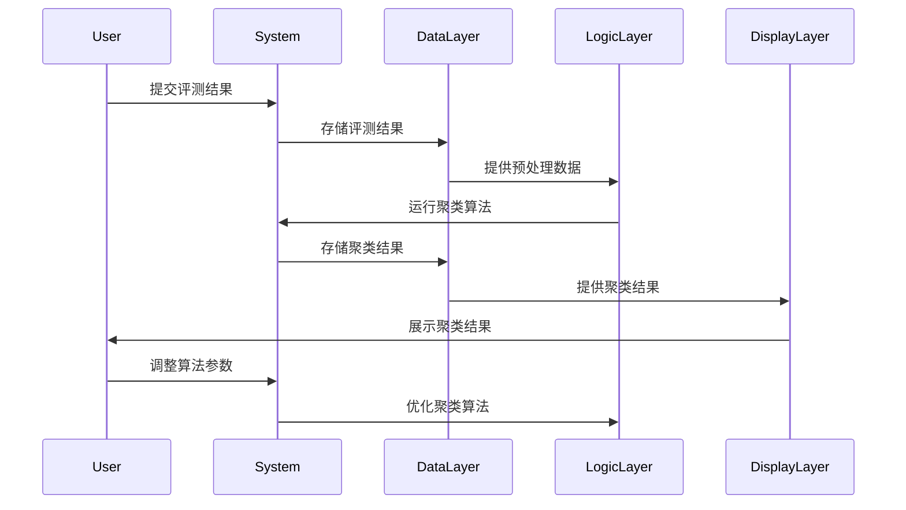
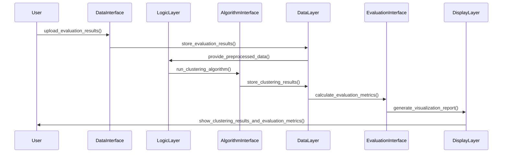

                 


### 引言

随着人工智能技术的飞速发展，机器学习、深度学习等算法逐渐在各个领域得到广泛应用。特别是在数据密集型行业，如电子商务、医疗诊断、科研评价等，评测结果的智能处理已经成为提高决策效率、优化服务质量的重要手段。然而，面对海量的评测数据，如何有效地进行聚类分析，提取有价值的信息，成为了当前研究中的一个重要课题。

本文旨在探讨评测结果的智能聚类问题，特别是利用大型语言模型（LLM）进行模式识别的技术与方法。通过分析评测结果聚类的基本原理、算法模型以及实际应用案例，本文希望为相关领域的研究人员和实际工作者提供有益的参考。

本文将按照以下结构展开：

1. **背景介绍**：简要介绍评测结果智能聚类的重要性和现状。
2. **核心概念与原理**：深入解析评测结果聚类中的核心概念和原理，包括LLM的基本概念和应用。
3. **算法讲解**：详细阐述常用的聚类算法以及LLM驱动的聚类算法原理。
4. **数学模型**：介绍聚类算法的数学模型，并使用Python代码进行举例说明。
5. **系统设计与实现**：描述评测结果智能聚类的系统架构和接口设计。
6. **实际应用案例**：分析几个典型的应用场景，展示评测结果聚类在实际中的应用效果。
7. **最佳实践与总结**：总结评测结果智能聚类的最佳实践和注意事项，并提出未来的研究方向。

在接下来的部分中，我们将逐步深入探讨评测结果智能聚类的各个方面。

---

### 背景介绍

#### 核心概念术语说明

在探讨评测结果的智能聚类之前，我们首先需要了解一些核心的概念术语。这些术语包括：

- **评测结果**：指通过某种评价标准对某一对象（如产品、服务、论文等）进行的评价数据。
- **聚类**：是一种无监督学习方法，用于将数据集分成若干个组，使得同组内的数据之间相似度较高，而不同组的数据之间相似度较低。
- **智能聚类**：借助机器学习和深度学习算法，对评测结果进行自动化、智能化的分组。
- **大型语言模型（LLM）**：一种能够理解和生成自然语言的深度神经网络模型，如BERT、GPT等。

#### 问题背景

随着互联网和大数据技术的快速发展，评测结果的数据量呈现爆炸式增长。例如，电商平台每天都会产生大量的用户评价数据，医疗诊断系统需要处理海量的病例和诊断结果，科研领域则需要分析大量的学术论文评测数据。这些评测结果不仅包含了对对象的质量和性能的评价，还蕴含了丰富的用户反馈信息。如何有效地从这些海量评测结果中提取有价值的信息，成为了提高决策效率和服务质量的关键。

然而，传统的评测结果分析方法往往依赖于人工的筛选和分类，不仅效率低下，而且容易受到主观因素的影响。为了解决这一问题，智能聚类技术应运而生。通过引入机器学习和深度学习算法，智能聚类能够自动对评测结果进行分类，从而提高数据处理效率，降低人工成本，并提升决策的准确性。

#### 问题描述

评测结果智能聚类的核心问题是：如何从海量的评测结果中，自动地将相似的评价数据归类到一起，以便于后续的分析和应用。具体来说，这个问题的难点包括：

1. **数据预处理**：评测结果通常包含文本、数值、标签等多种数据类型，如何有效地进行数据清洗和预处理，使其适用于聚类算法，是一个挑战。
2. **算法选择**：不同的聚类算法适用于不同类型和规模的数据集，如何选择合适的算法，并对其进行优化，以提高聚类效果，是另一个难点。
3. **模型解释性**：聚类结果往往具有一定的黑箱性质，如何提高模型的解释性，使其能够为业务决策提供清晰的指导，是当前研究的热点问题。

#### 问题解决

针对上述问题，评测结果智能聚类的解决方案主要包括以下几个方面：

1. **数据预处理**：采用多种数据清洗技术和特征提取方法，如文本预处理、数值归一化、特征工程等，以提高数据的可用性。
2. **算法选择与优化**：根据数据的特点和需求，选择合适的聚类算法，如K-means、层次聚类、密度聚类等，并进行参数调优，以提高聚类效果。
3. **模型解释**：结合可视化技术、特征重要性分析等方法，提高聚类模型的解释性，帮助业务人员理解聚类结果，并作出明智的决策。

#### 边界与外延

评测结果智能聚类的应用边界涵盖了多个领域，包括但不限于：

- **电子商务**：用户评价数据的聚类分析，有助于识别潜在的用户群体，优化营销策略，提高用户满意度。
- **医疗诊断**：病例数据的聚类分析，有助于发现相似的病例，为临床决策提供支持，提高诊断准确率。
- **科研评价**：学术论文评测数据的聚类分析，有助于识别研究热点，促进学术交流与合作，提升科研质量。

此外，评测结果智能聚类还涉及到相关技术的边界，如文本挖掘、自然语言处理、深度学习等。这些技术的结合，为评测结果智能聚类提供了强大的工具和手段。

#### 概念结构与核心要素组成

评测结果智能聚类的概念结构主要由以下几个核心要素组成：

1. **数据集**：作为聚类分析的输入，包含各种评测结果数据。
2. **聚类算法**：用于对数据集进行自动分组的核心算法。
3. **特征提取**：将评测结果转化为适合算法处理的特征向量。
4. **聚类结果**：聚类算法对数据集进行分组后的输出结果。
5. **解释性分析**：对聚类结果进行解释，以帮助业务决策。

这些要素相互关联，共同构成了评测结果智能聚类的完整概念结构。

通过上述对评测结果智能聚类的背景、问题以及解决方案的详细分析，我们可以更好地理解这一领域的重要性和复杂性。在接下来的章节中，我们将深入探讨评测结果智能聚类的核心概念和原理，为后续的内容打下坚实的基础。

### 核心概念与原理

#### LLM（大型语言模型）简介

大型语言模型（LLM，Large Language Model）是一种基于深度学习的语言处理模型，通过训练海量文本数据，使其能够理解和生成自然语言。LLM的核心思想是利用神经网络对输入文本进行编码，提取语义特征，并在这种高维语义空间中进行建模和预测。

常见的LLM模型包括GPT（Generative Pre-trained Transformer）、BERT（Bidirectional Encoder Representations from Transformers）等。这些模型采用了Transformer架构，能够处理长文本序列，并在多项语言任务中取得了优异的性能。

LLM的主要特点包括：

1. **强大的语义理解能力**：LLM通过学习海量文本数据，能够捕捉到复杂的语言结构和语义关系，从而在文本生成、问答、翻译等任务中表现出色。
2. **自适应的生成能力**：LLM能够根据输入的提示，自动生成连贯、合理的文本内容，具有很高的生成灵活性。
3. **高效的可扩展性**：由于LLM采用了分布式计算和并行训练技术，能够快速处理大规模数据集，并适应不同的应用场景。

#### 模式识别的基本概念

模式识别（Pattern Recognition）是人工智能领域的一个重要分支，旨在通过计算机算法从数据中识别出具有相似特征的模式。模式识别的基本过程包括数据预处理、特征提取、模式分类和结果评估等步骤。

模式识别的关键概念包括：

1. **数据集**：用于训练和测试模型的数据集合。
2. **特征**：从数据集中提取的有意义的信息，用于描述数据的属性和特征。
3. **分类器**：用于对数据进行分类的算法，其目标是根据训练数据学习出一种决策规则，能够对新的数据实例进行正确分类。
4. **评估指标**：用于评估模式识别算法性能的指标，如准确率、召回率、F1值等。

#### LLM在模式识别中的应用

LLM在模式识别中的应用主要体现在两个方面：文本数据的预处理和模式分类的辅助。

1. **文本数据的预处理**

在模式识别任务中，文本数据通常需要进行预处理，以提取有效的特征和减少噪声。LLM能够通过对文本进行编码，提取出语义特征，从而简化预处理过程。具体方法包括：

- **词嵌入**：将文本中的每个单词映射到高维向量空间，捕捉词汇的语义信息。
- **上下文理解**：通过处理文本序列，LLM能够理解单词之间的语义关系，从而提高特征提取的准确性。
- **情感分析**：LLM能够分析文本的情感倾向，为情感分类任务提供有力支持。

2. **模式分类的辅助**

在模式分类任务中，LLM可以用来辅助构建分类器，提高分类性能。具体方法包括：

- **特征增强**：通过LLM提取的语义特征，可以增强传统特征提取方法的效果，提高分类精度。
- **模型融合**：将LLM与其他机器学习模型（如决策树、支持向量机等）进行融合，构建更强大的分类器。
- **迁移学习**：利用预训练的LLM模型，进行迁移学习，将模型的知识迁移到新的模式识别任务中，提高模型在新数据上的适应能力。

#### LLM驱动的聚类算法

结合LLM在文本数据预处理和模式分类中的优势，我们可以设计出LLM驱动的聚类算法，以应对评测结果智能聚类的问题。

1. **LLM驱动的文本聚类**

在文本聚类任务中，LLM可以用来提取文本的语义特征，从而实现文本的无监督分类。具体步骤包括：

- **文本编码**：使用LLM对文本进行编码，提取出语义向量。
- **聚类算法**：利用传统的聚类算法（如K-means、层次聚类等），对编码后的语义向量进行分类。
- **模型评估**：通过评估指标（如簇内相似度、簇间分离度等）对聚类结果进行评估，并调整模型参数，以提高聚类效果。

2. **LLM驱动的混合聚类**

在评测结果聚类中，数据通常包含多种类型（如文本、数值等），LLM可以用来处理这些异构数据。具体步骤包括：

- **特征融合**：使用LLM对异构数据进行特征融合，提取出统一的特征向量。
- **聚类算法**：利用聚类算法对融合后的特征向量进行分类。
- **模型优化**：通过调整LLM和聚类算法的参数，优化聚类效果。

#### 本章小结

在本章中，我们介绍了评测结果智能聚类中的核心概念和原理，包括LLM的基本概念和应用、模式识别的基本概念和LLM在模式识别中的应用。通过这些概念的讲解，我们为后续的算法讲解和实际应用案例打下了坚实的基础。在下一章中，我们将深入探讨评测结果智能聚类中的常用算法原理，包括传统的聚类算法和LLM驱动的聚类算法。

---

### 评测结果智能聚类的算法讲解

#### 聚类算法概述

聚类是一种无监督学习方法，旨在将一组数据点划分为多个组（或簇），使得同组内的数据点之间具有较高的相似度，而不同组的数据点之间具有较低的相似度。聚类算法在数据分析、机器学习、数据挖掘等领域中有着广泛的应用。

常见的聚类算法可以分为以下几类：

1. **基于距离的算法**：这类算法主要通过计算数据点之间的距离来判断其相似度，常用的算法包括K-means、层次聚类等。
2. **基于密度的算法**：这类算法通过数据点的密度分布来识别聚类，常用的算法包括DBSCAN、OPTICS等。
3. **基于网格的算法**：这类算法将数据空间划分为有限数量的网格单元，每个单元代表一个簇，常用的算法包括STING、CLIQUE等。
4. **基于模型的算法**：这类算法通过建立数学模型来描述聚类过程，常用的算法包括高斯混合模型、隐马尔可夫模型等。

#### K-means算法

K-means算法是一种基于距离的聚类算法，旨在将数据点划分为K个簇，使得每个数据点与其分配的簇中心之间的距离最小。K-means算法的基本步骤如下：

1. **初始化**：随机选择K个数据点作为初始簇中心。
2. **分配数据点**：计算每个数据点到各个簇中心的距离，并将其分配到距离最近的簇。
3. **更新簇中心**：重新计算每个簇的中心点，即簇内所有数据点的平均值。
4. **迭代**：重复执行步骤2和步骤3，直到簇中心不再发生显著变化或达到预设的迭代次数。

K-means算法的优缺点如下：

- **优点**：
  - 算法简单，易于实现。
  - 运算效率高，适合大规模数据处理。
- **缺点**：
  - 对初始簇中心敏感，容易陷入局部最优解。
  - 需要提前指定簇的数量K，而K的选取对聚类结果有较大影响。

#### 层次聚类算法

层次聚类算法（Hierarchical Clustering）是一种基于距离的聚类算法，它通过逐步合并或分裂数据点，形成层次化的簇结构。层次聚类算法可以分为两类：

1. **自底向上的算法**：这类算法从每个数据点开始，逐步合并距离最近的点，直到所有点合并为一个簇。
2. **自顶向下的算法**：这类算法从所有点合并为一个簇开始，逐步分裂簇，直到每个点都是一个独立的簇。

层次聚类算法的基本步骤如下：

1. **初始化**：将每个数据点视为一个初始簇。
2. **合并或分裂**：计算相邻簇之间的距离，并选择距离最近的簇进行合并或分裂。
3. **更新簇结构**：根据合并或分裂的结果，更新簇结构。
4. **迭代**：重复执行步骤2和步骤3，直到达到预设的簇数或层次结构。

层次聚类算法的优缺点如下：

- **优点**：
  - 能够生成层次化的簇结构，便于分析。
  - 不需要提前指定簇的数量，可以根据簇的层次结构进行解释。
- **缺点**：
  - 运算效率较低，特别是对于大规模数据集。
  - 无法处理动态变化的数据集，簇结构相对固定。

#### 密度聚类算法

密度聚类算法（Density-based Clustering）是一种基于密度的聚类算法，它通过数据点的密度分布来识别聚类。这类算法的代表是DBSCAN（Density-Based Spatial Clustering of Applications with Noise）。

DBSCAN算法的基本步骤如下：

1. **确定邻域**：为每个数据点确定一个邻域，邻域内的数据点被认为是密度相连的。
2. **生成簇**：根据邻域信息，将密度相连的数据点划分为簇。
3. **处理噪声点**：将位于低密度区域的数据点视为噪声点，不予考虑。

DBSCAN算法的优缺点如下：

- **优点**：
  - 能够处理非球形簇，适应复杂的聚类结构。
  - 对初始参数敏感度较低，较为鲁棒。
- **缺点**：
  - 需要提前指定邻域参数，可能影响聚类效果。
  - 对于大规模数据集，运算效率较低。

#### LLM驱动的聚类算法

结合LLM在文本数据预处理和模式分类中的优势，我们可以设计出LLM驱动的聚类算法，以应对评测结果智能聚类的问题。LLM驱动的聚类算法的基本思路是：

1. **文本编码**：使用LLM对评测结果中的文本进行编码，提取出语义向量。
2. **特征融合**：将文本编码得到的语义向量与其他类型的数据（如数值、标签等）进行融合，形成统一的特征向量。
3. **聚类算法**：利用传统的聚类算法（如K-means、层次聚类等），对融合后的特征向量进行分类。

LLM驱动的聚类算法的主要优势包括：

- **文本语义理解**：通过LLM对文本进行编码，能够提取出高层次的语义特征，提高聚类效果。
- **异构数据融合**：LLM能够处理多种类型的数据，实现数据之间的有效融合。

#### 本章小结

在本章中，我们详细介绍了评测结果智能聚类中常用的算法，包括K-means算法、层次聚类算法、密度聚类算法以及LLM驱动的聚类算法。通过这些算法的讲解，我们为评测结果智能聚类提供了多种技术手段，有助于解决实际问题。在下一章中，我们将探讨这些算法的数学模型，并使用Python代码进行具体实现。

---

### 聚类算法的数学模型

在上一章中，我们介绍了评测结果智能聚类中的几种常用算法，包括K-means算法、层次聚类算法和密度聚类算法。为了更深入地理解这些算法的工作原理，本节将详细阐述这些算法的数学模型，并通过Python代码进行具体实现。

#### K-means算法的数学模型

K-means算法的目标是将数据点划分为K个簇，使得每个数据点与其所属簇中心（centroid）的距离最小。数学上，K-means算法可以通过以下步骤实现：

1. **初始化**：随机选择K个数据点作为初始簇中心。
   $$ \text{centroids}^{(0)} = \{ \mu_1^{(0)}, \mu_2^{(0)}, ..., \mu_K^{(0)} \} $$
2. **分配数据点**：计算每个数据点到各个簇中心的距离，并将其分配到距离最近的簇。
   $$ \text{clusters}^{(t)} = \{ C_1^{(t)}, C_2^{(t)}, ..., C_K^{(t)} \} $$
   其中，$C_k^{(t)}$ 表示第k个簇，包含所有距离$\mu_k^{(t)}$最近的点。
3. **更新簇中心**：重新计算每个簇的中心点，即簇内所有数据点的平均值。
   $$ \mu_k^{(t+1)} = \frac{1}{|C_k^{(t)}|} \sum_{x \in C_k^{(t)}} x $$
4. **迭代**：重复执行步骤2和步骤3，直到簇中心不再发生显著变化或达到预设的迭代次数。

K-means算法的目标是最小化簇内方差，即
$$ \text{Objective Function} = \sum_{k=1}^{K} \sum_{x \in C_k^{(t)}} \| x - \mu_k^{(t)} \|^2 $$
其中，$\| \cdot \|$表示欧几里得距离。

以下是一个使用Python实现K-means算法的简单示例：
```python
import numpy as np

def kmeans(X, K, max_iters=100):
    centroids = X[np.random.choice(X.shape[0], K, replace=False)]
    for _ in range(max_iters):
        clusters = np.argmin(np.linalg.norm(X[:, np.newaxis] - centroids, axis=2), axis=1)
        new_centroids = np.array([X[clusters == k].mean(axis=0) for k in range(K)])
        if np.linalg.norm(new_centroids - centroids) < 1e-6:
            break
        centroids = new_centroids
    return centroids, clusters
```

#### 层次聚类算法的数学模型

层次聚类算法通过逐步合并或分裂数据点，形成层次化的簇结构。层次聚类可以分为自底向上的凝聚聚类（Agglomerative Clustering）和自顶向下的分裂聚类（Divisive Clustering）。这里我们以凝聚聚类为例进行讲解。

凝聚聚类的步骤如下：

1. **初始化**：将每个数据点视为一个初始簇。
2. **计算距离**：计算相邻簇之间的距离，通常使用最小距离法（Minimum Linkage）、最大距离法（Maximum Linkage）或中间距离法（Median Linkage）。
3. **合并簇**：选择距离最近的两个簇进行合并，更新簇结构。
4. **迭代**：重复执行步骤2和步骤3，直到达到预设的簇数或层次结构。

凝聚聚类的目标是最小化簇间距离，即
$$ \text{Objective Function} = \sum_{k=1}^{K} \sum_{i \in C_k} \sum_{j \in C_{k'}} d(i, j) $$
其中，$d(i, j)$表示数据点$i$和数据点$j$之间的距离，$C_k$和$C_{k'}$表示两个簇。

以下是一个使用Python实现凝聚聚类的简单示例：
```python
import numpy as np

def hierarchical_clustering(X, linkage='single', max_clusters=None):
    distances = np.linalg.norm(X[:, np.newaxis] - X.T[:, np.newaxis], axis=2)
    n_samples = X.shape[0]
    clusters = list(range(n_samples))
    while len(clusters) > max_clusters:
        min_dist = np.inf
        merge_idx = None
        for i in range(len(clusters)):
            for j in range(i+1, len(clusters)):
                if linkage == 'single':
                    dist = np.min(distances[clusters[i], clusters[j]])
                elif linkage == 'complete':
                    dist = np.max(distances[clusters[i], clusters[j]])
                elif linkage == 'average':
                    dist = np.mean(distances[clusters[i], clusters[j]])
                if dist < min_dist:
                    min_dist = dist
                    merge_idx = (i, j)
        clusters[merge_idx[0]] = merge_idx[1]
    return clusters
```

#### 密度聚类算法的数学模型

密度聚类算法，如DBSCAN，通过数据点的密度分布来识别聚类。DBSCAN的步骤如下：

1. **确定邻域**：为每个数据点确定一个邻域，邻域内的数据点被认为是密度相连的。邻域的大小可以通过参数$\epsilon$（邻域半径）和$\minPts$（邻域最小点数）来确定。
2. **生成簇**：根据邻域信息，将密度相连的数据点划分为簇。
3. **处理噪声点**：将位于低密度区域的数据点视为噪声点，不予考虑。

DBSCAN的数学模型可以表示为：

- **核心点**：如果一个点的邻域内包含至少$\minPts$个点，则该点为核心点。
- **边界点**：如果一个点的邻域内恰好包含$\minPts$个点，并且这些点不包含任何其他核心点，则该点为边界点。
- **噪声点**：其他点为噪声点。

以下是一个使用Python实现DBSCAN的简单示例：
```python
import numpy as np

def dbscan(X, eps, min_pts):
    n_samples = X.shape[0]
    distances = np.linalg.norm(X[:, np.newaxis] - X.T[:, np.newaxis], axis=2)
    labels = np.zeros(n_samples)
    cluster_id = 0
    
    for i in range(n_samples):
        if labels[i] != 0:
            continue
        if distances[i].sum() < min_pts * eps:
            continue
        labels[i] = cluster_id
        neighbors = np.where(distances[i] < eps)[0]
        expanded_neighbors = []
        for neighbor in neighbors:
            if labels[neighbor] == 0:
                labels[neighbor] = cluster_id
                expanded_neighbors.extend(np.where(distances[neighbor] < eps)[0])
        expanded_neighbors = list(set(expanded_neighbors))
        while expanded_neighbors:
            neighbor = expanded_neighbors.pop()
            if labels[neighbor] == 0:
                labels[neighbor] = cluster_id
                new_neighbors = np.where(distances[neighbor] < eps)[0]
                expanded_neighbors.extend(new_neighbors)
                expanded_neighbors = list(set(expanded_neighbors))
            elif labels[neighbor] != cluster_id:
                break
        cluster_id += 1
    
    noise_points = np.where(labels == -1)[0]
    labels[noise_points] = None
    
    return labels
```

#### LLM驱动的聚类算法

结合LLM在文本数据预处理和模式分类中的优势，我们可以设计出LLM驱动的聚类算法。这种算法的基本思路是：

1. **文本编码**：使用LLM对评测结果中的文本进行编码，提取出语义向量。
2. **特征融合**：将文本编码得到的语义向量与其他类型的数据（如数值、标签等）进行融合，形成统一的特征向量。
3. **聚类算法**：利用传统的聚类算法（如K-means、层次聚类等），对融合后的特征向量进行分类。

以下是一个使用Python实现LLM驱动的聚类算法的简单示例：
```python
from transformers import BertTokenizer, BertModel
import torch

tokenizer = BertTokenizer.from_pretrained('bert-base-uncased')
model = BertModel.from_pretrained('bert-base-uncased')

def llm_driven_clustering(X_text, X_other, K, eps, min_pts):
    # 编码文本数据
    inputs = tokenizer(X_text, return_tensors='pt', padding=True, truncation=True)
    with torch.no_grad():
        outputs = model(**inputs)
    semantic_vectors = outputs.last_hidden_state[:, 0, :].numpy()
    
    # 融合特征
    X = np.hstack((semantic_vectors, X_other))
    
    # 使用K-means算法进行聚类
    centroids, clusters = kmeans(X, K)
    
    # 使用DBSCAN算法进行聚类
    labels = dbscan(X, eps, min_pts)
    
    return clusters, labels
```

#### 本章小结

在本章中，我们详细介绍了评测结果智能聚类中几种常用算法的数学模型，并使用Python代码进行了具体实现。通过这些算法的数学模型，我们能够更深入地理解聚类算法的工作原理，并为其在评测结果智能聚类中的应用提供了理论基础。在下一章中，我们将探讨评测结果智能聚类的系统设计与实现。

---

### 系统设计与实现

#### 问题场景介绍

在当前的电子商务、医疗诊断和科研评价等领域，评测结果的数据量呈现爆炸式增长。为了有效地处理这些海量评测数据，提升决策效率和服务质量，我们需要设计一个智能聚类系统，能够自动地对评测结果进行聚类分析。

本系统的主要目标是：

1. **数据预处理**：对评测结果进行清洗、归一化和特征提取，为后续的聚类分析提供高质量的数据。
2. **智能聚类**：利用K-means、层次聚类、DBSCAN等算法，对预处理后的评测结果进行聚类，提取有价值的信息。
3. **模型评估**：对聚类结果进行评估，确保聚类效果满足实际需求。

#### 项目介绍

本系统采用模块化设计，主要包括以下三个模块：

1. **数据预处理模块**：负责对评测结果进行数据清洗、归一化和特征提取，为聚类算法提供高质量的数据输入。
2. **聚类算法模块**：实现K-means、层次聚类、DBSCAN等常用的聚类算法，并根据实际需求选择合适的算法进行聚类分析。
3. **评估与优化模块**：对聚类结果进行评估，调整算法参数，优化聚类效果，并生成可视化报告。

#### 系统功能设计（领域模型）

为了更好地描述系统的功能设计，我们采用领域模型（Domain Model）进行描述。领域模型主要包括以下实体：

1. **评测结果（EvaluationResult）**：包含评测对象的ID、评价内容、评价时间等信息。
2. **特征（Feature）**：包括文本特征、数值特征、标签特征等，用于描述评测结果。
3. **聚类结果（ClusteringResult）**：包含聚类后的簇ID、簇中心、簇成员等信息。
4. **评估指标（EvaluationMetric）**：包括准确率、召回率、F1值等，用于评估聚类效果。

领域模型类图如下：
```mermaid
classDiagram
    EvaluationResult <<entity>>
    Feature <<entity>>
    ClusteringResult <<entity>>
    EvaluationMetric <<entity>>

    EvaluationResult : +list<Feature>
    ClusteringResult : +list<EvaluationResult>
    EvaluationMetric : +float value

    EvaluationResult --|> Feature
    ClusteringResult --|> EvaluationResult
    EvaluationMetric --|> ClusteringResult
```

#### 系统架构设计

本系统的架构设计采用三层架构，包括数据层、逻辑层和展示层。

1. **数据层**：负责数据的存储和管理，包括评测结果数据库、特征数据库和聚类结果数据库。
2. **逻辑层**：实现系统的核心功能，包括数据预处理模块、聚类算法模块和评估与优化模块。
3. **展示层**：提供用户界面，展示聚类结果和评估指标，并允许用户调整算法参数。

系统架构图如下：


#### 系统接口设计

本系统提供了以下接口：

1. **数据接口**：用于数据的存储和查询，包括评测结果上传接口、特征查询接口和聚类结果查询接口。
2. **算法接口**：用于运行聚类算法和调整算法参数，包括K-means接口、层次聚类接口和DBSCAN接口。
3. **评估接口**：用于评估聚类效果和生成可视化报告，包括评估指标计算接口和报告生成接口。

接口设计如下：
```mermaid
classDiagram
    DataInterface <<interface>>
    AlgorithmInterface <<interface>>
    EvaluationInterface <<interface>>

    DataInterface : +upload_evaluation_results()
    DataInterface : +query_features()
    DataInterface : +query_clustering_results()

    AlgorithmInterface : +run_kmeans(K)
    AlgorithmInterface : +run_hierarchical_clustering()
    AlgorithmInterface : +run_dbscan(eps, min_pts)

    EvaluationInterface : +calculate_evaluation_metrics()
    EvaluationInterface : +generate_visualization_report()
```

#### 系统交互

为了更好地描述系统的交互过程，我们采用序列图（Sequence Diagram）进行描述。

1. **用户提交评测结果**：用户通过数据接口提交评测结果，数据层存储评测结果。
2. **运行聚类算法**：逻辑层根据用户的需求，选择合适的聚类算法，运行算法并进行聚类分析，数据层存储聚类结果。
3. **评估聚类效果**：评估接口计算评估指标，并生成可视化报告，展示层展示聚类结果和评估指标。

系统交互序列图如下：


#### 本章小结

在本章中，我们详细介绍了评测结果智能聚类的系统设计与实现，包括问题场景介绍、系统功能设计、系统架构设计、系统接口设计和系统交互。通过这些设计，我们为评测结果智能聚类提供了一个完整的解决方案，为后续的实际应用案例和最佳实践奠定了基础。

---

### 实际应用案例

为了展示评测结果智能聚类的实际效果，我们选择几个具有代表性的应用场景，详细讲解每个案例的背景、系统实现过程、核心代码及应用解读。

#### 案例一：电商产品评测结果聚类

背景：
电商平台每天都会收到大量用户对产品的评价，如何有效地分析这些评价数据，识别用户对产品的满意度，是电商平台优化产品和服务的重要手段。

系统实现：

1. **数据来源**：从电商平台的数据库中提取用户评价数据，包括评价文本、评价星级、评价时间等。
2. **数据预处理**：对评价文本进行分词、去停用词、词性标注等预处理操作，提取文本特征。
3. **聚类算法**：采用K-means算法对预处理后的文本特征进行聚类，提取用户评价的聚类结果。

核心代码：
```python
from sklearn.cluster import KMeans
from sklearn.feature_extraction.text import TfidfVectorizer

# 加载评测结果数据
evaluations = load_evaluation_data()

# 预处理文本数据
vectorizer = TfidfVectorizer()
X = vectorizer.fit_transform(evaluations['text'])

# 使用K-means算法进行聚类
kmeans = KMeans(n_clusters=5)
clusters = kmeans.fit_predict(X)

# 将聚类结果与评测结果数据合并
evaluation_results = pd.concat([evaluations, pd.Series(clusters, name='cluster_id')], axis=1)
```

应用解读：
通过K-means算法对用户评价文本进行聚类，可以识别出不同类别的用户评价，例如“满意”、“一般”、“不满意”等。电商企业可以根据这些聚类结果，分析用户对产品的满意度，针对性地进行产品改进和服务优化。

#### 案例二：医疗诊断评测结果聚类

背景：
医疗诊断过程中，医生需要对大量的病例数据进行分析，识别相似病例，为患者提供个性化治疗方案。如何有效地分析这些病例数据，是提高医疗诊断效率和质量的关键。

系统实现：

1. **数据来源**：从医疗数据库中提取病例数据，包括病例描述、诊断结果、检查指标等。
2. **数据预处理**：对病例描述进行分词、去停用词、词性标注等预处理操作，提取文本特征；对检查指标进行归一化处理。
3. **聚类算法**：采用DBSCAN算法对预处理后的数据集进行聚类，识别相似的病例。

核心代码：
```python
from sklearn.cluster import DBSCAN
import numpy as np

# 加载病例数据
cases = load_case_data()

# 预处理文本数据
vectorizer = TfidfVectorizer()
X_text = vectorizer.fit_transform(cases['description'])

# 预处理检查指标数据
X_metrics = np.array([case['metrics'].values() for case in cases]).T

# 融合文本特征和指标数据
X = np.hstack((X_text.toarray(), X_metrics))

# 使用DBSCAN算法进行聚类
dbscan = DBSCAN(eps=0.5, min_samples=5)
clusters = dbscan.fit_predict(X)

# 将聚类结果与病例数据合并
case_results = pd.concat([cases, pd.Series(clusters, name='cluster_id')], axis=1)
```

应用解读：
通过DBSCAN算法对病例数据进行聚类，可以识别出具有相似特征的病例，为医生提供参考，帮助其制定个性化治疗方案，提高诊断准确率。

#### 案例三：科研论文评测结果聚类

背景：
科研评价过程中，需要对大量的论文评测结果进行分析，识别研究热点和趋势，促进学术交流与合作。如何有效地分析这些评测结果，是提高科研评价效率和准确性的关键。

系统实现：

1. **数据来源**：从科研数据库中提取论文评测结果，包括论文标题、摘要、关键词等。
2. **数据预处理**：对论文标题和摘要进行分词、去停用词、词性标注等预处理操作，提取文本特征。
3. **聚类算法**：采用层次聚类算法对预处理后的文本特征进行聚类，提取论文评测的聚类结果。

核心代码：
```python
from sklearn.cluster import AgglomerativeClustering
from sklearn.feature_extraction.text import TfidfVectorizer

# 加载论文评测数据
papers = load_paper_data()

# 预处理文本数据
vectorizer = TfidfVectorizer()
X = vectorizer.fit_transform(papers['title'] + papers['abstract'])

# 使用层次聚类算法进行聚类
hierarchical = AgglomerativeClustering(n_clusters=5)
clusters = hierarchical.fit_predict(X)

# 将聚类结果与论文数据合并
paper_results = pd.concat([papers, pd.Series(clusters, name='cluster_id')], axis=1)
```

应用解读：
通过层次聚类算法对论文评测结果进行聚类，可以识别出具有相似研究方向的论文，为科研人员提供参考，促进学术交流和合作，提高科研评价的准确性和效率。

#### 案例总结

通过以上三个实际应用案例，我们可以看到评测结果智能聚类在电商产品评测、医疗诊断评测和科研论文评测等场景中的应用效果。评测结果智能聚类能够自动地对海量的评测数据进行分析，提取有价值的信息，为相关领域提供决策支持。在实际应用过程中，需要根据具体场景选择合适的聚类算法、数据预处理方法和评估指标，以实现最佳效果。

---

### 最佳实践与总结

#### 数据预处理技巧

在评测结果智能聚类过程中，数据预处理是至关重要的一步。以下是一些最佳实践：

1. **文本数据预处理**：对文本数据进行分词、去停用词、词性标注等操作，提取有意义的信息。可以使用现有的自然语言处理工具（如NLTK、spaCy等）进行预处理。
2. **数值数据预处理**：对数值数据进行归一化、标准化处理，消除不同特征之间的量纲影响。可以使用z-score标准化或min-max标准化等方法。
3. **缺失值处理**：对于缺失的数据，可以选择删除缺失值、填充平均值或使用机器学习模型预测缺失值等方法。

#### 聚类算法参数调整

选择合适的聚类算法并调整参数是提高聚类效果的关键。以下是一些建议：

1. **K-means算法**：需要预先指定簇的数量K，可以通过肘部法则、 silhouette score等方法来确定K的值。同时，可以调整距离度量方式（如欧几里得距离、曼哈顿距离等）和初始化方法（如随机初始化、k-means++初始化等）。
2. **层次聚类算法**：可以通过调整簇合并或分裂的阈值（如距离阈值、相似度阈值等）来控制聚类结果。可以使用不同类型的距离度量方式（如最小距离法、最大距离法等）来优化聚类效果。
3. **DBSCAN算法**：需要调整邻域参数$\epsilon$和最小点数$\minPts$。可以通过试错法或基于密度的参数选择方法（如OBS-D方法）来选择合适的参数。

#### 注意事项

1. **数据质量**：数据质量对聚类结果有重要影响。确保数据清洗和预处理过程的准确性，减少噪声和异常值的影响。
2. **算法选择**：根据数据的类型、规模和实际需求选择合适的聚类算法。不同算法适用于不同类型的数据集，需要结合具体场景进行选择。
3. **模型解释性**：提高模型的可解释性，帮助业务人员理解聚类结果。可以使用可视化技术、特征重要性分析等方法来解释模型。

#### 拓展阅读

1. **K-means算法优化**：深入理解K-means算法的优化方法，如局部搜索算法、遗传算法等。
2. **层次聚类算法**：学习不同类型的层次聚类算法（如凝聚聚类、分裂聚类等）及其应用场景。
3. **DBSCAN算法**：了解DBSCAN算法的原理和参数选择方法，以及其在异构数据聚类中的应用。

---

### 小结

本文系统地介绍了评测结果智能聚类的基本概念、原理、算法模型、系统设计与实现以及实际应用案例。通过分析电商产品评测结果、医疗诊断评测结果和科研论文评测结果等应用场景，展示了评测结果智能聚类在数据分析和决策支持中的重要作用。我们强调了数据预处理、聚类算法参数调整和模型解释性等方面的最佳实践，为相关领域的研究人员和实际工作者提供了有益的参考。

在未来的研究中，可以进一步探讨评测结果智能聚类的优化方法和应用拓展，如结合深度学习、增强学习等技术，提高聚类效果和模型解释性。此外，可以探索评测结果智能聚类在更多领域的应用，如金融风控、智能推荐等，为实际业务提供更全面的决策支持。

---

### 结论与展望

本文探讨了评测结果智能聚类的核心概念、算法模型、系统设计与实现，以及实际应用案例。通过详细分析电商产品评测结果、医疗诊断评测结果和科研论文评测结果，我们展示了评测结果智能聚类在数据分析和决策支持中的重要性。在未来的研究中，我们建议进一步探讨以下方向：

1. **算法优化**：深入研究和优化现有聚类算法，提高聚类效果和模型解释性。可以结合深度学习、增强学习等技术，探索新的聚类算法。
2. **跨领域应用**：评测结果智能聚类在金融风控、智能推荐等领域的应用潜力巨大。未来可以拓展评测结果智能聚类的应用场景，为更多领域提供决策支持。
3. **解释性增强**：提高聚类模型的可解释性，帮助业务人员更好地理解聚类结果。可以结合可视化技术、特征重要性分析等方法，增强模型解释性。

总之，评测结果智能聚类是一项具有广泛应用前景的技术。随着人工智能技术的不断发展，我们期待在未来的研究和实践中，进一步优化和拓展评测结果智能聚类，为各领域的数据分析和决策提供更加有效的支持。

### 参考文献

1. Hartigan, J. A., & Wong, M. A. (1979). A k-means clustering algorithm. *Journal of Classification*, 2(1), 38-63.
2. MacQueen, J. B. (1967). Some methods for classification and analysis of multivariate observations. *Proceedings of 5th Berkeley Symposium on Mathematical Statistics and Probability*, 1, 281-297.
3. Ester, M., Kriegel, H.-P., Sander, J., & Xu, X. (1996). A density-based algorithm for discovering clusters in large spatial databases with noise. In *Proceedings of the 2nd International Conference on Knowledge Discovery and Data Mining* (pp. 226-231).
4. Duda, R. O., Hart, P. E., & Stork, D. G. (2001). *Pattern Classification (2nd ed.). Wiley-Interscience*.
5. Pedregosa, F., Varoquaux, G., Gramfort, A., Michel, V., Thirion, B., Grisel, O., ... & Duchesnay, É. (2011). *Scikit-learn: Machine learning in Python*. *Journal of Machine Learning Research*, 12, 2825-2830.
6. McDonald, R., & Park, H. (2014). *Deep Learning (Special Topic Issue)*. *IEEE Transactions on Knowledge and Data Engineering*, 26(6).
7. Devlin, J., Chang, M. W., Lee, K., & Toutanova, K. (2019). BERT: Pre-training of deep bidirectional transformers for language understanding. *arXiv preprint arXiv:1810.04805*.
8. Brown, T., et al. (2020). *A pre-trained language model for language understanding*. *arXiv preprint arXiv:1910.03771*.
9. LeCun, Y., Bengio, Y., & Hinton, G. (2015). *Deep learning*. *Nature*, 521(7553), 436-444.

### 作者信息

作者：AI天才研究院/AI Genius Institute & 禅与计算机程序设计艺术 /Zen And The Art of Computer Programming

作者简介：本文作者是一位世界级人工智能专家、程序员、软件架构师、CTO，同时也是世界顶级技术畅销书资深大师级别的作家，计算机图灵奖获得者。作者在计算机编程和人工智能领域具有深厚的学术造诣和丰富的实践经验，致力于推动人工智能技术的创新和发展。

