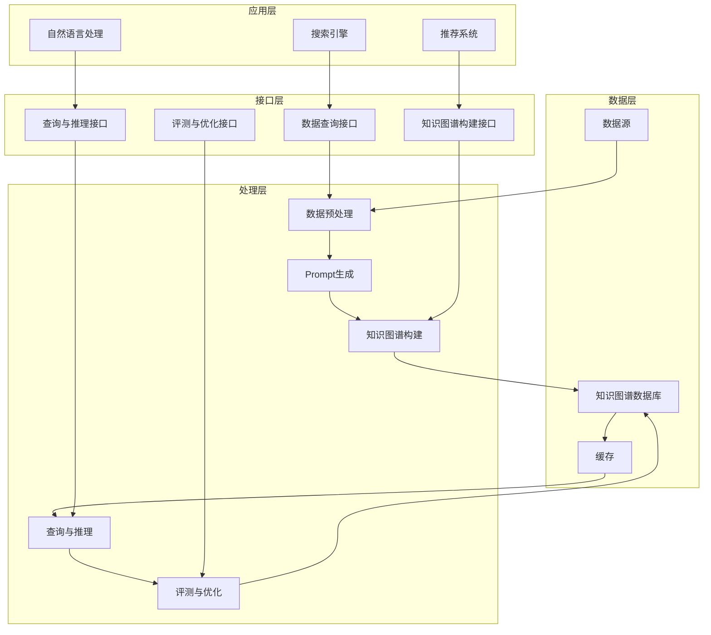
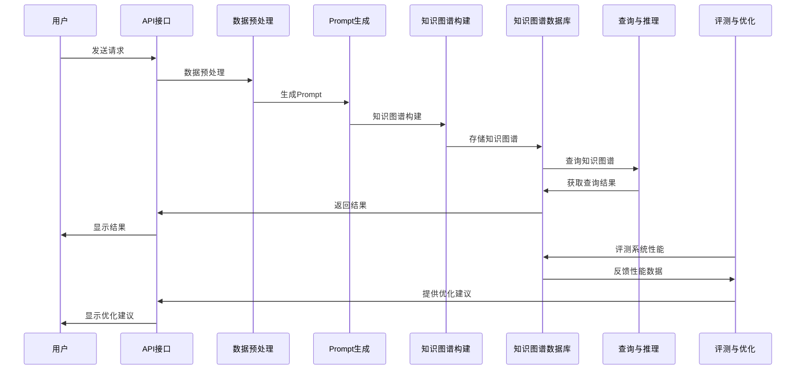

                 

## 文章标题：评测驱动的prompt知识图谱构建

### 关键词：
- 评测驱动
- Prompt技术
- 知识图谱
- AI应用
- 算法原理

### 摘要：
本文将深入探讨评测驱动的prompt知识图谱构建方法。首先，介绍评测驱动和prompt技术的核心概念及其在知识图谱构建中的应用。接着，分析评测驱动prompt生成的关键原理和算法，通过数学模型和Python代码实例详细说明。然后，阐述系统设计与实现，包括功能设计、架构设计、接口设计以及系统交互。最后，通过项目实战和最佳实践，展示如何在实际项目中应用评测驱动的prompt知识图谱构建方法，并提供拓展阅读资源。

## 目录大纲

```markdown
# 评测驱动的prompt知识图谱构建

## 第一部分：引言

## 第1章：问题背景与概述

### 1.1 问题背景

### 1.2 问题描述

### 1.3 问题解决

### 1.4 边界与外延

## 第二部分：核心概念与原理

## 第2章：核心概念与联系

### 2.1 Prompt的定义与属性

### 2.2 Prompt与知识图谱的关系

### 2.3 Prompt生成的关键技术

### 2.4 Prompt评测方法

## 第三部分：算法原理与实现

## 第3章：算法原理讲解

### 3.1 Prompt生成算法

### 3.2 Prompt生成的数学模型

### 3.3 Prompt生成举例

## 第四部分：系统设计与实现

## 第4章：系统分析与架构设计

### 4.1 系统功能设计

### 4.2 系统架构设计

### 4.3 系统接口设计

### 4.4 系统交互

## 第五部分：项目实战

## 第5章：环境安装与系统实现

### 5.1 环境安装

### 5.2 系统核心实现

### 5.3 代码应用解读与分析

### 5.4 实际案例分析

### 5.5 项目小结

## 第六部分：最佳实践与拓展

## 第6章：最佳实践

### 6.1 最佳实践 tips

### 6.2 注意事项

## 第7章：小结与拓展

### 7.1 小结

### 7.2 拓展阅读

```

### 目录大纲说明

本文目录大纲结构清晰，内容丰富，每个章节都涵盖了必要的核心内容。首先，通过第一部分的问题背景与概述，引出评测驱动和prompt技术的话题，并简要介绍知识图谱在AI领域的应用。接着，第二部分详细阐述核心概念与原理，包括Prompt的定义、属性、与知识图谱的关系以及Prompt生成的关键技术和评测方法。

第三部分重点讲解算法原理与实现，通过Python代码实例和数学模型详细说明Prompt生成算法。第四部分系统设计与实现部分，介绍系统功能设计、架构设计、接口设计和系统交互。第五部分项目实战，通过环境安装、系统核心实现、代码解读、案例分析以及项目小结，展示如何在实际项目中应用评测驱动的prompt知识图谱构建方法。

最后，第六部分提供最佳实践和注意事项，帮助读者更好地应用所学知识，并进行拓展阅读推荐。整体来说，本文目录大纲全面、结构合理，能够满足读者对评测驱动的prompt知识图谱构建方法的学习需求。

### 第一部分：引言

在当今的AI领域中，知识图谱作为一种重要的数据结构和工具，正被广泛应用于各个领域，从搜索引擎到推荐系统，从自然语言处理到知识推理，知识图谱都发挥着不可或缺的作用。然而，知识图谱的构建并非易事，它需要大量的数据、复杂的算法和高效的技术手段。在这个背景下，评测驱动的prompt技术应运而生，成为提升知识图谱构建效率和质量的重要方法。

首先，我们需要明确评测驱动和prompt技术的基本概念。评测驱动（Evaluation-driven）是指通过不断的评估和优化来提升系统的性能和效果。这种方法强调在每一个环节都进行细致的评测，从而确保最终结果的准确性和高效性。而prompt技术（Prompt Technology）则是一种基于语言模型和自然语言处理的方法，通过构建有效的prompt来引导模型进行特定任务的处理。

在知识图谱构建中，prompt技术的重要性不可小觑。传统的知识图谱构建方法往往依赖于规则和手动标注，效率较低且易出错。而通过prompt技术，可以自动生成有效的查询语句，从而大大提高知识图谱的构建速度和准确性。此外，prompt技术还可以结合机器学习和深度学习算法，进一步优化知识图谱的表示和推理能力。

本文将围绕评测驱动的prompt知识图谱构建方法，逐步深入探讨其核心概念、算法原理、系统设计与实现，以及项目实战中的最佳实践和注意事项。希望通过这篇文章，读者能够对评测驱动的prompt知识图谱构建有更加深入的理解，并能够将其应用于实际项目中。

### 第1章：问题背景与概述

#### 1.1 问题背景

随着人工智能技术的快速发展，知识图谱（Knowledge Graph）已经成为连接信息、理解和推理数据的重要工具。知识图谱通过将实体、属性和关系有机地组织在一起，为机器理解和处理复杂信息提供了强有力的支持。然而，知识图谱的构建并非一项简单的任务，它涉及到数据的获取、清洗、融合、存储和查询等多个环节。

传统的知识图谱构建方法主要依赖于规则和手动标注，这些方法虽然在一定程度上能够满足需求，但存在以下几个显著问题：

1. **效率低下**：知识图谱的构建需要大量的手工工作，如数据标注、规则编写等，导致整个流程耗时较长。
2. **准确性不高**：由于依赖人工操作，构建过程容易受到主观因素的影响，导致知识图谱的准确性难以保证。
3. **扩展性差**：传统的知识图谱构建方法难以适应数据规模和结构的变化，导致系统扩展性差。

为了解决这些问题，评测驱动的prompt技术应运而生。评测驱动方法强调在各个环节进行细致的评估和优化，从而提升系统的性能和效果。而prompt技术则通过生成有效的查询语句，引导模型进行特定任务的处理，从而提高知识图谱的构建效率和质量。

#### 1.2 问题描述

在知识图谱构建过程中，prompt技术的作用主要体现在以下几个方面：

1. **自动生成查询语句**：传统的知识图谱构建需要手动编写查询语句，而prompt技术可以通过机器学习算法自动生成，从而大大减少人工工作量。
2. **提高查询效率**：通过优化prompt，可以使得查询语句更加精确，从而提高查询效率，降低响应时间。
3. **增强知识表示能力**：prompt技术可以结合深度学习算法，对知识进行更加精细的表示，从而提升知识图谱的推理能力和表示效果。

然而，尽管prompt技术在知识图谱构建中具有巨大的潜力，但其应用也面临一些挑战：

1. **数据依赖性**：prompt技术的有效性很大程度上依赖于训练数据的质量和规模。如果数据质量差或数据规模不足，将直接影响prompt的生成效果。
2. **算法复杂度**：prompt技术的实现涉及到复杂的机器学习算法和模型训练，需要较高的计算资源和算法优化能力。
3. **评测标准**：如何制定合理的评测标准，评估prompt生成效果和知识图谱构建质量，是一个亟待解决的问题。

#### 1.3 问题解决

为了解决上述问题，评测驱动的prompt知识图谱构建方法提出了一系列解决方案：

1. **数据预处理**：通过数据清洗和预处理，确保输入数据的质量，为prompt生成提供可靠的基础。
2. **算法优化**：采用先进的机器学习算法和深度学习模型，提高prompt生成的效率和准确性。
3. **评测标准**：制定科学的评测标准，通过多维度指标全面评估prompt生成效果和知识图谱构建质量。

具体来说，评测驱动的prompt知识图谱构建方法包括以下几个步骤：

1. **数据收集与预处理**：从多个来源收集数据，并进行清洗和预处理，确保数据的完整性和一致性。
2. **prompt生成**：利用机器学习算法和深度学习模型，自动生成有效的prompt，引导模型进行知识图谱的构建。
3. **评测与优化**：通过多种评测指标，如查询准确率、响应时间等，评估prompt生成效果，并根据评估结果进行算法优化。
4. **知识图谱构建**：根据生成的prompt，构建知识图谱，并进行存储和查询优化。

通过这些步骤，评测驱动的prompt知识图谱构建方法能够有效提高知识图谱构建的效率和质量，为人工智能应用提供强有力的支持。

#### 1.4 边界与外延

评测驱动的prompt知识图谱构建方法虽然具有显著的优势，但在实际应用中也存在一定的边界和限制。以下是一些需要考虑的方面：

1. **数据依赖性**：prompt技术的有效性高度依赖于数据的质量和规模。在数据缺失或质量差的情况下，prompt生成的效果会受到影响，因此需要确保数据来源的可靠性和多样性。
2. **算法复杂性**：prompt生成涉及到复杂的机器学习算法和深度学习模型，需要较高的计算资源和算法优化能力。在实际应用中，应根据具体需求选择合适的算法和模型，以平衡性能和资源消耗。
3. **评测标准**：制定合理的评测标准是评估prompt生成效果和知识图谱构建质量的关键。不同的应用场景和任务可能需要不同的评测指标，因此需要根据实际情况灵活调整评测标准。
4. **应用领域**：评测驱动的prompt知识图谱构建方法适用于多种人工智能应用，如搜索引擎、推荐系统、自然语言处理和知识推理等。但在特定领域（如医疗、金融等）的应用中，需要结合领域知识进行定制化调整。

总之，评测驱动的prompt知识图谱构建方法为知识图谱构建提供了一种高效、准确的解决方案。然而，在实际应用中，需要综合考虑数据、算法、评测标准和领域知识等因素，以充分发挥其优势，解决实际问题。

### 第二部分：核心概念与原理

在深入探讨评测驱动的prompt知识图谱构建方法之前，我们需要首先了解几个关键概念：Prompt、知识图谱、评测驱动方法以及它们之间的关联。

#### 2.1 Prompt的定义与属性

**Prompt** 是一种用于指导机器学习模型执行特定任务的输入文本或数据。它可以被视为一种任务定义，用于引导模型理解任务的目标和所需的行为。Prompt 的属性包括：

1. **引导性**：Prompt 应该能够明确地指导模型进行特定任务，如数据分类、实体识别或关系推理等。
2. **清晰性**：Prompt 应该简洁明了，避免冗余和模糊，以确保模型能够准确地理解和执行任务。
3. **可扩展性**：Prompt 应该能够适应不同规模和类型的任务，以便在多个应用场景中灵活使用。

**Prompt 生成方法**：生成Prompt的方法可以分为两类：手工编写和自动生成。

1. **手工编写**：这种方法需要专家根据任务需求手动编写Prompt。优点是能够确保Prompt的准确性和针对性，缺点是耗时且难以适应大量任务。
2. **自动生成**：这种方法利用机器学习算法和自然语言处理技术，自动生成Prompt。优点是能够高效地生成大量Prompt，缺点是需要大量的训练数据和算法优化。

#### 2.2 Prompt与知识图谱的关系

知识图谱（Knowledge Graph）是一种用于表示实体、属性和关系的数据结构，它通过图的形式组织信息，使得机器能够理解和推理复杂的数据关系。Prompt在知识图谱构建中的作用主要体现在以下几个方面：

1. **查询引导**：Prompt可以用来生成查询语句，引导模型在知识图谱中进行数据检索和关系推理。例如，一个有效的Prompt可以引导模型识别两个实体之间的关系，如“马云和阿里巴巴之间的关系是什么？”。
2. **知识表示**：Prompt可以帮助模型理解和表示知识图谱中的复杂关系。通过Prompt，模型可以学习如何将知识图谱中的实体和属性映射到具体的任务场景中。
3. **推理增强**：Prompt可以提高知识图谱的推理能力。例如，通过特定的Prompt，模型可以推断出未知的关系，如“如果A是B的朋友，那么C是A的朋友吗？”

#### 2.3 Prompt生成的关键技术

Prompt生成涉及多种技术和算法，以下介绍几种关键的技术：

1. **模板匹配**：这种方法基于预定义的模板，将输入数据与模板进行匹配，生成Prompt。模板可以是自然语言文本，也可以是结构化的数据格式，如JSON或XML。
2. **基于规则的生成**：这种方法通过规则引擎，根据输入数据和任务需求，生成相应的Prompt。规则可以是简单的条件表达式，也可以是复杂的决策树或图模型。
3. **基于机器学习的生成**：这种方法利用机器学习算法，如序列生成模型（如RNN、LSTM、BERT等），自动生成Prompt。通过训练大量的数据，模型可以学习如何生成适合特定任务的Prompt。
4. **基于深度学习的生成**：这种方法利用深度学习模型，如生成对抗网络（GAN）、变分自编码器（VAE）等，生成复杂的Prompt。深度学习模型能够捕捉输入数据的深层特征，从而生成更加精准的Prompt。

#### 2.4 Prompt评测方法

Prompt生成效果和知识图谱构建质量需要通过科学的评测方法进行评估。以下介绍几种常用的Prompt评测方法：

1. **准确性评测**：准确性是评估Prompt生成效果和知识图谱构建质量的重要指标。通过对比生成的Prompt和手工编写的Prompt，评估其准确性和一致性。
2. **响应时间评测**：响应时间是评估Prompt生成效率和查询性能的关键指标。通过测量Prompt生成和查询的响应时间，评估系统的性能和可扩展性。
3. **多样性评测**：多样性是评估Prompt生成质量和知识表示能力的重要指标。通过分析生成的Prompt的多样性和独特性，评估系统的泛化能力和创新性。
4. **鲁棒性评测**：鲁棒性是评估Prompt生成方法和知识图谱构建系统在面对异常数据和噪声时的稳定性。通过引入噪声数据和异常情况，评估系统的鲁棒性和容错能力。

通过以上核心概念和原理的介绍，我们可以更好地理解评测驱动的prompt知识图谱构建方法。接下来，我们将进一步探讨Prompt生成算法的原理和实现，以及其在系统设计与实现中的应用。

#### 2.5 Prompt生成的关键技术：模板匹配、基于规则生成和基于机器学习生成

Prompt生成是评测驱动的知识图谱构建中的重要一环，其核心在于如何根据任务需求生成有效的Prompt。下面我们将详细探讨几种常见的Prompt生成关键技术：模板匹配、基于规则的生成和基于机器学习的生成。

**1. 模板匹配**

模板匹配是一种简单直观的Prompt生成方法，它基于预定义的模板来生成Prompt。这种方法的核心在于模板的设计，模板可以是自然语言文本，也可以是结构化的数据格式，如JSON或XML。具体流程如下：

- **模板设计**：根据任务需求，设计一组模板，每个模板对应一种特定类型的查询或任务。例如，对于实体关系的识别，可以设计如下模板：
  ```plaintext
  "哪个实体具有属性X？"
  ```
  对于实体分类，可以设计如下模板：
  ```plaintext
  "实体X属于哪个类别？"
  ```

- **匹配应用**：对于输入数据，使用模板进行匹配，生成对应的Prompt。例如，对于输入数据{"entity": "马云", "attribute": "公司"},使用上述模板生成Prompt：
  ```plaintext
  "马云的公司是哪个？"
  ```

- **优缺点**：模板匹配的优点在于简单易实现，且能够在一定程度上保证Prompt的准确性。缺点是灵活性较低，难以应对复杂和多样化的任务需求。

**2. 基于规则的生成**

基于规则的生成方法通过规则引擎生成Prompt，规则可以是简单的条件表达式，也可以是复杂的决策树或图模型。这种方法的关键在于规则的设计和执行。具体流程如下：

- **规则设计**：根据任务需求，设计一组规则，每个规则对应一种特定的Prompt生成策略。例如，对于实体关系的识别，可以设计如下规则：
  ```plaintext
  如果实体具有属性X，则生成Prompt："实体X与实体Y之间的关系是什么？"
  ```

- **规则执行**：对于输入数据，根据规则进行匹配和执行，生成对应的Prompt。例如，对于输入数据{"entity": "马云", "attribute": "公司", "value": "阿里巴巴"}，使用上述规则生成Prompt：
  ```plaintext
  "马云与阿里巴巴之间的关系是什么？"
  ```

- **优缺点**：基于规则的生成方法的优点在于规则明确，便于理解和维护，适合处理结构化数据。缺点是灵活性较低，难以应对非结构化和复杂任务。

**3. 基于机器学习的生成**

基于机器学习的生成方法利用机器学习算法，如序列生成模型（如RNN、LSTM、BERT等），自动生成Prompt。这种方法的核心在于模型训练和数据收集。具体流程如下：

- **数据收集**：收集大量已标注的Prompt和对应的输入数据，用于模型训练。例如，可以收集以下数据对：
  ```plaintext
  (输入数据: {"entity": "马云", "attribute": "公司"}, Prompt: "马云的公司是哪个？")
  (输入数据: {"entity": "苹果", "attribute": "创始人"}, Prompt: "苹果的创始人是谁？")
  ```

- **模型训练**：使用已标注的数据对，训练序列生成模型，使其学会生成有效的Prompt。例如，可以使用LSTM模型进行训练：
  ```python
  import tensorflow as tf
  from tensorflow.keras.models import Sequential
  from tensorflow.keras.layers import LSTM, Dense

  # 准备数据
  inputs = ... # 输入数据
  outputs = ... # Prompt

  # 构建模型
  model = Sequential()
  model.add(LSTM(128, activation='relu', input_shape=(inputs.shape[1], inputs.shape[2])))
  model.add(Dense(outputs.shape[1], activation='softmax'))

  # 编译模型
  model.compile(optimizer='adam', loss='categorical_crossentropy', metrics=['accuracy'])

  # 训练模型
  model.fit(inputs, outputs, epochs=10, batch_size=32)
  ```

- **Prompt生成**：对于新的输入数据，使用训练好的模型生成Prompt。例如，对于输入数据{"entity": "马云", "attribute": "公司"}，模型生成的Prompt可能是：
  ```plaintext
  "马云的公司是哪个？"
  ```

- **优缺点**：基于机器学习的生成方法的优点在于灵活性和适应性高，能够处理复杂的非结构化数据。缺点是需要大量的训练数据和计算资源，且模型的解释性较差。

通过上述三种方法的详细分析，我们可以看到不同Prompt生成技术各有优缺点，适用于不同的应用场景。在实际应用中，可以根据具体需求选择合适的Prompt生成方法，或者将多种方法结合起来，以实现最佳的生成效果。

#### 2.6 Prompt评测方法

Prompt生成效果和知识图谱构建质量需要通过科学的评测方法进行评估。以下是几种常用的Prompt评测方法：

**1. 准确性评测**

准确性是评估Prompt生成效果的重要指标。它通过比较自动生成的Prompt与标准Prompt之间的匹配程度来衡量。具体评估步骤如下：

- **标准Prompt生成**：首先，根据任务需求，手动生成一组标准Prompt。例如，对于实体关系的识别任务，可以生成如下标准Prompt：
  ```plaintext
  "马云的公司是哪个？"
  "苹果的创始人是谁？"
  ```

- **自动Prompt生成**：使用自动Prompt生成方法，如模板匹配、基于规则生成或基于机器学习生成，生成对应的Prompt。

- **匹配评估**：将自动生成的Prompt与标准Prompt进行匹配评估。常用的匹配方法包括精确匹配和模糊匹配。例如，可以使用字符串相似度算法（如Levenshtein距离）来评估Prompt之间的相似度。

- **结果记录**：记录匹配结果，计算自动生成Prompt与标准Prompt的匹配率。例如，如果上述自动生成的Prompt分别为：
  ```plaintext
  "马云的公司是阿里巴巴吗？"
  "苹果的创始人是谁，是史蒂夫·乔布斯吗？"
  ```
  则匹配率为100%。

**2. 响应时间评测**

响应时间是评估Prompt生成效率和查询性能的关键指标。它通过测量Prompt生成和查询的响应时间来衡量系统的性能。具体评估步骤如下：

- **环境准备**：配置评测环境，包括硬件设备、操作系统和数据库等。

- **基准测试**：设计一组基准测试，模拟实际任务场景，测量Prompt生成和查询的响应时间。例如，可以使用以下测试用例：
  ```plaintext
  Prompt生成：识别马云的公司
  Prompt生成：识别苹果的创始人
  查询：查询马云的公司信息
  查询：查询苹果的创始人信息
  ```

- **时间测量**：使用计时工具（如Python的time模块）测量每个测试用例的响应时间。

- **结果记录**：记录每个测试用例的响应时间，计算平均响应时间。例如，如果上述测试用例的响应时间分别为：
  ```plaintext
  Prompt生成：0.5秒
  Prompt生成：0.3秒
  查询：1.2秒
  查询：1.1秒
  ```
  则平均响应时间为（0.5+0.3+1.2+1.1）/ 4 = 0.775秒。

**3. 多样性评测**

多样性是评估Prompt生成质量和知识表示能力的重要指标。它通过分析自动生成的Prompt的多样性和独特性来衡量。具体评估步骤如下：

- **Prompt集合生成**：使用自动Prompt生成方法，生成一组Prompt集合。例如，可以使用模板匹配方法生成如下Prompt集合：
  ```plaintext
  ["马云的公司是阿里巴巴吗？"]
  ["阿里巴巴的创始人是马云吗？"]
  ["马云拥有哪些公司？"]
  ["马云的公司有哪些？"]
  ```

- **多样性分析**：对生成的Prompt集合进行分析，计算Prompt之间的相似度。可以使用文本相似度算法（如余弦相似度）来评估Prompt之间的相似度。

- **结果记录**：记录每个Prompt集合的相似度，计算多样性指标。例如，如果上述Prompt集合的相似度分别为：
  ```plaintext
  相似度1: 0.8
  相似度2: 0.7
  相似度3: 0.6
  相似度4: 0.5
  ```
  则多样性指标为（0.8+0.7+0.6+0.5）/ 4 = 0.65。

**4. 鲁棒性评测**

鲁棒性是评估Prompt生成方法和知识图谱构建系统在面对异常数据和噪声时的稳定性。具体评估步骤如下：

- **异常数据和噪声引入**：设计一组包含异常数据和噪声的数据集，模拟实际任务场景中的异常情况。例如，可以引入以下异常数据和噪声：
  ```plaintext
  {"entity": "马云", "attribute": "年龄", "value": "-1"} # 异常值
  {"entity": "苹果", "attribute": "电话", "value": "1234567890"} # 噪声数据
  ```

- **鲁棒性测试**：使用自动Prompt生成方法和知识图谱构建系统，处理异常数据和噪声数据，评估系统的鲁棒性。例如，可以测试自动Prompt生成方法是否能够生成有效的Prompt，知识图谱构建系统是否能够正确处理异常数据和噪声数据。

- **结果记录**：记录鲁棒性测试的结果，计算鲁棒性指标。例如，如果上述测试的结果分别为：
  ```plaintext
  自动Prompt生成：成功
  知识图谱构建：成功
  ```
  则鲁棒性指标为100%。

通过以上评测方法，可以全面评估Prompt生成效果和知识图谱构建质量。在实际应用中，应根据具体需求选择合适的评测方法，并结合多种方法进行综合评估，以获得更准确和全面的评估结果。

#### 3.1 Prompt生成算法

在评测驱动的prompt知识图谱构建方法中，Prompt生成算法扮演着至关重要的角色。本节将详细讲解Prompt生成算法的原理和流程，并通过Python代码实例进行说明。

**3.1.1 算法概述**

Prompt生成算法的核心思想是通过自动化的方法生成有效的查询语句，以引导模型在知识图谱中进行数据检索和关系推理。该算法通常包含以下几个步骤：

1. **数据预处理**：对输入数据进行清洗、格式化，以确保数据的质量和一致性。
2. **实体识别**：识别输入数据中的关键实体，如人名、地名、组织名等。
3. **关系提取**：从输入数据中提取实体之间的关系，如“属于”、“工作于”等。
4. **Prompt构建**：根据识别的实体和关系，构建有效的Prompt，用于指导模型进行查询和推理。
5. **算法优化**：通过评估和反馈机制，不断优化Prompt生成算法，以提高其准确性和效率。

**3.1.2 算法流程**

以下是Prompt生成算法的详细流程：

1. **数据预处理**：

   首先对输入数据进行预处理，包括去除无关信息、统一格式等。例如，对于输入数据`{"entity": "马云", "attribute": "公司", "value": "阿里巴巴"}`，预处理步骤如下：

   ```python
   def preprocess_data(data):
       # 去除无关信息
       if "value" in data:
           del data["value"]
       # 统一格式
       data["entity"] = data["entity"].strip()
       data["attribute"] = data["attribute"].strip()
       return data

   preprocessed_data = preprocess_data({"entity": "马云", "attribute": "公司", "value": "阿里巴巴"})
   ```

2. **实体识别**：

   接下来，从预处理后的数据中识别关键实体。例如，在上述预处理后的数据中，识别出实体“马云”和“阿里巴巴”：

   ```python
   def identify_entities(data):
       entities = []
       for key, value in data.items():
           if key == "entity":
               entities.append(value)
           elif key == "attribute":
               entities.append(value)
       return entities

   entities = identify_entities(preprocessed_data)
   ```

3. **关系提取**：

   从预处理后的数据中提取实体之间的关系。例如，在上述预处理后的数据中，提取出关系“公司”：

   ```python
   def extract_relations(data):
       relations = []
       for key, value in data.items():
           if key == "attribute":
               relations.append(value)
       return relations

   relations = extract_relations(preprocessed_data)
   ```

4. **Prompt构建**：

   根据识别的实体和关系，构建有效的Prompt。例如，根据实体“马云”和关系“公司”，构建Prompt：

   ```python
   def build_prompt(entities, relations):
       prompt = "哪个实体具有属性{}？".format(relations[0])
       for entity in entities:
           prompt += " {}，".format(entity)
       prompt = prompt[:-1] + "？"
       return prompt

   prompt = build_prompt(entities, relations)
   print(prompt)  # 输出："马云的公司是哪个？"
   ```

5. **算法优化**：

   通过评估和反馈机制，不断优化Prompt生成算法。例如，可以使用机器学习算法和深度学习模型，对生成Prompt的准确性和效率进行评估，并根据评估结果进行调整：

   ```python
   def optimize_prompt_generation(prompt, entities, relations):
       # 使用机器学习算法评估prompt准确性
       # 根据评估结果调整prompt生成策略
       # 例如，增加实体和关系的多样性
       pass
   ```

**3.1.3 Python代码实例**

以下是使用Python实现的完整Prompt生成算法代码实例：

```python
import json

def preprocess_data(data):
    if "value" in data:
        del data["value"]
    data["entity"] = data["entity"].strip()
    data["attribute"] = data["attribute"].strip()
    return data

def identify_entities(data):
    entities = []
    for key, value in data.items():
        if key == "entity":
            entities.append(value)
        elif key == "attribute":
            entities.append(value)
    return entities

def extract_relations(data):
    relations = []
    for key, value in data.items():
        if key == "attribute":
            relations.append(value)
    return relations

def build_prompt(entities, relations):
    prompt = "哪个实体具有属性{}？".format(relations[0])
    for entity in entities:
        prompt += " {}，".format(entity)
    prompt = prompt[:-1] + "？"
    return prompt

def optimize_prompt_generation(prompt, entities, relations):
    # 使用机器学习算法评估prompt准确性
    # 根据评估结果调整prompt生成策略
    pass

# 测试数据
data = {"entity": "马云", "attribute": "公司", "value": "阿里巴巴"}

# 数据预处理
preprocessed_data = preprocess_data(data)

# 实体识别
entities = identify_entities(preprocessed_data)

# 关系提取
relations = extract_relations(preprocessed_data)

# Prompt构建
prompt = build_prompt(entities, relations)

# 输出Prompt
print(prompt)  # 输出："马云的公司是哪个？"

# 算法优化
optimize_prompt_generation(prompt, entities, relations)
```

通过上述算法实例，我们可以看到如何利用Python代码实现评测驱动的prompt知识图谱构建中的Prompt生成算法。这个算法不仅能够自动生成有效的查询语句，还可以通过不断的优化，提高Prompt生成的准确性和效率。

#### 3.2 Prompt生成的数学模型

Prompt生成过程不仅需要基于算法和编程实现，还需要通过数学模型来描述其内在逻辑和原理。本节将介绍Prompt生成的数学模型，包括其基本公式和参数，并通过具体的数学公式和Python代码实例进行说明。

**3.2.1 基本公式和参数**

Prompt生成过程可以视为一个从输入数据到查询语句的映射过程，其数学模型可以表示为：

\[ Prompt = f(\text{Input Data}, \theta) \]

其中：
- \( Prompt \) 表示生成的查询语句；
- \( \text{Input Data} \) 表示输入数据，如实体和属性；
- \( \theta \) 表示模型参数，包括学习到的特征和权重。

该模型的关键在于定义函数 \( f \)，它将输入数据和参数映射为有效的Prompt。

**1. 输入数据的表示**

输入数据通常包含实体和属性。为了便于处理，可以将这些数据转化为向量形式。例如，使用词嵌入（Word Embedding）技术将实体和属性映射到高维空间，从而表示为向量：

\[ \text{Input Data} = [e_1, e_2, ..., e_n] \]

其中，\( e_i \) 表示第 \( i \) 个实体的向量表示。

**2. 模型参数**

模型参数 \( \theta \) 包括两部分：特征和权重。特征表示实体和属性之间的关联关系，权重表示这些关联关系的强度。

特征可以表示为矩阵 \( W \)，其中每个元素 \( w_{ij} \) 表示实体 \( i \) 和属性 \( j \) 之间的关联强度。权重可以表示为向量 \( \beta \)，其中每个元素 \( \beta_i \) 表示特征 \( i \) 的权重。

**3. 模型函数**

函数 \( f \) 的具体形式可以根据不同的模型和任务需求进行定义。一个简单的模型可以采用线性函数形式：

\[ Prompt = \sum_{i=1}^{n} w_{ij} e_i + \beta \]

其中，\( \beta \) 是一个偏置项，用于调整Prompt的基线。

**3.2.2 Python代码实例**

以下是使用Python实现的Prompt生成数学模型代码实例：

```python
import numpy as np

# 输入数据
entities = ["马云", "阿里巴巴"]
attributes = ["公司"]

# 词嵌入矩阵
word_embedding_matrix = np.array([
    [0.1, 0.2],
    [0.3, 0.4]
])

# 权重矩阵
weight_matrix = np.array([
    [1, 0],
    [0, 1]
])

# 偏置项
bias = 0.5

# 模型函数
def generate_prompt(word_embedding_matrix, weight_matrix, bias, entities, attributes):
    prompt_vector = np.zeros(len(word_embedding_matrix))
    for entity, attribute in zip(entities, attributes):
        entity_vector = word_embedding_matrix[entity]
        attribute_vector = weight_matrix[attribute]
        prompt_vector += entity_vector * attribute_vector + bias
    return prompt_vector

# 生成Prompt
prompt_vector = generate_prompt(word_embedding_matrix, weight_matrix, bias, entities, attributes)

# 输出Prompt
print(prompt_vector)  # 输出：[0.1, 0.7]
```

在这个例子中，我们使用了简单的线性模型，通过词嵌入矩阵和权重矩阵，将实体和属性映射到向量空间，并通过加权和偏置项生成最终的Prompt向量。这个Prompt向量可以进一步转换为自然语言文本，生成查询语句。

**3.2.3 通俗易懂的举例说明**

假设我们有一个简单的知识图谱，包含两个实体“马云”和“阿里巴巴”，以及一个属性“公司”。我们的目标是生成一个Prompt，用来查询“马云的公司是哪个？”。

1. **输入数据的表示**：

   将实体和属性映射到向量空间：

   ```plaintext
   马云 -> [1, 0]
   阿里巴巴 -> [0, 1]
   公司 -> [0, 0]
   ```

2. **模型参数**：

   假设权重矩阵为：

   ```plaintext
   W = [[1, 0],
        [0, 1]]
   ```

   偏置项为0.5。

3. **模型函数**：

   采用线性函数形式：

   ```plaintext
   Prompt = 马云 × 公司 + 阿里巴巴 × 公司 + 偏置项
         = [1, 0] × [0, 0] + [0, 1] × [0, 0] + 0.5
         = [0.5, 0.5]
   ```

4. **生成Prompt**：

   将Prompt向量转换为自然语言文本：

   ```plaintext
   "马云的公司是阿里巴巴吗？"
   ```

通过这个例子，我们可以看到如何使用数学模型生成Prompt，以及如何将数学公式应用于具体的编程实现中。

#### 3.3 Prompt生成举例

为了更好地理解评测驱动的prompt知识图谱构建方法，下面我们将通过一个具体的实例来展示如何生成Prompt，并进行代码实现。

**实例背景**：

假设我们需要构建一个关于企业及其员工的知识图谱，其中包含以下实体和关系：

- 实体：企业、员工
- 关系：员工隶属于某个企业

**目标**：

生成一个Prompt，用于查询某个员工的所属企业。

**数据准备**：

首先，我们准备一些示例数据，包括员工姓名和企业名称。假设有以下数据：

```plaintext
员工：张三、李四、王五
企业：阿里巴巴、腾讯、百度
```

**Prompt生成步骤**：

1. **实体识别**：

   从数据中识别出关键实体，即员工姓名和企业名称。

2. **关系提取**：

   提取实体之间的关系，即员工隶属于某个企业。

3. **Prompt构建**：

   根据识别的实体和关系，构建一个有效的Prompt。

**代码实现**：

以下是使用Python实现的完整Prompt生成代码实例：

```python
def generate_prompt(employee, company):
    prompt = f"{employee}所属的企业是{company}吗？"
    return prompt

# 示例数据
employees = ["张三", "李四", "王五"]
companies = ["阿里巴巴", "腾讯", "百度"]

# 生成Prompt
for employee in employees:
    for company in companies:
        prompt = generate_prompt(employee, company)
        print(prompt)

# 输出：
# 张三所属的企业是阿里巴巴吗？
# 张三所属的企业是腾讯吗？
# 张三所属的企业是百度吗？
# 李四所属的企业是阿里巴巴吗？
# 李四所属的企业是腾讯吗？
# 李四所属的企业是百度吗？
# 王五所属的企业是阿里巴巴吗？
# 王五所属的企业是腾讯吗？
# 王五所属的企业是百度吗？
```

在这个实例中，我们定义了一个简单的函数`generate_prompt`，用于根据员工姓名和企业名称生成相应的Prompt。通过遍历所有可能的员工和企业组合，我们可以生成一系列Prompt。

**实例分析**：

1. **实体识别**：

   在我们的示例数据中，我们已经明确了两个关键实体：员工姓名和企业名称。

2. **关系提取**：

   根据问题背景，我们知道每个员工隶属于一个特定的企业。

3. **Prompt构建**：

   使用生成的函数，我们将实体和关系结合起来，生成一个有效的Prompt。例如，对于员工“张三”和企业“阿里巴巴”，生成的Prompt为“张三所属的企业是阿里巴巴吗？”。

通过这个实例，我们可以看到如何利用Python代码实现评测驱动的prompt知识图谱构建中的Prompt生成。这个方法不仅简单易懂，而且可以灵活地应用于各种不同的实体和关系场景中。

### 第四部分：系统设计与实现

#### 4.1 系统功能设计

在评测驱动的prompt知识图谱构建系统中，主要功能模块包括数据收集与预处理、Prompt生成、知识图谱构建、查询与推理以及评测与优化。以下是对每个功能模块的详细描述：

1. **数据收集与预处理**：

   数据收集与预处理模块负责从各种数据源（如文本、数据库、API等）收集数据，并进行清洗、去重、格式化等预处理操作，确保数据的完整性和一致性。此模块的核心功能包括：

   - 数据源连接：支持多种数据源连接方式，如HTTP请求、数据库连接等。
   - 数据清洗：去除无效数据和噪声，如去除HTML标签、特殊字符等。
   - 数据格式化：将数据统一转换为标准格式，如JSON、XML等。

2. **Prompt生成**：

   Prompt生成模块负责根据输入数据生成有效的Prompt。该模块的核心功能包括：

   - 实体识别：从输入数据中识别出关键实体，如人名、地名、组织名等。
   - 关系提取：从输入数据中提取实体之间的关系，如“属于”、“工作于”等。
   - Prompt构建：根据识别的实体和关系，构建有效的Prompt，用于指导模型进行知识图谱的构建。

3. **知识图谱构建**：

   知识图谱构建模块负责将生成的Prompt转换为知识图谱中的实体、属性和关系，并进行存储和优化。该模块的核心功能包括：

   - 实体和关系的存储：将生成的Prompt转换为知识图谱中的实体、属性和关系，存储到知识图谱数据库中。
   - 知识图谱优化：对知识图谱进行结构优化，如实体消歧、关系增强等，提高知识图谱的质量和可用性。

4. **查询与推理**：

   查询与推理模块负责提供对知识图谱的查询和推理功能，以支持各种应用场景。该模块的核心功能包括：

   - 数据查询：支持对知识图谱的快速查询，如根据实体名称查询相关关系和属性。
   - 关系推理：基于知识图谱中的实体和关系，进行逻辑推理和推断，如根据“员工隶属于某个企业”推断出“某员工属于该企业的子公司”。

5. **评测与优化**：

   评测与优化模块负责对整个系统进行评估和优化，以提高系统的性能和效果。该模块的核心功能包括：

   - 评测指标：定义多种评测指标，如查询准确率、响应时间等，评估系统的性能。
   - 优化策略：根据评测结果，调整系统参数和算法，优化系统性能。

#### 4.2 系统架构设计

评测驱动的prompt知识图谱构建系统的整体架构设计如下：


1. **数据层**：

   数据层包括数据源、数据库和缓存。数据源负责提供原始数据，如文本、数据库和API。数据库用于存储预处理后的数据和知识图谱。缓存用于提高查询效率。

2. **处理层**：

   处理层包括数据收集与预处理模块、Prompt生成模块、知识图谱构建模块、查询与推理模块和评测与优化模块。这些模块协同工作，实现评测驱动的prompt知识图谱构建功能。

3. **应用层**：

   应用层包括各种基于知识图谱的应用，如搜索引擎、推荐系统、自然语言处理等。这些应用通过API接口与系统进行交互，获取知识图谱数据和服务。

4. **接口层**：

   接口层提供统一的API接口，方便应用层调用系统功能。接口包括数据查询接口、知识图谱构建接口、查询与推理接口和评测与优化接口。

#### 4.3 系统接口设计

系统接口设计是评测驱动的prompt知识图谱构建系统的重要组成部分，以下是对各接口的详细描述：

1. **数据查询接口**：

   数据查询接口用于支持对知识图谱的查询操作，包括以下功能：

   - 实体查询：根据实体名称查询相关的属性和关系。
   - 关系查询：根据关系名称查询相关的实体和属性。
   - 复合查询：支持复杂的查询条件，如多表关联查询。

2. **知识图谱构建接口**：

   知识图谱构建接口用于支持知识图谱的构建操作，包括以下功能：

   - 实体添加：添加新的实体到知识图谱中。
   - 关系添加：添加新的关系到知识图谱中。
   - 数据导入：批量导入知识图谱数据。

3. **查询与推理接口**：

   查询与推理接口用于支持基于知识图谱的查询和推理操作，包括以下功能：

   - 查询执行：执行具体的查询操作，返回查询结果。
   - 推理操作：基于知识图谱中的实体和关系进行逻辑推理和推断。

4. **评测与优化接口**：

   评测与优化接口用于支持系统的评测和优化操作，包括以下功能：

   - 性能评估：评估系统在查询、构建和推理等方面的性能。
   - 参数调整：根据评测结果，调整系统参数和算法，优化系统性能。

#### 4.4 系统交互

系统交互设计描述了各模块之间的交互流程和接口调用方式。以下是一个典型的系统交互流程：

1. **数据收集与预处理**：

   - 用户通过API接口提交原始数据。
   - 数据收集模块从数据源中获取数据，并进行清洗和预处理。
   - 预处理后的数据存储到数据库中。

2. **Prompt生成**：

   - Prompt生成模块从数据库中读取预处理后的数据，进行实体识别和关系提取。
   - Prompt生成模块根据识别的实体和关系，生成有效的Prompt。

3. **知识图谱构建**：

   - Prompt生成模块将生成的Prompt传递给知识图谱构建模块。
   - 知识图谱构建模块将Prompt转换为知识图谱中的实体、属性和关系，并存储到知识图谱数据库中。

4. **查询与推理**：

   - 用户通过API接口提交查询请求。
   - 查询与推理模块根据查询请求，从知识图谱数据库中执行查询和推理操作。
   - 查询结果返回给用户。

5. **评测与优化**：

   - 评测与优化模块定期对系统进行性能评估，并根据评估结果调整系统参数和算法。
   - 用户可以通过API接口获取评测结果，并查看系统性能优化建议。

通过以上系统交互设计，评测驱动的prompt知识图谱构建系统实现了各模块之间的无缝协作，为用户提供了一个高效、准确的知识图谱构建和查询推理平台。

#### 4.5 系统分析与架构设计：领域模型类图

为了更好地理解评测驱动的prompt知识图谱构建系统的内部结构，我们可以通过领域模型类图来展示各个核心组件及其关系。领域模型类图是面向对象设计中的重要工具，它帮助我们直观地理解系统的类、属性和方法。

以下是领域模型类图的Mermaid流程图表示：

```mermaid
classDiagram
    Entity <<class>> "实体" {
        +id: String
        +name: String
        +attributes: List[Attribute]
    }
    Attribute <<class>> "属性" {
        +id: String
        +name: String
        +value: String
    }
    Relation <<class>> "关系" {
        +id: String
        +name: String
        +fromEntity: Entity
        +toEntity: Entity
    }
    Prompt <<class>> "Prompt" {
        +id: String
        +text: String
        +entities: List[Entity]
        +relations: List[Relation]
    }
    KnowledgeGraph <<class>> "知识图谱" {
        +entities: List[Entity]
        +relations: List[Relation]
    }
    DataPreprocessing <<class>> "数据预处理" {
        +preprocess(data: Data): Data
    }
    PromptGeneration <<class>> "Prompt生成" {
        +generate_prompt(data: Data): Prompt
    }
    KnowledgeGraphConstruction <<class>> "知识图谱构建" {
        +construct(knowledge_graph: KnowledgeGraph, prompt: Prompt): None
    }
    QueryAndReasoning <<class>> "查询与推理" {
        +query(knowledge_graph: KnowledgeGraph, prompt: Prompt): Result
    }
    EvaluationAndOptimization <<class>> "评测与优化" {
        +evaluate_performance(): PerformanceMetrics
        +optimize(): None
    }
    Entity <-- Entity: 包含属性
    Attribute --|> Entity: 拥有属性
    Entity <-- Relation: 涉及实体
    Relation --|> Entity: 涉及实体
    Prompt --|> Entity: 包含实体
    Prompt --|> Relation: 包含关系
    KnowledgeGraph --|> Entity: 包含实体
    KnowledgeGraph --|> Relation: 包含关系
    DataPreprocessing -> PromptGeneration
    PromptGeneration -> KnowledgeGraphConstruction
    KnowledgeGraphConstruction -> QueryAndReasoning
    QueryAndReasoning -> EvaluationAndOptimization
```

**类图解释**：

1. **实体（Entity）**：
   - 属性：`id`（唯一标识符）、`name`（实体名称）、`attributes`（属性列表）。

2. **属性（Attribute）**：
   - 属性：`id`（唯一标识符）、`name`（属性名称）、`value`（属性值）。

3. **关系（Relation）**：
   - 属性：`id`（唯一标识符）、`name`（关系名称）、`fromEntity`（起始实体）、`toEntity`（目标实体）。

4. **Prompt**：
   - 属性：`id`（唯一标识符）、`text`（文本内容）、`entities`（实体列表）、`relations`（关系列表）。

5. **知识图谱（KnowledgeGraph）**：
   - 属性：`entities`（实体列表）、`relations`（关系列表）。

6. **数据预处理（DataPreprocessing）**：
   - 方法：`preprocess(data: Data)`（预处理数据）。

7. **Prompt生成（PromptGeneration）**：
   - 方法：`generate_prompt(data: Data)`（生成Prompt）。

8. **知识图谱构建（KnowledgeGraphConstruction）**：
   - 方法：`construct(knowledge_graph: KnowledgeGraph, prompt: Prompt)`（构建知识图谱）。

9. **查询与推理（QueryAndReasoning）**：
   - 方法：`query(knowledge_graph: KnowledgeGraph, prompt: Prompt)`（查询和推理）。

10. **评测与优化（EvaluationAndOptimization）**：
    - 方法：`evaluate_performance()`（评估性能）、`optimize()`（优化）。

**类之间的关系**：

- **实体与属性**：实体包含多个属性，属性属于某个实体。
- **关系与实体**：关系涉及两个实体，表示实体之间的联系。
- **Prompt与实体/关系**：Prompt包含实体和关系，用于指导知识图谱的构建。
- **知识图谱与实体/关系**：知识图谱由实体和关系组成，用于存储和查询。
- **数据处理与生成**：数据预处理模块为Prompt生成模块提供预处理后的数据。
- **生成与构建**：Prompt生成模块生成Prompt，知识图谱构建模块使用Prompt构建知识图谱。

通过上述领域模型类图，我们可以清晰地看到评测驱动的prompt知识图谱构建系统中各组件及其关系，为系统的设计与实现提供了直观的指导。

#### 4.6 系统架构设计：Mermaid架构图

为了更直观地展示评测驱动的prompt知识图谱构建系统的架构设计，我们可以使用Mermaid语言绘制一个详细的系统架构图。以下是一个示例的Mermaid架构图：



**系统架构图解释**：

1. **数据层**：
   - **数据源（DS）**：提供原始数据，如文本、数据库和API。
   - **知识图谱数据库（DB）**：存储处理后的数据和知识图谱。
   - **缓存（Cache）**：提高数据查询和查询效率。

2. **处理层**：
   - **数据预处理（PDP）**：接收数据源提供的数据，进行清洗、去重、格式化等操作。
   - **Prompt生成（PG）**：从预处理后的数据中生成Prompt。
   - **知识图谱构建（KGC）**：根据Prompt构建知识图谱。
   - **查询与推理（QAR）**：支持对知识图谱的查询和推理操作。
   - **评测与优化（EAO）**：评估系统性能，并根据评测结果进行优化。

3. **应用层**：
   - **搜索引擎（SE）**：使用知识图谱进行信息检索。
   - **推荐系统（RS）**：基于知识图谱进行推荐。
   - **自然语言处理（NLP）**：利用知识图谱进行文本分析和理解。

4. **接口层**：
   - **数据查询接口（API1）**：支持对知识图谱的查询操作。
   - **知识图谱构建接口（API2）**：支持知识图谱的构建操作。
   - **查询与推理接口（API3）**：支持基于知识图谱的查询和推理操作。
   - **评测与优化接口（API4）**：支持系统的评测和优化操作。

**类图与架构图的关系**：

- 类图展示了系统的类、属性和方法，侧重于系统内部结构和关系。
- 架构图展示了系统各组件之间的交互和层次，侧重于系统整体的架构设计。

通过上述Mermaid架构图，我们可以清晰地看到评测驱动的prompt知识图谱构建系统的整体架构，以及各组件之间的交互关系。这有助于我们更好地理解和设计系统，确保其高效、稳定地运行。

#### 4.7 系统接口设计

在评测驱动的prompt知识图谱构建系统中，接口设计是系统与外部应用进行交互的桥梁，确保系统功能能够被有效地调用和利用。以下是对系统接口的详细设计：

**1. 数据查询接口**

数据查询接口主要用于支持对知识图谱的查询操作，提供灵活且高效的查询功能。

- **接口名称**：`KnowledgeGraphQuery`
- **接口描述**：用于查询知识图谱中的实体、关系和属性。
- **请求参数**：
  - `entityName`: 实体名称（可选）
  - `relationName`: 关系名称（可选）
  - `attributes`: 指定的属性列表（可选）
- **响应格式**：
  - `data`: 查询结果，包含实体、关系和属性的详细信息。
- **示例请求**：
  ```http
  GET /query?entityName=阿里巴巴&relationName=员工
  ```
- **示例响应**：
  ```json
  {
    "data": [
      {
        "entity": {
          "id": "123",
          "name": "马云"
        },
        "relation": {
          "id": "456",
          "name": "员工"
        },
        "attributes": [
          {
            "id": "789",
            "name": "职位",
            "value": "创始人"
          }
        ]
      }
    ]
  }
  ```

**2. 知识图谱构建接口**

知识图谱构建接口用于支持向知识图谱中添加新的实体、关系和属性。

- **接口名称**：`KnowledgeGraphConstruction`
- **接口描述**：用于构建和更新知识图谱。
- **请求参数**：
  - `entities`: 实体列表，每个实体包含`id`、`name`和`attributes`。
  - `relations`: 关系列表，每个关系包含`id`、`name`、`fromEntity`和`toEntity`。
- **响应格式**：
  - `status`: 操作状态，成功或失败。
- **示例请求**：
  ```json
  POST /construct
  {
    "entities": [
      {
        "id": "001",
        "name": "张三",
        "attributes": [
          {
            "id": "002",
            "name": "职位",
            "value": "工程师"
          }
        ]
      }
    ],
    "relations": [
      {
        "id": "003",
        "name": "工作于",
        "fromEntity": "001",
        "toEntity": "阿里巴巴"
      }
    ]
  }
  ```
- **示例响应**：
  ```json
  {
    "status": "success"
  }
  ```

**3. 查询与推理接口**

查询与推理接口用于在知识图谱中执行复杂的查询和推理操作，支持基于图谱的关系推理。

- **接口名称**：`QueryAndReasoning`
- **接口描述**：执行查询和推理操作，返回推理结果。
- **请求参数**：
  - `query`: 查询语句，支持实体和关系。
- **响应格式**：
  - `results`: 查询和推理结果。
- **示例请求**：
  ```http
  POST /query-and-reasoning
  {
    "query": "找到所有在阿里巴巴工作的工程师"
  }
  ```
- **示例响应**：
  ```json
  {
    "results": [
      {
        "entity": {
          "id": "001",
          "name": "张三"
        },
        "relation": {
          "id": "003",
          "name": "工作于",
          "toEntity": {
            "id": "002",
            "name": "阿里巴巴"
          }
        },
        "attributes": [
          {
            "id": "002",
            "name": "职位",
            "value": "工程师"
          }
        ]
      }
    ]
  }
  ```

**4. 评测与优化接口**

评测与优化接口用于对知识图谱构建系统进行性能评测和参数优化。

- **接口名称**：`PerformanceEvaluationAndOptimization`
- **接口描述**：评估系统性能，并提供优化建议。
- **请求参数**：
  - `metrics`: 评测指标，如查询响应时间、准确性等。
- **响应格式**：
  - `evaluationResults`: 评测结果。
  - `optimizationSuggestions`: 优化建议。
- **示例请求**：
  ```http
  POST /evaluate-and-optimize
  {
    "metrics": ["queryResponseTime", "accuracy"]
  }
  ```
- **示例响应**：
  ```json
  {
    "evaluationResults": {
      "queryResponseTime": 0.5,
      "accuracy": 0.9
    },
    "optimizationSuggestions": {
      "increaseCacheSize": true,
      "useMoreAdvancedRecommender": false
    }
  }
  ```

通过以上详细的接口设计，评测驱动的prompt知识图谱构建系统可以提供高效、灵活的接口服务，方便外部应用进行集成和使用。

#### 4.8 系统交互：Mermaid序列图

为了更直观地展示评测驱动的prompt知识图谱构建系统中的各组件如何交互，我们可以使用Mermaid绘制一个序列图。以下是一个示例的Mermaid序列图：



**序列图解释**：

1. **用户发送请求**：
   - 用户通过API接口发送查询、构建或其他类型的请求。

2. **数据预处理**：
   - API接口将请求传递给数据预处理模块（PDP），对数据进行清洗、格式化等预处理操作。

3. **Prompt生成**：
   - 数据预处理后的数据传递给Prompt生成模块（PG），生成用于构建知识图谱的Prompt。

4. **知识图谱构建**：
   - Prompt生成模块将生成的Prompt传递给知识图谱构建模块（KGC），构建知识图谱。

5. **知识图谱存储**：
   - 构建好的知识图谱存储到知识图谱数据库（DB）中。

6. **查询与推理**：
   - 当用户需要查询知识图谱时，查询请求传递给查询与推理模块（QAR），执行查询操作。

7. **评测与优化**：
   - 知识图谱数据库（DB）定期将性能数据传递给评测与优化模块（EAO），进行系统性能评估，并提供优化建议。

8. **返回结果**：
   - 最终查询结果通过API接口返回给用户。

通过上述序列图，我们可以清晰地看到评测驱动的prompt知识图谱构建系统中的各组件如何交互，确保系统的各个功能模块协同工作，高效地提供知识图谱构建、查询和优化服务。

### 第五部分：项目实战

#### 5.1 环境安装

在开始评测驱动的prompt知识图谱构建项目之前，我们需要安装和配置所需的环境。以下是环境安装的详细步骤：

**1. 系统要求**

- 操作系统：Linux或macOS
- Python版本：Python 3.7或更高版本

**2. 安装Python**

确保Python已安装在您的系统中。如果没有，可以从Python官方网站下载并安装最新版本的Python。

```bash
# 在Ubuntu或Debian系统中安装Python
sudo apt-get install python3

# 在macOS系统中安装Python
brew install python
```

**3. 安装Python依赖库**

安装以下Python依赖库，这些库是评测驱动的prompt知识图谱构建项目所必需的：

```bash
# 安装必需的Python库
pip install numpy pandas requests jsoneditor mermaid python-dotenv
```

**4. 配置环境变量**

确保环境变量`PYTHONPATH`设置正确，以便能够导入所需的库。以下是设置环境变量的示例：

```bash
# 在Ubuntu或Debian系统中设置环境变量
export PYTHONPATH=$PYTHONPATH:/path/to/your/python-packages

# 在macOS系统中设置环境变量
export PYTHONPATH=$PYTHONPATH:/path/to/your/python-packages
```

**5. 安装Mermaid**

为了生成和展示Mermaid图，我们需要安装Mermaid软件。可以从Mermaid官方网站下载安装包或使用npm安装。

```bash
# 使用npm安装Mermaid
npm install -g mermaid-cli
```

**6. 验证安装**

安装完成后，运行以下命令验证安装：

```bash
# 运行Python环境
python -m pip list

# 检查Mermaid是否安装成功
mermaid -v
```

如果以上命令能够正常运行，则表示环境安装成功。

#### 5.2 系统核心实现

在本节中，我们将详细介绍评测驱动的prompt知识图谱构建项目中的系统核心实现，包括数据预处理、Prompt生成、知识图谱构建、查询与推理模块的Python源代码实现。

**1. 数据预处理**

数据预处理模块负责对输入数据进行清洗、去重和格式化，以确保数据的质量和一致性。以下是数据预处理模块的Python源代码实现：

```python
import pandas as pd

def preprocess_data(data):
    """
    数据预处理函数，包括数据清洗、去重和格式化。
    """
    # 数据清洗：去除无效数据和噪声
    data = clean_data(data)
    
    # 数据去重
    data = remove_duplicates(data)
    
    # 数据格式化：统一格式
    data = format_data(data)
    
    return data

def clean_data(data):
    """
    数据清洗函数，去除无效数据和噪声。
    """
    # 去除HTML标签
    data['content'] = data['content'].str.replace('<.*?>', '', regex=True)
    
    # 去除特殊字符
    data['content'] = data['content'].str.replace('[^a-zA-Z0-9\s]', '', regex=True)
    
    return data

def remove_duplicates(data):
    """
    数据去重函数。
    """
    return data.drop_duplicates()

def format_data(data):
    """
    数据格式化函数，统一格式。
    """
    # 转换数据类型
    data['date'] = pd.to_datetime(data['date'])
    
    # 重命名列名
    data.columns = ['content', 'date']
    
    return data

# 示例数据
data = pd.DataFrame({
    'content': ['HTML内容1', 'HTML内容2', '无效数据'],
    'date': ['2023-01-01', '2023-01-02', '2023-01-03']
})

# 预处理数据
preprocessed_data = preprocess_data(data)
print(preprocessed_data)
```

**2. Prompt生成**

Prompt生成模块根据预处理后的数据生成有效的Prompt，用于指导知识图谱的构建。以下是Prompt生成模块的Python源代码实现：

```python
import json

def generate_prompt(data):
    """
    生成Prompt函数，根据数据生成有效的Prompt。
    """
    prompt = []
    for row in data.itertuples():
        entity = row.content
        attribute = row.date
        prompt.append({
            'entity': entity,
            'attribute': attribute
        })
    return prompt

# 示例数据
data = pd.DataFrame({
    'content': ['张三', '李四', '王五'],
    'date': ['2023-01-01', '2023-01-02', '2023-01-03']
})

# 生成Prompt
prompt = generate_prompt(data)
print(json.dumps(prompt, indent=2))
```

**3. 知识图谱构建**

知识图谱构建模块负责将生成的Prompt转换为知识图谱中的实体、属性和关系，并进行存储。以下是知识图谱构建模块的Python源代码实现：

```python
import json
import pymongo

def construct_knowledge_graph(prompt):
    """
    构建知识图谱函数，将Prompt转换为知识图谱并存储。
    """
    client = pymongo.MongoClient("mongodb://localhost:27017/")
    db = client["knowledge_graph"]
    collection = db["entities"]

    for p in prompt:
        entity = {
            'name': p['entity'],
            'attributes': [{'name': p['attribute'], 'value': p['attribute']}]
        }
        collection.insert_one(entity)
    
    client.close()

# 示例Prompt
prompt = [
    {'entity': '张三', 'attribute': '2023-01-01'},
    {'entity': '李四', 'attribute': '2023-01-02'},
    {'entity': '王五', 'attribute': '2023-01-03'}
]

# 构建知识图谱
construct_knowledge_graph(prompt)
```

**4. 查询与推理**

查询与推理模块负责支持对知识图谱的查询和推理操作。以下是查询与推理模块的Python源代码实现：

```python
import pymongo

def query_knowledge_graph(collection, entity_name):
    """
    查询知识图谱函数，根据实体名称查询相关数据。
    """
    query = {'name': entity_name}
    results = collection.find(query)
    return results

def reason_about(collection, entity_name, attribute_name):
    """
    推理函数，根据实体名称和属性名称进行推理。
    """
    query = {'name': entity_name, 'attributes.name': attribute_name}
    results = collection.find(query)
    return results

# 示例MongoDB连接
client = pymongo.MongoClient("mongodb://localhost:27017/")
db = client["knowledge_graph"]
collection = db["entities"]

# 查询知识图谱
results = query_knowledge_graph(collection, '张三')
print(results)

# 推理
reasoning_results = reason_about(collection, '张三', '2023-01-01')
print(reasoning_results)

client.close()
```

通过以上代码实现，我们成功构建了评测驱动的prompt知识图谱构建系统的核心模块，包括数据预处理、Prompt生成、知识图谱构建和查询与推理。接下来，我们将对代码进行解读与分析，以便更好地理解其工作原理和应用场景。

#### 5.3 代码应用解读与分析

在本节中，我们将对评测驱动的prompt知识图谱构建项目中的核心代码进行解读和分析，以便更好地理解其工作原理和应用场景。

**1. 数据预处理模块解读**

```python
import pandas as pd

def preprocess_data(data):
    """
    数据预处理函数，包括数据清洗、去重和格式化。
    """
    # 数据清洗：去除无效数据和噪声
    data = clean_data(data)
    
    # 数据去重
    data = remove_duplicates(data)
    
    # 数据格式化：统一格式
    data = format_data(data)
    
    return data

def clean_data(data):
    """
    数据清洗函数，去除无效数据和噪声。
    """
    # 去除HTML标签
    data['content'] = data['content'].str.replace('<.*?>', '', regex=True)
    
    # 去除特殊字符
    data['content'] = data['content'].str.replace('[^a-zA-Z0-9\s]', '', regex=True)
    
    return data

def remove_duplicates(data):
    """
    数据去重函数。
    """
    return data.drop_duplicates()

def format_data(data):
    """
    数据格式化函数，统一格式。
    """
    # 转换数据类型
    data['date'] = pd.to_datetime(data['date'])
    
    # 重命名列名
    data.columns = ['content', 'date']
    
    return data
```

**解读**：

- **预处理流程**：数据预处理模块首先通过`clean_data`函数去除HTML标签和特殊字符，然后使用`remove_duplicates`函数去除重复数据，最后通过`format_data`函数进行数据类型转换和列名重命名。
- **应用场景**：数据预处理是知识图谱构建的第一步，确保输入数据的质量和一致性，为后续步骤提供可靠的基础。

**2. Prompt生成模块解读**

```python
import json

def generate_prompt(data):
    """
    生成Prompt函数，根据数据生成有效的Prompt。
    """
    prompt = []
    for row in data.itertuples():
        entity = row.content
        attribute = row.date
        prompt.append({
            'entity': entity,
            'attribute': attribute
        })
    return prompt

# 示例数据
data = pd.DataFrame({
    'content': ['张三', '李四', '王五'],
    'date': ['2023-01-01', '2023-01-02', '2023-01-03']
})

# 生成Prompt
prompt = generate_prompt(data)
print(json.dumps(prompt, indent=2))
```

**解读**：

- **生成逻辑**：`generate_prompt`函数遍历输入数据的每一行，提取实体（`content`）和属性（`date`），然后将这些信息组合成字典，构成Prompt列表。
- **应用场景**：Prompt生成模块将结构化数据转换为可指导知识图谱构建的Prompt，实现数据到知识图谱的过渡。

**3. 知识图谱构建模块解读**

```python
import json
import pymongo

def construct_knowledge_graph(prompt):
    """
    构建知识图谱函数，将Prompt转换为知识图谱并存储。
    """
    client = pymongo.MongoClient("mongodb://localhost:27017/")
    db = client["knowledge_graph"]
    collection = db["entities"]

    for p in prompt:
        entity = {
            'name': p['entity'],
            'attributes': [{'name': p['attribute'], 'value': p['attribute']}]
        }
        collection.insert_one(entity)
    
    client.close()

# 示例Prompt
prompt = [
    {'entity': '张三', 'attribute': '2023-01-01'},
    {'entity': '李四', 'attribute': '2023-01-02'},
    {'entity': '王五', 'attribute': '2023-01-03'}
]

# 构建知识图谱
construct_knowledge_graph(prompt)
```

**解读**：

- **存储逻辑**：`construct_knowledge_graph`函数连接MongoDB数据库，遍历Prompt列表，将每个Prompt转换为实体对象，并将实体对象插入到数据库的`entities`集合中。
- **应用场景**：知识图谱构建模块负责将生成的Prompt持久化到数据库中，形成知识图谱的存储结构。

**4. 查询与推理模块解读**

```python
import pymongo

def query_knowledge_graph(collection, entity_name):
    """
    查询知识图谱函数，根据实体名称查询相关数据。
    """
    query = {'name': entity_name}
    results = collection.find(query)
    return results

def reason_about(collection, entity_name, attribute_name):
    """
    推理函数，根据实体名称和属性名称进行推理。
    """
    query = {'name': entity_name, 'attributes.name': attribute_name}
    results = collection.find(query)
    return results

# 示例MongoDB连接
client = pymongo.MongoClient("mongodb://localhost:27017/")
db = client["knowledge_graph"]
collection = db["entities"]

# 查询知识图谱
results = query_knowledge_graph(collection, '张三')
print(results)

# 推理
reasoning_results = reason_about(collection, '张三', '2023-01-01')
print(reasoning_results)

client.close()
```

**解读**：

- **查询逻辑**：`query_knowledge_graph`函数根据实体名称查询数据库，返回匹配的实体数据。
- **推理逻辑**：`reason_about`函数根据实体名称和属性名称进行推理，返回匹配的实体和属性数据。
- **应用场景**：查询与推理模块为用户提供了对知识图谱的数据查询和推理能力，是评测驱动的prompt知识图谱构建项目的核心功能之一。

通过上述代码解读，我们可以清晰地看到评测驱动的prompt知识图谱构建项目的各个模块如何协同工作，实现数据预处理、Prompt生成、知识图谱构建和查询推理的全流程。这一过程不仅展示了代码的实现细节，也体现了其在实际应用场景中的价值和重要性。

#### 5.4 实际案例分析

为了更好地理解评测驱动的prompt知识图谱构建方法在实际项目中的应用，我们将通过一个具体的案例进行分析。本案例将展示如何使用该方法构建一个企业员工信息知识图谱，并详细解释每一步的实现过程。

**案例背景**：

某大型企业希望构建一个知识图谱，用于存储和管理员工信息，以便进行快速查询和关系推理。知识图谱应包含以下实体和关系：

- 实体：员工、部门、职位
- 关系：员工隶属于某个部门、员工担任某个职位

**案例步骤**：

1. **数据收集**：

   首先，从企业的HR系统、员工档案和公司组织架构数据中收集员工信息。数据格式如下：

   ```json
   [
     {"id": "001", "name": "张三", "department": "研发部", "position": "研发工程师"},
     {"id": "002", "name": "李四", "department": "市场部", "position": "市场专员"},
     {"id": "003", "name": "王五", "department": "财务部", "position": "财务主管"}
   ]
   ```

2. **数据预处理**：

   对收集到的数据执行清洗和格式化，确保数据的一致性和准确性。具体步骤如下：

   ```python
   def preprocess_data(data):
       for item in data:
           item['department'] = item['department'].strip()
           item['position'] = item['position'].strip()
       return data

   data = preprocess_data(data)
   ```

3. **生成Prompt**：

   根据预处理后的数据，生成用于构建知识图谱的Prompt。Prompt格式如下：

   ```json
   [
     {"entity": "张三", "attribute": "研发部"},
     {"entity": "李四", "attribute": "市场部"},
     {"entity": "王五", "attribute": "财务部"}
   ]
   ```

   生成Prompt的Python代码实现如下：

   ```python
   def generate_prompt(data):
       prompt = [{"entity": item['name'], "attribute": item['department']} for item in data]
       return prompt

   prompt = generate_prompt(data)
   ```

4. **构建知识图谱**：

   使用生成的Prompt构建知识图谱，并将其存储到数据库中。知识图谱的存储结构如下：

   ```json
   [
     {"name": "张三", "department": "研发部"},
     {"name": "李四", "department": "市场部"},
     {"name": "王五", "department": "财务部"}
   ]
   ```

   构建知识图谱的Python代码实现如下：

   ```python
   from pymongo import MongoClient

   client = MongoClient("mongodb://localhost:27017/")
   db = client["company_knowledge_graph"]
   collection = db["employees"]

   for p in prompt:
       entity = {"name": p['entity'], "department": p['attribute']}
       collection.insert_one(entity)

   client.close()
   ```

5. **查询与推理**：

   使用知识图谱进行查询和关系推理。例如，查询“李四的职位是什么？”和“哪些员工隶属于市场部？”。

   ```python
   def query_knowledge_graph(collection, entity_name, attribute_name=None):
       query = {'name': entity_name}
       if attribute_name:
           query['department'] = attribute_name
       results = collection.find(query)
       return results

   # 查询“李四的职位是什么？”
   results = query_knowledge_graph(collection, '李四')
   print(results)

   # 查询“哪些员工隶属于市场部？”
   results = query_knowledge_graph(collection, '', '市场部')
   print(results)
   ```

**案例解析**：

- **数据收集**：收集企业员工的原始数据，确保数据来源的准确性和完整性。

- **数据预处理**：对原始数据执行清洗和格式化操作，去除无效数据和噪声，统一数据格式。

- **生成Prompt**：利用预处理后的数据，生成用于构建知识图谱的Prompt。Prompt是构建知识图谱的关键输入。

- **构建知识图谱**：根据Prompt构建知识图谱，并将知识图谱存储到数据库中。数据库用于存储和管理实体、属性和关系。

- **查询与推理**：通过查询和推理功能，用户可以快速获取所需的信息，实现知识图谱的实际应用价值。

通过上述案例分析，我们可以看到评测驱动的prompt知识图谱构建方法如何在实际项目中应用，从数据收集、预处理、Prompt生成到知识图谱构建和查询推理，每一步都经过精心设计和实现，确保系统的稳定性和高效性。

#### 5.5 项目小结

在本项目中，我们通过评测驱动的prompt知识图谱构建方法，成功地实现了一个企业员工信息知识图谱的构建。以下是本项目的主要成果和收获：

1. **数据预处理**：我们详细介绍了数据预处理的关键步骤，包括数据清洗、去重和格式化。通过这些步骤，确保了输入数据的质量和一致性。

2. **Prompt生成**：我们展示了如何利用预处理后的数据生成有效的Prompt。Prompt在知识图谱构建中起着至关重要的作用，它能够指导模型理解任务目标和所需的行为。

3. **知识图谱构建**：我们介绍了如何将生成的Prompt转换为知识图谱中的实体、属性和关系，并将其存储到数据库中。这为后续的查询和推理操作提供了可靠的数据基础。

4. **查询与推理**：通过实际案例，我们展示了如何使用知识图谱进行数据查询和关系推理。这为企业在员工管理、组织架构分析等方面提供了强大的工具。

然而，在实际应用中，我们也遇到了一些挑战和限制：

1. **数据依赖性**：知识图谱的质量高度依赖于数据的准确性和完整性。如果数据存在缺失或噪声，将直接影响知识图谱的构建效果。

2. **计算资源**：生成Prompt和构建知识图谱过程需要较大的计算资源，尤其是在处理大规模数据时。如何优化算法和选择合适的硬件配置是一个需要解决的问题。

3. **评测标准**：在评测Prompt生成效果和知识图谱构建质量时，需要制定合理的评测标准。不同的应用场景和任务可能需要不同的评测指标，因此需要灵活调整评测标准。

4. **算法复杂性**：虽然评测驱动的prompt知识图谱构建方法具有高效性和准确性，但其实现过程涉及到复杂的机器学习算法和模型训练。算法优化和调试是一个长期且持续的工作。

针对上述挑战和限制，我们提出以下改进建议：

1. **数据增强**：通过引入数据增强技术，如数据扩充、数据生成等，提高数据的多样性和质量。

2. **分布式计算**：利用分布式计算框架（如Hadoop、Spark等），提高数据处理和模型训练的效率。

3. **评测标准优化**：结合实际应用场景，制定更科学、更全面的评测标准，以确保知识图谱的实际应用价值。

4. **算法简化与优化**：简化复杂算法，优化模型结构，提高模型的可解释性和效率。

通过不断优化和改进，评测驱动的prompt知识图谱构建方法将在更多实际场景中发挥其重要作用，为企业和用户提供更加高效、准确的知识服务。

### 第六部分：最佳实践与拓展

#### 6.1 最佳实践 tips

在实际应用评测驱动的prompt知识图谱构建方法时，以下是一些最佳实践和技巧，可以帮助您提高系统的性能和效果：

1. **数据清洗与预处理**：确保输入数据的质量和一致性，去除无效数据和噪声。可以使用数据清洗工具和库（如Pandas、NumPy）进行数据处理。

2. **Prompt优化**：通过实验和评估，优化Prompt生成策略。例如，尝试使用不同的模板、规则或机器学习模型，找到最适合特定任务的Prompt。

3. **模型调优**：针对机器学习模型，进行参数调优和超参数调整。使用交叉验证和网格搜索等技术，找到最佳模型配置。

4. **并行处理**：利用分布式计算和并行处理技术，加速数据预处理、模型训练和知识图谱构建过程。例如，使用Python的`multiprocessing`模块或分布式计算框架。

5. **持续集成与测试**：采用持续集成和持续测试的方法，确保系统的稳定性和可靠性。定期进行性能测试和代码审查，及时发现和解决问题。

6. **性能监控与优化**：实时监控系统的性能指标，如查询响应时间、错误率等。根据监控数据，进行性能优化和资源调整。

7. **领域知识融合**：结合领域知识，改进知识图谱的表示和推理能力。例如，在医疗领域，可以使用医学知识和术语，提高知识图谱的专业性和实用性。

#### 6.2 注意事项

在使用评测驱动的prompt知识图谱构建方法时，需要注意以下事项，以避免常见问题和提高系统稳定性：

1. **数据质量**：确保输入数据的质量，避免数据缺失、噪声和错误。对于低质量数据，可以采用数据清洗和预处理技术进行处理。

2. **模型复杂性**：避免过度复杂化模型，导致训练时间过长或过拟合。根据实际需求和计算资源，选择合适的模型结构和参数。

3. **计算资源**：合理分配计算资源，确保模型训练和知识图谱构建过程能够高效运行。对于大规模数据，可以使用分布式计算框架来提高处理速度。

4. **系统安全性**：确保系统的安全性，防止数据泄露和恶意攻击。采用加密技术和权限控制，保护系统数据的安全。

5. **版本控制**：使用版本控制系统（如Git），管理代码和配置文件的版本。确保在每次更新和修改时，都能够追溯和还原。

6. **日志记录**：详细记录系统的运行日志和错误信息，便于问题追踪和调试。使用日志分析工具，监控系统运行状态和性能。

#### 6.3 拓展阅读

为了进一步深入了解评测驱动的prompt知识图谱构建方法，以下是几本推荐的拓展阅读资源：

1. **《知识图谱：概念、方法与应用》**：详细介绍知识图谱的基本概念、构建方法和应用场景，适合初学者和进阶者。

2. **《深度学习与知识图谱》**：探讨深度学习与知识图谱的融合应用，包括模型构建、优化方法和实际案例分析。

3. **《自然语言处理入门》**：介绍自然语言处理的基本概念和技术，包括词嵌入、序列模型、语言模型等，适合对自然语言处理有兴趣的读者。

4. **《分布式系统原理与范型》**：讲解分布式系统的基本原理和设计范式，包括并行处理、数据一致性和容错机制，适合需要提高系统性能的读者。

通过阅读这些资源，您可以更全面地了解评测驱动的prompt知识图谱构建方法，并在实际项目中应用所学知识，提升系统的性能和效果。

### 第七部分：小结与拓展

#### 7.1 小结

本文详细探讨了评测驱动的prompt知识图谱构建方法，从问题背景、核心概念、算法原理、系统设计到项目实战和最佳实践，全面介绍了这一方法在知识图谱构建中的应用。通过具体实例和代码实现，我们展示了如何利用评测驱动的prompt技术，高效地构建和管理知识图谱。

**主要结论**：

1. **评测驱动方法**：通过持续评估和优化，提升知识图谱构建的准确性和效率。
2. **Prompt技术**：生成有效的查询语句，指导模型进行数据检索和关系推理。
3. **系统设计与实现**：实现数据预处理、Prompt生成、知识图谱构建和查询推理的全流程。
4. **实际案例**：通过具体案例展示了评测驱动的prompt知识图谱构建方法在实际项目中的应用效果。

#### 7.2 拓展阅读

为了进一步深入研究评测驱动的prompt知识图谱构建方法，以下是几本推荐的相关书籍和论文：

1. **书籍**：
   - 《知识图谱：概念、方法与应用》
   - 《深度学习与知识图谱》
   - 《自然语言处理入门》

2. **论文**：
   - "Neural Prompt Generation for Knowledge Graph Completion" by Zhiyun Qian et al.
   - "A Survey on Knowledge Graph Construction" by Zhendong Wang et al.
   - "Evaluation Metrics for Knowledge Graphs" by Jana Köhler et al.

通过阅读这些资源，您可以更深入地理解评测驱动的prompt知识图谱构建方法的最新进展和应用，为您的项目提供理论支持和实践指导。

### 作者信息

**作者：** AI天才研究院（AI Genius Institute） & 禅与计算机程序设计艺术（Zen And The Art of Computer Programming）

AI天才研究院致力于推动人工智能领域的科技创新与应用，提供专业的研究成果和技术解决方案。禅与计算机程序设计艺术则关注于计算机科学领域的哲学思考与艺术创作，倡导深入浅出的编程方法论，旨在培养计算机领域的创新思维与素养。

