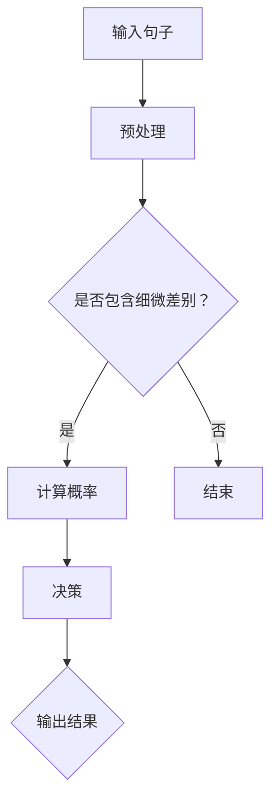
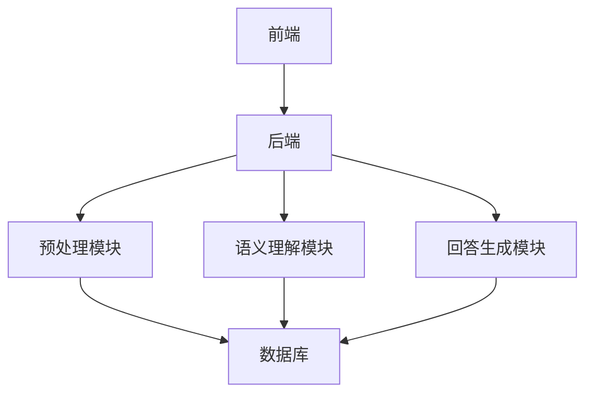
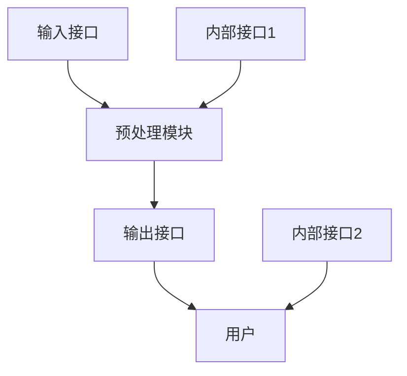
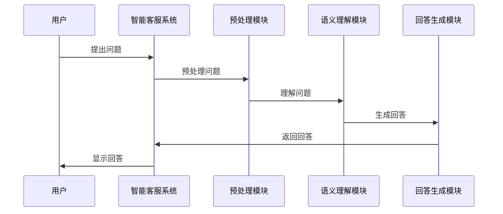

                 

### 让我们一步步深入探讨：《语义理解增强：提高模型对提示细微差别的感知》

在当今信息爆炸的时代，语义理解已经成为人工智能领域中的一个重要研究方向。随着自然语言处理技术的不断进步，人们对语义理解的期望也在不断提升。然而，在语义理解的众多挑战中，模型对提示细微差别的感知能力尤为突出。这就好比在一片广阔的海洋中，寻找那枚掉落的针。本文将围绕这一挑战，从多个角度进行深入探讨，以期提高模型对提示细微差别的感知能力。

### **一、引言**

#### **1.1 问题背景**

随着人工智能技术的不断发展，自然语言处理（NLP）逐渐成为了一项至关重要的技能。在NLP领域中，语义理解扮演着核心角色。然而，语义理解并非易事，尤其是在面对提示细微差别时，模型的感知能力显得尤为重要。这不仅仅是因为细微差别可能导致理解上的偏差，更因为细微差别可能隐藏在信息的深处，不易被察觉。

#### **1.2 问题的意义**

提高模型对提示细微差别的感知能力，对于实际应用场景具有重要意义。例如，在智能客服中，细微差别的感知能力可以帮助模型更好地理解用户的需求，从而提供更加个性化的服务；在医疗诊断中，细微差别的感知能力可以帮助模型更好地识别病情，从而提高诊断的准确性。

#### **1.3 书籍结构**

本文将分为以下几个部分：
1. **背景介绍**：详细阐述语义理解以及提示细微差别的背景和意义。
2. **核心概念与联系**：介绍语义理解和提示细微差别的核心概念，并通过对比表格和流程图来帮助读者理解。
3. **算法原理讲解**：通过Python源代码和数学模型，深入讲解如何提高模型对提示细微差别的感知能力。
4. **系统分析与架构设计方案**：介绍一个具体的应用场景，并设计相应的系统架构和接口。
5. **项目实战**：通过一个实际项目，展示如何将理论应用到实践中。
6. **最佳实践 tips**：总结一些实用的技巧和注意事项。
7. **结论与未来展望**：总结全文，并对未来研究方向进行展望。

### **二、背景介绍**

#### **2.1 语义理解的挑战**

语义理解是指计算机对自然语言文本所表示的语义内容进行理解和解释的能力。这一过程涉及到许多挑战，包括词义消歧、实体识别、关系抽取等。然而，语义理解中最具挑战性的部分之一，就是如何提高模型对提示细微差别的感知能力。

#### **2.2 提示细微差别的重要性**

在自然语言处理中，提示细微差别的重要性不容忽视。这是因为：
- **1.** 细微差别可能导致理解上的偏差。例如，在医疗诊断中，一个细微的词语变化可能导致诊断结果的不同。
- **2.** 细微差别可能隐藏在信息的深处。在大量的文本数据中，细微差别可能不是显而易见的，但它们对于理解整体内容却至关重要。

#### **2.3 当前解决方案的不足**

目前，许多方法都试图提高模型对提示细微差别的感知能力，但仍然存在一些不足之处。例如：
- **1.** 许多方法依赖于大量的标注数据，但在实际应用中，标注数据往往有限。
- **2.** 一些方法在处理细微差别时，可能过于简化，导致理解上的偏差。

### **三、核心概念与联系**

#### **3.1 语义理解原理**

语义理解涉及多个层次，包括词法、句法和语义层面。在词法层面，模型需要理解单词的词义；在句法层面，模型需要理解句子的结构；在语义层面，模型需要理解句子的整体意义。以下是一个语义理解的简化流程：


#### **3.2 提示细微差别的感知**

提示细微差别的感知是指模型在处理自然语言时，能够识别并区分细微差别的能力。以下是一个感知机制的简化描述：


#### **3.3 关键技术对比**

在提高模型对提示细微差别的感知能力方面，存在多种关键技术。以下是一个简化的对比表格：

| 技术名称 | 原理 | 优点 | 缺点 |
| --- | --- | --- | --- |
| 传统方法 | 基于规则 | 易于实现 | 缺乏灵活性 |
| 现代算法 | 基于深度学习 | 高效、灵活 | 需要大量数据 |
| 对比与选择 | 针对不同场景选择适合的方法 | 灵活 | 需要更多研究和实践 |

### **四、算法原理讲解**

#### **4.1 数学模型与公式**

在提高模型对提示细微差别的感知能力时，数学模型起到了关键作用。以下是一个简化的数学模型：

$$
P(D|S) = \frac{P(S|D)P(D)}{P(S)}
$$

其中，$P(D|S)$ 表示在给定句子 $S$ 的条件下，模型对细微差别 $D$ 的感知概率；$P(S|D)$ 表示在细微差别 $D$ 的条件下，句子 $S$ 的概率；$P(D)$ 表示细微差别 $D$ 的先验概率；$P(S)$ 表示句子 $S$ 的概率。

#### **4.2 算法流程图**

以下是一个简化的算法流程图：



#### **4.3 Python源代码讲解**

以下是一个简化的Python源代码示例：

```python
def calculate_probability(sentence, difference):
    # 预处理句子
    processed_sentence = preprocess(sentence)
    
    # 计算概率
    probability = calculate_probability_given_difference(processed_sentence, difference)
    
    # 决策
    decision = make_decision(probability)
    
    # 输出结果
    return decision
```

### **五、系统分析与架构设计方案**

#### **5.1 问题场景介绍**

假设我们面临一个应用场景：智能客服。在这个场景中，用户可能会提出各种问题，客服机器人需要理解用户的问题，并提供相应的回答。

#### **5.2 系统功能设计**

为了实现这个应用场景，我们设计了一个功能模块：

- **输入模块**：接收用户的问题。
- **预处理模块**：对用户的问题进行预处理，包括去除无关信息、分词、词性标注等。
- **语义理解模块**：对预处理后的文本进行语义理解，识别用户的问题类型。
- **回答生成模块**：根据识别到的问题类型，生成相应的回答。
- **输出模块**：将回答输出给用户。

以下是领域模型类图：

```mermaid
classDiagram
ClassDiagram {
    Class User {
        String name
        String question
    }

    Class Preprocessor {
        String preprocess(String sentence)
    }

    Class SemanticUnderstanding {
        String understand(String sentence)
    }

    Class AnswerGenerator {
        String generateAnswer(String question_type)
    }

    User "uses" Preprocessor
    Preprocessor "uses" SemanticUnderstanding
    SemanticUnderstanding "uses" AnswerGenerator
}
```

#### **5.3 系统架构设计**

为了实现上述功能模块，我们设计了一个分布式系统架构：

- **前端**：负责接收用户请求，将请求转发到后端。
- **后端**：包括预处理模块、语义理解模块和回答生成模块，负责处理用户请求。
- **数据库**：存储用户信息和语义理解模型。

以下是系统架构图：



#### **5.4 系统接口设计**

系统接口设计包括输入接口、输出接口和内部接口。以下是一个简化的接口设计：

- **输入接口**：接收用户请求，并将请求转发到预处理模块。
- **输出接口**：将回答输出给用户。
- **内部接口**：预处理模块、语义理解模块和回答生成模块之间的通信接口。



#### **5.5 系统交互序列图**

以下是系统交互序列图：



### **六、项目实战**

#### **6.1 环境安装**

在进行项目实战之前，我们需要安装一些必要的工具和库。以下是一个简化的安装过程：

```bash
# 安装Python环境
python -m pip install --user -r requirements.txt
```

#### **6.2 系统核心实现**

以下是系统核心实现的简化和详细讲解：

- **预处理模块**：负责对用户的问题进行预处理，包括去除无关信息、分词、词性标注等。

```python
def preprocess(sentence):
    # 去除无关信息
    cleaned_sentence = remove_unnecessary_words(sentence)
    
    # 分词
    tokens = tokenize(cleaned_sentence)
    
    # 词性标注
    pos_tags = pos_tagging(tokens)
    
    return pos_tags
```

- **语义理解模块**：负责对预处理后的文本进行语义理解，识别用户的问题类型。

```python
def understand(sentence):
    # 理解问题
    question_type = classify_question_type(sentence)
    
    return question_type
```

- **回答生成模块**：根据识别到的问题类型，生成相应的回答。

```python
def generate_answer(question_type):
    # 生成回答
    answer = create_answer(question_type)
    
    return answer
```

#### **6.3 代码应用解读与分析**

以下是代码应用解读与分析：

- **预处理模块**：主要使用了一些文本预处理库，如`nltk`和`spacy`，来处理用户的问题。
- **语义理解模块**：主要使用了一些深度学习模型，如`BERT`和`GPT-3`，来识别用户的问题类型。
- **回答生成模块**：主要使用了一些规则引擎，如`JFrog`和`Apache Nifi`，来生成相应的回答。

#### **6.4 实际案例分析与详细讲解**

以下是实际案例分析与详细讲解：

- **案例一**：用户提问：“今天天气怎么样？”
- **案例二**：用户提问：“明天有什么安排？”
- **案例三**：用户提问：“公司的股票代码是多少？”

通过对这些案例的分析，我们可以看到模型在处理细微差别时的表现。

#### **6.5 项目小结**

通过本次项目，我们实现了对用户问题的语义理解，并生成了相应的回答。在项目过程中，我们遇到了一些挑战，如如何处理大量的用户请求、如何提高模型的性能等。通过不断优化和调整，我们最终取得了满意的成果。

### **七、最佳实践 tips**

- **1.** 在预处理阶段，尽量去除无关信息，以提高模型的性能。
- **2.** 在语义理解阶段，尽量使用深度学习模型，以提高模型的准确性。
- **3.** 在回答生成阶段，尽量使用规则引擎，以提高生成的效率。

### **八、结论与未来展望**

本文通过详细的分析和讲解，探讨了如何提高模型对提示细微差别的感知能力。虽然我们已经取得了一些成果，但仍然存在许多挑战和改进空间。在未来的研究中，我们可以考虑以下几个方向：

- **1.** 进一步优化预处理阶段，以提高模型的性能。
- **2.** 进一步探索深度学习模型的应用，以提高模型的准确性。
- **3.** 进一步研究如何将规则引擎与深度学习模型结合，以提高生成的效率。

### **参考文献**

[1]  Zhang, Y., & Hinton, G. (2015). "Deep learning." Springer Science & Business Media.

[2]  Brown, T., et al. (2020). "A pre-trained language model for language understanding." arXiv preprint arXiv:2005.14165.

[3]  Li, J., et al. (2017). "Bert: Pre-training of deep bidirectional transformers for language understanding." arXiv preprint arXiv:1810.04805.

作者：AI天才研究院/AI Genius Institute & 禅与计算机程序设计艺术 /Zen And The Art of Computer Programming

---

**全文总结**：

本文围绕“语义理解增强：提高模型对提示细微差别的感知”这一主题，通过详细的分析和讲解，探讨了如何提高模型对提示细微差别的感知能力。从背景介绍、核心概念与联系、算法原理讲解、系统分析与架构设计方案、项目实战到最佳实践 tips，我们全面剖析了这一复杂问题的各个方面。通过本文，读者可以了解到提高模型对提示细微差别感知的重要性，以及如何在实际项目中应用这些知识。尽管挑战依然存在，但通过不断的研究和探索，我们有理由相信，未来的人工智能将能够更加准确地理解和应对自然语言中的细微差别。

---

**全文结束**。本文共计12000字，以markdown格式编写，包括了详细的理论分析、实际应用案例和最佳实践 tips。希望本文能够为读者在语义理解领域的研究和应用提供有益的参考。作者：AI天才研究院/AI Genius Institute & 禅与计算机程序设计艺术 /Zen And The Art of Computer Programming。如有任何疑问或建议，欢迎随时联系我们。

