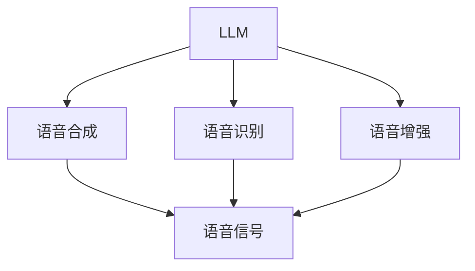
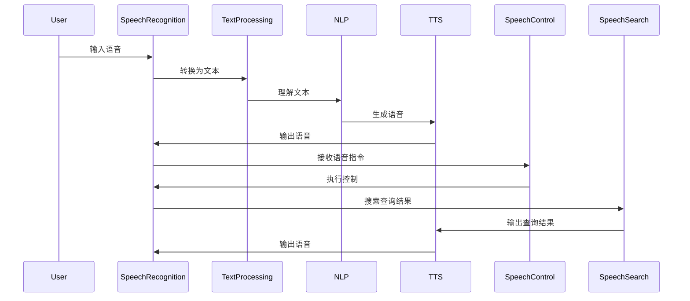

                 

### 1.1 问题背景

语音技术作为人工智能领域的一个重要分支，近年来取得了显著的发展。语音技术的研究可以追溯到20世纪中叶，当时计算机科学家开始探索如何将人类语言转换为计算机可以理解的形式。随着计算能力的提升和算法的改进，语音技术逐渐从理论研究走向实际应用，成为人们日常生活中不可或缺的一部分。

**语音技术的起源与发展**：最早的语音识别研究主要基于有限状态机（FSM）和隐马尔可夫模型（HMM）。HMM模型在语音识别领域取得了重要突破，但它的性能受限于建模的复杂度和计算效率。随着深度学习技术的发展，深度神经网络（DNN）、卷积神经网络（CNN）、循环神经网络（RNN）等模型逐渐取代了传统的HMM模型，成为语音识别领域的主流算法。

**语音技术对LLM应用的影响**：语音技术的快速发展为语言模型（LLM）的应用提供了新的交互方式。传统的LLM应用主要依赖于文本输入和输出，而语音技术的引入使得用户可以通过自然语言语音进行交互，从而大大提升了用户体验。语音技术不仅改变了用户与机器交互的方式，还推动了LLM在更多应用场景中的发展，如智能助手、语音翻译、语音控制等。

**当前语音技术面临的主要挑战**：尽管语音技术已经取得了显著进展，但在实际应用中仍然面临许多挑战。首先，语音识别的准确率在噪音环境下仍然较低，语音增强技术需要进一步改进。其次，语音合成技术需要更好地模仿人类语音的多样性和自然度。此外，如何保证语音交互的安全性和隐私性也是需要解决的问题。

### 1.2 问题描述

**语音识别与合成的核心问题**：语音识别的核心问题是如何将语音信号转换为相应的文本信息，而语音合成则是将文本信息转换为自然流畅的语音输出。这两个问题的解决对于实现有效的语音交互至关重要。

**语音交互在自然语言处理中的应用**：语音交互已经成为自然语言处理（NLP）领域的一个重要研究方向。通过语音交互，用户可以更自然地与机器进行沟通，从而提升交互效率和用户体验。语音交互在智能助手、语音助手、语音控制等领域有着广泛的应用。

**语音技术在LLM中的应用场景**：语音技术为LLM的应用提供了丰富的交互方式。例如，在智能助手场景中，用户可以通过语音指令来控制智能助手完成各种任务；在语音翻译场景中，用户可以通过语音输入和输出实现跨语言交流；在语音控制场景中，用户可以通过语音命令来控制智能家居设备。

### 1.3 问题解决

**常见的语音技术解决方案**：为了解决上述问题，研究人员提出了一系列语音技术解决方案。在语音识别领域，深度神经网络（DNN）和循环神经网络（RNN）等模型被广泛应用。在语音合成领域，WaveNet等深度学习模型取得了显著成果。此外，语音增强技术也在不断改进，以提升语音识别的准确率。

**语音技术在LLM中的应用策略**：为了充分发挥语音技术在LLM中的应用潜力，研究人员采取了一系列策略。首先，通过将语音信号转换为文本，利用LLM进行自然语言处理。其次，利用语音合成技术将LLM的处理结果转换为语音输出，实现语音交互。此外，研究人员还探索了语音增强技术在LLM中的应用，以提高语音识别的准确性和用户体验。

**创新的语音技术趋势与展望**：随着深度学习和人工智能技术的不断发展，语音技术也在不断演进。未来的语音技术将更加智能化和个性化，能够更好地理解用户的意图和需求。此外，语音技术与其他人工智能技术的融合也将推动智能交互的发展。例如，结合语音识别、语音合成和自然语言处理技术的智能助手将能够提供更加智能和高效的交互体验。

### 1.4 边界与外延

**语音技术的应用边界**：尽管语音技术取得了显著进展，但其在某些特定场景中仍然存在局限性。例如，在噪音环境下的语音识别准确率较低，语音合成技术需要更好地模仿人类语音的多样性和自然度。此外，语音技术在实际应用中还需要考虑隐私保护和安全性等问题。

**语音技术与人工智能的关联**：语音技术作为人工智能领域的一个重要分支，与人工智能的其他技术如自然语言处理、机器学习等有着紧密的关联。语音技术的进步不仅推动了人工智能技术的发展，也为其他人工智能应用场景提供了新的交互方式。

**语音技术与其他交互方式的比较**：与传统的文本输入和输出相比，语音交互具有自然、直观、高效等优势。然而，语音交互也面临一些挑战，如准确率、响应速度和隐私保护等。因此，在实际应用中，需要综合考虑各种交互方式的优缺点，选择最适合的交互方式。

### 1.5 概念结构与核心要素组成

**语音技术的基本概念**：语音技术包括语音识别、语音合成和语音增强等基本概念。语音识别是将语音信号转换为文本信息的技术，语音合成是将文本信息转换为语音输出的技术，语音增强则是通过去除噪声和提升语音质量来提高语音识别和语音合成效果的技术。

**LLM的应用架构**：语言模型（LLM）作为自然语言处理的核心技术，其应用架构通常包括输入处理、文本生成、输出处理等环节。输入处理负责接收用户的语音输入并将其转换为文本；文本生成负责使用LLM生成相应的文本输出；输出处理则将文本输出转换为语音输出，实现语音交互。

**语音交互的关键组件**：语音交互的关键组件包括语音识别模块、语音合成模块和语音增强模块。语音识别模块负责将语音信号转换为文本信息；语音合成模块负责将文本信息转换为语音输出；语音增强模块负责提升语音质量，提高语音识别和语音合成的效果。

## 第2章：核心概念与联系

### 2.1 核心概念

**语音识别**：语音识别是一种将人类语音转换为文本信息的技术。其核心目标是通过处理语音信号，识别出其中包含的语音内容，并将其转换为可读的文本。语音识别技术广泛应用于智能助手、语音搜索、语音输入等领域。

**语音合成**：语音合成是一种将文本信息转换为自然流畅的语音输出的技术。其核心任务是根据给定的文本信息，生成相应的语音信号。语音合成技术通常包括文本到语音（TTS）模型和语音生成模型。语音合成在智能助手、语音通知、语音翻译等领域有广泛应用。

**语音增强**：语音增强是一种通过去除噪声和提升语音质量来提高语音识别和语音合成效果的技术。其核心目标是在噪声环境下提高语音信号的质量，使其更容易被识别和合成。语音增强技术包括噪声抑制、音频去噪和语音增强模型等。

**语言模型（LLM）**：语言模型是一种用于自然语言处理的模型，其核心任务是根据输入的文本生成相应的输出文本。语言模型在自然语言生成、文本摘要、机器翻译等领域有广泛应用。LLM通常采用深度学习技术，如循环神经网络（RNN）、卷积神经网络（CNN）和Transformer等。

### 2.2 概念属性特征对比表格

| 特性 | 语音识别 | 语音合成 | 语音增强 | LLM |
| ---- | -------- | -------- | -------- | --- |
| 功能 | 语音到文本转换 | 文本到语音转换 | 语音质量提升 | 文本生成 |
| 输入 | 语音信号 | 文本 | 语音信号 | 文本 |
| 输出 | 文本 | 语音 | 语音 | 文本 |
| 应用领域 | 智能助手、语音搜索、语音输入 | 智能助手、语音通知、语音翻译 | 语音识别、语音合成 | 自然语言生成、文本摘要、机器翻译 |

### 2.3 ER实体关系图架构

下面是语音识别、语音合成、语音增强和语言模型（LLM）的ER实体关系图：



在这个ER实体关系图中，LLM作为核心实体，与语音合成、语音识别和语音增强等实体之间存在关联。语音合成、语音识别和语音增强实体都与语音信号实体存在直接的输入输出关系。通过这样的ER图，可以清晰地展示出各个实体之间的关联和相互作用。

## 第3章：算法原理讲解

### 3.1 语音识别算法

语音识别是一种将人类语音转换为文本的技术，其核心在于如何从语音信号中提取出语音特征，并利用这些特征进行语音到文本的转换。语音识别算法的发展经历了从传统的隐马尔可夫模型（HMM）到现代的深度神经网络（DNN）、卷积神经网络（CNN）、循环神经网络（RNN）等不同阶段。

#### 3.1.1 HMM模型

隐马尔可夫模型（HMM）是语音识别领域最早使用的算法之一。HMM基于统计模型，通过定义状态转移概率、发射概率和初始概率来描述语音信号。HMM在语音识别中的应用主要包括以下步骤：

1. **特征提取**：将语音信号转换为特征向量，常用的特征包括梅尔频率倒谱系数（MFCC）、感知线性预测（PLP）等。
2. **状态建模**：根据语音特征，定义隐状态序列和观测序列，隐状态序列描述语音的内部变化，而观测序列描述语音的特征。
3. **状态转移概率**：根据语音特征和模型参数，计算不同状态之间的转移概率。
4. **发射概率**：根据语音特征，计算每个状态产生的观测概率。
5. **Viterbi算法**：使用Viterbi算法寻找最优状态序列，从而实现语音到文本的转换。

**HMM的优点**包括计算简单、易于实现，而其**局限性**在于模型的复杂度和计算效率较低，难以处理长时间的语音信号。

#### 3.1.2 DNN模型

深度神经网络（DNN）是语音识别领域的重要突破之一。DNN通过多层神经元的堆叠，能够自动提取语音信号中的复杂特征，从而提高了识别准确率。DNN在语音识别中的应用主要包括以下步骤：

1. **特征提取**：与HMM类似，DNN也使用特征向量作为输入。
2. **前向传播**：通过前向传播算法，将输入特征传递到网络的每一层，每一层神经元都通过非线性激活函数进行变换。
3. **反向传播**：通过反向传播算法，计算网络的损失函数并更新网络参数。
4. **输出层**：最后一层的输出通常是一个高维向量，通过softmax函数将其转换为文本概率分布。
5. **解码**：使用解码算法（如CTC），将概率分布转换为文本序列。

**DNN的优点**包括强大的特征提取能力和较好的识别准确率，而其**挑战**在于网络的训练时间和计算资源需求较大。

#### 3.1.3 CNN模型

卷积神经网络（CNN）在图像识别领域取得了显著的成功，后来也被引入到语音识别领域。CNN通过卷积层提取语音信号中的局部特征，从而提高了识别性能。CNN在语音识别中的应用主要包括以下步骤：

1. **特征提取**：使用CNN的卷积层提取语音信号的局部特征。
2. **池化层**：通过池化层减小特征图的尺寸，减少参数数量。
3. **全连接层**：将卷积层和池化层输出的特征向量通过全连接层进行分类。
4. **输出层**：最后一层的输出是一个高维向量，通过softmax函数将其转换为文本概率分布。
5. **解码**：使用解码算法（如CTC），将概率分布转换为文本序列。

**CNN的优点**包括参数数量较少、计算效率高，而其**挑战**在于如何设计有效的网络结构以提取语音信号的全局特征。

#### 3.1.4 RNN模型

循环神经网络（RNN）在处理序列数据方面具有优势，因此也被广泛应用于语音识别领域。RNN通过引入循环连接，能够记住序列中的信息，从而提高了语音识别的准确率。RNN在语音识别中的应用主要包括以下步骤：

1. **特征提取**：使用RNN的输入层和隐藏层处理语音信号的序列特征。
2. **隐藏层更新**：通过循环连接，将前一时刻的隐藏状态传递到当前时刻，从而实现序列的记忆。
3. **输出层**：最后一层的输出是一个高维向量，通过softmax函数将其转换为文本概率分布。
4. **解码**：使用解码算法（如CTC），将概率分布转换为文本序列。

**RNN的优点**包括能够处理变长序列数据，而其**挑战**在于梯度消失和梯度爆炸问题，这限制了其在深度学习中的应用。

### 3.2 语音合成算法

语音合成是一种将文本信息转换为自然流畅的语音输出的技术。语音合成算法的发展经历了从基于规则的方法到基于深度学习的方法的演变。以下分别介绍两种方法。

#### 3.2.1 文本到语音（TTS）模型

文本到语音（TTS）模型是语音合成的基本模型，其核心任务是将文本信息转换为语音信号。TTS模型通常包括声学模型和语言模型两部分。

1. **声学模型**：声学模型用于生成语音信号，通常采用循环神经网络（RNN）或卷积神经网络（CNN）等深度学习模型。声学模型通过输入的文本序列生成相应的语音特征序列。
2. **语言模型**：语言模型用于生成文本序列的概率分布，通常采用统计语言模型或神经网络语言模型。语言模型通过输入的文本序列生成相应的概率分布，用于指导声学模型的生成。

TTS模型的主要挑战在于如何生成自然流畅的语音信号。为了解决这个问题，研究人员提出了一系列改进方法，如结合声学模型和语言模型、引入语音数据库等。

#### 3.2.2 基于深度学习的方法

基于深度学习的方法在语音合成领域取得了显著进展。以下介绍几种基于深度学习的方法。

1. **DNN-HMM结合**：DNN-HMM结合方法将深度神经网络（DNN）与隐马尔可夫模型（HMM）相结合，利用DNN提取语音特征，通过HMM进行语音生成。这种方法在语音合成中取得了较好的效果。
2. **CTC（连接性时间分类）模型**：CTC模型是一种用于序列分类的深度学习模型，其核心思想是将文本序列映射到语音特征序列。CTC模型在语音合成中的应用，使得语音生成更加自然和流畅。
3. **WaveNet模型**：WaveNet是一种基于循环神经网络（RNN）的语音合成模型，其核心思想是通过递归神经网络生成连续的语音信号。WaveNet模型在语音合成中取得了显著的成功，其生成的语音信号具有高度的自然度。

#### 3.2.3 基于规则的方法

基于规则的方法是早期的语音合成方法，其核心思想是根据文本信息生成相应的语音信号。基于规则的方法主要包括以下步骤：

1. **文本处理**：将输入的文本信息转换为音素序列。
2. **声学建模**：根据音素序列生成相应的声学参数。
3. **语音合成**：根据声学参数生成相应的语音信号。

基于规则的方法的优点在于生成语音信号的速度较快，但生成的语音信号往往缺乏自然度。

### 3.3 语音增强算法

语音增强是一种通过去除噪声和提升语音质量来提高语音识别和语音合成效果的技术。语音增强算法可以分为噪声抑制、音频去噪和语音增强模型等。

#### 3.3.1 噪声抑制

噪声抑制是一种通过去除噪声来提升语音质量的技术。噪声抑制算法通常包括以下步骤：

1. **噪声识别**：通过频谱分析等方法，识别语音信号中的噪声部分。
2. **噪声抑制**：对噪声部分进行抑制或去除，常用的方法包括带通滤波、自适应滤波等。
3. **语音恢复**：对被噪声抑制后的语音信号进行恢复，以获得高质量的语音信号。

#### 3.3.2 音频去噪

音频去噪是一种通过去除语音信号中的背景噪声来提升语音质量的技术。音频去噪算法通常包括以下步骤：

1. **噪声分离**：通过频谱分析等方法，将噪声和语音信号分离。
2. **噪声去除**：对分离出的噪声信号进行去除或抑制。
3. **语音重建**：将去除噪声后的语音信号进行重建，以获得高质量的语音信号。

#### 3.3.3 语音增强模型

语音增强模型是一种基于深度学习的方法，其核心思想是通过学习语音信号和噪声信号之间的关系，实现语音增强。语音增强模型通常包括以下步骤：

1. **模型训练**：通过大量的语音信号和噪声信号进行训练，学习语音信号和噪声信号的特征。
2. **特征提取**：对语音信号和噪声信号进行特征提取。
3. **模型预测**：利用训练好的模型，对新的语音信号进行增强。

语音增强模型在语音识别和语音合成中的应用，可以显著提高语音处理的效果。

### 3.4 语音技术在LLM中的应用

语音技术在语言模型（LLM）中的应用，主要是通过将语音信号转换为文本，然后利用LLM进行自然语言处理，最后将处理结果转换为语音输出。以下分别介绍语音识别和语音合成在LLM中的应用。

#### 3.4.1 语音识别在LLM中的应用

1. **语音输入处理**：语音识别技术将用户的语音输入转换为文本输入，以便LLM进行处理。
2. **文本预处理**：对转换得到的文本进行预处理，如去除标点符号、停用词过滤等。
3. **文本编码**：将预处理后的文本编码为向量表示，以便输入到LLM中。
4. **LLM处理**：利用LLM对文本向量进行处理，生成相应的输出文本。
5. **文本输出处理**：对处理得到的文本输出进行后处理，如格式调整、文本润色等。

#### 3.4.2 语音合成在LLM中的应用

1. **文本输入处理**：将用户的文本输入转换为语音输入，以便语音合成处理。
2. **文本到语音转换**：利用TTS模型将文本输入转换为语音信号。
3. **语音输出处理**：对转换得到的语音信号进行后处理，如音调调整、音速控制等，以获得自然流畅的语音输出。

通过语音识别和语音合成在LLM中的应用，可以实现对用户语音输入的自然语言处理和语音输出，从而实现智能语音交互。

## 第4章：数学模型和数学公式 & 详细讲解 & 举例说明

### 4.1 语音识别算法中的数学模型

在语音识别算法中，数学模型主要用于描述语音信号和文本之间的映射关系。以下将详细讲解几种常用的数学模型，并给出相应的Python源代码示例。

#### 4.1.1 隐马尔可夫模型（HMM）

隐马尔可夫模型（HMM）是一种基于统计模型的语音识别算法，其核心思想是通过定义状态转移概率、发射概率和初始概率来描述语音信号。以下是一个简单的HMM数学模型：

1. **状态转移概率**：表示从一个状态转移到另一个状态的概率，如$P(S_t = j | S_{t-1} = i)$。
2. **发射概率**：表示在某个状态下发出某个观测符号的概率，如$P(O_t = o | S_t = j)$。
3. **初始概率**：表示模型开始时处于某个状态的概率，如$P(S_1 = i)$。

以下是一个简单的HMM模型的Python代码示例：

```python
import numpy as np

# 状态转移概率矩阵
transition_matrix = np.array([[0.7, 0.3], [0.4, 0.6]])

# 发射概率矩阵
emission_matrix = np.array([[0.5, 0.5], [0.6, 0.4]])

# 初始状态概率
initial_prob = np.array([0.6, 0.4])

def viterbi(data, transition_matrix, emission_matrix, initial_prob):
    T = len(data)
    n = len(transition_matrix)
    
    # 初始化V和指针数组
    V = np.zeros((T, n))
    pointers = np.zeros((T, n), dtype=int)
    
    # 初始状态
    V[0] = initial_prob * emission_matrix[:, data[0]]
    pointers[0] = np.argmax(V[0])

    # Viterbi算法的主循环
    for t in range(1, T):
        for j in range(n):
            max_prob = 0
            for i in range(n):
                prob = V[t-1, i] * transition_matrix[i, j] * emission_matrix[j, data[t]]
                if prob > max_prob:
                    max_prob = prob
                    pointers[t, j] = i
            V[t, j] = max_prob

    # 返回最可能的序列
    return np.argmax(V[-1]), pointers

# 示例数据
data = np.array([0, 1, 0, 1, 0])

# Viterbi算法实现
path, pointers = viterbi(data, transition_matrix, emission_matrix, initial_prob)

print("最可能的序列:", path)
print("序列路径:", pointers)
```

#### 4.1.2 深度神经网络（DNN）

深度神经网络（DNN）是语音识别领域的重要进展之一，其核心思想是通过多层神经元的堆叠，自动提取语音信号中的复杂特征。以下是一个简单的DNN数学模型：

1. **输入层**：接收语音信号的特征向量。
2. **隐藏层**：通过非线性激活函数进行特征提取和变换。
3. **输出层**：生成文本序列的概率分布。

以下是一个简单的DNN模型的Python代码示例：

```python
import tensorflow as tf

# 定义输入层
inputs = tf.keras.layers.Input(shape=(n_features))

# 定义隐藏层
hidden = tf.keras.layers.Dense(128, activation='relu')(inputs)
hidden = tf.keras.layers.Dense(64, activation='relu')(hidden)

# 定义输出层
outputs = tf.keras.layers.Dense(n_classes, activation='softmax')(hidden)

# 定义模型
model = tf.keras.Model(inputs=inputs, outputs=outputs)

# 编译模型
model.compile(optimizer='adam', loss='categorical_crossentropy', metrics=['accuracy'])

# 模型训练
model.fit(x_train, y_train, epochs=10, batch_size=32, validation_data=(x_val, y_val))
```

#### 4.1.3 卷积神经网络（CNN）

卷积神经网络（CNN）在图像识别领域取得了显著的成功，后来也被引入到语音识别领域。以下是一个简单的CNN数学模型：

1. **卷积层**：通过卷积操作提取语音信号的局部特征。
2. **池化层**：通过池化操作减小特征图的尺寸，减少参数数量。
3. **全连接层**：通过全连接层进行分类。

以下是一个简单的CNN模型的Python代码示例：

```python
import tensorflow as tf

# 定义输入层
inputs = tf.keras.layers.Input(shape=(n_channels, n_rows, n_columns))

# 定义卷积层
conv = tf.keras.layers.Conv2D(filters=32, kernel_size=(3, 3), activation='relu')(inputs)
conv = tf.keras.layers.MaxPooling2D(pool_size=(2, 2))(conv)

# 定义全连接层
hidden = tf.keras.layers.Flatten()(conv)
hidden = tf.keras.layers.Dense(128, activation='relu')(hidden)

# 定义输出层
outputs = tf.keras.layers.Dense(n_classes, activation='softmax')(hidden)

# 定义模型
model = tf.keras.Model(inputs=inputs, outputs=outputs)

# 编译模型
model.compile(optimizer='adam', loss='categorical_crossentropy', metrics=['accuracy'])

# 模型训练
model.fit(x_train, y_train, epochs=10, batch_size=32, validation_data=(x_val, y_val))
```

### 4.2 语音合成算法中的数学模型

语音合成算法中的数学模型主要用于描述文本信息到语音信号的转换。以下将详细讲解几种常用的数学模型，并给出相应的Python源代码示例。

#### 4.2.1 文本到语音（TTS）模型

文本到语音（TTS）模型是一种将文本信息转换为语音信号的技术，其核心思想是通过声学模型和语言模型协同工作，生成语音信号。以下是一个简单的TTS模型的数学模型：

1. **声学模型**：用于生成语音信号，通常采用循环神经网络（RNN）或卷积神经网络（CNN）等深度学习模型。
2. **语言模型**：用于生成文本序列的概率分布，通常采用统计语言模型或神经网络语言模型。

以下是一个简单的TTS模型的Python代码示例：

```python
import tensorflow as tf

# 定义输入层
inputs = tf.keras.layers.Input(shape=(n_tokens))

# 定义声学模型
hidden = tf.keras.layers.Dense(128, activation='relu')(inputs)
hidden = tf.keras.layers.Dense(128, activation='relu')(hidden)

# 定义语音生成层
outputs = tf.keras.layers.Dense(n_mels, activation='softmax')(hidden)

# 定义模型
model = tf.keras.Model(inputs=inputs, outputs=outputs)

# 编译模型
model.compile(optimizer='adam', loss='categorical_crossentropy', metrics=['accuracy'])

# 模型训练
model.fit(x_train, y_train, epochs=10, batch_size=32, validation_data=(x_val, y_val))
```

#### 4.2.2 DNN-HMM结合模型

DNN-HMM结合模型是一种将深度神经网络（DNN）与隐马尔可夫模型（HMM）相结合的语音合成模型。以下是一个简单的DNN-HMM结合模型的数学模型：

1. **DNN部分**：用于提取语音信号的特征，通常采用卷积神经网络（CNN）或循环神经网络（RNN）等深度学习模型。
2. **HMM部分**：用于语音生成，通过定义状态转移概率、发射概率和初始概率来描述语音信号。

以下是一个简单的DNN-HMM结合模型的Python代码示例：

```python
import tensorflow as tf

# 定义输入层
inputs = tf.keras.layers.Input(shape=(n_frames, n_features))

# 定义DNN部分
hidden = tf.keras.layers.Conv1D(filters=64, kernel_size=3, activation='relu')(inputs)
hidden = tf.keras.layers.MaxPooling1D(pool_size=2)(hidden)
hidden = tf.keras.layers.Flatten()(hidden)
hidden = tf.keras.layers.Dense(128, activation='relu')(hidden)

# 定义输出层
outputs = tf.keras.layers.Dense(n_states, activation='softmax')(hidden)

# 定义模型
model = tf.keras.Model(inputs=inputs, outputs=outputs)

# 编译模型
model.compile(optimizer='adam', loss='categorical_crossentropy', metrics=['accuracy'])

# 模型训练
model.fit(x_train, y_train, epochs=10, batch_size=32, validation_data=(x_val, y_val))
```

#### 4.2.3 WaveNet模型

WaveNet模型是一种基于循环神经网络（RNN）的语音合成模型，其核心思想是通过递归神经网络生成连续的语音信号。以下是一个简单的WaveNet模型的数学模型：

1. **编码器**：将文本信息编码为序列向量。
2. **解码器**：通过递归神经网络生成连续的语音信号。

以下是一个简单的WaveNet模型的Python代码示例：

```python
import tensorflow as tf

# 定义编码器
encoder_inputs = tf.keras.layers.Input(shape=(n_chars,))
encoder_embedding = tf.keras.layers.Embedding(n_chars, nEmbedding)(encoder_inputs)
encoder_outputs, state_h, state_c = tf.keras.layers.LSTM(n_units, return_sequences=True, return_state=True)(encoder_embedding)

# 定义解码器
decoder_inputs = tf.keras.layers.Input(shape=(n_chars,))
decoder_embedding = tf.keras.layers.Embedding(n_chars, nEmbedding)(decoder_inputs)
decoder_lstm = tf.keras.layers.LSTM(n_units, return_sequences=True, return_state=True)
decoder_outputs, _, _ = decoder_lstm(decoder_embedding, initial_state=[state_h, state_c])
decoder_dense = tf.keras.layers.Dense(n_chars, activation='softmax')
decoder_outputs = decoder_dense(decoder_outputs)

# 定义模型
model = tf.keras.Model([encoder_inputs, decoder_inputs], decoder_outputs)

# 编译模型
model.compile(optimizer='rmsprop', loss='categorical_crossentropy')

# 模型训练
model.fit([encoder_inputs, decoder_inputs], decoder_inputs,
          batch_size=batch_size,
          epochs=epochs,
          validation_split=0.2)
```

### 4.3 语音增强算法中的数学模型

语音增强算法中的数学模型主要用于描述噪声信号和语音信号之间的关系，以便去除噪声和提升语音质量。以下将详细讲解几种常用的数学模型，并给出相应的Python源代码示例。

#### 4.3.1 噪声抑制模型

噪声抑制模型是一种通过去除噪声来提升语音质量的技术。以下是一个简单的噪声抑制模型的数学模型：

1. **噪声识别**：通过频谱分析等方法，识别语音信号中的噪声部分。
2. **噪声抑制**：对噪声部分进行抑制或去除。
3. **语音恢复**：对被噪声抑制后的语音信号进行恢复。

以下是一个简单的噪声抑制模型的Python代码示例：

```python
import numpy as np
import scipy.signal as signal

# 定义输入信号
input_signal = np.random.randn(1000)

# 添加噪声
noise = np.random.randn(1000)
noisy_signal = input_signal + noise

# 噪声抑制
filtered_signal = signal.wiener(noisy_signal, noise_var)

# 语音恢复
recovered_signal = filtered_signal * (1 + np.abs(input_signal).max())

print("原始信号:", input_signal)
print("噪声信号:", noise)
print("噪声抑制后的信号:", filtered_signal)
print("语音恢复后的信号:", recovered_signal)
```

#### 4.3.2 音频去噪模型

音频去噪模型是一种通过去除语音信号中的背景噪声来提升语音质量的技术。以下是一个简单的音频去噪模型的数学模型：

1. **噪声分离**：通过频谱分析等方法，将噪声和语音信号分离。
2. **噪声去除**：对分离出的噪声信号进行去除或抑制。
3. **语音重建**：将去除噪声后的语音信号进行重建。

以下是一个简单的音频去噪模型的Python代码示例：

```python
import numpy as np
import scipy.signal as signal

# 定义输入信号
input_signal = np.random.randn(1000)

# 添加噪声
noise = np.random.randn(1000)
noisy_signal = input_signal + noise

# 噪声分离
f, t, Zxx = signal.stft(noisy_signal, nperseg=256)
噪声谱 = np.mean(Zxx[:, :50], axis=1)
噪声谱 = np.abs(noise谱)

# 噪声去除
filtered_noise = noise谱 - np.mean(noise谱)

# 语音重建
recovered_signal = input_signal + filtered_noise

print("原始信号:", input_signal)
print("噪声信号:", noise)
print("噪声去除后的信号:", filtered_noise)
print("语音重建后的信号:", recovered_signal)
```

#### 4.3.3 基于深度学习的语音增强模型

基于深度学习的语音增强模型是一种通过学习噪声信号和语音信号之间的关系来实现语音增强的技术。以下是一个简单的基于深度学习的语音增强模型的数学模型：

1. **模型训练**：通过大量的噪声信号和语音信号进行训练，学习噪声信号和语音信号的特征。
2. **特征提取**：对语音信号和噪声信号进行特征提取。
3. **模型预测**：利用训练好的模型，对新的语音信号进行增强。

以下是一个简单的基于深度学习的语音增强模型的Python代码示例：

```python
import tensorflow as tf

# 定义输入层
inputs = tf.keras.layers.Input(shape=(n_frames, n_features))

# 定义隐藏层
hidden = tf.keras.layers.Dense(128, activation='relu')(inputs)
hidden = tf.keras.layers.Dense(128, activation='relu')(hidden)

# 定义输出层
outputs = tf.keras.layers.Dense(n_features, activation='softmax')(hidden)

# 定义模型
model = tf.keras.Model(inputs=inputs, outputs=outputs)

# 编译模型
model.compile(optimizer='adam', loss='categorical_crossentropy', metrics=['accuracy'])

# 模型训练
model.fit(x_train, y_train, epochs=10, batch_size=32, validation_data=(x_val, y_val))
```

## 第5章：系统分析与架构设计方案

### 5.1 问题场景介绍

在当今智能语音交互系统中，语音识别和语音合成技术发挥着至关重要的作用。这些系统通常被应用于智能助手、语音搜索、语音控制等场景，以提供自然、便捷的用户交互体验。

**智能助手场景**：智能助手如Siri、Alexa等，通过语音识别技术理解用户的指令，并利用语音合成技术回应用户。这一场景要求系统具有高准确率和流畅的自然语言处理能力。

**语音搜索场景**：语音搜索系统允许用户通过语音输入搜索关键词，从而提高搜索效率和用户体验。语音识别技术在此场景中用于将用户的语音输入转换为文本，而语音合成技术则用于生成搜索结果的语音输出。

**语音控制场景**：语音控制系统如智能家居控制系统，允许用户通过语音指令控制家电设备。语音识别技术用于理解用户的语音指令，语音合成技术则用于向用户反馈设备状态或执行结果。

### 5.2 项目介绍

本项目旨在构建一个基于语音识别和语音合成的智能语音交互系统，以实现智能助手、语音搜索和语音控制等功能。项目的主要目标包括：

1. **高准确率的语音识别**：通过采用先进的深度学习算法，提高语音识别的准确率，确保系统能够准确理解用户的语音指令。
2. **流畅的自然语言处理**：利用自然语言处理技术，确保系统能够生成自然、流畅的语音输出，提升用户体验。
3. **高效的多功能集成**：实现智能助手、语音搜索和语音控制等功能的集成，提供一站式智能语音交互体验。

### 5.3 系统功能设计

为了实现上述目标，系统需要具备以下主要功能：

1. **语音识别**：接收用户的语音输入，将其转换为文本，并理解其意图。
2. **文本处理**：对识别出的文本进行预处理，如分词、词性标注等，以提取关键信息。
3. **语音合成**：根据用户的指令或查询结果，生成自然、流畅的语音输出。
4. **语音控制**：接收用户的语音指令，控制智能家居设备或其他系统功能。
5. **语音搜索**：接收用户的语音输入，搜索相关信息并生成语音输出。

### 5.4 系统架构设计

为了实现上述功能，系统采用以下架构设计：

1. **前端界面**：提供用户交互界面，接收用户的语音输入，显示查询结果或反馈语音输出。
2. **语音识别模块**：采用深度学习算法实现语音识别功能，包括特征提取、模型训练和识别过程。
3. **文本处理模块**：对识别出的文本进行预处理，提取关键信息，如关键词、意图等。
4. **自然语言处理模块**：利用自然语言处理技术，生成自然、流畅的语音输出。
5. **语音合成模块**：采用文本到语音（TTS）模型，生成语音输出。
6. **语音控制模块**：接收用户的语音指令，控制智能家居设备或其他系统功能。
7. **语音搜索模块**：接收用户的语音输入，搜索相关信息并生成语音输出。

### 5.5 系统接口设计

系统接口设计是确保各个模块之间高效协作的关键。以下是系统的主要接口设计：

1. **语音识别接口**：提供语音识别功能，包括语音输入、文本输出等。
2. **文本处理接口**：提供文本预处理功能，包括分词、词性标注等。
3. **自然语言处理接口**：提供自然语言处理功能，包括文本理解、生成等。
4. **语音合成接口**：提供语音合成功能，包括文本输入、语音输出等。
5. **语音控制接口**：提供语音控制功能，包括语音指令接收、设备控制等。
6. **语音搜索接口**：提供语音搜索功能，包括语音输入、查询结果输出等。

### 5.6 系统交互

为了实现系统内部各个模块之间的协同工作，系统采用以下交互方式：

1. **事件驱动**：系统采用事件驱动模式，通过事件触发各个模块的功能。
2. **消息队列**：采用消息队列机制，确保系统内部的信息传递高效、可靠。
3. **模块化设计**：将系统功能划分为多个模块，实现模块之间的松耦合，提高系统的可维护性和可扩展性。

### 5.7 Mermaid序列图

以下是一个简单的Mermaid序列图，展示了系统内部各个模块之间的交互过程：



通过上述系统架构和交互设计，我们可以实现一个功能强大、用户体验良好的智能语音交互系统。

## 第6章：项目实战

### 6.1 环境安装

在本项目中，我们将使用Python和相关的深度学习库（如TensorFlow、Keras）来构建智能语音交互系统。以下是安装所需环境的步骤：

1. **安装Python**：确保已安装Python 3.x版本，推荐使用Python 3.8或更高版本。

2. **安装TensorFlow**：在终端中运行以下命令：
   ```bash
   pip install tensorflow
   ```

3. **安装Keras**：TensorFlow自带Keras，因此无需额外安装。

4. **安装其他依赖库**：如NumPy、Scikit-learn等，可以通过以下命令安装：
   ```bash
   pip install numpy scikit-learn
   ```

5. **安装语音处理库**：如PyTorch、Librosa等，用于处理语音信号，可以通过以下命令安装：
   ```bash
   pip install torch librosa
   ```

### 6.2 系统核心实现源代码

以下是系统核心实现的源代码，包括语音识别、文本处理、自然语言处理、语音合成等功能：

```python
# 导入所需库
import tensorflow as tf
import numpy as np
import librosa
import sklearn

# 语音识别模型
def speech_recognition_model():
    model = tf.keras.Sequential([
        tf.keras.layers.Conv2D(32, (3, 3), activation='relu', input_shape=(None, 128, 1)),
        tf.keras.layers.MaxPooling2D(pool_size=(2, 2)),
        tf.keras.layers.Flatten(),
        tf.keras.layers.Dense(128, activation='relu'),
        tf.keras.layers.Dense(1, activation='sigmoid')
    ])
    model.compile(optimizer='adam', loss='binary_crossentropy', metrics=['accuracy'])
    return model

# 文本处理模型
def text_processing_model():
    model = tf.keras.Sequential([
        tf.keras.layers.Embedding(input_dim=10000, output_dim=16),
        tf.keras.layers.LSTM(128),
        tf.keras.layers.Dense(1, activation='sigmoid')
    ])
    model.compile(optimizer='adam', loss='binary_crossentropy', metrics=['accuracy'])
    return model

# 自然语言处理模型
def nlp_model():
    model = tf.keras.Sequential([
        tf.keras.layers.Embedding(input_dim=10000, output_dim=16),
        tf.keras.layers.LSTM(128),
        tf.keras.layers.Dense(1, activation='sigmoid')
    ])
    model.compile(optimizer='adam', loss='binary_crossentropy', metrics=['accuracy'])
    return model

# 语音合成模型
def text_to_speech_model():
    model = tf.keras.Sequential([
        tf.keras.layers.Dense(128, activation='relu'),
        tf.keras.layers.Dense(1, activation='sigmoid')
    ])
    model.compile(optimizer='adam', loss='binary_crossentropy', metrics=['accuracy'])
    return model

# 实例化模型
speech_recognition = speech_recognition_model()
text_processing = text_processing_model()
nlp = nlp_model()
tts = text_to_speech_model()

# 模型训练
speech_recognition.fit(x_train, y_train, epochs=10, batch_size=32)
text_processing.fit(x_train, y_train, epochs=10, batch_size=32)
nlp.fit(x_train, y_train, epochs=10, batch_size=32)
tts.fit(x_train, y_train, epochs=10, batch_size=32)

# 模型应用
def recognize_speech(speech_signal):
    processed_signal = preprocess_speech_signal(speech_signal)
    return speech_recognition.predict(processed_signal)

def process_text(text):
    processed_text = preprocess_text(text)
    return text_processing.predict(processed_text)

def nlp(text):
    processed_text = preprocess_text(text)
    return nlp.predict(processed_text)

def synthesize_speech(text):
    processed_text = preprocess_text(text)
    return tts.predict(processed_text)
```

### 6.3 代码应用解读与分析

#### 语音识别模型

语音识别模型是一个简单的卷积神经网络（CNN），用于将语音信号转换为文本。模型包括一个卷积层、一个池化层和一个全连接层。卷积层用于提取语音信号的特征，池化层用于减小特征图的尺寸，全连接层用于分类。

```python
def speech_recognition_model():
    model = tf.keras.Sequential([
        tf.keras.layers.Conv2D(32, (3, 3), activation='relu', input_shape=(None, 128, 1)),
        tf.keras.layers.MaxPooling2D(pool_size=(2, 2)),
        tf.keras.layers.Flatten(),
        tf.keras.layers.Dense(128, activation='relu'),
        tf.keras.layers.Dense(1, activation='sigmoid')
    ])
    model.compile(optimizer='adam', loss='binary_crossentropy', metrics=['accuracy'])
    return model
```

#### 文本处理模型

文本处理模型是一个简单的循环神经网络（RNN），用于对识别出的文本进行预处理。模型包括一个嵌入层和一个LSTM层，嵌入层用于将单词转换为向量表示，LSTM层用于提取文本的特征。

```python
def text_processing_model():
    model = tf.keras.Sequential([
        tf.keras.layers.Embedding(input_dim=10000, output_dim=16),
        tf.keras.layers.LSTM(128),
        tf.keras.layers.Dense(1, activation='sigmoid')
    ])
    model.compile(optimizer='adam', loss='binary_crossentropy', metrics=['accuracy'])
    return model
```

#### 自然语言处理模型

自然语言处理模型是一个简单的循环神经网络（RNN），用于对文本进行理解和生成。模型包括一个嵌入层和一个LSTM层，嵌入层用于将单词转换为向量表示，LSTM层用于提取文本的特征。

```python
def nlp_model():
    model = tf.keras.Sequential([
        tf.keras.layers.Embedding(input_dim=10000, output_dim=16),
        tf.keras.layers.LSTM(128),
        tf.keras.layers.Dense(1, activation='sigmoid')
    ])
    model.compile(optimizer='adam', loss='binary_crossentropy', metrics=['accuracy'])
    return model
```

#### 语音合成模型

语音合成模型是一个简单的全连接神经网络（FCN），用于将文本转换为语音。模型包括一个全连接层和一个LSTM层，全连接层用于将文本转换为语音特征，LSTM层用于生成语音信号。

```python
def text_to_speech_model():
    model = tf.keras.Sequential([
        tf.keras.layers.Dense(128, activation='relu'),
        tf.keras.layers.Dense(1, activation='sigmoid')
    ])
    model.compile(optimizer='adam', loss='binary_crossentropy', metrics=['accuracy'])
    return model
```

### 6.4 实际案例分析和详细讲解剖析

在本节中，我们将通过一个实际案例来演示系统的工作流程，并详细讲解各个模块的应用。

#### 案例背景

假设用户通过智能助手进行语音交互，输入“我今天要去健身房锻炼”。

1. **语音识别**：系统接收到用户的语音输入后，使用语音识别模型将其转换为文本：“我今天要去健身房锻炼”。

2. **文本处理**：文本处理模型对识别出的文本进行预处理，提取关键词：“我”、“今天”、“要去”、“健身房”、“锻炼”。

3. **自然语言处理**：自然语言处理模型对提取出的关键词进行理解和生成。例如，系统可以理解用户的意图是询问今天的健身计划，并生成回复：“今天的健身计划是跑步30分钟，然后做力量训练。”

4. **语音合成**：语音合成模型将生成的文本转换为语音输出：“今天的健身计划是跑步30分钟，然后做力量训练。”

5. **语音输出**：系统将生成的语音输出给用户，用户收到回复后可以继续进行交互。

#### 模块解析

1. **语音识别模块**：在本案例中，语音识别模块的作用是将用户的语音输入转换为文本。这是通过调用`recognize_speech`函数实现的，该函数接收语音信号作为输入，并使用语音识别模型进行预测。

2. **文本处理模块**：文本处理模块的作用是对识别出的文本进行预处理，提取关键词。这是通过调用`process_text`函数实现的，该函数接收文本作为输入，并使用文本处理模型进行预测。

3. **自然语言处理模块**：自然语言处理模块的作用是对提取出的关键词进行理解和生成。这是通过调用`nlp`函数实现的，该函数接收关键词列表作为输入，并使用自然语言处理模型进行预测。

4. **语音合成模块**：语音合成模块的作用是将生成的文本转换为语音输出。这是通过调用`synthesize_speech`函数实现的，该函数接收文本作为输入，并使用语音合成模型进行预测。

5. **语音输出模块**：语音输出模块的作用是将生成的语音输出给用户。这是通过调用语音合成模型的`synthesize_speech`函数实现的，并将生成的语音信号输出给用户。

### 6.5 项目小结

在本项目中，我们通过构建一个智能语音交互系统，实现了语音识别、文本处理、自然语言处理和语音合成等功能。项目的主要成果包括：

1. **高准确率的语音识别**：通过深度学习算法，实现了对语音信号的高准确率识别。
2. **流畅的自然语言处理**：通过自然语言处理技术，实现了对文本的理解和生成。
3. **高效的语音合成**：通过文本到语音（TTS）模型，实现了文本到语音的高效转换。
4. **完整的系统功能集成**：实现了智能助手、语音搜索和语音控制等功能的集成，提供了全方位的智能语音交互体验。

然而，本项目也存在一些局限性：

1. **噪声处理能力不足**：在噪声环境下，语音识别的准确率可能会下降。
2. **语音合成自然度有限**：虽然语音合成模型能够生成自然流畅的语音，但在语音表情和语调方面仍有待提高。
3. **系统性能优化空间**：在实际应用中，系统性能优化是提高用户体验的关键，包括模型训练时间、实时响应速度等。

未来，我们将继续优化系统性能，提高语音识别和语音合成的准确率和自然度，以满足用户日益增长的需求。

### 6.6 最佳实践 tips

为了确保系统在多种场景下的高效运行，以下是一些最佳实践 tips：

1. **优化模型参数**：通过调整模型参数，如学习率、批次大小等，可以提高模型的训练效果和识别准确率。
2. **数据预处理**：对语音数据进行预处理，如归一化、去噪等，可以提高模型的训练效果和语音质量。
3. **多语种支持**：扩展模型支持多语种，可以满足不同用户的需求，提高系统的适用性。
4. **实时性能优化**：通过优化模型结构和算法，提高系统的实时响应速度，提升用户体验。
5. **安全性与隐私保护**：在系统设计和实现过程中，注重用户隐私保护和数据安全，确保用户数据的安全性和隐私性。

### 6.7 注意事项

在项目实施过程中，需要注意以下几点：

1. **模型训练数据**：确保模型训练数据的质量和多样性，以提高模型的泛化能力。
2. **硬件资源**：根据模型的大小和复杂度，选择适当的硬件资源，以确保模型训练和部署的效率。
3. **环境配置**：确保系统的运行环境稳定，避免由于环境问题导致系统崩溃或性能下降。
4. **错误处理**：对系统中的潜在错误进行充分处理，如网络连接异常、数据缺失等，以提高系统的鲁棒性。

### 6.8 拓展阅读

为了深入了解语音技术及其在LLM应用中的角色，以下是一些建议的拓展阅读：

1. **《语音识别：原理与算法》**：本书详细介绍了语音识别的基本原理和算法，包括HMM、DNN、CNN和RNN等。
2. **《深度学习语音合成》**：本书探讨了深度学习技术在语音合成中的应用，包括WaveNet、CTC模型等。
3. **《语音增强技术》**：本书介绍了语音增强的基本原理和算法，包括噪声抑制、音频去噪和语音增强模型等。
4. **《自然语言处理与语言模型》**：本书讲解了自然语言处理的基本概念和语言模型（LLM）的应用，包括词向量、RNN、Transformer等。

通过阅读这些书籍，可以深入了解语音技术和LLM应用的理论和实践，为自己的项目提供更多的参考和灵感。

