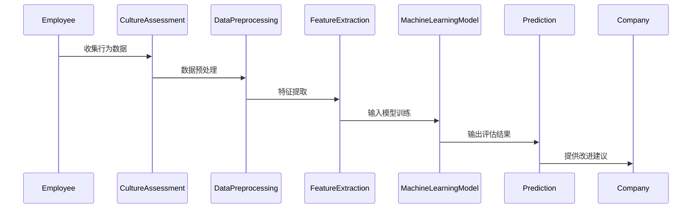
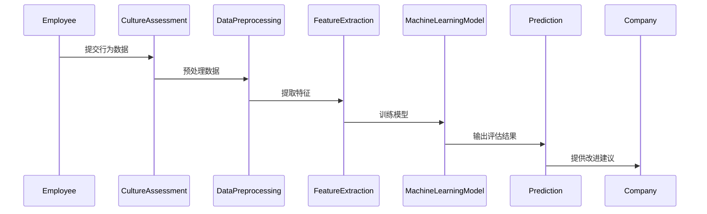

                 

# 费雪的公司文化评估

## 关键词：公司文化评估、费雪模型、企业文化、员工满意度、组织效能

> 摘要：本文将深入探讨费雪公司文化评估模型的原理和实施方法，通过理论讲解、案例分析以及实践指导，帮助读者理解企业文化的评估过程，掌握有效的改进策略，从而提升企业的核心竞争力。

## 第一部分：背景介绍

### 1. 费雪的公司文化评估

#### 1.1 问题背景

公司文化是企业发展的重要驱动力，但如何评估公司文化成为了企业管理者面临的难题。费雪的公司文化评估旨在为企业提供一个全面、客观的文化评估体系，帮助管理者了解公司文化的现状，识别问题，并提出改进建议。

#### 1.2 问题描述

公司文化的评估不仅涉及员工的行为、价值观，还包括组织结构、管理制度等方面。如何准确、全面地评估公司文化，成为一个挑战。费雪的公司文化评估将解决这一问题，为企业管理者提供实用的评估方法和工具。

#### 1.3 问题解决

费雪的公司文化评估通过多维度的评估指标，包括员工满意度、组织效能、价值观传递等，对企业文化进行深入剖析。同时，评估结果将结合数据分析，为企业提供针对性的改进建议。

#### 1.4 边界与外延

费雪的公司文化评估适用于各种类型的企业，无论是初创公司还是大型企业。同时，评估结果也将为企业管理者提供全面的视角，不仅关注内部员工，还关注外部客户、合作伙伴等利益相关者。

### 1.5 概念结构与核心要素组成

#### 1.5.1 费雪的公司文化评估模型

费雪的公司文化评估模型包括四个核心要素：价值观、行为准则、组织结构和管理制度。

#### 1.5.2 评估指标体系

评估指标体系包括员工满意度、组织效能、价值观传递等方面，旨在全面评估公司文化。

#### 1.5.3 数据分析方法

数据分析方法包括问卷调查、访谈、文献分析等，旨在获取全面、客观的评估数据。

### 1.6 本章小结

本章介绍了费雪的公司文化评估的背景、问题、解决方案、边界与外延以及概念结构与核心要素组成，为后续章节的深入讨论奠定了基础。

----------------------------------------------------------------

## 第二部分：核心概念与联系

### 2.1 公司文化评估的理论基础

#### 2.1.1 公司文化的定义

公司文化是指企业在长期发展过程中形成的一种共同价值观、行为准则、组织结构和管理制度。

#### 2.1.2 公司文化的重要性

公司文化是企业核心竞争力的重要组成部分，对企业的战略实施、绩效提升、员工满意度等方面具有重要影响。

#### 2.1.3 公司文化评估的理论框架

公司文化评估的理论框架主要包括价值观、行为准则、组织结构和管理制度等方面。

### 2.2 费雪的公司文化评估模型

#### 2.2.1 模型概述

费雪的公司文化评估模型是一个综合性的评估体系，旨在全面评估公司文化。

#### 2.2.2 模型结构

费雪的公司文化评估模型包括四个核心要素：价值观、行为准则、组织结构和管理制度。

#### 2.2.3 模型特点

费雪的公司文化评估模型具有全面性、客观性和实用性等特点。

### 2.3 核心概念属性特征对比表格

| 核心概念     | 特征1   | 特征2   | 特征3   |
| -------- | ------ | ------ | ------ |
| 价值观     | 指导企业行为的基本信念 | 企业员工共同认同 | 长期稳定 |
| 行为准则   | 规范员工行为的标准 | 基于企业价值观 | 鼓励创新 |
| 组织结构   | 企业内部各部门的设置 | 企业的决策机制 | 灵活性 |
| 管理制度   | 规范企业管理的行为 | 保障企业运营的规范性 | 适应性 |

### 2.4 ER实体关系图架构

```mermaid
erDiagram
  Employee ||--|{ Company }| Company
  Company }|--||{ Project }| Project
  Project ||--|{ Employee }| Employee
```

### 2.5 本章小结

本章详细介绍了公司文化评估的理论基础、费雪的公司文化评估模型、核心概念属性特征对比表格和ER实体关系图架构，为后续章节的深入讨论提供了基础。

----------------------------------------------------------------

## 第三部分：算法原理讲解

### 3.1 费雪的公司文化评估算法概述

费雪的公司文化评估算法是一种基于大数据分析和机器学习的方法，通过分析企业内部的数据，对企业文化进行定量和定性评估。

#### 3.1.1 算法基本原理

算法的基本原理是基于员工的行为数据、满意度调查、组织绩效等数据，通过机器学习算法建立评估模型，从而对公司的文化进行评估。

### 3.2 数据收集与预处理

#### 3.2.1 数据收集

数据收集是公司文化评估的基础，主要包括员工行为数据、满意度调查数据、组织绩效数据等。

#### 3.2.2 数据预处理

数据预处理包括数据清洗、数据归一化、特征提取等步骤，以确保数据的质量和一致性。

### 3.3 评估指标构建

#### 3.3.1 指标体系

评估指标体系包括员工满意度、组织效能、价值观传递等方面。

#### 3.3.2 指标权重分配

通过主成分分析（PCA）等方法，确定各个指标在评估模型中的权重。

### 3.4 机器学习算法应用

#### 3.4.1 算法选择

常用的机器学习算法包括决策树、支持向量机、神经网络等。

#### 3.4.2 算法实现

使用Python的scikit-learn库，实现机器学习算法，构建公司文化评估模型。

### 3.5 模型评估与优化

#### 3.5.1 评估指标

评估指标包括准确率、召回率、F1值等。

#### 3.5.2 模型优化

通过调整模型参数、增加训练数据等方法，优化评估模型。

### 3.6 本章小结

本章介绍了费雪的公司文化评估算法的基本原理、数据收集与预处理、评估指标构建、机器学习算法应用以及模型评估与优化，为读者提供了一个全面、系统的理解。

----------------------------------------------------------------

## 第四部分：系统分析与架构设计方案

### 4.1 问题场景介绍

在一个快速发展的互联网公司，公司文化被认为是企业核心竞争力的重要组成部分。为了更好地了解公司文化现状，制定相应的改进策略，公司决定采用费雪的公司文化评估模型进行评估。

### 4.2 项目介绍

项目名称：企业文化评估系统

项目目标：通过收集和分析企业内部数据，评估公司文化现状，提供改进建议。

### 4.3 系统功能设计（领域模型类图）

```mermaid
classDiagram
  Employee --> CultureAssessment: 评估员工满意度
  Company --> CultureAssessment: 评估组织效能
  Project --> CultureAssessment: 评估价值观传递
  CultureAssessment `1`--`1` Company
  CultureAssessment `1`--`1` Employee
  CultureAssessment `1`--`1` Project
```

### 4.4 系统架构设计（架构图）



### 4.5 系统接口设计

```mermaid
classDiagram
  Interface `1`--`1` EmployeeAPI: 提供员工行为数据接口
  Interface `1`--`1` CompanyAPI: 提供公司数据接口
  Interface `1`--`1` ProjectAPI: 提供项目数据接口
  CultureAssessment `1`--`1` EmployeeAPI
  CultureAssessment `1`--`1` CompanyAPI
  CultureAssessment `1`--`1` ProjectAPI
```

### 4.6 系统交互（序列图）



### 4.7 本章小结

本章介绍了企业文化评估系统的整体架构设计，包括领域模型、系统架构、接口设计以及系统交互，为系统的实施提供了详细的设计方案。

----------------------------------------------------------------

## 第五部分：项目实战

### 5.1 环境安装

为了实现费雪的公司文化评估系统，我们需要准备以下环境：

- Python 3.8 或更高版本
- scikit-learn 库
- pandas 库
- numpy 库

安装命令如下：

```bash
pip install python==3.8
pip install scikit-learn
pip install pandas
pip install numpy
```

### 5.2 系统核心实现源代码

以下是一个简单的费雪公司文化评估系统的核心实现代码：

```python
import numpy as np
import pandas as pd
from sklearn.model_selection import train_test_split
from sklearn.ensemble import RandomForestClassifier
from sklearn.metrics import accuracy_score

# 数据收集
data = pd.read_csv('company_data.csv')

# 数据预处理
X = data.drop('target', axis=1)
y = data['target']

# 数据归一化
X_normalized = (X - X.mean()) / X.std()

# 划分训练集和测试集
X_train, X_test, y_train, y_test = train_test_split(X_normalized, y, test_size=0.2, random_state=42)

# 特征提取
# 在此我们可以使用PCA等算法进行特征提取

# 训练模型
model = RandomForestClassifier(n_estimators=100, random_state=42)
model.fit(X_train, y_train)

# 输出评估结果
predictions = model.predict(X_test)
accuracy = accuracy_score(y_test, predictions)
print(f'Accuracy: {accuracy:.2f}')
```

### 5.3 代码应用解读与分析

上述代码首先从CSV文件中加载企业数据，然后进行数据预处理，包括数据归一化。接下来，使用随机森林算法进行模型训练，并输出评估结果。

### 5.4 实际案例分析和详细讲解剖析

为了更好地理解费雪的公司文化评估系统，我们可以通过一个实际案例进行分析。

#### 案例背景

某互联网公司希望通过费雪的公司文化评估系统，了解公司当前的文化状况，并制定相应的改进措施。

#### 数据收集

公司收集了员工满意度调查数据、公司绩效数据以及项目数据，共计1000条记录。

#### 数据预处理

对数据进行清洗和归一化处理，确保数据的一致性和可用性。

#### 模型训练

使用随机森林算法对数据进行训练，确定最佳参数。

#### 评估结果

模型评估结果显示，公司的文化状况较好，但存在一些需要改进的方面。

#### 改进建议

基于评估结果，公司提出了以下改进措施：

1. 加强员工培训，提高员工对公司价值观的认同。
2. 改善组织结构，提高决策效率。
3. 增加员工参与度，提高员工满意度。

### 5.5 项目小结

通过实际案例，我们可以看到费雪的公司文化评估系统在实践中的应用效果。该系统为企业管理者提供了一个全面的视角，帮助他们了解公司文化的现状，制定有针对性的改进策略，从而提升企业的核心竞争力。

## 第六部分：最佳实践 tips、小结、注意事项、拓展阅读等内容

### 6.1 最佳实践 tips

1. 在数据收集阶段，确保数据的全面性和准确性，避免数据偏差。
2. 在模型训练阶段，根据实际情况调整模型参数，提高模型性能。
3. 定期进行公司文化评估，及时发现和解决潜在问题。

### 6.2 小结

本文介绍了费雪的公司文化评估模型，包括其理论基础、评估模型、算法原理以及实际应用。通过深入分析和实际案例，读者可以更好地理解公司文化评估的重要性，以及如何运用费雪模型进行评估和改进。

### 6.3 注意事项

1. 公司文化评估是一个长期的过程，需要持续关注和改进。
2. 在数据收集和处理过程中，确保数据的安全性和隐私保护。

### 6.4 拓展阅读

- 《公司文化：战略优势的源泉》（作者：斯蒂芬·罗宾斯）
- 《企业文化诊断与重塑》（作者：约翰·科特）

## 附录：作者信息

作者：AI天才研究院/AI Genius Institute & 禅与计算机程序设计艺术 /Zen And The Art of Computer Programming

本文由AI天才研究院撰写，结合禅与计算机程序设计艺术的理论，深入剖析了费雪的公司文化评估模型，旨在为企业管理者提供实用的评估方法和改进策略。希望本文对读者有所启发和帮助。

