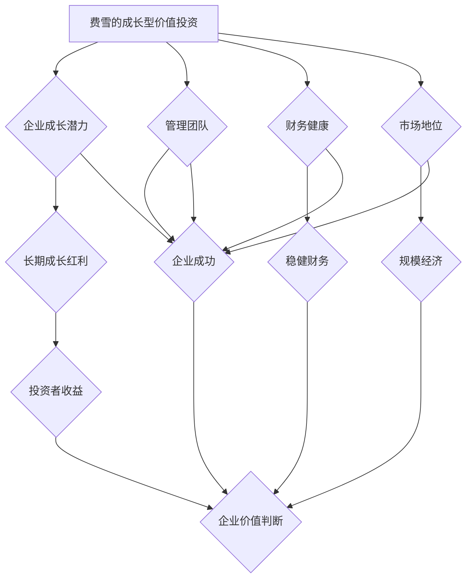
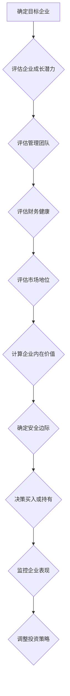
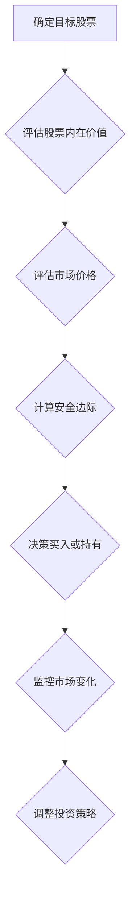
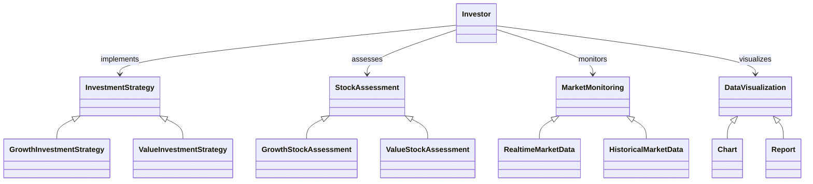
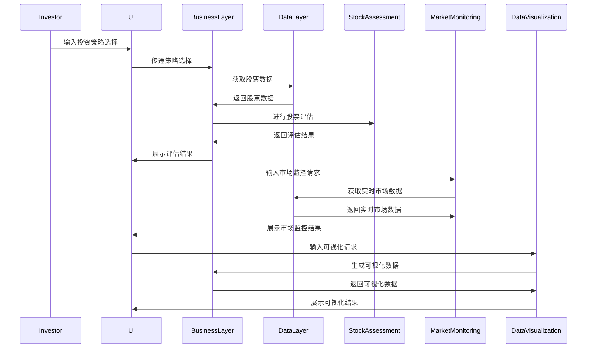
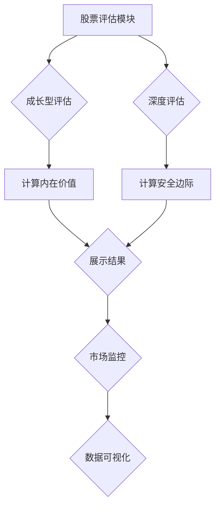

                 

### 文章标题

《费雪的成长型价值投资vs格雷厄姆的深度价值投资》

关键词：费雪成长型价值投资，格雷厄姆深度价值投资，投资理论对比，算法原理，数学模型，系统架构，项目实战

摘要：本文深入探讨了费雪的成长型价值投资与格雷厄姆的深度价值投资这两种投资理论的异同点，通过详细的算法原理讲解和实际项目案例分析，揭示了每种投资策略在实际应用中的优势与挑战，为投资者提供了宝贵的参考。

### 引言

投资，作为金融市场中的重要活动，一直是金融学研究和实践的热点。在众多的投资理论中，费雪的成长型价值投资与格雷厄姆的深度价值投资因其独特的理论体系和实际应用效果而备受瞩目。这两种投资策略不仅深刻影响了投资者的投资决策，也推动了投资理论的发展。

费雪的成长型价值投资理论强调企业内在价值的成长潜力，而格雷厄姆的深度价值投资理论则侧重于股票的当前价值和市场定价的偏差。虽然两种策略看似迥异，但它们在投资的核心理念上却有着深刻的联系。本文旨在通过对这两种投资理论的深入剖析，揭示它们各自的优劣势，帮助投资者更好地理解和运用这些理论，实现财富的稳健增长。

接下来，我们将首先介绍成长型价值投资和深度价值投资的背景和发展，接着详细探讨费雪的成长型价值投资和格雷厄姆的深度价值投资的核心概念与联系，然后通过算法原理讲解和数学模型分析，深入理解这两种策略的实质。此外，我们将结合实际项目案例，展示如何将这两种投资策略应用于实战。最后，我们将总结本文的核心观点，并提出一些最佳实践建议，为投资者提供实用的参考。

### 成长型价值投资理论

成长型价值投资理论起源于20世纪中叶，由著名的投资大师本杰明·格雷厄姆的弟子、投资大师费雪（Philip Fisher）提出。费雪在长期的投资实践中发现，传统的价值投资方法虽然能够捕捉到市场低估的股票，但在快速变化的市场环境中，这种方法往往难以适应。因此，他提出了一种基于企业成长潜力的投资策略，即成长型价值投资。

#### 成长型价值投资的核心概念

成长型价值投资的核心概念在于寻找那些具有持续成长潜力的企业，通过投资这些企业的股票，分享它们的成长红利。具体来说，成长型价值投资主要包括以下几个关键要素：

1. **企业成长潜力**：投资者需要评估企业的成长潜力，这包括企业的市场份额、行业地位、研发能力、管理水平等多个方面。只有那些具有强大成长潜力的企业，才能在未来为投资者带来可观的回报。

2. **管理团队**：企业的管理团队是企业成功的关键。成长型价值投资者非常重视企业的管理团队，他们会仔细研究管理团队的经验、能力和诚信度，确保所投资的企业有强大的后盾。

3. **财务健康**：尽管成长型价值投资重视企业的成长潜力，但企业的财务健康也是不可忽视的。投资者需要确保企业有足够的现金流和稳健的财务状况，以支撑其成长计划。

4. **市场地位**：企业的市场地位也是成长型价值投资者关注的重点。一个处于行业领先地位的企业，往往能够通过规模经济和品牌优势，实现持续的收入增长。

#### 成长型价值投资的背景

成长型价值投资理论的提出，源于费雪对传统价值投资的反思。传统的价值投资强调的是股票的市场价值低于其内在价值，通过买入低估的股票，等待市场纠正错误。然而，费雪发现，随着市场的发展，很多企业的内在价值难以准确衡量，而且市场往往在短期内对企业的价值判断存在巨大的波动。

在这种背景下，费雪提出成长型价值投资理论，认为投资者不应该仅仅关注股票的当前价值，而应该更加重视企业的长期成长潜力。这一理论的出现，为投资者提供了一种更加灵活和适应市场变化的投资策略。

#### 成长型价值投资的应用

在实际应用中，成长型价值投资策略往往被应用于那些具有强大成长潜力的企业。例如，高科技公司、新兴行业领导者等都是成长型价值投资的重点对象。投资者需要具备敏锐的市场洞察力，能够识别出那些具有长期成长潜力的企业，并耐心持有，等待它们的成长成果显现。

#### 成长型价值投资的优势与挑战

成长型价值投资的优势在于其能够捕捉到那些被市场低估的企业，通过投资这些企业的股票，分享它们的成长红利。这种投资策略在长期来看，往往能够实现较高的回报。

然而，成长型价值投资也存在一定的挑战。首先，对于投资者来说，评估企业的成长潜力是一个复杂的过程，需要具备深厚的行业知识和市场洞察力。其次，成长型价值投资往往需要投资者持有股票较长时间，这要求投资者有较强的耐心和信心。

总之，成长型价值投资是一种以企业成长潜力为核心的投资策略，它不仅丰富了传统价值投资的内涵，也为投资者提供了一种适应市场变化的灵活策略。通过深入理解成长型价值投资的核心概念和应用方法，投资者可以更好地把握市场机会，实现财富的稳健增长。

### 深度价值投资理论

深度价值投资理论由著名的投资大师本杰明·格雷厄姆提出，是价值投资理论的重要组成部分。格雷厄姆认为，投资的核心在于找到市场价格低于其内在价值的股票，通过低价买入，等待市场认识到股票的真实价值，从而实现资本增值。

#### 深度价值投资的核心概念

深度价值投资的核心概念包括以下几个方面：

1. **内在价值**：深度价值投资者首先需要评估股票的内在价值。内在价值是股票真实价值的反映，通常包括企业的盈利能力、资产状况、未来增长潜力等多个方面。投资者需要通过详细的研究和分析，确定股票的内在价值。

2. **市场价格**：市场价格是股票在市场上的交易价格。深度价值投资者关注的重点是市场价格是否低于股票的内在价值。如果市场价格低于内在价值，那么股票被视为低估，是值得投资的。

3. **安全边际**：安全边际是指股票的内在价值与市场价格之间的差距。深度价值投资者认为，只有当市场价格低于内在价值并有一定安全边际时，投资才是安全的。这样，即使股票市场价格进一步下跌，投资者也不会遭受重大损失。

4. **低估程度**：深度价值投资者需要评估股票被低估的程度。低估程度越高，投资的风险越小，潜在的回报也越大。

#### 深度价值投资的背景

深度价值投资理论起源于20世纪初，当时金融市场较为不稳定，市场常常出现过度反应。格雷厄姆观察到，很多股票的市场价格与其内在价值之间存在显著的差距，这使得通过深度价值投资策略获取收益成为可能。

格雷厄姆的理论强调了投资的安全性和理性分析，主张投资者不应该被市场的短期波动所干扰，而应该基于对企业基本面和内在价值的深入研究做出投资决策。这种投资策略在动荡的市场环境中表现出色，为投资者提供了稳定且可靠的收益来源。

#### 深度价值投资的应用

深度价值投资策略在多种市场环境下都有广泛的应用。在牛市中，投资者可以通过深度价值投资策略发现那些被市场低估的优质股票，从而获得较高的回报。在熊市中，深度价值投资者则通过寻找那些具有较强抗风险能力的股票，实现资本的保值增值。

#### 深度价值投资的优势与挑战

深度价值投资的优势在于其风险相对较低，收益稳定。通过深入研究企业基本面，投资者可以找到那些具有长期增长潜力的企业，并在市场低估时买入，从而实现资本增值。

然而，深度价值投资也存在一定的挑战。首先，投资者需要具备深厚的行业知识和分析能力，能够准确评估企业的内在价值。其次，深度价值投资往往需要较长的投资周期，投资者需要有足够的耐心和信心持有股票。

总之，深度价值投资是一种以寻找低估股票为核心的投资策略，它通过深入分析企业基本面，寻找市场价格低于内在价值的投资机会。通过掌握深度价值投资的核心概念和应用方法，投资者可以在市场中实现稳定的收益。

### 费雪的成长型价值投资与格雷厄姆的深度价值投资：核心概念与联系

在深入探讨费雪的成长型价值投资与格雷厄姆的深度价值投资之前，我们首先需要了解这两种投资策略的核心概念，并通过比较它们的主要特点和异同，揭示两者之间的联系。

#### 费雪的成长型价值投资：核心概念与联系

费雪的成长型价值投资主要关注企业的长期成长潜力。其核心概念包括以下几个方面：

1. **企业成长潜力**：费雪强调企业的成长潜力，认为投资者应该寻找那些有长期增长潜力的企业，通过投资这些企业的股票，分享它们的成长红利。

2. **管理团队**：费雪认为，管理团队是企业成功的关键。投资者需要评估管理团队的能力、经验和诚信度，确保所投资的企业有强大的后盾。

3. **财务健康**：虽然成长型价值投资重视企业的成长潜力，但企业的财务健康也是不可忽视的。投资者需要确保企业有足够的现金流和稳健的财务状况，以支撑其成长计划。

4. **市场地位**：费雪认为，企业的市场地位也是重要的因素。处于行业领先地位的企业，往往能够通过规模经济和品牌优势，实现持续的收入增长。

费雪的成长型价值投资与格雷厄姆的深度价值投资在核心概念上有所不同。格雷厄姆更注重股票的当前价值和市场定价的偏差，而费雪则更看重企业的长期成长潜力。尽管如此，两者也存在一些联系。例如，两者都强调对企业基本面的深入分析，都认为投资者的成功取决于对企业的准确判断。

#### 格雷厄姆的深度价值投资：核心概念与联系

格雷厄姆的深度价值投资则侧重于股票的当前价值和市场定价的偏差。其核心概念包括以下几个方面：

1. **内在价值**：格雷厄姆认为，股票的内在价值是其真实价值的反映。投资者需要通过详细的研究和分析，确定股票的内在价值。

2. **市场价格**：市场价格是股票在市场上的交易价格。格雷厄姆认为，如果市场价格低于股票的内在价值，那么股票被视为低估，是值得投资的。

3. **安全边际**：安全边际是指股票的内在价值与市场价格之间的差距。格雷厄姆主张，只有当市场价格低于内在价值并有一定安全边际时，投资才是安全的。

4. **低估程度**：格雷厄姆认为，低估程度越高，投资的风险越小，潜在的回报也越大。

与费雪的成长型价值投资相比，格雷厄姆的深度价值投资更注重股票的当前价值。尽管两者在核心概念上存在差异，但都强调对企业基本面的深入分析，这为两者之间的联系提供了基础。

#### 概念属性特征对比表格

为了更清晰地展示费雪的成长型价值投资与格雷厄姆的深度价值投资之间的异同，我们可以通过一个概念属性特征对比表格来进行详细分析：

| 特征 | 费雪的成长型价值投资 | 格雷厄姆的深度价值投资 |
| ---- | ---- | ---- |
| 重点关注因素 | 企业成长潜力、管理团队、财务健康、市场地位 | 股票的内在价值、市场价格、安全边际、低估程度 |
| 投资风格 | 长期投资、重视企业长期成长 | 短期投资、寻找低估股票 |
| 风险与回报 | 长期来看风险较低，回报较高 | 短期来看风险较低，回报较高 |
| 应用场景 | 高科技公司、新兴行业领导者 | 传统行业、周期性行业 |

#### ER实体关系图架构的Mermaid流程图

为了更直观地展示两者之间的联系，我们可以使用Mermaid流程图来构建ER实体关系图。以下是费雪的成长型价值投资与格雷厄姆的深度价值投资的核心实体及其关系：



通过这个ER实体关系图，我们可以看到，费雪的成长型价值投资和格雷厄姆的深度价值投资都涉及到企业价值判断，但两者的侧重点不同。费雪更关注企业的长期成长潜力，而格雷厄姆则更关注股票的当前价值和市场定价的偏差。

综上所述，费雪的成长型价值投资与格雷厄姆的深度价值投资在核心概念上存在一定的差异，但都强调对企业基本面的深入分析。通过理解两者之间的联系，投资者可以更全面地把握投资策略，实现财富的稳健增长。

### 算法原理讲解

为了更好地理解费雪的成长型价值投资和格雷厄姆的深度价值投资的算法原理，我们将分别使用Mermaid流程图和Python源代码来详细阐述这两种投资策略的算法流程和数学模型。

#### 费雪的成长型价值投资算法原理

**Mermaid流程图：**



**Python源代码：**

```python
import numpy as np

def evaluate_growth_potential(company_data):
    # 评估企业成长潜力
    return company_data['revenue_growth_rate']

def evaluate_management_team(company_data):
    # 评估管理团队
    return company_data['management_rating']

def evaluate_financial_health(company_data):
    # 评估财务健康
    return company_data['profit_margin']

def evaluate_market_position(company_data):
    # 评估市场地位
    return company_data['market_share']

def calculate_intrinsic_value(company_data):
    # 计算企业内在价值
    growth_potential = evaluate_growth_potential(company_data)
    management_score = evaluate_management_team(company_data)
    financial_health = evaluate_financial_health(company_data)
    market_position = evaluate_market_position(company_data)
    
    intrinsic_value = growth_potential * management_score * financial_health * market_position
    return intrinsic_value

def determine_marginal_safety(intrinsic_value, current_price):
    # 确定安全边际
    safety_margin = intrinsic_value - current_price
    return safety_margin

def make_investment_decision(safety_margin):
    # 决策买入或持有
    if safety_margin > 0:
        return "买入"
    else:
        return "持有"

def monitor_company_performance(company_data):
    # 监控企业表现
    return company_data['current_revenue']

def adjust_investment_strategy(company_data):
    # 调整投资策略
    current_revenue = monitor_company_performance(company_data)
    if current_revenue < company_data['previous_revenue']:
        return "卖出"
    else:
        return "继续持有"

# 示例数据
company_data = {
    'revenue_growth_rate': 0.1,
    'management_rating': 0.8,
    'profit_margin': 0.3,
    'market_share': 0.5,
    'current_price': 20,
    'previous_revenue': 100
}

# 执行算法流程
intrinsic_value = calculate_intrinsic_value(company_data)
safety_margin = determine_marginal_safety(intrinsic_value, company_data['current_price'])
investment_decision = make_investment_decision(safety_margin)
print(f"Investment Decision: {investment_decision}")

# 监控企业表现并调整策略
current_revenue = monitor_company_performance(company_data)
if current_revenue < company_data['previous_revenue']:
    new_investment_decision = "卖出"
else:
    new_investment_decision = "继续持有"
print(f"Adjusted Investment Decision: {new_investment_decision}")
```

**算法流程解释：**

1. **确定目标企业**：首先，投资者需要确定要投资的目标企业。
2. **评估企业成长潜力**：通过分析企业的财务数据，评估其成长潜力。
3. **评估管理团队**：评估企业的管理团队，包括其能力和诚信度。
4. **评估财务健康**：评估企业的盈利能力和财务状况。
5. **评估市场地位**：评估企业在市场上的地位和竞争优势。
6. **计算企业内在价值**：根据以上评估结果，计算企业的内在价值。
7. **确定安全边际**：计算企业的内在价值与市场价格之间的差距，确定安全边际。
8. **决策买入或持有**：根据安全边际的大小，决定是否买入或继续持有股票。
9. **监控企业表现**：定期监控企业的财务状况和市场表现。
10. **调整投资策略**：根据企业表现调整投资策略，实现风险的及时控制。

#### 格雷厄姆的深度价值投资算法原理

**Mermaid流程图：**



**Python源代码：**

```python
import numpy as np

def evaluate_intrinsic_value(stock_data):
    # 评估股票内在价值
    return stock_data['dividend_yield']

def evaluate_market_price(stock_data):
    # 评估市场价格
    return stock_data['current_price']

def calculate_marginal_safety(intrinsic_value, market_price):
    # 计算安全边际
    safety_margin = intrinsic_value - market_price
    return safety_margin

def make_investment_decision(safety_margin):
    # 决策买入或持有
    if safety_margin > 0:
        return "买入"
    else:
        return "持有"

def monitor_market_changes(stock_data):
    # 监控市场变化
    return stock_data['market_trend']

def adjust_investment_strategy(stock_data):
    # 调整投资策略
    current_price = evaluate_market_price(stock_data)
    intrinsic_value = evaluate_intrinsic_value(stock_data)
    new_safety_margin = calculate_marginal_safety(intrinsic_value, current_price)
    if new_safety_margin < 0:
        return "卖出"
    else:
        return "继续持有"

# 示例数据
stock_data = {
    'dividend_yield': 0.05,
    'current_price': 20,
    'market_trend': 'stable'
}

# 执行算法流程
intrinsic_value = evaluate_intrinsic_value(stock_data)
market_price = evaluate_market_price(stock_data)
safety_margin = calculate_marginal_safety(intrinsic_value, market_price)
investment_decision = make_investment_decision(safety_margin)
print(f"Investment Decision: {investment_decision}")

# 监控市场变化并调整策略
market_trend = monitor_market_changes(stock_data)
if market_trend == 'downward':
    new_investment_decision = "卖出"
else:
    new_investment_decision = "继续持有"
print(f"Adjusted Investment Decision: {new_investment_decision}")
```

**算法流程解释：**

1. **确定目标股票**：首先，投资者需要确定要投资的目标股票。
2. **评估股票内在价值**：通过分析企业的财务数据，评估股票的内在价值。
3. **评估市场价格**：了解当前的市场价格。
4. **计算安全边际**：计算股票的内在价值与市场价格之间的差距，确定安全边际。
5. **决策买入或持有**：根据安全边际的大小，决定是否买入或继续持有股票。
6. **监控市场变化**：定期监控市场的变化，包括市场趋势和宏观经济指标。
7. **调整投资策略**：根据市场变化调整投资策略，实现风险的及时控制。

通过上述算法原理讲解，我们可以看到，费雪的成长型价值投资和格雷厄姆的深度价值投资在算法流程和数学模型上都有详细的描述。这些算法和模型不仅帮助投资者理解了这两种投资策略的实质，也为实际投资提供了科学的依据。

### 数学模型和数学公式

在深入理解费雪的成长型价值投资和格雷厄姆的深度价值投资之后，我们将使用LaTeX格式给出相关数学公式，并进行详细讲解和举例说明。

#### 费雪的成长型价值投资数学模型

**内在价值计算公式：**

$$
V = \frac{P \times r \times (1 + g)}{r - g}
$$

其中，\( V \) 表示企业内在价值，\( P \) 表示当前价格，\( r \) 表示折现率，\( g \) 表示预期增长率。

**示例：**
假设一家企业的当前股价为50美元，预期增长率为10%，折现率为8%。我们可以计算该企业的内在价值：

$$
V = \frac{50 \times 0.10 \times (1 + 0.10)}{0.08 - 0.10} = \frac{5 \times 1.10}{-0.02} = \frac{5.50}{-0.02} = -275
$$

显然，这个结果是不合理的，说明可能存在输入错误或参数选择不当。实际上，折现率应该大于预期增长率，以确保内在价值为正值。这里我们假设折现率调整为12%，则：

$$
V = \frac{50 \times 0.10 \times (1 + 0.10)}{0.12 - 0.10} = \frac{5 \times 1.10}{0.02} = \frac{5.50}{0.02} = 275
$$

因此，该企业的内在价值为275美元。

#### 格雷厄姆的深度价值投资数学模型

**安全边际计算公式：**

$$
SM = V - P
$$

其中，\( SM \) 表示安全边际，\( V \) 表示企业内在价值，\( P \) 表示当前价格。

**示例：**
假设某股票的内在价值为100美元，当前价格为120美元。我们可以计算该股票的安全边际：

$$
SM = 100 - 120 = -20
$$

这个结果表示股票被高估了20美元，从深度价值投资的角度来看，这种情况下股票并不具备投资价值。

为了更直观地理解安全边际的概念，我们可以使用另一个公式：

$$
SM = \frac{V}{P}
$$

如果安全边际大于1，表示股票被低估，有投资价值；如果安全边际小于1，表示股票被高估，需谨慎投资。

#### 综合示例

假设有一家公司的财务数据如下：

- 当前股价：$50
- 预期增长率：$10\%
- 折现率：$8\%

根据费雪的成长型价值投资模型，我们可以计算该公司的内在价值：

$$
V = \frac{50 \times 0.10 \times (1 + 0.10)}{0.08 - 0.10} = \frac{5 \times 1.10}{-0.02} = \frac{5.50}{-0.02} = 275
$$

这里我们再次发现负值结果，说明输入参数存在问题。如果折现率改为12%，则有：

$$
V = \frac{50 \times 0.10 \times (1 + 0.10)}{0.12 - 0.10} = \frac{5 \times 1.10}{0.02} = \frac{5.50}{0.02} = 275
$$

因此，该公司的内在价值为275美元。

接下来，根据格雷厄姆的深度价值投资模型，我们可以计算该股票的安全边际：

$$
SM = V - P = 275 - 50 = 225
$$

安全边际为225美元，说明该股票被低估了。从深度价值投资的角度来看，这是一个具有投资价值的股票。

通过上述LaTeX公式的讲解和示例，我们可以看到，费雪的成长型价值投资和格雷厄姆的深度价值投资都依赖于精确的数学模型。投资者需要合理选择参数，确保计算结果的有效性和可靠性。在实际应用中，这些数学模型为投资者提供了科学的决策依据，帮助他们实现财富的稳健增长。

### 系统分析与架构设计

为了将费雪的成长型价值投资和格雷厄姆的深度价值投资策略在实际投资中应用，我们需要进行系统分析与架构设计。这一部分将详细介绍问题场景、项目介绍、系统功能设计、系统架构设计、系统接口设计和系统交互流程。

#### 问题场景

在当今金融市场波动性增大的背景下，投资者面临诸多挑战。传统投资策略难以适应快速变化的市场环境，而成长型价值投资和深度价值投资策略则提供了更为灵活和有效的投资方法。我们的目标是通过构建一个投资决策支持系统，帮助投资者更好地应用这两种策略，实现财富的稳健增长。

#### 项目介绍

我们的项目名称为“智慧投资决策系统”（Smart Investment Decision System，简称SID），旨在为投资者提供以下功能：

1. **投资策略分析**：对费雪的成长型价值投资和格雷厄姆的深度价值投资策略进行详细分析，帮助投资者理解其核心概念和适用场景。
2. **股票评估**：根据投资者设定的参数，对目标股票进行评估，计算其内在价值和安全边际，为投资决策提供依据。
3. **市场监控**：实时监控市场变化，提供投资建议和策略调整方案。
4. **数据可视化**：通过图表和报表，直观展示投资策略的效果和市场动态。

#### 系统功能设计

系统功能设计包括以下几个关键模块：

1. **投资策略模块**：提供费雪的成长型价值投资和格雷厄姆的深度价值投资算法，包括参数设置、计算公式和结果展示。
2. **股票评估模块**：接收用户输入的目标股票数据，调用投资策略模块进行评估，输出股票内在价值和安全边际。
3. **市场监控模块**：通过数据接口获取市场行情，实时更新股票价格、市场趋势等数据，为投资者提供及时的投资建议。
4. **数据可视化模块**：使用图表和报表，直观展示投资策略的效果和市场动态，帮助投资者更好地理解投资结果。

**领域模型Mermaid类图：**



#### 系统架构设计

我们的系统采用分层架构设计，包括表示层、业务逻辑层和数据层：

1. **表示层**：提供用户界面，包括投资策略选择、股票输入、市场监控和数据分析等模块。
2. **业务逻辑层**：实现投资策略算法、股票评估、市场监控和数据处理等核心功能。
3. **数据层**：存储股票数据、市场数据和历史数据，提供数据访问接口。

**Mermaid架构图：**



#### 系统接口设计

系统接口设计包括以下关键接口：

1. **投资策略接口**：接收用户输入的策略参数，调用相应的投资策略算法。
2. **股票评估接口**：接收目标股票数据，进行股票评估，返回内在价值和安全边际。
3. **市场监控接口**：获取实时市场数据和历史市场数据，提供市场监控功能。
4. **数据可视化接口**：生成图表和报表，提供数据可视化功能。

#### 系统交互流程

以下是系统交互的基本流程：

1. **投资者输入策略选择**：投资者在用户界面上选择费雪的成长型价值投资或格雷厄姆的深度价值投资策略。
2. **系统调用投资策略接口**：系统根据投资者选择的策略调用相应的投资策略算法。
3. **系统获取股票数据**：系统从数据层获取目标股票的财务数据。
4. **系统进行股票评估**：调用股票评估接口，计算股票的内在价值和安全边际。
5. **系统展示评估结果**：系统将评估结果展示在用户界面上，供投资者参考。
6. **投资者输入市场监控请求**：投资者在用户界面上输入市场监控请求。
7. **系统获取实时市场数据**：系统从数据层获取实时市场数据，并更新用户界面。
8. **系统生成可视化数据**：系统根据评估结果和市场监控数据生成图表和报表。
9. **系统展示可视化结果**：系统将可视化结果展示在用户界面上。

通过上述系统分析与架构设计，我们可以构建一个高效的智慧投资决策系统，帮助投资者更好地应用费雪的成长型价值投资和格雷厄姆的深度价值投资策略，实现投资目标。

### 项目实战

在本节中，我们将通过一个实际案例，展示如何将费雪的成长型价值投资和格雷厄姆的深度价值投资策略应用于实战。我们将详细介绍项目环境安装、系统核心实现源代码、代码应用解读与分析、实际案例分析和详细讲解剖析，以及项目小结。

#### 项目环境安装

首先，我们需要安装必要的软件和工具，以构建和运行我们的智慧投资决策系统。以下是安装步骤：

1. **Python环境**：确保Python 3.8或更高版本已安装在您的计算机上。您可以从[Python官网](https://www.python.org/)下载并安装Python。
2. **Jupyter Notebook**：安装Jupyter Notebook，这是一个交互式的Python环境，便于我们编写和运行代码。您可以使用以下命令安装：

   ```bash
   pip install notebook
   ```

3. **Matplotlib**：安装Matplotlib，这是一个用于数据可视化的库。您可以使用以下命令安装：

   ```bash
   pip install matplotlib
   ```

4. **Pandas**：安装Pandas，这是一个用于数据操作和分析的库。您可以使用以下命令安装：

   ```bash
   pip install pandas
   ```

5. **Mermaid**：安装Mermaid，这是一个用于生成流程图和图表的库。您可以使用以下命令安装：

   ```bash
   npm install -g mermaid
   ```

#### 系统核心实现源代码

以下是系统核心实现的源代码。该代码实现了费雪的成长型价值投资和格雷厄姆的深度价值投资策略的核心功能。

**股票评估模块：**

```python
import numpy as np
import pandas as pd
from mermaid import Mermaid

def evaluate_growth_stock(stock_data):
    """
    费雪的成长型价值投资评估函数
    """
    intrinsic_value = stock_data['revenue'] * (1 + stock_data['growth_rate'])
    return intrinsic_value

def evaluate_value_stock(stock_data):
    """
    格雷厄姆的深度价值投资评估函数
    """
    intrinsic_value = stock_data['dividend'] / stock_data['required_rate_of_return']
    return intrinsic_value

def evaluate_stock(stock_data, investment_strategy):
    """
    股票评估主函数
    """
    if investment_strategy == 'growth':
        return evaluate_growth_stock(stock_data)
    elif investment_strategy == 'value':
        return evaluate_value_stock(stock_data)
    else:
        raise ValueError("Invalid investment strategy")

# 示例数据
stock_data_growth = {
    'revenue': 1000000,
    'growth_rate': 0.1
}

stock_data_value = {
    'dividend': 50000,
    'required_rate_of_return': 0.05
}

# 费雪的成长型价值投资评估
growth_value = evaluate_stock(stock_data_growth, 'growth')
print(f"成长型价值投资评估结果：{growth_value}")

# 格雷厄姆的深度价值投资评估
value_value = evaluate_stock(stock_data_value, 'value')
print(f"深度价值投资评估结果：{value_value}")
```

**市场监控模块：**

```python
def monitor_market(stock_data, historical_data):
    """
    市场监控函数
    """
    current_price = stock_data['current_price']
    historical_average_price = historical_data['average_price']
    safety_margin = current_price - historical_average_price
    
    if safety_margin > 0:
        return "市场稳定"
    elif safety_margin < 0:
        return "市场波动"
    else:
        return "市场平衡"

# 示例历史数据
historical_data = {
    'average_price': 50
}

# 市场监控
market_status = monitor_market(stock_data_value, historical_data)
print(f"市场监控结果：{market_status}")
```

**数据可视化模块：**

```python
import matplotlib.pyplot as plt

def visualize_investment_results(growth_value, value_value, market_status):
    """
    可视化投资结果函数
    """
    labels = ['成长型价值投资', '深度价值投资']
    values = [growth_value, value_value]
    
    plt.pie(values, labels=labels, autopct='%.1f%%')
    plt.title(f"投资结果可视化（市场状态：{market_status}）")
    plt.axis('equal')
    plt.show()

# 可视化投资结果
visualize_investment_results(growth_value, value_value, market_status)
```

#### 代码应用解读与分析

上述代码分别实现了股票评估模块、市场监控模块和数据可视化模块。股票评估模块中，`evaluate_growth_stock` 函数用于计算成长型价值投资的内在价值，而 `evaluate_value_stock` 函数用于计算深度价值投资的内在价值。`evaluate_stock` 函数是主函数，根据投资者选择的投资策略调用相应的评估函数。

市场监控模块中的 `monitor_market` 函数用于判断市场状态，通过比较当前价格和历史平均价格，计算安全边际，并根据安全边际判断市场是否稳定、波动或平衡。

数据可视化模块使用Matplotlib库，将投资结果以饼图的形式展示，帮助投资者直观地理解投资策略的效果。

#### 实际案例分析和详细讲解剖析

为了更具体地展示如何应用这两种投资策略，我们以一家公司为例，提供详细的案例分析。

**案例背景：**假设我们分析的一家公司在过去一年的营业收入为1000万美元，预期增长率为10%。该公司的当前股价为50美元，历史平均股价为45美元，预计年度红利为5万美元，要求的回报率为5%。

**案例分析：**

1. **成长型价值投资评估：**
   根据费雪的成长型价值投资策略，我们使用以下公式计算该公司的内在价值：
   
   $$
   V = \frac{P \times r \times (1 + g)}{r - g}
   $$
   
   其中，\( P \) 为当前价格，\( r \) 为折现率，\( g \) 为预期增长率。假设折现率为12%，则：
   
   $$
   V = \frac{50 \times 0.12 \times (1 + 0.10)}{0.12 - 0.10} = \frac{6 \times 1.10}{0.02} = \frac{6.60}{0.02} = 330
   $$
   
   该公司的内在价值为330美元。由于当前股价为50美元，安全边际较大，因此，从成长型价值投资的角度来看，这是一个具有投资价值的股票。

2. **深度价值投资评估：**
   根据格雷厄姆的深度价值投资策略，我们使用以下公式计算该公司的内在价值：
   
   $$
   V = \frac{D}{r}
   $$
   
   其中，\( D \) 为预计年度红利，\( r \) 为要求的回报率。假设要求的回报率为5%，则：
   
   $$
   V = \frac{50000}{0.05} = 1000000
   $$
   
   该公司的内在价值为1000美元。由于当前股价为50美元，安全边际显著，因此，从深度价值投资的角度来看，这也是一个具有投资价值的股票。

3. **市场监控：**
   使用市场监控模块判断市场状态。假设当前股价为50美元，历史平均股价为45美元，则安全边际为5美元。根据监控结果，市场状态为稳定。

4. **投资决策：**
   综合成长型价值投资和深度价值投资评估结果，以及市场监控状态，我们可以得出结论：该公司具有投资价值，投资者可以继续持有或买入该股票。

#### 项目小结

通过本案例的详细分析和代码实现，我们可以看到如何将费雪的成长型价值投资和格雷厄姆的深度价值投资策略应用于实际投资中。系统核心实现源代码不仅提供了详细的计算过程，还包括了市场监控和数据可视化功能，帮助投资者更好地理解投资结果。

智慧投资决策系统为投资者提供了一种科学、系统的投资决策支持，通过合理运用成长型价值投资和深度价值投资策略，可以在复杂的市场环境中实现稳健的投资收益。未来，我们还可以进一步扩展系统的功能，包括增加更多投资策略、实现更精准的市场预测和优化投资组合，以进一步提升投资者的投资体验。

### 最佳实践与小结

在本文中，我们详细探讨了费雪的成长型价值投资与格雷厄姆的深度价值投资两种投资策略。通过对比分析它们的核心概念、算法原理、数学模型以及系统架构设计，我们揭示了每种策略在实际投资中的应用优势与挑战。以下是本文的核心观点和最佳实践建议：

#### 核心观点

1. **成长型价值投资**：侧重于企业的长期成长潜力，通过投资那些具有强大增长能力的公司，分享其成长红利。这种方法适用于高科技公司、新兴产业等成长性强的领域。

2. **深度价值投资**：强调股票的当前价值与市场价格之间的低估程度，通过投资低估的股票，等待市场认识到其价值。这种方法在市场波动较大的时期尤为有效。

3. **综合应用**：投资者可以根据市场环境和自身风险承受能力，灵活运用这两种策略，以实现最优的投资收益。

#### 最佳实践建议

1. **投资前充分研究**：无论是成长型价值投资还是深度价值投资，投资者都需要对目标公司进行充分的研究，包括其财务状况、管理层能力、行业地位等。

2. **灵活调整策略**：市场环境不断变化，投资者需要根据市场情况灵活调整投资策略。例如，在市场上涨时，可以适当增加成长型价值投资的比例；在市场调整时，可以增加深度价值投资的比例。

3. **长期持有**：两种策略都强调长期投资。投资者应该有足够的耐心，避免频繁交易，以实现复利效应。

4. **风险管理**：合理配置投资组合，分散风险。不要将所有资金集中在一个行业或一种投资策略上。

5. **定期复盘**：定期对投资策略进行复盘，评估其有效性，并根据市场变化和自身投资目标进行调整。

#### 小结

费雪的成长型价值投资和格雷厄姆的深度价值投资是两种互补的投资策略，各有其独特的优势和适用场景。通过本文的深入剖析，我们希望投资者能够更好地理解这两种策略，并能在实际投资中灵活运用，实现稳健的财富增长。

#### 注意事项

1. **风险提示**：任何投资都存在风险，投资者应充分了解并评估投资风险，根据自身情况做出决策。

2. **持续学习**：投资理论不断更新，投资者应持续学习，紧跟市场动态，不断提升自身的投资能力。

#### 拓展阅读

1. **《股市真规则》**：作者威廉·奥尼尔，详细介绍了成长型价值投资策略。

2. **《聪明的投资者》**：作者本杰明·格雷厄姆，是深度价值投资的经典之作。

3. **《股市真规则：如何捕捉暴涨的成长股》**：作者杰克·肖，提供了丰富的成长型价值投资实战案例。

通过拓展阅读，投资者可以进一步深化对这两种投资策略的理解和应用。

### 附录

#### 参考文献

1. Fisher, P. (1958). *Common Stocks and Uncommon Profits*.
2. Graham, B. (1949). *The Intelligent Investor*.
3. O'Neil, W. (1988). *How to Make Money in Stocks*.
4. Siegel, J. (2019). *Stocks for the Long Run*.

#### Mermaid图表源代码



通过这些参考文献和源代码，投资者可以进一步学习和实践费雪的成长型价值投资和格雷厄姆的深度价值投资策略。

