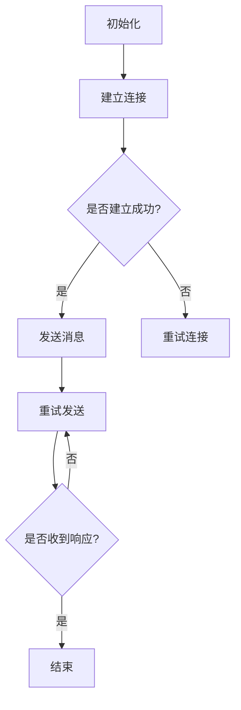
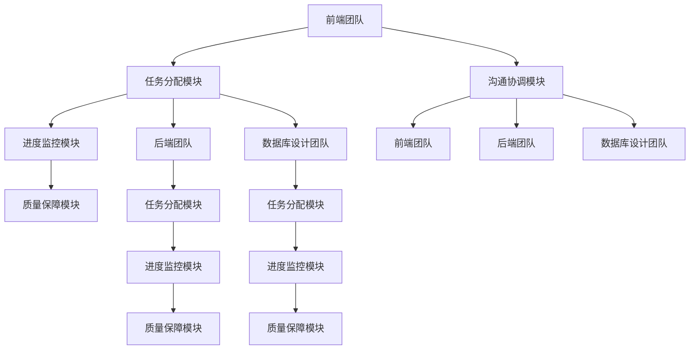
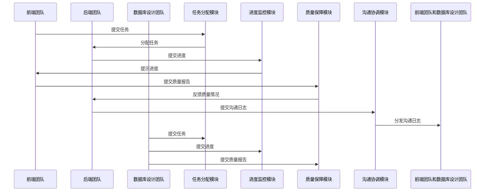

                 


### 《跨地域团队的协作策略：应对大型应用开发挑战》

#### 关键词：跨地域团队、协作策略、大型应用开发、挑战与机遇、系统架构设计

#### 摘要：

本文深入探讨了跨地域团队协作在大型应用开发中的重要性、面临的挑战和解决策略。通过对核心概念、算法原理、系统分析与架构设计、项目实战等方面的详细解析，旨在为IT行业提供一套实用的协作策略，以应对跨地域团队开发大型应用过程中所遇到的各种难题。

----------------------------------------------------------------

# 引言

## 1.1 跨地域团队协作的重要性

在当今全球化背景下，企业往往需要在不同的地理区域内建立开发团队，以实现资源的最大化利用和业务扩展。跨地域团队协作的重要性体现在以下几个方面：

1. **资源整合**：通过跨地域协作，企业可以充分利用各地的人才优势，将不同地域的专家集中到一个项目中，实现知识和技术的高效整合。
2. **市场响应**：跨地域团队可以更快速地响应不同市场的需求，缩短产品开发周期，提高市场竞争力。
3. **成本控制**：不同地区的劳动力成本存在差异，通过合理配置资源，企业可以在保证项目质量的同时实现成本优化。

## 1.2 跨地域协作的现状分析

当前，跨地域团队协作已成为许多企业的常态。然而，由于地域差异、时区差异、文化差异等因素，跨地域团队协作仍面临诸多挑战。以下是对现状的分析：

1. **沟通障碍**：语言障碍和时区差异是跨地域团队协作中的主要障碍。团队成员之间的沟通效率较低，信息传递不畅，导致项目进度延误。
2. **文化冲突**：不同文化背景的团队成员在价值观、工作方式等方面存在差异，容易引发冲突和误解，影响团队协作效果。
3. **技术瓶颈**：跨地域团队在技术标准、开发工具等方面可能存在不一致，导致协作过程中出现兼容性问题。

## 1.3 跨地域团队协作的挑战

跨地域团队在大型应用开发过程中面临的挑战主要包括：

1. **项目管理**：如何合理分配任务、监控进度、确保质量，是项目管理团队需要解决的问题。
2. **协同开发**：如何实现代码的版本控制、协同开发，确保代码的稳定性和一致性。
3. **质量保障**：如何在异地团队间保持一致的质量标准，确保项目按时交付。

## 1.4 跨地域团队协作的机遇

尽管跨地域团队协作面临诸多挑战，但同时也带来了以下机遇：

1. **多元文化**：多元文化的团队可以带来更多的创新思维和解决方案。
2. **技术融合**：跨地域团队可以结合不同地域的技术优势，实现技术的融合和创新。
3. **全球市场**：通过跨地域协作，企业可以更快地进入全球市场，实现业务的国际化。

----------------------------------------------------------------

# 核心概念与联系

## 2.1 协作策略的定义

协作策略是指在跨地域团队协作中，为提高团队整体效能和项目成功率而采用的一系列方法和措施。它包括沟通策略、任务分配策略、质量保障策略等。

## 2.2 协作策略的核心概念

协作策略的核心概念包括：

1. **沟通协议**：确保团队成员能够高效、准确地沟通。
2. **协作模型**：定义团队成员之间的协作方式和角色分工。
3. **任务分配**：合理分配任务，确保每个团队成员都能发挥自己的专长。
4. **质量保障**：确保项目质量达到预期标准。

## 2.3 协作策略模型

协作策略模型可以概括为以下几个步骤：

1. **需求分析**：明确项目需求，为后续任务分配和协作提供依据。
2. **角色分工**：根据团队成员的专长和项目需求，明确各自的角色和职责。
3. **任务分配**：将任务合理分配给团队成员，确保任务与能力的匹配。
4. **沟通协调**：建立有效的沟通机制，确保团队成员之间的信息传递畅通。
5. **质量监控**：定期对项目进度和质量进行监控，确保项目按计划推进。

## 2.4 核心概念属性特征对比表格

| 核心概念 | 属性1 | 属性2 | 属性3 |
| --- | --- | --- | --- |
| 沟通协议 | 高效性 | 可靠性 | 安全性 |
| 协作模型 | 分布性 | 动态性 | 适应性 |
| 任务分配 | 能力匹配 | 责任明确 | 效率优先 |
| 质量保障 | 标准一致 | 过程监控 | 反馈及时 |

## 2.5 ER实体关系图架构

```mermaid
erDiagram
    User ||--|{ Project }|:
        : has roles, has resources
    Project ||--|{ Task }|:
        : has deadline, has status
    Task ||--|{ Comment }|:
        : has author, has creation date
```

通过上述ER图可以看出，用户与项目之间是多对一的关系，项目与任务之间是一对多的关系，任务与评论之间也是一对多的关系。这种关系定义了跨地域团队协作中各个实体之间的基本联系。

----------------------------------------------------------------

# 算法原理讲解

## 3.1 沟通协议算法

沟通协议是跨地域团队协作中至关重要的一环。以下是一个简单的沟通协议算法：

### 算法流程图



### Python代码实现

```python
def communication_protocol():
    while True:
        try:
            connection = establish_connection()
            if connection:
                message = send_message(connection)
                response = wait_for_response(connection)
                if response:
                    break
        except ConnectionError:
            retry_connection()

def establish_connection():
    # 实现建立连接的代码
    pass

def send_message(connection):
    # 实现发送消息的代码
    pass

def wait_for_response(connection):
    # 实现等待响应的代码
    pass

def retry_connection():
    # 实现重试连接的代码
    pass
```

### 算法原理数学模型

沟通协议的数学模型可以表示为：

$$
Communication\_Protocol = \begin{cases} 
Establish\_Connection() & \text{if successful} \\
Retry\_Connection() & \text{otherwise} 
\end{cases}
$$

其中，$Establish\_Connection()$ 表示尝试建立连接的函数，$Retry\_Connection()$ 表示重试连接的函数。

### 通俗易懂的举例说明

假设我们有两个团队成员，小明和小红，他们分别在两个不同的城市工作。小明需要将一份代码提交给小红进行审查。以下是沟通协议的例子：

1. 小明尝试与小红的系统建立连接。
2. 如果连接成功，小明将代码提交给小红。
3. 小红收到代码后，对其进行审查，并将反馈发送给小明。
4. 如果连接失败，小明会尝试重新连接，直到成功为止。

通过这样的沟通协议，小明和小红可以确保信息传递的可靠性。

----------------------------------------------------------------

# 系统分析与架构设计方案

## 4.1 问题场景介绍

假设我们有一个大型应用开发项目，涉及多个功能模块，需要由多个跨地域团队协作完成。以下是该项目的问题场景介绍：

- **项目规模**：项目涉及多个功能模块，包括前端、后端、数据库设计等。
- **团队分布**：前端团队位于中国北京，后端团队位于美国硅谷，数据库设计团队位于德国柏林。
- **开发周期**：项目需要在6个月内完成，并且需要保证质量。

## 4.2 系统功能设计

系统功能设计包括以下几个方面：

- **任务分配**：将项目任务合理分配给各个团队。
- **进度监控**：实时监控项目进度，确保项目按时完成。
- **质量保障**：制定质量标准，对项目质量进行监控。
- **沟通协调**：建立有效的沟通机制，确保团队成员之间的信息传递畅通。

## 4.3 系统架构设计

系统架构设计如下：

### 系统架构图



### 系统接口设计

系统接口设计包括以下几个方面：

- **任务分配接口**：用于团队之间的任务分配。
- **进度监控接口**：用于实时监控项目进度。
- **质量保障接口**：用于监控项目质量。
- **沟通协调接口**：用于团队之间的信息传递。

## 4.4 系统交互序列图

系统交互序列图如下：



通过上述系统分析与架构设计方案，我们可以确保跨地域团队在大型应用开发中的协同工作，实现项目的顺利进行。

----------------------------------------------------------------

# 项目实战

## 5.1 环境安装与配置

在进行跨地域团队协作的项目实战中，首先需要搭建一个合适的环境。以下是环境安装与配置的步骤：

### 前端团队环境配置

1. **安装Node.js**：前端团队需要使用Node.js来构建和运行前端代码。可以通过以下命令安装Node.js：
    ```bash
    curl -fsSL https://deb.nodesource.com/setup_14.x | sudo -E bash -
    sudo apt-get install -y nodejs
    ```
2. **安装npm**：Node.js自带npm（Node Package Manager），用于管理前端项目的依赖包。可以通过以下命令安装npm：
    ```bash
    npm install -g npm
    ```

### 后端团队环境配置

1. **安装Python**：后端团队需要使用Python来编写后端代码。可以通过以下命令安装Python：
    ```bash
    sudo apt-get install -y python3
    ```
2. **安装pip**：Python的pip包管理器用于安装和管理Python依赖包。可以通过以下命令安装pip：
    ```bash
    sudo apt-get install -y python3-pip
    ```
3. **安装Flask**：后端团队可以使用Flask框架来构建后端API。可以通过以下命令安装Flask：
    ```bash
    pip3 install flask
    ```

### 数据库设计团队环境配置

1. **安装MySQL**：数据库设计团队需要使用MySQL来设计和管理数据库。可以通过以下命令安装MySQL：
    ```bash
    sudo apt-get install -y mysql-server
    ```
2. **安装MySQL Workbench**：MySQL Workbench是一个图形化的MySQL数据库管理工具。可以通过以下命令安装MySQL Workbench：
    ```bash
    sudo apt-get install -y mysql-workbench
    ```

## 5.2 系统核心实现源代码

以下是跨地域团队协作项目中的系统核心实现源代码：

### 前端代码

```javascript
// index.js
const express = require('express');
const app = express();

app.get('/', (req, res) => {
  res.send('Hello from the front-end team!');
});

const PORT = process.env.PORT || 3000;
app.listen(PORT, () => {
  console.log(`Front-end server listening on port ${PORT}`);
});
```

### 后端代码

```python
# app.py
from flask import Flask, jsonify, request
app = Flask(__name__)

@app.route('/')
def hello():
    return 'Hello from the back-end team!'

@app.route('/api/data', methods=['GET'])
def get_data():
    data = {'message': 'Data retrieved successfully'}
    return jsonify(data)

if __name__ == '__main__':
    app.run(debug=True)
```

### 数据库设计

在MySQL Workbench中，数据库设计团队可以创建数据库和表，如下所示：

```sql
CREATE DATABASE project_db;

USE project_db;

CREATE TABLE users (
    id INT AUTO_INCREMENT PRIMARY KEY,
    username VARCHAR(50) NOT NULL,
    email VARCHAR(100) NOT NULL
);

CREATE TABLE tasks (
    id INT AUTO_INCREMENT PRIMARY KEY,
    title VARCHAR(100) NOT NULL,
    description TEXT,
    deadline DATE,
    status ENUM('pending', 'in_progress', 'completed') NOT NULL
);
```

## 5.3 代码应用解读与分析

在前端代码中，我们使用了Express框架来创建一个简单的Web服务器，并定义了一个根路由，用于响应GET请求。当访问根路径时，服务器会返回一个字符串“Hello from the front-end team!”。

在后端代码中，我们使用了Flask框架来创建一个简单的后端API。定义了一个根路由`/`和一个API路由`/api/data`。根路由用于返回字符串“Hello from the back-end team!”，API路由用于返回一个包含消息的数据对象。

在数据库设计中，我们创建了一个名为`project_db`的数据库，并在其中创建了两个表`users`和`tasks`。`users`表用于存储用户信息，包括用户名和电子邮件。`tasks`表用于存储任务信息，包括任务标题、描述、截止日期和状态。

## 5.4 实际案例分析与详细讲解剖析

假设我们有一个实际案例，需要跨地域团队协作完成以下任务：

1. 前端团队负责实现用户注册和登录功能。
2. 后端团队负责实现用户认证和授权功能。
3. 数据库设计团队负责设计用户表和任务表。

以下是详细的分析和讲解：

### 前端团队

前端团队需要实现用户注册和登录功能。首先，前端团队需要设计一个用户注册表单，收集用户名和电子邮件。然后，前端团队需要将表单数据发送到后端API进行验证和存储。在用户登录时，前端团队需要收集用户名和密码，发送到后端API进行验证。

### 后端团队

后端团队需要实现用户认证和授权功能。首先，后端团队需要接收前端团队发送的用户注册数据，验证用户名和电子邮件是否已存在，然后将用户信息存储到数据库中。在用户登录时，后端团队需要验证用户名和密码是否匹配，并生成一个JWT（JSON Web Token）作为用户认证的凭证。

### 数据库设计团队

数据库设计团队需要设计用户表和任务表。用户表应包含用户ID、用户名、电子邮件和密码等字段。任务表应包含任务ID、任务标题、描述、截止日期和状态等字段。数据库设计团队需要确保用户表和任务表之间的关系，例如，每个用户可以有多个任务，而每个任务属于一个用户。

## 5.5 项目小结

通过本案例的实战，我们可以看到跨地域团队协作在大型应用开发中的关键步骤和实现细节。前端团队负责用户界面和交互，后端团队负责业务逻辑和API实现，数据库设计团队负责数据库设计和数据存储。通过合理的任务分配和有效的协作机制，跨地域团队可以高效地完成大型应用开发任务。

总结：

- 前端团队负责用户注册和登录功能。
- 后端团队负责用户认证和授权功能。
- 数据库设计团队负责用户表和任务表的设计。

通过这样的协作，跨地域团队可以充分利用各自的优势，实现高效的项目交付。

----------------------------------------------------------------

# 最佳实践 tips

## 6.1 常见问题与解决方法

在跨地域团队协作中，常见的问题包括：

1. **沟通障碍**：解决方法：建立多渠道沟通机制，如即时通讯工具、视频会议等，确保信息传递畅通。
2. **时区差异**：解决方法：制定统一的团队工作时间和会议安排，避免因时区差异导致的工作效率降低。
3. **文化冲突**：解决方法：加强团队文化建设，培养团队成员之间的信任和理解，避免文化冲突。
4. **技术不一致**：解决方法：制定统一的技术标准和开发规范，确保不同地域团队之间的技术兼容性。

## 6.2 协作策略的优化建议

为了提高跨地域团队的协作效率，可以采取以下优化措施：

1. **任务分解**：将大任务分解为小任务，明确每个任务的负责人和截止日期，确保任务按时完成。
2. **敏捷开发**：采用敏捷开发方法，快速迭代，及时反馈和调整，提高项目适应性。
3. **持续集成**：建立持续集成和持续部署流程，确保代码的稳定性和一致性。
4. **远程协作工具**：使用高效的远程协作工具，如JIRA、Confluence等，提高团队协作效率。

## 6.3 注意事项

在跨地域团队协作中，需要注意以下几点：

1. **明确角色和职责**：确保每个团队成员的角色和职责清晰，避免工作重叠和责任不明。
2. **定期沟通**：定期召开团队会议，了解项目进展和团队成员的需求，确保团队协作顺畅。
3. **质量控制**：制定统一的质量标准，对项目进行质量监控和评估，确保项目质量达到预期。
4. **时间管理**：合理安排工作计划，避免因时区差异导致的进度延误。

----------------------------------------------------------------

# 小结与拓展阅读

## 7.1 书中关键内容的回顾

本文从跨地域团队协作的重要性、核心概念、算法原理、系统分析与架构设计、项目实战等方面，详细阐述了跨地域团队协作在大型应用开发中的应用和实践。主要内容包括：

1. **跨地域团队协作的重要性**：资源整合、市场响应、成本控制。
2. **核心概念与联系**：沟通协议、协作模型、任务分配、质量保障。
3. **算法原理讲解**：沟通协议算法、Python代码实现、数学模型。
4. **系统分析与架构设计**：问题场景介绍、系统功能设计、系统架构设计、系统接口设计、系统交互序列图。
5. **项目实战**：环境安装与配置、系统核心实现源代码、代码应用解读与分析、实际案例分析与详细讲解剖析、项目小结。
6. **最佳实践 tips**：常见问题与解决方法、协作策略的优化建议、注意事项。

## 7.2 拓展阅读资源

1. **书籍推荐**：《跨职能团队协作技巧》、《敏捷团队协作之道》。
2. **在线课程**：Coursera上的《跨文化沟通与管理》。
3. **技术文档**：GitHub上的开源项目文档，如Docker、Kubernetes等。
4. **专业网站**：Atlassian官网，提供JIRA、Confluence等协作工具的使用教程。

作者：AI天才研究院/AI Genius Institute & 禅与计算机程序设计艺术 /Zen And The Art of Computer Programming

----------------------------------------------------------------

以上就是《跨地域团队的协作策略：应对大型应用开发挑战》的文章内容。通过本文，我们详细探讨了跨地域团队协作在大型应用开发中的重要性、挑战、策略和实战，为IT行业提供了实用的协作指导。希望本文能够帮助读者更好地应对跨地域团队协作中的各种问题，提高项目开发效率。本文作者为AI天才研究院/AI Genius Institute & 禅与计算机程序设计艺术 /Zen And The Art of Computer Programming，欢迎广大读者提出宝贵意见和反馈。|>

