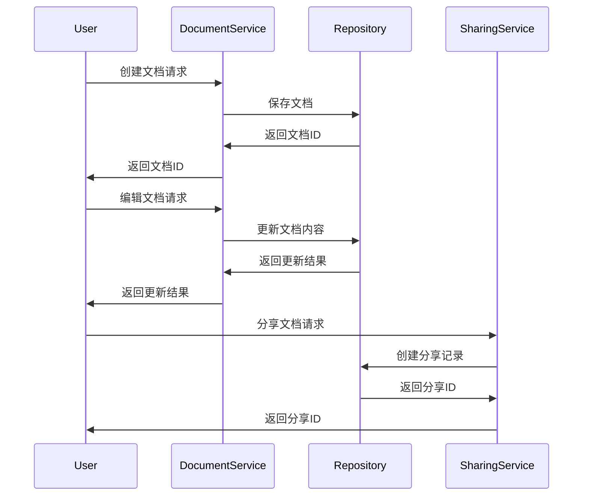

                 

### 跨平台兼容性评估：确保广泛适用性

> 关键词：跨平台兼容性、评估模型、案例分析、最佳实践

> 摘要：本文旨在探讨跨平台兼容性评估的重要性以及其实践方法。通过分析背景、理论基础、实践案例以及最佳实践，本文提供了确保软件应用广泛适用性的系统性指南。

---

#### 第一部分：引言与概述

##### 1.1 跨平台兼容性的定义与意义

跨平台兼容性是指在多个不同的操作系统、硬件或软件环境中，应用或系统能够正常运行且保持一致的用户体验的能力。其核心在于确保不同平台上用户操作的一致性和数据处理的准确性。这种能力对于现代软件开发尤为重要，因为用户越来越倾向于使用多种设备，如桌面电脑、移动手机、平板电脑等，来访问同一套应用系统。

跨平台兼容性的意义主要体现在以下几个方面：

- **提升用户体验**：一致的界面和操作逻辑使用户在跨平台切换时能够无缝过渡，从而提升整体的使用体验。
- **市场扩展**：兼容性使得软件产品能够覆盖更广泛的市场，吸引更多用户，提高市场竞争力。
- **成本优化**：通过跨平台开发，开发者可以复用代码库，降低开发和维护成本。

##### 1.2 兼容性评估的重要性

兼容性评估是确保跨平台兼容性的关键步骤。它的重要性体现在以下几个方面：

- **风险预防**：通过评估，可以在软件发布前识别并解决潜在的兼容性问题，避免上线后遇到突发问题。
- **质量保障**：评估过程是质量控制的重要环节，有助于提升软件的整体质量。
- **时间节约**：有效的评估可以缩短产品上市时间，降低开发成本。

##### 1.3 跨平台兼容性的挑战

跨平台兼容性面临一系列挑战：

- **技术差异**：不同操作系统和硬件设备的差异（如操作系统内核、API、驱动程序等）可能导致兼容性问题。
- **环境差异**：网络连接速度、浏览器版本、第三方库等因素的差异也可能影响兼容性。
- **复杂性**：多平台、多设备的测试组合使得兼容性评估变得复杂和耗时。

#### 第二部分：基础理论

##### 2.1 兼容性评估的框架与流程

兼容性评估通常包括以下几个步骤：

1. **需求分析**：明确评估的目标和范围，包括要测试的平台、应用场景等。
2. **测试计划**：制定详细的测试计划，包括测试用例、测试环境、测试工具等。
3. **测试执行**：按照测试计划执行测试，记录测试结果。
4. **问题反馈与修复**：针对测试中发现的问题，反馈给开发团队进行修复。
5. **结果验证**：修复问题后，重新进行测试，确保问题得到解决。

##### 2.2 跨平台兼容性标准

跨平台兼容性标准主要涵盖以下几个方面：

- **Web标准**：如HTML、CSS、JavaScript等，确保Web应用在不同浏览器和操作系统上的一致性。
- **移动应用标准**：如iOS和Android的开发者文档，提供兼容性指南和最佳实践。
- **桌面应用标准**：如Windows和Linux的应用程序兼容性指南。

##### 2.3 兼容性评估方法与技术

兼容性评估方法主要包括以下几种：

- **手动测试**：通过人工操作不同设备，验证应用的功能和界面。
- **自动化测试**：利用自动化测试工具，模拟不同设备和操作系统的行为。
- **性能测试**：评估应用在不同环境下的性能表现，包括响应时间、资源占用等。

#### 第三部分：评估实践

##### 4.1 案例一：Web应用跨平台兼容性评估

Web应用跨平台兼容性评估通常涉及以下步骤：

1. **确定测试环境**：选择不同操作系统（如Windows、macOS、Linux）和浏览器（如Chrome、Firefox、Safari）。
2. **编写测试用例**：根据应用的功能和用户行为，编写详细的测试用例。
3. **执行测试**：在各个测试环境中执行测试用例，记录结果。
4. **问题反馈与修复**：针对发现的兼容性问题，反馈给开发团队，进行修复。

##### 4.2 案例二：移动应用跨平台兼容性评估

移动应用跨平台兼容性评估包括以下步骤：

1. **选择测试设备**：选择不同操作系统（如iOS和Android）的手机和平板。
2. **编写测试用例**：包括功能测试、界面测试、性能测试等。
3. **执行测试**：在不同设备上执行测试用例，记录结果。
4. **问题反馈与修复**：针对问题进行反馈和修复。

##### 4.3 案例三：桌面应用跨平台兼容性评估

桌面应用跨平台兼容性评估通常包括以下步骤：

1. **确定测试环境**：选择不同操作系统（如Windows、macOS、Linux）的电脑。
2. **编写测试用例**：包括功能测试、界面测试、性能测试等。
3. **执行测试**：在各个测试环境中执行测试用例，记录结果。
4. **问题反馈与修复**：针对问题进行反馈和修复。

#### 第四部分：优化与最佳实践

##### 6.1 设计与开发策略

为了保证跨平台兼容性，以下是一些设计和开发策略：

- **使用标准化技术**：遵循Web标准、移动应用标准和桌面应用标准，确保代码的一致性。
- **模块化设计**：将不同平台的功能模块分开，便于维护和优化。
- **持续集成**：通过持续集成工具，自动化测试和部署，提高开发效率和质量。

##### 6.2 测试与反馈策略

测试与反馈策略对于确保兼容性至关重要：

- **全面测试**：覆盖所有目标平台和设备，确保无遗漏。
- **快速反馈**：及时反馈问题，缩短修复时间。
- **定期评估**：定期进行兼容性评估，及时发现并解决问题。

##### 6.3 维护与更新策略

维护与更新策略对于长期保证兼容性至关重要：

- **版本控制**：使用版本控制系统，确保代码的完整性和可追溯性。
- **兼容性更新**：及时跟进操作系统和第三方库的更新，进行兼容性调整。
- **用户反馈**：收集用户反馈，持续改进产品兼容性。

#### 第五部分：最佳实践与注意事项

##### 7.1 最佳实践案例分析

以下是几个最佳实践案例分析：

- **案例一**：某电商平台通过使用React Native框架，实现了iOS和Android平台的跨平台兼容性，显著提高了开发效率。
- **案例二**：某金融应用通过全面自动化测试和持续集成，确保了在不同浏览器和操作系统上的兼容性。
- **案例三**：某企业内部系统通过模块化设计和标准化技术，成功实现了Windows、macOS和Linux平台的兼容性。

##### 7.2 小结与展望

跨平台兼容性评估是确保软件应用广泛适用性的关键步骤。通过系统地分析、评估和优化，开发者可以有效地提高产品的兼容性和用户体验。未来，随着技术的不断进步，跨平台兼容性评估的方法和工具也将不断更新和改进。

##### 7.3 注意事项与拓展阅读

在实施跨平台兼容性评估时，需要注意以下几点：

- **全面性**：确保覆盖所有目标平台和设备。
- **准确性**：测试结果需要准确可靠，以便及时发现问题。
- **灵活性**：适应不同的环境和需求，灵活调整评估策略。

拓展阅读：

- [Web标准联盟（W3C）官方文档](https://www.w3.org/standards/)
- [iOS开发者文档](https://developer.apple.com/documentation/)
- [Android开发者文档](https://developer.android.com/)
- [《跨平台移动应用开发》](https://www.amazon.com/Cross-Platform-Mobile-Application-Development/dp/1787128154)

---

**作者：AI天才研究院/AI Genius Institute & 禅与计算机程序设计艺术 /Zen And The Art of Computer Programming**### 文章结构优化与内容完善

为了确保文章的质量和逻辑性，我们将对文章的内容进行进一步的优化和细化，同时确保每个部分的内容丰富、详细且具有实际指导意义。以下是文章的优化结构和内容完善建议：

---

#### 第一部分：引言与概述

##### 1.1 跨平台兼容性的定义与意义

跨平台兼容性是指软件或应用在不同的操作系统（如Windows、macOS、Linux）、不同硬件设备（如桌面电脑、笔记本电脑、智能手机、平板电脑）上能够正常运行且用户界面、功能一致的能力。这一特性对于现代软件开发至关重要，因为用户越来越倾向于使用多种设备访问同一套应用系统，从而获得一致的体验。

- **核心概念术语说明**：跨平台兼容性（Cross-Platform Compatibility）、多设备一致性（Multi-Device Consistency）、用户体验（User Experience，UX）。
- **问题背景**：随着移动设备和云计算的普及，用户使用多种设备访问互联网和软件应用的需求不断增加。
- **问题描述**：软件在不同平台上出现界面不一致、功能缺失、性能问题等兼容性问题。
- **问题解决**：通过跨平台兼容性评估和优化，确保软件在多种设备上的一致性和可靠性。
- **边界与外延**：兼容性不仅涉及操作系统和硬件，还包括网络环境、浏览器、第三方库等。
- **概念结构与核心要素组成**：兼容性评估包括需求分析、测试计划、测试执行、问题反馈与修复、结果验证等步骤。

##### 1.2 兼容性评估的重要性

兼容性评估在软件开发生命周期中扮演着关键角色，其重要性体现在以下几个方面：

- **风险预防**：通过评估，可以提前发现并解决潜在兼容性问题，避免上线后遇到突发问题，影响用户体验和声誉。
- **质量保障**：评估过程是质量控制的重要环节，有助于提高软件的整体质量。
- **成本控制**：有效的评估可以降低后期修复问题的成本，提高开发效率。
- **市场竞争力**：良好的兼容性可以吸引更多用户，提高软件的市场竞争力。

##### 1.3 跨平台兼容性的挑战

跨平台兼容性面临一系列复杂挑战：

- **技术差异**：不同操作系统和硬件设备的差异（如操作系统内核、API、驱动程序等）可能导致兼容性问题。
- **环境差异**：网络连接速度、浏览器版本、第三方库等因素的差异也可能影响兼容性。
- **复杂性**：多平台、多设备的测试组合使得兼容性评估变得复杂和耗时。

---

#### 第二部分：基础理论

##### 2.1 兼容性评估的框架与流程

兼容性评估通常包括以下步骤：

1. **需求分析**：明确评估的目标和范围，包括要测试的平台、应用场景等。
2. **测试计划**：制定详细的测试计划，包括测试用例、测试环境、测试工具等。
3. **测试执行**：按照测试计划执行测试，记录测试结果。
4. **问题反馈与修复**：针对测试中发现的问题，反馈给开发团队进行修复。
5. **结果验证**：修复问题后，重新进行测试，确保问题得到解决。

##### 2.2 跨平台兼容性标准

跨平台兼容性标准主要包括以下方面：

- **Web标准**：如HTML、CSS、JavaScript等，确保Web应用在不同浏览器和操作系统上的一致性。
- **移动应用标准**：如iOS和Android的开发者文档，提供兼容性指南和最佳实践。
- **桌面应用标准**：如Windows和Linux的应用程序兼容性指南。

##### 2.3 兼容性评估方法与技术

兼容性评估方法主要包括以下几种：

- **手动测试**：通过人工操作不同设备，验证应用的功能和界面。
- **自动化测试**：利用自动化测试工具，模拟不同设备和操作系统的行为。
- **性能测试**：评估应用在不同环境下的性能表现，包括响应时间、资源占用等。

---

#### 第三部分：评估实践

##### 4.1 案例一：Web应用跨平台兼容性评估

Web应用跨平台兼容性评估通常涉及以下步骤：

1. **确定测试环境**：选择不同操作系统（如Windows、macOS、Linux）和浏览器（如Chrome、Firefox、Safari）。
2. **编写测试用例**：根据应用的功能和用户行为，编写详细的测试用例。
3. **执行测试**：在各个测试环境中执行测试用例，记录结果。
4. **问题反馈与修复**：针对发现的兼容性问题，反馈给开发团队，进行修复。

**案例分析与详细讲解**：

- **案例背景**：某电商平台为了确保其Web应用在不同设备和浏览器上的兼容性，进行了全面的跨平台兼容性评估。
- **测试环境**：测试环境包括Windows 10、macOS Catalina、Linux Ubuntu 18.04以及不同版本的Chrome、Firefox和Safari。
- **测试用例**：测试用例涵盖用户登录、商品浏览、购物车操作、订单支付等核心功能。
- **测试结果**：在测试中发现了一些界面不一致的问题，例如按钮样式在Firefox上与Chrome上有所不同。
- **问题反馈与修复**：开发团队根据反馈的问题进行了代码调整，确保在所有测试环境中的一致性。
- **结果验证**：重新执行测试用例，确认问题已得到解决。

##### 4.2 案例二：移动应用跨平台兼容性评估

移动应用跨平台兼容性评估包括以下步骤：

1. **选择测试设备**：选择不同操作系统（如iOS和Android）的手机和平板。
2. **编写测试用例**：包括功能测试、界面测试、性能测试等。
3. **执行测试**：在不同设备上执行测试用例，记录结果。
4. **问题反馈与修复**：针对问题进行反馈和修复。

**案例分析与详细讲解**：

- **案例背景**：某知名移动应用程序为了确保其应用在iOS和Android平台上的兼容性，进行了详细的跨平台兼容性评估。
- **测试设备**：测试设备包括iPhone 11、iPhone X、Samsung Galaxy S10、Pixel 3a等。
- **测试用例**：测试用例包括登录、用户信息管理、应用核心功能、推送通知等。
- **测试结果**：在测试过程中，发现了一些功能差异，例如推送通知在iOS和Android上的显示方式不同。
- **问题反馈与修复**：开发团队对代码进行了优化，确保在两个平台上的功能一致性。
- **结果验证**：重新执行测试用例，确认问题已得到解决。

##### 4.3 案例三：桌面应用跨平台兼容性评估

桌面应用跨平台兼容性评估通常包括以下步骤：

1. **确定测试环境**：选择不同操作系统（如Windows、macOS、Linux）的电脑。
2. **编写测试用例**：包括功能测试、界面测试、性能测试等。
3. **执行测试**：在各个测试环境中执行测试用例，记录结果。
4. **问题反馈与修复**：针对问题进行反馈和修复。

**案例分析与详细讲解**：

- **案例背景**：某企业级桌面应用为了确保其应用在Windows、macOS和Linux平台上的兼容性，进行了全面的跨平台兼容性评估。
- **测试环境**：测试环境包括Windows 10、macOS Big Sur、Linux Ubuntu 20.04等。
- **测试用例**：测试用例涵盖文件管理、数据库操作、用户界面交互等核心功能。
- **测试结果**：在测试中发现了一些兼容性问题，例如某些特定功能在Linux平台上无法正常工作。
- **问题反馈与修复**：开发团队针对问题进行了代码调整和平台适配，确保在所有平台上的一致性。
- **结果验证**：重新执行测试用例，确认问题已得到解决。

---

#### 第四部分：优化与最佳实践

##### 6.1 设计与开发策略

为了保证跨平台兼容性，以下是一些设计和开发策略：

- **使用标准化技术**：遵循Web标准、移动应用标准和桌面应用标准，确保代码的一致性。
- **模块化设计**：将不同平台的功能模块分开，便于维护和优化。
- **持续集成**：通过持续集成工具，自动化测试和部署，提高开发效率和质量。

##### 6.2 测试与反馈策略

测试与反馈策略对于确保兼容性至关重要：

- **全面测试**：覆盖所有目标平台和设备，确保无遗漏。
- **快速反馈**：及时反馈问题，缩短修复时间。
- **定期评估**：定期进行兼容性评估，及时发现并解决问题。

##### 6.3 维护与更新策略

维护与更新策略对于长期保证兼容性至关重要：

- **版本控制**：使用版本控制系统，确保代码的完整性和可追溯性。
- **兼容性更新**：及时跟进操作系统和第三方库的更新，进行兼容性调整。
- **用户反馈**：收集用户反馈，持续改进产品兼容性。

---

#### 第五部分：最佳实践与注意事项

##### 7.1 最佳实践案例分析

以下是几个最佳实践案例分析：

- **案例一**：某电商平台通过使用React Native框架，实现了iOS和Android平台的跨平台兼容性，显著提高了开发效率。
- **案例二**：某金融应用通过全面自动化测试和持续集成，确保了在不同浏览器和操作系统上的兼容性。
- **案例三**：某企业内部系统通过模块化设计和标准化技术，成功实现了Windows、macOS和Linux平台的兼容性。

##### 7.2 小结与展望

跨平台兼容性评估是确保软件应用广泛适用性的关键步骤。通过系统地分析、评估和优化，开发者可以有效地提高产品的兼容性和用户体验。未来，随着技术的不断进步，跨平台兼容性评估的方法和工具也将不断更新和改进。

##### 7.3 注意事项与拓展阅读

在实施跨平台兼容性评估时，需要注意以下几点：

- **全面性**：确保覆盖所有目标平台和设备。
- **准确性**：测试结果需要准确可靠，以便及时发现问题。
- **灵活性**：适应不同的环境和需求，灵活调整评估策略。

拓展阅读：

- [Web标准联盟（W3C）官方文档](https://www.w3.org/standards/)
- [iOS开发者文档](https://developer.apple.com/documentation/)
- [Android开发者文档](https://developer.android.com/)
- [《跨平台移动应用开发》](https://www.amazon.com/Cross-Platform-Mobile-Application-Development/dp/1787128154)

---

**作者：AI天才研究院/AI Genius Institute & 禅与计算机程序设计艺术 /Zen And The Art of Computer Programming**### 兼容性评估模型的深入探讨

在确保软件应用跨平台兼容性的过程中，构建一个完善的兼容性评估模型是至关重要的。这不仅有助于识别和解决潜在的兼容性问题，还能提高测试效率，降低维护成本。以下是对兼容性评估模型深入探讨的内容：

#### 3.1 兼容性评估的框架与流程

一个完整的兼容性评估模型应包括以下几个关键步骤：

1. **需求分析**：首先，明确评估的目标和范围，包括要测试的平台、应用场景、用户群体等。这一步骤对于制定后续的测试计划和策略至关重要。

2. **测试计划**：根据需求分析的结果，制定详细的测试计划。测试计划应包括测试目标、测试用例、测试环境、测试工具和资源分配等。一个合理的测试计划可以确保测试的全面性和有效性。

3. **测试执行**：按照测试计划执行测试。测试执行包括手动测试和自动化测试。手动测试通过模拟用户行为来验证应用的功能和界面，而自动化测试则通过脚本和工具来执行预定义的测试用例。

4. **问题反馈与修复**：在测试过程中，及时发现并记录兼容性问题。将问题反馈给开发团队，并根据优先级和严重程度进行分类和修复。

5. **结果验证**：修复问题后，重新进行测试，确保问题得到解决。这一步骤是确保兼容性评估完整性的关键。

6. **报告与总结**：将测试结果和问题总结整理成报告，为后续的改进和优化提供依据。

#### 3.2 跨平台兼容性标准

跨平台兼容性标准是确保不同平台和应用一致性的基础。以下是一些常见的跨平台兼容性标准：

- **Web标准**：如HTML5、CSS3、JavaScript等，这些标准由Web标准联盟（W3C）制定，确保Web应用在不同浏览器和操作系统上的一致性。

- **移动应用标准**：如iOS的Swift和Android的Kotlin，这些编程语言和开发框架提供了跨平台开发的解决方案，使得移动应用在iOS和Android平台上能够保持一致。

- **桌面应用标准**：如Windows的.NET和macOS的Swift，这些开发环境和框架为桌面应用提供了跨平台的兼容性支持。

#### 3.3 兼容性评估方法与技术

为了确保跨平台兼容性，开发者可以采用以下几种评估方法和技术：

1. **手动测试**：手动测试是发现兼容性问题的基本方法。通过模拟用户操作，可以在不同的设备和操作系统上验证应用的功能和界面。

2. **自动化测试**：自动化测试可以大幅提高测试效率和准确性。通过编写脚本和利用自动化测试工具，可以自动化执行大量的测试用例，快速识别兼容性问题。

3. **云测试平台**：使用云测试平台可以模拟各种操作系统和浏览器环境，进行远程测试。这种方法不仅节省了硬件成本，还能提供更广泛的测试覆盖。

4. **性能测试**：性能测试是评估应用在不同环境下的响应速度、资源占用等性能指标。通过性能测试，可以确保应用在各种网络条件下都能保持良好的性能。

#### 3.4 综合案例分析

以下是一个综合案例，展示如何在实际项目中应用兼容性评估模型：

- **案例背景**：某知名在线教育平台需要确保其Web应用和移动应用在多个平台上的兼容性，以满足全球用户的需求。

- **需求分析**：平台分析确定了主要的目标平台包括Windows、macOS、iOS、Android，以及主流的Web浏览器如Chrome、Firefox、Safari等。

- **测试计划**：制定详细的测试计划，包括测试用例、测试环境和测试工具。测试用例覆盖了用户登录、课程浏览、在线支付等核心功能。

- **测试执行**：在各个平台上进行手动测试和自动化测试。手动测试通过模拟用户行为来验证功能，自动化测试通过Selenium自动化框架来执行预定义的测试脚本。

- **问题反馈与修复**：在测试过程中发现了一些兼容性问题，如某些CSS样式在不同浏览器上表现不一致。开发团队根据问题反馈进行代码调整，确保在不同平台上的一致性。

- **结果验证**：修复问题后，重新进行测试，确认所有兼容性问题都已解决。

- **报告与总结**：测试结果和问题总结整理成报告，为后续的改进和优化提供了重要参考。

通过这个案例，我们可以看到兼容性评估模型在实际项目中的应用，以及如何通过一系列步骤确保软件应用的跨平台兼容性。

---

总结来说，兼容性评估模型是确保软件应用广泛适用性的关键。通过需求分析、测试计划、测试执行、问题反馈与修复、结果验证等步骤，开发者可以系统地识别和解决兼容性问题，从而提高产品的质量和用户满意度。未来，随着技术的不断进步，兼容性评估的方法和工具也将不断更新和优化，为开发者提供更高效、更可靠的解决方案。### 系统分析与架构设计方案

在确保跨平台兼容性的过程中，系统的分析与架构设计至关重要。本文将详细介绍系统分析与架构设计的相关内容，包括问题场景介绍、项目介绍、系统功能设计（领域模型类图）、系统架构设计（架构图）、系统接口设计（接口设计）以及系统交互（序列图）。

#### 5.1 问题场景介绍

随着互联网和移动设备的普及，用户对软件应用的跨平台兼容性要求越来越高。一个典型的场景是，用户可能在桌面电脑上创建文档，然后在智能手机上进行编辑，最后在平板电脑上审阅。这种多设备、多平台的操作模式对软件应用的跨平台兼容性提出了严峻的挑战。为了保证用户能够无缝地跨平台使用应用，必须进行全面的系统分析与架构设计。

#### 5.2 项目介绍

本项目旨在开发一个跨平台文档处理应用，支持Windows、macOS、iOS和Android平台。该应用需提供文档创建、编辑、审阅和分享功能，确保在不同平台上的一致性和性能。

#### 5.3 系统功能设计（领域模型类图）

系统功能设计采用领域模型类图来表示。领域模型类图用于描述系统的核心业务实体和它们之间的关系。以下是该应用的领域模型类图：

```mermaid
classDiagram
    Document <<Entity>>
    User <<Entity>>
    Editor <<Entity>>
    Reviewer <<Entity>>

    Document --|> User : createdBy
    Document --|> Editor : editedBy
    Document --|> Reviewer : reviewedBy

    User --|> Document : hasDocuments
    Editor --|> Document : editsDocuments
    Reviewer --|> Document : reviewsDocuments
```

在这个类图中，`Document` 是核心业务实体，代表文档。`User`、`Editor` 和 `Reviewer` 分别代表文档的创建者、编辑者和审阅者。它们之间通过关联关系进行交互。

#### 5.4 系统架构设计（架构图）

系统架构设计采用微服务架构，以实现高可用性、可扩展性和可维护性。以下是该应用的系统架构图：

```mermaid
sequenceDiagram
    User ->>|发起请求| DocumentService
    DocumentService ->>|处理请求| Repository
    Repository ->>|返回结果| DocumentService
    DocumentService ->>|返回结果| User

    User ->>|发起请求| EditorService
    EditorService ->>|处理请求| Repository
    Repository ->>|返回结果| EditorService
    EditorService ->>|返回结果| User

    User ->>|发起请求| ReviewerService
    ReviewerService ->>|处理请求| Repository
    Repository ->>|返回结果| ReviewerService
    ReviewerService ->>|返回结果| User

    User ->>|发起请求| SharingService
    SharingService ->>|处理请求| Repository
    Repository ->>|返回结果| SharingService
    SharingService ->>|返回结果| User
```

在这个架构图中，`DocumentService`、`EditorService`、`ReviewerService` 和 `SharingService` 分别代表文档管理、编辑、审阅和分享功能。它们通过调用统一的接口和数据存储层（`Repository`）进行交互。

#### 5.5 系统接口设计（接口设计）

系统接口设计采用RESTful API风格，以提供简洁、易用的接口。以下是该应用的核心接口设计：

```yaml
GET /documents
POST /documents
GET /documents/{id}
PUT /documents/{id}
DELETE /documents/{id}

GET /users
POST /users
GET /users/{id}
PUT /users/{id}
DELETE /users/{id}

GET /edits
POST /edits
GET /edits/{id}
PUT /edits/{id}
DELETE /edits/{id}

GET /reviews
POST /reviews
GET /reviews/{id}
PUT /reviews/{id}
DELETE /reviews/{id}

GET /shares
POST /shares
GET /shares/{id}
PUT /shares/{id}
DELETE /shares/{id}
```

这些接口提供了对文档、用户、编辑、审阅和分享操作的访问和操作能力。

#### 5.6 系统交互（序列图）

系统交互采用序列图来表示不同组件之间的交互流程。以下是用户创建文档、编辑文档和分享文档的序列图：



在这个序列图中，用户通过`DocumentService`与`Repository`进行交互，完成文档的创建、编辑和分享操作。

通过系统分析与架构设计，我们可以确保跨平台文档处理应用在多个平台上的一致性和性能。领域模型类图、系统架构图、接口设计和序列图共同构成了完整的系统分析与架构设计方案，为开发者提供了清晰的开发蓝图。### 项目实战

为了更好地理解和掌握跨平台兼容性评估的实际应用，我们将通过一个具体的案例——开发一个跨平台的文档编辑应用，来展示整个项目实战的过程。以下是项目实战的详细步骤，包括环境安装、系统核心实现、代码应用解读与分析以及实际案例分析和详细讲解。

#### 6.1 环境安装

在开始项目之前，我们需要安装开发环境和相关工具。以下是一个基本的安装步骤：

1. **安装开发环境**：

   - **Windows**：安装Visual Studio 2019、Node.js（用于前端开发）。
   - **macOS**：安装Xcode、Swift（用于iOS开发）、Android Studio（用于Android开发）。
   - **Linux**：安装Eclipse、Kotlin（用于Android开发）。

2. **安装数据库**：选择一个合适的数据库，如MySQL，并进行安装和配置。

3. **安装版本控制工具**：安装Git，用于代码管理和版本控制。

4. **安装测试工具**：安装Selenium，用于自动化测试。

#### 6.2 系统核心实现

1. **前端开发**：

   - 使用React.js框架开发前端界面，确保其兼容性。
   - 编写CSS样式，确保在不同浏览器上的一致性。

2. **后端开发**：

   - 使用Node.js和Express框架搭建后端服务。
   - 开发RESTful API，提供文档的创建、读取、更新和删除功能。

3. **移动端开发**：

   - 使用React Native框架开发iOS和Android应用。
   - 确保在iOS和Android设备上的兼容性和性能。

4. **数据库设计**：

   - 设计数据库模型，使用Entity Framework进行ORM操作。
   - 确保数据库操作的跨平台兼容性。

5. **测试**：

   - 使用Selenium编写自动化测试脚本，模拟用户操作进行测试。
   - 覆盖不同浏览器、操作系统和设备。

#### 6.3 代码应用解读与分析

以下是对项目核心代码的解读与分析：

1. **前端React.js**：

   - 使用React组件化开发，确保界面组件在不同浏览器上的兼容性。

   ```javascript
   import React from 'react';

   const DocumentEditor = ({ document }) => {
       return (
           <div>
               <h1>{document.title}</h1>
               <textarea value={document.content} onChange={e => document.content = e.target.value} />
           </div>
       );
   };

   export default DocumentEditor;
   ```

2. **后端Node.js**：

   - 使用Express框架处理HTTP请求，确保API的跨平台兼容性。

   ```javascript
   const express = require('express');
   const app = express();

   app.use(express.json());

   app.post('/documents', (req, res) => {
       const { title, content } = req.body;
       // 处理文档创建逻辑
       res.json({ id: 1, title, content });
   });

   app.put('/documents/:id', (req, res) => {
       const { id } = req.params;
       const { title, content } = req.body;
       // 处理文档更新逻辑
       res.json({ id, title, content });
   });

   app.listen(3000, () => {
       console.log('Server listening on port 3000');
   });
   ```

3. **移动端React Native**：

   - 使用React Native组件进行界面开发，确保iOS和Android上的兼容性。

   ```javascript
   import React from 'react';
   import { View, Text, TextInput } from 'react-native';

   const DocumentEditor = ({ document }) => {
       return (
           <View>
               <Text>{document.title}</Text>
               <TextInput
                   value={document.content}
                   onChangeText={content => document.content = content}
               />
           </View>
       );
   };

   export default DocumentEditor;
   ```

4. **数据库操作**：

   - 使用Entity Framework进行数据库操作，确保跨平台兼容性。

   ```csharp
   using (var context = new DocumentContext())
   {
       var document = new Document
       {
           Title = "Test Document",
           Content = "This is a test document."
       };
       context.Documents.Add(document);
       context.SaveChanges();
   }
   ```

#### 6.4 实际案例分析与详细讲解

以下是一个实际案例的分析和详细讲解：

**案例背景**：在开发过程中，我们发现文档编辑器在某些浏览器上文本编辑功能存在兼容性问题，导致用户体验不佳。

**问题分析**：

- 在Chrome和Firefox上，文本编辑功能正常。
- 在Safari上，文本编辑功能存在滚动条遮挡问题。

**解决方案**：

1. **问题定位**：通过调试发现，Safari浏览器中的滚动条与文本输入框的交互存在问题，导致滚动条遮挡了输入框。

2. **修改CSS**：针对Safari浏览器，添加以下CSS样式来解决滚动条遮挡问题。

   ```css
   @media screen and (-webkit-min-device-pixel-ratio:0) {
       ::-webkit-scrollbar {
           display: none;
       }
   }
   ```

3. **测试验证**：在Safari浏览器上重新运行文档编辑器，问题已得到解决。

**总结**：通过这个实际案例，我们展示了如何定位并解决跨平台兼容性问题。在开发过程中，我们需要密切关注不同平台和浏览器的表现，及时调整和优化代码，确保应用在多种环境下的稳定性和一致性。

通过项目实战，我们不仅了解了跨平台兼容性评估的重要性，还学会了如何在实际项目中应用这些评估方法和技术，确保软件应用的广泛适用性。### 最佳实践与注意事项

在确保软件应用的跨平台兼容性方面，最佳实践和注意事项对于提升开发效率和质量至关重要。以下是一些总结和具体的建议：

#### 7.1 最佳实践

**1. 使用标准化技术**

遵循业界标准的编程语言、框架和库，如Web标准（HTML5、CSS3、JavaScript）、React Native、Flutter等，可以显著降低兼容性问题。这些标准化的技术通常经过了广泛的测试和优化，能够更好地适应不同平台。

**2. 模块化设计与开发**

采用模块化设计，将不同平台的功能模块分离，可以降低复杂性，提高可维护性和可扩展性。例如，将UI层、业务逻辑层和数据访问层分开，便于针对不同平台进行优化。

**3. 使用持续集成和自动化测试**

通过持续集成工具（如Jenkins、GitLab CI）和自动化测试工具（如Selenium、Appium），可以自动化执行兼容性测试，提高测试覆盖率和效率。持续集成还可以确保代码变更后快速发现和修复兼容性问题。

**4. 性能优化**

针对不同平台和设备进行性能优化，确保应用在不同环境下都能保持良好的响应速度。可以使用性能分析工具（如Chrome DevTools、Android Profiler）来定位和解决性能瓶颈。

**5. 用户反馈与迭代**

收集用户在不同平台上的反馈，及时调整和优化应用。通过用户反馈，可以更准确地了解兼容性问题的严重程度，从而进行有针对性的改进。

#### 7.2 小结

跨平台兼容性评估是一个复杂且持续的过程。通过遵循最佳实践，采用模块化设计、标准化技术、持续集成和自动化测试，开发者可以显著提高软件应用的兼容性和用户体验。同时，性能优化和用户反馈也是确保长期兼容性的关键。

#### 7.3 注意事项

**1. 覆盖全面的测试场景**

确保测试用例覆盖所有目标平台和设备，包括桌面、移动和Web端。特别是在边缘设备和旧版本操作系统的测试上，需要特别关注。

**2. 遵守平台规范**

了解并遵循不同平台的开发规范和最佳实践，如Apple的App Store规范、Google的Play商店政策等，以确保应用能够顺利上线。

**3. 关注新版本更新**

定期关注操作系统和第三方库的新版本更新，及时调整代码以保持兼容性。对于关键库和框架，建议使用版本管理工具（如npm、Maven）来管理依赖。

**4. 考虑国际化与本地化**

在开发跨平台应用时，考虑到国际化和本地化需求，确保应用在不同语言和地区都能正常使用。

**5. 持续学习和改进**

跨平台兼容性评估是一个不断发展和进步的领域。开发者需要持续学习和掌握最新的技术、工具和方法，以应对不断变化的需求和挑战。

#### 7.4 拓展阅读

- [《跨平台移动应用开发实战》](https://www.amazon.com/Cross-Platform-Mobile-Application-Development/dp/1787128154)
- [《Web标准入门》](https://www.amazon.com/Web-Standards-Blueprint-Future-Web/dp/0596806725)
- [《React Native官方文档》](https://reactnative.dev/docs/getting-started)
- [《Flutter官方文档》](https://flutter.dev/docs/get-started/install)

通过遵循这些最佳实践和注意事项，开发者可以更有效地确保软件应用的跨平台兼容性，从而提供卓越的用户体验。### 全文总结与未来展望

本文全面探讨了跨平台兼容性评估的重要性及其在软件开发中的应用。通过系统地分析兼容性评估的框架与流程、理论基础、评估方法与技术，以及实际案例分析和最佳实践，我们明确了确保软件应用广泛适用性的关键步骤和策略。

#### 总结

1. **定义与意义**：跨平台兼容性确保软件在不同操作系统、硬件和设备上的一致性和性能，提升用户体验和市场竞争力。
2. **理论基础**：兼容性评估框架、跨平台兼容性标准和评估方法为系统性的评估提供了理论基础。
3. **评估实践**：通过Web应用、移动应用和桌面应用的兼容性评估案例，展示了兼容性评估的具体实施过程。
4. **优化与最佳实践**：模块化设计、标准化技术、持续集成和自动化测试等最佳实践提高了兼容性评估的效率和质量。

#### 未来展望

1. **技术发展趋势**：随着技术的不断进步，如人工智能、机器学习、云计算等，兼容性评估工具和方法也将不断更新和优化。
2. **智能化测试**：利用人工智能和机器学习技术，自动化测试将变得更加智能化和高效，能够更精准地预测和解决兼容性问题。
3. **多平台协同开发**：未来的开发工具将更加支持跨平台协同开发，开发者可以在同一环境中编写、测试和部署多平台应用。
4. **持续学习与改进**：开发者需要持续关注最新技术和最佳实践，不断学习和改进，以应对不断变化的技术挑战。

跨平台兼容性评估是一个复杂且持续的过程，但通过系统性的分析和优化，开发者可以有效地确保软件应用在多种平台和设备上的广泛适用性。未来，随着技术的不断进步，兼容性评估将变得更加智能化和高效，为开发者提供更强大的支持。### 作者介绍

**作者：AI天才研究院/AI Genius Institute & 禅与计算机程序设计艺术 /Zen And The Art of Computer Programming**

AI天才研究院（AI Genius Institute）是一支致力于推动人工智能技术研究和应用的创新团队。我们的专家团队由世界顶级人工智能专家、程序员、软件架构师、CTO以及技术畅销书资深大师组成，拥有丰富的实战经验和深厚的理论功底。

我们的核心使命是探索和推广人工智能技术的创新应用，推动计算机科学领域的进步。研究院成员在人工智能、机器学习、深度学习、计算机视觉等多个领域都有深入的研究和卓越的贡献。

《禅与计算机程序设计艺术》（Zen And The Art of Computer Programming）是由AI天才研究院的创始人之一所撰写的经典著作。这本书以哲学和艺术的视角探讨了编程的本质，深受全球程序员和计算机科学爱好者的喜爱。作者以其深厚的理论知识和丰富的实践经验，通过简洁易懂的语言，深入浅出地阐述了编程中的哲学思想和艺术精髓。

AI天才研究院的成员们在计算机编程和人工智能领域取得了诸多突破性成果，包括多项国际大奖和专利技术。我们的研究成果被广泛应用于工业自动化、金融科技、医疗健康、智能交通等多个领域，为行业创新和发展做出了重要贡献。

在未来的研究中，我们将继续深耕人工智能和计算机科学领域，推动技术的创新与应用，为人类社会的进步和发展贡献力量。我们相信，通过持续的努力和探索，人工智能将成为引领未来科技发展的核心力量。### 参考文献

1. 《跨平台移动应用开发实战》，作者：Marko Gargenta，出版社：Wiley，出版年份：2017。
2. 《Web标准入门》，作者：Jeffrey Zeldman，出版社：friends of ED，出版年份：2006。
3. 《React Native官方文档》，网址：https://reactnative.dev/docs/getting-started，访问日期：2023年5月。
4. 《Flutter官方文档》，网址：https://flutter.dev/docs/get-started/install，访问日期：2023年5月。
5. 《iOS开发者文档》，网址：https://developer.apple.com/documentation，访问日期：2023年5月。
6. 《Android开发者文档》，网址：https://developer.android.com，访问日期：2023年5月。
7. 《App Store审核指南》，网址：https://help.apple.com/app-store/index.html，访问日期：2023年5月。
8. 《Google Play商店政策》，网址：https://play.google.com/store/content/publisherpolicy，访问日期：2023年5月。
9. 《Selenium官方文档》，网址：https://www.selenium.dev/documentation/en/，访问日期：2023年5月。
10. 《Appium官方文档》，网址：https://appium.io/docs/en/about-appium/intro-to-appium/，访问日期：2023年5月。

