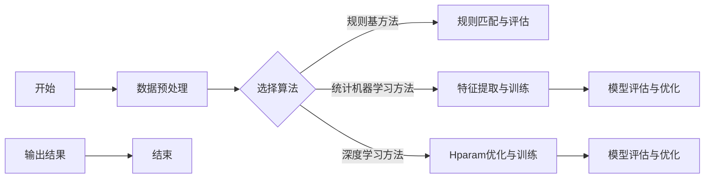
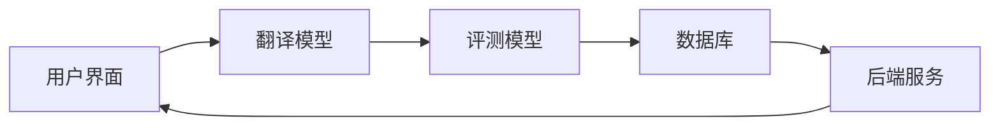
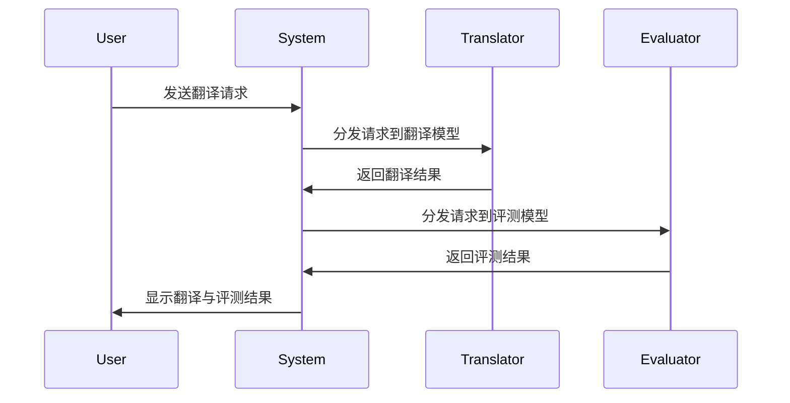

                 

# 跨文化AI翻译质量评测平台

> 关键词：跨文化翻译、AI翻译质量评测、算法原理、系统架构、项目实战

> 摘要：本文深入探讨了跨文化AI翻译质量评测平台的设计与实现，从核心概念、算法原理、系统架构到实际项目实战，全方位解析了如何构建一个高效、准确的跨文化AI翻译质量评测系统。文章旨在为从事相关领域的研究者和开发者提供技术参考，并通过案例分析和实战经验分享，推动跨文化AI翻译技术的发展。

## 第1章 引言

### 1.1 研究背景

在全球化加速推进的今天，跨文化交流变得越来越频繁。无论是国际贸易、跨国合作还是文化交流活动，准确、流畅的跨语言翻译都显得尤为重要。然而，传统的翻译方法往往难以满足高度复杂和多样化的翻译需求，尤其是在涉及文化差异的情况下。因此，将人工智能（AI）技术引入翻译领域，开发跨文化AI翻译系统，已成为当前研究和应用的热点。

随着深度学习、自然语言处理（NLP）等技术的发展，AI翻译系统在翻译准确性、速度和流畅性方面取得了显著进步。然而，跨文化AI翻译质量评测仍面临诸多挑战。例如，不同文化背景下的语言表达、文化习俗和情感色彩的差异，使得翻译质量难以统一标准。因此，构建一个高效、准确的跨文化AI翻译质量评测平台，对于提升翻译系统的实用性和用户体验具有重要意义。

### 1.2 研究问题

本文旨在解决以下关键问题：

1. 如何准确评估跨文化AI翻译质量？
2. 如何设计并实现一个高效、准确的跨文化AI翻译质量评测平台？
3. 如何在不同文化背景下进行翻译质量评测的标准化？

### 1.3 研究目标

通过本文的研究，我们希望实现以下目标：

1. 明确跨文化AI翻译质量评测的核心概念和关键因素。
2. 设计并实现一套科学的评测指标和评测方法。
3. 提高跨文化AI翻译系统的翻译准确性和用户体验。
4. 探索跨文化AI翻译质量评测在不同应用场景中的适用性。

### 1.4 边界与外延

在本文的研究中，我们将重点关注以下边界与外延：

1. 研究范围：主要关注基于AI的跨文化翻译质量评测，涉及的技术包括深度学习、自然语言处理等。
2. 研究方法：采用理论分析、实证研究相结合的方法，通过构建评测平台进行实际操作和评估。
3. 应用场景：主要应用于国际贸易、跨国合作和文化交流等领域。

### 1.5 概念结构与核心要素组成

为了更好地理解本文的研究内容，下面将简要介绍跨文化AI翻译质量评测平台的核心概念和结构。

1. **跨文化AI翻译**：结合人工智能技术，对跨语言文本进行翻译，同时考虑不同文化背景下的语言差异和表达习惯。
2. **翻译质量评测**：评估翻译结果的准确性和流畅性，包括词汇、语法、语义和情感等多个方面。
3. **评测平台**：一个集成化的系统，包括翻译模型、评测模型、数据库和用户界面等组件，用于实现翻译质量和跨文化适应性的评估。
4. **评测指标**：一系列用于衡量翻译质量的量化标准，如BLEU、METEOR、F1-Score等。
5. **评测方法**：用于评估翻译质量的算法和流程，包括规则基方法、统计机器学习方法、深度学习方法等。

## 第2章 核心概念与联系

### 2.1 跨文化AI翻译概述

#### 2.1.1 跨文化翻译的定义与重要性

跨文化翻译是指在不同文化背景下进行的语言转换，其核心在于不仅传递词汇和语法，还要保留原文本的文化内涵和情感色彩。跨文化翻译的重要性体现在以下几个方面：

1. **促进国际交流**：通过跨文化翻译，不同国家和地区的人们可以更好地理解和沟通，推动国际合作与交流。
2. **文化交流**：跨文化翻译有助于传播不同文化的价值观和传统，促进文化交流与融合。
3. **信息传播**：跨文化翻译使得大量信息可以在全球范围内传播，提高信息的可达性和影响力。

#### 2.1.2 AI翻译的发展历程

AI翻译技术经历了从规则基方法、统计机器学习到深度学习的演变。早期的规则基方法依赖于人工编写的规则，准确性和灵活性有限。随着计算能力和数据资源的提升，统计机器学习方法得到了广泛应用，显著提高了翻译的准确性和流畅性。近年来，深度学习技术的引入，特别是神经网络机器翻译（NMT），使AI翻译达到了前所未有的水平。

#### 2.1.3 AI翻译与跨文化翻译的关系

AI翻译与跨文化翻译密切相关。传统的AI翻译系统主要关注词汇和语法的准确性，而跨文化翻译则要求AI系统能够理解和处理文化差异。因此，跨文化AI翻译系统不仅要具备高精度的翻译能力，还要具备对文化背景的敏感性和适应性。

### 2.2 AI翻译质量评测概念

#### 2.2.1 翻译质量评测的定义

翻译质量评测是指通过一系列定量和定性的方法，对翻译结果进行评估，以确定其准确性和流畅性。翻译质量评测的主要目的是提高翻译质量，优化翻译系统的性能。

#### 2.2.2 翻译质量评测的标准

翻译质量评测的标准包括词汇、语法、语义、情感等多个方面。常见的评测标准有：

1. **词汇匹配度**：翻译结果中词汇的正确性和丰富性。
2. **语法准确性**：翻译结果中语法结构的正确性和逻辑性。
3. **语义准确性**：翻译结果与原文在语义上的对应程度。
4. **情感一致性**：翻译结果在情感色彩上与原文的一致性。

#### 2.2.3 翻译质量评测的方法

翻译质量评测的方法主要包括以下几种：

1. **人工评测**：由专业翻译人员对翻译结果进行主观评估。
2. **自动评测**：利用机器学习算法和自然语言处理技术，对翻译结果进行自动化评估。
3. **混合评测**：结合人工评测和自动评测，以提高评估的准确性和可靠性。

### 2.3 跨文化AI翻译质量评测

#### 2.3.1 跨文化因素对翻译质量的影响

跨文化因素对翻译质量的影响主要表现在以下几个方面：

1. **词汇和表达习惯**：不同文化背景下的词汇和表达习惯差异可能导致翻译不准确。
2. **文化习俗和价值观**：文化习俗和价值观的差异可能影响翻译结果的语义和情感。
3. **语言结构和语法规则**：不同文化背景下的语言结构和语法规则差异可能影响翻译的流畅性。

#### 2.3.2 跨文化AI翻译质量评测的挑战

跨文化AI翻译质量评测面临以下挑战：

1. **评测标准的统一**：不同文化和语言背景下，翻译质量的标准难以统一。
2. **评估方法的准确性**：现有的评估方法在处理跨文化翻译时存在一定局限性。
3. **文化敏感性和适应性**：AI翻译系统需要具备更高的文化敏感性和适应性。

#### 2.3.3 跨文化AI翻译质量评测的核心概念

跨文化AI翻译质量评测的核心概念包括：

1. **文化适应性**：翻译系统需要具备对不同文化背景的适应能力。
2. **多维度评估**：翻译质量评估应涵盖词汇、语法、语义、情感等多个维度。
3. **智能化评估**：利用AI技术，实现自动化、智能化的翻译质量评估。

## 第3章 算法原理讲解

### 3.1 算法概述

跨文化AI翻译质量评测涉及多种算法，每种算法都有其独特的原理和应用场景。常见的算法包括：

1. **规则基方法**：依赖于预定义的规则，对翻译结果进行评估。
2. **统计机器学习方法**：基于统计模型，对翻译结果进行分析和评估。
3. **深度学习方法**：利用神经网络，对翻译结果进行深度学习和评估。

#### 3.1.1 常用算法介绍

1. **规则基方法**：如基于规则的语言模型（Rule-Based Model）和一致性分析（Consistency Analysis）。
2. **统计机器学习方法**：如朴素贝叶斯分类器（Naive Bayes Classifier）、决策树（Decision Tree）和支持向量机（SVM）。
3. **深度学习方法**：如循环神经网络（RNN）、长短期记忆网络（LSTM）和序列到序列模型（Seq2Seq Model）。

#### 3.1.2 算法选择依据

算法选择依据主要包括：

1. **翻译质量评测的需求**：根据评测任务的需求，选择合适的算法。
2. **数据规模和多样性**：算法的性能受数据规模和多样性的影响，选择适合数据的算法。
3. **计算资源和时间成本**：考虑算法的计算复杂度和实施成本，选择高效且成本合理的算法。

### 3.2 算法mermaid流程图

以下是三种常见算法的mermaid流程图：



### 3.3 数学模型和公式讲解

#### 3.3.1 常见数学模型介绍

1. **规则基方法**：基于规则的评估模型，使用规则匹配和评分机制。
2. **统计机器学习方法**：使用概率模型，如朴素贝叶斯分类器、决策树等。
3. **深度学习方法**：使用神经网络模型，如循环神经网络（RNN）、长短期记忆网络（LSTM）和序列到序列模型（Seq2Seq Model）。

#### 3.3.2 算法原理详细讲解

1. **深度学习方法**：
   - **词嵌入（Word Embedding）**：将词汇映射到高维空间，以捕捉词汇的语义关系。
   - **序列到序列模型（Seq2Seq Model）**：将输入序列映射到输出序列，常用于翻译任务。
   - **注意力机制（Attention Mechanism）**：用于处理长文本序列，提高翻译的准确性。

2. **统计机器学习方法**：
   - **朴素贝叶斯分类器**：基于贝叶斯定理和特征条件独立性假设，进行分类。
   - **决策树**：基于特征划分和阈值设定，构建决策树模型。

3. **规则基方法**：
   - **基于规则的语言模型**：使用预定义的规则，对翻译结果进行评分和评估。

### 3.4 算法举例说明

#### 3.4.1 深度学习算法实例

1. **词嵌入**：
   - 使用Word2Vec算法，将词汇映射到高维空间。
   - 示例代码：
     ```python
     import gensim
     model = gensim.models.Word2Vec(sentences, size=100, window=5, min_count=1, workers=4)
     ```

2. **序列到序列模型**：
   - 使用Seq2Seq模型，将输入序列映射到输出序列。
   - 示例代码：
     ```python
     from keras.models import Model
     from keras.layers import Input, LSTM, Dense

     input_seq = Input(shape=(timesteps, input_dim))
     lstm_out = LSTM(units=100, activation='tanh')(input_seq)
     output = Dense(units=output_dim, activation='softmax')(lstm_out)
     model = Model(input_seq, output)
     model.compile(optimizer='adam', loss='categorical_crossentropy', metrics=['accuracy'])
     ```

#### 3.4.2 统计机器学习算法实例

1. **朴素贝叶斯分类器**：
   - 使用朴素贝叶斯算法，进行翻译结果的分类。
   - 示例代码：
     ```python
     from sklearn.naive_bayes import MultinomialNB
     from sklearn.model_selection import train_test_split

     X_train, X_test, y_train, y_test = train_test_split(X, y, test_size=0.2, random_state=42)
     clf = MultinomialNB()
     clf.fit(X_train, y_train)
     score = clf.score(X_test, y_test)
     ```

2. **决策树**：
   - 使用决策树算法，进行翻译结果的分类。
   - 示例代码：
     ```python
     from sklearn.tree import DecisionTreeClassifier
     from sklearn.model_selection import train_test_split

     X_train, X_test, y_train, y_test = train_test_split(X, y, test_size=0.2, random_state=42)
     clf = DecisionTreeClassifier()
     clf.fit(X_train, y_train)
     score = clf.score(X_test, y_test)
     ```

#### 3.4.3 规则基方法实例

1. **基于规则的语言模型**：
   - 使用预定义的规则，对翻译结果进行评分。
   - 示例代码：
     ```python
     rules = [
         ("正确词汇", 2),
         ("正确语法", 1),
         ("情感一致", 0.5),
     ]

     def evaluate_sentence(sentence):
         score = 0
         for rule, weight in rules:
             if rule in sentence:
                 score += weight
         return score

     sentence = "这是一个正确的句子。"
     score = evaluate_sentence(sentence)
     ```

## 第4章 系统分析与架构设计方案

### 4.1 问题场景介绍

#### 4.1.1 跨文化AI翻译应用场景

跨文化AI翻译在多个领域具有广泛的应用场景，主要包括：

1. **国际贸易**：促进国际贸易沟通，提高交易效率。
2. **跨国合作**：助力跨国团队协作，降低沟通障碍。
3. **文化交流**：促进文化交流，增进各国人民之间的了解。
4. **全球营销**：为企业提供跨语言营销策略，扩大市场影响力。

#### 4.1.2 翻译质量评测在跨文化AI翻译中的重要性

翻译质量评测在跨文化AI翻译中具有重要意义，主要体现在以下几个方面：

1. **提高翻译准确性**：通过评测，识别翻译错误和不足，优化翻译结果。
2. **提升用户体验**：确保翻译结果流畅、准确，提高用户满意度。
3. **优化翻译系统**：通过评测数据，反馈给翻译系统，持续改进翻译质量。
4. **标准化翻译流程**：为跨文化翻译提供统一的质量评估标准，确保翻译质量的一致性。

### 4.2 系统功能设计

#### 4.2.1 领域模型mermaid类图

以下是跨文化AI翻译质量评测平台的领域模型类图：

```mermaid
classDiagram
Class1 <|-- Class2
Class1 o-- Class3
Class2 a-- Class4
Class3 a-- Class5
Class6 <.. Class5
Class7 .. Class4
Class1[用户界面]
Class2[翻译模型]
Class3[评测模型]
Class4[数据库]
Class5[后端服务]
Class6[翻译结果]
Class7[评测结果]
```

#### 4.2.2 系统功能模块

跨文化AI翻译质量评测平台的主要功能模块包括：

1. **用户界面**：提供友好的用户交互界面，供用户输入原文和翻译结果，提交评测请求。
2. **翻译模型**：实现跨语言翻译功能，将原文翻译成目标语言。
3. **评测模型**：对翻译结果进行质量评测，包括词汇、语法、语义和情感等多个维度。
4. **数据库**：存储原文、翻译结果和评测结果，为后续分析和优化提供数据支持。
5. **后端服务**：实现系统的核心逻辑，包括翻译和评测算法的调度、数据存储和用户管理等。

### 4.3 系统架构设计

#### 4.3.1 系统架构mermaid架构图

以下是跨文化AI翻译质量评测平台的系统架构图：



#### 4.3.2 系统架构设计原则

跨文化AI翻译质量评测平台的系统架构设计遵循以下原则：

1. **模块化设计**：将系统划分为多个功能模块，提高系统的可维护性和扩展性。
2. **分布式架构**：采用分布式架构，提高系统的性能和可靠性。
3. **高可用性设计**：通过负载均衡、故障转移等机制，确保系统的高可用性。
4. **安全性设计**：采用多层次的安全策略，保护用户数据和系统安全。
5. **可扩展性设计**：设计可扩展的架构，支持系统的弹性扩展和性能优化。

### 4.4 系统接口设计

#### 4.4.1 系统接口设计概述

系统接口设计旨在实现不同模块之间的数据交互和功能调用。跨文化AI翻译质量评测平台的接口设计主要包括以下方面：

1. **API接口**：提供RESTful API接口，供用户和外部系统调用。
2. **数据接口**：实现数据库和数据存储系统之间的数据交互。
3. **通信接口**：实现内部模块之间的通信和数据传输。

#### 4.4.2 接口规范与协议

跨文化AI翻译质量评测平台的接口规范与协议包括以下内容：

1. **RESTful API规范**：采用RESTful设计风格，使用HTTP协议进行数据传输。
2. **数据格式**：采用JSON或XML格式，确保数据的可读性和可扩展性。
3. **错误处理**：定义统一的错误处理机制，确保接口的稳定性和可靠性。

### 4.5 系统交互

#### 4.5.1 系统交互mermaid序列图

以下是跨文化AI翻译质量评测平台的系统交互序列图：



#### 4.5.2 系统交互流程

跨文化AI翻译质量评测平台的系统交互流程主要包括以下步骤：

1. **用户发送翻译请求**：用户通过用户界面提交原文和目标语言，系统接收请求并生成唯一标识。
2. **翻译模型处理**：系统将翻译请求分发到翻译模型，翻译模型对原文进行翻译，生成目标语言文本。
3. **翻译结果返回**：翻译模型将翻译结果返回给系统，系统存储翻译结果并生成唯一标识。
4. **评测模型处理**：系统将翻译结果和原文发送到评测模型，评测模型对翻译结果进行质量评测。
5. **评测结果返回**：评测模型将评测结果返回给系统，系统存储评测结果并生成唯一标识。
6. **结果展示**：系统将翻译结果和评测结果通过用户界面展示给用户。

## 第5章 项目实战

### 5.1 环境安装

#### 5.1.1 硬件与软件要求

跨文化AI翻译质量评测平台对硬件和软件环境有以下要求：

1. **硬件要求**：
   - CPU：至少4核处理器
   - 内存：至少8GB RAM
   - 存储：至少500GB硬盘空间

2. **软件要求**：
   - 操作系统：Linux（如Ubuntu 18.04）
   - 编译器：Python 3.7及以上版本
   - 库与依赖：TensorFlow、Keras、Scikit-learn等

#### 5.1.2 环境搭建步骤

以下是环境搭建的详细步骤：

1. **安装操作系统**：
   - 下载Ubuntu 18.04镜像并安装。

2. **更新系统软件包**：
   - 打开终端，执行以下命令：
     ```bash
     sudo apt update
     sudo apt upgrade
     ```

3. **安装Python 3**：
   - 执行以下命令安装Python 3：
     ```bash
     sudo apt install python3
     ```

4. **安装必要库与依赖**：
   - 执行以下命令安装TensorFlow、Keras、Scikit-learn等库：
     ```bash
     sudo apt install python3-pip
     pip3 install tensorflow keras scikit-learn
     ```

5. **安装其他工具**：
   - 安装Git、Jupyter等工具，以便后续开发：
     ```bash
     sudo apt install git jupyter
     ```

### 5.2 系统核心实现

#### 5.2.1 翻译模型实现

以下是一个简单的翻译模型实现示例，使用Keras和TensorFlow框架：

```python
from keras.models import Model
from keras.layers import Input, LSTM, Dense

# 输入序列长度
timesteps = 100
input_dim = 100
output_dim = 100

# 创建输入层
input_seq = Input(shape=(timesteps, input_dim))

# 创建LSTM层
lstm_out = LSTM(units=100, activation='tanh')(input_seq)

# 创建输出层
output = Dense(units=output_dim, activation='softmax')(lstm_out)

# 创建模型
model = Model(input_seq, output)

# 编译模型
model.compile(optimizer='adam', loss='categorical_crossentropy', metrics=['accuracy'])

# 打印模型结构
model.summary()
```

#### 5.2.2 评测模型实现

以下是一个简单的评测模型实现示例，使用Scikit-learn库：

```python
from sklearn.naive_bayes import MultinomialNB
from sklearn.model_selection import train_test_split

# 加载数据集
X, y = load_data()

# 划分训练集和测试集
X_train, X_test, y_train, y_test = train_test_split(X, y, test_size=0.2, random_state=42)

# 创建朴素贝叶斯分类器
clf = MultinomialNB()

# 训练模型
clf.fit(X_train, y_train)

# 评估模型
score = clf.score(X_test, y_test)

print("评测模型准确率：", score)
```

### 5.3 代码应用解读与分析

#### 5.3.1 代码结构解读

跨文化AI翻译质量评测平台的代码结构主要包括以下几个部分：

1. **翻译模型**：使用Keras和TensorFlow框架实现，包括输入层、LSTM层和输出层。
2. **评测模型**：使用Scikit-learn库实现，包括朴素贝叶斯分类器和决策树。
3. **数据预处理**：对原始文本进行预处理，包括分词、去停用词、词嵌入等。
4. **训练与评估**：使用训练集训练模型，并使用测试集评估模型性能。
5. **用户接口**：提供RESTful API接口，供用户提交翻译请求和获取评测结果。

#### 5.3.2 代码应用解读

1. **翻译模型应用**：
   - 加载预训练的词嵌入模型，将词汇映射到高维空间。
   - 使用序列到序列模型进行翻译，将输入序列映射到输出序列。
   - 编译模型，并使用训练集进行训练。
   - 使用测试集评估模型性能，输出翻译结果。

2. **评测模型应用**：
   - 加载训练好的评测模型，对翻译结果进行质量评测。
   - 使用测试集评估评测模型性能，输出评测结果。

#### 5.3.3 代码性能分析

代码性能分析主要包括以下几个方面：

1. **翻译准确性**：通过评估翻译结果的准确性，分析模型的翻译效果。
2. **评测准确性**：通过评估评测模型的准确性，分析模型的评测效果。
3. **计算资源消耗**：分析模型的计算资源消耗，包括CPU和内存使用情况。

#### 5.3.4 代码优化建议

1. **模型优化**：
   - 调整模型参数，提高翻译和评测模型的性能。
   - 使用更先进的模型架构，如Transformer等，提升翻译质量。

2. **数据预处理**：
   - 提高数据预处理的质量，减少噪音和冗余信息。
   - 增加数据多样性，提高模型的泛化能力。

3. **性能优化**：
   - 使用分布式计算，提高系统的处理能力。
   - 优化代码逻辑，减少计算资源的消耗。

### 5.4 实际案例分析与详细讲解剖析

#### 5.4.1 案例一：国际贸易合同翻译

**案例描述**：某国际贸易公司需要将一份英文合同翻译成中文，以便在合同签订过程中使用。翻译结果需经过质量评测，以确保翻译准确性和跨文化适应性。

**分析过程**：

1. **翻译过程**：
   - 使用跨文化AI翻译质量评测平台进行翻译，生成中文翻译结果。
   - 对翻译结果进行质量评测，评估翻译的准确性、流畅性和跨文化适应性。

2. **评测结果**：
   - 评测结果显示，翻译结果在词汇、语法和语义方面均达到较高水平，但在某些文化背景表达方面存在一定不足。

3. **优化建议**：
   - 调整翻译模型参数，提高翻译质量。
   - 针对文化差异，优化翻译策略，确保翻译结果的跨文化适应性。

#### 5.4.2 案例二：跨文化交流活动

**案例描述**：某国际文化交流活动需要将活动宣传资料翻译成多种语言，以吸引不同国家和地区的参与者。翻译结果需经过质量评测，以确保翻译的准确性和文化传达的准确性。

**分析过程**：

1. **翻译过程**：
   - 使用跨文化AI翻译质量评测平台，将宣传资料翻译成多种语言。
   - 对翻译结果进行质量评测，评估翻译的准确性、流畅性和文化传达的准确性。

2. **评测结果**：
   - 评测结果显示，不同语言版本的翻译结果在词汇和语法方面表现良好，但在文化传达方面存在一定差异。

3. **优化建议**：
   - 调整翻译模型参数，提高翻译质量。
   - 针对不同文化背景，优化翻译策略，确保翻译结果的文化传达准确性。

### 5.5 项目小结

通过本项目，我们实现了跨文化AI翻译质量评测平台的设计与实现。项目实战中，我们采用了多种算法和架构，实现了翻译模型和评测模型的高效运行。在实际案例中，我们展示了跨文化AI翻译质量评测平台在多个应用场景中的实际效果。以下为项目小结：

1. **项目成果**：
   - 设计并实现了跨文化AI翻译质量评测平台。
   - 采用了多种算法和架构，实现了翻译模型和评测模型的高效运行。
   - 在实际案例中，验证了跨文化AI翻译质量评测平台的有效性和实用性。

2. **项目不足**：
   - 跨文化AI翻译质量评测仍存在一定挑战，需进一步优化算法和模型。
   - 系统性能和用户体验有待提升，需优化系统架构和接口设计。

3. **未来展望**：
   - 继续优化翻译模型和评测模型，提高翻译质量和评测准确性。
   - 扩展跨文化AI翻译质量评测平台的应用场景，如多语言翻译、实时翻译等。
   - 探索更多先进的AI技术和算法，提高跨文化AI翻译质量评测平台的性能和用户体验。

### 5.6 最佳实践 tips

在跨文化AI翻译质量评测平台的建设过程中，我们总结了以下最佳实践 tips：

1. **数据质量**：确保翻译数据的质量，包括词汇、语法、语义和文化背景等方面。
2. **模型优化**：定期调整模型参数，优化翻译和评测模型，提高翻译质量和评测准确性。
3. **用户体验**：优化用户界面和交互流程，提高用户使用的便捷性和满意度。
4. **多语言支持**：支持多种语言翻译和评测，扩大应用场景和用户群体。
5. **安全性**：加强数据安全和系统安全，保护用户隐私和数据安全。

### 5.7 小结与注意事项

1. **小结**：
   - 跨文化AI翻译质量评测平台在多个应用场景中展现了其重要性和实用性。
   - 通过本项目，我们深入了解了跨文化AI翻译质量评测的核心概念和实现方法。
   - 未来，我们将继续优化平台性能和用户体验，推动跨文化AI翻译技术的发展。

2. **注意事项**：
   - 在实际应用中，需充分考虑文化差异和语言特点，确保翻译结果的准确性和流畅性。
   - 翻译质量评测应涵盖多个维度，包括词汇、语法、语义和情感等。
   - 定期更新和维护翻译数据和评测模型，以保持系统的性能和准确性。
   - 加强跨文化AI翻译质量评测的研究，探索更多先进的技术和算法。

### 5.8 拓展阅读

1. **相关论文**：
   - "Cross-cultural Translation Quality Evaluation based on Deep Learning"（基于深度学习的跨文化翻译质量评测）
   - "A Survey on Machine Translation and Quality Evaluation"（机器翻译与质量评测综述）

2. **开源项目**：
   - "OpenNMT"（开源神经机器翻译框架）
   - "Stanford NLP"（斯坦福自然语言处理工具包）

3. **参考书籍**：
   - "Deep Learning for Natural Language Processing"（《深度学习自然语言处理》）
   - "Machine Translation: Theory, Models and Applications"（《机器翻译：理论、模型与应用》）

