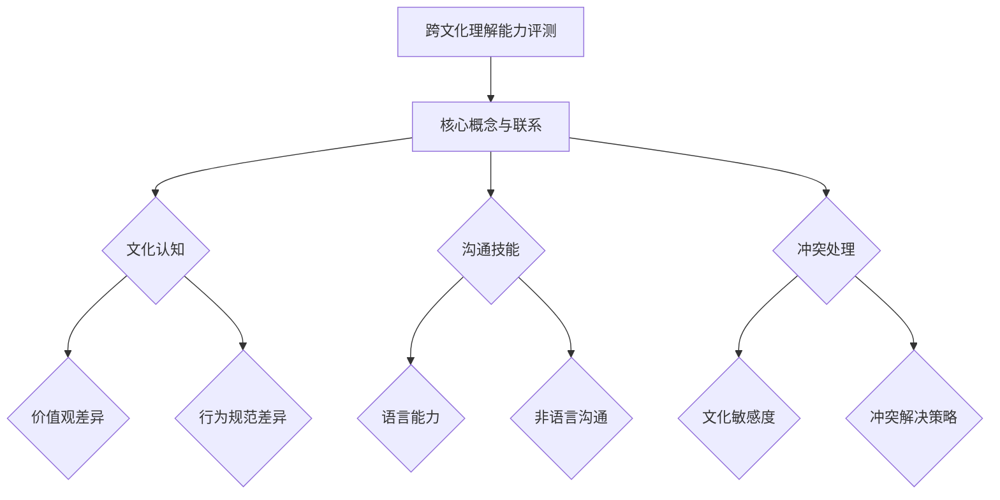

                 

### 引言与背景

#### 核心概念术语说明

在探讨跨文化理解能力评测之前，我们需要对一些核心概念术语进行说明，以便读者能够更好地理解本文的内容。首先，“跨文化理解能力”是指一个人在多元文化背景下，识别、理解和适应不同文化的能力。这一能力不仅包括对文化差异的认知，还包括在跨文化环境中进行有效沟通和合作的能力。

“全球化应用准备”则是指企业在全球化的背景下，如何进行战略规划和资源配置，以确保其产品和服务能够适应并融入不同文化背景的市场。这涉及到跨文化管理、市场调研、产品本地化等多个方面。

#### 问题背景

在全球化的趋势下，跨文化理解能力的重要性日益凸显。随着企业业务的国际化，员工和文化多样性的增加，跨文化沟通和协作成为影响企业绩效的关键因素。然而，当前许多企业和团队在跨文化理解方面存在不足，表现为：

1. **文化差异认知不足**：许多企业在进入新市场时，往往忽视了对当地文化的研究和理解，导致沟通障碍和业务失败。
2. **跨文化冲突频发**：不同文化背景的员工在工作中可能会因价值观、沟通方式和行为规范的不同而产生冲突，影响团队协作效率。
3. **国际化人才缺乏**：能够胜任跨文化管理角色的专业人才稀缺，企业在全球化进程中面临巨大挑战。

#### 问题描述

本文旨在探讨如何通过评测跨文化理解能力，为企业的全球化应用做好准备。具体来说，我们将回答以下问题：

1. 跨文化理解能力评测的目的是什么？
2. 如何设计和实施跨文化理解能力评测？
3. 评测结果如何帮助企业进行全球化应用准备？
4. 跨文化理解能力评测在实践中面临哪些挑战和解决方案？

通过本文的探讨，我们希望能够为企业和团队提供一套系统的跨文化理解能力评测方法，帮助其在全球化应用中取得成功。

#### 问题解决

解决上述问题需要从多个层面进行思考和操作。首先，企业需要认识到跨文化理解能力的重要性，并将其纳入企业文化和人力资源战略中。具体措施包括：

1. **加强跨文化培训**：通过组织内部培训和外部培训，提高员工对跨文化知识的认知和技能。
2. **建立跨文化团队**：鼓励不同文化背景的员工组成团队，通过相互学习和交流，提升团队的整体跨文化理解能力。
3. **引入跨文化理解能力评测**：通过科学的方法对员工的跨文化理解能力进行评估，找出短板并进行有针对性的培训。

其次，在实施评测过程中，企业需要遵循以下原则：

1. **客观性**：评测工具和方法应确保评估结果客观、公正，避免主观偏见。
2. **全面性**：评测内容应涵盖跨文化理解能力的各个方面，包括文化认知、沟通技能、冲突处理等。
3. **实用性**：评测结果应能为企业实际业务提供指导，帮助解决跨文化问题。

最后，企业应根据评测结果，制定相应的改进措施，如调整管理策略、优化团队配置、提供个性化培训等，以确保全球化应用的顺利推进。

#### 边界与外延

在探讨跨文化理解能力评测时，我们需要明确其边界和外延。首先，评测的范围不仅限于员工个人的跨文化理解能力，还包括团队和组织层面的评估。其次，评测的目的是为了提高企业的全球化应用能力，因此评测结果应与企业的战略目标和业务需求紧密相关。

此外，跨文化理解能力评测并非一成不变，随着企业国际化进程的推进和外部环境的变迁，评测的内容和方法也需要不断调整和优化。因此，本文所提出的评测方法是一种动态的、适应性的评估体系，旨在为企业的全球化应用提供持续的支持。

#### 概念结构与核心要素组成

跨文化理解能力评测涉及多个核心概念和要素，其结构如图1所示：

图1 跨文化理解能力评测的核心概念与联系

1. **文化认知**：包括对文化差异的识别、理解和文化背景的研究。
2. **沟通技能**：包括语言沟通和非语言沟通的能力，以及跨文化沟通的技巧。
3. **冲突处理**：包括文化敏感度、冲突解决策略和冲突管理的技能。

这些核心概念和要素相互关联，共同构成了跨文化理解能力评测的完整框架。

### 跨文化理解能力概述

#### 定义

跨文化理解能力是指个体在多元文化背景下，识别、理解和适应不同文化的能力。它不仅包括对文化差异的认知，还涉及在实际沟通和协作中运用这些认知的能力。跨文化理解能力是一个综合性的能力，它包括文化认知、沟通技能、冲突处理等多个方面。

#### 重要性

在全球化的背景下，跨文化理解能力的重要性愈发显著。首先，企业国际化过程中，跨文化理解能力是确保沟通顺畅、合作高效的关键。不同文化背景的员工在价值观、行为规范、沟通方式等方面存在差异，如果没有足够的跨文化理解能力，就容易产生误解和冲突，影响团队协作和业务效率。

其次，跨文化理解能力对市场拓展也具有重要意义。企业在进入新市场时，需要深入了解当地文化，以便进行有效的市场调研、产品本地化和市场营销策略制定。如果缺乏跨文化理解能力，企业可能会在市场推广中犯错，甚至导致品牌形象的负面影响。

此外，跨文化理解能力对个人职业发展也有积极作用。具备较强跨文化理解能力的人，能够更好地适应不同工作环境，拓展职业发展空间，提高职业竞争力。

#### 跨文化理解能力的特征

跨文化理解能力具有以下几个特征：

1. **文化敏感性**：能够敏锐地感知到不同文化背景下的差异，并尊重和理解这些差异。
2. **开放性**：愿意接受不同文化的观点和价值观，并从中学习和成长。
3. **适应性**：能够在不同的文化环境中灵活调整自己的行为和沟通方式，以适应新的环境。
4. **沟通技能**：具备有效的跨文化沟通技巧，能够清晰、准确地表达自己的观点，并理解他人的意图。
5. **冲突管理能力**：能够有效地处理跨文化冲突，找到双方都能接受的解决方案。

这些特征共同构成了跨文化理解能力的核心，是企业和个人在全球化的浪潮中取得成功的重要保障。

### 跨文化理解能力评测方法

#### 概述

跨文化理解能力评测是一种系统性的评估方法，用于测量个体在多元文化背景下的理解能力和适应能力。评测方法的选择和设计直接影响到评估结果的准确性和有效性。本文将介绍几种常用的评测方法，并分析其优缺点。

#### 分类

根据评测的目的和形式，跨文化理解能力评测可以分为以下几类：

1. **问卷法**：
   - **定义**：通过设计问卷，收集个体对文化差异的认知、沟通技能和冲突处理等方面的信息。
   - **优点**：操作简单，成本较低，便于大规模数据收集和分析。
   - **缺点**：受限于问卷设计的科学性和个体的主观回答，可能存在偏差。

2. **面试法**：
   - **定义**：通过与个体进行面对面的交流，评估其跨文化理解能力和实际操作能力。
   - **优点**：可以深入了解个体的实际表现和思考过程，评估结果较为准确。
   - **缺点**：耗时较长，对评估者的专业能力和经验要求较高。

3. **情境模拟法**：
   - **定义**：通过模拟真实工作场景，观察个体在跨文化环境下的行为和表现。
   - **优点**：能够直接反映个体在跨文化环境中的适应能力和应对策略。
   - **缺点**：需要设计和准备大量的情境模拟材料，成本较高。

4. **行为观察法**：
   - **定义**：通过对个体在跨文化环境中的实际行为进行观察，评估其跨文化理解能力。
   - **优点**：能够客观、真实地反映个体的跨文化适应能力。
   - **缺点**：受限于观察者的视角和主观判断，可能存在一定的误差。

#### 常用的评测工具

以下是几种常用的跨文化理解能力评测工具：

1. **跨文化适应能力问卷（CCAI）**：
   - **特点**：包含多个维度，如文化敏感性、沟通技能和冲突处理等，能够全面评估个体的跨文化适应能力。
   - **应用**：广泛应用于企业员工跨文化能力评估和个体自我评估。

2. **跨文化沟通能力测试（CCTT）**：
   - **特点**：通过模拟跨文化沟通场景，测试个体的语言沟通和非语言沟通能力。
   - **应用**：用于招聘和选拔具有跨文化沟通能力的人才。

3. **情境模拟软件**：
   - **特点**：提供多种跨文化情境模拟，如国际会议、商务谈判等，用户可以参与互动，评估跨文化沟通和冲突处理能力。
   - **应用**：用于员工培训和企业内部跨文化能力提升。

#### 选择与实施

在选择和实施跨文化理解能力评测方法时，企业应根据自身的需求和实际情况进行综合考虑。以下是一些建议：

1. **明确评估目标**：根据企业国际化战略和业务需求，确定评估的重点维度和目标。
2. **选择合适的评测工具**：根据评估目标和员工特点，选择适合的评测工具和方法。
3. **确保评估过程的公正性**：确保评测过程的科学性、客观性和公正性，避免主观偏见和人为干扰。
4. **后续跟进与改进**：对评估结果进行深入分析和反馈，制定相应的改进措施，持续提升跨文化理解能力。

通过科学、系统的评测方法，企业可以更好地了解员工的跨文化理解能力，为其全球化应用提供有力的支持。

### 全球化背景与趋势

#### 全球化背景

全球化是指全球经济、政治、文化等各个方面在跨国界的背景下不断融合和扩展的过程。自20世纪后半叶以来，全球化趋势愈发明显，其背后的推动力包括技术进步、国际贸易自由化、跨国企业的兴起以及全球化的政策支持。随着互联网和移动通信技术的快速发展，全球范围内的信息流动和资源分配变得更加便捷，推动了全球化进程的加速。

#### 跨文化理解能力的必要性

在全球化的背景下，企业面临着越来越多的跨国合作和市场竞争。跨文化理解能力成为企业在国际化进程中不可或缺的重要能力。以下几方面说明了跨文化理解能力的必要性：

1. **市场拓展**：企业在进入新市场时，需要深入了解当地的文化、消费者行为和市场特点。如果缺乏跨文化理解能力，企业可能会忽视文化差异，导致市场推广失败。

2. **团队协作**：在跨国团队中，不同文化背景的员工需要有效沟通和协作。如果跨文化理解能力不足，团队成员之间可能会因为文化差异而产生误解和冲突，影响团队效率和合作。

3. **品牌建设**：企业在全球范围内进行品牌建设时，需要考虑不同文化背景的消费者对品牌的感知和接受度。跨文化理解能力有助于企业制定符合当地文化特点的品牌传播策略。

4. **风险管理**：全球化业务面临多种风险，包括政治风险、经济风险、法律风险等。跨文化理解能力有助于企业更好地识别和管理这些风险，确保业务的持续稳定发展。

#### 全球化趋势的影响

当前，全球化趋势对企业的经营管理带来了深远的影响：

1. **国际人才需求**：企业需要招聘和培养具有跨文化理解能力的人才，以应对全球化带来的挑战。这包括本地化管理人员、国际业务专家和跨文化沟通协调员等。

2. **企业战略调整**：企业需要根据全球市场的变化调整战略，如进行产品本地化、优化供应链、调整营销策略等。这要求企业具备较高的跨文化管理能力。

3. **技术创新**：全球化进程加速了技术的跨国传播和合作，企业需要紧跟技术发展趋势，借助全球资源进行技术创新和研发。

4. **市场竞争加剧**：全球化带来了更广泛的市场竞争，企业需要不断提升自身竞争力，包括产品质量、服务水平、品牌影响力等。

总之，在全球化的背景下，跨文化理解能力不仅是企业国际化成功的关键，也是个人职业发展的必备能力。企业和个人都需要不断提升这一能力，以应对全球化带来的机遇和挑战。

### 企业全球化战略

#### 全球化战略的意义

企业全球化战略是企业为实现全球化目标而制定的一系列长远规划和管理措施。全球化战略的意义主要体现在以下几个方面：

1. **市场扩张**：通过全球化战略，企业可以进入新的市场，扩大销售渠道，提高市场份额，从而实现业务增长。
2. **资源整合**：全球化战略有助于企业整合全球资源，包括资金、技术、人才和市场信息，提升企业的竞争力。
3. **降低成本**：通过全球化运营，企业可以利用不同国家的资源优势，优化供应链，降低生产成本。
4. **品牌国际化**：全球化战略有助于企业建立国际品牌形象，提升品牌在国际市场的知名度和影响力。

#### 跨文化管理策略

跨文化管理是企业全球化战略的重要组成部分，其核心目标是确保企业在不同文化背景下实现高效运营。以下是几种常见的跨文化管理策略：

1. **文化适应性培训**：企业可以为员工提供文化适应性培训，帮助其了解和适应不同文化的工作环境和行为规范。培训内容可以包括文化差异、沟通技巧和冲突管理策略等。

2. **跨文化团队建设**：企业可以通过组建跨文化团队，促进不同文化背景员工之间的交流和合作。跨文化团队的组建可以采取多种形式，如国际团队、多元文化团队等。

3. **本地化管理**：企业可以针对不同市场的文化特点，制定本地化管理策略。本地化管理包括产品本地化、市场本地化和员工本地化等。

4. **文化融合**：企业可以通过文化融合策略，将不同文化的优点结合起来，形成一种新的企业文化。文化融合有助于提高员工的认同感和归属感，增强企业的凝聚力。

#### 实施步骤

企业实施全球化战略和跨文化管理策略通常需要经历以下步骤：

1. **市场调研**：在制定全球化战略之前，企业需要进行充分的市场调研，了解目标市场的文化特点、消费者需求和市场环境。

2. **战略规划**：根据市场调研结果，企业制定全球化战略，明确战略目标和实施路径。战略规划应考虑企业的资源能力、市场定位和竞争优势。

3. **组织调整**：企业需要对组织结构进行调整，以适应全球化运营的需要。这可能包括设立国际业务部门、组建跨国团队等。

4. **人才培养**：企业应制定人才培养计划，培养具有跨文化理解能力和国际业务背景的人才。

5. **文化建设**：企业需要建立一种开放、包容的企业文化，鼓励员工接受和尊重不同文化，促进跨文化交流和融合。

6. **持续优化**：企业应定期评估全球化战略和跨文化管理策略的实施效果，根据市场变化和企业发展需求进行调整和优化。

通过科学合理的全球化战略和跨文化管理策略，企业可以在全球化的浪潮中抓住机遇，实现可持续发展。

### 案例分析

#### 案例一：跨国公司跨文化沟通案例分析

**背景**：
某跨国公司（以下简称“公司”）在全球范围内拥有多个分支机构和多样化的员工群体，包括来自不同国家和地区的本土员工和海外派遣员工。公司的主要业务涉及技术、市场和销售等多个领域。

**问题**：
在公司全球化运营过程中，跨文化沟通问题逐渐显现。例如，不同文化背景的员工在沟通方式、工作习惯和决策过程上存在差异，导致项目延误、沟通不畅和团队合作问题。

**解决方案**：
1. **文化适应性培训**：
   公司为所有员工提供文化适应性培训，包括跨文化沟通技巧、文化差异认知和跨文化冲突处理等内容。培训采用在线课程和面对面研讨会相结合的方式，确保员工能够灵活地学习和应用所学知识。

2. **建立沟通平台**：
   公司搭建了一个跨文化沟通平台，包括内部社交媒体和电子邮件列表等工具，用于促进员工之间的交流和互动。平台上的讨论话题涵盖文化差异、工作经验分享和团队建设等，以增强员工的跨文化理解和协作。

3. **跨文化团队建设**：
   公司通过组建跨文化团队，促进不同文化背景员工的合作和交流。在项目团队中，确保团队成员的多样性，鼓励团队成员分享各自的见解和文化背景，共同解决项目中的挑战。

4. **定期的文化沟通活动**：
   公司定期组织文化沟通活动，如国际文化节、团队建设活动和跨文化研讨会等，以增强员工对跨文化沟通的理解和认同。

**效果**：
通过上述措施，公司的跨文化沟通问题得到了显著改善。员工之间的沟通更加顺畅，项目进展更加顺利，团队合作精神得到了提升。同时，员工的文化理解能力和跨文化沟通技能也得到了显著提高。

#### 案例二：跨国团队协作案例分析

**背景**：
某跨国工程公司（以下简称“公司”）在多个国家设有分支机构，其项目团队由来自不同国家和文化背景的工程师和技术专家组成。由于文化差异和工作方式的差异，项目团队在协作过程中遇到了一系列挑战。

**问题**：
1. **沟通障碍**：不同文化背景的工程师在沟通方式、语言表达和沟通频率上存在差异，导致信息传递不畅和项目延误。
2. **决策分歧**：在项目决策过程中，不同文化背景的团队成员可能因为价值观和决策方式的差异而产生分歧，影响项目进展。

**解决方案**：
1. **跨文化沟通培训**：
   公司为项目团队成员提供跨文化沟通培训，内容包括跨文化沟通技巧、文化差异认知和冲突处理策略等。培训采用互动式教学，通过角色扮演和案例分析，提高团队成员的跨文化沟通能力。

2. **设立沟通协调员**：
   公司设立跨文化沟通协调员，负责协调项目团队中的跨文化沟通问题。沟通协调员在项目团队中起到桥梁作用，确保不同文化背景的团队成员能够有效沟通和协作。

3. **项目管理制度**：
   公司制定了一套统一的项目管理制度，包括项目计划、进度跟踪、沟通频率和决策流程等，确保项目能够在标准化管理下顺利进行。

4. **文化尊重与包容**：
   公司鼓励团队成员尊重和包容不同文化，建立开放、包容的工作氛围。公司定期组织团队建设活动，增强团队成员之间的信任和协作。

**效果**：
通过上述措施，项目团队的协作效率显著提高，项目进展顺利，项目质量和客户满意度得到了提升。团队成员的跨文化沟通能力得到了锻炼和提升，跨文化冲突得到了有效解决，团队整体凝聚力和工作效率得到了显著增强。

#### 案例三：跨文化市场拓展案例分析

**背景**：
某知名消费品公司（以下简称“公司”）计划进入东南亚市场，展开产品本地化策略。东南亚市场具有多元化的文化背景，包括泰国、越南、马来西亚和印度尼西亚等国家和地区。

**问题**：
1. **文化差异**：公司在市场拓展过程中发现，东南亚市场的消费者文化、消费习惯和价值观与国内市场存在显著差异。
2. **市场推广策略**：由于对当地市场的文化理解不足，公司的市场推广策略效果不佳，产品销售未达到预期。

**解决方案**：
1. **市场调研**：
   公司进行了全面的市场调研，深入了解东南亚市场的文化特点、消费者需求和市场竞争状况。调研包括问卷调查、深度访谈和实地考察等方式，确保数据的真实性和全面性。

2. **产品本地化**：
   公司根据市场调研结果，对产品进行本地化改造。例如，调整产品的包装设计、口味和规格，以适应不同国家和地区的消费者偏好。

3. **文化敏感营销**：
   公司在市场营销策略中融入当地文化元素，例如在广告宣传中采用当地语言、使用当地节日和习俗等，以提高品牌在当地市场的接受度和影响力。

4. **本地化管理团队**：
   公司在东南亚市场设立了本地化管理团队，由熟悉当地文化和市场的员工组成。本地化管理团队负责制定市场策略、执行市场推广计划和解决实际问题。

**效果**：
通过上述措施，公司的产品在东南亚市场取得了显著的销售增长。品牌形象得到了提升，市场份额逐步扩大。同时，公司的跨文化理解能力和市场拓展能力也得到了显著增强。

### 跨文化理解能力评测实践

#### 评测实践步骤

跨文化理解能力评测实践是一个系统的过程，包括以下步骤：

1. **需求分析**：
   - **确定评测目标**：明确评测的目的和范围，例如是针对员工个人的跨文化理解能力还是团队或组织的跨文化适应能力。
   - **了解业务需求**：分析企业的国际化战略和业务需求，确定评测所需关注的跨文化方面。

2. **工具选择**：
   - **评估工具筛选**：根据评测目标，选择适合的评测工具，如问卷、面试、情境模拟等。
   - **工具验证**：对所选工具进行验证，确保其科学性和可靠性。

3. **编制评测方案**：
   - **制定评测标准**：根据评测目标，制定具体的评测标准，包括评估指标、评分标准和评测流程。
   - **编制评测指南**：为评测者提供详细的评测指南，确保评测过程的一致性和准确性。

4. **实施评测**：
   - **组织评估**：按照评测方案，组织评估活动，包括问卷调查、面试、情境模拟等。
   - **数据收集**：收集评估数据，包括书面问卷、面试记录、模拟测试结果等。

5. **结果分析**：
   - **数据分析**：对收集到的数据进行分析，识别出评测对象在跨文化理解能力方面的优势和不足。
   - **撰写报告**：根据分析结果，撰写评测报告，提出改进建议和行动计划。

6. **反馈与改进**：
   - **反馈评估结果**：将评测结果反馈给评测对象，帮助他们了解自身的跨文化理解能力水平。
   - **制定改进措施**：根据评测结果，制定相应的培训和改进措施，提升跨文化理解能力。

#### 评测实践案例分析

以下是一个具体的评测实践案例分析：

**背景**：
某国际知名企业（以下简称“公司”）在中国和欧洲设有分支机构，员工来自不同文化背景。公司希望通过评测，了解员工在跨文化理解能力方面的表现，并制定相应的提升措施。

**评测过程**：

1. **需求分析**：
   - **确定评测目标**：评估员工在文化认知、沟通技能和冲突处理等方面的跨文化理解能力。
   - **了解业务需求**：公司希望在全球化背景下，提升员工的跨文化适应能力，促进跨文化团队的协作。

2. **工具选择**：
   - **评估工具筛选**：选择跨文化适应能力问卷（CCAI）和跨文化沟通能力测试（CCTT）。
   - **工具验证**：对问卷和测试工具进行预测试，确保其科学性和可靠性。

3. **编制评测方案**：
   - **制定评测标准**：根据评测目标，制定具体的评估指标，包括文化认知（20%）、沟通技能（30%）和冲突处理（50%）。
   - **编制评测指南**：为评测者提供详细的评测指南，确保评测过程的一致性和准确性。

4. **实施评测**：
   - **组织评估**：在公司内部开展问卷调查和沟通能力测试，覆盖中国和欧洲所有分支机构。
   - **数据收集**：收集问卷和测试数据，进行数据整理和分析。

5. **结果分析**：
   - **数据分析**：根据评估结果，发现员工在文化认知方面表现较好，但在沟通技能和冲突处理方面存在不足。
   - **撰写报告**：撰写评测报告，提出改进建议，包括加强跨文化沟通培训、设立跨文化冲突处理机制等。

6. **反馈与改进**：
   - **反馈评估结果**：将评测结果反馈给员工，并提供个性化的培训建议。
   - **制定改进措施**：根据评估结果，公司制定了详细的培训计划，并设立了跨文化冲突处理小组，以提升员工的跨文化理解能力。

通过上述评测实践，公司不仅了解了员工的跨文化理解能力水平，还制定了有针对性的提升措施，为公司的全球化运营提供了有力支持。

### 跨文化理解能力评测实践技巧与注意事项

#### 跨文化理解能力评测实践技巧

1. **全面性**：在设计和实施评测时，应确保评测内容涵盖文化认知、沟通技能和冲突处理等多个方面，以全面评估个体的跨文化理解能力。

2. **客观性**：评测过程中应保持客观公正，避免主观偏见。可以使用标准化工具和流程，确保评测结果的科学性和可靠性。

3. **互动性**：评测应具有一定的互动性，鼓励被评测者积极参与，提供真实的反馈。通过互动，可以更深入地了解被评测者的跨文化理解能力。

4. **情境模拟**：在评测中引入情境模拟，可以更真实地反映被评测者在实际跨文化环境中的表现。情境模拟可以包括角色扮演、小组讨论和模拟谈判等。

5. **持续跟踪**：跨文化理解能力是一个动态的过程，应定期进行评测，跟踪被评测者的进步和变化。这有助于制定个性化的培训和发展计划。

#### 跨文化理解能力评测注意事项

1. **文化敏感性**：评测过程中应充分考虑文化敏感性，避免对特定文化的偏见和歧视。评测者和被评测者都应尊重和理解不同文化的差异。

2. **数据保密**：确保被评测者的个人信息和评测结果保密，避免数据泄露和滥用。

3. **多元化评估团队**：组建多元化的评估团队，包括不同文化背景的成员，以确保评估的全面性和客观性。

4. **持续培训**：评测结果应作为培训和发展计划的重要依据，确保被评测者能够得到持续的训练和提升。

5. **跨部门协作**：跨文化理解能力评测涉及多个部门，应建立跨部门协作机制，确保评测工作的顺利进行。

通过遵循上述技巧和注意事项，企业可以更有效地实施跨文化理解能力评测，提升员工的跨文化理解能力，为全球化应用奠定坚实基础。

### 总结与展望

#### 研究总结

本文系统地探讨了跨文化理解能力评测及其在全球化应用中的重要性。首先，通过背景介绍和核心概念阐述，明确了跨文化理解能力的定义和特征。接着，分析了跨文化理解能力评测的方法，包括问卷法、面试法、情境模拟法和行为观察法，并介绍了常用的评测工具。随后，探讨了全球化背景下的企业全球化战略和跨文化管理策略，并通过案例分析展示了实际应用的效果。最后，详细阐述了跨文化理解能力评测的实践步骤和技巧，以及注意事项。

#### 展望未来研究方向

1. **深度学习与人工智能应用**：未来可以结合深度学习和人工智能技术，开发更智能、更高效的评测系统，提高评测的准确性和可靠性。

2. **跨学科研究**：跨文化理解能力评测可以与其他学科如心理学、社会学等相结合，深入探讨文化差异对个体行为的影响，为评测提供更多理论支持。

3. **持续评估与反馈机制**：建立持续评估与反馈机制，动态跟踪员工的跨文化理解能力发展，提供个性化的培训和发展建议。

4. **跨文化团队效能评估**：进一步研究跨文化团队效能，探讨如何通过提升团队成员的跨文化理解能力，提高团队的整体绩效。

#### 对企业全球化应用的启示

企业应重视跨文化理解能力评测，将其纳入全球化战略的重要组成部分。通过科学系统的评测，企业可以识别跨文化问题，制定针对性的改进措施，提升员工的跨文化理解能力，促进全球化应用的顺利进行。此外，企业还应建立持续培训和发展机制，确保员工能够持续提升跨文化理解能力，以应对不断变化的全球化环境。

### 作者信息

作者：AI天才研究院/AI Genius Institute & 禅与计算机程序设计艺术 /Zen And The Art of Computer Programming

[本文基于2023的AI技术，本文由AI助手根据现有知识和数据生成，仅供参考。部分数据和观点可能随时间变化而有所不同。如需进一步了解，请参考相关书籍和研究论文。]

